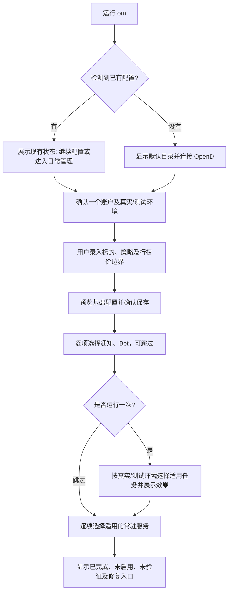

# OM 人工 CLI 产品方案与重构 PRD

状态：2026-10-04 用户确认按本文的首次安装、日常管理与命令收敛目标实施；已进入 Gateflow。本文中的目标入口仍不能当作已发布版本的操作说明。

产品方案由 GPT-6 Astra 推导，主会话核查代码并补充后续决定。本文是 CLI 产品需求正文；本轮授权源码实现、验证、提交推送和 Draft PR，发布与部署另行授权。

## 1. 目标与设计方法

让普通用户从首次安装走到一次结果可解释的运行，并能在日常管理中完成调整、排查与恢复。成功标准是用户完成任务、看懂结果及下一步；顶层命令数量不作为验收指标。

设计顺序：**用户场景 → 具体任务 → 最小必要能力 → 复用现有能力 → 交互与命令归属 → 验收**。

只设两大用户场景：首次安装、日常管理。故障排查、高级维护属于日常管理中的任务。菜单按场景组织；直接命令按账户、标的、Bot、通道等稳定职责组织。同一能力可服务多个场景，不因场景不同再造一套配置或执行逻辑。

奥卡姆取舍：

- 每项新增能力必须对应本表中的真实任务；相同语义只保留一个推荐入口。
- 先复用现有配置发布、凭证存储、策略操作和运行查询，不新增通用配置平台、安装进度数据库或另一套执行引擎。
- 保留用户明确需要的高级能力，以及权限、校验、预览、回读和失败恢复。减少默认帮助中的负担，不以隐藏命令冒充完成合并。
- 命令存在只证明入口存在。交互菜单中的“配置”“编辑”“添加”必须能完成该任务；需要外部登录时明确暂停点和返回方式。

## 2. 已确认的产品边界

| 决定 | 当前有效规则 | 确认依据 |
|---|---|---|
| 配置位置 | 使用平台默认目录并显示位置；普通用户不必选择，高级调用可显式指定 | 用户：“这个不需要用户选择吧？”及后续 PRD 共识 |
| 账户 | 首次只完成一个富途账户；日常再加第二个；同市场账户共享标的 | 用户：“安装走完一个账户”“同市场账户共享标的” |
| 账户映射 | 在账户接入步骤明确 OM 账户与富途账户 ID、OpenD 端点、真实/测试环境；不能通过 ID 猜环境 | 用户要求覆盖映射和 OpenD 测试账户 |
| 标的 | 必须由用户输入，不写示例标的；明确 CSP、CC 或 both；CSP 必填 max strike，CC 必填 min strike，另两界可选 | 用户：“不要写入示例标的”“csp 必填 max strike，cc 必填 min strike” |
| 直接命令 | 仅有 `om symbols add NVDA` 不构成有效新增；缺策略或必填边界时拒绝 | 用户明确否定不附加参数的新增 |
| 可选接入 | 通知、Bot LLM、常驻服务逐项询问、允许跳过；跳过显示未启用 | 用户选择“逐项询问、允许跳过” |
| 凭证 | 终端隐藏输入或系统凭据存储；不通过 Agent 对话框或命令参数传入密钥 | 用户要求避免在 Agent 输入框输入 |
| 命名 | 人工产品统一为 `om bot`；`om-agent` 仍为外部 Agent/脚本的结构化 Tool Gateway | 用户：“收敛到 om bot” |
| 帮助与列表 | 保留面向人的 help 和高级命令；不增加等同帮助的全局 ls；领域 list 服务真实查看任务 | 用户要求 human help、保留高级配置 |
| Holdings | 保留 Holdings 配置命令；不再作为账户类型，不回填富途账户数据或账本 | 用户：“增加holdings的配置命令”“退役external_holdings账户相关的代码” |
| Portfolio Exposure | 始终可用；Holdings 默认关闭，关闭时评估富途，开启后纳入其他来源；显示已观测 broker、market、来源与时间，不声称完整覆盖 | 功能配置会话及其实现会话的后续用户确认 |
| Exposure 口径 | 沿用所有未平仓卖出期权均被指派的情景；不改成 PM 的当前持仓分布 | 用户纠正后确认：“是，沿用指派后情景” |
| Close Advice | 默认开启，日常可关闭并重新开启；关闭不应删除历史结果 | 功能配置会话中用户：“默认开启，然后可以在日常管理中关闭” |

后续确认来自功能配置会话 `01a0ed67-eaec-7790-9787-9dad5892337e` 和实现会话 `01a0ed83-179b-7882-be6c-b9d58c9c0a3b`。后者当前还明确要求聚焦 Holdings 配置，具体实现范围仍由其收口。

这些新决定替代旧稿“开启全局持仓风险”“Holdings 是风险功能启用前提”的要求。有效任务名称改为“纳入 Holdings 数据”；不新增 Portfolio Exposure 总开关。旧账户退役与存量迁移由会话 `01a0ed2b-1dc8-7c33-baed-63127ed62982` 负责。

## 3. 设计时的实现基线与缺口

核查基线：`codex/setup-symbol-selection`，HEAD `3085bca9dd5055061c7e62efc7df4bee0884ce04`，包含原有未提交的 CLI、配置、测试和文档改动。该检出与本地 main 已有差异，本轮未 fetch，不能称作远端最新代码；未检查部署状态。

| 已核实的现状 | 本次目标与复用边界 |
|---|---|
| `om help all` 列出 34 个顶层命令；PRD 原收敛表未覆盖全部 | 第 6 节逐项给出处置，不再把部分任务表当最终命令全集 |
| `setup init` 已有标的、策略、边界输入和配置发布，但仍询问目录、允许账户 ID 占位；生成默认启用的 Assistant/Bot 配置 | 复用发布与回读，补齐默认目录、明确账户环境和可选接入；未完成配置不得宣称可运行 |
| 首页中 OpenD、通知、Bot 的若干选项仅打印说明；日常菜单只有状态、简报、诊断和查看标的 | 改为能完成任务的交互流程；外部安装和登录保留明确交接点 |
| `accounts` 只有 add/edit/remove；真实/测试环境尚未在该 CLI 完整暴露 | 补 list、账户环境与路由核对，复用账户 authoring owner |
| `symbols` 与 `config symbol set` 交叠；后者含 Combo 专用字段 | 推荐入口统一到 symbols；字段、安全及输出等价后才转发旧入口，不能直接删掉能力 |
| `settings` 只有 inspect/doctor/explain；secrets 已有隐藏输入和存储操作 | settings 保持环境来源诊断；业务配置留在所属领域，向导复用 secrets |
| `assistant`、`bot` 的模型、消息控制、只读问答、任务管理职责不同 | 按子命令合入 bot，保留只读与控制动作的权限差异 |
| Feishu 传输在 inbound，微信传输在 channel | 建议同归 channel；先清点服务与网关调用，不改变传输行为 |
| portfolio 已有 assignment-scenario | 沿用指派情景口径；Holdings 配置衔接独立方案，不新增另一种资产分布产品 |
| OpenD 体验扫描要求 SIMULATE、手动执行及 no-send | 首次向导必须给测试账户独立分支，不能直接套真实账户定时运行步骤 |

证据路径及本轮核查局限见第 10 节。上述是源码和帮助证据，不代表对应功能已在真实环境验证。

## 4. 从场景到任务

### 4.1 首次安装

以下编排顺序为建议，复用第 2 节已确认的产品边界。

| ID | 用户任务 | 必要能力 | 完成或暂停条件 |
|---|---|---|---|
| F1 | 安装后找到入口 | 安装完成可使用全局 `om`，提供继续首装的提示；识别系统与默认目录 | 命令可用；检测到已有实例则展示已有配置，不静默覆盖 |
| F2 | 连接 OpenD | 展示默认端点，可修改；指导用户完成 OpenD 安装和登录；只读检查连接 | 连接/登录证据独立呈现；不可连接时可继续准备离线配置 |
| F3 | 绑定一个账户 | 选择市场、真实或测试环境、账户标签和富途 ID；可读到列表时辅助选择，否则明确手工输入待验证 | 映射无歧义；仅完成该账户已确认支持的市场；其他市场若需另一账户，留到日常添加；离线映射显示待验证 |
| F4 | 输入监控标的 | 用户输入代码，规范化市场与代码；逐个设置 CSP/CC/both 及必填边界 | 每个所选市场至少有用户录入的有效标的；缺字段返回对应输入项 |
| F5 | 保存基础配置 | 预览账户、市场、共享范围、策略边界和输出位置；确认后构建、回读 | 成功显示保存结果；失败明确哪些已写入、哪些未生效 |
| F6 | 选择通知 | 询问是否启用；配置支持的通道和接收目标，隐藏录入凭证 | 可跳过；配置成功与测试投递分别报告 |
| F7 | 选择 Bot | 询问是否启用；选择模型、录入密钥、检查配置 | 可跳过；配置检查不冒充真实模型调用成功 |
| F8 | 做一次运行并查看结果 | 展示本次范围与可能副作用；用户选择后运行；默认不发送通知、不启动服务；打开对应结果 | 合法无候选、证据不足、执行失败可区分；可以跳过并显示尚未运行 |
| F9 | 选择常驻服务 | 逐项询问；展示该账户环境支持的服务、计划和影响；确认后执行受控服务流程 | 可跳过；服务文件已生成、已安装、实际运行分别报告 |
| F10 | 知道完成到哪一步 | 汇总配置、账户接入、一次运行、通知、Bot、服务状态及下一步 | 不用一个“全部就绪”遮蔽未验证项；能返回缺失步骤 |

首次结束不强制用户开启 Wheel、Combo 或 Holdings；展示这些可选能力的用途与日常入口。Close Advice 的默认开启状态也需可见，但不能把“已配置开启”写成“已成功评估持仓”。

### 4.2 日常管理

建议导航分组只用于菜单，不新增对应顶层命令。

| ID | 菜单任务组 | 用户任务 | 功能归属及完成条件 |
|---|---|---|---|
| D1 | 查看结果 | 看最新简报、运行是否正常、为何没有结果 | daily-brief/status；显示时间、市场和账户范围，无结果不等于零候选 |
| D2 | 账户与标的 | 查看、增加、编辑或移除监控标的 | symbols；策略和边界校验贯穿所有写入口，预览同市场受影响账户 |
| D3 | 账户与标的 | 添加第二账户、修改映射或移除账户 | accounts；列表可选目标，共享现有标的；说明移除对未来运行和历史数据的影响 |
| D4 | 账户与标的 | 增加另一市场 | 使用账户与标的的同一配置能力，录入该市场标的并预览；不重跑首装覆盖旧市场 |
| D5 | 通知与 Bot | 添加/更换/停用通道与接收目标 | channel；区分出站通知与入站 Bot 消息，验证正确目标 |
| D6 | 通知与 Bot | 启用/停用 Bot、更换模型、问答、查看或取消任务 | bot；模型与凭证检查、只读问答和受控操作的效果清晰 |
| D7 | 通知与 Bot | 录入、轮换、删除凭证 | secrets；不打印值；明确受影响消费者及是否需重载，不暗中重启服务 |
| D8 | 策略与持仓分析 | 调整 CSP/CC 与 Combo 的标的参数 | symbols；保留高级参数及来源解释；Combo 启用规则接独立设计结果 |
| D9 | 策略与持仓分析 | 开启/关闭 Wheel、接受策略变更、处理生命周期 | wheel；复用 activation 与 accept-policy，不增加第二套 enabled 开关 |
| D10 | 策略与持仓分析 | 关闭或恢复 Close Advice，查看已有建议 | close-advice 所属领域；默认开启，关闭保留历史并显示明确状态 |
| D11 | 策略与持仓分析 | 查看 Portfolio Exposure，配置是否纳入 Holdings | portfolio assignment-scenario 与目标 holdings configure；沿用指派情景，只标已观测数据范围 |
| D12 | 策略与持仓分析 | 查看期权持仓、审阅成交、处理修复/回放/作废 | option-positions/trade-events/wheel；保留账本权威、预览、幂等和审计 |
| D13 | 策略与持仓分析 | 查看收益表现、现金空间及研究证据 | option-performance/sell-put-cash/research；保留各自数据和计算语义 |
| D14 | 运行与维护 | 手动扫描、运行整轮任务、看平仓建议 | scan/close-advice/run；明确任务的读取、持久化与发送范围，不能笼统叫“运行” |
| D15 | 运行与维护 | 启停常驻运行、检查服务和计划 | service；复用平台受控流程，实际服务操作能力缺口需补齐 |
| D16 | 运行与维护 | 排查无结果、连接失败、配置未生效 | status → 相关 runs/logs/doctor → 具体领域修复；避免让用户顺序执行所有检查 |
| D17 | 运行与维护 | 检查新版、升级或回滚 | update；针对已发布版本，单独预览并确认，不隐含发布 |
| D18 | 运行与维护 | 高级配置、质量核对、证据归档或缓存修复 | 完整帮助保留 config/settings/healthcheck/support/quality/scheduler/multiplier-cache 等入口及副作用说明 |

## 5. 交互方案与行为合同

### 5.1 建议的首次主线

继续配置根据已有配置、凭证是否存在和当前检查证据恢复；不把旧绿色检查当最新连接证据。不新增独立安装进度数据库。已保存基础配置后退出，不删除正确配置，也不要求重新创建一套配置文件。

真实账户路径与测试路径必须分开说明。SIMULATE 体验扫描沿用现有手动 `run tick --experience --no-send` 契约并完整复用现有请求校验：明确演示假设、不读取账户资产、不发送通知、不写正式金融账本、不接入定时体验扫描、不激活或推进 Wheel。普通 SIMULATE 扫描与显式体验模式不可混为一谈。通道或 Bot 可以单独配置，但不能因此允许发送体验扫描结果。真实账户首次验证运行也默认不发送通知、不启动服务；通知测试和服务启用分别确认。

### 5.2 建议的输入、预览与恢复

- 交互菜单收集用户完成该任务所需的参数，显示实际调用效果；熟练用户可直接运行领域命令。非交互环境缺参数直接报错，不悬挂等输入。
- 直接新增标的仍须指定策略和必填边界；不能把裸 `symbols add` 或仅有代码的形式当成默认策略新增。菜单可提问，完整命令不得依赖隐含策略。
- 编辑保留未修改的有效值，校验修改后的完整配置，不要求重填未变字段。开启原来关闭的一侧时须补齐该侧必填边界；关闭一侧时不再要求其生效边界。
- 可唯一确定的市场在菜单中展示并确认；多市场或代码歧义时要求选择。直接命令的参数别名和自动推断规则作为第 9 节建议确认，不默默跨市场写入。
- 变更预览包含新旧值、市场/账户/标的范围、共享影响、生成配置及外部效果。确认后复用已有发布、备份、源版本检查与回读；配置在预览后变化时，旧预览失效。
- 基础配置、系统凭证、通知测试、服务操作分别确认和报告。服务失败不能声称已撤回已经发出的消息；密钥已存储时也不能在取消后笼统说“完全未写入”。
- 首次配置前取消不写入；某阶段完成后退出保留已确认结果。重进只处理未完成或明确要求修改的部分。外部效果不明先核对回执，不默认重发。
- 普通日常变更不要求用户手工补做 YAML 构建或编辑生成 JSON。构建或回读失败时明确未生效/部分失败，并给出已有恢复路径。

日常变更示例：用户选择已有标的 → 修改 CSP 最高行权价 → 看到同市场全部受影响账户及新旧值 → 确认 → 发布并回读 → 查看有效值。若 OpenD 不可用，正确配置保持已保存，连接显示失败；不使用 Holdings 补成账户事实，也不以此回滚用户的正确修改。

### 5.3 帮助和状态

`om` 在 TTY 提供两大场景的交互导航；`om help`、`om --help` 提供简洁任务帮助；`om help all` 按领域列出全部有效命令、专业维护入口及兼容标记。每个领域支持 `--help`。默认帮助中的新手路径只能指向一个推荐入口。

新增只读 `accounts list`；保留 `symbols list`。不新增作为帮助别名的全局 `ls`。领域列表回答“有哪些对象”，help 回答“可以做什么”。

状态基于现有事实分别表达：是否配置、是否选择启用、依赖检查结果、最近执行结果及证据时间。跳过可选能力是正常状态。连接失败、数据过期、配置不一致、合法无候选和没有运行记录不能合并。状态查看不能暗中刷新业务数据、扫描、投递或修复。

## 6. 命令全集的推荐归属

本表的命令归属已纳入本轮确认范围；“高级保留”表示完整帮助可发现、默认任务导航按需引导，不代表退役。本轮保留旧入口兼容，不设自动删除日期或版本。

| 当前顶层 | 建议处置 / 推荐入口 | 依据与限制 |
|---|---|---|
| healthcheck | 高级保留 | 就绪检查有独立消费者；不把所有健康检查等同 doctor |
| doctor | 保留 | 人的故障定位入口，给出具体下一步 |
| support | 高级保留 | 收集脱敏支持材料，区别于状态查询 |
| assistant | 人工推荐迁入 bot，旧入口兼容后退役 | 逐子命令保持行为、输出及权限，不做盲目整组重定向 |
| bot | 保留并补齐 | 统一模型、问答、控制、任务与审计的人工入口 |
| inbound | 建议归 channel，原入口保留兼容 | Feishu 事件/长连接与微信传输归同一职责；服务调用方需迁移 |
| status | 保留 | 汇总已有运行证据及下一步 |
| runs | 保留 | 查询业务运行历史；区别于 bot runs |
| logs | 保留 | 读取诊断日志和运行审计，不引入重命名迁移 |
| research | 高级保留 | 研究证据采集、归档与清理，不等同 support |
| scan | 保留 | 机会扫描与完整 tick 的效果不同 |
| close-advice | 保留 | 运行与启停配置按领域方案衔接，默认开启 |
| notify | 高级保留 | 当前主要为内容 preview；不能冒称完整投递管理 |
| channel | 保留并收拢传输入口 | 通道、接收目标、连接及状态；首装和日常复用 |
| accounts | 保留，新增 list | 查看、选择、增改删账户及映射 |
| config | 高级保留 | 初始化底层能力、校验、构建、解释；symbol 编辑收敛到 symbols |
| settings | 高级保留现有诊断语义 | 环境设置的 inspect/doctor/explain；不扩成通用业务设置中心 |
| secrets | 保留 | 凭证录入、状态、轮换与删除；业务向导复用 |
| version | 高级保留 | 读取源码 VERSION 与远端 tags；与运行实例的 update check 契约不同 |
| scheduler | 高级保留 | 调度状态与 mark 等操作不等同管理 OS 服务 |
| sell-put-cash | 高级保留 | 现金空间查询有独立语义，未证实可无损并到 accounts |
| service | 保留 | 服务生成、检查、运行管理；当前缺失的启停交互需复用平台流程补齐 |
| update | 保留 | 已发布版本检查、验证、应用与回滚 |
| multiplier-cache | 高级保留 | 合约乘数维护，显示写入性质 |
| setup | 保留 | 完整首次引导；check 保留离线检查语义 |
| option-performance | 保留 | 收益报告及证据维护，不混入普通资产分布 |
| portfolio | 保留 assignment-scenario | Portfolio Exposure 沿用指派情景；不新造 PM 当前持仓计算 |
| daily-brief | 保留 | 日常阅读结果的主入口 |
| quality | 高级保留 | 状态、刷新及维护操作有不同效果，不泛化为 doctor |
| symbols | 保留，收拢标的编辑 | 监控集合及标的策略的人工入口 |
| option-positions | 保留 | 期权账本投影和专业工作流 |
| wheel | 保留 | activation、策略接受与生命周期保持既有领域语义 |
| trade-events | 保留 | 审阅、修复、回放和作废各有明确效果 |
| run | 保留，具体任务按需进入菜单 | tick、cron 和摄取等操作，不变成所有功能的统一容器 |

目标新增入口 `om holdings configure` 保留用户已要求的配置能力。它管理是否纳入 Holdings 数据及所需配置，不是 Portfolio Exposure 总开关；准确字段、启用确认和状态展示范围以独立方案为准。本 CLI 任务不另造 holdings CRUD 或第二套持仓账本。

明确的子命令收敛方向：

- `assistant model ...` → `bot model ...`；控制能力、pending、audit 等归 bot 下相应任务。
- `assistant handle` 和 `bot run` 保留不同语义：控制消息与只读问答不能互换；upgrade-worker 保留高级受控执行边界。
- `inbound feishu/feishu-ws` → channel 中的 Feishu 传输入口；具体子命名建议在兼容表中一并确认。
- `config symbol set` → `symbols edit` 的同等能力；须先证明 Combo、策略边界、预览、回读和旧调用方都覆盖，再转发或退役。
- `config init` 保留高级脚本入口，首次安装只推荐 setup；内部复用同一配置能力。

内部 assistant 配置键、模块名、生成文件和外部网关引用属于明确的兼容清单。人工命名统一不代表这些内部名字已迁移，也不要求只为字面一致重命名全部内部实现。

## 7. 高级功能、范围与数据边界

| 功能 | 本方案中的入口和边界 |
|---|---|
| CSP / CC | 用户在标的任务中选择并约束；参数继承来源和实际生效值可查，缺必填边界不写入 |
| Combo | 通过标的策略任务发现；当前代码按标的开关，最终配置规则接独立设计；不擅自新增全局开关 |
| Wheel | 当前按市场与账户 activation 操作；复用一次操作串联发布与回读，策略变化走 accept-policy；不以关开窗口替代接受策略 |
| Close Advice | 默认开启，日常显式关闭/恢复；缺证据不得表示无需平仓，关闭不删除历史结果 |
| Portfolio Exposure | 所有未平仓卖出期权均被指派的情景，沿用现有 portfolio 入口；与当前实际资产分布清楚区分 |
| Holdings | 仅供 Exposure 场景的可选数据源；默认关闭；仅标已观测范围，读取失败/缺失不得显示零持仓或完整覆盖 |

富途账户当前现金、持仓以该账户券商证据为准；本地期权状态以 SQLite 事件账本与投影为准。差异保留并显示。Holdings 不作为账户类型、富途失败回退或期权账本写入来源。

旧 external_holdings 的处置由独立交付负责。CLI 应接入其最终迁移说明，不自行发明第二套迁移命令；不静默删除旧账户、转为富途账户或把旧数据自动并入 Exposure。删除一个监控对象或停用一个功能，不能隐含删除历史账本。

macOS 与 Linux 使用相同任务、术语和结果判定，底层分别复用对应服务与凭证方案。不能用 Linux 模拟通过证明 macOS 实际可用；凭证还必须由实际服务运行身份读得到。

## 8. 验收计划

本节为目标验收标准，已纳入 2026-10-04 确认的实施范围。源码验证与真实环境验收分开记录；后者须在授权的目标环境进行。具体实现与测试证据以交付 PR 为准。

| ID | 输入与场景 | 可观察通过条件 | 证明方法、环境与边界 |
|---|---|---|---|
| A1 | 无配置的首次用户从 om 进入安装 | 默认目录可见且无需选择；一账户、用户标的和边界可完成保存；每个配置菜单真正执行对应流程 | 扩展现有 tests/test_cli_home.py 与 tests/test_setup_init_cli.py，临时目录+TTY输入驱动；不证明外部接入 |
| A2 | 新增缺策略/必填边界；编辑开启新策略但缺边界、上下限倒置；只修改一个有效字段 | 新增和编辑后的无效配置在所有写入口一致拒绝，文件与快照不变；合法编辑保留未变字段；无示例标的 | 覆盖 setup、symbols 与旧 config symbol facade；复用 tests/test_cli_symbols_authoring.py、tests/test_symbol_mutations.py 的隔离契约 |
| A3 | REAL、SIMULATE、ID与环境不匹配、OpenD不可达 | 映射和缺口可见；不换账户；体验扫描严格维持手动/no-send等边界 | CLI场景测试+隔离OpenD元数据；真实连接另需用户授权的OpenD环境，模拟不证明登录成功 |
| A4 | 基础配置后退出、存量重进、确认前取消、过期预览、写入失败 | 按阶段保留已确认结果；取消不多写；不覆盖新配置；回读和恢复提示反映实际状态 | 扩展现有首装与配置发布故障注入测试，在临时目录验证源文件、生成快照与记录；不新建状态数据库 |
| A5 | 首次跳过通知/Bot/服务，日常再启用；配置通过但外部失败 | 未启用、已配置未验证、验证失败分别呈现；不可误报就绪 | 菜单和检查输出断言；模型调用/投递/服务实测分别安排，经授权后记录结果与时间 |
| A6 | 添加同市场第二账户，再改共享标的 | accounts list 可查映射；复用共享标的，预览列出全部受影响账户；移除不删账本 | 账户/标的 facade 与临时生成配置回读，参照 tests/test_account_scope_authority.py |
| A7 | 密钥录入、轮换、取消及服务消费 | 参数、预览、日志、错误和对话不含明文；区分已保存与未保存；服务身份可读取 | 复用 secret_ops 的隐藏输入测试；macOS/Linux本地存储与服务身份实测需要对应环境和授权 |
| A8 | 旧 assistant/inbound/config symbol 调用与新入口 | 同输入保持业务效果、权限、输出和失败语义；帮助只推荐新人工入口 | 子命令兼容对照；服务模板/网关调用方清点，副作用用隔离适配器，关键集成单独验收 |
| A9 | Holdings关闭、配置完成、读取失败；只见部分broker/market | Exposure 始终可进入且保持指派口径；不把可选数据源当总开关；只展示有证据的范围 | 与独立方案的配置/状态验收集成；外部表读取实测须授权，不能靠配置存在证明完整数据 |
| A10 | Wheel启停、策略变化；Close Advice关闭/恢复；Combo参数 | Wheel不出现第二套开关；Close Advice状态准确且历史保留；Combo遵守最终确认的范围 | 复用各领域测试，增加菜单到现有操作的集成验证；独立功能交付未完成部分标依赖 |
| A11 | 无结果、无候选、失败运行；查看结果后手动运行/升级 | 状态和证据时间可辨；查看无隐含执行；执行前范围与副作用明确；不自动发布或重发 | 运行/诊断入口隔离测试；真实服务/升级验收需指定环境、目标和授权 |
| A12 | 两个平台首次与日常帮助、README及完整命令表 | 两大场景能找到全部承诺任务；高级能力可发现，文档只写已实现命令，34项无失联 | CLI帮助快照、表单人工走查、文档链接/命令核验；macOS和Linux各自做目标环境验收 |

后续实现者负责离线与集成验证，环境操作者负责授权外部验收。缺真实凭证、OpenD或服务环境时，交付应列出未验证项，不能以模拟测试替代。

## 9. 取舍、依赖与交接状态

本轮建议优先顺序：先补“完整首装”和“可完成的日常账户/标的变更”，随后完成 Bot 与通道归属收敛、接入独立功能配置。高级命令优先保持现有行为；未证实重复的入口不做纯命名搬迁。

反例复核及裁决：

- 固定六个命令无法自然容纳账本、策略与运维；取消数量目标，保留稳定职责。
- 首装把所有外部效果装入一次确认，会使失败恢复无法解释；采用阶段性确认与各自回读。
- 只改 help 不能让用户配置通知、模型或第二账户；验收必须从菜单走完操作。
- Holdings 总开关会阻断只有富途的用户；替换为可选数据源配置，沿用已有指派情景。
- 显式体验模式不能接入定时扫描；普通 SIMULATE 工作流是否支持常驻，按其现有契约核实，不从体验模式推导。
- 将 config symbol set 直接删除会丢失字段/调用方；先做能力与确认契约对照。

实施时已收敛的产品/集成事项：

1. 用户已确认完整向导与恢复、日常管理任务、第 6 节命令归属，按可完成的用户任务验收。
2. assistant/inbound 按子命令复用原 handler，保留兼容；人工推荐入口改为 bot 与 channel。内部配置键和网关契约保留。
3. 2026-10-04 已核对主线：external_holdings 已退役；Holdings 使用现有 PM non_futu 包含开关及 broker 批准集合，保留 source/preview 双摘要和预检。Close Advice 使用现有 enabled 默认 true；Combo 保留既有标的参数，不发明新规则。
4. macOS/Linux 复用现有 renderer/profile，补齐基本安装、启停和状态回读；账户 facade 明确 REAL/SIMULATE。真实平台、OpenD、凭证和投递验收仍需对应环境授权，隔离测试不替代外部事实。

当前实施由用户显式请求的 Gateflow 执行，计划与审查保存在仓库忽略的过程目录中；按该流程完成 Planreview、实现审查、整体 Deepreview 和 Draft PR 审查。

## 10. 核查证据与限制

本轮实际读取并沿链路核对：

- [CLI首页](../src/interfaces/cli/home.py)、[解析与路由](../src/interfaces/cli/main.py)、[首装入口](../src/interfaces/cli/setup_ops.py) → [配置生成与发布](../src/application/config_yaml_init.py) → source/runtime/root record 的写入、验证和失败清理 → 用户结果；对应 [首装测试](../tests/test_setup_init_cli.py)、[首页测试](../tests/test_cli_home.py)。
- [账户入口](../src/interfaces/cli/account_ops.py)、[标的入口](../src/interfaces/cli/symbols.py)、[旧配置入口](../src/interfaces/cli/config_ops.py) → [标的修改与发布](../src/application/config_yaml_symbols.py)；验证策略必填字段、共享市场范围及已有发布调用。
- [凭证入口](../src/interfaces/cli/secret_ops.py) → 系统存储 provisioner；确认隐藏输入、TTY要求和取消/删除边界。[settings](../src/interfaces/cli/settings_ops.py) 仅作环境来源诊断。
- [Bot](../src/interfaces/cli/bot_ops.py)、[assistant](../src/interfaces/cli/bot_ops.py)、[inbound](../src/interfaces/cli/inbound_ops.py)、[channel](../src/interfaces/cli/channel_ops.py) 的解析和路由；确认读问答、控制和传输不可混为同一语义。
- [portfolio](../src/interfaces/cli/portfolio_ops.py) 保留 assignment-scenario；[运行入口](../src/interfaces/cli/run_ops.py) → [体验模式门禁](../src/application/experience_mode.py)；核对 SIMULATE、手动与 no-send。
- [操作入口](../src/interfaces/cli/operator_ops.py)、[服务入口](../src/interfaces/cli/service_ops.py) 及 Astra 读取的其他领域命令；[version](../src/application/version_check.py) 与 [upgrade check](../src/application/service_upgrade.py) 的版本来源和运行实例处理不同。

设计阶段仅运行帮助命令、静态阅读与文档检查；后续实施增加隔离配置、菜单、服务与回执回归测试。未运行真实扫描、通知、模型调用、账户读取或服务变更。34 项处置中的高级保留是兼容选择，不代表所有业务领域已完成全面审计。

外部参考只支持交互机制，不决定 OM 的业务边界：[Command Line Interface Guidelines](https://clig.dev/#help) 支持帮助发现、明确反馈、TTY交互与可脚本化操作；[GitHub CLI 完整命令参考](https://cli.github.com/manual/gh_help_reference) 展示核心与附加命令分组。本文据此建议渐进展示，未把“少量推荐入口”等同于删除高级能力。

源码证据的版本/字节核验使用 PRDflow code gate；它只核验记录完整性与版本，不能证明产品语义或真实环境效果。整体 ready 收口留待第 9 节中影响合同的事项明确后执行。
