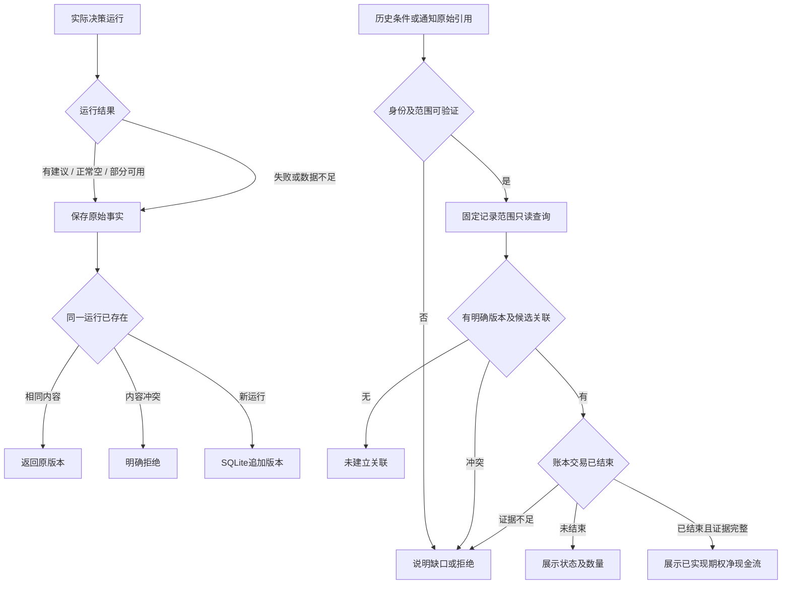

# 决策历史与交易关联查询 PRD

Status: approved product contract; implementation in review. Owner: this document.

操作入口、数据文件和迁移边界见 [决策历史操作说明](DECISION_HISTORY.md)。

## Goal and authorization

让账户管理者可靠查询当时的候选与动作建议、已有明确交易关联，以及关联交易当前状态/已实现结果。用户已逐项确认下列规则，并明确调用 Gateflow 实施，再确认隔离工作分支。实施、检查、提交、推送和 draft PR 已授权；不包含 merge、release、生产升级、真实历史导入、通知或交易。

## Approved contract

1. SQLite 是决策历史唯一权威来源。JSON/报告/通知为导出或展示产物；旧JSON是校验后导入的输入。交易事实继续归现有SQLite账本，不复制一套交易账本。
2. 每次实际决策运行保存结果，区分有建议、正常无候选、失败/数据不足；部分成功保留有效部分。没有记录不等于没有候选；保存失败必须明确，失败不得伪造建议。
3. 每次运行保存新的不可覆盖版本；同一运行重复写入幂等，内容冲突明确拒绝。关联指向具体版本及候选。
4. 最小事实：账户/市场/物理账户与实盘模拟身份、运行与来源版本、发生/证据时间；候选合约/策略/排序/动作状态/已记录理由和必要指标/容量/风险/缺口；已有明确关联及数量依据。缺失不补造，当前规则不重算历史。
5. 可验证来源、身份、版本的旧JSON可以导入。缺字段保留缺口；不可验证或冲突列明原因；重复导入不重复记录。导入后的读取不依赖旧JSON，不能宣称未核验的全历史覆盖。
6. 两入口：账户/市场/日期范围/可选标的的历史查询，以及历史通知的原始决策引用。范围不明确补充必要字段；权限不足拒绝；不得跨账户/环境混合。同一次查询固定决策记录范围，翻页不混入新增数据；刷新纳入新增。
7. 通知只定位原始决策版本。发送重试引用原内容；缺失或无法验证时提示并可转历史查询，不猜另一报告、不展示发送状态、不推断候选已被看到。
8. 只沿可验证到具体版本/候选的明确交易关联展示结果。仅同合约、相近时间、策略归属或规则匹配都不足；无关联显示“未建立关联”，冲突说明无法确认。不补录、不推测、不等同于未采纳或没交易。
9. 未结束展示持仓状态及“未结束”；已结束展示账本确认的已实现结果；证据不足“结果不可用”及原因。不显示浮动盈亏。保留币种、数量、乘数与费用缺口，不混加币种、不默认乘数、不无依据分摊或重复计数；期权现金流不改称股票加期权总收益。
10. 区分正常空、部分可用、不可用；局部缺口不掩盖有效记录。SQLite不可用不能回退JSON为第二权威。账本纠正后刷新可更新结果，但不改写原建议、不复活已作废事实。
11. 查询、翻页、取消、重复进入均只读，不触发扫描、发送、交易、导入或业务写入。

## Non-goals

VIX、策略调参/优化、回测、自动下单、人工关联纠正、推测匹配交易、发送状态平台、浮动盈亏、新增策略收益统计、独立看板。关联交易结果不证明全部建议效果或用户采纳动机。

## Core flows

- 运行 → 有建议/正常空/失败/部分结果 → SQLite按运行幂等保存，新运行追加版本；写失败明确报告。
- 旧JSON → 验证来源身份版本 → 可验证则导入；不可验证列原因；重试不重复。
- 两入口 → 范围与权限 → 通知引用验证（如适用）→ SQLite固定范围查询 → 空/部分/不可用分别展示 → 打开具体历史 → 明确关联/未关联/冲突 → 持仓状态/已实现结果/证据缺口。

## Acceptance contract

All tests initially planned. Isolated runtime, synthetic source/ledger and real local SQLite; public facades and independent readback required. No real provider/production effects. Developers own automated verification; operator owns separately authorized production sample acceptance.

- A1: 从真实运行路径产生有建议/正常空/失败/部分结果，独立读回；保存失败可见，失败不伪造建议。
- A2: 同次重试不增记录、新次留版本、改当前规则不改旧结论或关联目标。
- A3: 从导入入口预览并导入有效/缺字段/冲突/重复源；重复幂等，隔离环境源文件移除后仍可读。
- A4: 公开查询隔离账户/环境/市场；歧义拒绝；多页并发新增不漏不重，刷新可见；空/部分/不可用准确。
- A5: 通知重试来源不同仍指向原版本；缺失/错误引用不猜测，可返回历史查询。
- A6: 明确、规则匹配、无、冲突及分笔关联；仅明确展示交易，数量不重算或猜分配。
- A7: 未结束、结束、费用/乘数缺口、多币种；账本纠正后结果更新、决策不变，无浮盈。
- A8: 查询/翻页/取消/重复无业务写入或外部调用；前后数据及调用拦截证明。

## Confirmation and baseline

用户明确确认SQLite唯一权威，并依次选择A确认全运行结果、追加版本幂等、旧记录校验导入、仅明确关联、未结束不算最终结果、查询范围固定、通知仅定位版本。此前双入口/身份/部分结果决定持续有效。替代旧稿JSON直接承载历史与通知状态/匹配交易展示。

Source baseline for implementation: origin/main 83135c0825ef796c40ef65e572e8d849362cb381, fetched and checked 2026-10-07. Prior analysis checkout 5ee2a559 is superseded for implementation. Source-only evidence; production version, retention and sample coverage unverified. Tables/file placement and supported facade details belong to implementation design, not extra product scope.
