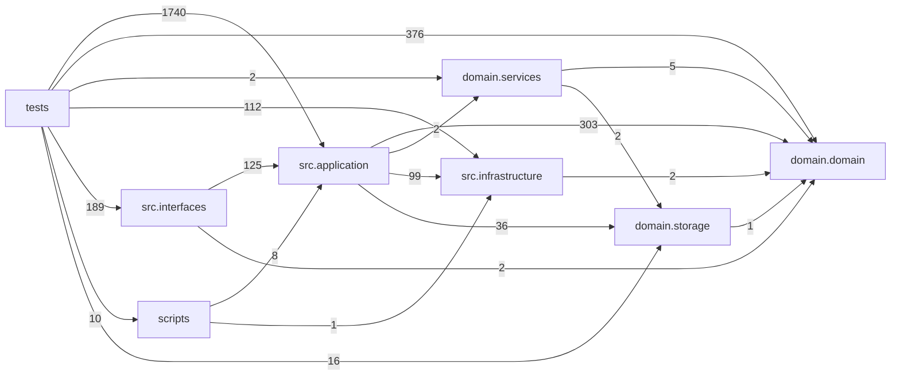

# Dependency Graph

Generated by `./.venv/bin/python scripts/generate_dependency_graph.py` from the current working tree.

Check mode:

```bash
./.venv/bin/python scripts/generate_dependency_graph.py --check
```

Limitations: this captures Python import edges only. It does not see dynamic imports, subprocess calls, shell entrypoints, runtime config references, Feishu/OpenD API coupling, or data-flow dependencies through files and SQLite.

## Summary

- Python files scanned: 760 (`src`: 414, `domain`: 64, `scripts`: 7, `tests`: 275)
- Internal import edges: 4425 total, 1951 production/script edges excluding tests
- Parse errors: 0
- Boundary guard status: **PASS**
- Production module cycles: 0
- Production package cycles after compression: 2

## Layer Graph



### Production Layer Edges

| from | to | imports |
|---|---|---|
| application | domain | 303 |
| interfaces | application | 125 |
| application | infrastructure | 99 |
| application | storage | 36 |
| scripts | application | 8 |
| domain_services | domain | 5 |
| application | domain_services | 2 |
| infrastructure | domain | 2 |
| interfaces | domain | 2 |
| domain_services | storage | 2 |
| storage | domain | 1 |
| scripts | infrastructure | 1 |

### Test Layer Edges

| from | to | imports |
|---|---|---|
| tests | application | 1740 |
| tests | domain | 376 |
| tests | interfaces | 189 |
| tests | infrastructure | 112 |
| tests | storage | 16 |
| tests | scripts | 10 |
| tests | domain_services | 2 |

## Compressed Production Package Graph

The full compressed Mermaid graph is in [`docs/dependency_graph.mmd`](dependency_graph.mmd). The table below keeps the strongest package-level edges.

| from | to | imports |
|---|---|---|
| src.application | domain.domain | 172 |
| src.interfaces | src.application | 104 |
| src.application | src.infrastructure | 71 |
| src.application.ledger | domain.domain | 30 |
| src.application.ledger | domain.domain.ledger | 29 |
| src.application | domain.storage | 27 |
| src.application.positions | src.application | 23 |
| src.application | domain.domain.engine | 19 |
| src.application | src.application.ledger | 17 |
| src.application | src.application.settings | 16 |
| src.application.multi_tick | src.application | 16 |
| src.application.research | src.application | 16 |
| src.application.inbound | src.application | 15 |
| src.application | src.application.multi_tick | 14 |
| src.application | src.application.positions | 13 |
| src.application.trades | src.application | 13 |
| src.application.trades | domain.domain | 13 |
| src.application.positions | domain.domain | 12 |
| domain.domain | domain.domain.ledger | 11 |
| src.application.positions | domain.domain.ledger | 8 |
| src.application | domain.domain.ledger | 7 |
| src.application.ledger | src.infrastructure | 7 |
| src.application.multi_tick | src.infrastructure | 7 |
| src.application.positions | domain.storage | 7 |
| scripts | src.application | 7 |
| src.application.multi_tick | domain.domain | 6 |
| src.application.positions | src.infrastructure | 6 |
| src.application.trades | src.application.ledger | 6 |
| src.application.trades | src.infrastructure | 6 |
| domain.domain.ledger | domain.domain | 6 |
| src.application.positions | src.application.ledger | 5 |
| src.application.setup | src.application | 5 |
| src.application.trades | domain.domain.ledger | 5 |
| domain.services | domain.domain | 5 |
| src.interfaces | src.application.settings | 4 |
| src.interfaces | src.application.ledger | 4 |
| src.interfaces | src.application.positions | 4 |
| src.interfaces | src.application.trades | 4 |
| src.application | src.application.trades | 3 |
| src.application.ledger | src.application | 3 |
| src.interfaces | src.application.research | 3 |
| src.application.inbound | src.infrastructure | 2 |
| src.application.ledger | src.application.settings | 2 |
| src.application.multi_tick | domain.storage | 2 |
| src.application.trades | src.application.positions | 2 |
| src.infrastructure | domain.domain | 2 |
| domain.services | domain.storage | 2 |
| src.application.inbound | domain.domain | 1 |
| src.application.inbound | src.application.settings | 1 |
| src.application.multi_tick | domain.services | 1 |
| src.application | domain.services | 1 |
| src.application.research | domain.domain.engine | 1 |
| src.application.research | src.application.ledger | 1 |
| src.application.research | src.application.settings | 1 |
| src.application.setup | src.application.settings | 1 |
| src.application | src.application.research | 1 |
| src.application | src.application.setup | 1 |
| src.interfaces | domain.domain | 1 |
| src.interfaces | src.application.inbound | 1 |
| src.interfaces | domain.domain.ledger | 1 |

## Boundary Checks

No forbidden imports found for `domain.domain -> src/scripts` or `src.application -> scripts`.

This matches the current architecture rule that `domain/domain/` must not import `src/` or `scripts/`, and `src/application/` must not import `scripts/`.

## Cycles

### Module-Level Cycles

- No production module cycles detected.

### Package-Level Cycles

- 7 packages: `src.application`, `src.application.ledger`, `src.application.multi_tick`, `src.application.positions`, `src.application.research`, `src.application.setup`, `src.application.trades`
- 3 packages: `domain.domain`, `domain.domain.engine`, `domain.domain.ledger`

Package-level cycles are expected to be noisier because many flat `src.application.*` modules are compressed into broad buckets. Module-level SCCs are usually the more actionable cleanup targets.

## Hotspots

### Most Imported Production Modules

| module | incoming imports |
|---|---|
| src.application.agent_tool_contracts | 87 |
| src.application.agent_tool_config | 53 |
| domain.domain.symbol_identity | 47 |
| src.infrastructure.io_utils | 41 |
| domain.domain.option_position_identity | 39 |
| domain.domain.ledger.position_fields | 37 |
| src.application.ledger.api | 32 |
| src.application.account_config | 26 |
| src.application.settings | 24 |
| src.application.agent_tools.runtime_helpers | 24 |
| domain.domain.trade_contract_identity | 23 |
| domain.domain.engine | 21 |
| src.application.runtime_cli_format | 20 |
| src.application.shadow_replay.common | 20 |
| src.application.opend_fetch_config | 17 |

### Highest Fan-Out Production Modules

| module | outgoing imports |
|---|---|
| src.application.agent_tools.analysis | 28 |
| src.interfaces.cli.main | 26 |
| src.application.multi_account_tick | 24 |
| src.application.agent_tools.materialization | 23 |
| src.application.channels.wechat_clawbot.inbound | 23 |
| src.application.close_advice_runner | 23 |
| src.application.ledger.queries | 21 |
| src.application.agent_tools.config | 20 |
| src.application.agent_tools.diagnostics | 20 |
| src.application.multi_tick.required_data_prefetch | 20 |
| src.application.pipeline_runtime | 20 |
| src.application.agent_tools.runtime_status_impl | 19 |
| src.application.tick_notification_flow | 19 |
| src.application.account_run | 18 |
| src.application.trades.auto_intake | 17 |

## Reading

- `src.interfaces` is a thin facade by intent. Keep `src.interfaces.cli.main` as the public `om` dispatcher, and keep command-specific application imports in focused `src.interfaces.cli.*_ops` owners.
- `src.application.agent_tools` owns Tool Gateway tool metadata and execution; keep each domain `TOOLS` module aligned with registry discovery and permission tests.
- The strongest production dependency remains `src.application -> domain.domain`, which is the intended direction: application orchestration calls deterministic domain policy.
- `src.application -> src.infrastructure` is also expected, but new external-system access should stay in infrastructure adapters rather than leaking directly into domain code.
- Keep shared constants and pure config-section helpers in neutral modules rather than importing them across feature owners.
