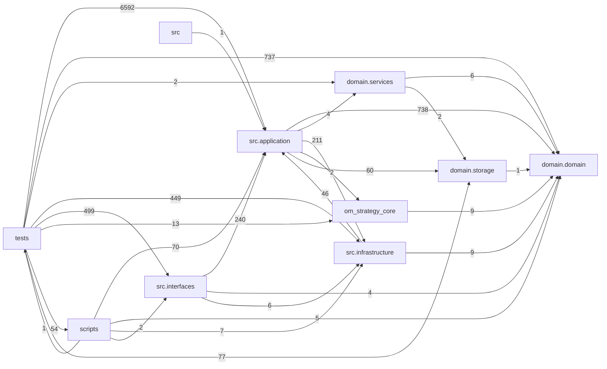

# Dependency Graph

Generated by `./.venv/bin/python scripts/generate_dependency_graph.py` from the current working tree.

Check mode:

```bash
./.venv/bin/python scripts/generate_dependency_graph.py --check
```

Limitations: this captures Python import edges only. It does not see dynamic imports, subprocess calls, shell entrypoints, runtime config references, Feishu/OpenD API coupling, or data-flow dependencies through files and SQLite.

## Summary

- Python files scanned: 1462 (`src`: 608, `domain`: 99, `scripts`: 21, `tests`: 730)
- Internal import edges: 13231 total, 4522 production/script edges excluding tests
- Parse errors: 0
- Boundary guard status: **PASS**
- Production module cycles: 0
- Production package cycles after compression: 2

## Layer Graph


```mermaid
flowchart LR
  tests["tests"]
  scripts["scripts"]
  interfaces["src.interfaces"]
  application["src.application"]
  infrastructure["src.infrastructure"]
  domain_services["domain.services"]
  domain["domain.domain"]
  storage["domain.storage"]
  application -->|738| domain
  application -->|4| domain_services
  application -->|211| infrastructure
  application -->|2| om_strategy_core
  application -->|60| storage
  domain_services -->|6| domain
  domain_services -->|2| storage
  infrastructure -->|46| application
  infrastructure -->|9| domain
  interfaces -->|240| application
  interfaces -->|4| domain
  interfaces -->|6| infrastructure
  om_strategy_core -->|9| domain
  scripts -->|70| application
  scripts -->|5| domain
  scripts -->|7| infrastructure
  scripts -->|2| interfaces
  scripts -->|1| tests
  src -->|1| application
  storage -->|1| domain
  tests -->|6592| application
  tests -->|737| domain
  tests -->|2| domain_services
  tests -->|449| infrastructure
  tests -->|499| interfaces
  tests -->|13| om_strategy_core
  tests -->|54| scripts
  tests -->|77| storage
```

### Production Layer Edges

| from | to | imports |
|---|---|---|
| application | domain | 738 |
| interfaces | application | 240 |
| application | infrastructure | 211 |
| scripts | application | 70 |
| application | storage | 60 |
| infrastructure | application | 46 |
| infrastructure | domain | 9 |
| om_strategy_core | domain | 9 |
| scripts | infrastructure | 7 |
| interfaces | infrastructure | 6 |
| domain_services | domain | 6 |
| scripts | domain | 5 |
| application | domain_services | 4 |
| interfaces | domain | 4 |
| application | om_strategy_core | 2 |
| domain_services | storage | 2 |
| scripts | interfaces | 2 |
| src | application | 1 |
| storage | domain | 1 |
| scripts | tests | 1 |

### Test Layer Edges

| from | to | imports |
|---|---|---|
| tests | application | 6592 |
| tests | domain | 737 |
| tests | interfaces | 499 |
| tests | infrastructure | 449 |
| tests | storage | 77 |
| tests | scripts | 54 |
| tests | om_strategy_core | 13 |
| tests | domain_services | 2 |

## Compressed Production Package Graph

The full compressed Mermaid graph is in [`docs/dependency_graph.mmd`](dependency_graph.mmd). The table below keeps the strongest package-level edges.

| from | to | imports |
|---|---|---|
| src.application | domain.domain | 317 |
| src.interfaces | src.application | 189 |
| src.application.ledger | domain.domain | 184 |
| src.application | src.infrastructure | 146 |
| src.application.ledger | domain.domain.ledger | 77 |
| src.application.trades | domain.domain | 67 |
| src.application.research | src.application | 59 |
| scripts | src.application | 57 |
| src.application.trades | src.application | 51 |
| src.application | domain.storage | 47 |
| src.infrastructure | src.application | 45 |
| src.application | src.application.ledger | 43 |
| src.application | domain.domain.engine | 34 |
| src.application.trades | src.application.ledger | 33 |
| domain.domain | domain.domain.ledger | 33 |
| src.application.inbound | src.application | 29 |
| src.application.ledger | src.application | 29 |
| domain.domain.ledger | domain.domain | 27 |
| src.application.positions | src.application | 26 |
| src.application.multi_tick | src.application | 25 |
| src.application | src.application.settings | 21 |
| src.application | src.application.trades | 21 |
| src.application.ledger | src.infrastructure | 19 |
| src.interfaces | src.application.research | 19 |
| src.application | src.application.multi_tick | 17 |
| src.application | domain.domain.ledger | 16 |
| src.application.trades | src.infrastructure | 15 |
| src.interfaces | src.application.trades | 15 |
| src.application.setup | src.application | 13 |
| src.application | src.application.positions | 12 |
| src.application | src.application.research | 12 |
| src.application.research | src.infrastructure | 11 |
| src.application.research | domain.domain | 11 |
| src.application.multi_tick | src.infrastructure | 10 |
| src.application.positions | domain.storage | 10 |
| src.infrastructure | domain.domain | 9 |
| src.application.positions | domain.domain.ledger | 8 |
| src.application.positions | domain.domain | 8 |
| src.application.trades | domain.domain.ledger | 8 |
| om_strategy_core | domain.domain | 8 |
| domain.domain.engine | domain.domain | 7 |
| scripts | src.application.ledger | 7 |
| scripts | src.infrastructure | 7 |
| src.application.multi_tick | domain.domain | 6 |
| src.application.positions | src.infrastructure | 6 |
| src.interfaces | src.application.settings | 6 |
| src.interfaces | src.infrastructure | 6 |
| src.interfaces | src.application.ledger | 6 |
| domain.domain | domain.domain.engine | 6 |
| domain.services | domain.domain | 6 |
| src.application.positions | src.application.ledger | 5 |
| src.application.ledger | src.application.trades | 4 |
| src.application.settings | src.application | 4 |
| scripts | src.application.trades | 4 |
| src.application.inbound | src.infrastructure | 3 |
| src.application | domain.services | 3 |
| src.application.research | src.application.ledger | 3 |
| src.application.trades | src.application.positions | 3 |
| src.interfaces | domain.domain | 3 |
| src.interfaces | src.application.positions | 3 |

## Boundary Checks

No forbidden imports found for `domain.domain -> src/scripts` or `src.application -> scripts`.

This matches the current architecture rule that `domain/domain/` must not import `src/` or `scripts/`, and `src/application/` must not import `scripts/`.

## Cycles

### Module-Level Cycles

- No production module cycles detected.

### Package-Level Cycles

- 9 packages: `src.application`, `src.application.ledger`, `src.application.multi_tick`, `src.application.positions`, `src.application.research`, `src.application.settings`, `src.application.setup`, `src.application.trades`, `src.infrastructure`
- 3 packages: `domain.domain`, `domain.domain.engine`, `domain.domain.ledger`

Package-level cycles are expected to be noisier because many flat `src.application.*` modules are compressed into broad buckets. Module-level SCCs are usually the more actionable cleanup targets.

## Hotspots

### Most Imported Production Modules

| module | incoming imports |
|---|---|
| src.application.agent_tool_contracts | 142 |
| domain.domain.symbol_identity | 104 |
| src.application.payload_helpers | 101 |
| src.application.ledger.api | 95 |
| src.application.account_config | 79 |
| src.application.agent_tool_config | 78 |
| domain.domain.trade_contract_identity | 74 |
| domain.domain.decision_state_fingerprint | 64 |
| domain.domain.option_position_identity | 62 |
| src.infrastructure.io_utils | 60 |
| src.application.runtime_paths | 54 |
| domain.domain.ledger.position_fields | 53 |
| src.application.plugin_runtime | 48 |
| domain.domain.trade_execution | 40 |
| src.infrastructure.exchange_rates | 35 |

### Highest Fan-Out Production Modules

| module | outgoing imports |
|---|---|
| src.application.ledger.api | 55 |
| src.application.trades.auto_intake | 51 |
| src.application.ledger.trade_attribution | 42 |
| src.application.multi_tick.required_data_prefetch | 38 |
| src.interfaces.cli.main | 37 |
| src.application.agent_tools.runtime_status_impl | 36 |
| src.application.pipeline_watchlist | 35 |
| src.infrastructure.futu_gateway | 34 |
| src.application.daily_decision_brief_service | 33 |
| src.application.ledger.queries | 32 |
| src.application.multi_account_tick | 31 |
| src.application.tick_notification_flow | 31 |
| src.interfaces.cli.option_positions | 31 |
| src.application.agent_tools.positions | 30 |
| src.application.channels.wechat_clawbot.inbound | 29 |

## Reading

- `src.interfaces` is a thin facade by intent. Keep `src.interfaces.cli.main` as the public `om` dispatcher, and keep command-specific application imports in focused `src.interfaces.cli.*_ops` owners.
- `src.application.agent_tools` owns Tool Gateway tool metadata and execution; keep each domain `TOOLS` module aligned with registry discovery and permission tests.
- The strongest production dependency remains `src.application -> domain.domain`, which is the intended direction: application orchestration calls deterministic domain policy.
- `src.application -> src.infrastructure` is also expected, but new external-system access should stay in infrastructure adapters rather than leaking directly into domain code.
- Keep shared constants and pure config-section helpers in neutral modules rather than importing them across feature owners.
