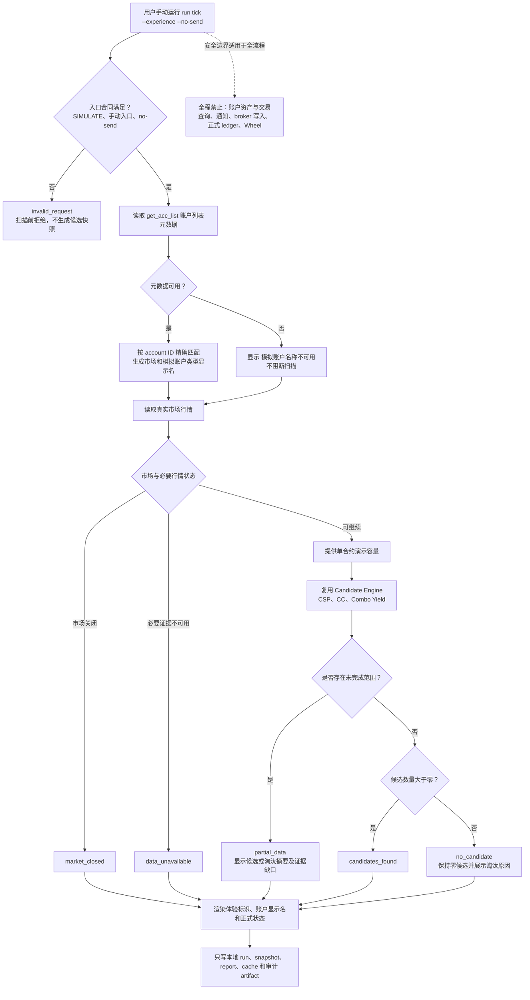

# 富途模拟账户体验扫描 PRD

- **状态**：已实现，待线上 OpenD PoC 验收
- **日期**：2026-08-27
- **产品范围**：不依赖模拟账户资产的手动体验扫描
- **适用策略**：Cash-Secured Put (CSP)、Covered Call (CC)、Combo Yield
- **明确排除**：Wheel
- **文档性质**：产品需求；不规定具体代码拆分

本文定义面向富途模拟账户用户的一次性体验模式。该模式只读取 OpenD 行情和账户列表元数据，
不读取或验证模拟账户现金、持仓和期权占用，而是使用明确的单合约演示场景复用现有行情、
策略过滤、排序和候选输出，不得建立第二套 Candidate Engine。

## 1. 背景

Options Monitor 的正式开仓扫描是账户感知型流程：

```text
行情 -> 现金与持仓 -> 账户约束 -> 策略候选
```

CSP 需要现金容量，CC 需要股票覆盖，Combo Yield 根据变体复用现金或股票容量。
但富途模拟账户用户不一定能方便地调整模拟现金、持仓或已有期权仓位，模拟数据差异也可能让正式
账户约束提前终止扫描，使用户无法体验行情监控、策略过滤、排名和候选报告。

本需求不完善模拟账户资产 authority，也不把模拟资产转换成可执行建议。它只提供一个由用户显式
开启、边界清楚的演示场景，让用户体验正式候选链路。

## 2. 目标用户与场景

### 2.1 首次体验

用户希望先体验行情监控与候选结果，但无法方便地在富途模拟账户中调整现金、持股或已有期权仓位。
用户通过一次性手动开关运行明确标记的演示账户场景，不修改富途账户，也不把结果解释为真实或模拟
账户的可执行能力。

### 2.2 回归验证

开发与验收人员需要在不读取账户资产、不下单、不发送通知的前提下，证明 CSP、CC
和 Combo Yield 仍走同一套正式策略逻辑。

## 3. 产品目标

1. 富途 `SIMULATE` 用户可通过现有公共扫描入口的一次性开关体验 CSP、CC
   和 Combo Yield 候选链路。
2. 体验模式只允许读取账户列表元数据，不查询模拟账户现金、持仓、订单或成交，不要求模拟账户
   提供资产 authority。
3. 行情、策略过滤、排名和候选输出复用现有正式 owner，不建立模拟专用策略链路。
4. 容量输入来自明确的单合约演示场景，不伪造真实或模拟账户的可执行能力。
5. 所有结果明确显示运行模式、容量来源、用户可识别的模拟账户显示名和不可执行声明。
6. 内部 account label 属于安装级敏感元数据，只用于路由和本地目录，不得作为用户可见账户名称，
   也不得硬编码进产品文案、文档或示例。
7. 合法无候选、行情证据不完整和扫描失败保持不同状态，不将 fail closed 表述为 `no_candidate`。
8. 体验模式禁止通知、broker 写入和任何权威金融状态写入。

## 4. 非目标

本需求不包括：

- 使用 OpenD 模拟现金、持仓或已有期权占用建立账户容量 authority；
- 基于模拟账户实际资产生成账户级或可执行候选；
- Wheel 候选、Wheel 启动、`stock_lot_id`、指派批次、Call 轮次或叫走生命周期；
- 自动下单、模拟下单、自动平仓、自动行权或自动滚动；
- trade intake、成交摄取、指派或行权处理；
- 写入正式 option-position ledger、trade events 或 lifecycle 状态；
- 在体验模式中发送通知或接入定时任务；
- 修改 REAL 账户的正式扫描、容量或 fail-closed 规则；
- 新增第二套扫描器、Candidate Engine、策略配置或排名规则；
- 修改 `external_holdings`；
- 为 MVP 新增用户自定义 `display_name` 配置；
- 把任何安装实例的真实 account label 作为默认值、示例或公开产品合同；
- 显示完整 Futu account ID、综合账户号码或交易账户号码；
- 允许用户在 MVP 中自定义任意演示现金、持股、成本或占用值。

## 5. 模式合同

| 模式 | 资产输入 | 结果语义 | 本需求是否修改 |
|---|---|---|---|
| REAL 正式扫描 | 现有权威账户事实 | 账户级候选 | 否 |
| SIMULATE 普通扫描 | 现有实现 | 现有语义 | 否 |
| SIMULATE 体验模式 | 系统内置演示场景 | 非账户级体验候选 | 是 |

体验模式不是账户证据失败后的容错回退。只有 `trd_env: SIMULATE` 且用户在本次手动运行中显式开启
时才生效；未开启时保持现有 REAL 与 SIMULATE 行为。

## 6. 功能清单

1. 使用现有 `run tick` 公共入口和一次性 `--experience` 参数进入体验模式。
2. 仅接受 `trd_env: SIMULATE`，拒绝 REAL 配置、定时入口和未同时指定 `--no-send` 的请求。
3. 只读取 `get_acc_list()` 账户列表元数据，并跳过账户现金、持仓、可卖数量、订单、成交和已有
   期权占用查询。
4. 使用系统内置的单合约演示场景支持 CSP、CC 和 Combo Yield。
5. 复用现有行情、策略过滤、风险检查、排名、候选快照和本地报告链路。
6. 在所有结果中显示体验模式、演示容量来源、账户显示名、不可执行声明和正式扫描状态。
7. 账户显示名来自 OpenD 元数据，不显示内部 account label 或完整账户号码。
8. 禁止通知、broker 写入、trade intake、正式 ledger 和生命周期写入。
9. 明确排除 Wheel，并保持未开启体验模式时的 REAL 与 SIMULATE 行为不变。

## 7. 体验模式

### 7.1 公共入口与开关

体验模式是拟新增的一次性手动参数，目标入口为：

```bash
./om run tick --config <runtime-config> --accounts <account> --experience --no-send
```

要求：

- runtime config 必须显式使用 `trd_env: SIMULATE`；REAL 配置必须拒绝体验模式；
- `--experience` 不写入配置，不跨运行保留；
- 必须与 `--no-send` 同时使用，否则拒绝运行；
- `tick-cron`、scheduler 和普通通知入口不得接受体验模式；
- account label 只用于选择 watchlist、策略配置和本地输出目录，不得直接展示给用户；
- 体验模式可以读取 OpenD 行情及 `get_acc_list()` 账户列表元数据，但不得查询账户现金、持仓、
  订单或成交。

现有 `--smoke` 会跳过整个 pipeline，不能承担体验模式。现有 `om scan --no-context` 会跳过
portfolio context，无法完成 CC，因此也不作为完整体验模式的公共合同。

### 7.2 演示账户场景

体验模式为每个候选或候选组合独立提供一组可解释的单合约演示事实：

- CSP：演示现金恰好足以承担一张候选合约的完整指派要求；
- CC：演示持股数量与可卖数量均为该合约的 `multiplier`，支持一张覆盖；
- CC 演示 `average_cost` 使用本轮权威正股现价；
- 演示已有期权仓位、现金占用和股票锁定均为零；
- Combo Yield `sp_lc`：提供一组组合所需的单组演示资金容量；
- Combo Yield `cc_lp`：提供一个 `multiplier` 的演示持股和一组组合所需容量；
- 演示资金沿用候选期权合约的计价币种，只表示单个候选所需资金，不代表账户实际余额、
  购买力或跨币种可用资金；
- 不同候选分别评估，演示容量不得解释为可以同时开立全部候选。

演示事实只在现有容量计算入口提供。后续现金容量、股票覆盖、策略过滤、排名和候选
输出必须复用现有 owner，不得在体验模式中复制或放宽 Candidate Engine 规则。

### 7.3 结果标识

所有体验模式输出，包括本地摘要、结构化快照和报告，必须清楚表达：

```text
体验模式｜演示账户假设｜未读取账户现金与持仓｜不可作为可执行建议
```

结构化结果必须能够稳定区分：

- `scan_mode=experience`；
- `capacity_source=demo_scenario`；
- 已执行策略容量公式，但输入不是 broker 账户事实；
- 单候选或单组合容量不可跨候选相加。

体验结果不得显示真实账户最多可开张数，不得声称账户有足够现金或实际持有覆盖股票。

账户显示名根据本次 `SIMULATE` 环境精确匹配到的 OpenD 账户列表元数据生成。OpenD 当前未提供
可用的用户自定义账户名称，因此显示名是产品组合名称，不得描述成 broker 返回的账户昵称：

- 只有一个匹配账户时显示市场和模拟账户类型，例如 `美股模拟股票账户` 或
  `美股模拟期权账户`；
- 有多个可匹配模拟账户时，必须先使用配置中的 account ID 精确选中账户，再显示脱敏尾号，
  例如 `美股模拟期权账户 · 尾号 4821`；
- account ID 只用于本次元数据匹配和生成显示名，不得升级为现金、持仓或 physical account
  authority；
- 无法精确匹配时不得任意选择第一个账户；
- 元数据不可用时显示 `模拟账户名称不可用`，但不因此阻断已经满足入口合同的体验扫描；
- `get_acc_list()` 调用异常、超时或响应不可解析时同样按元数据不可用处理，继续候选扫描并记录
  `account_metadata_unavailable` 审计原因；不得改变正式候选状态，也不得回退查询账户资产；
- 不显示完整 account ID、综合账户号码或交易账户号码；
- 不得回退显示任何内部 account label。

结构化结果使用拟新增的 `account_display_name` 保存同一展示值；内部 `account_label` 继续用于路由，
不得由展示名反向替代。

### 7.4 用户流程与结果状态

1. 用户准备显式使用 `trd_env: SIMULATE` 的 runtime config，并手动执行体验模式命令。
2. 入口先验证环境、`--experience`、`--no-send` 和手动运行边界；不满足时在扫描前拒绝。
3. 验证通过后读取账户列表元数据和真实市场行情，生成账户显示名，提供单合约演示容量，并依次
   执行现有策略与候选链路。
4. 扫描结束后生成带体验标识的本地快照、报告和运行摘要，用户据此查看候选或未产出原因。

体验模式复用现有正式候选状态，不新增一套扫描状态：

| 结果 | 用户看到的含义 | 是否属于完成的体验扫描 |
|---|---|---|
| `candidates_found` | 当前存在通过正式门槛的体验候选 | 是 |
| `no_candidate` | 扫描完整完成，但当前没有候选；展示正式淘汰原因摘要 | 是 |
| `partial_data` | 部分范围可用，另有范围证据不完整 | 否，必须同时显示已完成范围的候选或淘汰摘要，以及未完成范围的证据缺口 |
| `data_unavailable` | 必要行情或策略证据不可用 | 否，必须显示缺口 |
| `market_closed` | 当前不在可生成正式候选的交易时段 | 否，但属于合法运行结果 |

`invalid_request` 只表示入口参数或环境不符合体验模式合同。它在候选扫描前返回，不得写成
`opening_status`，也不得生成伪装成成功扫描的候选快照或报告。

体验模式中的 `partial_data` 只能由行情或其他必要基础证据不完整触发。现金、持仓、可卖数量、
期权占用或 physical account authority 缺失属于本模式明确跳过的输入，不得成为
`partial_data`、`data_unavailable` 或用户可见缺口的原因。

体验模式不保证产生候选。`no_candidate` 不得触发虚构候选、放宽门槛或切换到另一套演示行情；
完整执行并明确说明零候选及原因，本身就是成功的体验结果。

### 7.5 体验扫描流程



## 8. 策略范围

### 8.1 CSP

体验模式执行正式 CSP 行情、流动性、收益、波动率、事件和排名规则，并展示一张合约的完整
指派资金要求。演示现金仅用于让正式容量公式完成，不产生真实账户容量结论。

### 8.2 CC

体验模式执行正式 CC 行情、流动性、收益、波动率、事件、sale floor 和排名规则。
演示场景提供一张合约的覆盖股数；`average_cost=本轮正股现价` 是明确的演示假设，不得展示为
broker 成本。

### 8.3 Combo Yield

体验模式覆盖正式启用的 Combo Yield 变体，复用其现有 leg、组合、容量、过滤和排序合同。
演示场景只保证单个候选组合可完成容量评估，不表示多个组合能够同时开立。

Combo 的开仓容量门槛继承组合中的对应短腿：`sp_lc` 继承 CSP 的现金容量，`cc_lp` 继承
CC 的股票覆盖容量。组合 premium、成本、收益、风险和 `cash_required` 等经济指标仍由
现有 Combo owner 根据完整组合计算，不要求与单腿经济指标相等，也不得在组合层另建容量口径。

Combo 所有期权腿必须使用现有 required-data 链路取得的当轮正式 bid/ask。任一必要报价缺失或
非正数时，继续按现有证据完整性和状态投影 fail closed；不得使用零价、中间价或模型价补齐。

### 8.4 Wheel

Wheel 明确不纳入体验模式。体验模式产生的候选不会创建交易意图、成交、指派、`stock_lot_id`
或 Wheel lifecycle；即使 Combo Funding Put 在假设场景中可能被指派，也不得由此启动 Wheel。

## 9. 副作用边界

体验模式允许：

- 读取市场行情和策略配置；
- 读取 `get_acc_list()` 返回的账户环境、类型、市场权限和 account ID；account ID 只用于精确
  匹配并在需要时生成脱敏尾号；
- 写本地 run、snapshot、report、cache、状态和审计 artifact。

体验模式禁止：

- 查询 broker 账户现金、持仓、订单或成交；
- 发送飞书、邮件、Webhook 或其他通知；
- broker 写入或订单操作；
- trade intake；
- 写入正式 ledger、持仓、生命周期或外部 holdings；
- 修改 REAL 或 SIMULATE 账户配置与资产状态。

## 10. 成功标准

### 10.1 产品成功标准

- 一次公共入口运行能够执行 CSP、CC 和 Combo Yield 候选链路；
- REAL 配置、定时入口或缺少 `--no-send` 的请求在扫描前被拒绝；
- 三种策略继续经过现有策略 owner 和 Candidate Engine；
- 输出完整展示体验模式、演示容量来源和不可执行声明；
- 用户可见结果使用 OpenD 元数据生成的账户显示名，绝不显示内部 account label 或完整账户号码；
- 产品文案、文档、测试示例和界面不包含任何安装实例的真实 account label；
- 单个、多账户、无法精确匹配和元数据不可用等账户显示情况都符合既定文案；不得任意选择账户，
  名称不可用不阻断扫描；
- `candidates_found` 与 `no_candidate` 都能够形成完整、可理解的体验结果；
- `no_candidate` 保持零候选，不虚构候选、不放宽规则，并展示正式淘汰原因摘要；
- `partial_data` 同时展示已完成范围的候选或淘汰摘要，以及未完成范围的证据缺口；
- 体验结果不得把账户现金、持仓、期权占用或 physical account authority 缺失报告为数据缺口；
- `partial_data`、`data_unavailable` 和 `market_closed` 不得伪装成 `no_candidate`；
- `invalid_request` 在候选扫描前拒绝，且不写入正式候选状态；
- CC 明确使用一张合约的演示覆盖和现价成本假设；
- Combo Yield 明确按单个候选组合独立评估；
- Wheel 不执行、不产出候选、不创建任何生命周期事实；
- fake/spy 验证除 `get_acc_list()` 元数据读取外，账户资金、持仓、订单、成交查询以及通知、broker
  写、trade intake 和正式 ledger 写调用次数均为零；
- 至少一个公共入口回归测试贯穿行情事实、演示容量、策略候选、结构化快照和本地报告；
- 关闭体验模式后，REAL 与 SIMULATE 普通扫描行为保持不变。

### 10.2 验收场景

| ID | 场景 | 输入与操作 | 预期结果 |
|---|---|---|---|
| AC-01 | 正常有候选 | SIMULATE 配置通过手动体验入口运行完整行情 | CSP、CC、Combo Yield 均经过正式链路并形成 `candidates_found` 体验结果 |
| AC-02 | 正常无候选 | 行情与证据完整，但全部合约未通过正式门槛 | 返回 `no_candidate`、保持零候选并展示主要淘汰原因，不放宽规则 |
| AC-03 | 数据异常或休市 | 分别提供部分证据、必要证据缺失、Combo 必要 bid/ask 缺失和市场关闭场景 | 分别保持正式的 `partial_data`、`data_unavailable`、`market_closed` 或合约拒绝语义，不得降级为 `no_candidate`；`partial_data` 同时展示已完成范围的候选或淘汰摘要与未完成范围的证据缺口，且原因中不出现账户资产或 authority 缺失；Combo 不使用零价、中间价或模型价补齐 |
| AC-04 | 请求无效 | 使用 REAL 配置、缺少 `--no-send` 或从定时入口请求体验模式 | 在扫描前拒绝，不生成正式候选状态、快照或体验报告 |
| AC-05 | 隐私与副作用 | 覆盖单账户、多账户、账户元数据不可用和 `get_acc_list()` 故障，并监视所有外部调用 | 不暴露安装级账户标签或完整号码；元数据故障显示名称不可用、记录明确审计原因并继续扫描；除 `get_acc_list()` 外，账户资产与交易查询、通知及权威写入均为零 |
| AC-06 | 回归保护 | 不提供 `--experience`，分别运行既有 REAL 与 SIMULATE 路径 | 既有行为保持不变；Wheel 不进入体验候选或生命周期链路 |

## 11. 已知风险与实施前验证

1. 体验模式必须在现有容量所有权边界提供演示场景，不能在各策略内部散落 bypass 分支；
2. 当前字段名 `physical_account_capacity_authority` 不得承载虚假的 physical account 声明；
   实施时应让体验模式使用明确的 demo capacity source，而不是伪造 Futu account ID 或 `trd_env`；
3. 2026-08-27 的只读脱敏 OpenD PoC 仅调用 `get_acc_list()`：返回的模拟账户能够通过 `acc_id`
   精确匹配，并通过 `sim_acc_type` 区分 `STOCK` 与 `OPTION`；`competition_acc_name` 等名称字段
   在当前环境为空，市场权限字段名为 `trdmarket_auth`。MVP 的显示名因此由市场、模拟账户类型和
   必要时的脱敏尾号组成，不得描述成 broker 返回的自定义名称；
4. `--no-send` 仍会生成本地 run、snapshot、report、cache、状态和审计 artifact，不能描述为无写运行；
5. 本需求只授权 PRD，不授权生产配置修改、通知、交易、发布或远端升级。

## 12. 技术可行性与最小实现边界

### 12.1 可行性结论

需求可落地，整体风险为中等。现有 `run tick`、行情预取、CSP、CC、Combo Yield
和 Candidate Engine 均可复用；不需要第二套扫描器、模拟持仓模型、新配置字段或可编辑的虚拟资产。

不能把本需求实现成 Candidate Engine 的一个通用“跳过容量校验”开关，也不能伪造
`physical_account_capacity_authority`。最小正确方案是在运行入口建立显式体验上下文，并在既有现金和
股票容量 owner 中提供单候选演示输入，之后继续执行正式策略门槛。

### 12.2 入口与运行上下文

- 仅在 `run tick` 增加 `--experience`，不向 `tick-cron`、scheduler 或配置文件扩散；
- 在创建候选快照、报告和其他运行 artifact 前校验 `SIMULATE` 与 `--no-send`；
- 生成一个运行级体验上下文，至少包含 `scan_mode=experience`、
  `capacity_source=demo_scenario`、`account_display_name` 和 `executable=false`；
- 体验上下文只调用 `get_acc_list()`。现有 broker readiness 会继续读取账户并建立 physical account
  authority，不适合作为体验模式入口；
- 配置中的 account ID 只匹配对应的 `SIMULATE` 元数据。匹配失败时显示名称不可用并继续，不得
  选择其他账户或回退显示内部 account label。

### 12.3 必须旁路的账户型准备步骤

体验模式必须在进入策略链路前跳过以下正式账户步骤，而不是先执行再丢弃结果：

- 现金、持仓和可卖数量准备；
- 正式 option-position context、已有期权占用和 FX evidence 持久化；
- Wheel requirements 合并和 Wheel lifecycle；
- close advice、账户现金 footer 和通知资格判断。

本地候选快照、报告、cache、状态和审计 artifact 继续保留，并携带体验模式标识。

### 12.4 容量与策略复用

- CSP：在现有逐候选现金容量入口提供 `strike * multiplier` 的演示可用现金，得到一张容量；
- CC：必须在现有逐合约覆盖计算入口按该合约的 `multiplier` 提供演示持股和可卖数量，
  不能用固定 100 股，因为不同合约 multiplier 不一定相同；
- CC 的演示成本在本轮正股现价可用后生成，不在行情预取前伪造；
- Combo Yield：`sp_lc` 的容量门槛复用 CSP 演示现金，`cc_lp` 的容量门槛复用 CC
  演示覆盖；组合经济指标继续由现有 Combo owner 根据完整组合计算，不与单腿经济指标强制相等；
- Candidate Engine 的现金、覆盖、流动性、收益、风险和排名规则保持不变。

CC 当前会在行情预取前因缺少正式持仓 authority 被裁掉。体验模式需要让配置中的
CC 和 `cc_lp` 标的进入行情预取，但只把它们标记为“待生成演示覆盖”，不能伪装成已持仓。

### 12.5 输出合同

现有正式开仓快照要求 physical account authority，不能直接填入虚假 account ID。实施时应扩展现有
快照和报告合同，使体验结果明确携带以下字段，并保持普通 REAL 与 SIMULATE 读取兼容：

```text
scan_mode=experience
capacity_source=demo_scenario
account_display_name=<组合显示名或名称不可用>
executable=false
```

不得新建平行候选格式来绕过现有快照验证；正式结果仍保留原 physical account 合同。

体验快照继续使用现有 `output_runs/<run_id>` 与 manifest 绑定，不新增平行目录。manifest、latest-run
查询、候选解释和本地简报等所有下游读取面必须保留并展示 `scan_mode`、`capacity_source` 和
`executable=false`；任何交易、写入或其他要求可执行候选的消费面必须拒绝
`executable=false`，不得把体验结果提升为正式建议。

### 12.6 最小验收证据

- 一个公共 `run tick` 测试覆盖入口、行情、演示容量、Candidate Engine、结构化快照和本地报告；
- 一个入口拒绝测试覆盖 REAL、缺少 `--no-send` 和定时入口，证明候选 artifact 尚未创建；
- 一个 broker spy 证明除 `get_acc_list()` 外，资金、持仓、订单和成交调用均为零；
- 一个 `get_acc_list()` 故障注入证明账户显示降级、审计原因明确且候选扫描继续；
- 一个副作用 spy 证明通知、trade intake、正式 ledger、lifecycle 和 broker 写调用均为零；
- CSP、CC、`sp_lc`、`cc_lp` 各保留一个容量断言，Wheel 保留一个不进入链路的断言；
- 一个 Combo 报价完整性断言证明必要 bid/ask 缺失或非正数时 fail closed，且没有零价、中间价或
  模型价回退；
- 一个状态原因断言证明体验模式的 `partial_data` 和 `data_unavailable` 不包含现金、持仓、期权占用
  或 physical account authority 缺失；
- 一个下游读取回归证明 manifest、latest-run 查询、候选解释和本地简报保留体验标识，要求可执行
  候选的消费面拒绝 `executable=false`；
- 一个回归测试证明未指定 `--experience` 时现有 REAL 与 SIMULATE 行为不变。
