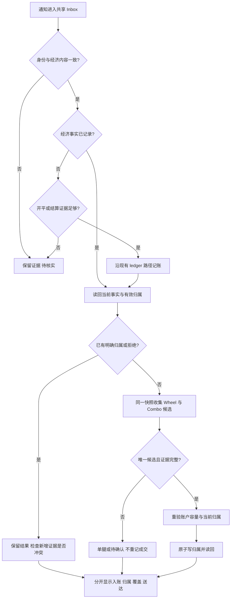

# Futu 成交、PM 持仓同步与期权生命周期

## 边界

Futu OpenD deal push 是实时成交入口。OM 标准化成交后维护期权和生命周期
账本；股票或 ETF 成交结算完成后，OM 只向本机 portfolio-management 服务
发送账户刷新提示。PM 自行读取 Futu 完整持仓快照并更新绝对
`quantity` 和 `average_cost`。

同步意图不携带推算持仓、成交数量或成本。OM 不直接写 PM/Feishu，PM
也不写 OM ledger 或 Feishu `transactions`。

## 启用

权威 `config.yaml` 可增加：

```yaml
portfolio_management:
  enabled: true
```

该全局开关默认关闭，同时控制 PM 只读工具、指派场景证据和成交后的刷新提示。
只有 `trade-intake` 处于 `apply`、成交首次出现且来源是 Futu push 或 history
backfill 时才会产生提示。旧 `trade_intake.holdings_sync.enabled` 只保留一个版本的
迁移读取；旧队列、重试和状态目录参数会被忽略并输出迁移诊断。
目标服务地址沿用 `PORTFOLIO_SERVICE_URL`，默认
`http://127.0.0.1:8765`，并强制为 loopback origin。

## 运行语义

- 期权成交返回 `option_deal`，不会调用 PM。
- 股票或 ETF 使用 canonical broker deal key 去重；提示只含 `account` 和该 key
  的 SHA-256 `request_id`，不传成交增量或券商身份。
- 正股/ETF 的 `execution_input.instrument_ref.currency`、`execution_input.currency` 与
  `NormalizedTradeDeal.currency` 必须非空且一致，由 canonical symbol identity
  （`domain/domain/symbol_identity.py` 的 `symbol_market`/`symbol_currency`：US→USD、
  HK→HKD）解析；`domain/domain/trade_execution.py` 与 `src/application/trades/normalizer.py`
  两个解析点复用同一来源，不新增第二份市场→币种映射。任一字段缺失或校验报错都会让该
  成交不产生刷新提示；币种与 `instrument_ref.market` 同源，symbol 无法解析时保持 null，
  不新增独立映射、不用快照或在线查询补推。载荷显式给出 currency 时仍以载荷为准，本契约
  不新增显式值与推导值的改写。
- Push 在该成交 Inbox 结算且账户锁释放后发送一次；结算失败时，同一 Inbox
  可在后续重复 push 或 backfill 结算后认领该意图一次。history backfill 完整处理
  本批成交后，每账户最多发送一次。
- OM 不维护独立刷新队列、工作线程或 PM 同步状态；现有成交 Inbox 仅保存一次性
  刷新意图和认领标记，不重试 PM 请求。请求固定超时 2 秒；PM 返回
  `202 Accepted` 只表示接受提示，不表示持仓已经同步。
- PM 调用失败不会回滚或改写 OM 已记录的成交、期权或生命周期事实；PM 的既有
  早晚全量同步仍是最终对账兜底。
- 成交写入时冻结公式费用；持久化成功后按该成交的 canonical
  `(broker, account, futu_account_id, order_id)` 精确查询终态订单和实际费用。
  当次尚未取得 actual 时，recent history backfill 只重试本次窗口内成交携带的同一订单。

## 成交身份隔离与恢复

缺少或冲突的券商账号、环境证据进入 `identity_needs_review`，不进入经济重试队列。
`attempt_count=0` 表示尚未尝试入账；端口和内部账户标签不能补充物理账号身份。
Listener 收到此类推送立即输出 `TRADE_INTAKE_IDENTITY_REVIEW_REQUIRED` 日志，
并在启动和后续 Inbox 刷新时保留 `inbox.identity_attention`：最早 20 条隔离行的
Inbox ID、deal ID、来源、首次接收时间、原因、`retryable=false` 和
`next_action=verify_broker_identity_before_replay`。完整数量仍见
`identity_needs_review_count`。

`runtime_status` 从 listener 状态投影 `trade_intake.summary.identity_review_required`
和同名告警码 `TRADE_INTAKE_IDENTITY_REVIEW_REQUIRED`，不因正常心跳、零 pending
或另一来源正常而消除。多个来源共享 Inbox 时不累加隔离数量，也不把它归属到某个账户。
这些是本地日志和读取告警，不主动发送外部通知。

已有 recent history backfill 可凭完整券商身份独立恢复成交，并按 canonical execution
identity 幂等入账；它不会按裸 deal ID、合约或端口绑定原隔离行。原行继续保留，告警也
继续存在，直到身份复核完成。缺失身份的旧行不能用 `--retry-failed` 强制解封；超出
回填窗口或需要消解旧行时，按下述一次性历史修复边界另行准备权威证据与确认。

已声明的来源成交 ID 与 canonical execution 在同一 namespace 内冲突时，标准化返回
`invalid:source_execution_identity`；已有 Inbox 重试进入既有 `conflict` 状态，原因是
`broker_source_identity_conflict`。旧结果和回执证据保留，后续正常重试不能覆盖已发现
的冲突。不同来源 namespace 的 ID 不要求相等，但完整拆分仍须证明组内身份和经济守恒。
回执恢复与 PM 刷新在筛选和最终领取工作时同样核对完整历史凭证，缺证据或身份冲突
不能触发新的外部操作。已经领取并产生的发送结果仍可保存，保留真实回执事实。

## 已完成成交的状态收口

listener 在现有每分钟维护周期核对本地 ledger、lifecycle、来源状态与共享 Inbox。
只有完整分配和有效终结事件能证明成交已处理；case 的 `ledger_written` 状态本身
不构成完成证据。被 void 的终结事件、部分分配、数量冲突及缺失身份继续保留 pending。
本地收口独立于 OpenD 采集；收口失败单独记录，不改变 lifecycle seal 的恢复状态。

`./om run trade-intake --reconcile-state --dry-run` 提供只读预览；明确授权后使用
同一入口的 `--apply` 更新状态。`--account` 与重复的 `--deal-id` 可限定范围。
收口先核对 Inbox 的准确身份、经济内容、当前版本及完整历史凭证集，再更新来源文件；
提交时重新比较凭证集，旧版遗留的身份矛盾也继续阻断。并发 claim、冲突或观察值
变化时跳过该条。文件写入失败后可重试，已收口 Inbox 不重复生效。
结果中的 `applied_deal_ids` 和 `applied_count` 仅包含实际更新的来源条目；
`inbox_updated_count` 另计 Inbox 更新，`deferred` 说明未通过 Inbox 核对的条目。
汇总的 `write_applied` 在来源文件或 Inbox 任一实际更新时为 true；若 Inbox 已收口而
来源文件并发比较未通过，应按最新证据重试。来源文件备份不能回滚 Inbox 的更新。

此路径保留旧结果和回执证据，不重放成交、不修改持仓事件，也不触发通知或 PM 刷新。
已有 Inbox 文件无法读取或缺少 schema 时视为证据不可用，不能作为“没有待处理记录”。

## 生命周期观察隔离与一次性历史修复

`trade_intake.settlement_observation.enabled` 是 lifecycle settlement provider
的唯一开关，默认值为 `true`。它不改变成交身份、Inbox 幂等、费用补全、投影、
通知或 lifecycle 证据规则。

开关为 `false` 时：

- applied push、Inbox retry 和 recent history backfill 在 canonical ledger 写入前
  仍必须完成启动 checkpoint seal；seal 失败时 payload 保持可重试且不写 ledger；
- 新成交继续完成 durable Inbox、canonical ledger、readback 和现有回执，但不创建
  lifecycle settlement broker/quote gateway，也不查询 lifecycle timing；
- recent history backfill 继续按现有 6 小时窗口和 5 分钟间隔恢复 listener 漏推，
  不扩展为长期历史扫描；
- lifecycle due tick 继续执行本地计划。provider-required case 写入
  `collector_disabled`，空集和本地可决 case 保持原结果，provider claim 与 attempt
  均为零；
- 新 lifecycle case 可以保持 `cause_pending` / `needs_review` 且暂时没有 timing；
  不猜测到期、指派或行权终态，也不发送相应终态通知。

该开关只隔离 lifecycle settlement 观察。Push 成交补全、recent history backfill
和费用同步仍使用 Futu native SDK，不能据此宣称所有 native 崩溃风险均已消除。
Python `except Exception` 也无法捕获 `SIGBUS` 等进程级信号。

### 生产启用顺序

发布、远端升级、生产配置修改、历史账本写入和恢复服务是独立授权边界。
恢复 trade-intake 前必须：

1. 升级时使用 `--no-restart-services --preserve-activation-state`，并读回确认
   trade-intake 仍为 inactive。
2. 在权威 `config.yaml` 显式设置
   `trade_intake.settlement_observation.enabled=false`，重建并验证运行配置，
   分别读回 lx 和 sy 的有效值为 `false`。
3. 完成一次性历史修复的 preview、apply 和 readback，并确认不存在待发历史通知。
4. 记录 `NRestarts` 基线后再恢复服务。第一次增加或出现状态 `135` 时立即停服，
   核对备份、账本 readback、integrity、投影数量、notification pending 和
   lifecycle claim，不等待重复崩溃。

服务恢复后的最小 canary 是连续跨过至少两个 lifecycle tick，期间
`NRestarts` 不增加，账本 integrity、投影数量和 notification pending
没有非预期变化。该 canary 不是对所有 Futu SDK 路径的长期稳定性证明。

### 一次性历史修复边界

历史批量修复是独立的一次性运维工作单元，不加入 listener、定时器、配置生成器、
公开 CLI 或长期脚本，也不增加 `force-provider` 类产品选项。它必须：

- 显式接收账户、包含边界的日期范围、时区和目标类型；
- 先执行只读 OpenD inventory 与 ledger diff，由操作员确认 frozen manifest；
- 在 apply 前备份精确 SQLite 与 source Inbox，并取得独立的账本写入确认；
- 只通过现有 canonical trade/lifecycle owner 应用精确 broker identity，不按
  symbol、数量或推测成交时间模糊匹配；
- 在常驻 collector 开关为 `false` 时使用任务自身的明确 provider 入口；
- 抑制历史通知，写后执行 ledger readback、完整投影重放和 integrity check；
- 在回执中记录 runner 代码哈希、manifest 哈希、通知抑制证据和每个 identity
  的应用结果；重跑只跳过已经读回确认的同一 identity；
- 遇到 OpenD 崩溃、超时或证据不完整时失败并保留备份与回执，不把未知结果
  标记为已完成；执行后删除临时 runner。

apply 前还需从生产只读盘点 effective flag、缺少 timing 的 case，以及
pending、provider-finished、ambiguous 基线。具体账户、范围、时区、目标类型和
通知抑制方法属于该一次性工作单元的运行输入，不固化为产品默认值。

## 订单费用同步

OpenD 适配器只负责查询与规范化。账本应用层选择完整订单组，并在查询费用前校验
REAL 账户、终态、币种和成交数量。`order_fee_query` 返回的订单总费用按同合约成交
数量确定性分配；Combo、跨类型订单、日期边界不完整、冲突 actual 或无法证明的股票
sale 订单均不写入。actual zero 是完整证据。

```bash
# 默认只预览；日期按 Asia/Shanghai，结束日期包含当日
./om trade-events fees-sync \
  --config-key us --account lx \
  --start-date 2026-08-01 --end-date 2026-08-23

# 高风险账本写入，仍需统一写入确认
./om trade-events fees-sync \
  --config-key us --account lx \
  --start-date 2026-08-01 --end-date 2026-08-23 \
  --apply --confirm
```

写入以订单组为事务单位，使用旧 JSON 比较交换、写后读回、投影重放和审计哈希。
dry-run 不创建审计表。历史回补负责补 actual；仍取不到 actual 的旧裸费用只冻结一次
当前公式版本，后续读取不随费率变化重算。OpenD 不可用、查询失败或证据不一致时保留
estimated/missing 和显式诊断，不回退到 raw deal fee 字段。

### 自动单订单费用补全

自动路径的目标是让每笔 broker 成交在 durable ledger 写入后，以该成交携带的特定
`order_id` 补全 actual fee；成功信号是终态、账户、币种和完整成交数量均可证明，
`order_fee_query([order_id])` 返回该订单费用，ledger enrichment transaction 写后读回为
actual。费用补全失败不得回滚、重复或改写已经持久化的成交，也不得把 estimated/missing
解释成零费用。

自动路径不扫描 2018 年以来的 ledger 候选，不维护 round-robin cursor，也不把历史
`fees-sync` 作为成交后的默认动作。缺少 canonical order identity 的手工事件、超过 recent
backfill 覆盖期的历史修复、费用公式调整、绩效口径变更和新增持久重试队列不在该路径内；
人工 `./om trade-events fees-sync` 继续负责显式日期范围的历史预览与受控写入。

```text
trusted push or recent history deal
  -> durable inbox and canonical ledger write, then settle intake result
  -> exact account + futu_account_id + order_id target
  -> source-local in-memory target queue
  -> exact current-order query; narrow history-order fallback when needed
  -> terminal / currency / complete dealt quantity admission
  -> order_fee_query([order_id])
  -> exact-only ledger enrichment transaction and readback
```

`src/application/trades/auto_intake.py` 为每个 source 持有一个进程内队列和 enqueue helper。
Push callback 只在成交 Inbox 已 settle 后，从可信 `_trade_intake_source` 和 canonical ledger
结果构造完整 `(broker, account, futu_account_id, order_id)` target，并调用该 helper；费用失败
不会把已成功处理的 Inbox 改回 retryable。source loop 顺序消费并去重 target，provider 查询
不持有共享 `process_lock`，也不与 backfill 并发使用同一个可变 OpenD client。进程退出时未
消费的 target 不单独持久化，由 recent history backfill 恢复。

当前订单接口以 `refresh_cache=true` 按 `order_id` 精确过滤，覆盖全部未完成订单以及 24 小时内
已成交或已撤订单。当前查询未命中或返回受控 provider 错误，且目标来自更早的有效 backfill
payload 时，按该订单完整
ledger 组的最早和最晚成交时间生成不超过 provider 360 天上限的窄 history-order 窗口，再在
本地只接受同一 `order_id`；不会退回无目标的长时间历史扫描。两种查询都失败或限流时 fail
closed，保留 estimated/missing。

首次尝试发生在成交持久化和 Inbox settle 之后；`FILLED_PART` 等非终态只记录
`terminal_pending`，不查询或写入最终费用。`FILLED_ALL` 或有成交数量的部分撤单只有在
provider `dealt_qty` 与 canonical ledger 订单组数量完全一致、币种一致时才进入费用查询。
这样同一订单的多笔成交不会在订单尚未结束时冻结不完整费用。provider 已终态但暂未返回
费用行时记录 `fee_pending`，后续 recent backfill 继续尝试，不能解释成零费用。

Recent history backfill 先从本轮 broker payload 派生明确携带的 canonical order identity；
只有新结果为 `applied`，或 duplicate 分支能由完整 ledger key 或 `applied/reconciled` processed
state 证明此前已经持久化时才收集 target。普通股票、failed、unresolved 和缺少持久化证据的
重复项不会触发 fee 查询。完成本轮业务处理并释放 `process_lock` 后，同一订单去重并调用由
auto intake 注入的 enqueue helper。
`run_history_backfill()` 不再查询费用，也不在 diagnostics 返回 raw target identity。已经具备
一致 actual fee 的订单在 provider 调用前跳过。该重试使用既有 lookback/checkpoint 覆盖，
不增加持久队列或状态表；旧 checkpoint 中的 fee cursor 自然保留但不再读取或更新。

`src/application/trades/order_fee_sync.py` 继续拥有完整订单组选择、terminal admission 和 fee
enrichment 编排。现有内部 `sync_order_fees` 增加可选 exact target 模式：按完整 canonical
identity 读取跨日期边界的完整订单组；该模式的 `start_ms`/`end_exclusive_ms` 可省略且不参与
选择或写入，history-order fallback 日期只从目标组的最早和最晚 event time 生成，也不使用
日期 cursor 或 `max_orders`。缺省模式仍要求有效日期范围并保持人工 `fees-sync` 语义，不新增
平行公开入口。当前全量 ledger 读取保持 O(n)，只有实测成为瓶颈后才增加索引。

`src/application/ledger/order_fee_migration.py` 是 enrichment implementation owner；
`src/application/ledger/api.py` 继续作为应用层公开边界。现有 `enrich_order_fees` 增加相同的
exact target 约束：该模式可省略日期范围，只构建该订单的 actual unit，禁止运行范围内 legacy
formula freeze pass，也不为无关订单产生 audit 或 unresolved outcome；写入仍复用旧 JSON
比较交换、SQLite transaction、投影重放和写后读回。
`src/infrastructure/futu_history_deals.py` 复用现有 gateway 和状态规范化，负责 exact
current-order、窄 history-order fallback 和 fee query。无需新增 domain entity、配置键、数据库
schema 或依赖；若实现产生新的 import edge，按仓库约定重新生成两份 dependency graph。

自动尝试结果写入既有 trade-intake audit 和 listener `last_fee_sync` 子状态，至少区分
`actual`、`already_actual`、`terminal_pending`、`terminal_order_missing`、`fee_pending`、
`provider_rate_limited`、provider 查询失败和 evidence conflict。成功数以 ledger
`committed`/`no_op` 结果为准，不以 provider observation 数冒充写入成功。audit/status 只保存
identity hash、reason、error type 和计数，不透传 raw `order_id`、provider 异常文本或 missing
列表。

顶层 backfill `ok` 仍只证明 history、durable inbox 与 lifecycle 完整，不会因费用暂缺而谎称
成交失败。`last_fee_sync` 表示该 source 最近一次完成的非空 queue drain cycle，包含 attempt
时间和仅属于该 cycle 的 actual、pending、failed 计数，不表示当前 backlog 或进程累计值。
无 target 的空 cycle 不覆盖旧状态；新的无失败 cycle 清除上一次 fee error。
`runtime_status.fee_failed_source_count` 只统计各 source 最近 cycle 仍有失败的数量，并同时暴露
脱敏的 fee actual、pending、failed 计数，避免仅凭 `listener_status=listening` 推断 actual fee
已补齐。

实现先给现有 fee sync 和 ledger enrichment 增加 exact target 模式，并用跨窗口完整订单组、
无关订单字节及 audit 不变、终态、数量、币种和 already-actual 用例锁定写入门；再增加 exact
current-order 和窄 history-order fallback，由 auto intake 的 enqueue helper 把 push 与 backfill
target 接到 source-local 队列，并删除 backfill 自动全历史 fee scan 与 cursor；最后补充 queue
drain cycle status 和 runtime status 安全聚合。

验证覆盖单笔成交成功、部分成交不写、部分撤单数量一致、超过 24 小时的 checkpoint 恢复、
duplicate push/backfill 重试、双账户相同 order ID 隔离、无关 estimated 订单不查询不改写、
provider 失败不回滚成交或改变 settled Inbox、同一订单并发重试幂等、成功清除旧 fee error、
空 backfill 不覆盖旧状态和双账户状态聚合。实现后运行 fee sync、trade intake、agent facade
相关测试、guardrails 与 `git diff --check`。

订单费用接口同一账户每 30 秒最多调用 10 次。复用的 source provider client 跨调用维护该
`order_fee_query` 预算；自动路径顺序处理特定订单，第 11 次及 provider 自身限流均 fail closed，
不 sleep 持锁，也不以并发、盲重试或批量历史扫描绕过。current-order 强制刷新若被独立限流，
同样保留 estimated/missing 等待 backfill。

保留风险是 provider 不可用超过现有回补覆盖期，或订单长时间保持部分成交且在变为终态前已
离开 backfill 窗口时，不会自动补齐。该情况由 partial 指标和历史 `fees-sync` 显式处理；只有
观测到持续积压后才由 trade-intake owner 设计 durable fee retry，不为当前缺陷预建状态机。

## Push 来源身份

Futu deal push 经 OM 主动连接的 OpenD TCP 端口进入。transport 保留响应头与成交行的
来源证据，source binder 校验允许的物理账户、环境与内部账户映射。PID 只用于诊断，
不进入业务幂等键。缺少真实物理身份、环境不符或来源冲突不得凭单账户配置猜测归属。

当前 canonical execution identity 由 `domain/domain/trade_execution.py` 拥有，应用经
`src/application/ledger/api.py` 和 `src/application/trades/deal_identity.py` 复用，键为
`execution:v1:<hash>`。`futu:<account>:<physical_account_id>:<deal_id>` 保留为兼容或
外部事件键，不替代 canonical identity。`trade_account_identity.py` 只负责账户字段提取。

推送头字段保留、错误门修复与 push/history 收敛要求见下节；不得通过放松来源校验修复
SDK 转换丢字段。无身份记录只保留证据，关联必须经既有证据导入机制证明。

## 成交录入与回执恢复

### 目标与边界

普通成交尽量在首次推送时完成录入并发送成功回执。首次失败时说明具体原因、是否自动重试及
用户下一步；重试录入成功后发送独立的成功回执。交易已成交、OM 已记录、通知已送达是三个
不同事实，不以其中一个推断另一个。由 trade-intake 与 private-storage owners 负责。

验收要求：可信推送无需等待 history 才获得账户身份；SQLite 权限维护不释放活动事务的锁；
重复推送、回补、崩溃恢复均只产生一次经济效果；失败、恢复、重试耗尽都可解释；通知恢复不
重放成交。外部发送结果不明时不能保证恰好一次，不允许用盲目重发制造这一保证。

范围限于推送身份传递、共享 SQLite 文件权限维护，以及普通 intake 回执与现有重试循环的
衔接。不改变策略、费用计算或 lifecycle outbox 的业务归属，不引入通用消息平台或历史全量
扫描。本设计不授权生产重放、账本补录、真实回执补发、配置变更、发布或升级。

### 已修复缺陷与约束

- 修复前推送入口调用 SDK `TradeDealHandlerBase.on_recv_rsp` 后只转发 DataFrame 行。SDK 的列清单
  不包含物理账户 ID；原始响应 `s2c.header` 则携带交易环境和账户标识。下游先设置
  `missing:push_physical_account`，导致应用层已有 source 身份绑定被跳过。
- history 可以提供完整身份并重新进入录入。现有 canonical identity owner 负责命名空间、
  账户映射与 broker execution 幂等，不能以配置账户标签或裸 deal ID 替代。
- 修复前 `secure_sqlite_artifacts` 打开并关闭数据库与 sidecar 文件以执行 `fchmod`。
  Linux 上额外的 `close` 会释放本进程在同一文件上的 POSIX 锁；已用临时 SQLite WAL 数据库
  和另一进程的锁探针复现。`ensure_private_file` 对已存在数据库的 open/close 也必须覆盖。
  这是已证实的共享存储缺陷；缺少故障 SQL 堆栈，不能断言它是个别 `locking protocol`
  异常的唯一原因。
- 修复前普通回执在 Inbox 中保存一次 `receipt_json`；只要已有回执，后续业务结果就被
  `durable_receipt_*` 拦截。失败通知送达因此会阻止后来成功通知。
- 修复前 retry 列表默认按 60 秒筛选、以 `attempt_count < 20` 过滤；claim 本身不检查到期
  时间、不递增计数，计数实际在结算时增加。因此崩溃重领没有统一预算保证，现有 claim 将计数与到期检查收敛在同一事务。通知失败、provider 接受但未确认、业务耗尽不能都表示为“未记录”。
- lifecycle outbox 已有独立投递所有权；有可读回 outbox 的 lifecycle 结果不得转为普通直发。
- 修复前正股/ETF 的 `execution_input` 只从 `src.currency`/`currency_code`/`ccy` 或期权代码
  市场取币种，而富途 deal push 行不含 currency 字段，`US.*`、`HK.*` 正股成交因此得到
  null；`normalize_execution_input` 报 `missing:instrument_ref.currency` 与
  `missing:currency`，`_build_portfolio_refresh_intent` 随即返回 None，PM 刷新提示从不产生。
  2026-09-15 sy 账户 VOO 定投（2.8758 股）实证：Inbox 行已是 `handled`/`delivery_purpose=live`，
  但 `portfolio_refresh_intent_json` 为空，PM 当日持仓仍是上一交易日快照。同一 Inbox 的
  110 行历史记录中该字段全部为空，说明这是所有正股/ETF 成交的共性缺陷，不是个别载荷问题。
  修复在 `domain/domain/trade_execution.py` 与 `src/application/trades/normalizer.py`
  两处解析点按 canonical symbol identity 兜底，使 `execution_input` 与
  `NormalizedTradeDeal.currency` 一致；symbol 无法解析的市场与期权路径保持原行为。
  币种进入 `execution_economic_content` 的 economic 内容，因此它是 Inbox
  `economic_payload_hash` 与 `completed_ledger_execution_events` 身份比对的输入：
  Inbox 与 ledger 两侧都用同一 raw broker payload 在当前代码下重算，同一成交重放
  仍一致；`lifecycle_deal_economic_hash` 走 `source_consumption` allowlist，不含
  currency，不受影响。已知残留：升级前已写入 ledger、且 `raw_payload` 内嵌标准
  `execution_input`（currency=null）的正股结算类事件，在升级后 6 小时回补窗口内重推
  会 fail-closed 为 `trade_execution_economic_conflict`，需人工复核；它不丢数据、不
  静默改账，也未纳入本次修复范围。

### 方案与责任边界

沿用现有入口、Inbox、ledger facade 与重试循环，只修复它们之间的契约。

| Owner | 责任 |
|---|---|
| `src/infrastructure/futu_trade_push.py` | 在 SDK 行转换丢字段前保留可信响应头身份；验证行与头的冲突 |
| `domain/domain/trade_execution.py` 经 ledger facade/deal_identity；现有 source binder | 复用执行身份生成；binder 校验 source 与映射，transport 不生成平行主键 |
| `src/infrastructure/private_storage.py` | 所有 SQLite caller 共用的私有权限、文件类型与锁保护 |
| `src/application/trades/intake.py` | 返回真实持久化结果、结构化失败分类与可重试性 |
| `src/application/trades/inbox.py` | 持久化业务 claim、实际重试政策和有版本的回执记录，使用事务与 CAS |
| `src/application/trades/receipt.py` 与 `receipt_compensation.py` | 共用 Inbox 发送资格；保留人工补偿的预览与确认边界 |
| `src/application/trades/auto_intake.py` | 复用当前循环协调业务重试和仅通知恢复，保持账户/source 隔离 |

不以延长 timeout 或对全部 `OperationalError` 盲目重试掩盖锁问题；不让历史回补承担本可从
推送头获得的身份；不清空旧 `receipt_json` 来补发成功；不新建并行的交易状态库或通用队列。

### 推送身份与首次录入

数据流为原始 SDK 响应头与成交行 → transport 保留来源证据 → source/account identity 验证
→ canonical execution key → durable Inbox → 现有录入 facade。响应头中的账户 ID 只有通过
当前 source、交易环境、订阅/可见账户与映射校验后才可作为物理身份。

行与头同时有身份时必须一致；缺少、格式不合法、环境不匹配或多账户歧义继续拒绝录入并
保留可诊断证据，不能清除真实错误来绕过校验。配置只约束允许的账户，不凭配置推断成交
属于谁。移除或收紧 source binder 中无证据的单账户推断分支；单账户 source 但无响应头/
可验证行身份也必须拒绝。直接注入 listener 的测试/兼容入口仍经过同一身份验证。

同一有效成交的 push 与 backfill 必须收敛到现有 canonical key。已有身份缺失行不按裸
`deal_id` 强制合并；只有现有证据导入机制可证明等价时才关联，未证明的继续保留待复核。
无法证明账户归属的入口错误只进入既有本地 audit/status，不借单账户通知 route 猜测
归属；已有可信账户的规范化/录入错误才可产生该账户的失败回执。这是来源安全下的明确
限制，不承诺所有缺身份推送都能即时发出账户回执。

### SQLite 权限与锁

连接建立前仅在目标不存在时创建私有空文件；发现已有文件不额外 open/close。
新建复用 `tempfile.mkstemp` 在同一私有目录创建唯一临时 inode，设置 0600 并先关闭 fd，
然后以不覆盖目标的 `os.link` 原子发布到数据库路径，最后删除临时名称。目标已存在则
丢弃自己的临时文件并验证已有目标，禁止 replace 已有数据库。发布前没有可由普通 DB
读写入口连接的目标 inode；发布后权限维护不再打开它，从而避免“创建者关闭 fd 释放
并发连接锁”的窗口。临时文件清理使用 finally，失败不能留下非私有目标。

全部 SQLite 创建入口经共享 helper，不对数据库调用通用 `ensure_private_file`。
不要求只读 `mode=ro` 入口执行 chmod、创建或获得业务锁；它们可能在发布后立即连接，
仍不会被 helper 的额外 close 破坏锁。初始化采用私有临时文件而非扩大连接锁覆盖范围，
以保留只读边界；验证中加入发布前后并发只读连接与创建竞争。
数据库与 journal/WAL/SHM 的权限维护使用不打开文件内容的 metadata 操作，并明确禁止
跟随符号链接。优先使用标准库提供的 no-follow 操作；不支持的平台应明确失败，不能
回退到跟随 symlink 的 chmod。检查路径类型、父目录私有性和操作后的状态，保留既有
0600 文件、0700 目录及特殊文件拒绝契约；sidecar 正常消失可容忍，权限异常不可吞掉。

全面核对共享 helper 的调用者，包括同进程多连接、初始化、事务内调用及关闭后的维护。
新文件初始化也不得对另一个活动连接的同名 inode 执行危险 open/close。连接建立后若
权限维护失败必须关闭新连接。检查与 chmod 之间的路径替换风险纳入安全测试；采用受控
私有目录与 no-follow 元数据操作，不引入会再次释放 SQLite 锁的文件描述符校验。

不新增连接准备锁；现有 ledger writer lock 和 SQLite transaction 继续负责业务事务串行性。metadata no-follow 调用必须通过实际 Linux 锁探针验证，不能仅凭 API 名称
假定其实现没有额外 open/close。信任已配置 runtime 根及既有祖先目录；直接父目录须为受控私有目录，
对直接父目录和数据库文件执行 no-follow 类型、inode 与权限复核；
不把同 UID 恶意进程修改其自身私有目录宣称为已隔离的安全边界。
只对已明确分类且确认可安全重试的临时故障沿用 durable 重试；本轮不增加进程内 sleep
或第二套快速重试政策。首发成功率主要通过修复身份与锁缺陷提升。

### 普通成交回执与恢复

以现有 Inbox 为唯一持久化 owner。扩展 `receipt_json` 为显式版本的记录，按语义保存
`pending_retry`、`recorded`、`manual_required`、`verification_pending` 回执，而不是每次异常建立新通知。
这些是普通回执的结果版本，不是新的交易生命周期状态。JSON envelope 包含 schema_version、
current_result_key 与按语义键索引的 receipts；`verification_pending` 专指经济状态待核对，
与投递 unknown 分离。键由 Inbox identity 与结果语义构成，不随
传输来源、重试次数或无经济变化的关联补充变化。同一语义只冻结一份内容，发送尝试用独立
attempt ID；保留各结果的 route/message、送达证据、次数、下次可尝试时间与停止原因。

普通即时发送、重复入口和通知恢复都先走 Inbox 的同一结果/attempt claim。state.json
只保留兼容投影，不得以旧 delivery_confirmed/unknown 否决新结果、复活旧结果或绕过
预算。没有 Inbox 的旧兼容路径保留原有抑制规则，不能用其状态猜测迁移后的发送资格。

所有正常、normalize 失败、resolve 失败及已知辅助异常出口统一先收敛经济事实，再以
claim/payload CAS 写入结果、重试决定和回执意图，最后进行外部发送。禁止异常分支绕过
该持久化步骤，禁止发送回调失败把已记录业务改回 pending。ledger 与 Inbox 的提交窗口
由 canonical readback 恢复；无法可靠读回时只进入待核对，不再执行经济写入。
恢复的账本读回与 Inbox 结果更新共用现有 ledger writer lock，等待仍在提交的过期 claim。
沿用 compensation → ledger → Inbox 的加锁顺序，外部发送前释放锁，不能把未提交快照中的缺失当成最终未记录。
Inbox 不可写时不发送无法持久化防重的通知；记录现有日志/status，存储恢复后继续协调。

成功回执的内容截止于收敛时已知的 ledger 及 before-receipt 结果（如 combo）；不等待后续
lifecycle timing、费用或 PM 刷新完成。这些后续结果继续由各自现有 status/audit 呈现，
不会追改冻结消息或新增辅助工作流通知。发送完成只更新投递记录与兼容投影。

| 业务事实 | 用户回执 | 后续动作 |
|---|---|---|
| 首次持久化并读回成功 | ✅ 已记录 | 一次成功回执 |
| 未持久化、可安全重试且未耗尽 | ⚠️ 暂未记录；原因；至少 60 秒后自动重试 | 同一失败阶段不重复刷屏；恢复后独立成功回执 |
| 不可自动重试或达到上限 | ❌ 暂未记录；原因；不会继续自动重试；处理建议 | 一次需处理回执；等待经授权的复核/修复 |
| 持久化成功，回执截止前已知辅助步骤失败 | ✅ 已记录；注明当时已知的未完成步骤 | 后续辅助任务由原有状态入口呈现，不重复写交易 |
| 未获得可靠持久化结论 | ⚠️ 记录状态待核对 | 先按 canonical key 读回；不能猜测成功或再次执行经济效果 |

业务重试政策集中在 Inbox claim 边界：首次可立即认领；以后所有处理入口均在同一 CAS
中检查 due time、lease、attempt_count 与可重试结论。成功 claim 原子消费一次现有计数，
最多 20 次；settle 不再递增。正常失败从结算时间起至少 60 秒后到期；claim 中断须先等
租约到期，不能以直接 processor 调用跳过期限。存储恢复读回与通知协调不消费业务预算。
旧计数按已结算次数保留，不虚构此前崩溃次数；迁移后每次新 claim 都按新政策消费。

第 20 次 claim 后崩溃也先执行无经济写入的 readback：确认已记录则恢复成功结果；明确
未记录则耗尽；读回不可用则“记录状态待核对”，不可写成“未记录”。人工 resume 保留
既有显式 operator 门与审计，重新开启预算不代表授权重发已确认或 unknown 的相同回执。

intake 分类稳定原因码；仅确认可安全恢复的暂态 SQLite busy/locked/protocol 等错误可
自动重试，权限、磁盘空间、schema、身份冲突等须给出对应处理建议，不能只凭异常类型。
已提交或提交状态不明的异常先读回，禁止绕过唯一事件/lot 约束。渲染读取持久化的
attempt/remaining/retryable、到期下限和调度条件，不自行计数或承诺精确执行时间。
用户看到可执行的原因和动作，原始异常/堆栈只进诊断，不泄漏路径或凭据。

`pending_retry` → `recorded` 或 `manual_required` 是不同可发送结果。重复的失败与重复
成功都不能新增经济效果或重复已确认回执。成功必须来自 ledger facade 的持久化与读回
证据；历史已处理但无新失败的成交继续保持历史抑制，不能因升级批量补发旧成交成功消息。

提交边界不明或最后一次 claim 中断且 ledger 暂不可读时，冻结 `verification_pending`：
“记录状态待核对；暂不重复录入；系统将继续核对”。每轮到期协调仅经 ledger 只读 facade
按 canonical key 核验事件/lot，不调用可能补关联的 resolver；本地读取可每 60 秒再次到期，
每批有上限，不消费经济或发送预算，也不重复发已确认的待核对通知。读取仍失败则保留
该结果；确认已记录则推进到 recorded；确认未记录且有预算则 pending_retry；确认未记录
且无预算/不可重试则 manual_required。每次推进按同一 supersession/CAS 规则废止旧未发
消息，允许最终明确结果独立发送；未知不能当有效零结果。核对与真实投递各自 unknown
字段不得混用。

保留当前 `begin/finish` attempt fence，扩展到结果版本、payload version/hash、账户及
冻结 route/message。claim 和 finish 必须核对当前 attempt ID 与版本；过期 worker 的
完成回调不能覆盖新结果。旧结果已在发送中时，不能宣称撤销该外部发送；新成功内容应
清楚说明为恢复结果，不能因为旧失败的已发送标记而跳过。结果推进时，原子撤销被替代
失败或待核对结果未来的发送资格；尚未发送、无 route 或明确未接受的旧结果只保留审计，不能在
成功或需处理结果之后再发送。claim 再核对 current_result_key。已经开始的旧 attempt
允许按自身 ID 完成记录，但不能修改当前结果或恢复自身重试资格。

投递状态沿用现有 `sent`、`failed`、`unknown` 语义：只有 delivery confirmation 才为
sent；明确未接受为 failed，允许在既有循环中按持久化节奏仅重试通知；accepted/unconfirmed、
超时或发送中崩溃为 unknown，禁止自动重发同一结果，状态诊断说明需核对投递。没有可用
通知路由时保留待发送与原因，不伪造已送达。新业务成功属于新结果，不被旧失败通知的
unknown 阻止；若同一成功通知 unknown 则继续防止重复发送。

通知恢复独立于业务 pending 查询，从相同 Inbox 选择有新结果或明确未接受的待发送回执；
已处理成交不重新进入 pipeline。用当前账户/source enabled、receipt enabled、route 与
身份校验约束选择；保留 notify_applied、notify_failed、notify_unresolved 等现有子开关：
recorded 属 applied，暂态/耗尽失败属 failed，身份明确的待复核属 unresolved；
verification_pending 沿用产生该结果的原通知类别并持久化，不借恢复绕过用户抑制。
停用时不发送，恢复启用后才继续。每个发送阶段必须有持久化意图，
业务结果提交后、意图冻结前崩溃，可由 Inbox 结果与 ledger readback 恢复，不依赖新 push。
source 拥有同一个到期协调函数，在正常循环、启动前与 reconnect 等待片段中调用。
transport 的 `start` 复用已有 SDK 初始化线程，在当前 `queue.get(timeout=0.1)` 等待点
提供可选 on_wait 回调；只暴露等待机会，不包含业务查询或发送逻辑。source 注入到期函数，
因此初始化长时间未完成也能恢复通知；回调每次先检查 stop/due，实际工作受批量与发送
超时约束，异常只进 status，不逃逸中断 SDK 等待。取消后不开始新的通知尝试。

同步 health 查询须有 SDK 连接等待与请求超时：transport 使用现有
`set_sync_query_connect_timeout` 设置有限连接等待，并沿用 SDK 请求超时；不能只依靠
_queue 轮询超时。恢复最早到期为 60 秒，实际还受本轮有界 I/O 延迟影响，不承诺精确周期。
测试初始化线程保持未完成、首轮通知明确失败、时钟到期后再次发送及 stop，不能只用
立即抛错的 listener stub。沿用现有线程与协调，不新建常驻服务或通用 supervisor。

达到上限时，即使下一轮业务查询已排除该行，也必须由现有循环的状态协调产生最后的需
处理意图。通知重试使用独立计数，不能消耗或复活业务 retry budget；同样有上限和终止
原因，以免永久刷接口。沿用 60 秒/20 次默认政策，不增加配置键或服务；通知 attempt
认领时原子消费其独立预算，未知发送不续发，无路由只是等待条件、不消费发送次数。
路由首次有效时冻结，重试前验证当前账户与 route 仍匹配；路由变更则停下待核对，不能
把冻结消息自动发往另一个目标。通知预算耗尽/unknown 由现有 intake status 的 Inbox
摘要展示结果、原因、最后 attempt 和处理建议；只读核对后另行授权补发，不自动发送
一张“发送失败”的通知来递归通知失败。

人工 `receipt_compensation` 必须先检查该成交是否由新版 Inbox 管理：是则 fail closed，
返回 Inbox 当前投递状态和恢复策略，禁止通过独立补偿 JSON 再次发送。旧补偿仍保留其
preview/hash/confirm 门。接管旧无路由记录前，在现有 compensation lock 内核对同一
account/canonical deal 的补偿证据并完成 Inbox 接管；旧补偿 apply 在同一锁内重新检查
Inbox 归属，避免先预览后并发发送。已有 send_started/unknown 视为歧义，confirmed 视为
已送达；多成交合并补偿的任一成员都不能再次自动发送。缺失/无法归属的证据 fail closed。
通知网络调用不持该迁移锁；新记录认领后由 Inbox 独立 CAS 防重。

旧单回执读取必须兼容：sent/unknown 保留其原状态；只有保存了明确失败业务结果且当前
已持久化成功，才建立恢复成功的新结果。无法证明旧回执对应何种结果时 fail closed 并
显示诊断，禁止猜测补发。旧失败 sent/unknown 只约束其旧语义，不能挡住有证据的新成功。
已有历史成功和空旧 receipt 不因升级批量补发；仅 live、可证明为本流程尚待完成的回执
进入恢复，保留 delivery_purpose 与 receipt_recovery_allowed 的历史保护。

扩展现有 `trade_inbox_writer_version()` 与 SQLite writer triggers：迁移在单一事务中
检查版本并替换旧 guard，新写入要求新 writer version；先安装 guard 再写新格式。
旧连接、旧二进制及不兼容降级必须在写入前失败，不得覆盖新版 JSON。新 reader 兼容旧
单回执；损坏/未知版本 fail closed。测试旧连接在迁移前已打开、迁移并发和降级写入，
不通过新增部署锁或文档提醒代替持久化兼容门。

### 实现切片与验证

1. **可信推送首次录入**：以真实 SDK 形状的响应头进入公开 listener，验证转换、source
   绑定、入箱与同一成交的 history 收敛；覆盖缺头、多账户、账户/环境冲突，不伪造默认账户。
2. **权限维护保持事务锁**：临时目录中复现 Linux SQLite WAL 写锁；独立进程在 helper
   前后都应无法取得锁，事务提交正确。覆盖同进程第二连接、权限修复、新建竞态、symlink、
   特殊文件、sidecar 消失和异常连接释放；macOS 通过不能替代 Linux 锁验收。
3. **失败到恢复的完整回执**：用真实 Inbox/ledger 与 fake sender 经过 auto-intake facade，
   验证首次成功、失败到成功、不可重试、耗尽、仅通知重试、无路由、unknown、进程重启、
   旧回执兼容、旧 worker 迟到、账户停用和 lifecycle outbox 交接。内部顺序为统一结果与
   原子预算 → 版本回执/兼容 guard → 外层通知恢复及补偿互斥，整体交付前不启用半成品发送。
   覆盖失败待发→成功后旧失败失效，失败已送达→耗尽仍发新结果；claim 后/最后一次
   claim 后崩溃、直接未到期认领、异常出口发送前后崩溃；OpenD 持续失败时仍恢复；
   补偿先完成或并发自动恢复、无 route 后恢复、route 变更、旧 writer 及两存储状态冲突；
   第20次 claim 崩溃→ledger 暂不可读→最终已记录/明确未记录，待核对通知失败/送达后
   最终结果仍正确发送，且核对阶段经济写入次数为零；初始化一直未完成时再次到期发送
   和取消可达；子开关抑制沿原类别生效。
   断言唯一事件/lot，
   冻结内容、发送次数及持久化确认；不以函数返回成功替代投递事实。
4. **正股成交币种与 PM 刷新提示**：以真实富途 push 行形状（`code=US.VOO`、`trd_market=US`，
   行内既无 `currency` 也无 `market` 键）经 `normalize_trade_deal` 与
   `_build_portfolio_refresh_intent`，断言 `execution_input["errors"] == []`、
   `instrument_ref.currency`、`execution_input["currency"]` 与 `deal.currency` 同为 `USD`，
   且意图非空、`request_id` 仍为 `stock-refresh:<sha256(deal_key)>`；同时断言 HK 正股为
   `HKD`、期权币种仍只来自合约代码、symbol 无法解析时不产生意图，以及同一 raw payload
   重复入 Inbox 不产生 `broker_economic_payload_conflict`。

验证以现有 `test_trades_push_listener.py`、`test_private_storage.py`、
`test_trade_receipt_recovery.py`、`test_trade_receipt_claim_fence.py`、
`test_trade_receipt_concurrency.py`、`test_trades_inbox.py` 与 auto-intake 对应测试为基础，
按入口补最小回归，不复制实现做镜像测试。正股币种与刷新提示沿用 `test_trade_execution_input.py`
和 `test_trades_portfolio_refresh.py`。执行相关 import/依赖边界、文案与敏感信息 guardrails，
测试/import 变化时重新生成 `docs/DEPENDENCY_GRAPH.md`。

待落实的风险由对应 owner 处理：transport 需核对运行 SDK header 契约；private-storage
需证明无符号链接跟随和 Linux 锁保持；Inbox 需验证旧格式迁移、compensation 证据归属与混合 writer 保护；
status 的只读诊断不得把 unknown 提示成可直接安全重发。任何需要生产动作的验证先使用临时数据和 fake provider，
真实补发与部署另行取得授权。

业务到期时间由 Inbox 的 `next_attempt_at_ms` 保存，避免新推送补充关联信息时更新
`updated_at_ms` 而推迟或绕过重试窗口。既有非零次数按原更新时间迁移到期时间；只有真实
claim/settle 才推进业务重试到期时间，核对已确认缺失不会继续推迟录入。无法核对的结果
每 60 秒再次只读核对，显式操作员恢复才重置预算。迁移和 writer-version guard 在同一
事务内完成，调用方复用该事务，不再嵌套 `BEGIN`。

## 审计

trade-intake audit 只记录 `portfolio_refresh_hint_accepted` 或
`portfolio_refresh_hint_failed`。前者证明 PM 接受了提示，不能作为持仓已刷新、
已落库或已对账的证据。OM 不再保存 PM 刷新状态文件。

## 期权平仓两阶段状态

期权生命周期不再用一条状态同时表达“已经平仓”和“为什么平仓”：

1. 第一阶段确认平仓事实。Futu 零价期权成交进入 durable Inbox，以
   `futu:<account>:<futu_account_id>:<deal_id>` 占用唯一 broker source，
   冻结受影响 lot 和合约数量，并生成一次 `option_leg_closed` Outbox 意图。
2. 第二阶段确认平仓原因。原因未确认时为 `cause_pending`；证据完整后写入
   canonical terminal event 和 allocation，成为 `resolved`；缺证、来源冲突、
   数量冲突或投影漂移进入 `needs_review` 或 `conflict`，不得猜测原因。

平仓事实不会因为原因尚未确认而消失；原因确认也不能再次消费同一 broker
成交。`resolution_revision` 只随业务结论变化，通知重发只增加
`delivery_revision`。

Lifecycle discovery 只冻结到期 lot 并创建 immutable case，不刷新已有 case 的
`status` 或 `derived_summary`。既有 case 的派生状态由 canonical lifecycle read model
计算，并只由 account-scoped `reconcile-due` 通过 ledger 原子 transition writer 推进。
无 option-close anchor 的 case 在 canonical deadline 后仍 fail closed 为人工复核，但不因
legacy discovery 重放而改写 broker timing policy 口径。

History backfill 只从本次查询的 Futu account IDs 与 canonical account mapping 导出
显式账户范围，并对每个账户分别执行 discovery；不向 discovery 传
`account=None`。任一 configured Futu account ID 缺少 mapping 时，该轮 lifecycle discovery
整体 fail closed，不部分扫描其他账户。Legacy multi-account source 仍可用，但也必须逐账户
隔离执行。

## 平仓原因判定

按冻结的合约截止时间先分流：

- 截止时间前，正价格且存在同一正常订单成交，判定 `trade_close`。
- 截止时间前，零价格并有唯一、数量匹配的股票交收，short option 判定
  `assignment`，long option 判定 `exercise`。
- 截止时间后，存在唯一、数量匹配的股票交收，short option 判定
  `assignment`，long option 判定 `exercise`。
- 截止时间后，只有在第二个后续 broker business day 结束后，完整观察同时
  证明期权仓位已消失、没有股票交收、没有现金交收、没有正常平仓订单、
  projection 与冻结余量一致、source reservation 唯一时，才判定
  `expiration_no_settlement`。

结算观察必须冻结并校验历史成交、历史订单、fresh positions、逐 clearing
date cash flow、交易日历和合约元数据的查询输入、返回码、覆盖范围、行及
payload hash。任一来源不完整、日历 hash 变化、零价锚点无法在历史成交中
唯一复核、source claim 不匹配或数量超出冻结余量，统一进入人工复核。

## 通知 Outbox 与批量回执

### Combo Yield 自动归组

自动归组按账户显式开启；默认仍关闭：

```yaml
trade_intake:
  combo_reconciliation:
    default_mode: off
    accounts:
      sy: auto
```

`auto` 只自动采用 `exact_delivered_candidate`、没有候选替代项且属于唯一最优解的
Put + Call 配对；缺证据或多解继续停在待确认状态。第二腿归组成功后，成交回执显示
`组合｜✅ 已自动归入 Combo Yield（Funding Put + Participation Call）`。

`observe` 只记录提案，`confirm` 生成提案并要求人工执行 `confirm-combo`；`auto` 下仍可
手工确认未被自动采用的提案。

成交先持久化，再执行每组独立事务的 adoption，最后渲染回执。单组 adoption 失败不会回滚已记录
成交，也不会把失败提案标成成功；错误保留在 reconciliation 结果中，提案继续等待后续自动重试或
人工确认。把账户改回 `confirm` 或 `off` 只影响后续自动采用，不拆除既有组合；既有误归组使用
`supersede-combo` 的 append-only 回滚路径。

普通开仓成交保留逐 broker deal 的 intake 回执；已处理的 deal 在
history backfill 中会于 pipeline 之前跳过，不会因回执未确认而重放交易。
provider 命令已成功但缺少 delivery confirmation 时记为
`unconfirmed`，后续 duplicate 不自动重发；
`retry_unconfirmed_duplicate` 只对没有 provider acceptance 或歧义发送证据的
缺失/`failed` 回执生效。

已形成 lifecycle 状态变更的平仓及其他 lifecycle 通知不走普通
intake 直发；写入前的普通 intake `unresolved`/`failed` 仍是成交操作回执。只有
ledger 结果携带 `notification_outbox_id`，且同一 SQLite 仓库能立即读回
该 outbox row 时，intake 才记录 `receipt.status=outbox_managed`，并保存
`outbox_id` 与 `outbox_readback_confirmed=true`。声称了 ID 但读回失败，
或已完成的 lifecycle 结果没有 outbox ID，都会 fail closed，不会
回退成一次可能重复的直发。

业务事务仍然一条状态变化写一条冻结通知意图，用于案件级审计；它不在 ledger
事务内调用飞书。外部发送单位改为 delivery batch：同一
provider/channel/target 的 `lx`、`sy` 等账户意图可进入同一批次，一条意图不会
因批量发送而丢失或改写。只有 enabled source 且 receipt enabled 的账户可被
绑定；禁用账户的历史意图保持可见、pending、unbound。

planner 等待最新意图安静 10 秒，但最老意图最多等待 60 秒；到点后把当时所有
符合条件的意图一次性冻结到一个批次，不按成员数拆分。批次只保存目标指纹，
不保存或输出原始 target。绑定后的成员状态为 `batched`，旧版逐行 dispatcher
不会重新认领这些行。

批次使用 CAS 状态流转：

```text
pending -> claimed -> send_started
send_started -> confirmed | accepted | explicit_failed | unknown
```

- `claimed` 在发送前租约过期可安全退回 `pending`；成员保持 `batched`。
- `send_started` 后进程失联、超时、瞬时错误或 fallback 歧义必须把整个批次
  冻结为 `unknown`，不能自动重发。
- 明确的发送前失败、HTTP 4xx 或无歧义的 provider 拒绝才进入
  `explicit_failed`；最多尝试三次，退避 60 秒、5 分钟。
- 每次尝试都以稳定 `batch_id` 作为 transport idempotency key；同一路由
  60 秒内最多开始一次发送。
- `accepted` 表示 provider 已接受但尚无强确认；不能伪装成 `confirmed`。
- `confirmed`、`accepted`、`unknown` 或耗尽重试的失败会原子投影到全部成员。
- `unknown` 只能由操作员依据 provider 证据确认，或为每个原成员创建增加
  `delivery_revision` 的补偿意图；原批次和原记录都不重开。

单成员批次沿用原有回执文本。多成员批次按案件选代表，最多展开 12 个案件，
其余只显示数量；展示截断不改变批次完整成员集合。trade-intake status 将
Inbox、生命周期原因、逐意图 Outbox 与 delivery batch 分开显示，并提供未绑定
意图、未知批次、批次成员数及已减少消息数，同时保留 source 的 `pid`、
`source_id`、OpenD host/port、账户和启动时间。

监听进程只创建一个全局 `LifecycleReceiptBatchDispatcher`，统一领取全部启用账户
的同路由批次；source listener 不再按账户发送回执。dispatcher 每秒进行一次可
取消轮询，每轮最多尝试一个批次，并在所有 source listener 停止后、运行时资源
关闭前退出。provider I/O 位于 `process_lock` 和 SQLite 事务之外，慢发送不会
阻塞新的成交、Inbox 或生命周期事实写入。

每个 source 的 status 在 `lifecycle_delivery.dispatcher` 下显示全局调度器状态、
允许账户、最近一次批次结果或错误及 provider/channel/route 指纹；这里不会显示
原始 target。`dry-run`、所有 receipt 均禁用或路由不可用时不会启动 dispatcher，
状态分别显示 `dry_run`、`receipt_disabled` 或 `route_unavailable`。

## 运维命令

以下命令均以 dry-run 为默认。示例同时列出预览和显式 one-shot applied 形式；
实际写入必须同时给出 `--apply` 和 `--confirm`（或 `--yes`），发送通知还需要
明确授权真实发送。

`lifecycle reconcile-due` 的默认模式和显式 `--dry-run` 都只计算本地计划：
不要求 broker/quote 路由 ready，也不会构造或查询 provider gateway。只有显式
`--apply --confirm`（或 `--apply --yes`）才会访问 provider 并写入结算结果。
apply 会在创建 gateway 前把当前账户的 lifecycle audit heads 持久化到 intake
audit JSONL，并在有实际 attempt 时追加 touched-head seal。任一 seal 写入失败都
返回非零；已提交的 attempt 不会因此重调 provider，下一次 apply 会先补写当前
账户 checkpoint。

```bash
# 查看 case、证据和当前 revision
./om option-positions lifecycle list --account lx --include-evidence
./om option-positions lifecycle inspect --case-id <case-id>

# 到期结算观察与原因 reconciliation 预览
./om option-positions lifecycle reconcile-due \
  --account lx --config config.us.json --dry-run

# 使用已持久化 broker 证据人工确认；先预览
./om option-positions lifecycle resolve \
  --case-id <case-id> --expected-revision <revision> \
  --reason assignment --broker-ref <canonical-broker-ref> \
  --note "<operator evidence>" --dry-run

# 更正既有终态；只追加 void 与 replacement，不删除历史
./om option-positions lifecycle correct \
  --case-id <case-id> --expected-revision <revision> \
  --void-terminal-event-id <event-id> --reason assignment \
  --broker-ref <canonical-broker-ref> \
  --note "<correction evidence>" --dry-run

# 查看逐意图及其所属批次，或直接查看完整批次
./om option-positions lifecycle receipts inspect \
  --outbox-id <outbox-id>
./om option-positions lifecycle receipts inspect \
  --batch-id <batch-id>

# 发送预览可按账户观察，但不会绑定或发送
./om option-positions lifecycle receipts dispatch \
  --once --account lx --config config.us.json --dry-run

# applied dispatch 必须是全局的，不能带 --account
./om option-positions lifecycle receipts dispatch \
  --once --config config.us.json --apply --confirm

# 多成员批次只能用 batch-id 整体收敛
./om option-positions lifecycle receipts reconcile \
  --batch-id <batch-id> --mark confirmed \
  --broker-ref <provider-ref> --note "<verification>" --dry-run

# 历史切换：先 inventory，再显式选择 exact target
./om option-positions lifecycle migration inventory
./om option-positions lifecycle migration inventory \
  --mapping-manifest <lifecycle-explicit-mapping.json>
./om option-positions lifecycle migration inventory \
  --mapping-manifest <lifecycle-explicit-mapping.json> \
  --select-target <target-key>
./om option-positions lifecycle migration apply \
  --manifest <frozen-manifest.json> --dry-run
```

`--outbox-id` 仍可处理 legacy 未绑定记录和单成员批次；如果成员属于多成员
批次，命令会拒绝并提示准确的 `--batch-id`。`accepted` 只能人工收敛为
`confirmed` 或 `unknown`，不能直接 resend；进入 `unknown` 后才允许显式
`--mark resend`。人工收敛会保留原始 provider receipt。

`lifecycle confirm-expired` 已退役。禁止用人工按钮直接制造
`expiration_no_settlement`；该结论必须来自完整且冻结的 broker settlement
observation。

## 当前决策投影迁移（shadow-only）

Phase 3B 只增加影子读面，legacy 决策仍是唯一业务权威。先在停止 trade-intake
的离线副本上执行只读命令；本阶段没有自动 apply、服务切换或历史删除。

```bash
./om option-positions decision-projection inventory > current-decision-inventory.json
./om option-positions decision-projection verify
./om option-positions decision-projection status

# 仅对同一个未漂移 ledger 使用刚冻结的 inventory；这是本地高风险写入
./om option-positions decision-projection apply \
  --manifest current-decision-inventory.json --apply --confirm
```

- `inventory`、`verify`、`status` 均为只读，并校验 SQLite 文件尺寸不变。
  `status=absent` 表示尚未建立投影；`dirty` 表示源、schema 或 generation
  不可信；`mismatch` 表示只有部分账户缺失或与 oracle 不一致；只有 `clean`
  才允许 shadow readiness 继续评估。
- `apply` 在 `BEGIN IMMEDIATE` 内重新核对 store identity、实现指纹和 authority
  fingerprint。manifest 过期、目标 ledger 不同或任何校验失败都会整笔回滚；
  相同 manifest 对 clean 状态重放返回 `write_applied=false`，不会产生 SQLite
  DML 或 WAL/SHM 增长。
- 修复流程不是手改 JSON 或单表补行：重新停止 writer、重新生成 inventory，
  核对 readiness/reasons 后再执行一次 manifest-bound apply，最后重新运行
  `verify` 和 `status`。
- schema 启用后，旧版本 writer 的无账户 assigned-stock 写入会被 guard 拒绝，
  其它未适配写入会使 generation 变脏并令新读面失败关闭。因此升级窗口内不得
  混跑旧、新 writer；降级只恢复 legacy 读权威，不删除 additive 表，也不猜测
  或回写旧状态。

## 历史切换安全顺序

保持 trade-intake 停止，先做 WAL-safe ledger 快照，再生成 inventory。
`needs_review` 行不得 apply；只显式选择 `exact` 行，核对 manifest hash 和
数量后先 dry-run。apply 每行在单事务内写 source claim、历史通知 suppression
和 migration receipt；重复 apply 相同 manifest 为 no-op，源状态漂移或 claim
owner 冲突则失败关闭。切换完成后仍需独立验证 projection、Outbox、状态文件
和重复消息计数；启动服务与真实发送属于另一次明确授权。

普通平仓的历史通知迁移只接受完整且一致的 canonical broker deal key：
`futu:<account>:<futu-account-id>:<deal-id>`。旧事件顶层 account 缺失时，
只有 contract key 和 raw close target 等候选账户唯一且一致才可恢复；账户
冲突、部分券商标识或未知来源继续进入 `needs_review`。完全没有券商标识的
`manual_trade_event` / `system_trade_event` 是内部账本历史，不属于 broker
deal replay；已被有效 void 的 close 也不是迁移目标，两者均不得生成历史通知
回执。

旧 lifecycle case 只能通过 operator-curated
`lifecycle_explicit_mapping.v1` 进入自动迁移。每行必须给出：

- `legacy_case_id` 和 `disposition`：`terminal_frozen` 或
  `bridge_to_v2`；
- 完整 `canonical_contract`、逐 lot 的
  `target_contracts_by_lot`；
- 每条 broker 证据的 `evidence_id`、canonical
  `futu:<account>:<futu-account-id>:<deal-id>` source key 和 role；
- `terminal_frozen` 必须引用已经存在且未 void 的 terminal event；
  assignment/exercise 还必须引用同账户、同 Futu 账户、同标的、正确方向、
  数量和执行价的股票交割证据，并冻结 `settlement_window`；
- legacy case 的 multiplier 与 canonical terminal event/lot 不一致时，只允许
  用 `legacy_case_exceptions.multiplier` 精确冻结 legacy 值、canonical 值和
  operator reason；其它 case 合约字段不接受豁免；
- `bridge_to_v2` 必须引用已经存在的 v2 case 和完整
  `lifecycle_timing_policy.v1`。

迁移器逐项核对 case、broker source、terminal event、lot projection 和
账户/合约身份。`terminal_frozen` 只绑定既有证据、写 source claim、suppression
与 migration receipt；不会新增或改写经济 terminal event，也不会改动仓位。
`bridge_to_v2` 只绑定 Futu account、timing policy、非 allocating bridge
evidence 和 supersession；不会生成 terminal event。

运行期 `reconcile-due` 只调度 active v2 case：superseded legacy case
不会进入采集，单个 malformed active case 会按 case 返回人工复核原因，
不会中断同批其它 case。v2 case 可以只读解析经过完整校验的 migration
bridge 和 legacy zero-price broker anchor，用于采集一份新的、独立冻结的
settlement observation；legacy source claim 始终保留原 owner，不得释放、
转移或复制到 v2，bridge 本身也始终不参与 allocation。

## 结算尝试控制修复设计（2026-09-25）

本节的批准范围是模块审查第 4 天任务书 T1–T8；基线固定为
`3c07f9967c6332221ff8b234af45190bb2ddaec8`。目标是让结算尝试的歧义状态可定位、
经人工核证后可安全处置，并修正分类、错误降级、写入回执和公开面。C6 的
blocked/eligible 计数和 F2 的锚点原因码不在本轮范围；不连接生产数据库，不改
VERSION、发布或部署。验收为任务书每项对应回归、完整 pytest、公开面与依赖图闸门，
以及仅在本地提交。任务书的复核事实优先于历史发现措辞。

### 现状、归属与取舍

- `trades/inbox.py` 是结算尝试 SQLite 状态、租约、invocation 及 summary 的 owner；
  `lifecycle_runtime.py` 是 due 扫描、provider 调用和运行结果的 owner。过期调用
  在下一轮调和中可进入 `ambiguous_provider_result`，该状态被 reserve、upsert、
  complete 和候选扫描排除；冻结时间取决于扫描节奏，不承诺固定两分钟。
- `settlement_attempts.py` 的代码到错误类目映射、内联可重试类目集合，与
  `settlement_observation.py` 的异常回执映射重复。前者保留唯一映射，后者消费
  同一分类函数；可重试类目从映射值导出。未知代码仍归 `unknown`/`unknown_error`，
  `TimeoutError` 的现有回退仍为 `timeout`。
- 三个现存结算状态读取点均按 `(source_id, account, case_id)` 完整主键过滤；
  `idx_lifecycle_settlement_attempt_due` 不服务这些读取。仅停止新建此索引，不新增
  替代索引，也不在本轮迁移或删除既有生产库索引。
- `invocation_writer_epoch` 的 trigger 只要求每次相关更新递增一，故保留字段、
  将 trigger 改名为 epoch_increment 并迁移旧定义，改准错误文案及注释为写计数器。claim_id/invocation_id 的既有 CAS
  仍是所有权检查；本轮不改变它们，也不增加期望 epoch 参数。
- 通用 upsert 接受不含 invocation 字段的输入；冲突更新仅在外部 claim 不活跃、
  且旧 invocation 为空或 `ledger_committed` 时执行。后一种重规划会清空旧 invocation
  与 pending/committed 字段，已有 `test_settlement_attempts.py` 重规划测试确认。
  因此错误文案只说调用方不能直接指定非空 invocation 字段，不说整个操作不能改变它。
- `claim_settlement_attempt` 不预留 invocation；生产代码零调用，现有测试直接导入。
  按用户决定，仅从 `__all__` 撤出，保留函数与测试；将退役原因追加到
  `docs/public_surface_retirements.json`，运行以固定基线为参数的公开面闸门。

复用清单与检索边界：已检查 `inbox.py` 的状态读写、调和、summary、schema 和
`__all__`，`settlement_attempts.py` 的分类，`settlement_observation.py` 的回执，
`lifecycle_runtime.py` 的扫描与结果，`option_positions.py` 的 lifecycle 命令和
`docs/GUARDRAILS.md` 的退役流程；关键词为 `ambiguous_provider_result`、
`invocation_writer_epoch`、`claim_settlement_attempt`、`provider_code`、
`settlement_attempt_summary`、`resolve-ambiguous`。现有 CLI 对
`resolve-ambiguous` 命中为空，故在现有 lifecycle 命令组新增子命令；不用另建
`trades` 顶层组。复用 `inbox.py` 的 invocation/audit 校验和 CAS、
`ledger/repository_lifecycle_attempts.py` 的按 invocation 审计查询、
`option_positions.py` 的本地写入门与运行根目录解析。新增有界歧义标识列表和
upsert 实际写入标志是现有返回数据的补充；不新建终态、并行分类器或配置键。

### 行为与失败语义

1. T1-a：summary 和成功运行结果各给 `ambiguous_provider_result_ids`，
   最多 20 个按 case_id 排序的
   `{case_id, invocation_id}`；`ambiguous_provider_result_count` 仍是传入
   `case_ids` 范围内的完整计数，列表与计数同范围，`count > len(ids)` 表示截断。
   due 运行结果只覆盖本轮 due candidate；不声称它枚举 source/account 的全部
   历史歧义行。无库、空范围均返回空列表。运行结果从同次 control summary
   复制该列表，不再单独查询。此步不改变候选判定。既有结构化错误结果不伪造
   成功 summary。范围外定位由后续只读运维查询承担，不扩大本次 T1-a 返回契约。
2. T1-b：新增
   `./om option-positions lifecycle resolve-ambiguous --account ... --source-id ...`
   `--case-id ... --invocation-id ... --resolution committed|not-executed`
   `--provider-evidence-ref ...`。命令默认只读预览；实际写入要求
   `--apply --confirm`；`not-executed` 另要求 `--worker-quiescence-ref` 记录
   旧 worker 已排空的人工核证引用。要求 `--config` 确定唯一 source，
   `--data-config`/`--runtime-root` 沿用既有 ledger 定位，再用
   `trades/inbox_authority.py::resolve_execution_inbox_path` 绑定账本旁的权威 Inbox，
   有数据的旧路径冲突时拒绝。预览须在分派前避开会初始化账本的现有打开路径，
   两个 SQLite 库均用只读连接；缺库或状态表字段不足时报告证据不可用，
   不建库、不执行 `_ensure_schema_for_read` 的迁移分支。输入绑定同一源、账户、case 和当前 invocation，
   显示 inbox 状态与账本审计摘要，要求操作员事先核对 provider 结果，并给出可追溯
   的 provider 证据引用，且账本审计的 account 必须等于指定账户。
   `committed` 必须有完全匹配且为当前 head 的账本审计；
   对已有 pending 回执，复用现有 pending→control 投影并转入已有 `ledger_committed`。
   若歧义起于 `provider_started`、pending 字段尚未持久化，现有审计查询不含重建
   原始 provider 类目所需的全部字段；此时不得伪造 pending 回执，命令拒绝并报告
   证据缺口，留待具备完整 provider 结果的专项修复。`not-executed`
   只接受没有 pending 回执的歧义行；必须无该 invocation 的账本审计且 provider
   证据确认未执行，才清除旧 invocation，由后续正常扫描决定是否再试。若已有
   pending 回执，拒绝此分支，避免留下已投影的 outcome/退避。由于 Inbox 先保存
   provider_finished、账本后记审计，`not-executed` apply 还要求操作员先停止并
   核实同 source/account 的旧 worker 已排空，提供相应核证引用；apply 再读账本审计。
   命令不能机械证明 worker 静止，操作员无法核证时必须停止，不把一次无审计读数
   视为永久无效果。拒绝未知、冲突、缺证据
   和状态漂移；不在命令中
   查询 provider 或自动重试。写入以原 invocation 和当前状态 CAS，仅一份
   durable 处置回执与状态变更同事务提交；回执表以
   `(source_id, account, case_id, invocation_id)` 为主键，存 resolution、
   provider_evidence_ref、worker_quiescence_ref、resolved_at_ms、前一 writer epoch、匹配审计的 ordinal/chain
   （无审计时为 null）。重复同一处置读回同一回执，冲突处置拒绝。
   处置命令的实现与测试只使用隔离 SQLite/fake provider 证据，不执行真实命令。
   回归包含缺库/旧 schema 预览零写、旧 worker 迟到审计、错误 Inbox/账户、
   有 pending 的 not-executed、重复同一处置和异种处置冲突。
3. T2：三个分类消费点共享 `settlement_attempts.py` 的代码→类目映射及其值导出的
   可重试集合；未知代码、无类型异常仍保守，退避公式不变。
4. T3：陈旧 invocation 调和经 `_run_settlement_control_operation`；可读控制库上的
   `sqlite3.OperationalError` 返回 `control_store_unavailable`，整库不可读仍可能由
   包装器的可读性检查抛错，不宣称总有结构化结果。
5. T4–T5：停止新建死索引；trigger 报错改为 epoch 每次相关写入必须递增一。
   对既有库，`CREATE TRIGGER IF NOT EXISTS` 不会更新旧报错，因此 schema 写路径
   仅在旧名 trigger SQL 与本次确认的旧定义完全相同时，于同一 schema 事务内
   drop 旧名并创建新名；未知定义拒绝覆盖。read-ready 检查新名，旧库回退到受控
   schema 路径；旧库迁移与重复打开都要验收。
6. T6：upsert 以同一事务的 SQL rowcount 暴露实际写入状态，返回值仍是原 row
   键集合的 dict 子类，额外用 `.write_applied` 属性承载布尔值；SQL rowcount 和
   返回行须在同一事务内取得，no-op 不算落库。
   local、disabled、blocked_static 与批量
   lease 启动失败调用点均检查标志；后者只在确实落库时追加 provider_results，
   真实 reason_code 是 `settlement_attempt_lease_guard_failed`。三条普通 no-op
   分支保留实际存储状态，不把拟写的 local/disabled/blocked_static 计为已持久化，
   并跳过该 case 后续动作。外部活跃 claim 可令冲突更新 no-op；不因返回了旧行就
   声称新结果已持久化。
7. T7–T8：只撤公开导出并登记退役；保留直接导入函数的测试。改准 upsert 报错与
   本节重规划文案，保留已提交旧 invocation 可清空的刻意行为和原测试名称。

不采用自动释放歧义状态、盲重试或新终态；不把 writer epoch 描述成完整 fencing；
不为未来到期扫描保留现有无收益索引；不删除可能仍被外部脚本直接导入的函数。

### 切片与验收

| 切片 | 独立行为增量 | 成功信号 / 依赖 | 定向验收 |
|---|---|---|---|
| A | 可定位性、分类单源、错误降级、索引与准确文案；owners 为 inbox、settlement_attempts、settlement_observation、lifecycle_runtime 和本节。 | T1-a、T2–T5、T8；无依赖 | 歧义行 ID 在 summary/运行结果且 count 不变；同码三消费点同类目；OperationalError 结构化降级；新库 index_list 无旧索引；trigger 文案与机制一致。 |
| B | upsert 明确写入回执，所有调用方按落库结果报告；owner 为 inbox 与 lifecycle_runtime。 | T6；依赖 A | 活跃外部 claim 造成 no-op，批量租约失败不上报未落库 provider 结果；既有正常与退避测试通过。 |
| C | 人工核证的歧义处置与公开面收窄；owners 为 inbox、ledger API/查询、option_positions CLI、退役台账和本节。 | T1-b、T7；依赖 A、B | 预览零写、双分支证据及 CAS、重复/冲突/失败路径、回执读回；公开面闸门通过。 |

最终在工作树根目录用主仓 `.venv/bin/python -m pytest` 跑全量测试，不设置
`PYTHONPATH=.`；补跑依赖图 `--check`（cycles=0）、公开面、文案/敏感信息闸门、
`git diff --check`。验证只接触测试临时库。风险 owner：provider“未执行”事实来自
操作员提供的外部证据，不能由本地账本缺审计推定；归运行操作员在真正 apply 前
核证。本轮不执行真实处置，生产启用和生产数据修复归后续单独授权。

## 全局交易识别与策略归属优化设计（未实现）

本节是拟实施设计，不改变上文现行契约。审查基线为本地提交
`a8dae4d74fd111221ab47df7c605e2228ecd9757`；未核验生产版本或生产配置。
范围为 push / backfill / JSONL / Inbox 恢复到 ledger、Wheel、Combo 与通知的相关链路，
不宣称穷尽仓库所有问题。本节为唯一技术设计 owner；过程证据保存在 Devflow scope 引用的审查记录。
现行 Wheel 精确 intent 产品规则见 [Wheel PRD](WHEEL_STRATEGY_PRD.md) §4.4；本节提出其替代方案，
实施时必须同步修改该产品规则，不能让两套归属规则同时生效。

### 目标与边界

- S1：重复、乱序和重启不重复经济事实；经济入账与策略关联可分别恢复。
- S2：券商订单没有 OM 策略标签；账户、合约、策略与数量不串用；冲突不静默覆盖。
- S3：覆盖 CSP 指派接股后卖 CC，以及 CC 指派卖股后卖 CSP；只转换实际结算数量。
- S4：通知分清经济入账、归属、覆盖与送达；候选展示共享计算的建议价格与报价时间。
- S5：沿现有 owner 改动，以三个可独立验收的行为切片完成。
- S6：待归属成交统一经 OM Bot 查询、选择、预览确认和读回；渠道只适配身份与消息。

非目标：自动下单、自动平仓、另建监听服务、通用股票账本、修改 PM 的资产主权、
全量历史自动重归属、改掉 FIFO 平仓规则、修改候选收益门槛、改造费用或通知投递系统。
自动启动沿用现行生命周期规则，不额外要求每笔或每轮确认。归属只接纳有效 active 分支；
源码中 internal 分支仍可进入 pending_decision，本设计不偷偷将其自动激活。
“当前自动启动”的生产范围未验证；如果要求所有 internal 分支也自动启动，应另行批准该生命周期变化。

### 当前代码问题与证据分级

| 编号 | 类型 / 影响 | 直接证据、触发条件与结论 | 设计处理 |
|---|---|---|---|
| F1 | 高：开平推断证据缺口 | `src/application/trades/resolver.py::_infer_missing_position_effect` 在找不到平仓目标时将 buy Call 推断为 open；没有检查历史完整性。以空 FakeRepo 和缺失 effect 的 buy Call 可复现 `preview_open`，而 sell Call / buy Put 为 unresolved。缺失历史的 buy-close 输入与真正 buy-open 无法区分；这是可证明的判定缺口，不是已证实的生产错账。 | 无明确 effect 时不以缺失本地持仓证明开仓；保留 Inbox 待核实。 |
| F2 | 功能缺口，非旧契约 bug | `auto_intake.py::_resolve_with_wheel_intent` 仅向显式 open / sell / call 注入 Wheel intent writer；当前 §4.4 要求成交前 intent，用户普通券商操作不携带该信息，Put 也不走该入口。 | 统一成交后归属，支持双方向 active 分支；取消新 listener 对预先 intent 的依赖。 |
| F3 | 扩展风险：两套决策顺序不同 | Wheel 在经济写入时决定，`_attach_combo_reconciliation_after_open` 在 applied open 后决定；Combo 排除带 leg_role/group 的 lot。若直接给旧 Wheel 路径加入宽匹配，先到的一腿会被抢占。尚无“当前无 intent 自动抢占”的事实，因为当前该功能不存在。 | 同一候选集合统一裁决，再进入互斥写入。 |
| F4 | 语义风险，非投影缺陷 | `domain/domain/strategy_membership.py::resolve_option_strategy_membership` 将 short Put / short Call 默认分类为 csp / cc；字段本身不能证明已关联 Wheel，也不能证明资金或股票覆盖。 | 保留兼容分类；新增归属结果明确来源与关联对象，不用默认 strategy 判断已关联。 |
| F5 | 自动复用边界 | `wheel/workflows.py::_validate_linkage_coverage` 仅核对 account/symbol/hash；现有 `test_manual_wheel_call_linkage_confirm_uses_narrow_adjust` 明确允许 status=insufficient、available=0 的人工归属。它是已成交归属修复，不是新开仓风控，不能据此声称人工路径有 bug，也不能直接用它证明自动关联安全。 | 自动路径单独完成全量容量验证；复用其窄 adjust 写入，不改变人工修复语义。 |
| F6 | 用户可见功能缺口 | Wheel projection 有 active option 即 phase=option_open；`wheel/scanning.py::run_wheel_call_scan` / Put scan 仅接纳 phase=ready，因此部分覆盖的剩余额度不会继续产生候选。 | 将扫描资格改为剩余可用容量判定，保留生命周期与完整性门槛。 |
| F7 | 用户可见功能缺口 | `daily_decision_brief_service.py::_load_wheel_snapshot_family` 未透传 sell_limit 和报价信息；renderer 展示数量、合约、净权利金，无三态覆盖和建议价。共享 candidate_engine 已计算 sell_limit。 | 透传同一候选快照字段，不在 renderer 再算价格。 |
| F8 | 回执语义缺口 | `trades/receipt.py::build_trade_intake_receipt_message` 的 Combo pair_intent 缺失提示不能回答 Wheel 归属；recorded_and_projected 仅说明经济投影，不能说明策略关联成功。 | 分开显示入账与归属；无 Combo 证据时不默认提示缺 pair_intent。 |
| F9 | 恢复设计缺口 | 已完成 execution 在 resolver 提前返回 ledger_recorded；backfill 也跳过已完成成交。新自动归属若只挂在首次 applied 分支，关联失败后不会被每条恢复路径重试。现有 Combo 有独立周期 reconciliation，不能误称其完全没有恢复。 | 归属恢复独立于经济重放，使用现有 listener 周期。 |
| F10 | 高：部分候选证据仍自动采用 | `trades/combo_reconciliation.py::reconcile_account_post_trade_combos` 收集 exposures 时不检查 reason=partial/invalid_revisions，auto 仍执行 adoption。隔离 SQLite 复现：reader 返回 available=true、partial、invalid_revisions=[99] 和一条有效 exposure，仍得到 auto_adoption_count=1、persisted_groups=1。证明不完整证据仍会写归属，未声称该测试组合本身一定错误。 | A 先阻止不完整证据的自动采用；B 将完整性纳入统一裁决及 writer 准入。 |
| F11 | 隔离契约缺口，未证实生产串配 | Combo 的 `_Lot` / snapshot 没有 physical account 字段；ledger 的 `_event_runtime_environment` 校验 futu_account_id 非空后仅返回 opend:host:port，配对使用该地址而非券商 REAL/SIM 身份。现有 canonical execution 已保存 broker_account_ref。 | B 将物理账户与交易环境贯穿候选、CAS 与 readback；端口仅用于来源诊断，旧证据无法证明身份则 pending。 |
| F12 | 确认状态竞争缺口 | `assistant/operation_store.py::mark_cancelled` 无状态前置条件，lifecycle 随后直接报告取消成功。隔离 SQLite 复现 confirmed 被改为 cancelled；证明存储允许错误覆盖，不代表已发生生产错账。 | B 在共同 store/lifecycle 收紧取消为 previewed 条件更新，失败读回；归属操作的终态由读回决定。 |
| F13 | 待确认查询遗漏 | `operation_store.py::_list_operations` 先 SQL LIMIT 再按 operation_types 过滤。隔离 SQLite 中一条旧 manual_open 被两条新 model_use 挤出 limit=2，按 manual_open 查询为空；可能影响裸确认的唯一 family 判断。 | B 将类型过滤移入 SQL、先过滤再 LIMIT，复用原查询与确认解析。 |

已排除的误报：broker close 已有 `strict_exact_fifo`，由 `ledger/commands.py::resolve_broker_trade_close_targets`
调用 `ledger/lot_resolver.py::resolve_fifo_close_targets`；不是随机选择，也不改成“多 lot 一律人工确认”。
同一成交 replay、物理账户冲突、multiplier 冲突、Inbox claim 丢失和 Combo adoption CAS 已有保护，继续复用。
源码没有表明券商原始订单携带策略标签；OM 自己保存的元数据与券商字段必须分开。

### 复用清单与检索边界

手工检索范围限定为 `src/application/trades/`、`src/application/ledger/`、
`src/application/wheel/`、`domain/domain/strategy_membership.py`、`domain/domain/wheel/`、
`domain/domain/combo_reconciliation.py`、`domain/domain/risk_capacity.py`、候选 engine 和 Daily Brief owners。
检索词为 position_effect、wheel_linkage、strategy、adopt、capacity、pending_decision、sell_limit、receipt。
`attribution_result|strategy_attribution_result|reconcile_trade_attribution` 在 trades 与 strategy_membership 中无命中；
这是新增结果契约的限定范围证据，不表示整个仓库不存在所有近义概念。

| 概念 / 名称 / 计算 | 裁定与 owner |
|---|---|
| 券商身份、execution、order、instrument、单位与货币 | 复用 `domain/domain/trade_execution.py`、`trades/deal_identity.py`、`trades/account_mapping.py`。订单 ID 仅分组；不得替代逐成交身份或将整个多腿订单视作单一策略。 |
| 开平识别、生命周期、FIFO | 复用 `trades/resolver.py` 与 `ledger/lot_resolver.py`；修改 F1 的无证据推断，不另建分类器。 |
| 经济事实与关联事实 | 复用 `ledger/api.py`、trade_events 的 open/close/adjust/void，以及现有 Wheel linkage / Combo adoption 写入；调整只改变归属，不产生第二笔权利金。 |
| strategy/leg_role/group/branch/stock_lot | 复用 `domain/domain/strategy_membership.py` 的元数据和冲突规则；默认 csp/cc 保留兼容含义。 |
| 全局候选裁决 | 新增纯函数 `resolve_trade_attribution`，落在既有 `domain/domain/strategy_membership.py`；原因：现有 reader 只解释单一已存归属，不能裁决多个策略提案。不得读取 DB/provider。 |
| 调用与恢复 | 新增 `reconcile_trade_attribution` 于 trades 目录拟新增的 `attribution.py`，作为 auto_intake 共用 helper；这是一个具体编排模块，不建接口/插件框架或新服务。 |
| attribution_result | 新增 v1 内嵌 JSON 结果，owner 为上述 trades helper，持久化于既有 Inbox result_json；不新增逐成交业务表或平行队列；仅启用边界需要下述单行策略启用记录。 |
| 归属冲突持久化 | 新增 `wheel_attribution_conflict` / `wheel_attribution_conflict_resolved` 两种非经济 Wheel event，复用 events/projection、repository_core 的 wheel_events 表与 append_wheel_event_once；原因：影响扫描的阻塞不能仅存在 Inbox 缓存。扩展现有 enum/DB CHECK 的受控迁移，拒绝旧 writer 混跑。 |
| 规则启用边界 | 新增 `trade_attribution_policy_enablings` 小表，ledger repository owner；既有 policy binding 强制 policy_hash 漂移且服务 Wheel 参数重绑，不能伪造重绑来承载通用规则上线。字段与幂等见下文。不是逐成交队列。 |
| 归属写入互斥 | 扩展 `ledger/api.py` 与既有 ledger writer；用已有 SQLite writer lock + transaction，检查相关 lot 当前有效归属与 generation。外部模块不能导入 ledger 内部 writer。 |
| Wheel 生命周期、额度、拒绝与 policy | 复用 `domain/domain/wheel/`、`wheel/read_model.py`、`wheel/workflows.py` 及既有 activation policy binding；不得把激活当作已经成交覆盖。 |
| 账户覆盖 / 现金 | 复用 `wheel/capacity.py` 和 `domain/domain/risk_capacity.py`；增加已成交关联的重验入口，分别适配 opening 与 attribution，避免目标成交重复扣减。 |
| 覆盖视图 | 新增 coverage 字段到 Wheel read model，由 `domain/domain/wheel/projection.py` 计算批次数量；账户容量由既有 capacity owner 提供，两者不混算。 |
| 建议价格 | 复用 `domain/domain/engine/candidate_engine.py` 的 sell_limit、price_tick、bid/ask、报价时间和 fee basis；透传到 Daily Brief，不新增定价算法。 |
| 回执与送达 | 复用 `trades/receipt.py`、现有 receipt envelope、生命周期 outbox / batch dispatcher、Daily Brief。禁止用关联成功或 provider accepted 冒充 delivery_confirmed。 |

### 统一判断顺序



1. 先持久化原始通知；复用同一 broker execution identity 去重。内容冲突不 last-write-wins。
2. 股票/ETF 保留现行 PM refresh 提示与已指派股票出售的专门识别，不在 OM 创建通用股票账。
3. effect 明确时校验数量与目标 lot；effect 缺失时只保留已有严格、可证明的 close 分配，
   不能用“本地没有”推断 open。若缺失历史或事件时间早于候选开仓时间，转 unresolved；
   不自动拆成“先平后开”，该类反转成交需补明确证据或走受控修复。
   正常 BUY Call 若来源也没有 effect，同样待核实；这是删除不安全兜底的明确行为变化，不能让 Combo 匹配反向证明 open。
   A 必须用真实字段形状的脱敏 push/history fixture 验证 BTO/STO/普通 BUY；缺 effect 通过既有 Inbox 补证/受控修复入口处理。
4. 经济事实成功后再判断归属。平仓使用已写入的 FIFO matches；结算使用现有生命周期证据，
   不把持仓消失解释为指派。尚未归属的 open 已被关闭时，不自动追溯创造 Wheel 历史链，转人工核对。
5. 所有新自动开仓关联只走一个 reconciliation；旧 pre-commit Wheel intent hook 不再在 listener 独立执行。
   已有 intent 作为 OM 本地强证据加入候选集合，保留其有效期、精确合约及消费检查；券商无须提供策略字段。
   独立手工 intent/linkage 命令仍保留，但也必须检查当前有效归属，不能绕过互斥。
6. 同一 account / physical account / environment / market 范围收集候选。明确 OM 手工归属、人工拒绝和已确认组合不能被自动覆盖。
   多个精确意图冲突、Wheel 与 Combo 同时有效、同策略多个批次均符合，都返回待确认；不按评分或执行顺序决定。
7. 默认 csp/cc 是形态分类，不能当作人工明确归属。明确普通单腿的人工决定需写有 actor、request_id 的现有 adjust 事实，
   在 raw payload 增加 `attribution_origin=manual` 与 `attribution_policy_version`；无该证据的旧 csp/cc 不被当作人工拒绝。
   manual/intent 来源只能由受控 OM 命令及 ledger 事实证明；不能信任券商 raw payload 或普通文件自行声称的 origin/actor。

### 自动关联规则

**Wheel**：对没有逐笔 intent 的成交，采用已 active 的分支作为规则匹配对象，不增加用户确认步骤。
要求 account/physical account/market/symbol 完全相同，成交为对应方向的 short open，branch 在成交时已存在且有效，
现在仍 active/trusted，policy binding 当前有效，没有人工拒绝、其他明确策略或未决生命周期冲突。
分支识别只使用历史有效阶段、标准合约身份、方向、标的与可承接份额；不以候选扫描的收益、delta 或今天的行情拒绝已发生交易。
现有精确 intent 则必须满足其已冻结合约和时间约束；不能在 intent 不匹配或失效时降级成宽匹配。
分支的历史有效性或身份缺证据时待核实。不得仅凭“系统曾推荐过”推断用户采纳。
关联整笔 execution lot，不按多个 Wheel 批次贪心拆分；大于单批剩余额度则待确认，保留原成交数量。
部分成交按各自 execution 处理，重复不再消费；已经消费的 intent 与新的批次自动关联不能双扣。
裁决输入必须包含同一分支的全部已知未归属竞争成交，而非只看当前 cursor 行。无精确 intent 且竞争需求合计大于分支余量时，
这些成交整体 pending，不按到达顺序或 ID 挑赢家。先成功关联后才出现的超额竞争按迟到 conflict 处理，保留原事实并阻断扫描。
分页只限制本轮处理目标数量，不能截断某目标的竞争集合；竞争集合读取不完整就不关联。

intent 的资格按成交时间检查，消费按当前账本检查。恢复时已经 expired、但成交发生在有效期内且未被当时取消的 intent，
由原 intent owner 增加 historical-fill 消费分支：不重新激活/续期 intent，不恢复旧 reservation；重新核对未消费量和当前容量后关联及消费。
成交前已取消、同时间无法证明先后、已有拒绝或原消费身份冲突时 pending；不能降级为无 intent 规则。

**Combo**：保留账户 off/observe/confirm/auto 模式以及 exact_delivered_candidate / 唯一解的现有自动采用条件。
候选是完整组合而非单腿。即使 mode=confirm，已有明确组合提案仍构成 Wheel 竞争依据，不能因“不自动采用 Combo”就交给 Wheel。
同合约腿命中已送达组合候选但另一腿尚未收到时，保持待确认/等待证据。候选过期或等了几秒不等于证明用户没有做 Combo。
只有补到完整证据、明确拒绝该组合或人工选择归属后才能解除此类竞争。
读取组合候选记录失败是证据不可用，不能转成“没有 Combo”。`available=true` 还不够：
`reason=partial`、`invalid_revisions` 非空、delivery state 不可读或关联 revision 未覆盖，都算证据不完整；
需由 `read_combo_candidate_exposures` 补充显式完整性与 delivery 可用状态，不把缺失 confirmation 等同确定未送达。
首版复用现有等量、完整两 lot adoption；Put 2 张对 Call 1+1 张等不对称拆单不自动聚合，
返回 `combo_split_fill_unsupported`，相关完整经济 legs 保留为 Wheel 竞争证据。不得为了绕过该限制拆改 open 事件。
当前未实现的多 execution 自动聚合由 Combo owner 列入独立后续工作；B 验收必须覆盖其明确 pending 行为。

Combo 隔离键使用 canonical execution 的 broker_account_ref（broker_id、external_account_id、environment）及内部 account；
由 ledger adapter 传入现有 domain matcher、inference snapshot、claim/CAS 和 readback，不以 opend:host:port 代替。
旧记录缺少可证明身份时 pending，不从当前账户配置反填历史身份；同一物理账户换端口不生成第二次归属。
mode=off 停止新 Combo 提案与自动采用，但不能抹去已确认组合、人工提案或仍适用的已送达候选竞争证据；
此类已存证据仍进入统一只读冲突检查。不因关闭自动采用就把有明确竞争的腿交给 Wheel。

**普通单腿**：在适用证据完整且没有候选时，返回 ordinary；仍保留形态分类，显示“未关联 Wheel/Combo”。
它是当前规则结果，不是永久人工排除。后续迟到的另一腿、成交关联补全或人工操作均触发重算。
一旦已自动关联后出现新的相冲突证据，保留原 durable 关联，标记 conflict 并暂停该批次新推荐，走受控纠正；不静默换策略。
迟到竞争复核读取归属过滤前的经济事实与候选证据；不能复用 matcher 排除了已归属 lot 之后的结果来证明“无竞争”。
复用 Combo 的合约/数量关系计算，新增只读 conflict-probe 分支接收全部相关 economic legs；adoption 仍排除已被占用的 lot。
影响 Wheel 的 conflict 在同一账本事务写入 `wheel_attribution_conflict`：保存 branch ID、相关 execution/event IDs、
竞争集合 hash、reason、规则版本；稳定 ID 来自 branch+竞争集合 hash，不含轮询时间。Wheel projection 将其投影为阻断原因，
scanner、intent create 和自动关联共同拒绝有未解除冲突的分支，即使 Inbox 不可读也生效。
解除必须有明确归属纠正/人工裁决后写 `wheel_attribution_conflict_resolved`，引用原 conflict event ID 与当前 generation；
再次查询为空、候选过期或 provider 不可用都不自动解除。原 economic/attribution 事件不删除。
规则匹配无法证明真实主观意图，这一限制在回执中用“按规则自动关联”表达，并提供现有确认/拒绝/修复入口。

### 结果、事务与恢复契约

`attribution_result` 拟议 schema：

| 字段 | 类型与语义 |
|---|---|
| schema_version | 固定 `trade_attribution.v1` |
| status | `linked` / `ordinary` / `pending` / `conflict` / `not_applicable`；技术异常用 pending + reason，不引入第二套经济 status |
| execution_key, open_event_id, lot_id | 复用 canonical ID；生命周期与多 lot close 的结果按原 operation 列表逐项提供，不能用一个订单标签覆盖多腿 |
| strategy, wheel_branch_id, strategy_group_id | 使用原有策略词汇，缺失为 null；linked 必须有可读回的对应关系 |
| origin | `manual` / `intent` / `rule` / `inherited`；与策略类型分开 |
| reason_codes, candidate_ids | 可重建决策的原因与候选 ID；不得包含 secrets 或通知 target |
| input_hash, policy_version, evaluated_at_ms | 按规范 JSON hash 冻结影响归属的输入和规则版本；时间用已有 epoch ms |
| ledger_event_ids | 关联/拒绝等 durable 事实引用；Inbox 缓存不能替代它们 |

成功策略变更仍由现有 adjust / Combo adoption / Wheel consumption 事件承载；新增归属诊断只加 raw payload 字段，
不另写经济 open。切换后的 listener、Combo 定时器和手工入口均通过统一归属准入；旧自动 adoption 与 pre-commit intent hook 只在旧规则路径运行，同一 execution 不双路处理。`linked` 只能在 ledger API 回读成功后发布。
稳定请求 ID 由 canonical execution、目标 branch/group、规则版本构成；input_hash 用于 CAS，不能每次因时间变化生成新副作用 ID。
同一请求的不可变目标身份不符为冲突；采集时间或容量快照变化不能改变已提交 effect 的幂等键。已成功的同请求先读回返回幂等，再做可能已漂移的 candidate CAS。
`input_hash` 白名单：canonical economic content hash、有效归属/拒绝/冲突 event IDs、相关 branch/policy generations、
当前数量与预留、候选经济身份及送达证据版本、provider 资源数量/币种/完整性。集合按 canonical ID 排序；
排除 evaluated_at、轮询时间及纯 observed_at。observation hash 单独保存原快照与采集时间，用于审计和 freshness 检查。
freshness 从 stale 变 fresh、pending 的缺失证据变完整是独立重试触发，不要求语义 hash 必须变化。

外部查询在 ledger writer lock 和事务外执行；记录 provider source、observed_at、账户身份、完整性与快照 hash。
新增自动关联 freshness 上限为 60 秒（内部常量，首版不增加配置项）；未来时间、缺失时间、非 available 或账户不符一律 pending。
进入写事务后重读所有受影响 lot 的有效归属、branch generation、policy binding、拒绝、Combo claim、reservation 与 ledger 数量；
原快照 CAS 不符则重算，不能拿旧容量继续写。取得锁后及最终写入前再次验证 provider 快照年龄不超过 60 秒、
完整性、账户 scope 和 stop/cancel；等锁期间变旧或被取消则不提交新归属，退出锁后等待下一轮补证，不能在锁内查询。
commit 已成功才收到取消时保留事实，下次读回补 Inbox；不撤销已提交关联。继续复用 ledger 全局锁，不引入分布式锁。

账户覆盖统计所有有效 Short Call，包括未关联及普通单腿；现金统计所有已有 short Put 与预留，按币种及既有 FX 规则。
对已经入账的目标，只计一次其占用；本次若消费 reservation，事务内将对应 reservation 转为实际占用。
账户容量是最终实际占用与合法预留不超过可用资源，批次容量是关联后的实际合约份额不超过该分支可承接份额。
持仓快照与账本不一致时 pending，不能假设 provider 已含目标，也不能将“可卖股数”与已锁股数重复相减；
相关 provider 字段口径必须由现有 capacity_authority 给出，缺口由 capacity owner 拒绝自动关联。

Inbox 与 ledger 是两个数据库：`trade_payload_commit_scope` 只有 writer lock，不是跨库事务。
因此顺序为经济 ledger commit → 归属 ledger commit → Inbox result 更新 → 原有回执准备。
任一步 crash 后，都先查 canonical execution 与有效关联，再补缓存；绝不为补关联重新写经济事实。
同一批 Combo 的两腿 adoption 与 claim 必须在一个 ledger transaction；所有自动/手工归属入口使用同一有效归属排他检查。
失败只影响关联，不撤销已确认的成交；混合未确认/已确认 legs 不做半组提交。

恢复接入现有 `_recover_local_intake_if_due` 的分钟周期，不增加服务或队列。
候选来自当前适用启用范围内、已入账且缺结果或 input_hash 已变化的 open，以及此前 pending/conflict；
periodic sweep 同时核对已 linked 行是否出现新的竞争证据，不能只看 Inbox pending。
复用 listener status 的 cursor 模式，每账户每周期最多 100 个 execution、按稳定 ID keyset 推进并在一轮结束后从头核对；
cursor 仅优化，可丢失，重启重扫不改变结果。证据未变化时不刷写相同 pending，也不重复通知。
每个物理账户每轮只共享一组完整容量观察，不为每条成交重新查询；每轮归属 provider I/O 总预算 10 秒，
一次失败不在同周期重试，响应在整体预算后到达则丢弃本轮写资格，下轮再取。连接调用必须支持超时/取消，
无法中断的 provider 路径不得放进恢复循环。归属 I/O 位于 process_lock 外，按页检查 stop，不阻塞既有 receipt 恢复。
终态成交不必重过经济 resolver；历史 JSONL 的 dry-run/不触外部/不发通知约束继续有效，
缺 provider evidence 时仅给归属预览，不擅自 live query 或 apply。

切换边界不能借用旧 Wheel 激活/参数 rebind 时间。拟新增 ledger 小表 `trade_attribution_policy_enablings`，
只保存每个规则版本首次启用的治理事实：broker、physical_account_id、environment、account、market、policy_version、
effective_from_ms、created_at_ms、actor、request_id、request_hash。主键为 broker+physical_account_id+environment+account+market+policy_version；
request_id 在该账户 scope 内唯一；表禁止 UPDATE/DELETE。相同 request+hash 幂等，不同内容冲突；effective_from 不得早于写入时刻。
这是 B 需要的最小 schema 增量，不能使用要求 hash 改变的 Wheel policy binding 或虚构一次轮转来保存它。
通过既有 trade-intake CLI 增加规则 enable 子命令（默认 preview，apply 走现有 ledger 写权限），一次部署切换时明确执行；
无记录时保持旧行为/影子预览，不能启动进程时自动创建，不增加逐笔或逐轮确认。
读取规则启用身份与当前 Wheel/Combo eligibility 分开：记录不替代账户 mode、分支 active 或有效 policy gate。
仅处理发生时间不早于启用 effective_from 的成交；后续参数 rebind、正常轮转或重启都不推进该边界。
切换前已持仓、缺 enabling 记录、已经关闭的历史成交只列出修复预览；本规则失败恢复可处理切换后但已变动的执行并保持安全限制。
新旧 listener 不得同时运行不同归属策略；升级先停止 ingress/自动任务，drain 全部旧 writer（含手工持久连接），
取得既有独占维护锁并完成备份后才运行受控 schema migration；核验迁移和新 writer 兼容性后启动，再允许 enable apply。
不能证明旧 writer 已停止就拒绝迁移；保持原 activation 状态，失败时不启动不兼容旧版本。
旧二进制不能在新 event/schema 已写入的账本上直接回滚运行；需受控兼容检查，不能回滚删除归属事实。部署不在本次范围。
停用自动关联不撤销已有事实。旧结果无 attribution_result 仍可读，展示“未评估”，不冒充 ordinary。

人工误归属修复继续 append-only；Combo 复用 supersede，Wheel 以目标 adjust 的 void/replacement 及消费记录重建为准，
必须预览所有受影响后继事件。存在依赖分支时不得自动 void 单条归属；没有安全现成命令的情况停在人工修复，
不让自动恢复反复覆盖人工决定。

### Wheel 覆盖、双向轮转与候选价格

覆盖状态由数量与数据完整性派生，不新增生命周期状态：

- CC：S = 分支实际剩余股份；C = 已关联未平仓 Call 的合约数乘各自 multiplier。
  S>0 时 C=0 为未覆盖，0<C<S 为部分覆盖，C=S 为全覆盖；C>S 为超额待核实。
  S=0 不显示“全覆盖”，沿 converted/residual 等原状态；缺 multiplier/关联证据显示待核实。
  意图预留与可用余额另列，不能把预留显示成已覆盖。
- CSP：T = 当前分支尚待完成的接股目标股份；P = 已关联未平仓 Put 的承接股份。
  展示“尚未安排 / 部分安排 / 全部安排”，不能称为已经接股；现金不足另显示容量阻塞。
- 扫描保留 active、trusted、有效 policy、无 conflict 和数据有效的门槛；由未安排且未预留的额度决定是否扫描，
  不再要求 phase 必须等于 ready。部分覆盖可继续推荐剩余额度；全覆盖、reserved-only、数据不足均不新增建议。
  批次余股不足一张实际 multiplier 时，显示零可开张数及余股，不四舍五入。
- 部分指派只转换 contracts × 已证明 multiplier，并用实际 stock/cash settlement 创建后续分支。
  未指派合约仍留原阶段。CSP 接股→CC 与 CC 卖股→CSP 均沿同一现有 lifecycle owner；
  新阶段是否 active 服从现行 activation 规则，归属服务不修改它。

新增 read model coverage 对象字段为 `status`（full/partial/none/unavailable/overallocated/not_applicable）、
`target_shares`、`committed_shares`、`reserved_shares`、`available_shares`、`reason_codes`；所有股份非负整数，未知为 null 而非 0。
`available_shares` 仅指分支扣除 committed/reserved 后的剩余额度，不能称为账户可开数量；账户可执行数量仍由
capacity owner 的候选 granted_contracts 给出，Put 还取决于候选 strike 与币种。账户数据未知时保留已证明的分支数量，
另列阻塞原因，文案为“分支剩余 200 股，账户容量待核实”；普通 CC 占用造成不足时不能说“还可卖 2 张”。
字段从 projection 与 capacity 联合封装，renderer 不自行重算。phase 保留原枚举及语义。

Daily Brief 透传同一 final candidate 中 `sell_limit`、`price_tick`、`bid`、`ask`、
`quote_update_time`、`quote_observed_at_utc`、currency、multiplier、fee basis 和 granted_contracts。
`candidate_engine` 已按 tick 将 mid 向上取整为 sell_limit，净权利金也用此价格；不展示另算的 mid 作为建议价。
无有效 sell_limit 或报价时间时显示“建议价格暂不可用”，停止该条 actionable 推荐，不从成交价或 last 回填。
报价失效沿现有 candidate snapshot freshness gate，render 不实时拉行情。

通知示例仅为文案结构，不是当前行情或交易建议：

> 成交：已记录；策略：按规则关联 Wheel；CC 覆盖：100 / 300 股，部分覆盖；分支剩余 200 股；可开数量以账户容量检查为准。
> 候选：卖出某到期日某行权价 Call；建议限价：取该候选 sell_limit；报价时间：取原快照；预计净权利金与上述价格同口径。

初次回执可显示“成交已记录，策略关联待核实”；后续归属恢复不重发原成交回执，由下一次 Daily Brief 展示最新状态。
已经 confirmed/accepted/unknown 的发送保持原规则；只对明确允许重试的发送失败走原恢复，不把归属重算当作补发授权。

### OM Bot 统一确认入口（拟实施，不绑定渠道）

用户入口统一为 OM Bot；飞书、微信及已有本地入口只是适配器。复用
[Inbound Control](INBOUND_CONTROL.md) 的 `assistant handle → Bot 解释/请求预览 → Control 确认执行`，
模型继续只有 pure-read 工具与 `request_control_preview`，没有 apply/confirm/write 工具。
不新增渠道专属按钮协议、跨渠道身份合并或单独审批系统；所有已接入且鉴权有效的渠道提供同一文本流程。
本节补齐原方案未定义的待确认归属闭环，不改变正常成交的自动关联规则。

**现状与复用依据**：`assistant/capability_catalog.py` 已提供预览与 confirm/cancel 能力目录，
`permission_response.py` 已按当前对话的唯一 pending operation 解析“确认”，
`operation_store.py` 已保存带 TTL、签名和原子确认状态的预览。现有 trade family 是新记 open/close/assignment/expiry，
不能把它当成已有成交的策略归属。当前未发现统一 `trade_attribution_read` 或归属确认 family。
检索范围为 `src/application/assistant/`、`bot/`、`agent_tools/`、现有微信 adapter 和上述控制文档；
关键词 attribution、preview、confirm、sender、scope、signature、pending、recovery。

| 概念 / 改动 | owner 与复用裁定 |
|---|---|
| 待归属成交查询 | 拟新增一个 canonical pure-read 工具 `trade_attribution_read`，注册在现有 agent_tools/positions.py 的 TOOLS，具体查询复用 trades attribution helper 与 ledger API；同步既有 om_chat.scene.json 的工具 allowlist 和投影元数据，否则 Bot 不可达。输入 account、execution_key 可选、status、limit/cursor；输出经济记录状态、当前归属、原因、候选与证据完整性。原因：现有 /pending 只列已经生成的确认预览，不能发现尚未生成预览的待归属成交。 |
| 用户选择和确认 | 在既有 capability_catalog/command_parser/permission_response 增加 attribution family（preview、confirm、cancel）；唯一具体 handler 放在 assistant 目录拟新增 attribution_operations.py。不新增 registry、通用审批框架或 business Scene。 |
| 预览、签名、有效期 | 复用 InboundOperationStore、operation_signature、operation_lifecycle；新增 operation_type=trade_attribution，使用已有 payload_json/result_json，无新审批表。 |
| 权限与渠道 | 复用 inbound sender 鉴权、operation_policy.enforce_trade_write_allowed、Bot trusted config scope；适配器只传可信身份和渲染结果。 |
| ledger 资源身份 | 复用 ledger/position_projection_migration.py 既有 _store_identity 的 path/device/inode 口径，由 ledger owner 提供窄 API；Bot 不导入内部 migration 或另算平行身份，不增加存储表。 |
| 写入和读回 | 复用 B 的统一 ledger 归属准入、既有 Wheel linkage / Combo adoption；ordinary 通过现有 adjust 记录明确人工排除。Bot handler 不直接写 DB，也不重复创建 open。 |
| 状态恢复与回执 | 复用 operation_store 状态、既有 listener 恢复周期及渠道回复 owner；新增本 operation_type 的 ledger readback 恢复分支，不能照搬“超时即失败”来推断账本没有提交。 |

**用户流程**：

1. 原成交通知或 Daily Brief 显示“成交已记录，策略归属待确认”、账户、完整合约、成交编号及冲突原因，
   提示“向 OM Bot 发送：查看 lx 的待归属成交”。通知不自动为每笔成交创建 pending operation。
2. Bot 调用只读查询列出成交和可选目标。相同标的多个批次必须显示批次 ID、阶段与可承接数量；
   部分成交显示逐 execution，订单号只分组。未知数据明确显示，不能当作无冲突。
3. 用户说“把这笔归到 Wheel 批次 X”只触发确定性预览；不得执行写入。选择不明确先澄清，
   不按最近聊天、短编号或“第一个”跨列表猜目标；传入的 execution/target ID 必须在当前 scope 重新解析。
4. Control 生成预览，列出账户、完整成交身份、全部受影响 legs、当前→目标归属、仍存在的阻塞、
   不变的成交金额/数量及 operation ID。普通未归属成交可选择唯一指定 Wheel、完整 Combo 或保持普通单腿；
   按下表检查所选动作。不是候选的目标、该动作必要证据不足、已关闭成交、会影响后继 Wheel 分支的改归属，只返回原因与修复路径，不生成可执行预览。
5. 用户在同一渠道、同一 sender、同一对话回复“确认”；仅所有操作 family 中唯一有效预览时适用。
   多条预览时要求具体 operation ID。拟新增明确协议 `/confirm attribution <operation_id>` 与
   `/cancel attribution <operation_id>`，均复用现有 parser。模型引用、转发通知、历史确认语句不能代替这次用户确认。
6. Control 再校验并提交，ledger 读回后回复“已归属 Wheel 批次 X / Combo Y / 保持普通单腿”。
   只有关联成功才展示成功；回执发送失败不改变账本结果，下次查询可见真实状态。

| 人工选择 | 可以解决的歧义 | 仍须满足的准入 |
|---|---|---|
| Wheel 批次 X | 已展示的多个批次或 Wheel/Combo 意图竞争；不再要求自动规则的唯一候选 | 完整成交身份、目标分支有效性、当前归属互斥、该分支份额及账户容量；不得越过既有人工拒绝或依赖冲突。 |
| Combo Y | 已展示的多个策略竞争 | 完整两 lot 成员与精确数量、同物理账户及环境、有效配置权限与互斥；保留既有人工 adoption 要求的 account mode=confirm/auto，off/observe 不放行，不支持拆改经济 legs。 |
| 保持普通单腿 | 明确排除本成交的自动策略关联 | 可靠经济记录、尚未归属、当前 generation、身份权限与无后继依赖；无需实时股票/现金容量，也无需证明其他候选不存在。不清除独立风险告警或已有 linked conflict。 |

只读结果返回各动作的可预览性与阻塞原因；人工选择记录所展示的竞争集合及 manual origin，
只裁定预览中的 execution/完整成员，不顺带拒绝别的独立成交。用户选择能解决意图歧义，不能补造缺失经济事实。

**明确取消语义**：取消预览只取消本次确认请求，成交仍待归属；“保持普通单腿”是独立需要确认的业务决定，
写入带 actor/request_id 的 manual adjust，阻止自动规则重新关联。不得把关闭对话、超时或取消预览当作拒绝全部策略。
对于已 linked 的 conflict，首版 Bot 不执行换组/void 依赖链；只展示现有关系与受控修复入口。
可证明无需改归属、仅排除竞争的情况仍需由 B 的显式 conflict-resolution owner 提供预览/写入能力，否则保持待处理。

**权限、预览与并发契约**：

- 读写都绑定受信任 runtime/config scope 和配置中的 account 集合，不接受模型传入 config_path/数据库路径；
  写入另需既有 operations_enabled、trade_write_enabled、精确 channel:sender 管理员配置及 HMAC key。
  沿用管理员在当前配置 scope 内的账户权限，不新增“同名 sender 跨渠道等同”或逐账户 ACL。
  权限或配置绑定不明时拒绝；不得自动开启写开关、补管理员或修改生产配置。
- 对本 operation_type，预览及 confirm/cancel 均要求可信、规范、非空的 conversation，并精确匹配 channel/sender/conversation。
  不沿用旧 operation 的空 conversation 兼容匹配；不能凭 operation ID、模型参数或转发内容补身份。
  在现有 store 查询与 validation 的类型分支落实，其他 family 的历史兼容不扩大到此类型。
- 新预览必须保存非空规范 conversation、authority_scope、account、canonical broker identity、execution/open IDs、
  action/target IDs、完整 member IDs、当前 membership/branch generation、竞争证据语义 hash、规则版本以及拟写变更摘要，
  全部放进既有签名覆盖的 payload；preview_json 的展示不是权威。actor 从可信身份注入，不能来自模型。
  authority_scope 目前只是 key 或配置路径标识，不能单独证明资源相同；签名 payload 还绑定解析后的 config/runtime/ledger
  规范路径、ledger 文件身份（本机 st_dev/st_ino）及相关 account→broker 映射摘要；确认重新解析比较。
  同名 scope 换账本、文件被替换或映射变化必须重新预览；无关配置字段不使预览失效，不新增身份数据库。
  复用既有 TTL（默认 600 秒）；首次 previewed 确认须重新鉴权、校验 payload hash/HMAC、TTL 与资源绑定。
  已 claim 或终态的重复确认先验证访问身份、签名及资源绑定，再按原 request ID 读回效果；TTL 过期不抹掉已提交事实，
  也不恢复执行许可。资源已切换则拒绝在新账本查询/执行旧请求，提示原 scope 核对，不宣称未执行。
- 本类型预览不可原位改写；变更选项生成新预览。原子 claim 比较 previewed 状态与已校验 payload hash；
  ledger transaction 内重验对象、成员、人工拒绝和全部写入条件。
  预览后若所选动作依赖的归属/份额/竞争发生实质变化，终结旧请求并要求新预览，不偷偷换目标或缩减数量。
  ordinary 只冻结经济身份、当前归属/generation 与依赖；候选及 provider 容量仅作展示，不成为其确认门。
  纯观测时间刷新不导致选择变更；容量 freshness 仍按 B 的 60 秒及提交前取消检查。
- 同一个 operation 的 ledger request ID 稳定，例如由 operation_id 派生，不使用每次确认消息 ID；
  两渠道分别生成的预览可以有不同 operation ID，但对相同 execution 的写入仍受统一排他与 generation CAS 保护。
  已存在同一人工决定则只读回；已有不同归属则拒绝旧请求。跨渠道操作不能确认对方 operation，须重新查询/预览；不合并用户身份。
  新 effect 的原请求身份写入归属事件的现有 raw payload；Combo 保留原 inference/member 幂等键，同时保存该 Control 请求引用。
  同一决定已由别的 operation 完成时，核对完整 execution/member/target 与 manual origin 后返回既有事件引用和 no-op；
  恢复也支持这一精确等价读回，不能因本 operation 没有新事件就把已经成立的决定说成未完成。
- 现有取消没有 CAS，须在共同 operation store 收紧为 previewed→cancelled 条件更新并返回是否成功，
  lifecycle 失败后读回；本类型 confirm/cancel 还比较已验证 payload hash。首次过期或校验失败终结也只能从 previewed 更新，
  不能用迟到的失败覆盖 confirmed/running/applied。所有调用该共同取消方法的 family 补最小回归验证。
  已 confirmed/running 的取消不声称撤销账本；回答“正在核对结果”。已提交则读回结果，不执行补偿撤销。
- 共享 `_list_operations` 将 operation_types 过滤移到 SQL LIMIT 之前；裸“确认”依照所有 family 的实际有效预览判断唯一性，
  保留原批量 expiry 的显式分组规则。不能只因当前查询页缺少另一个 family 就认定唯一。

**崩溃与查询闭环**：

Control audit DB、Inbox 与 ledger 不组成一个事务。通用 stale 清理在共同 store 层跳过 trade_attribution，
包括其他 family 的 list_pending/resolve_pending 所触发的全局清理，不能只在新 handler 入口保护。
确认前崩溃无写；claim 后的超时、异常（包括可能发生在 commit 后的异常）统一走归属 owner 的效果核对，
不调用通用 confirm_and_apply 的 catch→mark_failed 来推断未提交。

效果核对和实际 apply 共用现有 ledger writer lock，通过 ledger API 暴露的锁入口使用，不新增 lease 或分布式锁。
apply 取得锁后、写 ledger 前重新读取 operation 状态与已认领 hash；只有同一 confirmed/running 请求可继续。
恢复取得同一锁后先按稳定 request ID 读 ledger：已提交则修复 applied/result 并补 Inbox；未提交才条件更新
confirmed/running→failed。后到的旧执行者再次取得锁时会看到 failed，不能迟到提交。
锁顺序固定为 ledger writer lock→短 audit DB 操作→ledger transaction；不得持 audit transaction 等待 writer lock，
不得在锁内查询 provider。未获得锁、任一存储不可读或效果身份不一致时保留“结果待核实”，不宣称未写入。
已提交事实可修复旧 failed 状态，但必须精确匹配原请求身份；迟到的失败/取消不得覆盖已读回成功。
不自动以新 request ID 重试，也不因恢复而自动重新执行已失败请求；明确无效果才允许用户重新预览。

同一效果核对逻辑供 Control 重复确认与既有分钟恢复使用；详情查询只报告 ledger 事实及 audit 差异，
pure-read `trade_attribution_read` 不更新 operation/Inbox。自动恢复使用既有受控恢复授权，不冒用模型或查询权限。
恢复不重发原成交回执，也不新增无用户请求的主动 Bot 通知；当前对话回复沿既有渠道回复流程，
用户再次询问时从 ledger 读取状态，不以聊天历史、模型回答或消息已送达当作业务完成。

只读查询使用 ledger 有效归属事实覆盖 Inbox 缓存；缓存缺失或陈旧时标未评估/待核实，不伪造待确认项。
`/pending` 仍只表示当前对话的确认预览；成交待归属列表独立按当前授权 scope 查询，可跨有权渠道重新查看。
用户不能仅凭知道成交编号读取其他账户的详情。

本补充纳入 B 的人工裁决闭环及 C 的提示文案，不增加第四切片。验收增加：飞书/微信/本地同一 handler 文本流程；
普通查询不写 operation、自然语言选择只建 preview、模型不可 confirm、多个 family 的裸“确认”不误执行；
跨 sender/对话/渠道/配置 scope 拒绝、预览过期/篡改拒绝、权限撤回拒绝；预览后数量/归属变化拒绝；
重复确认、两渠道争同一 execution、confirm/cancel 竞争；commit 前后崩溃和 failed 状态读回修复；
ordinary 决定不被自动复活，取消预览不改变归属，未知结果不重写经济事件。
补充反例：其他 family 的 /pending 不误终结 attribution；旧 worker 暂停时恢复判无效果后其迟到提交被拒；
已提交超过 TTL 后重复确认仍读回成功；apply 提交后抛错不误报未执行；缺 conversation 不放行；
同 config key 换 ledger、同路径换文件、撤销账户映射均拒绝旧预览；ordinary 在 provider 不可用时仍可裁决。
用 fake model 从既有 om_chat Scene 实际调用查询和预览工具，证明 allowlist 可达且模型无法 confirm；
旧 manual_open + 两条更新的 model_use 验证裸确认不会因 LIMIT 错选 family。
验证用隔离 SQLite 和现有 inbound/Bot fixtures，不调用真实模型、broker 或发送通知。

### 实现切片与验收

| 切片 | 行为增量与责任边界 | 成功信号 / 依赖 | 最小验收 |
|---|---|---|---|
| A | 事实可靠识别与归属结果分离；resolver 修正无证据 buy Call 推断；Combo 拒绝 partial 证据自动采用；保留 FIFO；扩展 receipt 的明确状态，不开启无 intent 自动关联。 | S1、S2、S4；无依赖 | 缺历史 buy-close 不变 long open；明确 open 不受影响；partial exposure 不产生 adoption；两个 lot FIFO 数量不变；重复/冲突内容及 late order ID 不重复记账；普通 csp/cc 不冒充已归属。 |
| B | 统一 Wheel/Combo 裁决与 ledger 排他写入；双向 active 分支、容量、独立恢复、切换边界及渠道无关的 OM Bot 人工确认闭环。主要 owners 为 trades/attribution、strategy_membership、ledger API/writers、Wheel capacity/workflows、assistant Control 与 Bot 只读工具。 | S1、S2、S3、S6；依赖 A | lx/sy 隔离；无 intent 的唯一合法 Call/Put；两轮同标的、多策略、另一腿迟到；部分成交、两 worker 争用、重复目标、不足/过期容量；每个 crash 点恢复后 economic event=1、effective membership≤1；切换前只预览；人工拒绝不复活；Bot 确认闭环及本节并发/隔离反例全部成立。 |
| C | 覆盖数量驱动剩余扫描；Daily Brief/receipt 透传价格与覆盖；生命周期只保留实际转换份额。 | S3、S4、S5；依赖 B | CC 全/部分/无/未知/超额和零股；CSP 三态；100/300 股只推荐剩余 200 股；Put 使用现金；部分指派残余数量守恒；sell_limit tick 与净权利金一致；关联重试不额外发回执。 |

所有切片仅为后续计划，尚无实现授权。所有 S1–S6 均在上表有落点。
测试保留现有 pytest 与隔离 SQLite/FakeRepo，新增必要的 facade/integration 反例，不连接真实 OpenD/飞书。
入口矩阵覆盖 push、backfill、JSONL、duplicate、周期恢复；归属改变前后核对经济事件金额、数量、费用不变。
B 额外反例：两笔各 1 张竞争只余 1 张的分支，输入排列不改变同一快照裁决；Put 2 张 + Call 1+1 张；
已 linked 后另一腿迟到且 Inbox 不可读；部分候选 revision 损坏、delivery state 不可读；成交在 intent 有效期但重启后 expired；
旧 active window + 切换前后成交 + 重启 + 再次 rebind。C 覆盖“分支还有 200 股，但普通 CC 已占用账户股份”。
B 还须覆盖相同内部 account/合约却不同物理账户或 REAL/SIM 不配对、同物理账户换端口恢复不重复归属、
Combo 从 auto/confirm 改为 off 后既有明确竞争仍被保留；
55 秒旧快照等锁 10 秒后拒绝写入；commit 前取消零副作用、commit 后取消读回同一事实；
未停止旧 writer 时迁移被拒绝，成功顺序为 drain→备份/迁移→兼容验证→启动/enable。
并发测试使用两个连接/独立 writer，而不是只顺序调用同函数两次；故障注入覆盖每个 durable commit 之后及 Inbox 保存之前。
验收不能只看 status 字符串：必须 ledger readback、投影数量及副作用计数一致。

### 取舍

- 复用同一 intake，不新增 Wheel listener；避免重复消费和两套恢复。
- 不以打分、最近成交或 FIFO 决定开仓策略；FIFO 仅保留原有经济平仓分配语义。
- 不为不对称 Combo 拆单引入 lot 拆分或多成员模型；首版明确待确认。
- 不把影子结果或历史批次直接批量采用；启用边界只需一次部署治理记录。
- 不以 Inbox 作为跨进程扫描阻塞的权威；业务冲突必须由原 ledger/Wheel owner 持久化。

### 已做验证与剩余边界

基线五组相关测试：resolver open/close、wheel workflows、trades combo reconciliation、trade intake recovery，
合计 197 passed；这是旧行为回归基线，不证明本方案已实现。
F1 的 dry-run 反例与 F10 的隔离持久化反例已复核；F2/F6/F7/F8 为源码可确认的能力缺口；F3/F9 是新增自动归属必须解决的集成风险；F11 是源码可确认的隔离契约缺口，尚未证明生产串配。
F12/F13 已用临时 SQLite 复现存储行为，未调用真实渠道或修改生产；补充设计的并发修正尚未实现。

| 风险 / 未验证范围 | owner | 去向 |
|---|---|---|
| 无策略标签无法还原真实交易意图，迟到的新证据可能推翻规则判断 | 交易归属 owner | B 的 conflict 与人工纠正验收；上线前评估影子结果 |
| 生产“自动启动”覆盖哪些 internal 阶段尚未核验 | Wheel lifecycle owner | 实施前只读核对；本方案不扩大 activation 权限 |
| provider 股数、可卖数与现金是否包含目标成交及其他挂单必须有可验证口径 | capacity owner | B 的 provider fixture 与字段口径验证；不能证明则 pending |
| 历史已有错误归属或被 F1 影响的记录数量未知 | ledger operations owner | 独立只读 inventory 与受控修复，不全量自动改账 |
| 旧产品 PRD 仍要求逐笔 intent | Wheel 产品 owner | B 同步修订 §4.4；本设计未实现前保持现状 |
| 真实渠道的 sender/conversation 形状、scope 映射与管理员配置未验证 | assistant/渠道 adapter owner | B 用脱敏入口 fixture 验证规范身份；生产写入前按现有受控流程核对，缺身份拒绝预览 |
| 部署、真实发送和 broker 联调未执行 | 运维与通知 owner | 单独授权后的部署验收，不计入本次设计完成 |
