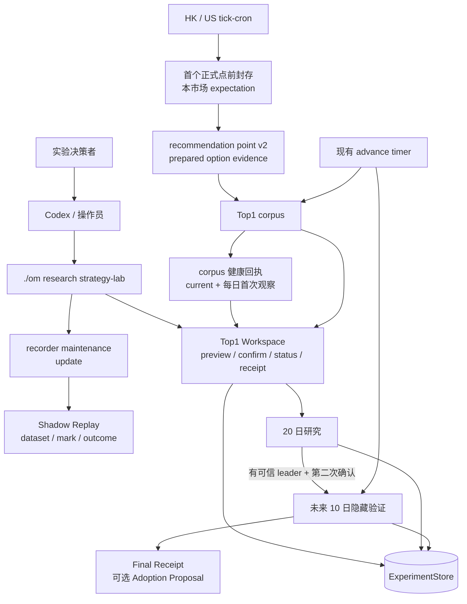

# Strategy Lab 当前运行合同

- **状态**：代码闭环已实现，真实价值验收尚未完成
- **当前阶段**：重新积累连续 20 个完整交易日的正式推荐点事实
- **首个正式 recipe**：HK / `lx` / Sell Put Top1
- **更新时间**：2026-08-29

本文是 Strategy Lab 的当前运行说明。产品范围和验收口径见
[统一策略实验平台 PRD](STRATEGY_LAB_EXPERIMENT_PLATFORM_PRD.md)，已落地模块、函数和存储合同见
[系统设计](STRATEGY_LAB_EXPERIMENT_PLATFORM_SYSTEM_DESIGN.md)。源码、配置验证器、测试和运行回执
仍是最高权威。

## 当前结论

Strategy Lab 目前只有一个产品入口和一个 recorder 兼容入口：

| 入口 | 用途 | 当前状态 |
|---|---|---|
| `top1-loop` | 对 HK / `lx` Sell Put Top1 完成 20 日研究、10 日隐藏验证和最终回执 | 代码已实现；等待连续正式事实，不得提前开始研究 |
| `update` | 为现有 recorder 包装 Shadow Replay dataset build、mark 和 settle 维护 | 兼容保留；默认 dry-run，不是实验入口 |

原通用 `readiness / experiment / proposal / llm-context` 已退役。探索性 dataset 分析和候选影响
继续由 `./om research shadow-replay ...` 直接负责，不再维护第二套 Strategy Lab 实验面。

旧归档 run 不再进入 formal Top1 corpus，也不提供迁移入口。正式研究只使用当前合同前瞻采集的完整
corpus；不能用当前行情、持仓、mark 或 FX 补造历史正式点。

现有 advance timer 在每次正式点发现和捕获后发布 corpus 健康回执。`current` 回执展示当前交易日、
连续完整日数、首个阻塞日、最近成功捕获时间、日历与来源 hash，并以两个 advance 周期为新鲜度上限；
readiness 只读展示该回执，缺失、过期或篡改必须显式报告。最近 20 个成熟交易日另保留首次观察的
不可变日回执，仅用于审计当时观察，不替代 canonical corpus，也不用于补造研究窗口。

代码和测试通过不等于 MVP 已通过。MVP 只有在真实完成一次 20 日研究，并在产生可信
`research_leader` 后经第二次人工确认完成未来 10 个正式推荐日隐藏验证、生成可读 Final Receipt，
才完成价值验收。

## 产品和安全边界

Strategy Lab 负责组织实验，不拥有生产策略、交易或通知：

- Agent 可以澄清假设、准备 preview、调用已授权入口和解释回执；
- 确定性平台拥有事实选择、实验合同、评价公式、状态和回执；
- Agent 不生成运行时权威代码或公式，不自我授权；
- 实验不修改 `config.yaml`、runtime JSON、ledger、trade events、持仓或 broker 状态；
- Adoption Proposal 只是建议，配置变更、发布、部署和启用需要新的独立授权；
- MCP、专用 Skill、跨机认证和飞书控制面不属于当前 MVP。

维护方安全停机只暂停 Strategy Lab 推进，不影响普通扫描、通知、持仓或交易处理。账户级实验 opt-in
和 `strategy_lab_features` 已从当前合同删除。

## 当前架构



模块所有权：

| 能力 | 当前 owner |
|---|---|
| 正式扫描、候选和排序 | `candidate_engine.py`、scheduled tick 产物 |
| 归档、dataset、mark 和 outcome | `src/application/research/`、`shadow_replay/` |
| Top1 实验合同和评价 | `src/application/strategy_lab/top1/` |
| 两次确认编排 | `top1/workspace.py` |
| 生命周期、状态和回执 | `top1/lifecycle.py`、`terminal_projection.py`、`ExperimentStore` |
| 持仓 mark 和 FX | 现有 performance-evidence repository |
| 调度推进 | 现有 `strategy-lab-top1-advance` timer |
| corpus 健康计算、发布和读取 | `top1/corpus.py`；`top1/readiness.py` 只展示读取结果 |

不新增第二套 corpus、FX 存储、调度器、状态库或通用公式 DSL。

## 正式 Top1 工作流

```text
正式推荐点持续取证
  -> current / 每日 corpus 健康回执
  -> 连续 20 个完整交易日 corpus
  -> 研究 preview
  -> 第一次人工确认并运行研究
  -> Research Receipt
  -> 无可信 leader：本轮结束
  -> 有可信 leader：隐藏验证 preview
  -> 第二次人工确认
  -> 未来 10 个正式推荐日隐藏验证
  -> Final Receipt
```

### 1. 正式事实积累

- 只接收 canonical scheduled tick 的正式推荐点；手工扫描不能冒充正式点。
- HK / US 的现有 `tick-cron` 在启动本市场扫描前封存当日 expectation；没有显式受控 runtime root
  时不写正式事实。封存失败只使当日实验事实降级，不阻断普通扫描和通知。
- 每个交易日在首个预期点前完成封存；完整日当前按 12 个正式点校验，半日市按已绑定的
  市场日历校验实际时段。
- 每个点必须具有可验证的 recommendation point、opening snapshot、ranking projection、真实合约
  行情、当时未平仓期权 mark 和 FX 引用。
- 任一预期点缺失、冲突或不可评估，整个交易日不进入研究窗口；不能跳过缺日后拼接 20 日。
- 当天已到下一正式点或已经捕获更晚点时，前一缺点记为 `overdue`；尚未到期的点保持 `pending`。
- 每日不可变回执记录首次成熟观察；`current` 回执按 canonical corpus 重新计算，事实恢复后可恢复健康。
- 回执新鲜不代表研究可启动；只有连续 20 个成熟交易日均完整，research preview 才可用。
- corpus 积累本身不创建实验，也不启动研究或隐藏验证。

### 2. 20 日研究

研究 preview 使用截至指定成熟交易日的最近连续 20 个完整交易日，重建固定 recipe 和全部来源 hash。
第一次确认必须绑定 preview hash；确认后才冻结相同字节并执行研究。

研究没有可信 `research_leader` 是合法结论，但必须停止本轮，不进入隐藏验证，也不为追求 winner
降低样本或证据标准。

### 3. 10 日隐藏验证

只有已发布 Research Receipt 和可信 leader 才能生成验证 preview。第二次确认锁定 challenger、未来
起始交易日、10 个正式推荐日 commitment、评价合同和调度约束。验证期间不向 Agent 泄露中间优劣，
由现有 timer 在 Agent 断开后继续推进。

### 4. 最终回执

Final Receipt 只读取已发布且校验通过的终态投影。结论为 `candidate_for_adoption` 时可内嵌只读
Adoption Proposal；其他结论的 proposal 为 `null`。回执不构成生产变更授权。

## 首个 recipe 和评价合同

首个 case 比较当前 Top1 tie-break 与三个 challenger：当候选收益差处于冻结的 0.2%、0.4%、0.6%
容差带内时，优先选择期权市场集中度更低的真实合约。Top1 只是首个 recipe，不是 Strategy Lab 的
平台实体。

每个 baseline/challenger 先在同一正式点配对，再按交易日聚合：

- 主指标：占用资金年化收益率变化；
- 辅助指标：CNY 收益金额变化；
- 风险输入：recipe 明确声明的硬约束和缺失证据；
- 不使用加权总分，也不把一天多个点当成多个独立交易日；
- Sell Put 和普通 Covered Call 均使用各自冻结的收益率分母口径；
- 原币金额通过已绑定的 opening / terminal FX 转为 CNY，缺失或冲突时 fail closed。

公式、点配对、Student-t、尾部统计和确定性结论由 `economics.py` 与 `statistics.py` 唯一拥有；Agent
不能按实验动态生成另一套评价函数。

## 操作入口

以下命令是 formal Top1 loop 的公开本地入口。所有示例都要求实际 service profile 路径。

只读检查：

```bash
./om research strategy-lab top1-loop readiness \
  --market hk --account lx --profile-path <runtime>/service.profile.json

./om research strategy-lab top1-loop research preview \
  --market hk --account lx --profile-path <runtime>/service.profile.json \
  --cutoff-at-utc <ISO-8601> --latest-mature-trading-date <YYYY-MM-DD>

./om research strategy-lab top1-loop status \
  --market hk --account lx --profile-path <runtime>/service.profile.json \
  --experiment-id <experiment-id>

./om research strategy-lab top1-loop receipt \
  --market hk --account lx --profile-path <runtime>/service.profile.json \
  --experiment-id <experiment-id>
```

确认研究和验证是写操作，必须使用用户确认后的精确命令文件并显式传 `--write`：

```bash
./om research strategy-lab top1-loop research start \
  --market hk --account lx --profile-path <runtime>/service.profile.json \
  --cutoff-at-utc <ISO-8601> --latest-mature-trading-date <YYYY-MM-DD> \
  --confirmed-start-file <confirmed-research.json> --write

./om research strategy-lab top1-loop validation preview \
  --market hk --account lx --profile-path <runtime>/service.profile.json \
  --experiment-id <experiment-id> --validation-start-trading-date <YYYY-MM-DD>

./om research strategy-lab top1-loop validation start \
  --market hk --account lx --profile-path <runtime>/service.profile.json \
  --experiment-id <experiment-id> --validation-start-trading-date <YYYY-MM-DD> \
  --confirmed-start-file <confirmed-validation.json> --write
```

日历、W0R capability receipt、service render 和 scheduled advance 属于运维入口，具体参数和安全边界
见[系统设计](STRATEGY_LAB_EXPERIMENT_PLATFORM_SYSTEM_DESIGN.md)；不得仅为查看状态触发 provider
probe、安装服务或推进实验。

## Recorder maintenance 入口

以下兼容命令只维护本地 Shadow Replay evidence，不计入 formal Top1 验收：

```bash
./om research strategy-lab update --latest
./om research strategy-lab update --latest --build-dataset --write
```

`update` 默认 dry-run；显式 `--write` 才执行本地 collect / settle，`--build-dataset --write` 才构建
latest scanned run dataset。它不会修改生产配置、写交易状态或发送通知。其他本地探索使用
`./om research shadow-replay ...`。

## 当前完成度

| 项目 | 状态 |
|---|---|
| 正式推荐点 v2 与 prepared option evidence | 已实现 |
| 旧归档迁移兼容 | 已删除；正式研究只消费前瞻采集的完整 corpus |
| 20 日 research preview / confirm / receipt | 已实现 |
| 期权市场集中度、CNY 经济结果和双指标评价 | 已实现 |
| 10 日 validation preview / confirm / scheduled advance / Final Receipt | 已实现 |
| 账户级实验 feature gate 删除 | 已完成 |
| corpus `current` / 每日健康回执及 readiness 展示 | 已实现；只报告，不自动修复或启动研究 |
| 连续 20 个完整交易日真实 corpus | 积累中；以运行时 readiness 为准 |
| 真实 Research Receipt 和可信 leader | 未完成 |
| 未来 10 日隐藏验证和 Final Receipt | 未开始；受 research leader 与第二次确认门槛约束 |
| MCP、Skill、跨机 Agent、飞书控制面 | MVP 外，未建设 |

## 验证入口

文档变更后最小检查：

```bash
./.venv/bin/python -m pytest \
  tests/test_strategy_lab_top1_workspace.py \
  tests/test_strategy_lab_top1_readiness.py \
  tests/test_strategy_lab_top1_corpus.py \
  tests/test_strategy_lab_top1_validation.py
```

真实验收不能由测试代替，必须以运行时 readiness、Research Receipt 和 Final Receipt 为证据。
