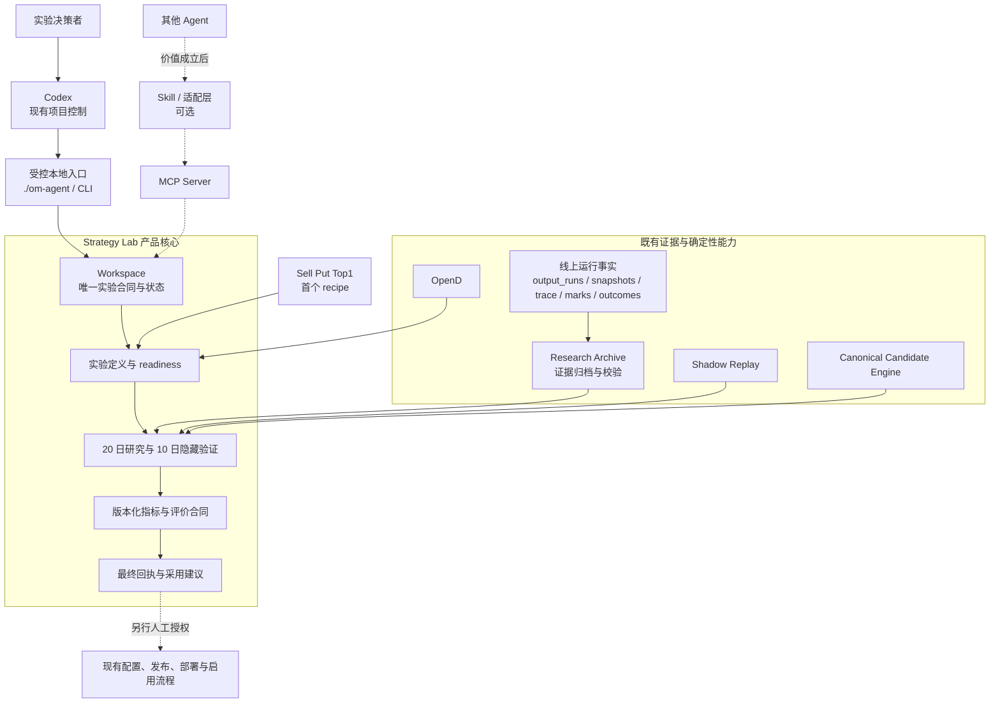
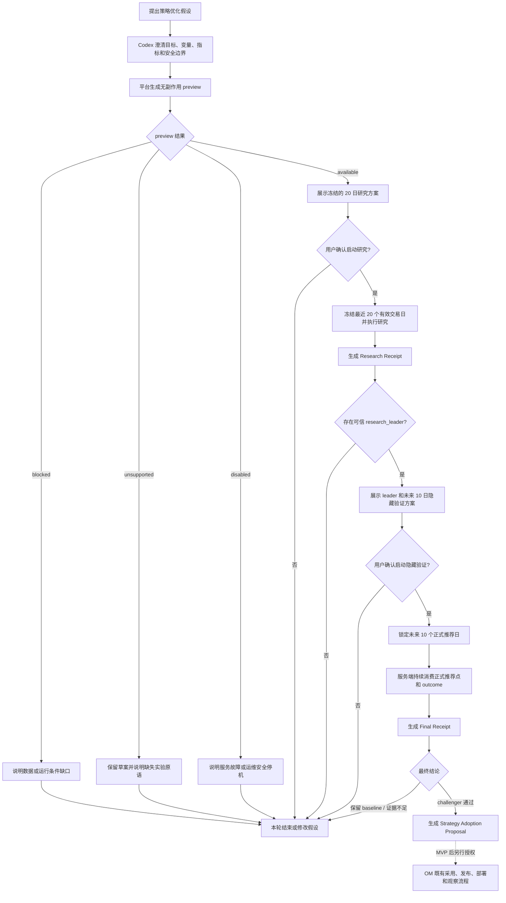
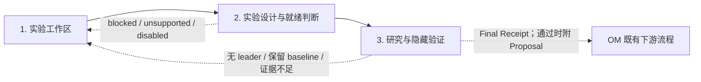

# Strategy Lab 统一策略实验平台 PRD

- **状态**：已确认；实验内核已实现，正式实验事实底座补齐中
- **日期**：2026-08-26
- **产品范围**：Agent 可接入、基于历史证据和未来隐藏验证的策略实验工作流
- **首个实验配方**：Sell Put Top1 推荐优化（HK / lx）
- **后续策略**：Covered Call、Combo Yield
- **文档性质**：产品需求；不规定具体代码拆分、数据库表或服务数量

本文是统一实验平台的产品权威。当前运行状态见 `docs/STRATEGY_LAB_DESIGN.md`，已落地技术合同见
`docs/STRATEGY_LAB_EXPERIMENT_PLATFORM_SYSTEM_DESIGN.md`。本 PRD 描述产品范围和验收门槛，不用来
判断某个运行环境已经积累了多少正式数据；
动态状态以 readiness 和不可变回执为准。

## 1. 产品摘要

- **目标**：利用 Agent 构造和质疑策略假设，由确定性实验平台验证；通过受控配置优化提高线上
  实际收益率，同时保持既有风险边界。
- **分工**：Agent 负责假设、声明式实验草案、解释和下一轮建议；平台负责事实、版本化指标、
  评价合同、执行、判断和回执。Agent 不直接修改策略、配置或交易状态，也不在实验运行时生成
  权威公式或动态代码。
- **执行边界**：用户可以提出任意假设，平台只执行能力目录中明确支持且当前就绪的 recipe；
  能力缺失、数据阻塞和功能停用必须明确区分，不生成代码或降低证据标准绕过。
- **验证流程**：先运行过去 20 个交易日研究；只有产生可信 `research_leader`，并经用户再次
  确认，才进入未来 10 个正式推荐日隐藏验证。
- **数据连续性**：HK / US 每个正式推荐点都在同一 canonical scheduled run 内保存两类互补事实：
  一次生产候选扫描，以及一次共享的账户持仓行情快照；首期覆盖 `lx`。两类事实还必须通过
  300 秒的时间一致性合同，同一 run 本身不等于同一时点。所有 recipe 复用该快照，不单独请求行情；
  重试必须复用已封存事实。不能验证的历史缺口明确阻断对应交易日，不用当前行情补造。
- **采用边界**：challenger 通过后生成与证据绑定的 Strategy Adoption Proposal；配置、发布、
  部署和启用分别授权，上线后继续观察实际收益和安全指标。
- **产品形态与交付**：MVP 复用现有 Codex 项目控制和受控本地入口，不开发 Agent 接入；先用
  Top1 完成一次 20 日研究和 10 日隐藏验证。证明价值后，再建设 MCP、Skill、跨机认证和其他
  Agent 适配，飞书后置可选。

## 2. 背景与问题

Options Monitor 已具备实验所需的部分基础：Strategy Lab 的 hypothesis / experiment / proposal，
Research Archive 的证据归档与校验、Shadow Replay 的回跑能力、canonical Candidate Engine，
以及一个已落地的 Sell Put 验证 case。这些是可复用的实现基础，不是并列产品模块。

PRD 立项时的主要缺口是：

1. 策略假设主要依赖人工提出，Agent 尚不能通过统一合同发现当前能验证什么、缺少什么；
2. 假设、实验设计、历史研究、隐藏验证、回执和采用建议尚未组成一个连续用户流程；
3. 现有能力分散在不同内部入口，若按 recipe 继续扩展，会重复建设 readiness、状态和事实存储；
4. 现有 Tool Gateway 主要面向本地 `./om-agent`，跨 Agent、跨设备接入仍需理解目录、CLI 或 SSH；
5. 实验结论尚未稳定衔接配置采用、受控上线和实际收益观察，无法完整回答优化是否在线上有效。

当前主线已经补齐 Top1 的两次确认、20 日研究、10 日隐藏验证、评价和终态回执代码，并删除账户级
实验 feature gate。现有 Top1 corpus 只保存 HK / `lx` accepted candidates，足以支持当前 Top1 排序
case，但不是可支持后续筛选实验的通用事实底座；完整候选快照仍主要位于短期 `output_runs`。尚未
完成的是把 HK / US 正式点的完整候选决策集合持久化到既有 Research Archive、形成可查询的每日健康
回执、积累连续正式事实，以及生成真实 Research / Final Receipt。MCP、Skill、跨机 Agent 与飞书仍在
MVP 外。不要继续从上述立项缺口推断当前代码状态。

本 PRD 不重写既有研究和策略内核，而是在它们之上建立一个权威 Strategy Lab Workspace，
完成“Agent 构造假设—平台验证—采用建议—受控上线—结果观察”的统一闭环。产品统一过程中，
同步合并或删除已被替代的重复入口、状态、存储和调度实现，降低现有代码复杂度。

## 3. 产品定位

### 3.1 用户任务

产品服务于以下核心任务：

> 我可以提出任何关于当前策略的可证伪改进假设。系统应先告诉我这个假设现在能否被可靠
> 实验；能做时利用已有数据和未来真实推荐点判断它是否比当前策略更好，不能做时明确告诉
> 我缺少什么。验证通过后，系统应明确建议调整哪些线上配置、为什么值得调整、风险和回滚
> 条件是什么，再由我决定是否通过独立受控流程上线，而不是直接替我修改生产策略。

产品 MVP 不开发新的 Agent 接口，而是复用当前 Codex 对项目的控制能力，完成一次完整实验：

> 冻结一个已支持的 Top1 假设，使用真实数据完成 20 个有效交易日研究；只有产生可信
> `research_leader`，并经用户再次确认，才进入未来 10 个正式推荐日隐藏验证并生成最终回执。

Sell Put Top1 只是 MVP 的首个验证 case，不是产品目标或平台核心实体。

### 3.2 现有能力的产品归位

实线是 MVP 复用路径，虚线是价值成立后才建设的 Agent 接入：



| 能力 | 产品职责 | 是否直接暴露给普通用户 |
|---|---|---:|
| Agent Skill / 适配层 | 理解自然语言、澄清假设、调用稳定工具、解释结果 | 可选 |
| MCP Server | 价值成立后的标准工具发现、远程连接和身份边界 | 后续 |
| Strategy Lab Workspace | 唯一实验执行合同和服务端工作区 | 通过工具合同暴露 |
| `./om-agent` | MVP 受控本地验证、运维和诊断入口 | 仅高级用户 |
| 线上运行事实 | 提供 output_runs、snapshot、trace、mark 和 outcome 等权威证据 | 否 |
| Research Archive | 收集、校验、索引和选择线上运行证据 | 否 |
| Shadow Replay | 确定性研究回跑和结果计算 | 否 |
| Canonical Candidate Engine | baseline 和 challenger 的唯一候选执行权威 | 否 |
| OpenD | 补充能够被验证的缺失事实 | 否 |
| GitHub Issue | 缺少实验原语时的工程交接 | 仅经用户确认后创建 |
| 飞书 | 可选沟通与通知入口 | 后置可选 |

#### 与 OM 其他模块的关系（参考）

Strategy Lab 不是 OM 的第六个产品域，而是现有“研究与复盘”域内的实验产品。以下关系服从
[OM 产品架构](PRODUCT_ARCHITECTURE.md)中已有的模块 owner：

| OM 产品域或模块 | 与 Strategy Lab 的关系 | 权威边界 |
|---|---|---|
| 研究与复盘 | Strategy Lab 与 Research Archive、Shadow Replay、readiness gates 同属该域 | Strategy Lab 只拥有实验定义、生命周期、判断和回执 |
| 运行与通知 | 提供 output_runs、正式推荐点、snapshot、trace、mark 和 outcome；未来可交付实验进度和回执 | 通知只消费结果，不影响实验判断；Strategy Lab 不拥有通知渠道 |
| 开仓机会监控 | Canonical Candidate Engine 确定性执行 baseline 和 challenger | Strategy Lab 不复制筛选、排序或硬风控规则 |
| 持仓管理 | 按实验需要提供账户、持仓、现金和风险上下文 | 只读引用；实验不得修改持仓、交易或账本 |
| 配置与控制面 | `./om`、`./om-agent`、Inbound 和后续 MCP 承担入口、身份、preview 与确认 | 入口不拥有 recipe、实验状态或结论 |
| 飞书渠道适配 | 输入经 Inbound Assistant / Control，输出经既有消息渲染和交付能力 | 飞书不直连实验内部代码或保存状态；确认消息由 Control 处理，渠道适配器不直接 apply |
| OpenD / Futu 等外部适配 | 补充能够验证来源和观察时间的缺失事实 | 不得补造当时不存在的历史行情、账户状态或推荐事实 |
| 配置、源码交付、发布、部署与启用 | 接收人工采纳的 Strategy Adoption Proposal | 每一步另行授权、readback；实验确认不能复用为上线授权 |

Strategy Lab 拥有 Experiment Spec、实验生命周期状态、研究与隐藏验证结论、Final Receipt 和
Strategy Adoption Proposal。它不拥有市场事实、候选规则、持仓与交易状态、生产配置、通知
渠道或发布部署流程。

具体实验 recipe 不属于产品模块，不在本表列举。Sell Put Top1 只作为当前种子 case 在 17.2
定义，用于验证这套通用工作流，不获得独立入口、状态或平台职责。

## 4. 用户与权限边界

Strategy Lab 的核心用户只有一类：实验决策者。MVP 不建设多角色账号或 RBAC。

| 参与方 | 职责 | 权限边界 |
|---|---|---|
| 实验决策者 | 提出实验目标，确认研究和隐藏验证，决定是否采纳结果 | 是实验确认的唯一来源 |
| 研究 Agent（MVP 为当前 Codex） | 澄清假设、准备 preview、调用已授权动作、解释回执 | 不得自我授权、修改平台事实或生产状态 |
| 实验平台 | 校验能力和数据、确定性执行、保存状态并生成回执 | 不替用户确认，不修改生产配置 |

以下三个动作必须分别授权：

1. 根据冻结的 preview 启动 20 日研究；
2. 根据研究回执启动 10 日隐藏验证；
3. 根据最终回执采纳配置或工程建议。

第三项发生在 Strategy Lab 之外，继续使用 OM 既有的配置、开发、发布和部署授权流程。平台
维护和变更实施也沿用对应的 OM 运维与工程流程，不属于 Strategy Lab 的产品角色。

## 5. 产品目标

1. 借助 Agent 将自然语言策略假设整理为清晰、可证伪的实验定义；假设输入开放，平台只执行
   已声明能力和安全边界内的方案。
2. 复用 OM 的权威事实、Canonical Candidate Engine 和确定性回放能力，完成可复现的历史研究
   与未来隐藏验证，并生成可审计回执。
3. 在不重复生产扫描的前提下，持续保存 HK / US 正式推荐点中可复算的候选决策事实，使新假设
   能先基于已积累事实判断是否可执行，而不是每次升级后重新等待数据。
4. 将通过验证的结果转换为包含证据、风险、回滚和观察要求的 Strategy Adoption Proposal，
   交给 OM 既有受控流程另行决定是否采用。
5. 以 Workspace 作为唯一实验合同和状态权威，使当前本地入口与未来 Agent 接入共享同一套
   能力判断、状态和结论。
6. 在统一流程完成替代后，删除或合并重复入口、状态、存储、调度和兼容代码，降低维护成本。

### 5.1 MVP 目标

MVP 不开发新的 Agent 接入，复用当前 Codex 项目控制和受控本地入口。先补齐 HK / US、`lx` 的
正式实验事实积累和每日健康回执；实验执行仍只使用 Sell Put Top1 种子 recipe，在 HK / `lx` 最近
20 个有效交易日上产生可信 `research_leader`，经用户再次确认后完成未来 10 个正式推荐日隐藏
验证，并生成最终回执。

没有可信 `research_leader` 时，本轮应正确停止，但不能据此认定产品价值已经成立，也不进入
Agent 接口产品化。

产品北极星不是创建了多少假设、运行了多少实验或产生了多少 MCP 调用，而是：有充分证据的
配置优化被安全采用后，线上实际收益指标得到改善且安全指标没有变差。在完成上线观察前，
实验结果只能表述为证据和建议，不能表述为已经实现的线上收益。

## 6. 非目标

### 6.1 MVP 不包含

- 新的本地 Agent 接入、专用 Skill、MCP、跨机认证、飞书入口或多 Agent 适配；
- 多实验并行、跨实验投影缓存优化，或 Top1 之外 recipe 的产品化；
- 多用户、角色账号、RBAC 或用户和账户级实验室开关；
- 根据实验结果修改生产配置或策略源码，以及后续发布、部署、启用和上线收益观察。

### 6.2 产品边界

本产品不做：

- 预测股票或期权价格，或把一次实验描述为全局最优参数；
- 自动创建或启动下一期实验，自动采用胜者，自动修改生产配置、下单、调仓或写交易账本；
- 让 LLM 代替确定性指标计算、安全判断或实验结论；
- 执行任意 Python、SQL、表达式或动态代码；
- 用 OpenD 等数据源事后补造当时不存在的 option chain、精确 Bid/Ask 或账户状态；
- 为了支持未知的未来假设而保存完整 provider raw payload、全部 option chain 或无限期行情时序；
- 建设第二套 Candidate Engine，或为不同入口复制实验状态机和业务判断；
- 把实验通过直接等同于线上收益已经提高，或因 challenger 收益更高而放宽硬风控；
- 以简化代码为名重写既有研究或策略内核，或在替代流程可用前删除兼容入口。

## 7. 核心产品原则

### 7.1 一个执行合同，多种 Agent 入口

```text
MVP：现有 Codex 项目控制 → 受控本地入口 ──────────┐
后续：Agent → Skill / 适配层（可选）→ MCP ────────┤
                                                ↓
                                  Strategy Lab Workspace
   ├─ capability catalog
   ├─ 证据解析与 readiness
   ├─ Experiment Store / Receipt
   └─ recipe execution
        └─ Sell Put Top1（首个配方）
```

“一个入口”指一个权威执行合同，不限制用户只能使用一个聊天产品。`./om-agent`、后续 MCP 和
未来飞书入口必须调用同一 Workspace，不能各自实现能力判断、实验状态或结论。

MVP 路径只是价值验证方式，不构成本地 Agent 产品接入。Codex 使用现有项目权限调用受控入口；
后续 MCP 接入复用同一应用服务，不重做实验逻辑。

### 7.2 事实和推理分离

- 程序负责事实、数据契约、版本化指标、候选执行、评价合同、统计判断和回执；
- LLM 负责假设、解释、质疑和下一轮草案，并可引用能力目录中已注册的 recipe、指标和评价合同
  构造声明式 Experiment Spec；
- LLM 输出不能改变实验事实、样本数量、指标或结论状态。
- 未注册公式、自由 Python / SQL / 表达式和 Agent 临时计算结果不是实验能力。

### 7.3 唯一候选权威

所有 baseline 和 challenger 都必须调用 canonical Candidate Engine。实验层不得复制生产
过滤和排序逻辑。

当实验修改 DTE、收益门槛等可能扩大候选范围的参数时，不能只对生产已接受候选重新排序，
必须从该推荐点可恢复的最大安全候选全集重新运行完整过滤和排序。

### 7.4 人工确认边界

LLM 可以主动提出假设，但不能自动启动实验。至少存在两个确认点：

1. 用户确认 Experiment Spec 后，才能运行历史研究；
2. 用户确认研究胜者后，才能锁定 challenger 并开始未来隐藏验证。

实验完成后，LLM 可以提出下一轮假设草案，但不能自动创建下一期。

### 7.5 开放假设，封闭执行

用户可以提出任何策略假设，但“能表达”不等于“能执行”。平台通过服务端能力目录声明当前
支持的 recipe、策略族、账户和市场范围、可变参数、版本化指标、评价合同、安全不变量、数据要求和限制。

Agent 必须先读取能力目录，再通过引用已注册的 recipe、指标和评价合同提交候选
Experiment Spec 给 preview。Agent 可以选择和组合已声明的能力，不能为该次运行定义新公式或可执行代码。
preview 是当前时点的最终执行权威，并返回以下一种结果：

| 结果 | 含义 | Agent 下一步 |
|---|---|---|
| `available` | recipe 和数据当前可执行 | 展示规范化实验卡，等待用户确认 |
| `blocked` | recipe 已支持，但当前数据或运行条件不足 | 解释缺口，等待事实或条件恢复 |
| `unsupported` | 缺少 recipe、变量、指标、评价合同、数据合同或安全原语 | 说明能力缺口；可生成工程任务草案 |
| `disabled` | 能力已实现，但被运维或安全开关临时停用 | 说明停用范围，不尝试绕过 |

未出现在能力目录中的能力一律视为 `unsupported`。能力目录是发现面，不是授权凭证；apply
仍需重验目录版本、readiness、spec hash、身份和确认状态。

### 7.6 Skill 不是实验平台

Codex Skill、Claude Skill 或其他 Agent 适配层可以定义如何澄清假设、何时调用 capability / preview、
如何展示确认和解释回执，但不得：

- 硬编码当前支持的 recipe 或参数清单；
- 在本地计算权威指标或推导最终结论；
- 保存另一份实验生命周期状态；
- 因客户端支持不同而改变平台安全边界；
- 在平台返回 blocked、unsupported 或 disabled 时生成代码绕过。

没有专用 Skill 的通用 MCP 客户端也应能仅依赖工具描述和 JSON schema 完成能力发现、preview、
状态查询和回执读取。Skill 提升体验，不是正确性的前提。

### 7.7 从实验结论到线上优化

实验平台负责回答“这个假设是否得到足够证据支持”，并在 challenger 通过时生成 Strategy
Adoption Proposal。该 proposal 至少包含：

- 关联的 experiment id、最终回执 ref / hash 和行为版本；
- 建议采用的变量值，以及能够安全映射时对应的配置项；
- 当前值、建议值、适用账户和市场；
- 预期改善指标、证据强度和不能推断的内容；
- 必须保持的安全不变量；
- 上线前检查、上线后观察指标、观察窗口和回滚条件；
- `config_only`、`engineering_required` 或 `not_adoptable` 的采用方式。

proposal 只是一份建议，不是配置写入授权。Agent 可以在新的任务和授权下，把 `config_only`
建议转换为现有配置 authoring transaction 的 preview；需要代码的建议进入独立工程流程。
源码交付、合并、发布、部署、功能启用和生产配置写入都保持各自权限边界。

上线观察必须使用预先声明的实际收益和安全指标，并说明市场环境、人工交易和样本量等混杂
因素。只有上线事实支持预期方向且安全指标未变差，才能称为一次成功的线上配置优化；否则
应保留现状、继续观察或按既定条件回滚。

## 8. 核心工作流

### 8.1 MVP 核心流程



20 日研究针对已冻结历史数据执行，不需要等待 20 个未来交易日。只有隐藏验证需要由服务端在
未来 10 个正式推荐日持续推进；Agent 断开不影响其状态。没有可信 `research_leader` 时，本轮
生成 Research Receipt 后结束，不能进入隐藏验证。

虚线后的采用、发布、部署和线上观察不属于 MVP，也不能复用研究或隐藏验证确认。

### 8.2 用户可见状态

preview 结果使用 10.1 定义的四态，尚未创建实验。用户确认精确 preview 并创建实验后，仅展示
以下生命周期状态，不暴露内部 generation、event 或 store 状态：

| 状态 | 含义 |
|---|---|
| 研究中 | 已冻结 20 日研究输入，正在执行确定性研究 |
| 待确认隐藏验证 | 已产生可信 `research_leader`，等待用户确认未来验证方案 |
| 隐藏验证中 | challenger 已锁定，正在累计未来样本或等待必要 outcome |
| 已完成 | 已生成最终结论和回执 |
| 已结束 | 无可信 leader、用户未继续或实验无法安全推进，并附原因和已有回执 |

状态由服务端保存。Agent 断开、升级或更换客户端不得改变实验状态；授权用户可用
`experiment_id` 重新查询。客户端显示的本地对话历史不是实验状态权威。

## 9. 产品模块

Strategy Lab 只包含 3 个产品模块，按用户实验任务划分，不按协议、数据源、recipe 或当前代码
目录划分。

| 产品模块 | 产品责任 | 主要输出 |
|---|---|---|
| 1. 实验工作区 | 建立账户和市场上下文；承接假设草案并保存唯一实验合同和状态 | Workspace Context、Hypothesis Draft |
| 2. 实验设计与就绪判断 | 规范化 Experiment Spec，执行无副作用 preview，展示实验卡和明确缺口 | Experiment Preview、Experiment Spec、Capability Gap |
| 3. 研究与隐藏验证 | 经两次独立确认执行 20 日研究和 10 日隐藏验证，生成确定性结论；challenger 通过时附带采用建议 | Research Receipt、Validation Status、Final Receipt、Strategy Adoption Proposal |



以下内容不单独成为产品模块：

- MCP 和 Skill 是接入与交互方式；
- capability catalog 是“实验设计与就绪判断”的运行时输入；
- 版本化指标和评价合同是“研究与隐藏验证”的确定性内核；
- Top1、DTE、Covered Call 等是 recipe 或 case；
- OpenD、Research、Shadow Replay、Candidate Engine、ExperimentStore 是技术支撑或现有事实权威；
- GitHub Issue 是能力缺失时的异常交接路径；
- 配置 authoring、源码交付、发布、部署和生产启用是既有下游受控流程，Strategy Lab 只负责交接，
  不复制这些产品能力。

身份与 scope、人工确认、幂等、审计、证据来源和服务端状态是三个模块共同遵守的横切产品
合同，不为每项合同再建一个用户模块。

## 10. 实验合同

### 10.1 假设与执行预览

Agent 可以把任何自然语言策略想法整理为 hypothesis draft，但 Strategy Lab 不需要保存未确认或
无法执行的草案。平台只对候选实验定义执行无副作用 preview，并重新校验 recipe、账户和市场
范围、数据 readiness、安全边界及当前行为版本。

preview 必须返回以下四态之一：

| 结果 | 含义 |
|---|---|
| `available` | 当前能力和证据支持执行 |
| `blocked` | recipe 已支持，但数据或运行条件不足 |
| `unsupported` | 缺少 recipe、变量、指标、评价合同、数据合同或安全原语 |
| `disabled` | 服务因故障或运维安全停机而暂停执行 |

返回结果还必须包含规范化 Experiment Spec 或明确原因、证据和能力缺口、生产影响、preview
hash、失效条件及所需确认。只有 `available` 可以进入确认；其余结果不创建实验。能力目录或
来源事实变化后，旧 preview 必须失效。

### 10.2 Experiment Spec 与确认

Experiment Spec 至少冻结：账户和市场、策略族、可证伪假设、baseline、challenger 及允许变化
范围、研究窗口、真实合约比较单位、CNY 比较币种与 FX 证据合同、主要指标、收益率分母、
收益金额、持有期起止、安全指标、fill 与 outcome 口径、recipe / 指标 / 评价合同的标识和版本、
事实来源和行为版本。

MVP 种子实验在用户确认前展示以下实验卡：

```text
实验问题｜扩大“收益接近”范围后优先选择期权市场集中度更低的标的，是否改善 Sell Put Top1？
范围｜HK / lx / Sell Put
历史研究｜过去 20 个有效交易日
对照｜baseline = 当前线上 `current_tie_break`
变体｜challenger = 期权市场集中度，收益容差分别为 0.2 / 0.4 / 0.6 个百分点
选择指标｜`option_market_concentration_after.v1`
主指标｜Top1 到期年化资金效率的按日配对差
收益约束｜一张真实 Top1 合约的到期经济损益（CNY）按日配对差不得下降
解释指标｜Top1 变化次数和期权市场集中度变化
安全边界｜可接受价格接货、现金容量、流动性、事件风险等现有硬约束不变
后续验证｜研究胜者经确认后进入未来 10 个正式推荐日隐藏验证
生产影响｜无；不修改配置、不发送策略通知、不自动采用胜者
```

用户只确认精确 preview hash。确认后才能创建实验，并冻结 spec、评价规则、来源引用和行为
版本；任何变化都必须使旧确认失效，实验运行中不得静默修改。

### 10.3 MVP 20 日历史研究

1. 使用用户确认的最近成熟交易日作为终点，从已绑定交易日历选择连续 20 个有效交易日；
   缺日不得用更早日期替换。
2. 完整交易日必须包含当天全部正式推荐点；HK / lx 当前为 12 个，半日市按交易日历和对应
   scheduler 合同确定实际有效点。点数不是交易日数，任一预期点缺失时整日不得进入 20 日样本。
3. 实施时先对现有 `output_runs`、Research Archive、Shadow Replay、performance evidence 和 Top1
   corpus 做只读历史迁移审计。只有能够证明 scheduler 点身份、候选事实、当时持仓、事实时点 mark、
   FX 和来源 hash 的旧数据才能成为 `ready`；只有存在 `ready` 点时才增加并执行显式、幂等的 apply。
   全部为 gap 时，preview 和逐点 gap 清单即为本轮迁移审计结果，不增加无效写入口；任何迁移都不得
   改写源 artifact 或伪造缺失事实。
4. 复用 Research Archive 和 Shadow Replay 的来源引用及内容 hash，不复制完整 candidate snapshot、
   option chain 或 provider payload，也不创建第二套归档。
5. baseline 和所有 challenger 共享相同窗口、point ids 和输入事实，并调用同一个 Canonical
   Candidate Engine；执行方式不得改变输出顺序或胜者规则。
6. 当前 Top1 种子 recipe 只研究同一点 accepted Sell Put 候选内的排序变化。DTE、收益门槛等会
   扩大候选范围的请求必须返回 `unsupported_universe_scope`。
7. 期权持仓、事实时点 mark、FX 和人民币净收入等上下文只能来自同一账户已归档且被 hash
   绑定的事实；缺失或漂移时 fail closed。
8. OpenD 可以补充交易日历、已知标的价格、合约 K 线和到期收盘，但不能补造历史 option chain、
   精确 Bid/Ask、账户状态或当时推荐点。
9. 当前 Top1 历史研究使用 `t0_assumed_fill`，并将推荐点封存的 `sell_limit` 作为
   假设成交价，即 `t0_sell_limit`；不得描述为当时真实成交。
10. MVP 保留当前线上 `current_tie_break` 作为 baseline，并比较使用期权市场集中度且收益容差为
   0.2 / 0.4 / 0.6 个百分点的三个 challenger；必须允许无胜者或证据不足。
11. 执行前必须重新校验窗口、日历和全部来源 hash；关键事实无法验证时不得降低样本标准。

### 10.4 MVP 10 日隐藏验证

1. 只有可信 `research_leader` 经用户独立确认后才能进入隐藏验证。
2. 验证固定使用开始后的未来 10 个正式推荐日，不与历史 20 日重叠。
3. 开始前锁定 challenger、评价规则、交易日和每天预期推荐点；预期点来自生产 scheduler 的
   正式计划，不由实验另建时间表。
4. 完整交易日使用当天全部正式推荐点；半日市使用交易日历中的实际有效点。
5. 缺失预期点、输入冲突或结果不可评估时，该交易日不能伪装成完整样本。
6. 使用预先封存的 observed fill 口径：从推荐点起，在已冻结观察窗口中首次发现
   `bid >= sell_limit` 时，按 `sell_limit` 记为成交。全部预期观测完整且始终未穿越时才记为未成交；
   任一所需观测或报价缺失、冲突或不合法时，该 arm 不可评价。不得事后挑选价格或窗口。
7. 10 日只是推荐样本采集窗口。评价依赖到期结果时，实验继续显示等待 outcome，直到事实齐备
   或明确无法评估。
8. 验证期间不向 Agent 或用户暴露可用于修改 challenger 的中间效果，只展示进度和数据缺口。
9. 服务端保存并持续推进验证状态，Agent 断开不影响实验。

### 10.5 结论与回执

20 日研究完成后生成 Research Receipt；没有可信 `research_leader` 时本轮结束。完成隐藏验证后
生成 Final Receipt，最终结论只有以下三类：

| 结论 | 含义 |
|---|---|
| challenger 通过 | 效果和安全证据满足预先封存规则，可进入人工策略评审 |
| 保留 baseline | challenger 未改善、尾部变差或触发安全边界 |
| 证据不足 | 样本、事实或置信证据不足，不能判断优劣 |

回执必须绑定冻结 spec、行为版本、窗口和来源 hash，列出样本、限制、缺失事实、结论依据和
反例。“通过”不等于自动采用或全局最优；只有 challenger 通过时才附带 Strategy Adoption
Proposal。

Strategy Lab 在生成 Final Receipt 和可选 Proposal 后结束。是否采用、修改配置或源码、发布、
部署、启用和线上观察，均属于 OM 既有下游流程，必须另行授权。

## 11. Top1 替换通用评价合同

### 11.1 适用范围与冻结原则

本节定义 Strategy Lab 对 Top1 替换实验的通用评价机制，不绑定账户、市场或策略族。只要 baseline
和 challenger 在同一推荐点各产生一个 Top1，并能按冻结的 recipe 合同输出标准经济结果，就使用
同一套配对、聚合、判断和选胜规则。具体策略只负责计算单个 Top1 的收益率分母、收益金额和安全
结果，不得另建一套评价器。

评价能力分为三层：

```text
权威事实（行情、持仓、合约、fill、outcome、费用、FX）
    ↓
版本化指标（收益、资金分母、集中度及 recipe 特定结果）
    ↓
版本化评价合同（配对、聚合、门槛、统计和选胜）
```

Agent 只能在 Experiment Spec 中引用能力目录已注册的三层合同，不能为某次运行生成新公式、
Python、SQL 或自由表达式。不同实验可以使用不同的策略指标，但只要都产生本节的标准经济结果，
就复用同一评价合同。缺少必要指标或评价合同时返回 `unsupported`，经独立工程实现、测试和注册后才能
重新 preview；MVP 不建设通用公式 DSL。

当前研究和隐藏验证使用同一版确定性判断规则，但输入窗口和 fill 事实不同：研究使用 20 个有效
交易日和按 `t0_sell_limit` 计价的 `t0_assumed_fill`，隐藏验证使用之后 10 个正式推荐日和
`observed_fill`。置信水平、尾部比例、风险条件和选择顺序必须在第一次 preview 前冻结；任何变化
都需要新版本 spec 和重新确认。

MVP 只评价 Top1 替换后的两个变化，不合成为加权总分：年化收益率变化是主指标，收益金额变化是
不劣约束。仅收益金额提高不能使 challenger 通过，因为它可能只是使用了更大的收益率分母或持有
更久。投资组合收益、仓位分配、回撤、风险调整收益和其他评价维度不在 MVP 内，出现明确需求后再
扩充合同版本。

### 11.2 单个 Top1 的标准经济结果

每个 recipe 必须为 baseline 和 challenger 的 Top1 输出同一份标准结果：

```text
return_capital_basis_cny
economic_pnl_cny
holding_calendar_days
annualized_return = economic_pnl_cny / return_capital_basis_cny / holding_calendar_days * 365
```

对已成交的 arm，研究使用 `t0_assumed_fill` 的市场本地日期作为 `holding_start_date`，隐藏验证
使用 `observed_fill` 的市场本地日期。终点是该真实合约的到期日，并使用到期收盘结果：

```text
holding_calendar_days = (expiration - holding_start_date).days
```

`holding_calendar_days` 必须大于等于 1；非正值不得修正为 1，该 arm 应为不可评价。本合同只计算
持有至到期的合约结果，不包含到期后接货持股、Wheel、人工平仓或展期。到期结果尚未成熟时只能
显示等待 outcome；到期后所需事实仍缺失或冲突时，结论为证据不足。

`return_capital_basis_cny` 是统一折算为 CNY 的收益率分母，不是开仓容量。Sell Put 先按原币
计算扣除开仓净权利金后的 `net_cash_basis`；普通 Covered Call 先按原币计算推荐时的股票
当前市值 `spot * multiplier`，不扣权利金；再用开仓事实时点的 FX 换算。
Sell Put 的现金担保能力和 Covered Call 的股票覆盖能力只作为容量与安全约束，不进入收益率分母。
指派后 Wheel 必须使用自己的生命周期资金合同，不能套用普通 Covered Call 口径。

`economic_pnl_cny` 是与该收益率使用同一经济所有者、同一持有窗口的 CNY 收益金额，不等同于
账户实际总收益。开仓权利金、到期标的损益和费用等原币金额必须分别使用各自事实发生时点的
`FXRateFact` 换算后求和，不得用当前或单一时点汇率回算整段历史损益。CNY 原币金额按 1:1 计入。

每个 arm 使用其实际选中的一张 Top1 合约，保留真实合约标识、到期日、strike、multiplier、原币金额和
币种；汇率换算只统一比较币种，不改变合约数量，也不得换算成标准合约、等资金或等名义本金。
baseline 和 challenger 必须使用相同费用版本、fill 规则、outcome 规则和 FX 选择规则。实际开仓数量由实验外的
人工决策决定，不进入本合同。baseline 和 challenger 可以选中不同到期日；年化收益率用于归一化期限，
但 CNY 收益金额仍是各自一张合约持有到期的总损益。因此 challenger 即使年化收益率更高，只要缩短期限后
收益金额下降，仍按 11.4 判为证据不足。

研究结果不得描述为历史真实成交。隐藏验证只有在所有预期观测完整、有效且均未满足
`bid >= sell_limit` 时，才确认未观察到 fill，该 arm 使用
`holding_calendar_days = null`、`economic_pnl_cny = 0` 和 `annualized_return = 0`，不得伪造起始日或事后改价。

所需的成交、期限、资金基数、到期收盘、费用或 FX 事实缺失、过期、冲突或不合法时，该 arm 不可评价，
阶段结论必须为证据不足；不得将缺失 FX 记为零或回退到当前汇率。回执必须保留原币金额和币种，并绑定
每个非 CNY 金额使用的 `FXRateFact` 事实引用、汇率、生效与观测时间、来源及来源 hash。Experiment Spec 和
回执必须冻结具体策略使用的指标与经济合同标识、版本和规范化公式展示；通用评价器只消费标准结果，
不推测或修补策略事实。

### 11.3 点配对、按日聚合与统计输出

baseline 和 challenger 必须在同一 `recommendation_point_id` 上配对：

```text
annualized_return_delta = challenger_annualized_return - baseline_annualized_return
pnl_delta_cny = challenger_economic_pnl_cny - baseline_economic_pnl_cny
daily_annualized_return_delta = 同一交易日全部有效 annualized_return_delta 的算术平均值
daily_pnl_delta_cny = 同一交易日全部有效 pnl_delta_cny 的算术平均值
return_capital_basis_delta_cny = challenger_return_capital_basis_cny - baseline_return_capital_basis_cny
```

两者选择同一 Top1 时两个经济 delta 均为零。只有一侧缺少正式选择，或已配对但缺少任一侧经济结果
时，结论为证据不足；两侧都没有候选时该点不产生 delta，并在有效交易日不足时归为证据不足。
一天存在多个推荐点时，每个指标仍只形成一个 daily delta，不得把点数当成独立交易日扩大样本。

20 日研究必须有 20 个同时具备两个 daily delta 的有效交易日，10 日隐藏验证必须有 10 个；缺日
不得替换或静默排除。
每个阶段至少输出：

- `mean_daily_annualized_return_delta`；
- 年化收益率差的样本标准差、标准误和 95% 单侧 Student-t 置信下界；
- 最差 20% 交易日的平均年化收益率差，天数向上取整；
- `mean_daily_pnl_delta_cny`，以及 baseline、challenger 各一张真实合约的原币与 `economic_pnl_cny` 摘要；
- `mean_daily_return_capital_basis_delta_cny`，只作为收益率分母变化的解释项；
- Top1 实际变化次数、有效点数和缺失原因；
- recipe 冻结的硬风控与安全不劣检查结果。

除本合同明确规定的收益金额零下降不劣界外，统计临界值必须在 spec 中冻结并写入回执，不能
藏在实现中。回执必须说明该小样本统计未校正序列相关，也不能把结果解释为全局最优或线上收益
已经提高。

### 11.4 单个 challenger 的判断规则

判断顺序采用以下确定性合同：

| 条件 | 结果 |
|---|---|
| 任一硬风控违规 | 保留 baseline |
| 硬风控或安全不劣证据缺失 | 证据不足 |
| challenger 的任一冻结安全指标劣于 baseline | 保留 baseline |
| 有效交易日不足，或配对、经济结果、统计计算不完整 | 证据不足 |
| `mean_daily_annualized_return_delta <= 0` | 保留 baseline；收益金额增加也不能替代收益率改善 |
| 最差 20% 交易日平均年化收益率差 `< 0` | 保留 baseline |
| 平均年化收益率改善为正，但 95% 单侧置信下界 `<= 0` | 证据不足 |
| 收益率条件通过，但 `mean_daily_pnl_delta_cny < 0` | 证据不足；收益率与收益金额存在取舍 |
| 收益率条件通过，且 `mean_daily_pnl_delta_cny >= 0` | challenger 通过 |

每个 recipe 自己声明硬风控和需要与 baseline 比较的安全指标；通用评价器只执行冻结结果。风险
违规与风险证据缺失必须区分：前者已有反对 challenger 的证据，后者不能判断优劣。MVP 不对收益
金额另做显著性检验；它只是预先冻结的零下降不劣约束。

### 11.5 20 日研究胜者

所有冻结 challenger 使用相同 20 日窗口、推荐点和事实分别执行 11.4。任一 challenger 出现
证据不足时，整个研究返回证据不足，不得在看到结果后删除该变体再选胜者。所有 challenger
都有完整结论但没有通过者时，结果为无研究胜者。

存在一个或多个通过者时，只选择一个 `research_leader`，顺序固定为：

1. `mean_daily_annualized_return_delta` 更高；
2. 相同时，`mean_daily_pnl_delta_cny` 更高；
3. 再相同时，年化收益率差的 95% 单侧置信下界更高；
4. 再相同时，最差 20% 交易日平均年化收益率差更高；
5. 仍相同时，按稳定 `variant_id` 排序。

`research_leader` 只表示有资格进入独立隐藏验证，不表示 challenger 已通过最终验证。

### 11.6 10 日隐藏验证结论

隐藏验证只评价第二次确认时锁定的 `research_leader`，不得换成其他 challenger，也不得将 20 日
研究样本并入 10 日窗口来提高置信度。待 10 个正式推荐日及所需 outcome 完整后，使用 11.4
得到 Final Receipt 的三态结论：

| 判断结果 | Final Receipt |
|---|---|
| challenger 通过 | `challenger 通过`，附 Strategy Adoption Proposal |
| 保留 baseline | `保留 baseline` |
| 证据不足 | `证据不足` |

10 日样本得到“证据不足”是有效结果，不得延长窗口、放宽阈值或重新选择 challenger 来追求通过。

## 12. Agent / LLM 协作边界

### 12.1 MVP 中的定位

MVP 中的研究 Agent 是当前 Codex。Codex 使用现有项目控制能力帮助实验决策者澄清假设、准备
实验定义、操作受控入口和解释回执；本 PRD 不新增本地 Agent 接入、专用 Skill 或 Agent runtime。

Agent 是研究助理，不是实验状态、市场事实或结论权威。Experiment Spec、平台状态、来源引用、
计算结果和回执以确定性平台输出为准，Codex 会话中保存的文字和推理不是实验事实。

### 12.2 Agent 可以做什么

- 接受任意策略想法，并整理成可证伪假设；
- 识别缺少的账户、市场、baseline、challenger、指标、安全边界和事实；
- 基于平台当前支持的 recipe、指标和评价合同准备声明式 Experiment Spec 和 preview；
- 在用户确认后调用受控入口启动研究或隐藏验证；
- 读取状态和回执，解释限制、反例和“保留 baseline / 证据不足”的差别；
- 提出下一轮假设，但不自动启动。

### 12.3 Agent 不可以做什么

- 凭自身记忆判断某个实验一定可执行，或绕过 preview 和 readiness；
- 临时生成或执行未注册的公式、Python、SQL 或自由表达式作为权威评价；
- 修改已冻结的 spec、窗口、样本、评价规则或来源事实；
- 选择性删除不利样本，或补造行情、成交、账户状态和实验结果；
- 在实验工作流内修改生产配置、策略、交易、持仓或通知；
- 把实验确认复用为源码交付、发布、部署或生产启用授权；
- 把一个 recipe 的结果表述成全局最优或直接推广到其他策略。

## 13. 不可执行假设的处理

平台不能执行某个假设时，必须返回第 10.1 节定义的 `blocked`、`unsupported` 或 `disabled`，并
说明缺少的数据、recipe、指标、评价合同或安全原语。Agent 可以解释缺口，但不得在实验流程中临时
生成公式或代码、降低证据标准或改写假设来伪装成可执行。

如果用户决定补充工程能力，应另行发起普通工程任务；是否创建 GitHub Issue 也属于该任务，
不是 Strategy Lab 的自动流程。新能力完成后必须重新 preview 和确认，原实验不得自动恢复。

## 14. 产品交互

### 14.1 MVP 交互

MVP 复用现有受控本地入口，由 Codex 协助操作员完成以下交互：

1. 展示假设、Experiment Spec、数据范围、生产影响和 preview；
2. 取得第一次明确确认后启动 20 日研究；
3. 展示研究状态、缺口和 Research Receipt；
4. 只有产生可信 `research_leader` 时，展示冻结的未来验证方案并取得第二次确认；
5. 持续查询 10 日隐藏验证进度，最终展示 Final Receipt 和可选 Proposal。

实验状态保存在服务端。Codex 断开或更换会话不得中断实验，也不得依赖对话历史恢复状态。
MVP 不把现有本地入口包装成新的 Agent 产品。

### 14.2 后续 Agent 接口

只有 MVP 证明真实实验闭环有价值后，才设计 MCP 工具合同、同机或跨机连接、认证和参考 Skill。
后续接口必须复用同一实验状态和应用服务，不得复制 recipe、preview、评价或回执逻辑。具体工具
数量、schema 和传输方式不在 MVP 中预先冻结。

### 14.3 飞书和其他沟通面

飞书、Claude Skill 或其他 Agent 适配均为后续可选沟通面。它们只能提交意图、展示确认对象、
查询状态和呈现回执，不拥有实验能力、事实、状态或写生产权限。

## 15. 数据与存储要求

Research Archive 是正式实验事实的长期 owner；Top1 corpus 只是首个 recipe 的派生索引和投影，
`output_runs` 是短期运行产物。不得让实验可用性依赖 `output_runs` 的保留周期，也不新建第二套
扫描、事实平台或对象存储。

### 15.1 实验数据获取、保存与使用流程

```mermaid
flowchart LR
    subgraph G["1. 获取：正式 run 内共享取证"]
        S["Scheduler 正式推荐点<br/>HK / US · lx"] --> T["候选 production scan<br/>每个 run 唯一一次"]
        S --> A["共享账户持仓行情快照<br/>positions / exact marks / FX<br/>每个 run / account 一次"]
        T --> LIVE["普通扫描与通知<br/>沿用原成功标准"]
        T --> O["output_runs 封存来源<br/>opening snapshot<br/>accepted + rejected decisions"]
    end

    subgraph P["2. 校验与保存"]
        O --> B["按 point / run / account / config / policy / hash 绑定"]
        A --> B
        B --> C{"事实合同完整且无冲突?"}
        C -- "否" --> GAP["point gap / conflict<br/>明确 reason"]
        C -- "是" --> RA["Research Archive<br/>透明压缩的长期基础事实"]
        RA --> H["Corpus Health Receipt<br/>market / account / trading day"]
        GAP --> H
        RA --> TP["Top1 corpus<br/>recipe 投影与索引"]
        O -. "归档 readback + hash 校验后" .-> CLEAN["原 owner 按策略清理<br/>短期重复副本"]
        A -.-> CLEAN
    end

    subgraph U["3. 使用：只读确定性实验"]
        RA --> R["Capability / readiness<br/>判断当前能验证什么"]
        H --> R
        R -- "连续 20 日完整" --> R20["20 日历史研究<br/>baseline 与 challengers 共用事实"]
        R -- "缺失或超出能力" --> STOP["blocked / unsupported<br/>返回明确缺口"]
        TP --> R20
        R20 --> SELECT["只为实际选中合约<br/>应用 t0_assumed_fill 并读取 outcome"]
        SELECT --> RR["Research Receipt"]
        RR -- "有 leader + 第二次确认" --> V10["未来 10 个正式推荐日<br/>读取新点事实并保存选中 arm 报价序列"]
        RA --> V10
        V10 --> VF["ExperimentStore<br/>选中 arm 的 Bid / Ask observations"]
        VF --> OUT["现有 outcome owner<br/>补充选中合约终态"]
        OUT --> FR["Final Receipt"]
    end
```



实线表示权威事实和实验消费链。虚线只表示短期来源完成 durable readback 后可以由原 owner 清理，
不是从 `output_runs` 反向重建长期事实。Top1 corpus 可重建，不拥有基础候选事实；point 缺失或冲突
只阻断对应实验能力，不改变普通扫描与通知结果。候选扫描回答“当时可以选择什么”，账户持仓行情
快照回答“当时账户持有什么、值多少”；二者属于同一个 canonical run，但不是同一次 provider 查询。

### 15.2 数据模块目标与边界

以下是逻辑数据模块，不要求一一对应新的代码目录、进程、表或服务。系统设计必须把每项责任映射
到一个现有或明确新增的 owner；同一事实不得由两个模块分别计算、修补或持久化。

| 数据模块 | 核心目标 | 成功信号 | 不负责 |
|---|---|---|---|
| 1. 正式点定义与生产扫描 | 由市场日历和 scheduler 在扫描前确定应出现的 market / account / point，并在该点执行唯一一次候选 production scan | expectation 在首个预期点前封存；每个 point 只绑定一个 canonical run，竞争内容进入 conflict；普通扫描与通知按原合同完成 | 不为实验二次扫描 option chain，不判断实验是否 ready |
| 2. 运行事实封存 | 在同一 run 保存不可事后重建的 opening candidate snapshot，并为同账户全部未平仓期权采集一次共享行情快照和 FX | accepted + rejected、positions、exact marks 和 FX 均可按 run / account / hash 验证；重试复用已封存快照，每个 recipe 不再请求 provider | `output_runs` 不承担长期保留、实验状态或评价结论；候选扫描不负责覆盖持仓合约 |
| 3. 正式点绑定与校验 | 把候选快照和账户事实绑定成一个可审计的正式推荐点，校验身份、来源、时间跨度、完整性和冲突 | 每次处理确定地产生 ready point、gap 或 conflict；候选与 mark 的全体观察时点跨度不超过 300 秒；重复输入幂等 | 不读取当前事实修补旧点，不选择一个冲突版本继续 |
| 4. Research Archive | 长期保存经校验的紧凑基础事实，使其跨 Release、升级和 `output_runs` 清理仍可使用 | 透明压缩可直接读取；canonical hash、readback 和保留保护通过；归档点可独立重建 | 不保存实验生命周期，不执行 recipe 投影或评价，不复制 provider raw 大对象 |
| 5. Corpus Health Receipt | 对比 scheduler expectation 与 Research Archive，回答每个市场、账户和交易日是否正在健康积累 | 能报告 expected / captured / missing / conflict / not-evaluable、freshness、连续完整日和保留风险；完全未采集也可识别 | 不创建或修复事实，不把部分可用合并成整体健康，不替代 recipe readiness |
| 6. Recipe Projection | 从基础事实生成某个版本化 recipe 所需的确定性输入；Top1 corpus 是首个实例 | 相同 archive refs 和行为版本重建相同投影；投影可删除重建且不影响基础事实 | 不复制基础候选事实，不扩大 snapshot 范围，不让 rejected 硬风控候选重新进入 |
| 7. Capability / Readiness | 结合 recipe、指标、评价合同、projection 和健康回执，判断某个假设当前能否执行 | 相同输入返回相同的 `available` / `blocked` / `unsupported` / `disabled` 及精确 reason | 不写 archive、不回填缺口、不生成代码或降低证据标准 |
| 8. ExperimentStore 与验证观察 | 保存已确认实验的冻结引用、生命周期、future commitment，以及隐藏验证中选中 arms 的 Bid / Ask observations | Agent 断开或服务升级后可恢复；重复推进幂等；观察与确认对象、point 和时间窗口完整绑定 | 不成为市场基础事实 owner，不保存全部候选报价时序，不修改生产状态 |
| 9. Outcome 与确定性评价 | 只为实验实际选中合约取得或读取终态事实，结合冻结经济和评价合同生成 Research / Final Receipt | 相同冻结输入产生相同回执；未成熟、缺失或冲突 outcome 明确等待或证据不足 | 不为全部候选预抓 outcome，不动态生成公式，不自动采用胜者 |

模块 1 至 4 形成基础事实链；模块 5 和 6 从 Research Archive 分别生成健康视图与 recipe 投影，
模块 7 至 9 只消费这些只读结果。下游模块可以保存来源 ref、hash 和必要派生结果，但不能反向
改写上游事实；发现上游缺口时只返回稳定 gap reason。模块 3 至 9 的实验处理失败不得把已经完成的
普通扫描或通知改成失败，也不得触发持仓、交易或 broker 补偿写入。

### 15.3 正式实验事实积累

1. 首期对 HK / US、`lx` 的正式生产扫描积累事实；这不代表 US recipe 已可执行，首个实验仍只在
   HK / `lx` 运行。其他账户出现明确实验需求后再纳入正式覆盖。
2. 采集粒度是 scheduler 定义的每一个正式推荐点，不是每天一份快照。完整交易日必须覆盖当天
   全部预期点；半日市按市场日历和 scheduler 合同计算预期点。expectation 必须先按
   market / account / trading date 取得单主机互斥锁，再在同一临界区枚举、校验、
   采用或创建、发布并 readback artifact。只有一份有效 artifact，且由 calendar、
   schedule 和 targets 组成的 denominator 不变时，才原样复用首份 artifact 及其 hash；只有
   denominator 变化才记录 conflict。
   `sealed_at_utc` 和 `sealed_before_first_target` 以首次封存为准，后续 scheduled tick 调用不得生成新版本、
   覆盖首次时间或把迟到修复为正常。
3. 每个点复用该次 run 已封存的 opening candidate snapshot 和 manifest；同一 run / account 只接受
   一份全部未平仓期权的共享持仓行情快照。已有完整 ready / unavailable artifact 或已写 payload 的重试必须先校验并
   复用该快照，不得以同一 run identity 重新请求 mark 或 FX。只有两个 durable artifact 都不存在时才能首次
   采集。不得再次扫描 option chain，不得按 recipe 重复请求 provider，也不得使用稍后的行情或
   repository 旧 mark 替换本次事实。
4. ready point 必须通过 `formal_point_time_coherence.v1`：将 required-data 每个 ready symbol 的
   `source_observed_at`、每条候选决策的 `snapshot_received_at_utc`，以及本次持仓 mark 的
   `effective_at_ms` / `observed_at_ms` 纳入同一时间范围。全体最晚与最早时点相差不得超过既有
   opening quote freshness 合同的 300 秒；缺时间或超界都写 not-evaluable，不因同属一个 run 而放行。
5. 同一推荐点写入必须幂等。相同身份和内容重复到达时复用既有事实；内容或来源 hash 不一致时
   标记 conflict，不覆盖先前版本，也不选择一个版本继续研究。写入前必须先按 point identity
   取得单主机互斥锁，并在持锁期间完成枚举、校验、采用或创建、发布和 readback。
   三个 owner 的不可变 source binding 相同时原样复用首份 artifact、hash 和
   首次归档时间。重试的处理时间不得单独产生新 hash；只有 source binding 或确定性内容变化
   才能形成第二个版本并进入 conflict。
6. 事实归档失败只使对应市场、账户和推荐点不可用于实验；普通扫描、通知、持仓和交易流程继续
   使用原有成功标准。

### 15.4 最小事实合同

每个正式推荐点保存以下紧凑、可复算事实：

- 推荐点、交易日和预期点身份，以及 market、account、run、config、calendar、scheduler、policy、
  producer 行为版本、来源 artifact 与内容 hash；
- Canonical Candidate Engine 在该点产出的完整候选决策集合，包括 accepted 和 rejected rows；每行
  保留真实合约身份、option type、expiry、strike、multiplier、currency、Bid / Ask 及盘口量、Last、
  quote time、IV、Delta 等已有 Greeks、Open Interest、成交量、标的价格、数据状态、决策阶段、
  reason codes、accepted / rank / `sell_limit` 结果，以及重放已声明筛选或排序规则所需的其他现有
  规范化输入；
- 同账户全部未平仓期权的合约与数量，以及本次 run 共享采集返回并按 exact instrument identity 选中的
  `ValuationMarkFact`；每条 mark 必须绑定本次采集的 fact ID、`effective_at_ms`、`observed_at_ms`、
  来源和内容 hash，不能只因
  repository 中存在较早事实就判为 ready；
- `formal_point_time_coherence.v1`、参与校验的最早 / 最晚时点、`skew_ms = max - min`
  和固定上限 300000 ms；
- 计算所需的 `FXRateFact` 引用、事实时点、来源和 hash；
- producer 已作出的选择、排序、价格决定及其行为版本。

完整候选决策集合不等于允许 challenger 选择所有 rejected rows。recipe 必须声明哪些筛选变量允许
变化；现有硬风控拒绝、候选生成范围和未进入 snapshot 的合约始终不可被实验重新纳入。请求超出已
归档候选集合、现有字段或允许变化范围时返回 `unsupported`，不能由 Agent 猜测或补全。

每个候选在推荐点保存一次 Bid / Ask，足以支持当前 20 日研究的 `t0_assumed_fill`，但不能冒充
日内报价时序。10 日隐藏验证只对当时实际选出的 baseline 和 challenger 合约，按 Experiment Spec
冻结的观察窗口和频率保存连续 Bid / Ask observation；缺少任一预期 observation 时，对应 arm 不可
评价。到期结果只为实验实际选中的合约通过现有 outcome owner 补充，不预先为全部候选抓取结果。

DTE、Mid、spread、年化收益率、期权市场集中度等可由上述事实确定性重算的值不重复保存；需要
保留的派生结果必须绑定版本化指标合同。归档保存规范化字段，不复制完整 option chain、provider raw
payload、日志或整个 performance evidence history。

### 15.5 存储、压缩与保留

- 正式点事实写入既有 Research Archive，并以 canonical 内容 hash 和来源引用校验；Top1 corpus
  只保存 recipe 投影、点状态和索引，不复制基础候选事实。
- 允许使用标准透明压缩降低磁盘占用；受控入口、研究和校验器必须能够直接读写，不要求操作员
  手工解压，也不能因压缩改变 canonical 内容 hash 或审计结果。
- 每个点的最早可清理时间取以下较晚者：该点离开最近 20 个完整交易日窗口的时间，或该点捕获
  时间加当前支持 recipe 的最大 DTE 和版本化 outcome SLA；被未完成实验、Research Receipt 或
  Final Receipt 引用的事实不得清理。
- Release、远端升级、普通 `output_runs` 清理和 recipe 投影重建不得删除基础事实。只有完成归档
  readback 和 hash 校验后，原 owner 才能按既有策略清理重复的短期大对象。
- 不为 MVP 增加自定义压缩协议、冷数据服务、新数据库或新对象存储；实际容量或读取性能超出
  单机 Research Archive 边界后再设计升级。

### 15.6 积累健康回执

平台必须提供按 market / account 查询的 `Corpus Health Receipt`，不需要先创建实验。每个正式点
完成后更新当前交易日状态，最后一个预期点结束后形成当日不可变结果；即使某次采集完全未运行，
查询也必须根据 scheduler expectation 显示缺失，不能因没有写出 receipt 而显示健康。

回执至少包含：

- market、account、trading date、calendar / scheduler 版本和生成时间；
- expected、captured、missing、conflict、not-evaluable point 数及逐点 reason；
- 最新成功点、最新来源观察时间、数据 freshness 和每点时间跨度；
- 当前连续完整交易日数、最早和最新完整日期；
- Research Archive 占用、可用磁盘、最早保留日期和保留期风险；
- 基础候选事实、本次 run 的共享账户持仓行情快照、FX，以及当前实验已经声明为必需的 fill
  observation 和 outcome 各自的 readiness；尚无实验要求的后两项显示 `not_required`，不把部分
  可用合并成整体健康。

readiness 只有在所需连续窗口全部完整、无 conflict、时间跨度通过、来源 hash 可验证且保留期安全时才能允许研究。
连续天数不足但已捕获事实完整时显示正在积累；缺点、冲突、不可评价、归档写入失败或保留期风险
必须明确阻断对应能力。飞书提醒不属于 MVP，操作员先通过现有受控入口读取该回执。

### 15.7 来源、迁移与回执保留

每个补充事实必须记录来源、观察时间、适用账户或对象和内容 hash。OpenD 或其他 provider 只能
补充当前能够验证的事实，不能补造当时的推荐点、账户状态、通知或交易。缺失和冲突必须写入
状态及回执，不能解释为零效果。

现有旧运行已经确认缺少等价事实，不建设历史 migration apply。不得从旧 `output_runs`、当前账本、
repository 旧 mark、当天最后报价、开仓权利金、Shadow Replay 或当前 FX 拼出历史正式点；正式窗口
从新 writer 启用后的可验证推荐点重新积累。旧 artifact 保持原样，只作为历史诊断材料。

实验状态和回执保存在平台一侧，不依赖 Codex 会话或客户端缓存。删除账户级实验功能管理代码、
停用 recipe 或清理临时 artifact 时，已有 Experiment Spec、Corpus Health Receipt、Research Receipt
和 Final Receipt 仍须保持可读；临时缓存和重复投影可以按维护策略清理。

## 16. 确认与安全边界

研究、隐藏验证和下游采用是三个独立授权：

| 授权 | 允许的动作 | 不包含 |
|---|---|---|
| 第一次确认 | 冻结 spec 并启动 20 日研究 | 隐藏验证、配置或代码变更 |
| 第二次确认 | 锁定 `research_leader` 并启动未来 10 日隐藏验证 | 采用结果或修改生产 |
| 下游授权 | 在 Strategy Lab 之外评审并实施 Proposal | 改写实验事实或结论 |

preview 和只读状态查询不能创建实验或产生生产副作用。每次受控启动必须绑定当前确认对象、
账户、市场、行为版本和幂等标识；确认对象或来源事实变化时 fail closed。

Strategy Lab 永远不得写生产策略配置、交易、持仓、broker state 或普通策略通知，也不得自动
采用胜者。数据不足、来源冲突或状态不确定时必须停止并返回明确原因。账户级 opt-in 或 recipe
开关不属于产品；`disabled` 只表示服务故障或运维安全停机。

## 17. MVP 范围

### 17.1 本次交付

- 复用当前 Codex 项目控制和现有受控本地入口，不开发 Agent 接入；
- 使用 HK / lx / Sell Put Top1，冻结明确的 baseline、challenger、评价规则和安全边界；
- 实现第 11 节通用 Top1 评价合同，只比较年化收益率变化和收益金额变化；
- 复用 HK / US、`lx` 的现有正式生产扫描，在每个 scheduler 推荐点向 Research Archive 保存
  15.4 定义的完整候选决策集合；同一 run / account 额外执行一次共享持仓行情采集，所有 recipe
  复用，不增加第二次 option chain 扫描或按实验重复的 provider 请求；
- 提供 15.6 定义的按市场、账户和交易日查询的 Corpus Health Receipt；普通扫描和通知在实验
  取证失败时继续运行；
- 不建设历史 migration apply，从新 writer 启用后的正式点重新积累；
- 对真实来源完成最近 20 个有效交易日研究，不伪造或替换缺日；
- 没有可信 `research_leader` 时生成 Research Receipt 并停止；
- 有可信 leader 时，经第二次确认完成未来 10 个正式推荐日隐藏验证；
- 生成 Final Receipt；只有 challenger 通过时附 Strategy Adoption Proposal；
- 服务端持有实验状态，Codex 断开后仍能通过现有入口继续检查；
- 删除第 19 节列出的账户级实验功能管理代码。

### 17.2 首个种子实验

首个实验研究以下假设：

> 在安全候选的收益差不超过冻结容差时，优先选择加入后期权市场集中度更低的标的；
> 将容差从 0.2 个百分点提高到 0.4 或 0.6 个百分点，是否能提高 Top1 到期年化资金效率，
> 同时不降低 CNY 收益金额。

当前线上 `current_tie_break` 是 baseline，不改写它的集中度语义。三个 challenger 都使用
`option_market_concentration_after.v1`，收益容差分别冻结为 `0.002` / `0.004` / `0.006`。`0.002`
challenger 用于隔离“换成期权市场集中度”的影响，其余两个在相同口径下验证扩大容差的影响。
这些数值是预先冻结的实验变体，不是运行时自动调参。

期权市场集中度只是本 case 的选择变量和解释指标，不是 Strategy Lab 通用风险规则。它使用同一账户
全部未平仓期权的绝对市值，多空不抵消：

```text
position_option_market_value_cny = to_cny(abs(fact_time_option_mark * multiplier * contracts_open), fact_time_fx)
candidate_option_market_value_cny = to_cny(abs(sell_limit * multiplier * 1), fact_time_fx)
option_market_concentration_after =
    (同标的已有期权绝对市值 + candidate_option_market_value_cny)
    / (全部已有期权绝对市值 + candidate_option_market_value_cny)
```

持仓、mark 或 FX 缺失、过期、冲突或不合法时，该推荐点不可评价；mark 选择合同和 FX 选择合同必须在
Experiment Spec 中版本化冻结。不得以零、开仓权利金、潜在接货金额或
股票市值代替。本实验不以账户闲置资金最少为目标；闲置资金受人工交易影响，无法可靠归因于推荐策略。

Sell Put 种子 recipe 向第 11 节通用评价器提供以下标准经济结果，`opening_net_premium` 已是净
权利金。每个 arm 使用其实际选中的一张合约及真实 multiplier；CNY 只是比较币种，不做等资金换算：

```text
assignment_notional_native = strike * multiplier
return_capital_basis_native = assignment_notional_native - opening_net_premium
expiry_underlier_pnl_native = min(expiry_close - strike, 0) * multiplier
return_capital_basis_cny = 按开仓事实时点将 return_capital_basis_native 换算为 CNY
economic_pnl_cny = 开仓权利金 CNY - 终态费用 CNY + 到期标的损益 CNY
annualized_return = economic_pnl_cny / return_capital_basis_cny / holding_calendar_days * 365
```

`expiry_underlier_pnl_native` 是按到期收盘构造的接货损益代理，不包含之后继续持股的收益。
`economic_pnl_cny` 的三个组成项分别按各自事实时点的 FX 换算，不对原币合计值使用单一汇率。
`assignment_notional_native` 只用于现金担保与接货能力；收益率分母使用 `return_capital_basis_cny`，
两者不得混用。“以可接受价格接货”及现有现金容量、流动性和事件风险等硬约束是本 recipe 的安全合同，
不得为改善收益放宽。

### 17.3 本次不包含

- MCP Server、本地 Agent 适配、跨机认证、专用 Skill、Claude 适配或飞书；
- GitHub Issue 自动创建、多个实验并行或共享事实平台；
- 新增策略族、账户或通用自定义实验代码，以及在 US 执行 recipe；US / `lx` 只提前积累正式
  实验事实；
- 自动调整排序、修改配置、开始下一轮实验或实时暴露隐藏效果；
- 投资组合收益、仓位分配、回撤、风险调整收益或其他新增评价维度；
- 配置采用、源码交付、发布、部署、生产启用和上线观察。

## 18. 后续演进门槛

后续能力不在本 PRD 的 MVP 承诺中，只在对应需求真实出现后评估：

1. 完成 20 日研究、10 日隐藏验证和 Final Receipt，证明闭环有价值后，再讨论 MCP 和参考 Skill；
2. 有新的可执行假设时，再增加对应 recipe、事实合同和安全不变量；
3. 确认存在真实并行实验和重复计算后，再优化 recipe 投影、outcome 复用或并行调度；基础事实
   仍由同一个 Research Archive 提供；
4. 出现稳定的跨设备或沟通需求后，再选择远程连接、飞书或其他适配面。

下游配置采用和线上观察始终使用 OM 既有流程，不因 Strategy Lab 扩展而成为其产品模块。

## 19. 现有实现的收敛与简化要求

代码简化是 MVP 的伴随目标，但不做与闭环无关的通用重构。MVP 应复用现有 Top1 生命周期、
ExperimentStore、Research Archive、Shadow Replay 和 Candidate Engine，不再增加平行入口、状态库、
基础事实 corpus 或调度器。Top1 corpus 收敛为 Research Archive 之上的 recipe 投影，不承担通用
事实保存责任。

### 19.1 当前实现与剩余验收

下表描述当前主线，而不是立项时的代码基线：

| 维度 | 当前实现 | 剩余工作 |
|---|---|---|
| 操作入口 | `top1-loop` 已提供 readiness、历史 preview、研究 preview/start、验证 preview/start、status、receipt 和 scheduled advance | 由操作员按两次确认流程完成真实验收；不新增 Agent、MCP 或第二套业务 API |
| 实验范围 | HK / `lx` / Sell Put Top1 是 formal MVP recipe；`strategy-lab update` 仅保留为 recorder maintenance | 探索性分析直接使用 Shadow Replay；只有真实第二个 recipe 出现时再提炼共享原语 |
| 20 / 10 日内核 | 冻结 spec、研究授权、leader、未来 commitment、fill、outcome、评价和 Final Receipt 均已实现并有测试 | 先积累连续 20 个完整交易日；真实研究有可信 leader 后，才能确认并等待未来 10 日验证 |
| 正式点事实 | 当前 Top1 projection 只保存 HK / `lx` accepted candidates；HK 已在正式 run 采集当前持仓 mark，US prepared evidence 会复用 repository 旧 mark；完整 candidate snapshot 主要位于短期 `output_runs` | 复用 candidate snapshot；HK / US 每个正式 run 为 `lx` 采集一次共享账户持仓行情，并将 accepted + rejected、exact marks 和 FX 持久化到 Research Archive；不重扫 option chain、不按 recipe 请求行情、不补造 |
| 历史事实 | 已确认旧运行缺少等价的完整候选、同 run 持仓 mark 和来源绑定 | 不建设 migration apply，不补造旧点；从 formal writer 启用后重新积累 |
| 存储 | ExperimentStore 保存生命周期，performance-evidence repository 保存 mark / FX，Top1 corpus 保存 recipe 投影；`output_runs` 不能作为长期事实合同 | Research Archive 成为基础候选事实 owner；增加透明压缩、保留保护和 readback 校验，但不新增 store |
| 积累健康 | Top1 readiness 能展示当前 HK / `lx` corpus 缺口，但没有覆盖 HK / US 基础事实的统一每日回执 | 按 15.6 输出可独立查询的 Corpus Health Receipt，区分正在积累、缺失、冲突、不可评价和保留风险 |
| 账户功能开关 | `strategy_lab_features`、`user_opt_in`、feature command 和相关 blocker 已删除；只保留维护方安全停机 | 无 |
| 评价逻辑 | 真实合约、期权市场集中度、0.2% / 0.4% / 0.6% 容差带、CNY 收益金额和年化收益率评价已由确定性 owner 实现 | 用真实 Research / Final Receipt 证明指标可用，不由 Agent 改公式 |
| Agent 与沟通面 | Codex 通过现有项目控制协助操作；专用 MCP、Skill、跨机认证和飞书未建设 | 只有 MVP 证明价值后再单独立项 |

Research Archive、Shadow Replay、Candidate Engine 和 performance-evidence repository 继续作为底层
权威，不因产品入口收敛而删除。现有 accepted-only Top1 projection 可继续服务首个 recipe，但不能
再被表述为通用实验事实底座。代码实现完成不改变第 20 节的真实回执验收门槛。

### 19.2 删除账户级实验功能管理

账户级实验功能管理已经从当前实现删除，包括：

- `strategy_lab_features` / `user_opt_in` 持久状态及其 schema；
- `feature.status` 和账户启停入口；
- 围绕账户 feature gate、停用 reconcile 和 `strategy_lab_top1_feature_disabled` blocker 的分支；
- 只验证上述行为的测试、文档和兼容代码。

当前不得重新加入兼容空壳或新别名。历史 experiment、研究事实和最终回执继续可读；`disabled`
只保留服务故障或维护方安全停机语义。

### 19.3 其他收敛规则

Top1 继续承担首个 recipe 的推荐点、研究、隐藏验证和回执能力，但不再扩展成第二套通用实验
平台。除上述明确删除项外，只合并 MVP 实际触达且已有两个 owner 的状态、readiness、存储或
调度逻辑；没有重复证据的代码暂不重构。

## 20. MVP 验收标准

MVP 只有在真实完成一次 20 日研究和后续 10 日隐藏验证并生成 Final Receipt 后才通过。某次
研究没有可信 `research_leader` 是正确业务结果，但不能据此认定 MVP 已经证明价值。

1. Codex 通过现有受控入口完成操作，不新增 Skill、MCP 或本地 Agent 适配；
2. 用户确认前只生成无副作用 preview，不创建实验或研究回执；
3. 20 日研究使用真实、连续、可验证的有效交易日和冻结来源，不伪造或替换缺日；
4. HK / US、`lx` 的每个正式推荐点都绑定同一个 canonical run：accepted + rejected 候选事实来自
   唯一一次 production option-chain scan；全部未平仓期权的 exact marks 来自该 run / account 唯一一次
   共享持仓行情采集，并连同 FX 和来源 hash 写入 Research Archive；两类行情的全体时点跨度不超过
   300 秒，超界不写 ready；实验执行不再请求 provider；
5. 对同一 run / account 注入“payload 已写、manifest 未写”的崩溃后重试，平台仅从该 payload 恢复并发布
   manifest，不再请求 mark 或 FX；已完成的 unavailable manifest 直接复用，ready manifest-only、
   hash 或 authority 不一致时 fail closed 且同样零 provider 请求；
6. 任取一个已归档点，在隔离验收中不提供其短期 `output_runs` 副本，仍可从 Research Archive
   直接读取、校验 canonical 内容 hash，并重建相同的当前 Top1 ranking projection；透明压缩不需要
   人工解压；
7. HK / US、`lx` 均可在未创建实验、Top1 安全开关关闭或 ExperimentStore 为空时查询 Corpus Health Receipt；
   现有 HK / US `tick-cron` 使用本市场 runtime schedule 的 timezone 和已绑定 calendar，在启动
   生产 tick 前只预封当前市场 expectation；封存失败不阻断普通扫描和通知，且不自动请求
   calendar provider。回执能识别预期点完全未采集、
   部分缺失、内容冲突、不可评价、freshness 和保留期风险，不把 receipt 缺失显示为健康；同一日不同
   `occurred_at_utc` 的多次 scheduled 调用在 denominator 未变时必须继续引用首份 expectation hash 和
   `sealed_at_utc`，不得产生 conflict；tick-cron 与手工 scheduled write 并发首封时，expectation 和 point
   均只能产生一份 artifact，另一调用必须返回 idempotent；
8. 基础事实的最早可清理时间按 15.5 的 20 交易日窗口、最大支持 DTE 和版本化 outcome SLA 计算；
   Release、远端升级或普通 `output_runs` 清理不删除仍在保留期或被实验 / 回执引用的事实；
9. HK / lx 完整日的 12 个正式推荐点均按同一 scheduler expectation 进入或明确缺失；任一预期点
   缺失时整日不计入样本，半日市按交易日历校验；
10. 旧运行不迁移为正式点；缺失的历史 mark、Bid / Ask、持仓或 FX 未被当前事实补造，20 日窗口
   只从 formal writer 启用后的连续完整日选择；
11. 研究只执行已支持的候选范围；rejected row 只有在 recipe 明确声明对应筛选变量可变时才可
    重新进入候选，硬风控拒绝和 snapshot 外合约始终不可选；
12. 当前 20 日研究仍只在同一点 accepted Sell Put 候选内执行；事实或能力不足时返回明确状态
    和原因；
13. 至少一次真实 20 日研究按第 11 节冻结的评价合同产生可信 `research_leader`；
14. 用户第二次确认后，隐藏验证完整使用之后 10 个正式推荐日，并按冻结频率保存 baseline 和
    challenger 的 Bid / Ask observations；缺 observation 时不伪造 fill，也不泄露中间效果；
15. Final Receipt 给出第 11 节定义的结论，并绑定 spec、来源、限制和反例；通过时附 Proposal；
16. Codex 断开后，仍可通过现有入口继续检查同一实验状态和回执；
17. 研究和验证不修改生产配置、交易、持仓、通知或 broker state；
18. 账户级实验 opt-in、`feature.status`、feature blocker 和 `strategy_lab_features` 已删除，既有
    实验与回执仍可读取；
19. 实验事实归档、研究或验证停止或故障时，OM 核心扫描和通知继续正常运行；
20. 未新增第二套基础事实 corpus、实验状态库、扫描器、调度器或未来接口占位实现。
