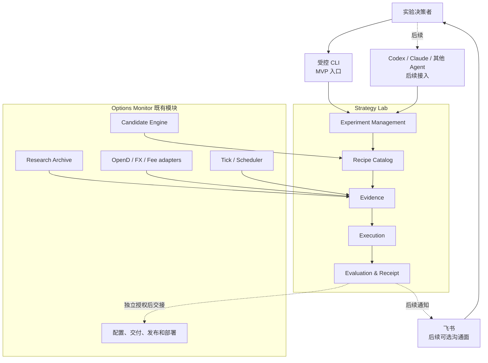
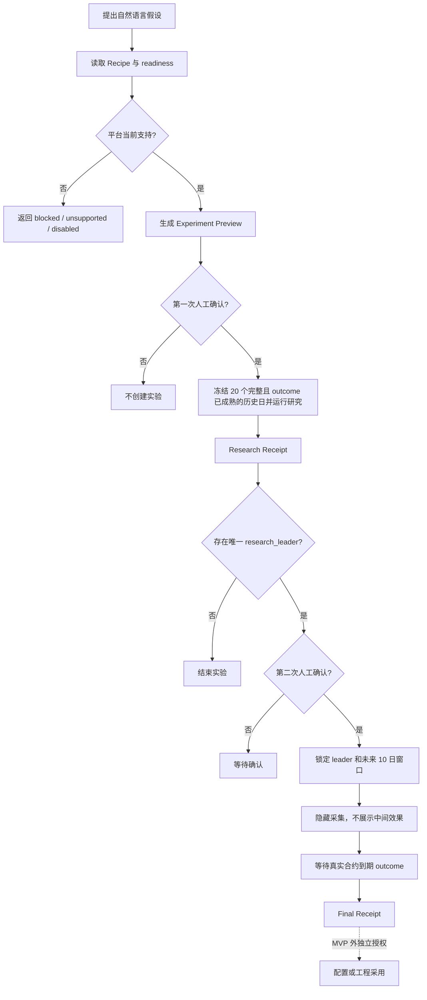
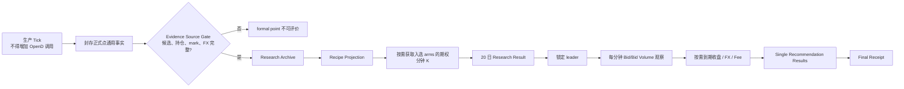

# Strategy Lab 统一策略实验平台 PRD

- **产品名称**：Strategy Lab
- **产品范围**：用真实证据完成策略假设的历史研究、未来隐藏验证和可审计回执
- **MVP Recipe**：Cash-Secured Put (CSP) 期权持仓市值集中度
- **产品状态**：Phase 3 本地实现完成；远端自然 Tick 隔离门槛已通过；Phase 4 正式点持仓证据范围待修复后重新积累

本文是 Strategy Lab 的产品权威。技术架构、代码复用和删除范围见
[系统设计](STRATEGY_LAB_EXPERIMENT_PLATFORM_SYSTEM_DESIGN.md)；当前遗留实现与重建差距见
[Strategy Lab 当前实现清单](STRATEGY_LAB_DESIGN.md)。源码、测试和运行回执高于文档描述。

## 1. 产品摘要

Strategy Lab 是 Options Monitor 的策略实验功能。它借助 Agent / LLM 理解自然语言假设、整理实验
方案和解释结果，再由确定性程序使用真实合约、真实市场事实和冻结规则验证假设。目标是持续产生
可审计的策略优化建议，最终帮助既有线上策略提高收益率，同时不绕过生产风险边界。

假设输入开放，实验执行封闭：用户可以提出任何策略想法，但平台只运行 Recipe Catalog 中已经实现、
声明数据要求并通过 readiness 的实验。Agent 不得在实验运行时临时生成 Python、SQL 或公式作为权威
逻辑，也不得修改策略、配置、交易、持仓或通知状态。

MVP 只证明一条端到端链路可行：用最近连续 20 个“正式点完整且入选合约均已到期”的历史交易日
研究 CSP 期权持仓市值集中度，产生唯一 `research_leader` 后，经第二次人工确认进入未来 10 个
正式推荐日隐藏验证，待真实合约到期结果齐备后生成 Final Receipt。

MVP 不建设本地 Agent 接入、MCP、Skill、飞书控制、多实验并行或自动采用。操作员可以通过受控 CLI
完成首次价值验证；这些后续接入只能复用同一应用服务、状态和回执。

## 2. 背景与问题

Options Monitor 已有完成实验所需的基础能力：生产候选引擎、正式推荐点、Research Archive、OpenD
行情适配、期权持仓估值、FX、费用计算和 Shadow Replay。此前的 Strategy Lab / Top1 代码把 Recipe、
生命周期、兼容迁移、corpus、provider probe 和用户入口混在一起。旧产品壳已删除；新的 20 日研究与
Research Receipt、未来 10 日隐藏验证和 Final Receipt 链路已完成本地实现，尚未用真实 20 日 / 10 日窗口验收。

主要问题是：

1. 历史入口曾要求用户理解 Top1 loop、Research、Shadow Replay、profile 和 calendar；
2. Top1 被误写成平台模块，而它实际只是“每个推荐点选一个候选”的比较口径；
3. 历史研究一律假设 `t0_sell_limit` 成交，未充分使用 OpenD 期权分钟 K 线；
4. 评价器加入了小样本 Student-t 和最差 20% 硬门槛，超出已确认的 MVP 目标；
5. ExperimentStore 包含多代迁移和大量 CSP / HK 专用表，成本高于首个可行版本所需；
6. 旧实验链路的运行复杂度可能与生产 Tick 争用 OpenD 和执行时间。

本 PRD 不重写生产候选、Research Archive 或 OpenD 基础适配。它只重建 Strategy Lab 产品层，并删除
仅为未完成旧实验功能存在的兼容链路。

## 3. 产品定位与架构

### 3.1 用户任务

用户要完成的不是“运行 Top1 工具”，而是：

> 提出一个策略假设，确认平台将如何验证；用冻结的真实历史数据研究；确认研究胜者进入未来隐藏
> 验证；最后得到能够解释为什么通过、失败或证据不足的回执。

### 3.2 产品架构



飞书位于产品外部沟通层，只能展示提醒、进度和回执，不能成为实验判断或确认的唯一事实 owner。
Strategy Lab 结束于回执和可选采用建议；配置修改、代码交付、发布、部署与线上观察继续由 OM 现有流程
分别授权。

### 3.3 与 OM 其他模块的关系

| OM 模块 | Strategy Lab 如何使用 | 权威边界 |
|---|---|---|
| Candidate Engine | 复用同一 accepted 候选和排序函数 | Strategy Lab 不复制硬门槛或生产排序 |
| Research Archive | 读取推荐时刻不可重建的候选、持仓、mark、FX 和正式点事实 | Archive 不保存实验状态或结论 |
| Shadow Replay | 继续用于探索性反事实研究 | 不拥有正式实验确认、隐藏验证或 Final Receipt |
| OpenD / FX / Fee | 按需补分钟 K、隐藏报价、到期收盘、汇率和费用 | 缺失必须显式，不能推测或回退 |
| Tick / Scheduler | 提供正式点并享有绝对运行优先级 | Strategy Lab 不进入主 Tick 调用链 |
| 配置和发布 | 接收实验外的采用交接 | Strategy Lab 不直接写生产配置或发布 |

## 4. 用户与权限边界

MVP 只有一个产品角色：**实验决策者**。他负责提出目标并完成两次独立确认：

1. 确认冻结的 Experiment Spec，启动 20 日研究；
2. 阅读 Research Receipt，确认唯一 leader 进入未来 10 日隐藏验证。

平台运维和工程实施沿用 OM 既有权限，不作为 Strategy Lab 内部产品角色。Agent 是研究助理和接口使用者，
不是授权主体；它可以准备 preview、解释证据和调用已获授权的动作，但不能替代人的确认。

## 5. 产品目标与非目标

### 5.1 MVP 目标

1. 公开可发现的 Recipe、参数、数据要求和 readiness；
2. 冻结 spec、数据窗口、评价行为 hash、确认 hash 和证据引用，并保留源码 commit 供审计；
3. 用真实合约完成一次 20 日历史研究；
4. 产生 leader 后完成未来 10 个正式推荐日隐藏验证；
5. 使用同一单推荐替换评价合同比较年化收益率和 CNY 收益金额；
6. 生成可审计 Research Receipt 和 Final Receipt；
7. 服务重启和重复推进保持幂等；
8. 实验运行不拖慢或跳过生产 Tick；
9. 删除旧 Top1 产品入口、旧实验 schema、迁移和兼容链路。

MVP 同一时刻只允许一个未终态实验，不按 Recipe、账户或 spec 分别放行。

### 5.2 MVP 不包含

- MCP Server、本地 Agent 适配、专用 Skill、Claude 适配或跨机认证；
- 飞书控制、确认或回执推送；
- 多账户、多市场执行或多个实验并行；
- Agent 临时生成实验代码、公式或 SQL；
- 自动调参、自动采用、配置写入、交易、发布或部署；
- 组合仓位、多合约分配、回撤、风险调整收益或全局最优证明；
- 旧实验数据和旧 Strategy Lab schema 的迁移。

US 可以继续积累通用 Research Archive 事实，但 MVP Recipe 只在 HK / `lx` 执行。

## 6. 核心产品原则

### 6.1 假设开放，执行封闭

Agent 可以提出任意假设；平台只执行已注册 Recipe。不可执行时必须区分：

| 状态 | 含义 |
|---|---|
| `available` | Recipe、数据、评价和运行条件均就绪 |
| `blocked` | 能力已存在，但当前数据或运行条件暂时不足 |
| `unsupported` | 缺少 Recipe、指标、评价或 Evidence 原语 |
| `disabled` | 维护方明确停用 |

不得通过临时代码、降低证据标准或删除不利样本绕过。

### 6.2 事实、Recipe 与评价分离

```text
Evidence：候选、行情、持仓、fill、outcome、FX、费用
    ↓
Recipe：怎样构造 baseline / challenger 和标准经济结果
    ↓
Single Recommendation Comparison：点配对、按日聚合、判断和选胜
```

Agent 只负责假设和解释；确定性代码拥有计算与判断。

### 6.3 一个生产候选权威

baseline 使用推荐时刻实际封存的生产 Top1。challenger 只能从同一点 accepted 候选中重排。Recipe 不得
重新接纳 rejected 候选、重算另一套硬风控或事后改写生产 Top1。

### 6.4 人工确认不可复用

研究确认只授权历史研究，隐藏验证确认只授权锁定 leader 后的未来观察。两者都不授权采用、配置、发布、
部署或交易。确认请求只提交用户看到的 preview hash；平台必须重新生成当前 preview，只有状态仍为
`available` 且 hash 完全一致时才创建实验或锁定验证，不能接受调用方回传的任意 spec。

### 6.5 生产 Tick 绝对优先

Strategy Lab 使用独立进程和低优先级 OpenD 配额，不取得、持有或阻塞 Tick 的运行锁。生产 Tick
运行中、距离下一次 Tick 的保护窗口不足或低优先级配额不可立即取得时，实验任务必须让路并记录
本次 blocker；不得让 Tick 因实验持锁而 `SKIP_LOCKED`，也不得排队等待数百秒。由此缺失的 slot 只在
终态 fill 证据中审计为 `not_evaluable`，不写逐分钟 gap 行。

### 6.6 首次完成前不建立版本体系

Strategy Lab 的 Recipe、结果合同、评价合同和 SQLite schema 不带版本后缀，不实现迁移。每次实验以
完整 spec、`spec_sha256`、证据 hash 和 `evaluator_behavior_sha256` 固化行为；`source_commit_sha` 只用于
审计，不作为继续推进的兼容门槛。行为 hash 只覆盖本实验实际调用的 Recipe、应用编排、比较、回执、
成交 / outcome、Candidate Engine 排序 profile、集中度、mark / snapshot 规范化、provider adapter、费用
和 FX 合同。无关源码或文档变更不阻断实验，任一行为 owner 内容改变则 fail closed。timer unit、冻结
schedule 和 account config 另以 binding hash 固化，不混入源码 manifest。等首条真实 20 日 / 10 日链路
完成，且确实需要读取过去已完成实验时，再独立设计版本机制。

## 7. 用户流程



## 8. 产品模块

| 模块 | 职责 | 不负责 |
|---|---|---|
| Experiment Management | preview、两次确认、状态、幂等推进和终止 | 策略计算或市场取数 |
| Recipe Catalog | 声明可执行假设、参数、数据和安全要求 | 动态代码或 DSL |
| Evidence | 读取 Archive，按需取得 K 线、Bid、outcome、FX 和费用 | 实验判断 |
| Execution | 运行 20 日研究、10 日观察和到期补全 | 自动采用 |
| Evaluation & Receipt | 标准结果、配对、按日聚合、选胜和不可变回执 | provider 调用 |
| Access Adapter | MVP CLI；后续 MCP、Skill 和飞书适配 | 复制业务逻辑或状态 |

Top1 不是模块。它是“同一推荐点最终选择一个候选”的比较口径。

## 9. Recipe Catalog

每个 Recipe 最少声明：

- `recipe_id` 和实验问题；
- 支持的策略、市场和账户；
- 参数及合法取值；
- baseline / challenger 构造规则；
- 所需 Evidence 和 readiness；
- 标准经济结果和安全合同；
- 使用的评价合同；
- 当前 `available / blocked / unsupported / disabled` 状态及原因。

MVP 直接使用 Python 注册表，不建设插件系统、数据库目录或公式 DSL。

## 10. 实验与状态合同

### 10.1 Experiment Preview

preview 必须展示并冻结：

- hypothesis 和 Recipe；
- market、account、strategy family；
- baseline 和全部 challenger 参数；
- 冻结 maturity cutoff，以及在该时点前正式点完整、入选 arms 的 outcome 均已成熟的连续 20 日研究窗口；
- fill、outcome、经济和评价公式；
- 每个历史期权合约的分钟 K 查询范围、OpenD 权限 / quota readiness 和账户 fee-plan readiness；
- 生产安全边界；
- `source_commit_sha`、行为 owner 清单及 `evaluator_behavior_sha256`、每个正式点绑定的配置 / 源事实
  hash、canonical spec 和 `spec_sha256`；
- 第一次确认明确授权的动作。

未确认 preview 不创建 ExperimentStore 状态。

若仅因 history-K readiness receipt 缺失或过期而 `blocked`，preview 仍返回本地生成的 exact-code probe
request 与 hash，供操作员显式取证；该 hash 只授权 readiness PoC，不授权研究。

第二次确认使用独立的 validation preview，冻结 leader、未来 10 日 schedule、account config、timer binding
和当前行为 owner hash。preview 不调用 provider，也不创建新的 readiness 流程。

### 10.2 最小状态机

```text
preview_ready
    ↓ 第一次确认
research_running
    ↓
research_complete
    ├─ 无 leader → completed
    └─ 有 leader → awaiting_validation_confirmation
                         ↓ 第二次确认
                    validation_collecting
                         ↓ 10 日窗口结束
                    waiting_outcome
                         ↓ outcome 齐备或确定缺失
                      completed
```

`blocked` 表示当前阶段可重试的能力或运行阻塞；`not_evaluable` 表示冻结窗口存在不能恢复的证据缺口，
必须生成证据不足回执并结束。状态推进必须幂等，服务重启后从 ExperimentStore 继续。

每次确认和推进都重新计算同一行为 owner 清单的 `evaluator_behavior_sha256`；该 hash 同时进入 provider
query 与 artifact identity，不允许跨 evaluator behavior 复用已规范化或已计算的证据。不一致时返回
`evaluator_behavior_mismatch`，不迁移或偷偷换实现。当前 `source_commit_sha` 可以不同，但必须写入事件
供审计；provider artifact 还必须记录真实 producer commit，并在公共绑定时写回 Store 审计。历史研究
保留每个 formal point 自己绑定的配置和源事实 hash；未来验证另行冻结 schedule、
account-config 和 timer binding，后续 formal point 不匹配时 fail closed。

## 11. 单推荐替换评价合同（Top1 Comparison）

### 11.1 适用范围

该合同适用于集中度、DTE、Delta、过滤或排序实验，只要每个正式推荐点都产生一个 baseline Top1 和一个
challenger Top1，并输出相同标准经济结果。多合约组合、仓位分配或整个候选集合不强行复用本合同。

### 11.2 标准结果

每个 arm 输出 `single_recommendation_result`：

| 字段 | 含义 |
|---|---|
| `recommendation_point_id`、`trading_day`、`arm` | 配对与按日聚合 |
| `recipe_id`、`variant_id`、`candidate_ref` | 冻结来源 |
| `fill_status` | `simulated_fill / observed_fill / no_fill / not_evaluable` |
| `fill_price`、`fill_time`、`fill_evidence_ref` | 成交证据 |
| `outcome_status`、`outcome_evidence_ref` | 到期事实 |
| `return_capital_basis_cny` | 收益率分母 |
| `economic_pnl_cny` | 一张真实合约的 CNY 损益 |
| `holding_calendar_days` | 年化持有天数 |
| `annualized_return` | 冻结公式结果 |
| `safety_status`、`reason_codes` | `pass / fail / unknown` 和原因 |

Recipe 计算结果；评价器不得请求 OpenD、补汇率或修复缺失输入。

### 11.3 真实合约经济口径

CSP 使用一张真实合约：

```text
assignment_notional_native = strike × multiplier
return_capital_basis_native = assignment_notional_native - opening_net_premium
expiry_underlier_pnl_native = min(expiry_close - strike, 0) × multiplier

economic_pnl_cny
  = opening_net_premium_cny
  - terminal_fee_cny
  + expiry_underlier_pnl_cny

annualized_return
  = economic_pnl_cny
  / return_capital_basis_cny
  / holding_calendar_days
  × 365
```

开仓权利金、到期损益和费用分别按事实发生时点的 FX 换算为 CNY。真实合约标识、Strike、到期日、
Multiplier、原币金额和 Evidence 引用必须保留。MVP 持有至到期，不包含人工平仓、展期、Wheel 或到期
后持股收益。

普通 Covered Call (CC) 将来复用本评价器时，收益率分母使用推荐时股票市值 `spot × multiplier`；它不属于
本次 Recipe。

`no_fill` 的 `economic_pnl_cny` 和 `annualized_return` 均为零，资金分母和持有天数为空。
`pending_outcome` 继续等待；`not_evaluable` 不能改成零。

### 11.4 点配对与按日聚合

```text
annualized_return_delta
  = challenger.annualized_return - baseline.annualized_return

pnl_delta_cny
  = challenger.economic_pnl_cny - baseline.economic_pnl_cny

daily_delta
  = 同一交易日所有冻结正式点 delta 的算术平均

stage_mean
  = 冻结窗口内所有交易日 daily_delta 的算术平均
```

每个交易日权重相同。baseline 和 challenger 选中同一合约时 delta 为零。当天预期正式点必须完整；
缺点不得静默删除。`effective_point_count` 和 `top1_change_count` 只作为解释信息，不改变日期权重。

### 11.5 MVP 判断

MVP 不使用 Student-t 置信下界、最差 20% 交易日、加权总分或收益金额显著性检验。

| 条件 | 结果 |
|---|---|
| 任一 arm 不来自同一点 accepted 候选，或安全证据未知 | 证据不足 |
| 冻结窗口或标准结果不完整 | 证据不足 |
| `mean_daily_annualized_return_delta <= 0` | 保留 baseline |
| 收益率改善，但 `mean_daily_pnl_delta_cny < 0` | 保留 baseline |
| 收益率改善且 CNY 收益金额不下降 | challenger 通过 |

20 日研究对全部变体应用同一规则。多个变体通过时，先按年化收益率改善、再按 CNY 收益改善选择唯一
`research_leader`。10 日隐藏验证只评价已锁定 leader，不并入历史研究数据。

## 12. 首个 Recipe：CSP 期权持仓市值集中度

### 12.1 假设与参数

```text
recipe_id = sell_put_option_position_concentration
market = HK
account = lx
strategy_family = sell_put
near_return_threshold = 0.002 / 0.004 / 0.006
```

假设是：在同一点 accepted 候选中，把持有期净收益相近的候选放入同一收益带，再优先选择加入后账户
期权持仓市值集中度较低的标的，是否改善 Top1 的到期年化资金效率，同时不降低一张真实合约的 CNY
收益金额。

`0.002 / 0.004 / 0.006` 分别表示持有期净收益率相差不超过 0.2 / 0.4 / 0.6 个百分点，不是年化
收益率差，也不是运行时自动调参。

### 12.2 baseline 与 challenger

- baseline 是推荐时刻实际封存的生产 Top1；
- challenger 只使用同一点 accepted CSP 候选；
- 为所有 accepted 候选计算期权持仓市值集中度；
- 使用 Candidate Engine 现有 `rank_candidate_rows()`、`option_market_concentration` profile 和对应收益带；
- 排序后第一名是 challenger；
- 集中度相同时继续使用生产 tie-break；
- 任一 accepted 候选缺少集中度事实时，整个推荐点不可评价，不能删除该候选后继续。

### 12.3 集中度口径

集中度只描述账户当前期权持仓市值，不描述被指派后的股票，也不是市场 Open Interest 集中度：

```text
position_option_market_value_cny
  = to_cny(abs(option_mark × multiplier × contracts_open), fact_time_fx)

candidate_option_market_value_cny
  = to_cny(abs(sell_limit × multiplier × 1), fact_time_fx)

option_position_concentration_after
  = (同标的已有期权绝对市值 + candidate_option_market_value_cny)
  / (全部已有期权绝对市值 + candidate_option_market_value_cny)
```

计算包含同一账户、同一正式点市场的全部当前持有期权仓位，多空使用绝对市值、不相互抵消，按
underlying 分组并统一换算 CNY。其他市场仓位不进入该正式点的分子、分母、mark 覆盖或因这些仓位
额外产生的 FX 要求；正式点市场自身的候选换算 FX 仍是必需证据。prepared context 的账户身份、完整性
和 `decision_snapshot_actionable` 仍按账户整体校验；任何当前持仓若无法识别市场，不能被静默忽略。
不包含股票持仓、潜在接货金额或全部 Short Put 名义敞口。

### 12.4 安全边界

本 Recipe 不增加指派后股票集中度或全部 Short Put 名义敞口门槛。安全条件只有：baseline 和 challenger
都来自同一生产 accepted 集合，且生产 DTE、Strike、现金能力、收益门槛、Spread、IV/RV 和财报事件
等硬门槛未被放宽。accepted 事实不完整时不可评价。

## 13. 成交与 outcome 合同

### 13.1 Sell Limit

两阶段都使用推荐时刻冻结的生产 `sell_limit`。当前生产定义为 Bid/Ask 中间价向上取到合法价格档位。
不得在看到后续行情后改价。

### 13.2 20 日研究：分钟 K 线模拟成交

历史研究不用日 K，也不一律假设 t0 成交。对每个 arm：

1. 先冻结 `recommendation_available_at_utc`：取正式点 capture、decision、opening seal、候选最大观测时间
   和计划目标时间中的最晚合法 UTC；从其后的下一根完整期权 1 分钟 K 线开始，到当日正常交易结束；
2. 首次满足 `high >= sell_limit + 1 price_tick` 且 `volume > 0`，记为 `simulated_fill`；
3. 模拟成交价仍为 `sell_limit`；
4. 未穿越则记为 `no_fill`；
5. 持续读取 OpenD 返回的 `page_req_key` 直到为空；任一页失败、分页未终结、bar 时间乱序 / 重复或
   bar 超出冻结查询边界时为 `not_evaluable`；查询范围由请求参数绑定，正常无成交分钟没有 bar 本身
   不构成缺口。

一分钟 K 线只提供模拟成交，不得描述为历史真实成交。Research Receipt 和 leader 都必须标注
provisional。preview 只在本地枚举实际需要的期权代码并读取已有 readiness receipt，不调用 OpenD。
receipt 必须来自操作员显式执行的单日真实 PoC，记录 endpoint、权限、quota、样本覆盖、期权代码对应的
唯一 quota identity 数量上限、观测时间和内容 hash。receipt 过期、endpoint 漂移、当前唯一 quota
identity 数量超过已证明边界，或尚未证明过期合约覆盖与无成交 bar 语义时，readiness 为 `blocked`。

### 13.3 10 日隐藏验证：实时 Bid 观察

第二次确认冻结 10 个交易日的 market-session calendar、每个连续交易时段的 UTC 分钟网格、timer wake-up
tolerance 和订单有效终点。午休不产生 slot；半日市和临时休市只按已冻结 calendar 产生 slot。未来正式点
封存后，其 arm 的首个有效 slot 是 formal point artifact 持久化时间之后的第一个完整交易分钟，终点是
同日冻结的订单有效终点；该 active window 只写一次，正式点出现前不产生 expected slot。

独立轻量任务在每个有效 slot 批量查询当天所有尚未确定成交结果且 active window 已开始的 baseline /
challenger arm。同一合约只请求一次 snapshot，再按各推荐点冻结的 sell limit 分别判断：

```text
bid >= sell_limit
and raw_bid_vol > 0
```

`raw_bid_vol` 只用于证明同一 snapshot 的最优买价存在有限正挂量，不换算为合约张数，也不用于估算可成交
规模或滑点。由于每个 arm 固定评价一张真实合约，MVP 不引入未经 OpenD 明确声明的 volume 单位换算；
Bid、Bid Volume、source time 任一缺失或非法时，该 slot 不可评价。批次 artifact 保存 provider 原始
Bid Volume、Bid、source time 和内容 hash。这里的 `observed_fill` 是按冻结协议观察到的可成交报价，
不是 broker 成交确认。

首次满足即为 `observed_fill`，按 `sell_limit` 计价。实验中间效果保持隐藏。每个调度分钟使用冻结的
`observation_slot_utc` 作为 identity；只有任务在 `[slot, slot + tolerance]` 内开始时才允许请求，晚到不得
请求或把当前报价归入过去 slot。调度必须来自同一个墙钟 timer 的盘中逐分钟
`OnCalendar` 条目，而不是从上一次任务结束时间递推；同一 timer 还包含闭市后的本地恢复条目，且不得由
systemd 在重启后补跑已经过期的盘中调用。

每个 slot 先在一个 SQLite 事务写入唯一 batch observation
`hidden_batch:<trading_day>:<observation_slot_utc>`，其 manifest 冻结本批全部 arm、合约代码和查询条件；
随后最多调用 provider 一次。provider 返回后先落不可变批次 artifact，再在一个事务完成 batch；仅对本批
首次满足成交条件的 arm 原子写入 `validation_fill: observed_fill`，并直接引用该 batch artifact。完整批次
内容只保存在 artifact，不在 Store 复制逐 arm、逐分钟 `hidden_quote` 行。同 slot 后出现的新 arm 不修改旧
manifest，从它自己的下一个有效 slot 开始观察。

实验推进只使用两类锁：一个非阻塞 experiment advance 锁串行化全局唯一实验；artifact publish owner 内部
使用 `evidence_artifact_location()` 返回的真实 artifact lock，调用方不预持该锁。不得增加 batch lock，也
不得用 `lock_held` 绕过 artifact owner。Tick guard 和低优先级准入必须先成功，随后
`start_observation()` 才能创建 started row；
只有本次真正新建该 row 的调用者可以访问 provider。

`observation_slot_utc` 只作为批次 identity。artifact 的 `observed_at_utc` 以及 crossing 的 `fill_time` 都取
provider 响应被 OM 接收的 `received_at_utc`，不得用调度传入时间代替市场证据时间。证据分支固定为：

| provider 结果 | durable 结果 |
|---|---|
| 调用报错或超时、`opend_call_count != 1`、request / receive UTC 缺失或不可解析、任一时间超出冻结 tolerance、返回未请求或重复代码 | 不生成 artifact；started batch 保持缺失证据 |
| query identity、单次调用和 request / receive 时间有效，但某个 requested code 缺行，或其 Bid、raw Bid Volume、source time 缺失 / 非法 | 发布 complete batch artifact，并把该 code 标为不可评价 |
| 以上 envelope 有效且报价行完整 | 发布 complete batch artifact，并按每个 arm 的冻结 sell limit 判断 crossing |

缺少 requested code 可以在已证明的 batch envelope 中明确记录；出现未请求或重复代码则说明返回 identity
不可信，不能封存为该 query 的 artifact。

恢复只处理真实存在的 `started` batch：artifact 已存在时补 Store binding 并完成其中首次 crossing；artifact
不存在时保留 `started`，不再请求该 slot。未曾 started 的过期 slot 保持不存在。不存在或未完成的 batch
都由冻结 expected slots 在终点评价时识别为缺失证据，不写额外 gap batch 或 gap quote。

若已经观察到 fill，fill slot 后不再要求该 arm 的后续 slot。若 active window 结束仍没有 fill，只有每个
冻结 expected slot 都存在内容和绑定有效的 complete batch，才能判定 `no_fill`；任一 expected slot 缺失、
started 未完成或 artifact 非法时为 `not_evaluable`。`no_fill / not_evaluable` projection artifact 统一列出
expected slots、实际 batch ref/hash 和 missing/invalid slot identities。不能把报价缺失解释为无成交。

隐藏 snapshot 固定为一次批量请求、`max_wait_sec=0`、`no_retry=True`、fallback 为 0，并由硬超时截断；
单个 batch 的 OpenD 调用数不得超过 1。系统不宣称 provider exactly-once；batch started 后不再对同 key
发起查询，artifact-first 只恢复已持久化的结果。进入 `waiting_outcome` 前必须先核对全部 started batch，
绑定已有 artifact，再按冻结 expected slots 生成终态 fill 证据。

### 13.4 到期结果

成交后持有至真实到期日。到期 payoff 使用 OpenD 标的未复权日 K 收盘和冻结费用、FX 事实；期权分钟
K 不用于到期损益。开仓费用复用正式点已封存费用；指派 / 行权费用必须绑定账户的
`commission_free`、`platform_fee`、`fee_plan_ref` 及其内容 hash，缺失则 fail closed。CSP 指派
产生的股票结算费用以 Strike 为成交价计算，不得使用到期收盘价。到期结果未成熟时
状态为 `waiting_outcome`，不得提前发布结论。

## 14. Evidence 获取、保存与使用



### 14.1 推荐时刻通用事实

Research Archive 保存可供多种实验复用且事后不能可靠重建的事实：

- 正式点 identity、预期点和时间；
- accepted / rejected 候选及理由；
- 合约、Bid、Ask、Bid/Ask Volume、Last、Volume、OI、IV、Greeks；
- Strike、到期日、Multiplier、DTE、标的价格和 quote time；
- 同账户、同正式点市场的全部当前持有期权 identity / 数量、推荐时点可用的 mark，以及这些持仓和正式点
  候选换算所需的 FX；
- 来源、接收时间、内容 hash 和数据状态。

DTE、Mid、Spread、收益率和集中度等可重算值不重复保存。Tick 内的切换顺序固定为：扫描前 prepared
context 只冻结持仓 identity / 数量和 FX；生产扫描及 required-data / opening artifact 持久化后，
recommendation-point 路径按同一 run、account、market、formal point time 从这些既有 artifact 绑定当前
正式点市场的每个持仓合约 exact mark ref/hash；Formal Corpus 必须从同一 prepared context 和冻结
required-data artifacts 重新构造 binding 并与 point 中的值精确比较，通过后才封存。它不调用 provider，
也不从其他市场、其他 run 或其他 repository 补值。进入 binding 的持仓必须同时满足 underlying identity
市场、持仓 currency 和 mark market code 与正式点市场一致；冲突或未知值一律使该点不可评价。

mark 必须复用现有 performance evidence 的唯一规范化口径：优先按 requested instrument key、其次按持仓
已有 market code 精确匹配；缺 market code 时才以 option type、到期日、Strike、Multiplier 和非空代码
匹配，且结果必须恰好一行。Bid、Ask 均为正且 Ask 不低于 Bid 时使用 midpoint；否则仅允许正 Last 作为
`last_fallback`；crossed market、无有效价格、零行或多行匹配均不可评价。source requested / received time
必须可解析、先后有序并落在同 run 已冻结的 formal-point time-coherence 窗口内；不能使用当前时间
fallback，也不能绑定后续批次。

新 binding 至少包含 position source ref/hash、每个合约 instrument key / market code / 数量、规范化 price、
mark kind、effective / observed time、source artifact ref/hash、source row identity、确定性 mark fact id/hash，
以及 FX ref/hash、run/account/point identity。多个 lots 可共享同一个 instrument mark，但每个 instrument
只能绑定一个规范化事实；Recipe 只读该 binding。仅当确切持仓合约进入原
snapshot batch 不会增加预计 provider 调用数时才可随批取得；否则不扩展批次。新 binding 的入口、
ref/hash 与 fail-closed 测试通过后，才在同一实施阶段删除当前 Strategy Lab 触发的
`refresh_quotes=True` 整仓刷新，不保留双写。Evidence Source Gate 必须证明切换前后 Tick 的 OpenD 请求
数、snapshot 批次数和 deadline 均未变差；证明不了就保持 Recipe `blocked`，不新增旁路采集器。

### 14.2 按需实验事实

- 20 日研究只为实际入选 baseline 和 challenger 合约请求历史期权分钟 K；
- 隐藏验证只保存当前有效 slot 的批次 Bid / Bid Volume artifact，以及每个 arm 的单份终态
  `validation_fill`；不复制逐 arm、逐分钟 Store 行；
- outcome 只为实际入选且已成交的合约补充；
- 每份外部证据保存来源、完整查询条件、scheduled / observed 时间、规范化内容和 hash。

不为全部候选预抓分钟 K、日内 Bid/Ask 时序或到期结果。

## 15. 存储与运行

### 15.1 ExperimentStore

MVP 使用一个全新私有 SQLite，只含：

```text
experiments
experiment_events
experiment_observations
```

`experiments` 保存当前状态、冻结 spec/hash、行为 hash、leader、receipt refs 和 revision；`experiment_events` 只追加
两次确认与状态事件；`experiment_observations` 保存实验选择后的 fill 与 outcome 证据。Research Archive
继续独立拥有市场事实；不可变 Receipt 使用 JSON artifact，Store 只保存引用和 hash。

Store 在同一 `BEGIN IMMEDIATE` 事务内检查并创建实验，保证全局最多一个未终态 experiment。
observation 使用稳定 `observation_key` 幂等：每个隐藏 slot 有一个 batch-kind key，batch payload 冻结
全部 active arms 和查询 manifest；每个 arm 只使用一个 `validation_fill:<point_id>:<arm_id>` identity。
`observed_fill` 直接引用首次 crossing 的 batch artifact，`no_fill / not_evaluable` 引用窗口终点 projection
artifact；历史 K 与 outcome 使用冻结 query identity。相同 key 的不同内容必须拒绝。无需增加第四张表。

旧 ExperimentStore、schema 和数据不迁移。删除或替换生产旧库属于实施阶段的独立受控动作。

### 15.2 调度与性能隔离

- Strategy Lab 使用一个独立 timer/process；timer 用重复的墙钟 `OnCalendar` 条目覆盖 HK 盘中每分钟和
  闭市恢复点，使用低 `AccuracySec`、`Persistent=false`，不使用 `OnUnitActiveSec`；
- Strategy Lab 不取得 Tick 市场锁；启动前只读检查 Tick busy 状态和下一次 Tick 保护窗口；
- 复用同一 OpenD endpoint coordinator，但实验只能使用不能侵占生产预留容量的低优先级、零等待配额；
- 研究分钟 K 和 outcome 只在闭市后分批推进；
- 盘中每分钟最多一次批量快照；MVP 每日最多为预期正式点数的两倍 arm，并按合约去重；
- 盘中调用固定单批、硬超时、零等待、不重试、无 fallback；
- 发生冲突时立即让路，不等待数百秒；缺失 slot 在终态证据中审计为 `not_evaluable`；
- 每次 `advance` 只处理有限工作单元。

保护窗口和生产预留容量在实现前由 OpenD PoC 与自然 Tick 计划冻结为常量，MVP 不提供用户可调配置。
并发验收必须覆盖“Strategy Lab 已启动后 Tick 到来”：Tick 不能 `SKIP_LOCKED`，实验调用必须在自身
deadline 内结束或被硬超时截断；缺失证据只允许得到 `not_evaluable`。

## 16. 产品交互

MVP 公开入口：

```text
./om strategy-lab recipes
./om strategy-lab preview
./om strategy-lab confirm-research
./om strategy-lab status
./om strategy-lab confirm-validation
./om strategy-lab receipt
```

内部调度入口：

```text
./om strategy-lab advance --scheduled
```

Research Archive 的 market-calendar binding 仍需要受控写入口，归 Research 运维而不是 Strategy Lab
产品所有：

```text
./om research corpus-calendar refresh
```

readiness 只有一个窄的操作员入口；必须带 preview 返回的 probe request hash 和显式 `--write`，并经过
Tick busy / 保护窗口 / 低优先级零等待准入：

```text
./om strategy-lab readiness refresh-history-k \
  --profile-path <service-profile> --contract-symbol <option-code> \
  --underlier-code <opend-underlier-code> --sample-date <YYYY-MM-DD>

./om strategy-lab readiness refresh-history-k \
  --profile-path <service-profile> --contract-symbol <option-code> \
  --underlier-code <opend-underlier-code> --sample-date <YYYY-MM-DD> \
  --confirmed-probe-sha256 <preview-hash> --actor <actor> --write
```

它生成 history-K 的不可变、带有效期 readiness receipt，不创建实验，也不扩展成通用 capability 平台。
通用 provider probe、Evidence 获取和 outcome job 不作为 Strategy Lab 用户命令暴露。status 返回当前
状态、分类进度、可由本地冻结事实证明的静态阻塞原因和唯一下一动作，不因查询触发 provider、读取墙钟
或写入；Tick busy、保护窗口和 limiter 等瞬时阻塞只由当次 execute 返回，不为 status 新增持久状态。
status 和 receipt 只依赖 profile 中的 runtime / artifact / Store authority，当前账户或 OpenD 配置退役后
仍可读取既有审计事实。status 会只读核对冻结 evaluator；若行为已变化，只返回 durable 计数和静态
`evaluator_behavior_mismatch` blocker，不再用当前实现推导旧实验进度或下一采集动作。

后续 MCP、Skill、Claude 和飞书只能适配上述应用服务。Skill 负责交互与推理提示，不拥有 Recipe、评价
规则、能力清单或写权限。

## 17. 回执与安全

Research Receipt 至少包含：冻结 spec/hash、`source_commit_sha`、行为 owner 清单及
`evaluator_behavior_sha256`、20 日窗口、各变体标准结果摘要、缺失证据、leader 选择顺序和 provisional
声明。

Final Receipt 至少包含：两次确认、锁定 leader、10 日窗口、同一行为 owner 清单与 hash、fill 和 outcome
引用、按日配对结果、年化收益率差、CNY 收益金额差、安全状态和三态结论：

- `challenger_passed`；
- `keep_baseline`；
- `insufficient_evidence`。

Receipt 不得声称实验改善已经实现为线上收益。Strategy Lab 永远不得写生产策略配置、交易、持仓、
broker state、普通策略通知或发布状态。

Receipt 采用 write-once-or-verify：目标不存在时原子写入并 readback；已存在且字节相同则复用；已存在
但内容不同则返回 immutable conflict。只有 artifact 已持久化并校验 hash 后，Store 才能绑定 ref/hash。
公共读取必须反向校验 Store 中绑定的 receipt ref/hash/state；只有文件而没有 Store 绑定的孤立 artifact
不是正式回执。

## 18. MVP 验收标准

1. `recipes` 能展示首个 Recipe、三个阈值和 readiness；
2. preview 冻结 maturity cutoff，以及连续 20 个正式点完整且入选 arms outcome 已成熟的历史交易日；
3. 20 日窗口不得事后换日，缺失不得静默排除；
4. `recipes`、preview 和 status 的 OpenD 调用数为 0；preview 枚举确切期权代码，并从显式运维 PoC 的
   未过期 receipt 验证历史分钟 K quota / 权限 / 样本覆盖、代码数量边界、fee-plan 和 Evidence Source
   Gate readiness；
5. 三个 challenger 使用同一窗口和完整分页的分钟 K 模拟成交；
6. 按日等权生成唯一 leader 或无 leader；
7. 两次确认都重新生成 preview 并校验用户确认 hash；第二次确认锁定 leader、未来 10 日 schedule、
   account-config、timer binding 和 behavior hashes，preview 与确认都不调用 provider；
8. 隐藏观察冻结 session-aware expected slot 和每个 arm active window；墙钟 timer 优先处理当前 slot，
   每个 slot 使用唯一 batch manifest、最多一次调用和不可变 artifact；任务未启动或 started 后没有
   artifact 的 slot 保持缺失，终点确定性投影为 `not_evaluable`，过程中不暴露效果；
9. 10 日窗口不得因缺失或结果延长；
10. outcome 齐备后生成 write-once、可重复验证的三态 Final Receipt；
11. 服务重启和重复 advance 不产生重复确认、batch provider 调用、terminal fill 或不同回执；
12. 全局第二个未终态实验被一致拒绝；
13. 自动测试覆盖 midpoint、Last fallback、crossed / missing / duplicate mark、缺 market code、多 lots、
    晚到来源、Bid crossing、正 / 零 / 非法 Bid Volume，以及 preview 零 provider 调用；行为 manifest 中
    任一 owner 改变都会改变聚合 hash；
14. 自动测试和自然运行证明 Tick 的 OpenD 调用数没有增加，且 Tick 不因实验持锁、限流或超时失败；
15. 旧 Top1 入口、存储 schema、迁移和兼容代码已删除，但 corpus calendar 与 account fee-plan owner 已
    先迁出并保留；
16. MCP、Skill、飞书、自动采用和多实验并行均未提前建设。

以上全部满足，才表示 Strategy Lab 首条可行产品链路完成。之后是否建设 Agent 接入、并行实验、飞书或采用
流程，必须基于最终回执证明的真实价值另行决策。
