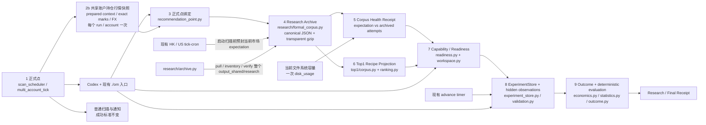
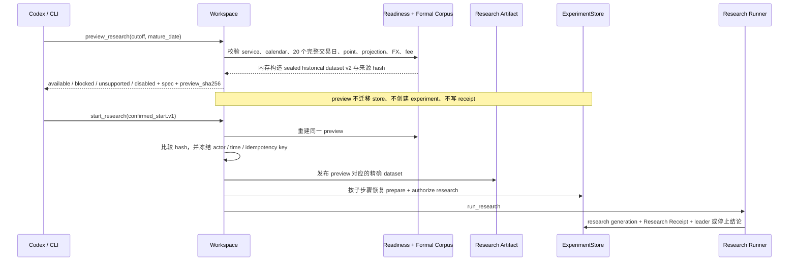
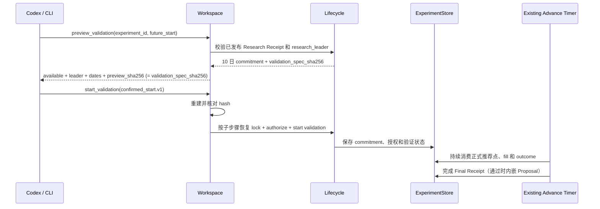

# Strategy Lab 统一策略实验平台系统设计

- **状态**：MVP 实验内核与基础事实归档已落地；健康回执来源收敛待实施，真实 20 日 / 10 日窗口待验收
- **日期**：2026-08-29
- **产品依据**：`docs/STRATEGY_LAB_EXPERIMENT_PLATFORM_PRD.md`
- **当前实现参考**：`docs/STRATEGY_LAB_DESIGN.md`
- **首个 recipe**：HK / lx / Sell Put Top1

本文记录 PRD 的技术架构、模块 owner、函数合同和删除边界。第 6 节以当前源码为基准，
对 PRD 15.2 的九个逻辑数据模块逐项标记“原样复用、修改、删除、新增”。运行行为以当前源码、
测试、配置验证器和回执为准；产品范围与验收门槛以 PRD 为准。

## 1. 设计结论

MVP 不新建通用实验框架。已有 Sell Put Top1 状态机、ExperimentStore、Candidate Engine、
20 日研究、10 日隐藏验证、CNY 经济结果和终态回执继续复用。本轮只收敛它们之前的数据链：

1. HK / US、`lx` 的 scheduler expectation 和 canonical production scan 作为唯一正式点来源；
2. opening snapshot 继续封存 accepted + rejected decisions；每个正式 run / account 另采集一次共享的
   全部未平仓期权行情快照。候选扫描和账户快照共同绑定到同一 run，recipe 不再请求 provider；
3. 经 recommendation point 绑定后，将紧凑基础事实以透明 gzip 长期保存到 Research Archive；
4. Corpus Health Receipt 是对 expectation、archive 和当前文件系统容量的确定性只读视图；它不扫描
   与 Formal Corpus 无关的 runtime 历史，也不新增状态库；
5. Top1 corpus 改为可重建的 recipe 索引和派生投影，不再以 `output_runs` 或自己的
   accepted-candidate 副本作为基础事实；
6. readiness、研究、验证和 outcome 只读消费 archive ref / hash 与已冻结实验合同。

不增加 MCP、Skill、飞书、多实验并行、通用公式 DSL、recipe registry、新数据库或新调度器。
压缩由读写函数透明处理，不产生需要操作员手工解压的包。Top1 仍只是第一个 recipe。

## 2. 当前实现与运行缺口

| 维度 | 当前实现 | 运行缺口 |
|---|---|---|
| 操作入口 | 现有 `top1-loop` CLI 提供完整 preview、两次确认、status、receipt 和 scheduled advance | 尚未用真实 20 日与 10 日窗口完成端到端验收 |
| 生命周期 | 同一状态机拥有 prepare、authorize、research、leader、commitment、validation、outcome 和 terminal receipt | 无可信 leader 时必须停止，不能提前启动验证 |
| 排序实验 | Candidate Engine owner 内提供 0.002 / 0.004 / 0.006 收益带和期权市场集中度 profile | 需要真实研究回执证明 challenger 是否有价值 |
| 经济结果 | `economics.py` 使用已绑定 opening / terminal FX 输出 CNY 金额、资金分母、持有日和年化收益率 | FX 缺失或冲突继续 fail closed |
| 评价 | `statistics.py` 统一点配对、按日聚合、年化收益率和 CNY PnL 判断 | 不允许 Agent 或 recipe consumer 重算公式 |
| 账户开关 | feature 表、账户 opt-in、命令、reconcile 和 blocker 已删除；保留维护方安全停机 | 无 |
| Proposal | `candidate_for_adoption` 时在同一 Final Receipt 内嵌最小 Proposal | 真实隐藏验证完成前不会产生可采用建议 |
| 运行事实 | HK / US、`lx` 的正式 run 绑定 opening decision、同 run 持仓行情、mark 和 FX；取证失败只降级 Strategy Lab | 需要真实运行持续证明两市场均按本次 collector 结果归档 |
| 正式点绑定 | `recommendation_point.v3` 校验 run / account / config / policy、三类 owner ref / hash 和时间一致性 | 需要抽查真实点 readback；任一缺失或冲突继续 fail closed |
| Research Archive | `formal_corpus.py` 已提供 expectation、正式点紧凑 gzip 写入、透明读取与冲突检测 | 需要随真实正式点验证长期容量和连续性 |
| 积累健康 | `./om research corpus-health` 已从 Formal Corpus 计算 HK / US expectation 和 archive，但同步调用全 runtime storage baseline；Top1 advance 还会生成旧 Store-backed 重复回执 | 删除旧回执读写；Formal health 改为 Formal Corpus + 当前磁盘快照，readiness 每次只构建一次且不扫描全 runtime manifest |
| Recipe Projection | projection v3 从 formal archive 派生，不复制基础行情 | 需要用真实点确认与原 Top1 行为一致 |
| 历史事实 | 无价值的历史 migration preview 已删除 | 不增加 apply；缺失历史不回填，只重新积累 |

## 3. 技术架构



### 3.1 分层与依赖

```text
src/interfaces/cli/research.py + strategy_lab_top1.py
    -> src/application/research/formal_corpus.py
    -> src/application/strategy_lab/top1/workspace.py
        -> top1 corpus / ranking / lifecycle / research / validation / outcome
            -> domain Candidate Engine / concentration / performance facts
            -> infrastructure ExperimentStore / performance evidence / OpenD adapter
```

- CLI 只做参数解析、profile 路径解析和 JSON response 适配，不编排事实归档或实验状态机。
- `src/application/research/formal_corpus.py` 是唯一新应用 owner，承接正式日 expectation、
  正式点紧凑归档、透明读取和健康回执；不增加 repository interface 或数据库。
  它写入既有 Research Archive 目录，不构成第二个基础事实 store。
- `workspace.py` 继续是 Top1 实验编排面；它不保存基础事实，也不复制生命周期判断。
- `domain/domain/engine/candidate_engine.py` 继续独占排序行为。
- `ExperimentStore` 继续独占实验状态、授权、幂等事件和恢复信息。
- `research/archive.py` 继续只负责远端目录传输和验证，不再被误解为在线正式点 writer。
- Shadow Replay、持仓账本、performance evidence 和 OpenD 保留原 owner；实验只保存 ref、hash
  和形成回执所需的最小派生结果。

### 3.2 事实时点与不可变边界

正式点只允许使用同一 canonical run 已封存的三类事实：

1. `opening_candidate_snapshot.v1`：全部 accepted + rejected candidate decisions、producer 选择与行为 hash；
2. `required_data_scan_blob.v1` 及其 manifest：production scan 已取得的合约 Bid / Ask、Greeks、
   Open Interest、成交量和行情时间；
3. `prepared_option_positions_context.v2`：同 run / account 冻结的未平仓期权、ledger generation、
   decision-state fingerprint、FX，以及本次共享采集返回的 exact `ValuationMarkFact`。

候选 scan 与账户持仓行情快照职责不同：required-data blob 只为 candidate universe 提供行情，不能
假设它覆盖 Call、跨市场或不在候选生成范围内的持仓合约。`prepare_option_positions_contexts()` 对每个
正式 run 的 `lx` 只调用一次现有 `collect_current_performance_evidence(refresh_quotes=True)`，覆盖全部
未平仓期权；HK / US 和后续 recipe 都复用这份 run fact，不再各自请求 provider。

MVP 继续复用 prepared v2 的 `strategy_lab_option_market_evidence` payload，避免新增 artifact 或 schema。
正式路径直接使用本次 collector 返回的 `ValuationMarkFact` 构造该 payload，再校验 exact instrument
identity、run / account、观察时间、source fact hash、ledger generation 和 FX；不得在写入 repository 后
重新选择 mark。现有 `_reuse_existing_valuation_marks()` 会在价格未变化时保留旧 fact，因此 fact ID 或
repository 命中本身不能证明本次观察。collector 失败或任一 open position 无本次 exact mark 时，该
point `not_evaluable`，但普通扫描、prepared context 和通知仍沿用原成功标准。

prepared 路径在任何 provider 或 repository 读取前先检查同 run / account 的 write-once v2
artifact：

- ready manifest + payload 均存在且通过现有 strict validator：直接复用，零 mark / FX 请求；
- 已完成的 unavailable manifest：直接复用其稳定 reason，零 mark / FX 请求；
- 只有 payload：校验其 `prepared_authority`、payload hash 和 runtime identity，再只从已嵌入的
  run、account、config、ledger、decision fingerprint、FX、source / application time 确定性重建并发布
  manifest；不重新采集；
- 只有 ready manifest、payload 无法校验或两者 authority / hash 不一致：返回
  `prepared_option_context_partial`，零 provider 请求，不用新行情修复旧 run；
- 两者都不存在：才执行首次采集。

这一改动只补现有 payload-first / manifest-second 发布的恢复分支，不增加新状态、日志或 artifact。

`recommendation_point.v3` 另外写入 `formal_point_time_coherence.v1`。时间集合包含 ready
required-data symbols 的 `source_observed_at`、每条 candidate decision 的
`normalized_input.snapshot_received_at_utc`，以及本次 exact marks 的 `effective_at_ms` 和
`observed_at_ms`。使用既有 `OPENING_QUOTE_MAX_AGE_SECONDS = 300` 作为固定上限；保存
minimum / maximum / `skew_ms`，缺必需时间或 `skew_ms > 300000` 时 point
`not_evaluable` 且 reason 为 `formal_point_time_skew`。不新增可配置阈值，也不把“同一 run”
当成时点一致的替代证据。

`capture_scheduled_recommendation_point()` 仍是 run 内唯一绑定入口，校验 scheduler target、
run / account / config / policy、opening snapshot 和 prepared receipt 的 hash 及时间顺序。随后
`capture_formal_point_attempt()` 只读上述不可变事实，写入 ready 或 not-evaluable 归档记录。
写入前先以 market / account / trading date / point ID 取得
`exclusive_private_file_lock()`，再在同一临界区枚举、校验、采用或构造、发布和 readback。
若只有一份通过校验的 artifact，且三个 owner hash、
run / account / target 和 producer 行为版本组成的不可变 source binding 与本次一致，则原样返回
首份 artifact，保留其 hash 和首次归档时间；重试的处理时间不参与版本判定。不可变
source binding 变化时才发布第二个 content hash 并判为 conflict；已有多个 hash 时直接
conflict，不覆盖、不仲裁。

日 expectation 必须早于首个预期点封存。不新建 timer：现有 HK / US `tick-cron` 在取得
本市场锁、通过 runtime config preflight 后，于启动子进程扫描前调用
`seal_profile_formal_expectations()`，且只传入当前 market、`lx` 和当前 config path。systemd 的
两个 tick 均从当地 09:00 开始，早于 runtime schedule 的首个 09:40 正式点。只有显式
`OM_RUNTIME_ROOT` 时才写正式事实；封存缺 binding、coverage 不足或其他失败时只记录
`FORMAL_EXPECTATION_DEGRADED` 并继续普通扫描。

helper 按 runtime schedule 的 `schedule.timezone` 将 `occurred_at_utc` 转为当地 trading date，并只读
已绑定 calendar。它不读写 `ExperimentStore`、不检查 `OM_STRATEGY_LAB_TOP1_AVAILABLE`、不请求
calendar provider。现有 Strategy Lab advance scheduled handler 仍可对 profile 做幂等复核，但不再
承担跨市场首封的时间 owner；缺口不在定时路径隐式刷新 calendar。

`seal_formal_day_expectation()` 在使用本次 `occurred_at_utc` 构造新 payload 前，先以
market / account / trading date 取得 `exclusive_private_file_lock()`，再在同一临界区枚举、
校验、采用或构造、发布和 readback 当日 expectation。唯一有效 artifact 的 `_expectation_denominator()`
与当前 calendar / schedule / targets 一致时，直接返回它，保留首份 `sealed_at_utc`、
`sealed_before_first_target` 和 hash；后续 scheduled writer 不得把迟到的首封修复为准时。只有目录为空
时才使用本次时间创建首份 artifact；denominator 不同时发布第二 hash 并记录 conflict。
多个 hash 或无法校验的已有 artifact 均 fail closed，不根据当前时间自动选择或覆盖。
锁文件位于 artifact 枚举路径之外；它可持久存在，不是 corpus 事实，也不进入 hash、
health 或 retention 计算。进程退出时 `flock` 由操作系统释放，不实现 stale-lock 删除逻辑。

上线 writer 前使用现有受控 calendar refresh 入口分别刷新并验证 HK / US coverage；
`_profile_context()` 对 archive / calendar 操作不再强制请求 market 与 HK Top1 recipe 相同。基础事实
封存不受 Top1 安全开关影响；该开关只暂停 recipe 研究和验证推进。

正式点归档仍在 `_observe_recommendation_points_best_effort()` 的边车边界执行。任何归档、
解压、hash 或健康计算失败只写 degraded audit，不改变已完成的扫描、Daily Brief 或通知结果。

历史研究的 opening FX、隐藏验证首次 crossing 的 opening FX 以及到期的 terminal FX 继续复用
`FXRateFact`、`PerformanceEvidenceSQLiteRepository` 和 `select_fx_rate()` 的现有选择合同。
一旦写入 research revision、fill observation / job 或 expiry close fact，恢复只读已绑定 FX，
不用最新汇率重选。

### 3.3 运维停机与账户开关的区别

`OM_STRATEGY_LAB_TOP1_AVAILABLE` 保留为维护方安全开关，不是用户或账户级产品功能：

- 关闭时，preview 返回 `disabled`，scheduled advance 返回 `disabled` 并停止新推进；
- 不写 `user_opt_in`，不按账户切换，不自动终止或改写已有实验；
- 恢复后仍需重新校验 spec、来源 hash、readiness 和确认状态；
- `strategy_lab_features`、`feature status` 和 disable reconcile 全部删除。

### 3.4 Corpus 健康回执

`corpus_health_receipt.v2` 是唯一产品健康回执，由
`src/application/research/formal_corpus.py::build_corpus_health_receipt()` 在查询时构建：

- 唯一事实来源是 Formal Corpus 的 immutable expectation 和 point artifact；
  `ExperimentStore` 不参与 expected、captured、missing、conflict、not-evaluable 或连续完整日的计算；
- HK / US 共用同一函数和 `./om research corpus-health --market <hk|us> --account lx`
  查询入口，CLI 不自行统计；
- builder 只接受两种显式 scope：默认 `full` 供手工 CLI 审计全历史；
  `latest_mature_window` 供 scheduled readiness 只校验日历中最近
  `RESEARCH_REQUIRED_DAYS` 个已结束交易日和当前交易日。基础 builder 不反向依赖
  Top1 常量，由 readiness caller 传入 `mature_day_limit=RESEARCH_REQUIRED_DAYS`。`full`
  只允许 limit 为 `None`，window scope 只允许正整数；不增加用户可配置的 CLI scope 开关；
- `latest_mature_window` 必须先读受控 calendar binding，再直接打开选中日期目录；
  calendar 不可用，或同一 `observed_at_utc` 换算的市场本地日期不在
  `[coverage_start, coverage_end]` 内时，复用 `market_calendar_binding_unavailable` fail closed，
  且不读取任何 expectation / point artifact，也不回退成全历史扫描。该 scope 的 `days`、totals、
  连续成熟日、freshness、最早 / 最晚日期和 `formal_corpus_bytes` 都只统计选中日期；
  scope 外的早期缺口或冲突不阻止定时推进，但仍由 `full` 视图完整报告；
- scope 选择、成熟日判定和 freshness 共用 builder 的同一 `observed_at_utc`。
  standalone readiness 在入口只捕获一次当前时间；scheduled advance 透传它在调用开始时
  已冻结的 `occurred_at_utc`。builder 在 caller 已给时间时不得重新读墙钟，保证跨市场日界时
  同一 scheduled invocation 仍选择同一日期窗口；
- expectation / point coverage、canonical hash 和已结束交易日完整性是 immutable artifact 的确定性派生结果；
  freshness、archive 占用、可用磁盘和当前容量风险是查询时的运行快照，不伪装成不可变审计事实；
- 容量快照只对 `runtime_root` 调用一次标准库 `shutil.disk_usage()`。当前可用空间低于
  `max(filesystem_capacity * 5%, 10 GiB)` 时为 `critical`；否则为
  `insufficient_history`，明确表示本回执没有做增长预测。两者分别阻止和允许 readiness；
- `collect_storage_runtime_baseline()` 继续服务显式的全 runtime 存储审计、manifest 引用校验和
  90 日预测，但不得从 health、readiness 或 scheduled advance 同步调用。两份输出职责不同，
  不缓存、持久化或复制 storage baseline；
- `continuous_complete_trading_days` 只统计成熟交易日，即 `trading_date < 当前市场本地日期`。
  当前交易日仍显示在 `days` 诊断明细中，但尚未结束或尚未完整时不得把成熟日连续后缀清零；
- 顶层 `status` 保持表达查询时的完整采集健康，因此当前交易日未完整时仍可为 `unhealthy`；Top1
  readiness 不以该状态替代成熟日门槛，只消费连续成熟日、容量和其他独立 blocker；
- Top1 readiness 在一次调用中只构建一次该回执，同一对象同时用于 corpus
  门禁和返回事实；即使 `ExperimentStore` 未 ready、为空或不可打开，也必须先返回该独立事实，
  Store 状态只单独阻止实验推进；
- 回执是只读派生视图，可以导出，但不再持久化 `current` 或每日重复状态文件。

公开 JSON 合同按事实 owner 收敛：

- `./om research corpus-health` 升级为 `corpus_health_receipt.v2`；删除旧
  `storage.baseline_status`，保留 `formal_corpus_bytes`，并返回当前 filesystem 容量、可用空间、
  critical floor、`critical_reasons` 和 `status`；不返回 manifest、冷数据或增长预测；
- Top1 readiness 升级为 `sell_put_top1_readiness.v2`；只保留 canonical
  `facts.corpus`，删除重复的 `facts.corpus_health_receipt`；
- scheduled advance 升级为 `sell_put_top1_advance_result.v2`；删除顶层
  `corpus_health`，唯一健康事实位于 `readiness.facts.corpus`。

已完成的有界 consumer inventory 表明：仓库 production code 只构造和返回上述
readiness / advance 字段，没有解析它们的下游调用方；已部署 systemd unit 只执行
`./om research strategy-lab top1-loop advance ... --write`，不解析 JSON；当前只有测试直接断言旧字段。
不可发现的外部 consumer 不能证明兼容需求；显式升级 schema 比在 v1 中偷换嵌套形状更可审计，
因此不增加 legacy adapter、双 schema 或过渡字段。

v2 的容量字段固定为最小查询快照：

```json
{
  "scope": {
    "mode": "latest_mature_window",
    "mature_day_limit": 20,
    "include_current_trading_day": true
  },
  "storage": {
    "formal_corpus_bytes": 200704,
    "capacity": {
      "status": "insufficient_history",
      "filesystem_capacity_bytes": 107374182400,
      "current_free_bytes": 21474836480,
      "critical_floor_bytes": 10737418240,
      "critical_reasons": []
    }
  }
}
```

`status` 只允许 `insufficient_history`、`critical` 或 `unavailable`。`disk_usage` 失败时仍返回结构有效的
health v2，capacity 为 `unavailable`、顶层 `status=unhealthy`，readiness 使用现有
`research_storage_capacity_unavailable` 阻止推进；不得吞掉已算出的 corpus coverage。

健康查询失败与查询成功但尚未就绪必须分开：

- Formal Corpus builder 失败或不可用时，readiness 返回 `facts.corpus=null`，通过现有
  `top1_status_unavailable` fact error 说明原因，且 `validation_runtime_ready=false`；
- scheduled advance 无法加载 readiness，或加载成功但 `readiness.facts.corpus=null`时，
  终态必须为 `partial`；
- Formal Corpus 返回结构有效的 `unhealthy`、连续完整日不足或容量 blocker 时，
  advance 仍可为 `ok`，但 `validation_runtime_ready=false` 且不推进实验；这是有效事实，不是读取失败。

现有 `strategy_lab/top1/corpus/*/health/current.json` 和 `health/days/*.json` 是旧
`sell_put_top1_corpus_health_receipt.v1` 产物；切换后不再更新、不再被 readiness 读取，也不作为删除或
改写 Formal Corpus 的授权。研究 preview 仍逐日验证被选窗口，不能凭健康回执自动启动研究。

### 3.5 Advance 300 秒性能边界

对发布版本 2.2.1 的只读分阶段诊断已经定位首个可复现慢边界：完整 Formal Corpus health 超过
60 秒，其中 `collect_storage_runtime_baseline()` 超过 60 秒；去掉该 baseline 后，2 日 / 24 点的
Formal artifact 校验为 14.87 秒。相同环境中 36 个 service 的 72 次 systemd 状态查询合计 0.81 秒，
因此本工作单不优化 systemd polling，也不把 US 自动平仓的独立失败混入本链路。

根修复是 3.4 的 owner 收敛：scheduled advance 不再同步扫描约 87,261 条 runtime 研究文件和
1,580 个 manifest，也不再校验无界的全历史 Formal artifact。scheduled readiness 只直读
最近 20 个成熟交易日和当前交易日的 expectation / point，再读取一次当前磁盘容量。
实现不得提高 300 秒限制，
不得改 tick、formal point、opening snapshot、required-data、prepared context、recommendation point
或任何采集路径，也不得新增 cache、service、timer、持久化表或 profiler。

实现后以相同只读输入复核 `build_corpus_health_receipt()`、`_readiness()` 和完整 scheduled advance
的墙钟时间；不增加依赖机器负载的单元性能断言。自动化改为断言 scoped 调用的
point loader 与 artifact `stat` 数量上界为选中的 20 个成熟日加当日各 expectation
声明的 point 总数，不随 scope 外历史增长。手工 `full` 审计仍为
O(全历史)；它不在 5 分钟 advance 热路径上，MVP 不为它增加摘要或缓存。
阶段计时和回执中的 scope 日期必须绑定同一 scheduled `occurred_at_utc`，不用各阶段的墙钟时间重算。

## 4. 核心执行流程

### 4.1 研究 preview 与第一次确认



研究 preview 同时返回 `research_spec_sha256` 和 `preview_sha256`。前者继续作为现有 lifecycle 的
研究 spec 身份；后者按 5.1 的固定公式把该 spec hash 与本次选择的精确 `source_bindings` 一起承诺。
确认执行前必须重建 preview 并核对 `preview_sha256`，随后 Workspace 把原 `research_spec_sha256`
传给 lifecycle；不增加独立 preview 表。

正式研究入口不再以 Shadow Replay 的“每日有一个点”作为 20 日完整性的依据。`corpus.py` 按市场
日历和 canonical expectation IDs 校验每个交易日的全部正式推荐点及 recipe projection v3；任一点
缺失即返回 blocked。preview 只在内存构造规范 dataset，不写文件；确认 hash 匹配后才发布同一字节。

### 4.2 验证 preview 与第二次确认



验证阶段直接令 `preview_sha256 = validation_spec_sha256`。现有 validation hash 已绑定已发布研究
终态、challenger、hidden commitment 和全部验证合同，不再增加一层重复来源 envelope。确认命令核对
后，Workspace 才把该 hash 和 commitment 传给 `lock_challenger()`；不能先写入 leader 和 commitment
再让用户确认。

### 4.3 确认后的失败恢复

`start_research` 和 `start_validation` 是对现有 durable action 的薄组合，不假装成一个数据库事务。
Workspace 为每个步骤从确认命令的 `idempotency_key` 派生稳定子 key，并把同一 `actor` 和
`confirmed_at_utc` 传给现有 store 方法。重试时先重建并核对同一 preview，再读取 artifact / store
状态，从第一个未完成步骤继续：

```text
research:   prepare -> publish frozen window -> authorize research -> run_research
validation: lock exact commitment -> authorize validation -> start validation
```

`prepare` 是研究的首个 durable step，先把完整 spec，以及包含 `confirmed_preview_sha256` 和精确
`source_bindings` 的现有 source provenance 写入 event / experiment；actor、确认时间和派生 key 仍由
现有 command event 保存。因此后续失败不会丢失命令身份，store 也能用 provenance hash 识别同一
idempotency key 下的 preview 漂移。已发布 artifact 使用现有 content-addressed / write-once 语义，相同
字节可安全复用。相同 idempotency key 但 actor、确认时间、preview hash 或其他 payload 不同，返回
`idempotency_conflict`；不得把新的当前时间写入重试。无需新增 command 表或恢复 worker。

## 5. 数据与合同设计

### 5.1 Research / Validation Preview

新增 `sell_put_top1_preview.v1`，研究和验证共用最小 envelope：

| 字段 | 含义 |
|---|---|
| `stage` | `research` 或 `validation` |
| `status` | `available`、`blocked`、`unsupported`、`disabled` |
| `reason_codes` | 稳定、可诊断的原因码 |
| `experiment_id` | 由 topic、market、account、recipe version 和 research source binding hash 确定性生成；不依赖包含自身的 spec hash，preview 不写 store |
| `experiment_spec` | `available` 时的规范化 spec；其他状态可为空 |
| `stage_spec_sha256` | research 时为 `research_spec_sha256`，validation 时为 `validation_spec_sha256`；继续交给现有 lifecycle 校验 |
| `preview_sha256` | research 时为下面定义的来源承诺 hash；validation 时直接等于 `validation_spec_sha256` |
| `source_bindings` | research 的 calendar、window、point、mark、opening FX、terminal FX、fee、outcome 精确稳定 ref / hash；validation 不另建重复绑定，展示信息来自已冻结的 research receipt、hidden commitment 和 validation spec |
| `production_impact` | 固定为不改配置、不交易、不通知、不自动采用 |
| `invalidated_by` | 会使确认失效的行为或事实版本 |

research `preview_sha256` 的输入固定为：

```text
canonical_sha256({
  "schema_version": "sell_put_top1_preview.v1",
  "stage": "research",
  "experiment_id": experiment_id,
  "stage_spec_sha256": stage_spec_sha256,
  "source_bindings": source_bindings
})
```

research `source_bindings` 在 hash 前按稳定标识排序并 exact-key 规范化；相同事实不得因读取顺序
产生不同 hash。会变化的 readiness 展示状态、采集时间、原因说明和 `production_impact` 不进入 hash。
terminal FX 选择变化必须改变 `source_bindings` 和 research `preview_sha256`。validation 所需的
producer / repository / selection contract 版本由 `validation_spec_sha256` 承诺，research receipt 与窗口
由 hidden commitment 承诺；未来尚不存在的验证事实不进入 preview。

四态判断顺序固定为：请求不在已实现范围时 `unsupported`；维护方停机时 `disabled`；能力已实现
但事实或运行条件不足时 `blocked`；全部通过时 `available`。只有 `available` 返回可确认 hash。

### 5.2 Confirmed Start Command v1

两次确认共用 `sell_put_top1_confirmed_start.v1`：

```text
schema_version
stage                    # research | validation
market / account
experiment_id
confirmed_preview_sha256
idempotency_key
actor
confirmed_at_utc
```

CLI 必须把完整命令作为 JSON 传给 Workspace；`confirmed_at_utc` 是用户确认发生的时间，不由每次调用
重新生成。Workspace exact-key 校验后重建 preview，并要求 `experiment_id`、scope 和 hash 全部一致。
匹配后把 preview 中的 `stage_spec_sha256` 传给现有 lifecycle。研究的精确 `source_bindings` 连同
`confirmed_preview_sha256` 写入现有 prepare provenance，并继续传给 research revision；validation
直接确认 `validation_spec_sha256`，其绑定由 validation spec 与 hidden commitment 持久化。研究与验证
使用不同 idempotency key；同一命令的重试必须逐字保持上述字段不变。

### 5.3 Run Fact Binding v3

`prepared_option_positions_context.v2` 继续封存同 run / account 的 `open_positions_min`、ledger generation、
decision-state fingerprint 和 FX，并复用现有 `strategy_lab_option_market_evidence` 保存一次共享账户持仓
行情快照。该字段名暂作为兼容合同保留；MVP 不为改名新增 v3 prepared schema。

正式 run 必须传入 HK / US、`lx` 的 mark evidence scope，使 builder 直接收到本次 collector 返回的
mark facts 并拒绝 repository 旧 mark。手工或非正式 run 不因本需求新增行情请求。

`recommendation_point.v3` 保留稳定 point ID，改为绑定三个现有 owner：

```text
opening_snapshot_ref / opening_snapshot_sha256
required_data_manifest_ref / required_data_manifest_sha256
prepared_context_manifest_ref / prepared_context_manifest_sha256 / prepared_context_payload_sha256
```

point builder 只校验三者与 scheduler target、run、account、config、policy 一致，且 prepared binding
中每个 open position 都有本次采集返回的 exact mark；再按 3.2 计算并绑定版本化时间跨度。
不在此时生成 recipe metric。
`recommendation_point.v1/v2` 仅供已有 artifact 和回执读取，新 Research Archive 只接受 v3。缺少
required-data blob、当次持仓 mark 或 prepared binding 时写入 not-evaluable attempt，不用 repository
旧 mark 补齐。

### 5.4 Experiment Spec v2

现有 `sell_put_top1_experiment_spec.v1` 升级为 v2，保留当前精确键校验并补充：

- recipe id / version、通用 Top1 评价合同版本；
- baseline `current_tie_break`；
- 三个 challenger：`option_market_concentration` + `near_return_threshold` 为
  `0.002` / `0.004` / `0.006`；
- `option_market_concentration_after.v1`、mark 选择、FX 选择、Sell Put 经济结果合同；
- `comparison_currency = CNY`、真实一张合约、`t0_assumed_fill` / `observed_fill`；
- 主指标为年化收益率差，CNY 收益金额为零下降不劣约束；
- 当前 accepted set 不可扩大，越界请求返回 `unsupported_universe_scope`。

不增加任意参数 map、公式字符串、Python / SQL、表达式执行器或动态 schema。

### 5.5 Recipe Projection v3

Research Archive 保存候选和账户基础事实；Top1 projection 只保存 recipe 特有的派生结果：

```text
schema_version = sell_put_ranking_projection.v3
formal_point_ref / formal_point_content_sha256
recipe_id / recipe_version / behavior_binding_sha256
materialized_input_content_sha256
producer_accepted_candidate_ids
candidates[] = candidate_id
               + option_market_concentration_after
               + option_market_value_cny
               + metric_version / evidence refs
artifact_provenance
```

Bid / Ask、Greeks、strike、expiry、multiplier、currency、`sell_limit`、Open Interest 和 producer rank
不再复制到 projection。`materialized_input_content_sha256` 只绑定完整展开结果，
不复制基础字段。`materialize_top1_recipe_input()` 在内存中校验 archive ref / hash 后，
将基础 candidate 事实和 v3 派生 metric 合并成现有 research / validation 调用者所需的形状，
并校验该 content hash。该内存对象不另行持久化。

projection 只能对 producer accepted set 重排。rejected 事实保留在 archive 用于解释和未来已注册
recipe，当前 Top1 recipe 不得把硬风控 rejected row 重新纳入。相同 formal point ref、recipe version
和 behavior binding 必须重建相同 projection hash。丢失 projection 可从 archive 重建；丢失 archive
不得用 projection 反向冒充基础事实。

### 5.6 标准经济结果 v2

`fx_rate_binding.v1` 不是新 FX 事实，而是对现有 repository 中已选中 `FXRateFact` 的最小、
不可变投影：

```text
schema_version
selected_at_ms
fact_id
base_currency / quote_currency / rate / rate_kind
effective_at_ms / observed_at_ms
source / source_id / revision / supersedes_fact_id
source_fact_sha256
```

`source_fact_sha256` 是选中 `FXRateFact.normalized_payload(include_fact_id=True)` 的 canonical SHA-256。
CNY 原币分项的 binding 为 `null`，并按 1:1 计入。研究 close receipt、fill observation / outcome
job 和 expiry close fact 直接内嵌该小投影；这些只是已有实验证据的绑定，不是
第二份 FX 仓库。

三个 durable owner 的 v2 字段固定为：

- research close receipt：在原 close 字段上增加 `currency`、`terminal_at_ms` 和
  `terminal_fx_binding`；
- fill observation / outcome job：在原报价 / candidate 字段上增加 `opening_at_ms` 和
  `opening_fx_binding`；
- expiry close fact：升级 `EXPIRY_OUTCOME_CONTRACT_VERSION`，在原 close 字段上增加
  `currency`、`terminal_at_ms` 和 `terminal_fx_binding`。

上述 JSON 与其现有 SHA-256 一起持久化，因此 job / fact / revision 级恢复可直接校验字节；
Final Receipt 通过每个 arm 的 standard economic result 携带两个 binding ref 和原币分项。

每个 arm 输出：

```text
status
reason_code
fill_status
contract_identity
holding_calendar_days
return_capital_basis_native
return_capital_basis_cny
opening_net_premium_native
opening_net_premium_cny
terminal_fee_native
terminal_fee_cny
expiry_underlier_pnl_native
expiry_underlier_pnl_cny
economic_pnl_cny
annualized_return
opening_fx_evidence_ref
terminal_fx_evidence_ref
```

资金分母和开仓权利金只用 opening binding；终态费用和到期标的损益只用 terminal
binding。经济函数只消费这两个已验证 binding 并保持纯函数，不打开 repository、不选择
汇率、不修补缺失事实。无 observed fill 仍按 PRD 输出 `holding_calendar_days = null`、
`economic_pnl_cny = 0`、`annualized_return = 0`。需要换算但 opening 或 terminal binding 缺失时，
arm 为不可评价；不得解释为零或使用当前汇率。

### 5.7 通用 Top1 评价结果 v2

评价输入不再包含 recipe 特定的 concentration gate，而是包含：

```text
recommendation_point_id
trading_date
baseline_candidate_id / challenger_candidate_id
baseline_economic_result / challenger_economic_result
hard_risk_status
frozen_safety_results
```

输出至少包含：

```text
mean_daily_annualized_return_delta
mean_daily_pnl_delta_cny
mean_return_capital_basis_delta_cny
sample_std
standard_error
one_sided_lower_bound
worst_tail_mean
top1_change_count
decision / reason_codes
```

统计继续复用当前按日平均、Student-t 单侧下界和最差 20% 计算；判断顺序严格执行 PRD 11.4。
期权市场集中度仅用于首个 recipe 的选择和解释，不作为通用 evaluator 的硬门槛。

### 5.8 Strategy Adoption Proposal v1

Final Receipt 增加 `adoption_proposal`，非通过结论固定为 `null`；仅当结论为
`candidate_for_adoption` 时内嵌 `sell_put_top1_adoption_proposal.v1`：

```text
schema_version
experiment_id
behavior_binding_sha256
market / account
adoption_mode
recommended_change
evidence_bindings
safety_invariants
pre_adoption_checks
observation_plan
rollback_conditions
authority
```

MVP seed 的排序 profile 和 0.002 / 0.004 / 0.006 阈值目前没有 canonical runtime config key，因此
`adoption_mode` 固定为 `engineering_required`，`recommended_change.config_mapping = null`。不得输出
`config_only`；未来只有配置 validator 和受控 preview 已公开精确 key 后，才升级 proposal schema。
`authority` 固定声明 proposal 只读、不写配置、不发布、不部署、不启用。

`evidence_bindings` 只引用 Final Receipt 已包含的 spec、research terminal、hidden commitment、行为版本
和评价结果 hash；不引用 enclosing receipt 自身，因此没有循环 hash。`build_completed_receipt_request()`
在一次规范化渲染前决定 `adoption_proposal` 为对象或 `null`，现有 `experiment_receipt_requested` event
继续只保存一份 receipt projection。

`recover_terminal_projection()` 沿用现有单 artifact 发布、readback 和
`mark_projection_published()` 流程。`read_public_receipt()` 校验已发布 Final Receipt 的 bytes / hash 后
直接返回其中的可选 Proposal。Proposal 不再拥有独立 ref、pending 状态、发布恢复或 store API；未来
只有出现独立下载、保留或下游消费需求时才拆成单独 artifact。

## 6. 函数级设计

### 6.1 九个数据模块逐项映射

| PRD 模块 | 当前代码 owner | 处理 | 目标代码边界 |
|---|---|---|---|
| 1. 正式点定义与生产扫描 | `tick_cron.py`、`scan_scheduler.py`、`multi_account_tick.py`、`tick_notification_flow.py` | **复用 + 修改** | 复用 `scheduled_scan_targets_for_date()` 和 canonical tick；各市场 tick 在扫描前预封本市场 expectation，observer 在唯一候选 scan 和共享账户快照后归档，不增加 option-chain scan 或 timer |
| 2. 运行事实封存 | `opening_candidate_snapshot.py`、`required_data_blobs.py`、`prepared_option_positions_context.py` | **复用 + 修改条件** | opening snapshot 和 required-data blob 原样复用；prepared v2 保留现有 mark collector / payload，HK / US 正式 run 都为 `lx` 采集一次并直接使用本次返回的 facts；不新增 artifact 或 per-recipe 调用 |
| 3. 正式点绑定与校验 | `recommendation_point.py` | **复用 + 修改** | 保留 point ID、write-once 及 validator；升级 v3 绑定 opening、required-data 和 prepared 三个 owner |
| 4. Research Archive | `research/archive.py` 只有远端 pull / inventory / verify | **复用传输 + 确实新增** | 新增 `research/formal_corpus.py`、canonical JSON + deterministic gzip 读写；不加 DB、repository 抽象或对象存储 |
| 5. Corpus Health Receipt | `research/formal_corpus.py` 已提供 canonical health，但错误地同步调用全 runtime storage baseline；Top1 `corpus.py` 仍保留 Store-backed 重复回执 | **修改 + 删除重复路径** | 只由 `formal_corpus.py` 对比 expectation 和 archived attempts，并读取一次当前磁盘容量；手工 CLI 使用全历史 scope，scheduled readiness 使用最近 20 个成熟日加当日 scope；不建 receipt 表、摘要文件或缓存 |
| 6. Recipe Projection | `top1/corpus.py`、`top1/ranking.py`、Candidate Engine | **复用 + 修改 + 删除重复字段** | corpus 只存 archive ref 和 recipe 派生 metric；v3 projection 不复制基础 candidate 字段，运行时在内存合并 |
| 7. Capability / Readiness | `top1/capability_receipts.py`、`top1/readiness.py`、`top1/workspace.py` | **复用 + 修改** | 保留四态和现有 capability；source readiness 改为消费 Corpus Health Receipt + recipe projection |
| 8. ExperimentStore 与验证观察 | `experiment_store.py`、`validation.py`、`fill_observation.py`、`advance.py` | **原样复用为主** | 保留冻结 spec、授权、commitment、selected-arm Bid / Ask 和幂等提交；只更换 source ref，不加 schema / table |
| 9. Outcome 与确定性评价 | `research_runner.py`、`economics.py`、`statistics.py`、`outcome.py`、`terminal_projection.py` | **原样复用** | 继续使用已冻结真实合约、FX、费用、年化收益率 + CNY PnL 和现有回执链；不动公式 |

### 6.2 原样复用

第 6.1 节记录整个 MVP 的代码映射；本轮工作单只允许修改健康回执与 advance 调用链。
允许的生产文件限定为 `research/formal_corpus.py` 的健康计算、`top1/advance.py`、
`interfaces/cli/strategy_lab_top1.py`、`top1/readiness.py` 及对应聚焦测试。tick、正式点采集、
recommendation point、required-data、prepared context、service / timer / config 和 US 自动平仓均不在本轮范围。

| 文件 | 函数 / 合同 | 复用理由 |
|---|---|---|
| `src/application/scan_scheduler.py` | `scheduled_scan_targets_for_date()` | 唯一 scheduler denominator，不重算正式点 |
| `src/application/opening_candidate_snapshot.py` | `seal_opening_candidate_snapshot()`、`load_opening_candidate_snapshot()`、`validate_opening_candidate_snapshot()` | 已不可变封存 accepted + rejected decisions 及 config / policy hash |
| `src/application/required_data_blobs.py` | `publish_required_data_scan_blob()`、`load_required_data_scan_blob()` | 已对同次 scan 的 provider rows 做 deterministic gzip、hash 和透明读取 |
| `src/application/performance/evidence_collection.py` | `collect_current_performance_evidence()` | 复用现有 exact-position 实时报价采集，不新增 provider adapter |
| `src/application/prepared_option_positions_context.py` | `load_prepared_option_positions_context_receipt()`、`_persist_fx_evidence()` | 继续提供同 run 持仓 / fence / FX；不新增 prepared schema |
| `domain/domain/engine/candidate_engine.py` | `rank_candidate_rows()` | baseline / challenger 的唯一排序 owner |
| `domain/domain/short_vol_assessment.py` | `calculate_option_market_concentration_after()` | 首个 recipe 的唯一集中度计算 owner |
| `domain/domain/performance/models.py` | `select_fx_rate()` 等 FX value object / selector | 研究与 outcome 继续 fail closed 选择汇率 |
| `src/application/research/archive.py` | `archive_pull()`、`archive_inventory()`、`archive_verify()` | 新 formal corpus 位于已同步的 `output_shared/research`，无需第二个远端传输工具 |
| `src/application/research/formal_corpus.py` | expectation / point writer、loader 与 artifact 合同 | 原样复用；本轮只修改同文件 health 的成熟交易日后缀计算，不改任何采集或 artifact 合同 |
| `src/application/research/storage_baseline.py` | `collect_storage_runtime_baseline()` | 原样保留为显式全 runtime 存储审计；health / readiness / advance 不再调用，也不修改其 collector、manifest 校验、增长预测或输出合同 |
| `src/infrastructure/private_storage.py` | `exclusive_private_file_lock()`、`atomic_write_private_text()`、`atomic_write_private_bytes()` | 复用私有权限、同机互斥和原子发布；相同 identity 的不同 hash 仍由 formal corpus 判 conflict |
| `src/application/strategy_lab/top1/lifecycle.py` | commitment、authorization、leader、receipt 及恢复函数 | 基础事实收敛不改实验生命周期 |
| `src/infrastructure/strategy_lab/experiment_store.py` | 现有 experiment / generation / event / receipt API、`commit_validation_observation_batch()`、`commit_outcome_batch()` | 仍是唯一实验状态和原子提交 owner；本轮不迁移 schema |
| `src/application/strategy_lab/top1/economics.py`、`statistics.py`、`terminal_projection.py` | 现有 CNY 经济结果、配对评价和 Final Receipt 函数 | PRD 评价合同未变，不重写公式或回执 |

### 6.3 需要修改

本节是当前工作单唯一的 production changed-files 清单。第 6.1 节其余模块是整体 MVP owner 映射，
均已落地或仅供架构参考，不得据此重新修改采集、projection 或 CLI。

| 文件 | 函数 | 最小修改 |
|---|---|---|
| `src/application/research/formal_corpus.py` | `build_corpus_health_receipt()` | 升级为 `corpus_health_receipt.v2`，新增经校验的 `scope` 参数，只允许 `full` / `latest_mature_window`，以及仅 window 使用的 `mature_day_limit`；后者先要求同一 observation time 的市场本地日期位于 calendar coverage，再只直读最近成熟日加当日；calendar 不可用或过期时复用现有 reason code fail closed，不读取 artifact、不回退全扫；删除同步 storage baseline，改为一次 `shutil.disk_usage()` 和当前 critical floor；不改 writer、loader 或采集器 |
| `src/application/strategy_lab/top1/advance.py` | `advance_scheduled()` | 升级为 `sell_put_top1_advance_result.v2`；停止调用旧 `publish_corpus_health_receipt()` 并删除顶层 `corpus_health`；readiness 加载失败或 canonical corpus 缺失时记录 failure 并返回 `partial`，有效但未就绪的 corpus 仅阻止实验推进 |
| `src/interfaces/cli/strategy_lab_top1.py` | `_readiness(context, store, *, observed_at_utc=None)` | 入口只冻结一次 observation time；standalone 用该次当前时间，scheduled advance 的 `load_readiness` closure 传已有 `occurred_at_utc`。无条件且只调用一次 Formal Corpus `build_corpus_health_receipt(scope="latest_mature_window", mature_day_limit=RESEARCH_REQUIRED_DAYS, observed_at_utc=observed_at_utc)`，直接传 `runtime_root`，不经旧 `read_corpus_status()` / Store 分支；不受 `ExperimentStore.schema_state()` 是否 ready 影响，不得另调 storage baseline；结果只传给 canonical corpus，Store 仍独立形成推进 blocker |
| `src/application/strategy_lab/top1/readiness.py` | `build_top1_readiness()` | 升级为 `sell_put_top1_readiness.v2`，删除 `corpus_health_receipt` 入参和 `facts.corpus_health_receipt`；20 个成熟连续完整日缺一即 blocked |

### 6.4 确实需要新增

下表是 MVP 基础事实链原需新增且当前已落地的 owner。本轮健康来源收敛和超时诊断不新增生产函数、
存储 schema、状态、服务、timer 或依赖；只升级 health、readiness 和 advance 三个已有返回 schema，复用 6.2 中的
health owner 并停止重复生产路径。

| 文件 | 函数 | 职责 |
|---|---|---|
| `src/application/research/formal_corpus.py` | `seal_formal_day_expectation()` | 从现有 calendar + schedule 构造日 denominator；复用 `exclusive_private_file_lock()` 按 market / account / date 串行 compare-and-publish，只在空目录首封，denominator 变化才写第二 hash 并 conflict；不接受 `ExperimentStore` 或 Top1 `environ` |
| 同上 | `seal_profile_formal_expectations()` | 按调用方给出的 market / config scope 和各自 timezone 预封 `lx`；只读已绑定 calendar，不请求 provider |
| 同上 | `capture_formal_point_attempt()` | 从 recommendation point v3 绑定的三个 owner 构造紧凑 ready / not-evaluable record；复用同一文件锁按 point identity 串行 compare-and-publish，source binding 相同时采用首份 artifact，处理时间不产生新版本；只读本次共享快照，不再读 provider、repository 或当前状态 |
| 同上 | `load_formal_point()` | 透明解压、校验 canonical bytes / hash；只有唯一 ready attempt 时返回 available |
| 同上 | `read_bound_market_calendar_snapshot()`、`read_market_calendar_binding()`、`refresh_market_calendar_binding()` | 将 Top1 `corpus.py` 中已有的 filesystem-backed calendar binding 校验 / 读写实现移入基础 owner；它们不使用 ExperimentStore，provider refresh 仍只由现有受控命令调用；Top1 改为 import |
| `src/application/strategy_lab/top1/ranking.py` | `materialize_top1_recipe_input()` | 只在内存中合并 formal point 基础事实和 v3 recipe metric，校验 accepted universe 不变 |
| `tests/test_formal_corpus.py` | 一个聚合测试文件 | 覆盖 expectation、gzip readback、幂等 / conflict、完全未采集的健康回执和不阻断 production flow |
| `tests/test_tick_cron.py` | tick-cron 回归 | 覆盖当前市场封存严格早于 tick，且封存降级不阻断生产 tick |

新增只有一个应用模块和一个测试文件。gzip 使用 Python 标准库的 deterministic `mtime=0`，
私有路径、`exclusive_private_file_lock()` 和原子写入复用 `src/infrastructure/private_storage.py`；
不新增 dependency、class、factory、锁抽象或缓存层。

### 6.5 需要删除

| 文件 | 删除项 | 删除门槛 |
|---|---|---|
| `src/application/strategy_lab/top1/corpus.py` | `_build_point_ranking_projection()` 及直接加载 `output_runs` opening / prepared artifact 的路径 | v3 projection 全部从 formal corpus 构建 |
| 同上 | store-backed `_persist_expectation()` / `seal_day_expectation()` 及 calendar binding 实现 | calendar binding 实现移到 `research/formal_corpus.py`；新 file-only writer 保留 `_expectation_denominator()` 和首份 seal 采用语义后再删旧 caller，不删 schema v4 表或历史行 |
| 同上 | `discover_recommendation_points()` | 新 archive 完成连续 readback，且已确认旧历史无 ready 迁移价值；不增加 apply |
| 同上 | `sell_put_top1_corpus_health_receipt.v1` 的 build / publish / read / validate、current / daily ref 和仅服务该合同的 helper | **后续独立 work unit**：本轮 source switch 已发布并证明无内部 caller 后再单独确认；不删除历史 artifact、schema v4 表或其他 corpus projection 逻辑 |
| `src/application/strategy_lab/top1/ranking.py` | projection v2 写入的 Bid / Ask、Greeks、合约和其他基础 candidate 副本 | v3 写入及读取全部通过；已有 v1/v2 artifact 仅在没有 active experiment 引用后停止支持 |

删除项不得和 source switch 合并。本轮只切 health caller、将 readiness / advance 明确升级为 v2 并修改成熟日计算；旧 health
实现与专属测试的机械删除属于独立后续 work unit，必须重新确认文件范围和 caller inventory。整个过程不改写
历史 artifact 或回执。其余旧 archive reader 仍按其原切换门槛处理，不纳入本工作单。

### 6.6 明确不删除

- `opening_candidate_snapshot`、required-data blobs、prepared context 和 recommendation point：仍是 run 内来源 owner；
- `research/archive.py`：仍负责远端 pull / inventory / verify；
- Shadow Replay：仍服务其他研究与诊断，只是不再作为正式 20 日来源；
- `collect_current_performance_evidence()`、prepared v2 的 mark payload 和 performance-evidence repository：
  继续作为每个正式 run / account 一次的共享持仓行情 producer；formal binder 只消费本次 collector
  返回的 mark payload；
- ExperimentStore、Top1 lifecycle / research / validation / outcome / receipt 实现：基础数据收敛不重写实验内核；
- 通用旧 Strategy Lab 入口：`run_strategy_lab_update`、`run_strategy_lab_experiment`、
  `generate_strategy_lab_hypotheses`、`build_strategy_lab_proposal`、`build_strategy_lab_llm_context`、
  `run_combo_yield_group_experiment`。本轮不扩展，也不在未证明无调用时删除。

## 7. 存储与切换

### 7.1 ExperimentStore 保持不变

`ExperimentStore` 当前已经是 schema v4。本轮不做 schema migration，也不增加 archive、health、preview、
capability 或 metric 表。Expectation 和 formal point 只读写 7.2 的文件布局；Corpus Health Receipt
只读这些 artifact 并按需计算，不再持久化重复状态。`ExperimentStore` 为 ready、empty、unsupported
或不可打开时，Formal Corpus health 都必须独立计算并返回，不调用 `corpus_day()`、
`record_corpus_day()` 或其他 store API；Store 非 ready 只形成实验推进 blocker，不能吞掉健康事实。

现有 `strategy_lab_corpus_days` 及其索引行只是旧 HK Top1 recipe projection 状态。切换期仅供旧 reader
对比；Top1 reader 切到 formal corpus 后删除该路径的 caller，但不为清理闲置表引入 schema migration，
也不删改历史行。研究、验证、observation、outcome、receipt 和内嵌 Proposal 的持久化合同
继续复用 ExperimentStore。

研究与隐藏验证继续使用现有 FX binding：研究 close receipt 绑定 terminal FX，隐藏验证通过
`observation_json`、`job_json` 和 `fact_json` 绑定 opening / terminal FX。现有原子提交边界和 4096-byte
JSON 上限均不修改。

### 7.2 Formal Corpus 文件布局

基础事实使用一个版本化、append-only 的文件目录：

```text
output_shared/research/formal_corpus/v1/
  {market_lower}/{account}/
    .locks/expectations/{trade_date}.lock
    .locks/points/{trade_date}/{point_id}.lock
    expectations/{trade_date}/{content_sha256}.json
    points/{trade_date}/{point_id}/{content_sha256}.json.gz
```

- expectation 和 point 都先生成 canonical JSON，再以未压缩 payload 的 SHA-256 作为内容身份；
- gzip 使用标准库和固定 `mtime=0`，调用方通过 loader 透明读取，不需要手工解压；
- writer 按上述 identity lock 串行枚举、校验、采用/构造、发布和 readback；expectation denominator 或 point 不可变
  source binding 与唯一已有 artifact 相同时，原样采用首份 artifact 及其首次 seal / capture 时间；
- 只有空目录才生成首份 hash；不可变 denominator / source binding 变化时才写第二 hash；多个
  不同 hash 即 conflict，禁止覆盖或自动择一；
- 写入使用现有 `private_storage` 的私有目录、原子发布和权限约束；
- loader 只枚举 `expectations/**/*.json` 和 `points/**/*.json.gz`；`.locks/` 不是 artifact，
  不进入 corpus 校验、health 或 retention；
- Corpus Health Receipt 每次从 immutable expectation / point 事实计算，可以导出，但不再持久化
  一张重复状态表；coverage 是确定性派生值，freshness 和容量是查询时运行快照；
- `full` 视图继续显示早期缺口和冲突；`latest_mature_window` 只返回 calendar 选中的最新
  20 个已结束交易日和当前交易日，不解压、load 或 `stat` scope 外的 point artifact。
  readiness 消费该有界视图的连续成熟日和容量状态，再由 dataset reader 逐日校验已冻结的
  正好 20 日窗口；scope 外冲突不阻止 readiness，但在 `full` 手工审计中仍可见。当前市场本地日期
  保留在 `days` 诊断中，但排除在 `continuous_complete_trading_days` 后缀之外；当前日不完整仍可使顶层
  `status=unhealthy`，用于表达查询时的采集完整性，不得因此单独阻断已满足成熟窗口的 readiness；
- 已结束交易日的 point coverage 是不可变派生结果；查询时另附当前 freshness、Formal Corpus 占用、
  可用磁盘、最早保留日期和当前 critical 容量风险。容量快照只调用一次 `shutil.disk_usage()`；
  不同步扫描全 runtime manifest，不做增长预测；
- MVP 不做 prune。数据规模经实测需要治理且已定义 retention 合同时，再增加保留策略。

该布局只保存研究所需的最小规范字段和来源 binding，不复制 provider 原始响应、完整 output run 或 recipe
派生结果。`research/archive.py` 仍按现有目录 pull / inventory / verify，不拥有在线写入。

### 7.3 不做历史回填

已确认旧运行缺少等价事实，因此删除历史 migration apply 方向，不再从旧 `output_runs`、当前账本、当前
mark、当天最后报价、开仓权利金、Shadow Replay 或 performance-evidence repository 拼出历史正式点。

切换只分四步：

1. 先启用 formal corpus writer，并对 HK / US 的 `lx` 新点做写后 readback；
2. Corpus Health Receipt 证明新点的 hash、字段和交易日 expectation 可读；
3. Top1 corpus 切换为只读 formal corpus，确认 preview 来源一致；
4. 删除旧 `output_runs` projection reader 和历史 migration preview；保留已被正式 run 共享的 mark collector。

切换完成前保留旧 reader 作为比对面，不做双写状态合并；完成后不再维护两条正式来源链。

## 8. 失败与状态映射

| 场景 | Preview / 运行结果 | 稳定原因示例 |
|---|---|---|
| 请求改变 accepted candidate universe | `unsupported` | `unsupported_universe_scope` |
| 请求未实现的 recipe、指标或评价合同 | `unsupported` | `unsupported_recipe` / `unsupported_metric_contract` |
| 维护方安全开关关闭 | `disabled` | `strategy_lab_service_disabled` |
| 正式日 expectation 缺失或迟到 | 普通扫描 / 通知继续；当日 health 不健康 | `formal_expectation_missing` / `formal_expectation_late` |
| 当前交易日 expectation / point 尚未完整 | 保留在 `days` 明细且顶层 health 可为 `unhealthy`；不降低成熟日连续后缀，也不单独阻断已满足窗口的 readiness | 无新增 reason code |
| 同一日 timer 重试，denominator 不变 | 采用首份 expectation 及其 seal time；返回 `idempotent`，不产生新 hash | 无新增 reason code |
| point 首次写入后内容相同 | `idempotent` | `formal_point_already_recorded` |
| 同一 expectation / point 出现不同内容 hash | 当日 conflict；Top1 不得消费 | `formal_corpus_conflict` |
| gzip 损坏、解压后 hash 不一致或 binding 读不回 | 当日 not evaluable；Top1 不得消费 | `formal_point_integrity_failed` |
| 正式点缺少 opening accepted / rejected、本次 run 的持仓 exact mark、持仓或 FX | 写入 not-evaluable attempt；普通扫描 / 通知继续 | `formal_point_evidence_missing` / `formal_position_mark_missing` 及字段级原因 |
| prepared evidence 只有 repository 旧 mark，没有本次 collector 返回的 exact mark | 不得标记 ready；该 point not evaluable | `formal_position_mark_stale` |
| candidate / required-data 与本次 mark 的全体时点跨度超过 300 秒或缺必需时间 | 该 point not evaluable；普通扫描 / 通知继续 | `formal_point_time_skew` |
| prepared 重试发现 payload-only | 从已封存 payload 恢复 manifest，零 provider 请求 | `prepared_option_manifest_recovered` |
| prepared 重试发现 ready manifest-only、hash 或 authority 冲突 | fail closed，零 provider 请求 | `prepared_option_context_partial` |
| 请求读取 v1 / v2 recommendation point 作为新 archive | 拒绝纳入 | `formal_point_contract_unsupported` |
| 20 日任一日无完整正式来源 | `blocked` | `research_window_coverage_missing` |
| Top1 recipe projection 缺失但 archive 完整 | 内存重建后继续 | `recipe_projection_rebuilt` |
| Top1 archive binding 缺失或冲突 | `blocked` | `formal_point_evidence_missing` / `formal_corpus_conflict` |
| 当前磁盘容量低于 critical floor | `blocked` | `research_storage_capacity_risk`；详细原因来自 health v2 `storage.capacity.critical_reasons` |
| 当前磁盘容量无法读取 | `blocked`，但保留已计算的 corpus coverage | `research_storage_capacity_unavailable` |
| `ExperimentStore` 未 ready、为空、unsupported 或不可打开 | `facts.corpus` 仍返回；实验推进独立 `blocked` | 复用 Store schema / runtime blocker |
| 研究所需 expiration boundary 无 terminal FX | `blocked` | `terminal_fx_evidence_missing` / `terminal_fx_evidence_conflict` |
| OpenD quota、费用或到期 close 能力不足 | `blocked` | 复用现有 capability reason code |
| 确认 hash 与重建结果不一致 | 拒绝写入 | `preview_hash_changed` |
| 相同 idempotency key 的确认命令字段变化 | 拒绝写入 | `idempotency_conflict` |
| 研究无胜者 | Research Receipt 后结束 | `no_research_winner` |
| 研究或验证数据缺失 | `insufficient_evidence` | evaluator 返回具体 reason codes |
| observed fill 时 opening FX 缺失、过期或冲突 | 保留报价与 `crossing=true`；该 arm `not_evaluable`，不建 outcome job | `opening_fx_evidence_missing` / `opening_fx_evidence_conflict` |
| expiry close 已成熟但 terminal FX 暂未可用 | deadline 前保持 pending；deadline 后 `outcome_unavailable` | `terminal_fx_evidence_retryable` / `terminal_fx_evidence_missing` |
| 任一硬风控违规 | `keep_baseline` | `hard_risk_violation` |
| 维护方在验证中停机 | 暂停推进，不终止实验 | `strategy_lab_service_disabled` |
| advance 被 300 秒终止 | 结果视为未知；先只读核对 Store、artifact 和 journal，再决定恢复，不直接重跑 write | 现有 systemd timeout 与 readback 证据，不新增 reason code |
| US 自动平仓 service 独立失败 | 单独诊断其业务 owner；不据此判定 Formal Corpus 正式点缺失 | 复用该 service 自身失败证据 |

## 9. 测试与验收

### 9.1 更新现有测试

- `test_candidate_engine.py`：默认排序零回归；新 profile 的 0.002 / 0.004 / 0.006 收益带。
- `test_prepared_option_positions_context.py`：普通 v1 / v2 合同保持可读；formal run 的全部 open option 必须
  直接使用本次 collector 返回的 mark facts；即使价格未变化并在 repository 中复用旧 fact，payload 仍
  保存本次 observation，旧 repository mark 不能使 payload ready；collector 失败只使嵌套 evidence
  unavailable，普通 prepared context 仍可加载。注入 payload 写入后崩溃，重试仅恢复 manifest 且
  mark / FX gateway 调用数为 0；完整 pair 和 unavailable manifest 直接复用，ready manifest-only
  和 mismatch 零调用 fail closed。
- `test_tick_account_execution_barrier.py`、`test_account_run.py`：只把 canonical scheduled target 对应账户
  标记为正式点取证；HK / US 的 `lx` 都写基础 archive，手工或非正式扫描不写；归档失败不改变扫描、
  通知或进程成功语义。
- `test_runtime_portfolio_snapshot.py`：普通 snapshot/replay 对 v1/v2 owner receipt 均可验证，且不会把 v1
  暴露成 Strategy Lab evidence。
- `test_recommendation_point.py`：v3 只绑定同 run 的 opening snapshot、required-data manifest 和 prepared
  context；point identity 继续稳定，任一 binding 缺失或冲突 fail closed；缓慢 scan 使 candidate / mark
  跨度超过 300 秒时不得 ready，边界 300 秒可接受。
- `test_daily_decision_brief_notification_flow.py`：正式点 evidence 不可用时只记录
  `recommendation_point_gap`，既有扫描结果和通知交付不受影响。
- `test_strategy_lab_top1.py`：recipe projection v3 不复制基础行情；从 archive binding 内存 materialize 后，
  accepted set、DTE、Mid、市场集中度和指标证据与原 recipe 一致。
- `test_strategy_lab_top1_corpus.py`：只从 formal corpus 建立 HK Top1 recipe index，不扫描 `output_runs`；
  archive 缺失 / 冲突 fail closed，projection 缺失可重建。旧 Store-backed health 专属测试只在后续
  独立删除 work unit 证明零生产 caller 后随实现机械删除。
- `test_strategy_lab_top1_workspace.py`：正式 20 日 v3 corpus 的 preview 零写入且确定；缺任一 expected point
  即 blocked；确认 hash 不匹配零写入，匹配后发布同一 dataset 并幂等完成研究。
- `test_strategy_lab_top1_w1b.py`：opening / terminal 使用不同汇率的 CNY 经济结果，三个原币
  分项严格使用自己 binding；缺失、过期、冲突和 CNY 1:1；双 delta、判断顺序和统计边界。
- `test_strategy_lab_top1_research.py`：三 challenger、统一 20 日窗口、leader 完整排序；每个
  close receipt v2 绑定 expiration boundary 选中的 terminal FX，不得复用推荐点汇率。
- `test_strategy_lab_top1_validation.py`：确认 hash、阈值绑定、hidden point 和 no-fill 语义；首次
  crossing 原子绑定 opening FX 至 observation / job，缺失时仍保留报价和 `crossing=true`，
  但 `not_evaluable` 且不建 job；崩溃重试不重选汇率。
- `test_strategy_lab_top1_store.py`：保持 schema v4、receipt、Proposal 和 4096-byte FX binding 回归，不新增
  formal corpus 表；health 在 Store ready、empty、unsupported 和打开失败时仍工作，且未调用 corpus store API。
- `test_tick_cron.py`：HK / US tick 只预封当前市场且严格先于生产 tick；缺 calendar /
  coverage 只记录降级，不阻止生产 tick；本轮不改该文件或采集行为。
- `test_strategy_lab_top1_readiness.py`：升级为 `sell_put_top1_readiness.v2`，精确断言
  健康事实只有 `facts.corpus` 且不存在 `facts.corpus_health_receipt`；Store 非 ready 时仍只调用一次
  Formal Corpus builder，且参数固定为 `latest_mature_window` + `RESEARCH_REQUIRED_DAYS`；不读旧持久化回执且
  不调用 `collect_storage_runtime_baseline()`；standalone 只捕获一次 observation time，调度入口则将已冻结的
  `occurred_at_utc` 透传到 builder；
  builder 失败时 `facts.corpus=null`、保留 fact error 且 runtime 不 ready；20 个成熟日完整、
  当前日不完整、其余 facts ready 时，顶层 corpus 可为 `unhealthy`，但
  `validation_runtime_ready=true`。
- `test_strategy_lab_top1_advance.py`：升级为 `sell_put_top1_advance_result.v2` 并保留 service disabled 语义；
  精确断言不存在顶层 `corpus_health`，advance 不再调用 legacy health publisher 且 readiness 只加载一次；
  readiness 失败或 canonical corpus 缺失时为 `partial`，结构有效但 `unhealthy` / warming 时可为
  `ok` 且 `validation_runtime_ready=false`。
- `test_strategy_lab_top1_research_runner.py`：移除 feature mock，保留幂等恢复和 OpenD 失败路径；
  只消费 confirmed preview 绑定的 terminal FX，缺失时 fail closed；revision 已持久化后重试
  不打开 repository 或重新拉 close。
- `test_strategy_lab_top1_outcome.py`：expiry close fact 同时绑定 terminal FX，与 result 原子提交；
  deadline 前缺失可重试、之后 outcome unavailable；已有 fact 恢复时不重选汇率。

### 9.2 新增一个基础事实测试文件

`tests/test_formal_corpus.py` 只覆盖新 owner 的边界：

1. HK / US `lx` expectation 可预封；两次不同 `occurred_at_utc`、相同 calendar / schedule / targets
   必须返回首份 hash、`sealed_at_utc` 和 idempotent，修改 denominator 才 conflict；使用
   `ThreadPoolExecutor` 和 barrier 并发首封上述两个时间，只能存在一个 `.json`，两个调用
   分别返回 published / idempotent 并引用同一 hash；
2. point attempt 以不同处理时间重试同一不可变 source binding 时复用首份 hash 和 `captured_at_utc`，
   修改任一 owner hash、run / target 或 producer 行为版本才 conflict；同样并发两个不同处理时间的
   首次写入，只能存在一个 `.json.gz`，两个结果引用同一 hash；
3. deterministic gzip 可透明读取，canonical hash 不受压缩影响，损坏文件 fail closed；
4. ready point 含 accepted / rejected、同 run 持仓、本次共享采集的 exact marks 和 FX binding，不含 provider 原始响应；
5. 缺任一必需 binding 时写 not-evaluable attempt，不伪造 ready；
6. health receipt 对完全未采集、缺点、冲突和连续完整窗口返回稳定状态与计数；20 个成熟交易日完整、
   当前交易日未完整时，`days` 显示当前日、顶层 `status=unhealthy`，且
   `continuous_complete_trading_days` 仍为 20；
7. health v2 输出 Formal Corpus 占用、一次 `disk_usage` 的 capacity / free / critical floor、最早日期
   和当前容量风险；可用空间低于 critical floor 时 blocked，其他情况为 `insufficient_history`；
   `collect_storage_runtime_baseline()` 不被调用；无实验时 fill / outcome 显示 `not_required`；
8. 构造超过 20 个成熟日和当前日的 corpus；spy 断言 `latest_mature_window` 只对选中日期
   调用 point loader 和 artifact `stat`，`days`、totals、freshness、日期边界和 bytes 也只反映该 scope；
   scope 外冲突只使 `full` 失败，scope 内缺口必须阻止 readiness；calendar 不可用时不得退化为全扫；
   calendar 的 `coverage_end` 早于 observation date 或 `coverage_start` 晚于 observation date 时，
   必须返回 `market_calendar_binding_unavailable`，且 spy 证明 point loader 和 artifact `stat` 零调用；
   额外以香港本地 00:00 为边界，断言显式 `observed_at_utc` 决定成熟日和当前日，
   不受 builder 真实执行时的墙钟影响；
9. writer readback 失败只产生 diagnostic，不影响调用方扫描 / 通知；
10. loader、expectation 和 health 不依赖数据库、缓存或手工解压，且不调用
   `ExperimentStore` corpus API；持久存在的 lock 文件不被 loader 视为 artifact；
11. 300 秒时间跨度边界可 ready，超过或缺必需时间时稳定 not-evaluable。

不为 9 个逻辑模块分别建类或测试文件；其余合同继续由现有 owner 测试。
超时定位不新增易抖动的墙钟性能测试；自动化只断言公开链调用次数、schema 和 fail-closed 结果，
生产输入规模与阶段耗时保留为一次性诊断证据。

### 9.3 MVP 真实验收

单元测试通过不代表 MVP 完成。最终还必须：

1. HK / US `lx` 的 Corpus Health Receipt 连续证明 expectation、point、来源 hash、readback 和 conflict
   状态正常；HK 最近连续 20 个有效交易日的全部正式点完整且无冲突；
2. 抽查 archive 可从 gzip 透明读回 accepted / rejected、本次 run 的共享持仓 exact marks 和 FX；
   candidate scan 不覆盖的 Call 或跨市场持仓仍有 exact mark，且不执行历史回填；
3. 切换 Top1 reader 后，同一点的 recipe projection 与切换前基准一致，且不再读取 `output_runs`；
4. 使用上述 20 日生成 Research Receipt；
5. 产生可信 `research_leader`；没有 leader 时正确停止，但不进入隐藏验证；
6. 用户第二次确认后完成未来 10 个正式推荐日及所需 outcome；
7. 生成 Final Receipt，结论为 challenger 通过、保留 baseline 或证据不足之一；通过时内嵌 Proposal 的
   evidence bindings 可验证且采用方式为 `engineering_required`；
8. 全过程不修改生产策略配置、交易、持仓、通知或 broker state。

## 10. 当前运行与验收顺序

基础事实代码切片已完成，advance 超时 owner 也已通过只读诊断定位。继续计算连续完整日前按以下顺序收敛：

1. 将 Formal Corpus health 升级为 v2：移除全 runtime storage baseline，改为当前磁盘容量快照，
   同时实现手工 `full` 和 readiness `latest_mature_window` 两个 scope，后者严格限定最近
   20 个成熟交易日加当日；不改 collector、不提高超时；
2. 将 Top1 advance / readiness 健康来源收敛到该 health v2，删除旧 Store-backed 回执的运行时读写，
   scheduled readiness 透传 advance 已冻结的 `occurred_at_utc`；将两个返回合同明确升级为 v2，
   不建兼容 adapter，并完成聚焦回归；
3. 只有用户另行授权发布 / 升级后，才在目标运行环境以相同只读输入重复阶段计时，证明 health、readiness
   和 scheduled advance 既不进入全 runtime storage baseline，也不 load / `stat` 最近 20 个成熟日加当日以外的
   Formal artifact；
4. 旧 Store-backed health 实现只在 source switch 已发布且全仓证明无内部 caller 后，
   作为独立 work unit 另行确认删除；不删除历史 artifact；
5. 通过现有受控入口刷新并校验 HK / US calendar coverage；各市场现有 `tick-cron` 在启动生产 tick 前
   预封本市场 `lx` expectation；
6. ordinary scheduled tick 为 HK / US `lx` 采集一次共享持仓行情，写 recommendation point v3，
   归档后 readback；
7. 先观察至少一个 HK 和一个 US 正式点，确认 hash、字段、压缩和健康回执；
8. 每日检查 Corpus Health Receipt，重新积累连续 20 个完整 HK 交易日；缺点只修复事实产出，不回填；
9. 20 日完整后生成 research preview，用户确认后执行研究；没有可信 `research_leader` 时停止；
10. 有 leader 时由用户第二次确认未来 10 日隐藏验证，现有 timer 推进 fill、outcome 和 Final Receipt；
11. 只有 `candidate_for_adoption` 才在回执中出现 `adoption_proposal`，且仍需独立配置、发布和部署授权。

本轮不新增 MCP、Agent Skill、飞书控制面、数据库表、定时器或历史 apply 命令。任何持仓、真实合约行情
或 FX 缺口都必须让 point / preview fail closed；不得用当前值补历史，也不得降低评价标准。
