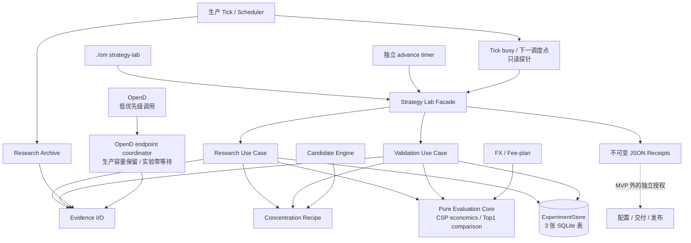

# Strategy Lab 统一策略实验平台系统设计

- **状态**：首条实验链路与内部重构已实现；第二轮 DeepReview 无中高问题，待源码交付授权
- **日期**：2026-09-05
- **产品依据**：[Strategy Lab PRD](STRATEGY_LAB_EXPERIMENT_PLATFORM_PRD.md)
- **首个 Recipe**：`sell_put_option_position_concentration`

本文定义首条可行产品链路的技术边界、函数归属和代码处理方式。旧 Top1 loop、多代
ExperimentStore 和 recorder 产品壳已删除，不是本文要求兼容的已发布产品。当前重构只调整
内部 owner 和执行效率；20 日研究、10 日隐藏验证、确认、回执、资金口径和生产隔离行为保持不变。

## 1. 设计目标

实现一条最短但完整的确定性实验链路：

```text
Recipe preview
  -> 人工确认 20 日研究
  -> 分钟 K 模拟成交与到期结果
  -> Research Receipt / 唯一 leader
  -> 人工确认未来 10 日隐藏验证
  -> 每分钟 Bid 观察与到期结果
  -> Final Receipt
```

设计必须同时满足：

1. 生产 Tick 仍是候选、正式点和运行资源的最高优先级 owner；
2. Strategy Lab 只读复用生产事实，不复制候选过滤、排序或风险门槛；
3. 实验逻辑是固定 Python Recipe，不执行 Agent 生成的代码、SQL 或公式；
4. 实验状态可在进程重启后恢复，重复命令和调度推进幂等；
5. 旧实验库、旧命令和旧兼容路径不迁移；
6. 首次完成前不引入 Strategy Lab 的 schema、Recipe 或合同版本体系；
7. MVP 全局最多一个未终态实验，且不能增加生产 Tick 的 OpenD 调用数；
8. 正式点只绑定同账户、同市场的当前持有期权仓位，不要求取得其他市场的同期行情。
9. Recipe 独占实验参数、候选构造和变体优先级；通用评价只比较标准经济结果，不识别集中度阈值；
10. 收益计算和评价是无 I/O 的纯函数；OpenD、artifact 和 SQLite 分别保留单一读写 owner；
11. 一次推进复用同一锁定作用域内的研究投影；锁外判断不能替代锁内权威重读；
12. 行为 hash 只绑定会改变实验输入解释、结果或选择的 owner，不因 CLI、状态展示和存储实现改动失效。

### 1.1 本次重构成功信号

- 集中度 Recipe 对同一 fixture 产生与重构前相同的 arms、单推荐结果、比较、leader 和回执业务字段；
  experiment id、source commit、behavior manifest 和对应 hash 等 provenance 只要求存在且内部一致，不与旧值逐字节相等；
- DTE 或 Delta Recipe 可复用同一个比较器，不修改比较器、收益公式或 Receipt builder；
- 生产只接受唯一完整正式点 envelope；旧的非正式 V1 / V2 生成、校验开关和无调用 helper 被删除，
  但当前正式点 identity、ref 和 hash 不改变，已积累正式事实无需迁移或清空；
- 20 日研究推进不删除锁内权威重读或改变 `research_evidence_busy`；provider 仍每次最多一个逻辑单元；
- SQLite 的确认、revision、幂等、write-once、batch complete 与 terminal fill 原子性全部保持；
- Strategy Lab 相关 focused tests、完整生命周期 fixture、依赖边界检查和项目 Guardrails 通过。

### 1.2 非目标

- 不新增 Recipe 插件框架、Protocol、DSL、事件总线、任务队列、通用 repository 或迁移层；
- 不在本次实现 DTE / Delta Recipe，只证明公共评价不再阻止它们；
- 不改变 PRD 的评价口径、20 / 10 日窗口、OpenD 低优先级策略或线上配置；
- 不删除 Research Archive、required-data、Shadow Replay、Candidate Engine、SQLite 安全校验和当前正式事实；
- 不为了缩短文件机械拆分所有函数；只移动有明确新 owner 的纯计算和研究 / 验证用例。

## 2. 总体架构



关键依赖方向：

```text
interfaces/cli
  -> application/strategy_lab/service.py
       -> research / validation use cases
       -> recipe.py / evidence.py / receipts.py
       -> domain strategy_lab_evaluation / Candidate Engine / concentration
       -> infrastructure ExperimentStore / Futu gateway / Research Archive
```

`domain/domain/` 不依赖 `src/`。CLI 和 facade 不实现阶段循环；Recipe 不访问 provider 或 Store；
Evidence I/O 不计算收益或选择 leader；provider adapter 不判断实验输赢；Store 不计算 Recipe、报价
crossing 或评价结果。Strategy Lab 不取得 Tick market lock；实验进程只能根据只读 busy / schedule 状态和
低优先级配额决定“立即执行或让路”。

## 3. 最小代码结构

```text
src/application/strategy_lab/
  contracts.py       # 冻结 spec、标准结果和状态常量
  recipe.py          # 首个集中度 Recipe；参数、arms 和变体顺序
  readiness.py       # Evidence readiness；不进入 Recipe
  evidence.py        # Archive 读取、分钟 K、隐藏报价和到期事实；不计算经济结果
  service.py         # 公开 facade 与现有 research / validation use cases
  receipts.py        # Research / Final Receipt 校验、构造和发布

domain/domain/
  strategy_lab_evaluation.py  # CSP 纯数值 economics 和通用 Top1 比较纯函数

src/infrastructure/strategy_lab/
  experiment_store.py

src/application/performance/
  account_fee_plan.py  # 从旧 capability probe 迁出的通用严格 fee-plan loader

src/interfaces/cli/
  strategy_lab_ops.py
```

删除原 application comparison 模块，调用方直接依赖 domain owner；不保留转发 facade。
当前不建立每个 Recipe 子目录、注册表、插件接口、抽象 repository 层或 DSL。第二个 Recipe 真正实现时，
再决定是否需要普通字典分派。本次不预设 `research.py` / `validation.py`：只有移动完整 use case 能减少
`service.py` 的 imports、依赖和重复数据访问时才提取文件，不能为了缩短行数机械搬家。

## 4. 应用服务合同

CLI 和将来的 MCP 只能调用以下应用函数：

| 函数 | 输入 | 输出 | 是否写入 |
|---|---|---|---|
| `resolve_strategy_lab_runtime_context(profile, market)` | 受控 profile、market | runtime / artifact / Store / config、limiter | 否 |
| `resolve_strategy_lab_context(profile)` | 受控 profile | runtime / artifact / Store、HK/lx config、OpenD、共享 endpoint 的 Tick lock 集合 | 否 |
| `list_recipes()` | context | Recipe、参数、readiness | 否 |
| `preview_engineering_canary(context, occurred_at_utc)` | runtime context、冻结时间 | 非权威两日投影预览 | 否 |
| `preview_experiment(request)` | hypothesis、Recipe、参数、market、account | 完整 spec、readiness、`spec_sha256` | 否 |
| `refresh_history_k_readiness(request, confirmed_probe_sha256, actor, occurred_at_utc)` | preview 生成的 option code、OpenD underlier quota identity 与确认 hash | 不可变 readiness receipt | 是 |
| `confirm_research(request, confirmed_preview_sha256, actor, idempotency_key)` | 原 preview 请求和确认 hash | experiment id、状态 | 是 |
| `execute_research(experiment_id, actor, occurred_at_utc)` | experiment id、actor、一次冻结时间 | 最多推进一个 provider 单元的研究摘要 | 是 |
| `get_experiment_status(experiment_id)` | experiment id | 状态、进度、阻塞、下一动作 | 否 |
| `preview_validation(experiment_id, requested_start)` | experiment id、起始交易日 | leader、10 日窗口、schedule / config / behavior hashes、preview hash | 否 |
| `confirm_validation(experiment_id, requested_start, confirmed_preview_sha256, actor, idempotency_key)` | 原 preview 请求和确认 hash | 锁定的 10 日窗口 | 是 |
| `advance_experiment(experiment_id, occurred_at_utc, provider_capable=False)` | experiment id、一次冻结时间、provider 能力 | 验证推进摘要 | 是 |
| `advance_scheduled(occurred_at_utc, provider_capable=False)` | 一次冻结时间、受控 provider 能力 | 仅推进验证阶段；其他状态 no-op | 是 |
| `read_receipt(experiment_id, kind)` | experiment id、receipt kind | artifact、hash | 否 |

约束：

- `preview_experiment()` 不创建数据库行；
- `spec_sha256` 是 `spec` 的 sibling envelope hash，不写入 `spec` 自身；preview、Store 和 Receipt 使用
  同一个 `canonical_sha256(spec)`；
- 两次确认都用原 request 重新生成当前 preview；只有 `available` 且 hash 与用户确认值相同才写入，
  不能接受调用方回传的 spec；
- `create_experiment()` 在 `BEGIN IMMEDIATE` 内拒绝全局第二个未终态实验；
- `advance_experiment()` 使用一个非阻塞 experiment advance 锁串行化全局唯一实验，每次只处理有限工作，
  并用传入的同一时间完成全部阶段判断；它不取得 Tick market lock；
- `advance_scheduled()` 从冻结 calendar 和 `occurred_at_utc` 解析墙钟 slot；先恢复已有 started batch 的
  durable artifact，再只处理仍在 tolerance 内的当前 slot，不为历史 slot 请求报价或写 gap；
- `execute_research()` 保持人工显式入口；`advance_scheduled()` 不自动推进 `research_running` 或
  `research_complete`，避免把人工研究变成定时 provider 调用；
- Tick guard 和低优先级准入成功后才能创建 started batch；`start_observation()` 返回是否由本次调用新建，
  只有新建者可以访问 provider；
- readiness、research、validation 和 outcome 在构造 gateway 前都调用同一个 `_provider_guard()`；它检查
  context 冻结的全部 `tick_lock_paths`、对应市场的对称保护窗口和低优先级额度；
- 每次确认和推进都重新计算冻结 owner manifest 的 `evaluator_behavior_sha256`；不匹配返回
  `evaluator_behavior_mismatch`，不迁移旧实验；`source_commit_sha` 只追加到审计事件，不参与准入；
- `list_recipes()`、两种 preview、canary、`get_experiment_status()` 和 `read_receipt()` 的 provider 调用数必须为
  0；只有显式 history-K readiness refresh、人工 research execute 和 provider-capable advance 可以调用 OpenD；
- `get_experiment_status()` 和 `read_receipt()` 不请求 OpenD、不刷新事实、不写状态；
- `get_experiment_status()` 和 `read_receipt()` 只解析 runtime / artifact / Store authority，不要求当前账户、
  ledger 或 OpenD config 仍可用；status 返回分类进度、静态 blocker 和唯一 next action，provider/Tick 的
  瞬时准入只在显式 execute 响应中报告且不持久化；status 只读核对当前 evaluator，mismatch 时保留
  durable 计数但不再用当前代码解释冻结 spec；
- 所有应用错误返回稳定 reason code，不把异常文本当产品合同。

两个 context resolver 都是普通函数，不新增 context class，也不从 cwd、localhost 或隐式默认值猜运行环境。
共享 runtime resolver 只读取 runtime root、artifact root、Store path、指定 market config 和 limiter root，
Research owner 和历史只读入口可独立使用；产品 resolver 在其上增加 account、OpenD endpoint 和 schedule
约束。产品 resolver 读取 profile 中全部 market runtime configs，复用现有
`resolve_shared_futu_quote_route()`；只有所有启用市场都明确解析到同一个 quote endpoint，且该 endpoint 与
HK/lx 的 Futu binding 完全相同，才把这些市场对应的 `runtime/locks/tick-<market>.lock` 冻结为
`tick_lock_paths`。missing、conflict、endpoint 不同或 config 缺失均 fail closed，不访问 provider。MVP 不
实现任意 endpoint 拓扑；未来真正需要多 endpoint 时再改为逐 endpoint 分组。共享 resolver 不读取旧
`strategy_lab_top1` profile。

## 5. Recipe 和评价合同

### 5.1 Recipe owner

MVP 只有一个可执行 Recipe，服务直接调用它，不保留没有消费者的 `RECIPES` 注册表。同文件提供的最小函数：

| 函数 | 职责 |
|---|---|
| `describe_recipe(recipe_id)` | 返回问题、参数、支持范围、Evidence 和安全要求 |
| `build_concentration_arms(formal_point, parameters)` | 从同一点 accepted 候选构造 baseline / challenger |
| `variant_preference(recipe_id)` | 返回当前 Recipe 冻结的 variant 顺序和参数 |

不建立 class、Protocol 或插件接口。未知 `recipe_id` 由应用边界返回 `unsupported`；第二个 Recipe 真正实现后，
若直接分派开始重复，再增加普通字典。

Recipe 不读取 Formal Corpus、fee-plan、scheduler、readiness receipt、Store 或 provider。Research use case
调用应用层 `check_recipe_readiness()`：它先在冻结 `maturity_cutoff_utc` 上，从后向前选择最近连续 20 个满足
以下条件的正式交易日：formal expectation / point 完整，Recipe 能构造全部 arms，且实际入选 arms 的到期
outcome 均已成熟。随后枚举这些 arms 的确切期权代码，只读校验未过期的 targeted history-K readiness
receipt、账户 fee-plan 和 Evidence Source Gate。receipt 必须匹配 endpoint、权限身份和样本范围，且当前
exact-code 映射到的唯一 security quota identity 数量不超过 receipt 已证明的 quota 边界；任一项未证明时
返回 `blocked`，不调用 provider，也不先创建实验再等待 30～45 日。

当 preview 因 receipt 缺失而 `blocked` 时，仍返回不含 provider 结果的 exact-code probe request 及 hash，
供操作员确认；该 hash 不等于研究确认 hash，也不创建实验。

`refresh_history_k_readiness()` 是 history-K 的唯一实时 PoC owner。它重新生成并核对 preview 给出的 probe request
hash，经 Tick busy / 保护窗口 / `try_low_priority_opend_call()` 准入后，读取 quota / permission 并对冻结
单日样本发起一次完整分页查询。结果写为按 probe hash 和观测日期寻址的不可变 receipt；同日同输入重复
执行复用已有 receipt。receipt 保存 endpoint identity、权限 / quota、sample code / query、security quota
identity、quota ceiling、observed-at、expires-at 和内容 hash。OpenD 对期权历史 K 的 quota
按标的 security identity 记账，不按具体期权合约代码记账。因此 probe 构造时必须证明期权合约解析出的
security identity 与 quota code 完全相同。已有 receipt、保护窗口和 Tick busy 均在创建 OpenD gateway 前
检查，守卫失败时不得触发 readiness / `get_global_state` 或其他 provider 调用。它不是通用 capability 平台。

当前已验证的 provider contract 来自 2026-08-30 本机只读 PoC：查询已过期的
`HK.POP260828P127500` 在 2026-08-27 的 1 分钟 K，单页返回 330 根 bar，耗时 101ms，其中 329 根
`volume=0`，说明该样本的无成交分钟由零量 bar 表达；quota 明细为 18 条请求记录、13 个唯一 security，
`used=13`、`remaining=987`，样本合约记在 `HK.09992` identity 下。实现据此冻结 24 小时 receipt 有效期、
港股工作日 16:10 后准入、每 30 秒最多 4 个低优先级调用和最多 3 页。远端 systemd 与生产 Tick 的自然
并发证据仍未取得，不能据此宣布整个 Phase 1 通过。

### 5.2 首个集中度 Recipe

`build_arms()` 的确定性步骤：

1. 从 formal point 读取实际封存的生产 Top1 作为 baseline；
2. 读取同一点完整 accepted Cash-Secured Put (CSP) 候选，缺任一候选事实则该点不可评价；
3. 对每个候选调用
   `calculate_option_market_concentration_after()`，只使用同一 formal point 绑定的同账户、同市场全部当前
   持有期权、mark 和 FX；
4. 调用 `rank_candidate_rows(mode="put", sell_put_ranking_profile=
   "option_market_concentration", near_return_threshold=...)`；
5. 排序第一名为 challenger，保留候选、持仓、mark、FX 和排名输入的 ref/hash。

三个固定变体及冻结 preference 均为升序 `0.002 / 0.004 / 0.006`。它们是持有期净收益率带，不是年化
收益率差。年化收益和 CNY PnL 完全相同时必须选择 `0.002`，逐字复现当前比较器的第三排序键。

Recipe 不增加指派后股票集中度、全部 Short Put 名义敞口或其他新安全门槛。baseline 和 challenger
都必须来自生产 accepted 集合。不得从 performance-evidence repository、其他 run 或后来的 quote
回退补推荐时刻集中度输入。

#### 5.2.1 持仓证据的市场范围

正式点和冻结 required-data batch 都以 `market` 为边界。唯一 owner
`build_option_position_evidence_binding()` 按以下顺序处理：

1. 先校验 prepared receipt、账户 identity 和 `decision_snapshot_actionable`；所有 open position 仍通过现有
   `_prepared_position()` 校验，不能因为属于其他市场而跳过坏行；
2. 每条 open position 只调用一次现有 `resolve_symbol_identity()`；无法解析市场，或 identity currency 与
   instrument currency 不一致时返回 `option_position_evidence_missing`。原始持仓存在 `market_code` 时，也必须
   先解析并确认其 market 与 identity market 一致，不能先把冲突行当作其他市场过滤；
3. 完成上述逐行一致性校验后，只把 identity market 等于正式点 market 的仓位放入一个
   `selected_positions` 集合；最终匹配到的 mark `market_code` 也必须解析为该市场；
4. required-data mark 查找、`open_option_positions`、mark coverage 和持仓产生的 FX currencies 全部只消费
   `selected_positions`。正式点市场 currency 仍必须存在，供同市场候选换算使用；其他市场仓位不能额外引入
   mark 或 FX 要求；
5. `validate_option_position_evidence_binding(..., expected_market=...)` 对已生成 artifact 重复检查 position
   identity market、currency 和 mark `market_code` 的同市场不变量，不能只依赖 content hash。

同市场持仓缺少 required-data symbol、唯一合约行、有效 mark、时间一致性或 FX 时，正式点继续 fail closed。
point producer 与 Formal Corpus verifier 都调用该 builder；`formal_corpus.py` 不增加第二套筛选。该修复不改变
artifact schema、不新增 provider 调用，也不回填已经封存的失败正式点。没有同市场当前持仓是合法输入；此时
binding 的持仓和 mark 列表为空，但仍保留正式点市场候选所需的 FX，集中度在加入 candidate 后计算。

不采用以下方案：把其他市场持仓加入当前 Tick 批次会增加 provider 调用并破坏生产优先级；使用其他 run
或上一交易窗口的 mark 会破坏同点时间一致性。若未来需要跨市场账户级集中度，应作为独立 Recipe 定义
异步估值时点和证据合同，不扩展本次修复。现有 symbol alias fallback 可能把显式市场代码解析成另一市场；
本修复以现有 identity 结果和 currency 一致性 fail closed，不在本 work unit 改写全局 alias 规则。修复后由
自然正式点和 Corpus Health 回执验证同市场持仓的原批次覆盖率。

#### 5.2.2 FX 事实的时间归属

prepared context 中三个时间的职责不同：

- `prepared_authority.source_observed_at` 是持仓 / ledger 决策快照的观测时间；它在 FX
  读取之前冻结，不得作为 FX `observed_at_ms`；
- `exchange_rates.timestamp` 是已绑定 FX observation 的时间，继续作为 FX
  `effective_at_ms`；命中缓存时必须保留原 observation 时间；
- prepared receipt 现有的 `application_received_at_utc` 在 FX 读取和 context 组装后产生，
  作为该 FX observation 被本次 prepared context 接收的 `observed_at_ms`。

`build_option_position_evidence_binding()` 是唯一修改 owner：它继续从同一份已封存
prepared receipt 读取 FX 值和 `effective_at_ms`，但只从
`prepared_receipt["manifest"]["application_received_at_utc"]` 构造 `observed_at_ms`。输入必须是现有
`load_prepared_option_positions_context_receipt()` 返回的已验证 receipt；该 loader 已经校验
manifest 与 payload authority 中的同名时间完全一致，builder 不重复 receipt 校验。
现有 validator 继续要求
`effective_at_ms <= observed_at_ms <= evidence_at_ms`；时钟顺序仍不合法时 fail closed，不用
`max()` 修补，也不放宽校验。position source 的 manifest / payload hash 继续绑定这些
时间，不增加 artifact 字段、schema、provider 调用或第二套 FX 事实。

回归测试必须复现生产顺序：持仓 `source_observed_at` 早于新拉取的 FX
`timestamp`，FX `timestamp` 早于 `application_received_at_utc`，且 receipt 早于正式点
`evidence_at_utc`。该输入必须生成可验证 binding；FX 接收时间早于 effective time
或晚于正式点时仍必须拒绝。共享 fixture 必须把同一 receipt time 同时写入
manifest 和 payload authority，并使用生产实际的 aware UTC `+00:00` 格式重算 hash；不为旧
fixture 增加 fallback。已封存的失败点不覆盖、不回填。

### 5.3 标准结果

拟新增的 domain/domain/strategy_lab_evaluation.py 只提供纯数值函数：

```text
calculate_csp_economics(
    opening_net, strike, multiplier, underlying_close,
    opening_fx, terminal_fx, terminal_fee, holding_days,
) -> economic_pnl_cny, annualized_return, return_capital_basis_cny, terminal_intrinsic_loss
```

输入是 application 已完成 evidence/schema 校验后的 `Decimal` 和正整数天数；domain 不读取 arm、fill、outcome、
Recipe、artifact ref/hash 或 reason code，也不导入 `src/`。非法分母或天数抛出明确的 domain value error。
`evidence.build_single_recommendation_result()` 继续是 application envelope owner：它校验 fill/outcome/evidence，
处理 `no_fill / not_evaluable`，调用上述函数，并组装 PRD 的 `single_recommendation_result`。CSP 资金分母和
损益公式只在 domain 函数中实现；application 直接使用其返回的 `terminal_intrinsic_loss`，不根据 strike 和
underlying close 重算。

标准结果的公共比较字段固定为：point / day、baseline 或 challenger、`variant_id`、候选 identity、
fill / outcome / safety 状态、`annualized_return`、`economic_pnl_cny` 和 evidence refs。
`evidence.build_comparison_projection()` 先拒绝 fill / outcome / safety 不合法的结果，再收窄为
`recommendation_point_id / trading_day /
variant_id / candidate_identity / status / annualized_return / economic_pnl_cny`。其中 `status` 只能是已验证可评价的
`available` 或 `no_fill`；`candidate_identity` 沿用现有 candidate ref 的稳定 identity，只用于计算
`top1_change_count`。domain 不读取其他 envelope 字段。application 在
集中度 Recipe 的结果 envelope 和回执中原样附加 `near_return_threshold` 用于审计。

`no_fill` 输出零 PnL 和零年化收益率，资金分母与持有天数为空；`pending_outcome` 保持等待；
`not_evaluable` 不参与计算且不能改写为零。

### 5.4 单推荐替换评价

拟新增的 domain/domain/strategy_lab_evaluation.py 暴露：

```text
compare_single_recommendations(expected_points, baseline_projections, challenger_projections)
select_research_leader(variant_comparisons, variant_preference)
```

它依次完成：

1. 按 `recommendation_point_id` 严格配对；
2. 检查每天 expected formal points 完整；
3. 计算每点年化收益率和 CNY PnL delta；
4. 同日各点算术平均；
5. 冻结窗口内各日等权平均；
6. 应用两条判断：平均年化收益率 delta 大于零，平均 CNY PnL delta 不小于零。

比较器只消费 §5.3 的最小数值投影，并要求同一批 challenger 的 `variant_id` 一致；不读取
`near_return_threshold`，也不导入 Recipe
常量。它比较 baseline / challenger 的 `candidate_identity` 生成逐点变化标记和 `top1_change_count`，不由
service 另行统计。leader 选择先按年化收益率改善、再按 CNY PnL 改善，完全相同时使用 Recipe 传入的冻结
`variant_preference`，不在通用函数中猜参数含义。应用层随后把获胜 `variant_id` 对应的 Recipe 参数原样
加入 leader 和 Receipt，以保持当前集中度回执字段不变。

不实现 Student-t、最差 20%、加权总分、自动显著性判断或用户提供公式。隐藏验证只评价锁定 leader。

### 5.5 正式点身份不变量

V1 / V2 envelope 删除不等于改变正式点身份。`build_recommendation_point_id()` 的 canonical identity payload
必须继续包含历史字面量 `"recommendation_point.v1"`；该字面量只表示稳定 identity namespace，不表示仍支持
V1 envelope。实现时把它改名为明确的 identity namespace 常量，但值不变，并用一个现有 V3 正式点的固定
输入 / point id 向量证明重构前后完全一致。

## 6. Evidence 设计

### 6.1 Evidence 分层

| 时点 | 事实 | owner | 获取方式 |
|---|---|---|---|
| 推荐时刻 | 正式点、accepted/rejected 候选、生产 Top1 | Research Archive | 只读现有 artifact |
| 推荐时刻 | 合约报价、Greeks、OI、DTE、标的价 | Research Archive | 只读 required-data / opening snapshot |
| 推荐时刻 | 同账户、同市场全部当前持有期权 identity / 数量、mark、FX | Formal Point artifact | 只读同 point 绑定事实；不跨市场或 repository 回退 |
| 20 日研究 | 入选 arm 的期权 1 分钟 K | OpenD | 闭市后按需请求 |
| 10 日验证 | 锁定 arm 的 `bid` / `bid_vol` | OpenD | 盘中每分钟一个批次 |
| 到期 | 标的未复权日收盘、FX、费用 | OpenD / performance evidence / fee-plan | 成熟后按需补全 |

Evidence cutover 只走一条路径：

1. `prepare_option_positions_contexts()` 在扫描前只冻结 position identity / 数量和 FX，不再要求或刷新
   Strategy Lab mark；
2. 原生产扫描完成并持久化 required-data / opening artifact；
3. `tick_notification_flow.py` 在这些 artifact 可读后调用 `recommendation_point.py`；后者按同一
   run/account/market/point time 从允许的 artifact 解析当前正式点市场每个持仓合约的 exact mark，复用
   `performance/evidence_collection.py` 的合约行匹配、mark 选择和 `ValuationMarkFact` 规范化，生成
   `option_position_evidence_binding`；
4. `formal_corpus.py` 重新读取 point 所引用的 prepared context 和冻结 required-data batch，用同一确定性
   builder 重建 position / mark / FX binding，并与 point 中的 binding 精确比较后封存；不调用 provider，
   不跨 run/repository 回退；
5. 任一同市场持仓合约未被原批次覆盖、source time 超出冻结 coherence 窗口、identity 或 hash 不一致时，
   point `not_evaluable`；其他市场持仓不参与该点，且不得新增 provider 请求。

现有 private helper 在原文件内提升为一个可复用
`build_option_valuation_mark_fact(position, snapshot_rows, source_binding, formal_time_bounds)`，不另建 mark
层：行解析依次使用 requested instrument key、
持仓 market code，最后才用 option type / expiry / strike / multiplier；必须唯一匹配。正 Bid 和 Ask 且
Ask 不低于 Bid 时取 midpoint，否则只允许正 Last 的 `last_fallback`；crossed market、无价、零行或多行
都失败。requested / received time 必须来自 source artifact、顺序合法并位于同 run 已冻结的
formal-point time-coherence 范围；禁止用调用时钟 fallback 或后续批次。现有 performance 调用方继续沿用
当前 live fallback 行为；只有 formal caller 传入 `formal_time_bounds` 时启用上述严格时间门槛。

binding 的最小字段是 run/account/point identity、position source ref/hash、逐合约 instrument key / market
code / 数量、price、mark kind、effective / observed time、source artifact ref/hash、source row identity、
确定性 `ValuationMarkFact.fact_id` / payload hash，以及 FX ref/hash。`source_id` 是 artifact hash 与匹配行
requested instrument key / code 的 canonical hash，fact id 继续由现有 canonical payload 生成。多个 lots
复用同一 instrument fact；
同一 instrument 出现不同 mark 则失败。只有确切持仓合约进入原 snapshot batch 不会增加预计 provider
调用数时才扩展现有 batch。新 binding 的 focused tests 通过后，才在同一 Phase 删除
`mark_evidence_accounts -> refresh_quotes=True`；不双写。Evidence Source Gate 比较切换前后的 OpenD
调用数、snapshot 批次数和 Tick deadline，任一变差就保持 Recipe `blocked`。

### 6.2 20 日研究成交

`collect_research_fill_evidence()`：

1. 先冻结 `recommendation_available_at_utc`：取正式点 capture、decision、opening seal、候选最大
   observed time 和 scheduled target 中最晚的合法 UTC；查询从其后的下一根完整分钟开始；
2. 调用现有 `FutuGateway.request_history_kline()` 获取具体期权合约 1 分钟 K，并携带返回的
   `page_req_key` 逐页请求直到为空；所有页都通过低优先级零等待 limiter；
3. 规范化后要求全部返回 bar 严格有序且时间唯一；早于冻结起点的同日 bar 仅用于校验 provider 顺序，
   不参与成交判断，晚于冻结终点的 bar 失败；“完整”表示请求参数绑定完整查询范围、所有分页成功且
   最终 `page_req_key` 为空，不要求零成交的每个墙钟分钟都存在 bar；
4. 首根满足 `high >= sell_limit + price_tick` 且 `volume > 0` 的 bar 为
   `simulated_fill`，成交价记为 `sell_limit`；
5. 完整覆盖但未满足为 `no_fill`；缺口、重复、时区不明或 provider 不支持为
   `not_evaluable`；
6. query 与 artifact 同时绑定冻结的 OpenD provider/endpoint/source authority、
   `evaluator_behavior_sha256`、完整 query、provider 观测时间、producer source commit 和内容 hash；不同
   source authority 或 evaluator behavior 不得复用 artifact；provider 成功后先幂等记录 producer commit，
   再发布 artifact，绑定既有 artifact 时也把其 producer commit 写入 Store 审计。Store 只保存判定和引用。

不得用日 K 判断成交，也不得把模拟成交描述为真实成交。

preview 枚举确切 option codes，并将其映射为唯一 security quota identities，但只读取 targeted readiness
receipt。receipt 过期、endpoint / 权限漂移、样本范围不足或当前 identity 数量超过已证明 quota ceiling
时返回 `blocked`。真实 quota / permission 与单日 PoC 只能由显式 `refresh_history_k_readiness()` 获取，
并使用和 scheduled advance 相同的 busy、保护
窗口与低优先级零等待边界。PoC 同时记录缺分钟和 `volume=0` bar，以实际返回证明无成交分钟的编码语义；
过期合约可回溯范围、该语义和返回尾延迟没有真实证据前均为 readiness blocker，不从文档推测。

### 6.3 10 日隐藏成交观察

第二次确认冻结 10 个交易日的 calendar session、UTC 分钟网格、wake-up tolerance 和订单有效终点。
每个 formal point artifact 持久化后，服务把 arm active window 固化为“point 持久化后的第一个完整交易
分钟至同日冻结终点”；午休、半日市和临时休市完全由冻结 calendar 决定，point 出现前的 slot 不属于该
arm。任务晚于 `slot + tolerance` 才醒来时不请求 provider，也不用当前报价回填过去 slot。slot 来源是冻结 calendar
与本次 `occurred_at_utc`，不从上一次任务完成时间递推。

`observe_hidden_fill()`：

1. 在非阻塞 experiment advance 锁内，按 slot 排序读取真实存在的 started batch；发现匹配的 durable
   artifact 时补 Store binding，并完成其中首次 crossing。没有 artifact 的 started row 保持原样；
2. 计算仍在 tolerance 内的当前 slot，收集其全部 active、尚未确定 fill 的 arms，并按合约去重；任务晚到
   或没有 active arm 时不创建 observation；
3. Tick guard 和低优先级 OpenD 准入成功后，在一个 SQLite 事务创建 batch-kind started observation，key 为
   `hidden_batch:<trading_day>:<observation_slot_utc>`，payload 冻结 exact arm ids、option codes 和 query；
   `start_observation()` 返回 created 标志，只有本次新建者可以继续调用 provider；
4. 一次调用现有 `fetch_option_snapshots()`，固定 `max_wait_sec=0`、`no_retry=True`、
   `snapshot_fallback_max_codes=0`、一个明确 batch size 和进程级硬 timeout；去重后不得超过单批上限；
5. 对每个 arm 使用冻结 `sell_limit` 判断 `bid >= sell_limit and bid_vol > 0`；`bid` 和 `bid_vol`
   必须来自同一 snapshot 且为有限正值。`bid_vol` 只证明最优买价存在非零挂量，不换算为合约张数，
   不估算可成交规模或滑点；
6. 按下方证据分支校验 provider envelope。`observation_slot_utc` 只作 identity；artifact 的
   `observed_at_utc` 和 crossing 的 `fill_time` 均使用真实 `received_at_utc`；
7. 调用 artifact publish owner；它内部使用 `evidence_artifact_location()` 返回的真实 lock 原子发布并
   readback。service 不预持该锁，不增加 batch lock，也不传 `lock_held`；
8. artifact durable 后，在一个 SQLite 事务 complete batch；只为本批首次满足条件的 arm 写唯一
   `validation_fill:<point_id>:<arm_id>`，状态为 `observed_fill`、价格为 `sell_limit`，并直接引用 batch
   artifact。完整批次内容不复制为逐 arm、逐分钟 Store 行；
9. active window 终点对尚无 fill 的 arm 投影一次终态：全部 expected slots 都有内容和绑定有效的 complete
   batch 时为 `no_fill`；任一 slot 不存在、started 未完成或 artifact 不可评价时为 `not_evaluable`。
   projection artifact 列出 expected slots、实际 batch ref/hash 和 missing/invalid slot identities；
10. 进入 `waiting_outcome` 前完整恢复一次全部 started rows，再确认每个 arm 已有唯一 terminal fill。

provider envelope 只走以下三条分支：

| 条件 | 处理 |
|---|---|
| 调用报错或超时、`opend_call_count != 1`、request / receive UTC 缺失或不可解析、任一时间超出冻结 tolerance、存在未请求或重复代码 | 不发布 artifact，started row 保持原样 |
| exact query identity、单次调用和时间 envelope 有效，但 requested code 缺行，或 `bid` / `bid_vol` / source time 非法 | 为每个缺陷 code 写明确 invalid row，发布不可评价的 complete batch artifact |
| envelope 与报价行均有效 | 发布 complete batch artifact；application/evidence 层从 readback artifact 计算 crossing 集合 |

缺少 requested code 是可枚举的行级缺陷；未请求或重复代码破坏 query identity，不能封存为该 query 的事实。
artifact publish/readback、crossing 计算和 Store complete 使用同一份 canonical payload。

中间观察和阶段效果不向用户展示。status 只返回进度与阻塞原因。

每个 batch 断言 `opend_call_count <= 1`。系统不承诺 provider exactly-once；batch started 后不再对同 key
发起查询。进程在 artifact 持久化前崩溃时，started row 永久代表缺失证据；artifact 已持久化但 Store
未绑定时，重启只补 complete 和首次 crossing。未 started 的过期 slot 保持不存在。历史 K / outcome 查询
没有盘中 slot 语义，artifact 未持久化时允许安全重试。

`validation_fill` 是每个 arm 的唯一终态事实。`observed_fill` 表示首次持久化观察到的 crossing，不证明缺失
slot 中不存在更早 crossing；它直接引用 batch artifact，不再发布独立 observed-fill artifact。
`no_fill / not_evaluable` 只在窗口终点发布 projection artifact，已存在 `observed_fill` 时不得再生成第二份
terminal fill。

`preview_validation()` 只从已完成研究和本地冻结事实构造 leader、未来窗口及其 binding，不访问 provider。
第二次确认重新生成 preview，并把 schedule、account config、timer 和 behavior hashes 固化进 validation
binding。实时 snapshot 的 `bid`、`bid_vol` 或 source time 缺失 / 非法时，只影响对应 slot 的
可评价性，不在确认前新增一个无法独立证明 volume 单位的 readiness 子流程。

### 6.4 到期结果

`resolve_expiry_outcome()` 对已成交 arm：

- 使用真实合约到期日和标的未复权日 K 收盘；
- outcome query 从冻结 OpenD binding 派生 `endpoint=history_kline` 的独立 source authority 与 hash，不能沿用
  盘中隐藏报价的 `market_snapshot` authority；
- 使用开仓、到期时点已绑定的 `FXRateFact`；
- 开仓费用使用 formal point 已封存结果；终端费用使用严格 account fee-plan fact
  (`commission_free`、`platform_fee`、`fee_plan_ref`) 及其内容 hash，并复用现有期权费用计算；CSP
  指派产生的股票结算费用以 Strike 为成交价，不使用到期收盘价；
- 生成规范化 outcome artifact 和 hash；
- 未到期为 `pending_outcome`，可恢复缺失为 `blocked`，冻结窗口不可恢复缺失为
  `not_evaluable`。

MVP 不抓期权逐笔、不模拟提前平仓，也不计算指派后的持股收益。

## 7. ExperimentStore

### 7.1 三张表

新的 `ExperimentStore` 直接创建三张表，不检测或迁移旧表：

| 表 | 最小内容 |
|---|---|
| `experiments` | id、state、canonical spec/hash、source commit、behavior hash/manifest、leader、窗口、receipt ref/hash、revision、时间 |
| `experiment_events` | experiment id、顺序号、event type、actor、confirmation hash、payload、时间 |
| `experiment_observations` | experiment id、稳定 observation key、point / arm / slot、kind、status、payload/ref/hash、时间 |

主键和唯一约束承担幂等：

- `create_experiment()` 在 `BEGIN IMMEDIATE` 内查询并拒绝全局第二个未终态 experiment；
- 每个 experiment 的 confirmation hash 只能消费一次；
- observation 以 `(experiment_id, observation_key)` 唯一；隐藏 batch key 只含 trading day + scheduled slot，
  payload 冻结 exact arm/query manifest；每个 arm 只有一个
  `validation_fill:<point>:<arm>`，`observed_fill` 直接引用首次 crossing 的 batch artifact，
  `no_fill / not_evaluable` 引用终态 projection artifact；research K / outcome key 包含冻结 query identity；
  相同 key 的不同内容必须拒绝；
- event 以 `(experiment_id, sequence)` 排序，只追加；
- 状态更新使用 `revision` compare-and-set，并在同一 SQLite 事务提交事件。

### 7.2 关键 Store 函数

下表覆盖本次重构会直接使用或保护的函数，不把内部私有 helper 当公开清单：

| 函数 | 行为 |
|---|---|
| `initialize()` | 仅为空库创建三表；发现其他表 fail closed |
| `create_experiment()` | 写冻结 spec 和首个事件 |
| `get_active_experiment()` | 返回全局唯一未终态实验；没有则返回空 |
| `get_experiment()` | 读取状态与引用 |
| `list_events()` | 只读返回实验审计事件 |
| `append_event_and_transition()` | 校验旧状态、revision 后追加事件并推进 |
| `confirm_validation()` | 在事务内消费第二次确认并冻结验证窗口 |
| `start_observation()` | 在一个事务保存 batch started 与 exact arm/query manifest，返回 `(observation, created)`；只有 `created=true` 的调用方可以访问 provider |
| `complete_observation(..., artifact_ref, artifact_sha256, artifact_received_at_utc, crossing_arm_ids)` | artifact durable 后在一个事务完成 batch，并为 application/evidence 已判定 crossing 的 arm 插入唯一 `observed_fill` |
| `put_observation()` | 写 research / outcome 事实及窗口终点的 `no_fill / not_evaluable`；终态 fill 必须引用不可变 projection artifact |
| `get_observation()` | 按稳定 observation key 精确读取一条事实 |
| `list_observations()` | 完整回执需要时读取全部；推进和状态按 kind / status / key 精确读取或计数 |
| `complete_validation_collection()` | 在事务内确认所有 terminal fill 完整后进入等待 outcome |
| `attach_research_receipt_and_transition()` | 仅在 Research Receipt 已 readback 后绑定并推进 |
| `attach_final_receipt_and_transition()` | 仅在 Final Receipt 已 readback 后绑定并终结 |

`complete_observation()` 不读取 artifact，也不计算 Bid crossing。application/evidence 必须先 readback 同一
artifact，并只传其中满足条件的 `(recommendation_point_id, arm_id)` 集合。Store 在一个
`BEGIN IMMEDIATE` 内：

1. 校验 batch 仍为 started、manifest 完全相同，crossing identities 唯一且都是 manifest arms；
2. 用 manifest 中冻结的 `sell_limit` 作为 `fill_price`，用 `artifact_received_at_utc` 作为 `fill_time`，
   并把同一 artifact ref/hash 绑定到 batch 和新 fill；
3. 更新 batch 为 complete，并插入尚不存在的 `validation_fill:<point>:<arm>`；
4. 完全相同的 batch/artifact/crossing 集合重试返回既有结果；manifest、artifact、received time 或 crossing
   集合任一不同均返回 `validation_batch_manifest_conflict`；
5. 若任一 arm 已绑定其他 terminal fill，整个事务失败，不留下 complete batch 或部分 fills。

Store 只负责 schema、identity、原子性、幂等和冲突校验；状态迁移、observation kind 与 payload 的业务
合法性继续由现有模块级无 I/O validator 定义，并由 Store 在 `BEGIN IMMEDIATE` 内对新鲜状态调用。本次
不移动这些 validator，不改变 import 方向，也不得把校验移到事务外。报价规范化、invalid row、crossing、
收益和 leader 判定不属于 Store。

写路径复用 `connect_private_sqlite()`、`secure_sqlite_artifacts()`、现有跨进程 writer lock、SQLite WAL 和
`BEGIN IMMEDIATE`；writer lock 负责串行写入，WAL 只负责隔离短生命周期 reader 与连续 writer；
`get_active_experiment()`、`get_experiment()`、`list_observations()` 使用严格 `mode=ro` / `query_only`
连接，只校验 Store 是私有普通文件，不创建文件、不 chmod、不修复 sidecar。不再使用
`strategy_lab_schema`、`schema_state()`、`migrate()`、generation、capability、corpus、feature 或
Top1 专用表。

本次重构不改变 Store 路径、schema 或现有三表内容，不移动、删除或迁移运行数据。任何生产数据处理都不
属于本 work unit，并继续要求单独授权。

## 8. 状态推进与调度

### 8.1 状态 owner

`execute_research()` 是人工研究推进入口；`service.advance_experiment()` 是验证阶段推进 facade。调度入口只
调用 `advance_scheduled(occurred_at_utc, provider_capable=...)` 查找全局唯一活动实验，并且仅在
`validation_collecting / waiting_outcome` 状态推进；研究状态稳定返回 `no_advanceable_experiment`：

```text
research_running
  -> research_complete
  -> completed | awaiting_validation_confirmation
  -> validation_collecting
  -> waiting_outcome
  -> completed
```

`blocked` 是可重试的阶段结果，不伪造成功状态；冻结窗口不可恢复缺失生成
`insufficient_evidence` 回执并结束。所有阶段先读 Store，再检查已有 artifact/observation，最后才发起
缺少的 provider 调用。无活动实验或活动实验不在验证阶段时，调度成功 no-op。

每次确认 / advance 都按冻结 manifest 重算 `evaluator_behavior_sha256`。manifest 直接列出会改变冻结输入
解释、候选构造、fill / outcome、CSP economics、Top1 comparison 或 leader 选择的源文件内容 hash；聚合
hash 由 canonical JSON 计算，不扫描全仓，也不引入版本表。行为 hash 不一致返回
`evaluator_behavior_mismatch`；仅 `source_commit_sha` 改变不阻断，但追加审计事件。历史研究允许不同
formal point 绑定各自生产 config / source hashes；未来验证在第二次确认时冻结 schedule、account-config
和 timer binding，后来 formal point 不匹配即 `validation_source_binding_mismatch`，不自动换配置或迁移。

重构后 manifest 固定覆盖以下语义 owner，每项只保存路径和文件 SHA-256：

- 现有：`src/application/strategy_lab/contracts.py`
- 现有：`src/application/strategy_lab/recipe.py`
- 现有：`src/application/strategy_lab/evidence.py`
- 拟新增语义 owner：domain/domain/strategy_lab_evaluation.py
- 现有：`domain/domain/engine/candidate_engine.py`
- 现有：`domain/domain/short_vol_assessment.py`
- 现有：`domain/domain/option_lifecycle.py`
- 现有：`domain/domain/fee_calc.py`
- 现有：`domain/domain/performance/models.py`
- 现有：`src/application/opening_candidate_snapshot.py`
- 现有：`src/application/opend_market_snapshot_fetching.py`
- 现有：`src/application/performance/evidence_collection.py`
- 现有：`src/application/prepared_option_positions_context.py`
- 现有：`src/application/recommendation_point.py`
- 现有：`src/application/research/formal_corpus.py`

固定参数和公式输入由 canonical spec 覆盖；timer unit、冻结 schedule 和 account config 由独立 binding
hash 覆盖。新增实际执行 owner 时必须先更新固定清单和设计，不能运行时递归发现依赖、生成 AST 图或
建立版本表。prepared context、opening snapshot loader、snapshot 规范化和 valuation mark builder 都直接
改变 Recipe 使用的事实，因此采用整个文件 hash；物理编码调整可能保守阻断当前实验，MVP 接受该取舍，
不增加函数级源码分析。

从当前 21 项清单移除的 8 项及理由固定如下：

| 移除项 | 理由 |
|---|---|
| 原 application comparison 模块 | 由新的 domain 纯计算 owner 替代，原文件删除 |
| `src/application/strategy_lab/readiness.py` | 只决定能否取证，不解释已冻结证据的经济结果 |
| `src/application/strategy_lab/service.py` | 只编排 use case；结果选择迁出后不拥有评价语义 |
| `src/application/strategy_lab/receipts.py` | 只校验、组装和发布已计算结论，不再选择 leader |
| `src/infrastructure/strategy_lab/experiment_store.py` | 只持久化和原子校验，不计算实验结果 |
| `src/application/performance/account_fee_plan.py` | 确认时把严格 fee-plan fact 和 hash 冻结进 spec |
| `src/infrastructure/performance_evidence_sqlite.py` | 只提供已冻结进 spec 的 FX / fee 输入事实 |
| `src/infrastructure/futu_gateway.py` | 只传输 provider 请求；有语义的 snapshot 规范化仍绑定 application adapter |

通知、日志、CLI adapter 和文档也不属于行为 manifest。上述移除只在对应语义已由 spec、observation 或
新 owner 的测试证明后执行；无法证明时保守保留。清单变化必然改变 `behavior_manifest` 和聚合 hash，不能
要求重构前后 provenance 值相等。

### 8.2 运行隔离

仅保留一个 Strategy Lab timer，调用：

```text
./om strategy-lab advance --profile-path <runtime>/service.profile.json --scheduled
```

`service_deploy.py` 为同一 timer 生成三条墙钟 `OnCalendar=`：盘中
`Mon..Fri *-*-* 09..15:*:00 Asia/Hong_Kong`，以及闭市阶段
`Mon..Fri *-*-* 16..23:00/10:00 Asia/Hong_Kong` 和
`Tue..Sat *-*-* 00..08:00/10:00 Asia/Hong_Kong`。冻结 calendar
负责让开盘前、午休、半日市和休市日 no-op；timer 只负责稳定唤醒。配置 `AccuracySec=1s`、
`RandomizedDelaySec=0`、`Persistent=false`。不得使用当前 `OnUnitActiveSec`，避免任务耗时推动下一次观察
时刻；重启后也不补跑带当前报价的过期盘中调用。

调度实现：

1. `advance` 先非阻塞取得 experiment 级 advance lock；失败返回只读
   `status=progress, reason_code=validation_advance_busy`，不写 Store、不访问 provider。该锁覆盖一次推进，
   不取得 Tick market lock；Tick busy 或进入保护窗口立即让路；
2. 按 slot 顺序扫描 Store 中真实存在的 started batch。artifact 已存在时只补 Store complete 及首次 crossing
   的 `observed_fill`；artifact 不存在时保持 started，不重试；不存在 started row 的历史 slot 不创建记录；
3. 当前 slot 已有 started/complete batch 时本次推进不再申请低优先级额度。只有无 batch 的当前 slot 才在
   创建 started row 前完成 Tick guard 和 OpenD 低优先级零等待准入；`start_observation()` 返回 `created`，
   只有创建者调用 provider；
4. 历史 K 和 outcome 只在闭市后、且不在 HK 或 US Tick 保护窗口内运行，每次最多处理一个 point 或
   outcome；周六香港时间仍须保护对应的美股周五盘中 Tick；
5. 盘中隐藏观察每分钟最多一个 snapshot batch，按合约去重，固定单批、硬超时、零等待、不重试、
   无 fallback；
6. provider 响应严格应用 §6.3 的三分支 envelope 合同；只有 envelope 有效的结果才发布 artifact，行级缺陷
   写入 artifact 的 invalid rows；
7. batch artifact 只由 artifact publish owner 内部取得真实 artifact lock。发布并 readback 后，一个 Store
   事务完成 batch 并写首次 crossing fill；service 不预持 artifact lock，不增加 batch lock 或 `lock_held`；
8. 进入 `waiting_outcome` 前完整恢复全部 started rows。窗口到期后，完整 expected slots 生成
   `no_fill` projection；缺失、started 或无效 slot 生成 `not_evaluable` projection；
9. 旧 recorder 的 build/sample/settle timers 和旧 Top1 timer 全部删除。

MVP 全局只有一个实验且窗口固定 10 日，恢复直接线性扫描真实 started rows；不增加 recovery cursor、索引表
或批次调度状态。

保护窗口、生产预留容量和单元 deadline 沿用本文已冻结的代码常量，不增加用户配置。
并发测试必须覆盖两个方向：Tick 已运行时实验立即让路；实验已开始后 Tick 仍取得自己的锁且不会
`SKIP_LOCKED`，实验在硬超时内结束。若共享 endpoint 的低优先级协议无法证明这一点，
MVP 保持 `blocked`；不在本设计中预建第二个 OpenD endpoint。

#### 8.2.1 共享 endpoint 准入与人工研究 deadline

MVP 复用 `src/application/futu_quote_routing.py` 的 `resolve_shared_futu_quote_route()`，不新增 endpoint registry：

1. `resolve_strategy_lab_context()` 读取 service profile 中全部启用市场的 runtime config；route 必须为 `ok`，
   且唯一 host/port 与 HK/lx Strategy Lab binding 相同；否则 context fail closed；
2. context 生成这些市场对应的不可变 `tick_lock_paths`。`_provider_guard()` 对任一路径 busy 或任一对应市场
   进入对称保护窗口都立即返回，不构造 gateway；
3. readiness 的公开 facade 收回 `service.py`，CLI 不再自行构造 gateway 或只传 HK lock；底层 readiness
   publisher 在 gateway factory 执行前再次检查全部 `tick_lock_paths`；research、validation 和 outcome 复用
   同一 guard；
4. 每个 provider 请求仍走现有 `try_low_priority_opend_call()`，保留生产额度且 `max_wait_sec=0`。

人工 `research execute` 和 readiness refresh 没有 systemd `TimeoutStartSec`，因此在
`opend_call_coordinator.py` 增加一个最小的 `run_interruptible_opend_unit(call, timeout_seconds=10)`：仅在
主线程且平台支持 `SIGALRM / setitimer` 时执行，保存并恢复调用方已有 timer；不具备可中断 deadline 时在
gateway factory 前返回稳定 blocker。deadline 包住 gateway 构造、完整分页 / quota 请求和 close，不包 Store
或 artifact 写入；超时后不发布 artifact，既有 started/write-once 语义不变。scheduled validation 继续以
原生 systemd `TimeoutStartSec=10` 作为进程级边界，不用 Python deadline 替代它。

固定不变量为：单个实验 provider 单元 deadline `10s` 小于 Tick 对称保护窗口 `20s`，因此在合法窗口开始的
实验单元必须在下一正式 Tick 前终止。Implementation 必须用主线程阻塞 fake 证明超时后在 deadline 容差内
返回、调用方原 timer 完整恢复，并用只读 OpenD 超时 smoke 证明当前 Futu SDK 路径可被中断；任一证据
不成立时，人工 provider-capable 路径保持 `blocked`，不把信号定时器当成已证明的硬隔离。这里复用 stdlib 和
现有 limiter，不引入 worker、进程池、新 service、
全局 OpenD 锁或第二套 coordinator。

## 9. 代码处理清单

### 9.1 原样复用

| 现有 owner | 复用内容 |
|---|---|
| `domain/domain/engine/candidate_engine.py` | `rank_candidate_rows()`、生产 accepted 候选与 sell limit 语义 |
| `domain/domain/short_vol_assessment.py` | `calculate_option_market_concentration_after()` |
| `src/application/research/formal_corpus.py` | expectation、formal point、健康读取与 immutable refs |
| `src/application/opening_candidate_snapshot.py` | 紧凑 snapshot loader、校验和语义 hash |
| `src/application/opend_market_snapshot_fetching.py` | `fetch_option_snapshots()` |
| `src/application/futu_quote_routing.py` | `resolve_shared_futu_quote_route()` 证明 profile 中启用市场共享唯一 quote endpoint |
| `src/infrastructure/futu_gateway.py` | `request_history_kline()` 与 snapshot gateway |
| `domain/domain/performance/models.py` | `FXRateFact`、`select_fx_rate()` |
| `domain/domain/fee_calc.py` | 现有 Futu option fee 计算 |
| `src/application/performance/evidence_collection.py` | 现有 option row matching、midpoint / Last fallback 与 `ValuationMarkFact` 规范化 |
| `src/infrastructure/private_storage.py` | 私有文件、SQLite 和 `exclusive_private_file_lock()` |

`Shadow Replay`、required-data、ledger、performance-evidence repository 和普通扫描/通知继续保留；
它们有独立生产或研究用途，不因删除旧 Strategy Lab 壳而删除。

### 9.2 修改

| 文件 | 修改 |
|---|---|
| `src/interfaces/cli/main.py` | 注册根级 `strategy-lab` 命令 |
| `src/interfaces/cli/research.py` | 删除旧 `research strategy-lab` 路由；增加 Research owner 的 `corpus-calendar refresh` 运维入口 |
| `src/application/service_deploy.py` | 生成当前唯一 Strategy Lab advance unit，不恢复 recorder / Top1 units |
| `src/interfaces/cli/service_ops.py` | 保留当前唯一 advance 开关，不恢复 recorder / Top1 参数 |
| `src/application/service_drift.py` | 从现有 profile 的 advance timer 名称恢复 opt-in，确保受控重渲染不误删唯一 timer/service |
| `src/application/tick_cron.py` | 只暴露非持有式 busy / schedule 探针；不改变 Tick 自己的 lock / `SKIP_LOCKED` 行为 |
| `src/application/opend_call_coordinator.py` | 保留现有零等待 limiter；增加只包人工 provider 逻辑单元的 10 秒可中断 deadline helper |
| `src/application/tick_account_execution.py` | 取消 Strategy Lab 专用 `mark_evidence_accounts` 整仓刷新；不增加 Tick provider 调用 |
| `src/application/prepared_option_positions_context.py` | 删除 Strategy Lab 触发的 `refresh_quotes=True` mark 路径和 prepared mark ready 要求；继续封存 position / FX 通用事实 |
| `src/application/performance/evidence_collection.py` | 提升 `build_option_valuation_mark_fact()`，复用现有行匹配、mark 选择和 fact 构造；现有 performance 调用方改用同一实现 |
| `src/application/recommendation_point.py` | 在共同 builder 内构造一次 `selected_positions`，据此组装并验证唯一 `option_position_evidence_binding`；FX effective time 取 observation timestamp，observed time 取现有 prepared receipt 接收时间；不请求 provider |
| `src/application/tick_notification_flow.py` | 固定“扫描 artifact durable -> recommendation point -> formal corpus”的调用顺序 |
| `src/application/research/formal_corpus.py` | 从绑定的 prepared context 与冻结 required-data batch 重建 position / mark / FX binding，精确比较后封存；不调用 provider 或跨源回退 |

如果 Research Archive 当前已有所需字段，不修改 writer。仅当确切持仓合约能进入原 snapshot batch 且
预计调用数不增加时才扩展原 batch；禁止额外刷新或为 Recipe 复制第二份候选 / 持仓事实。

### 9.3 当前重构映射

| 文件 | 处理 |
|---|---|
| domain/domain/strategy_lab_evaluation.py（拟新增） | 唯一纯计算 owner；只承接 CSP 数值 economics、最小数值投影比较和 leader 选择，不依赖 `src/` |
| `src/application/strategy_lab/recipe.py` | 只保留 Recipe 描述、集中度候选构造和升序 variant preference；移出 readiness 编排，删除无消费者的 `RECIPES` |
| `src/application/strategy_lab/readiness.py` | 保留 targeted history-K publisher；在 gateway factory 前重检全部共享 endpoint Tick locks，不承担 CLI/context 编排 |
| `src/application/strategy_lab/evidence.py` | 继续拥有 fill/outcome/evidence 校验、标准 result envelope 和最小比较投影；只把 CSP 数值公式移到 domain |
| `src/application/strategy_lab/service.py` | 保留全部公开 facade；解析共享 Futu route 和全部 Tick locks，统一 provider guard，承接 readiness facade；消费 evidence 投影并调用纯评价核心，只消除同一锁定作用域内的确证重复计算 |
| `src/application/strategy_lab/receipts.py` | 保留 artifact 发布/读取；接收已经计算的 comparisons 和 conclusion，只校验、组装和封存 |
| `src/infrastructure/strategy_lab/experiment_store.py` | 原样保留三表、模块级 validator、事务、CAS、唯一约束和读取合同；本次不新增 schema 或索引 |
| `src/application/recommendation_point.py` | 只接受并生成当前完整正式 envelope；保留 point identity 不变，删除 V1 / V2 envelope 路径、旧开关和无调用 binding helper |
| `src/interfaces/cli/strategy_lab_ops.py` | readiness 调用 service facade，不再自行构造 gateway 或只绑定 HK Tick lock；保留现有公共命令 |
| tests/test_strategy_lab_lifecycle.py（拟新增） | 最小 20 + 10 日生命周期；每日一个正式点，复用真实 Store / artifact owner 与 fake provider |

只有在完成上述修改后仍存在可独立命名、依赖单向且能减少 imports 的完整 use case，才把它从 `service.py`
提取为 `research.py` 或 `validation.py`；文件拆分不是本次验收条件。

### 9.4 已完成的历史删除

| 删除目标 | 原因 |
|---|---|
| 旧 Strategy Lab Top1 子目录 | Slice 1 已删除；calendar 和 fee-plan owner 已先迁出 |
| 旧 Strategy Lab update 包装 | Slice 1 已删除；Shadow Replay 保留自有入口 |
| 旧 nested Top1 CLI 文件 | Slice 1 已删除；根级 `strategy_lab_ops.py` 是唯一适配 |
| 旧 ExperimentStore 内容 | Slice 1 已替换；13 表、四代迁移和专用状态不保留 |
| recorder 与 Top1 service/timer | Slice 1 已删除；只保留显式 opt-in 的唯一 Strategy Lab advance service/timer |
| 只覆盖上述旧入口、迁移和状态表的测试/fixture | Slice 1 已随 owner 删除 |
| Store `_gap_observation()`、`expire_started_observation()`、`materialize_elapsed_observation_gap()`，以及 `hidden_quote` kind / `gap` status | 过期 slot 不物化，完整批次不复制逐 arm Store 行 |
| service 旧 batch lock / freeze batch、逐日 gap recovery 和对应分支 | 当前只保留 `_validation_experiment_lock_path()` 串行化验证推进；恢复只扫描 started rows |
| evidence `hidden_quote_rows()` 与旧的独立 observed-fill artifact 构造 | crossing 由 batch artifact 直接绑定；只有 `no_fill / not_evaluable` 生成 terminal projection artifact |
| 断言 gap 物化、`hidden_quote` 行、batch lock 或 `lock_held` 的测试 | 用 start/complete 原子性、artifact recovery 和 terminal projection 测试替换，不保留兼容断言 |

### 9.5 本次重构删除

| 删除目标 | 原因 |
|---|---|
| 原 application comparison 模块 | 计算迁到 domain owner 后直接删除，不保留转发文件 |
| `recommendation_point` 的 V1 / V2 envelope 生成、校验、选择开关及仅测试调用 | 生产和 Formal Corpus 已只接受完整正式 envelope；不改变当前 point identity |
| `point_binding_from_recommendation_point()` 及三组无生产调用的 binding field 常量 | 仓库内无调用方 |
| `recipe.py` 的 `RECIPES` 字典和导出 | 当前只有一个 Recipe 且没有消费者 |

删除以引用清单为准；Research Archive、Shadow Replay、required-data 和 Candidate Engine
继续保留。calendar refresh 和 fee-plan 读取已分别迁到 Formal Corpus 与 performance owner，
不依赖已删除的旧产品壳。当前完整正式点、ExperimentStore 三表、回执和自然积累数据不删除、不迁移；
重构前后相同输入必须保持相同 point identity、实验结论和回执语义。

## 10. Receipt 与 artifact

`receipts.py` 使用现有 canonical JSON、`exclusive_private_file_lock()` 和私有原子写入函数实现
write-once-or-verify。路径只由 experiment id 和 receipt kind 决定：目标不存在时原子写入、fsync、
readback 并校验 SHA-256；目标已存在且字节相同则复用；不同则返回 `receipt_immutable_conflict`。
Store 只能在 artifact 已 durable 并通过 readback 后绑定 ref/hash。公共读取反向校验 Store 的 ref/hash/state；
只有文件而没有 Store 绑定的孤立 artifact 不构成正式回执。

Research Receipt 包含 spec/hash、source commit、behavior hash/manifest、20 日固定窗口、每个变体完整性与聚合、leader 和
`provisional` 声明。Final Receipt 包含两次确认、10 日固定窗口、逐点结果引用、按日等权聚合和
`challenger_passed / keep_baseline / insufficient_evidence`，并重复绑定同一 behavior hash/manifest。

同一 experiment、同一输入重复构建必须得到相同语义 hash。时间戳只记录事实发生时间，不能在重试时
改写为新值导致第二份结论。

外部证据沿用相同发布顺序：provider response -> immutable artifact durable -> Store attach。隐藏 batch
artifact 的互斥由 artifact publish owner 内部持有，调用方不得预持同一锁。artifact 存在而 Store 未绑定时
只补绑定；artifact 未落盘时，历史 / outcome 查询可重试，但隐藏 batch 保持 started 且永不重试。
`observed_fill` 直接引用首次 crossing 的 batch artifact，不额外生成 fill artifact；`no_fill / not_evaluable`
引用窗口终点生成的 projection artifact，其中列出 expected slots、batch refs/hashes、缺失及无效 slot。
targeted history-K readiness receipt 复用现有 canonical JSON、私有原子写入和 readback helper，以 probe
hash 与观测日期寻址，不写 ExperimentStore；过期只影响后续 preview，不改写旧 receipt。

## 11. 验证策略

### 11.1 最小确定性测试

1. 拟新增的 domain/domain/strategy_lab_evaluation.py：CSP 正常 / 指派、intrinsic loss、非法分母和天数、
   完整配对、同候选 delta 零、不同候选但经济结果相同时 `top1_change_count` 为正、缺点和两条
   判断，以及不含 `near_return_threshold` 的 DTE / Delta 形状最小数值投影；domain
   测试不构造 artifact ref、reason code 或 application result envelope；
2. `recipe.py`：三个收益带、完整 accepted 集合、同 formal point 绑定和缺失 fail closed；三个 variant 经济
   结果精确相同时断言 preference 按 `0.002 / 0.004 / 0.006` 选择 `0.002`；20 日 maturity、fee-plan 和
   readiness 组合由 application readiness 测试覆盖，不再写成 Recipe 职责；
3. mark binding 保留现有基础覆盖，并只新增五个回归断言：
   - mixed HK/US prepared rows + HK required-data batch 时，positions、marks 和由持仓产生的 FX 只含 HK；
   - 未知 market，或任一 position 的 identity / currency / 原始 market code 冲突时在筛选前 fail closed；同市场
     mark market code 冲突也 fail closed，且 fixture 包含一条本会被误归为其他市场的冲突行；
   - 同市场 required-data symbol 缺失时仍 fail closed；
   - 对 binding 重新计算 hash 后混入跨市场 position，validator 仍拒绝；
   - 一个 producer -> Formal Corpus 混合市场 fixture 能由共同 builder 精确重建并封存；
   midpoint、Last fallback、无价、crossed、重复匹配、多 lots、时间边界、deterministic hash 和 provider 调用数
   继续由现有测试证明，不为本修复重复建测试矩阵；
   另修正现有共享 receipt fixture 的时间顺序，并只新增一个 FX 生产时序回归：新 FX
   timestamp 晚于持仓 source time 时仍使用 manifest receipt time 构造合法 binding，同时断言 receipt
   早于 effective time 仍被拒绝。receipt 晚于 evidence time 继续由现有正式点 receipt 时间测试覆盖，
   producer 与 Formal Corpus verifier 共用 builder 由现有 Formal Corpus suite 覆盖，不新建重复时间矩阵；
4. `evidence.py`：分钟 K 多页 / 顺序 / 重复 / receipt readiness、Bid crossing、正 / 零 / 非法 `bid_vol`、
   request / receive tolerance；分别断言 call/envelope 无效不写 artifact、requested code 行缺陷写 invalid
   artifact、完整行写 available artifact，且 observed/fill time 使用 received time；到期查询必须绑定实际
   `history_kline` endpoint 与 source authority hash；比较投影必须保留稳定 candidate identity，并在
   fill / outcome / safety 任一非法时拒绝生成；
5. `ExperimentStore`：初始化、全局单活动实验、两次确认幂等、revision 冲突、start 的 `created` 返回、
   started 重试与内容冲突、complete 与 crossing fills 原子提交、equal retry、不同 crossing/artifact conflict、
   事务失败无单边状态、每 arm 唯一 terminal fill、重启恢复；
6. public CLI：重复 list / 两种 preview / status 的 provider 调用数为 0；显式 history-K readiness refresh
   在 busy/guard 时让路，receipt drift/expiry 阻断 research preview；确认时重新 preview/hash 校验；无关
   commit 漂移不阻断，behavior owner 漂移 fail closed；receipt write-once readback；
7. behavior manifest：逐一替换固定清单中每个 owner 的内容都会改变聚合 hash；改变 prepared position /
   FX producer、hidden batch / terminal fill、formal mark binding、corpus completeness 或 candidate loader 语义
   必须 mismatch；
   修改 `opend_market_snapshot_fetching.py` 或 `performance/evidence_collection.py` 必须改变聚合 hash；修改
   service、Store、Futu transport、通知、ledger、CLI 或文档不会改变聚合 hash；
8. Research 运维：`corpus-calendar refresh` 保留当前 immutable binding 语义，fee-plan loader 严格校验三项
   account facts；
9. service deploy：唯一 timer 含冻结的全部 `OnCalendar`、`AccuracySec=1s`、`Persistent=false`，不含
   `OnUnitActiveSec`，且旧 recorder / Top1 timer 不再生成；
10. Tick / OpenD：Evidence Source Gate 证明 provider 调用数不增加；准入失败不创建 started row；同 slot 并发
    只有一个 provider 调用；真实 artifact lock 不死锁；Tick 持锁时实验立即让路，实验已启动时 Tick 不
    `SKIP_LOCKED`。根据 service profile 中的 OpenD endpoint identity 找出共享该 endpoint 的 HK / US Tick，
    对应任一 Tick 持锁或处于保护窗口时，readiness、research、validation 和 outcome 都不得访问 provider；
    endpoint 关系未经证明时保持 provider path `blocked`，不默认所有市场共享或互相独立；
    deadline helper 用主线程阻塞 fake 断言在 `10s` 加小容差内返回稳定 reason code、不发布 artifact、
    恢复既有 signal handler / timer；非主线程与不支持平台必须在 call 前拒绝。只读 OpenD timeout smoke
    不通过时，人工 provider-capable 路径不能启用；
11. 完整生命周期 fixture：通过公开 service facade 建立真实临时 Store 和 artifact，贯穿两次确认、研究
    推进、leader、隐藏验证、outcome 和 Final Receipt；使用 20 + 10 日、每日一个正式点，以冻结 fixture
    提供只读上游事实并替换 provider 与时钟，不直接插入 `single_result`、`validation_fill` 或终态状态。另保留现有小型 Store 原子性和
    validation failure matrix，不复制成新的 fixture 平台；
12. recommendation point：生产调用始终构造当前正式合同；旧 envelope 被拒绝，不保留兼容开关；
    固定 V3 输入的 point id 与重构前完全相同，identity payload 仍绑定 `"recommendation_point.v1"` namespace；
13. golden projection：冻结 arms、single results、variant comparisons、leader、Receipt 业务字段和 refs；
    provenance 字段只断言存在、hash 可重算且相互一致，不固定旧 manifest、behavior hash、source commit、
    experiment id 或运行时间。

### 11.2 集成验收

- 用冻结 fixture 完成一次 20 日研究并得到唯一 leader；
- 第二次确认后用 10 日 fixture 完成隐藏观察、等待到期并生成稳定 Final Receipt；
- 覆盖午休、半日市、timer 晚到 / 停机 / 禁用、日内新增 point、多个 arms 共享合约但 sell limit 不同，
  以及 batch started 前后 / artifact 后部分绑定崩溃；artifact 已 durable 时重启只补 complete 和首次 crossing
  fill，started 无 artifact 不重试，历史 absent slot 不创建记录；
- 窗口终点验证完整 slots 得到 `no_fill`、缺失 / started / 无效 slots 得到 `not_evaluable`，且每个 arm
  只有一个 `validation_fill`；
- 缺失分钟 K、FX、正式点或 outcome 时输出 `insufficient_evidence`，不缩短或换窗口；
- 运行 focused tests 后执行现有 analyze 和全量测试基线。

### 11.3 自然运行验收

代码测试不能替代生产隔离证明。真实运行至少确认：

- Tick OpenD 调用数、时长和成功率未因 Strategy Lab 变差；
- 盘中观察始终是一次 snapshot batch、零等待、无 fallback，并在硬超时内；
- OpenD 生产预留不足、Tick busy 或进入保护窗口时实验让路，Tick 从不因实验持锁而跳过；
- 20 个历史日和未来 10 日均来自冻结窗口；
- 最终回执可用 refs/hash 从原始事实重算。

OpenD 的 HK 期权分钟 K 权限、过期合约覆盖、零成交 bar 行为和尾延迟，以及远端 systemd 并发行为，
必须由 PoC / 自然运行记录证明；在此之前保持 readiness blocker，不写成已知事实。

## 12. 当前重构实施切片

### Safety prerequisite：关闭 OpenD 隔离门禁

- `resolve_strategy_lab_context()` 复用 `resolve_shared_futu_quote_route()`，证明 profile 中全部启用市场共享的
  quote endpoint 与 Strategy Lab binding 一致，并生成全部对应 `tick_lock_paths`；无法证明时 fail closed；
- readiness public facade 归 application service；readiness publisher、research、validation 和 outcome 在 gateway
  构造前统一检查全部 Tick locks、对应 schedule 保护窗口和现有零等待 limiter；
- 人工 readiness / research provider 单元通过 `run_interruptible_opend_unit(..., timeout_seconds=10)`；非主线程或
  非 `SIGALRM` 平台在 gateway 前返回 `opend_low_priority_deadline_unavailable`，provider 与写入均为 0；已开始
  单元超时返回 `opend_low_priority_timeout`，关闭 gateway 且不发布 artifact、不写完成 observation；
- scheduled validation 保留 native systemd deadline，不新增 service、进程池、全局 OpenD 锁或 endpoint registry；
- 验收：共享 endpoint 的 HK 或 US 任一 Tick busy 都让路；route missing/conflict/mismatch 不能构造 gateway；
  主线程阻塞 fake 证明 deadline 和原 timer 恢复，只读 OpenD timeout smoke 通过后才启用人工
  provider-capable 路径；deadline 超时不发布 artifact；非共享 endpoint 拓扑保持 blocked，留待真实需求再实现。

### Slice 1：冻结行为并删除无用兼容

- 增加一条 20 + 10 日、每日一个正式点的完整本地生命周期 fixture，贯穿研究确认、leader、验证确认、到期
  和 Final Receipt；provider 使用确定性 fake，Store、artifact、hash 和公开 service facade 使用真实 owner；
- golden 只冻结业务投影和 refs；provenance 只校验存在、可重算和内部一致；
- 删除仓库内无调用的 point binding helper 和 `RECIPES`；
- 将 recommendation point 收敛为唯一完整正式 envelope，删除 V1 / V2 envelope 生成、校验和可选开关；
  identity namespace 常量仍为 `"recommendation_point.v1"`，point id 固定向量不变，Formal Corpus 已积累事实
  无需迁移或回填；
- 验收：重构前 golden fixture 固定，旧 envelope 不再由生产代码接受，现有正式点仍能被 Formal Corpus 和
  Recipe 读取，生产 Tick 调用仍明确请求完整正式合同。

### Slice 2：建立最小纯计算核心

- 只把 CSP 数值 economics（包含 intrinsic loss）、带 candidate identity 的最小数值投影通用比较和
  leader 选择迁到拟新增的
  domain/domain/strategy_lab_evaluation.py；删除 application `comparison.py`；
- `evidence.build_single_recommendation_result()` 保留 evidence/schema 校验、状态分支、reason code 和完整
  result envelope，只调用 domain economics；同文件的 `build_comparison_projection()` 删除比较不需要的
  application 字段，service 只消费投影；
- Recipe 提供 `variant_id -> 参数` 和冻结升序 preference；公共 result builder、比较器和 leader selector 不再
  导入或校验集中度阈值；
- service 计算 comparisons / conclusion，Receipt builder 只校验、组装和发布；validation plan 和当前集中度
  输出字段保持不变；加入平局和非集中度 variant fixture；
- 按 §8.1 的 15 个语义 owner 同步调整 behavior manifest，保留 snapshot 规范化和 mark builder，逐 owner
  扰动测试证明边界；
- 验收：集中度 golden 业务投影不变，domain import boundary 通过，DTE / Delta 形状的 variant 可复用比较器。

### Slice 3：收窄编排，不改变并发语义

- 把 readiness 组合移出 Recipe，把 leader 选择移出 Receipt；公共 facade、`research execute`、canary 和
  scheduled-validation 行为保持；
- 只消除同一锁定作用域内重复构造的 projection。research action 锁取得后继续从 Store 权威重读并校验
  action 未变化，保留 `research_evidence_busy`；不增加内存索引、全局 research lock 或 Store schema/index；
- 只有整个阶段 use case 移动后确实减少 dependencies 和 imports 时才提取 `research.py` / `validation.py`；
- provider 返回后仍先 durable 再写 Store；ExperimentStore 代码和事务语义本 Slice 原样保留；
- 验收：并发 research 双推进仍只有一个 provider owner，锁内数据变化能被发现；完整 focused suite、全量
  pytest、dependency graph check 和 Guardrails 通过。

安全前置与三个切片都可独立验证，不引入中间兼容 facade。Implementation、validation 和 Deepreview
必须在同一专用 worktree、相同 review base 上完成。commit、push、merge、release、upgrade 和生产数据
操作仍是独立授权边界。

## 13. 失败语义、风险和未决事项

- **行为 hash 漏绑风险**：缩小清单前必须从实际 `Recipe -> result -> comparison -> leader` 调用链枚举 owner；
  任一影响结果的依赖未绑定都阻塞 Slice 2，不以“减少误阻断”为由漏掉语义 owner。
- **在途实验风险**：manifest 清单变化会使旧 behavior hash mismatch。代码可以交付，但任何部署前必须用
  `get_active_experiment()` 的只读入口证明不存在未终态实验；本次不新增 cancel / close 或迁移路径。
- **事务竞态风险**：Store validator、锁内权威重读和 `BEGIN IMMEDIATE` 原样保留；为减少读取而将校验移到
  锁外或事务外都视为失败。
- **OpenD 隔离证据缺口**：当前 profile 到 HK / US Tick lock 的 endpoint 关系必须在 Implementation 前从真实
  resolver 和 deployment profile 证明。无法枚举同 endpoint 的全部 Tick owner 或无法证明 bounded provider
  path 时，只阻断 provider-capable execution / 后续部署，不通过新增全局锁猜测关系。
- **共享正式点风险**：recommendation point 属于 Tick 和 Formal Corpus 的共同边界，不按 Strategy Lab 私有
  代码处理；只有当前生产和 Formal Corpus 调用都被测试证明时才能删除旧 envelope 分支。
- **文件拆分收益不确定**：`research.py` / `validation.py` 不以行数为成功指标；若移出阶段函数不能同时减少
  service imports、双向依赖和重复装载，则保留函数在 service，避免纯搬家。

MCP、Skill、飞书、并行实验、自动采用、版本迁移和 `close_experiment` 继续由后续需求 owner 负责，不进入
本次重构。当前 work unit 只交付源码与测试；部署、生产 Store 检查和自然窗口验收仍需后续独立授权。
