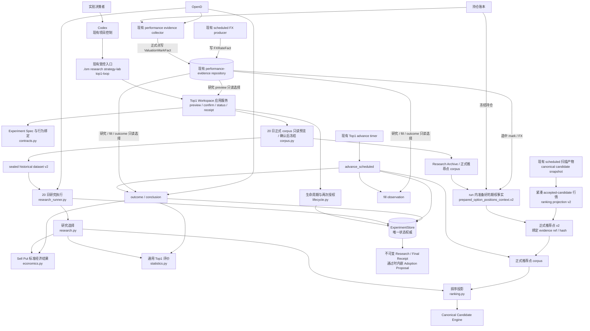
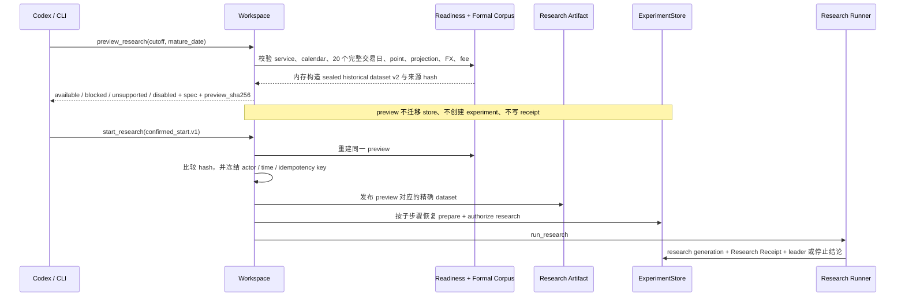
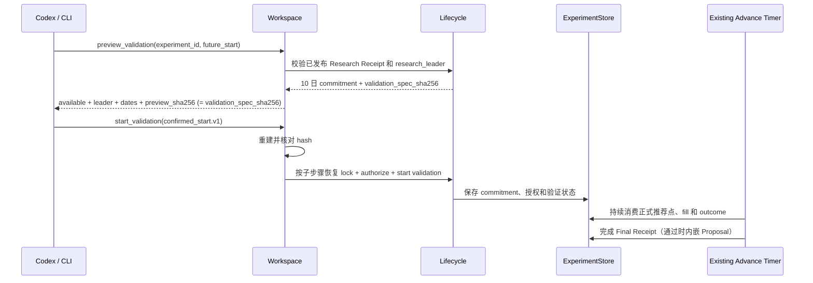

# Strategy Lab 统一策略实验平台系统设计

- **状态**：已落地的 MVP 技术合同；真实价值验收尚未完成
- **日期**：2026-08-25
- **产品依据**：`docs/STRATEGY_LAB_EXPERIMENT_PLATFORM_PRD.md`
- **当前实现参考**：`docs/STRATEGY_LAB_DESIGN.md`
- **首个 recipe**：HK / lx / Sell Put Top1

本文记录 PRD 已落地后的技术架构、模块 owner、函数合同和删除边界。运行行为以当前源码、测试、
配置验证器和回执为准；产品范围与验收门槛以 PRD 为准。本文不再作为尚未执行的 phase plan。

## 1. 设计结论

MVP 没有新建通用实验框架。实现复用 Sell Put Top1 状态机、ExperimentStore、Research Archive、
Shadow Replay、Candidate Engine 和定时推进链，并已补齐七块：

1. 在 ordinary scheduled tick 内复用现有行情 collector，把全部正式推荐点的未平仓期权 mark 写入
   现有 performance-evidence repository；取证失败只降级 Strategy Lab，不阻断扫描和通知；
2. 从现有 opening candidate snapshot 提取 accepted candidates 的紧凑逐点行情，和同一 run 内
   不可变的持仓、mark、开仓 FX 一起绑定到现有 recommendation point / ranking projection；
3. 对旧 run、Shadow Replay、performance evidence 和 Top1 corpus 做显式、幂等的历史事实迁移，
   只转换可验证事实，不用当前行情回填；
4. 在现有 `top1-loop` CLI 上补无副作用 preview、研究确认、隐藏验证确认和回执读取；
5. 增加首个 recipe 所需的期权市场集中度、CNY 经济结果和通用 Top1 配对评价合同；
6. 用一个可幂等重放的确认命令组合现有生命周期动作，不增加第二套确认状态；
7. 删除账户级实验 opt-in 及其 feature gate 链，保留运维安全停机开关。

本次不增加 MCP、Skill、飞书、多实验并行、通用公式 DSL、recipe 插件框架、新状态库、新 corpus
或新调度器。逐点 JSON 不增加压缩包或冷数据服务。Top1 仍是第一个 recipe，不升级为第二套平台。

## 2. 当前实现与运行缺口

| 维度 | 当前实现 | 运行缺口 |
|---|---|---|
| 操作入口 | 现有 `top1-loop` CLI 提供完整 preview、两次确认、status、receipt 和 scheduled advance | 尚未用真实 20 日与 10 日窗口完成端到端验收 |
| 生命周期 | 同一状态机拥有 prepare、authorize、research、leader、commitment、validation、outcome 和 terminal receipt | 无可信 leader 时必须停止，不能提前启动验证 |
| 排序实验 | Candidate Engine owner 内提供 0.002 / 0.004 / 0.006 收益带和期权市场集中度 profile | 需要真实研究回执证明 challenger 是否有价值 |
| 经济结果 | `economics.py` 使用已绑定 opening / terminal FX 输出 CNY 金额、资金分母、持有日和年化收益率 | FX 缺失或冲突继续 fail closed |
| 评价 | `statistics.py` 统一点配对、按日聚合、年化收益率和 CNY PnL 判断 | 不允许 Agent 或 recipe consumer 重算公式 |
| 账户开关 | feature 表、账户 opt-in、命令、reconcile 和 blocker 已删除；保留维护方安全停机 | 无 |
| Proposal | `candidate_for_adoption` 时在同一 Final Receipt 内嵌最小 Proposal | 真实隐藏验证完成前不会产生可采用建议 |
| 正式点行情 | scheduled tick 绑定 accepted candidate 行情、未平仓期权 mark、opening FX 和来源 hash | 需要持续积累连续完整交易日；任一缺点阻断该日 |
| 历史事实 | 只读 migration preview 区分 ready / gap，不补造历史；当前没有通用 apply | 只有首次出现真实 ready 点时才评审幂等 apply |

## 3. 技术架构



### 3.1 分层与依赖

```text
src/interfaces/cli/strategy_lab_top1.py
    -> src/application/strategy_lab/top1/workspace.py
        -> top1 contracts / lifecycle / research / validation
            -> domain Candidate Engine / concentration / performance facts
            -> infrastructure ExperimentStore / OpenD adapter
```

- CLI 只做参数解析、profile 路径解析和 JSON response 适配，不编排业务状态机。
- `workspace.py` 是新增的唯一应用编排面；它不保存状态，也不复制生命周期判断。
- `domain/domain/engine/candidate_engine.py` 继续独占排序行为。
- `ExperimentStore` 继续独占实验状态、授权、幂等事件和恢复信息。
- Research Archive、Shadow Replay、持仓账本、mark、FX 和 OpenD 继续拥有各自事实；实验只保存
  ref、hash 和形成回执所需的最小派生结果。

### 3.2 事实时点与不可变边界

OM 现有 prepared context owner 已以 `prepared_option_positions_context.v2` 作为新 run 的写入合同。
本功能复用同一 artifact family，只在 v2 payload 中增加可选的
`strategy_lab_option_market_evidence`；不增加 store 或 schema 版本。已有
`prepared_option_positions_context.v1` 保留为普通运行链的只读恢复合同；Strategy Lab 只接受包含完整
实验事实的 v2。

`run_tick_account_execution()` 只把具有 canonical `scheduled_scan_target_market` 的账户标记为正式点
取证账户。`prepare_option_positions_contexts()` 对这些账户使用现有 generation hash 做最小一致读
fence：

1. 冻结一个 `fence_now_ms`，读取 position snapshot A，计算 ledger generation hash 和各账户
   decision-state fingerprint；
2. 从 A 复用现有 performance adapter 构造当时全部未平仓期权，调用
   `collect_current_performance_evidence()`，通过现有 `import_envelope(apply=True)` 持久化
   `ValuationMarkFact`；同时沿用 `_persist_fx_evidence()` 写 `FXRateFact`；
3. 从同一 performance-evidence repository 的一次 read bundle 选择所需 mark / FX；
4. 使用同一 `fence_now_ms` 再读取 position snapshot B，重新计算相同 hash / fingerprint；
5. 只有 A、B 对目标账户一致时，才以第二次读取完成时间作为 `evidence_at_utc` 并把该账户的
   `strategy_lab_option_market_evidence.status` 写为 `ready`；不一致时该嵌套 evidence 写为
   `unavailable`，reason 为 `option_market_evidence_position_drift`，不在同一 tick 隐式重试或拼接两次
   结果。

mark collector 使用独立的现有 OpenD snapshot 调用，不在 MVP 中和 candidate scan 合并。该调用失败、
限流或返回不完整时只让嵌套 evidence `unavailable`，现有候选扫描、Daily Brief 和通知仍继续；只有
实际调用次数或延迟证据表明不可接受时，才考虑共享同一次 provider batch。

`PerformanceEvidenceSQLiteRepository.read_all()` 返回的单次 bundle 是 mark / FX 的选择快照；v2 只保存
每个 open contract 实际选中的最小 mark 和所需 FX，不复制整个 evidence 历史。evidence unavailable
不改变现有 option context 的 `context_status`，普通扫描继续使用其原有事实；只有 Strategy Lab strict
loader blocked。发布后，研究和正式点对开仓事实只读该不可变 artifact，不能再次读取
“当前”账本、mark 或 FX。

FX 事实不只有推荐点一个时点。MVP 复用现有 `FXRateFact`、
`PerformanceEvidenceSQLiteRepository` 和 `select_fx_rate()`，不新增 FX 存储、provider 或写入器：

- scheduled tick 现有 `_persist_fx_evidence()` 继续是 FX producer；正式点新增的 mark producer 只写
  同一 repository 的 `ValuationMarkFact`；
- 历史研究 `t0_assumed_fill` 的资金分母和开仓权利金使用推荐点已绑定的 opening FX；
- 隐藏验证只在首次 `bid >= sell_limit` 时，以该 observation 的
  `captured_at_utc` 选择 opening FX，并与 `observed_fill` 和 outcome job 同一事务持久化；
- 历史研究和隐藏验证的终态费用、到期标的损益都以现有
  `expiration_observation_start_ms()` 作为 terminal FX 选择时点；研究 preview 选择后纳入
  preview hash，confirmed start 重建 preview 的同一只读 bundle 中取出该 binding 并传给
  research close receipt，中间不再读 repository；隐藏验证与现有 expiry close fact
  同一事务持久化；
- 每个持久化绑定保存计算所需的最小事实字段及原 `FXRateFact` 的 canonical SHA-256，
  不保存整个 repository bundle，也不建新表；
- 恢复若已有 receipt、fill observation / job 或 expiry close fact，只读其已绑定 FX，
  不从 repository 重新选择。该时点的事实缺失、过期或冲突时 fail closed，
  不用最新汇率、推荐点汇率或单一汇率回算。

如果报价已 crossing 但 opening FX 不可选，fill observation 仍保存实际 bid / ask、
`crossing = true`、捕获时间和稳定 FX reason；只是 fill status 记为 `not_evaluable`、binding
为 `null` 且不创建 outcome job。同一 observation 不会在之后事后补汇率或改写为 fill。

每个 ready payload 必须包含：

- 同账户当时全部未平仓期权的 position / contract identity、underlying、side、`contracts_open`、
  multiplier 和 currency；
- 每个未平仓期权在 `evidence_at_utc` 可选中的 `ValuationMarkFact`，含 fact id、mark、effective / observed
  time、source、source id 和原始事实 hash；
- 上述 mark 和同账户本次扫描市场允许的候选币种换算为 CNY 所需的 `FXRateFact`，字段与
  选择证据完整；
- run id、account、account config hash、ledger generation hash、decision-state fingerprint、source observed
  time、application received time、payload hash 和 manifest hash。

`capture_scheduled_recommendation_point()` 是扫描后的唯一正式点组合入口。它先加载 canonical
candidate snapshot，再从同一 run / account 加载严格 v2 prepared receipt；candidate identity、sell limit 和
currency 只来自前者，持仓、mark 和 FX 只来自后者。`build_ranking_projection()` 从前者的 producer
accepted set 提取注册字段白名单，不复制完整 snapshot。`recommendation_point.v2` 增加
`option_market_evidence_ref`、`option_market_evidence_manifest_sha256` 和
`option_market_evidence_payload_sha256`，创建时校验三者与同一 run / account / config 一致。
时间顺序以已绑定 opening snapshot 的稳定 `sealed_at_utc` 为上界，要求 prepared receipt
`application_received_at_utc <= sealed_at_utc`；不使用扫描前已冻结的 scheduler `decision_at_utc`，也不在重试时
生成新的 capture 时间。v1、unavailable、hash 冲突或时间倒置只使正式点观察记录
`recommendation_point_gap`，不回写 prepared artifact，不改变已完成的扫描或通知。corpus 后续只按 point
绑定读取 artifact 并重建 ranking projection；账本在 point 形成后发生变化，不得改变该 point
的指标或 hash。

producer 沿用现有行为，在新 run 写 `prepared_option_positions_context.v2.json`；普通运行恢复按 v2、
v1 的固定顺序发现 manifest，通用 loader 接受两版并保持既有返回语义。Strategy Lab 在线正式点和
历史 preview 都只接受已有的完整 v2 evidence：preview 用 archive inventory 与 scheduler decision
识别点，再用同 run 的 recommendation point v2、opening snapshot 和 prepared context v2 重建当前
ranking projection。它不把分散的 v1、ledger/event snapshot 或 performance facts 拼装成新的历史
point；这些旧格式明确列为 gap，不改名、不重写旧文件，也不把 v1 冒充 v2。

历史窗口接受在线生成的严格 v2 point，或由显式迁移生成且通过同一 projection / point validator 的
等价 point。旧事实缺少 scheduler identity、来源 hash 或当前 recipe 声明的必需持仓、mark、FX、
candidate quote 字段时，返回稳定 gap reason；未被当前 recipe 使用的可选字段缺失只降低相应 capability，
不阻断本次迁移。不得用当前事实、开仓权利金或当天最后报价回填。实施前先对真实归档做 preview，
迁入可验证事实后再次计算 20 日覆盖；仍不足时先持续积累新正式点，W3 保持 blocked。

### 3.3 运维停机与账户开关的区别

`OM_STRATEGY_LAB_TOP1_AVAILABLE` 保留为维护方安全开关，不是用户或账户级产品功能：

- 关闭时，preview 返回 `disabled`，scheduled advance 返回 `disabled` 并停止新推进；
- 不写 `user_opt_in`，不按账户切换，不自动终止或改写已有实验；
- 恢复后仍需重新校验 spec、来源 hash、readiness 和确认状态；
- `strategy_lab_features`、`feature status` 和 disable reconcile 全部删除。

## 4. 核心执行流程

### 4.1 研究 preview 与第一次确认



研究 preview 同时返回 `research_spec_sha256` 和 `preview_sha256`。前者继续作为现有 lifecycle 的
研究 spec 身份；后者按 5.1 的固定公式把该 spec hash 与本次选择的精确 `source_bindings` 一起承诺。
确认执行前必须重建 preview 并核对 `preview_sha256`，随后 Workspace 把原 `research_spec_sha256`
传给 lifecycle；不增加独立 preview 表。

正式研究入口不再以 Shadow Replay 的“每日有一个点”作为 20 日完整性的依据。`corpus.py` 按市场
日历和 canonical expectation IDs 校验每个交易日的全部正式推荐点及 ranking projection v2；任一点
缺失即返回 blocked。preview 只在内存构造规范 dataset，不写文件；确认 hash 匹配后才发布同一字节。

### 4.2 验证 preview 与第二次确认



验证阶段直接令 `preview_sha256 = validation_spec_sha256`。现有 validation hash 已绑定已发布研究
终态、challenger、hidden commitment 和全部验证合同，不再增加一层重复来源 envelope。确认命令核对
后，Workspace 才把该 hash 和 commitment 传给 `lock_challenger()`；不能先写入 leader 和 commitment
再让用户确认。

### 4.3 确认后的失败恢复

`start_research` 和 `start_validation` 是对现有 durable action 的薄组合，不假装成一个数据库事务。
Workspace 为每个步骤从确认命令的 `idempotency_key` 派生稳定子 key，并把同一 `actor` 和
`confirmed_at_utc` 传给现有 store 方法。重试时先重建并核对同一 preview，再读取 artifact / store
状态，从第一个未完成步骤继续：

```text
research:   prepare -> publish frozen window -> authorize research -> run_research
validation: lock exact commitment -> authorize validation -> start validation
```

`prepare` 是研究的首个 durable step，先把完整 spec，以及包含 `confirmed_preview_sha256` 和精确
`source_bindings` 的现有 source provenance 写入 event / experiment；actor、确认时间和派生 key 仍由
现有 command event 保存。因此后续失败不会丢失命令身份，store 也能用 provenance hash 识别同一
idempotency key 下的 preview 漂移。已发布 artifact 使用现有 content-addressed / write-once 语义，相同
字节可安全复用。相同 idempotency key 但 actor、确认时间、preview hash 或其他 payload 不同，返回
`idempotency_conflict`；不得把新的当前时间写入重试。无需新增 command 表或恢复 worker。

## 5. 数据与合同设计

### 5.1 Research / Validation Preview

新增 `sell_put_top1_preview.v1`，研究和验证共用最小 envelope：

| 字段 | 含义 |
|---|---|
| `stage` | `research` 或 `validation` |
| `status` | `available`、`blocked`、`unsupported`、`disabled` |
| `reason_codes` | 稳定、可诊断的原因码 |
| `experiment_id` | 由 topic、market、account、recipe version 和 research source binding hash 确定性生成；不依赖包含自身的 spec hash，preview 不写 store |
| `experiment_spec` | `available` 时的规范化 spec；其他状态可为空 |
| `stage_spec_sha256` | research 时为 `research_spec_sha256`，validation 时为 `validation_spec_sha256`；继续交给现有 lifecycle 校验 |
| `preview_sha256` | research 时为下面定义的来源承诺 hash；validation 时直接等于 `validation_spec_sha256` |
| `source_bindings` | research 的 calendar、window、point、mark、opening FX、terminal FX、fee、outcome 精确稳定 ref / hash；validation 不另建重复绑定，展示信息来自已冻结的 research receipt、hidden commitment 和 validation spec |
| `production_impact` | 固定为不改配置、不交易、不通知、不自动采用 |
| `invalidated_by` | 会使确认失效的行为或事实版本 |

research `preview_sha256` 的输入固定为：

```text
canonical_sha256({
  "schema_version": "sell_put_top1_preview.v1",
  "stage": "research",
  "experiment_id": experiment_id,
  "stage_spec_sha256": stage_spec_sha256,
  "source_bindings": source_bindings
})
```

research `source_bindings` 在 hash 前按稳定标识排序并 exact-key 规范化；相同事实不得因读取顺序
产生不同 hash。会变化的 readiness 展示状态、采集时间、原因说明和 `production_impact` 不进入 hash。
terminal FX 选择变化必须改变 `source_bindings` 和 research `preview_sha256`。validation 所需的
producer / repository / selection contract 版本由 `validation_spec_sha256` 承诺，research receipt 与窗口
由 hidden commitment 承诺；未来尚不存在的验证事实不进入 preview。

四态判断顺序固定为：请求不在已实现范围时 `unsupported`；维护方停机时 `disabled`；能力已实现
但事实或运行条件不足时 `blocked`；全部通过时 `available`。只有 `available` 返回可确认 hash。

### 5.2 Confirmed Start Command v1

两次确认共用 `sell_put_top1_confirmed_start.v1`：

```text
schema_version
stage                    # research | validation
market / account
experiment_id
confirmed_preview_sha256
idempotency_key
actor
confirmed_at_utc
```

CLI 必须把完整命令作为 JSON 传给 Workspace；`confirmed_at_utc` 是用户确认发生的时间，不由每次调用
重新生成。Workspace exact-key 校验后重建 preview，并要求 `experiment_id`、scope 和 hash 全部一致。
匹配后把 preview 中的 `stage_spec_sha256` 传给现有 lifecycle。研究的精确 `source_bindings` 连同
`confirmed_preview_sha256` 写入现有 prepare provenance，并继续传给 research revision；validation
直接确认 `validation_spec_sha256`，其绑定由 validation spec 与 hidden commitment 持久化。研究与验证
使用不同 idempotency key；同一命令的重试必须逐字保持上述字段不变。

### 5.3 Prepared Option Market Evidence（复用 v2）

现有 `option_positions_context.json` payload 文件名以及
`prepared_option_positions_context.v2` manifest / schema 均保持不变；旧 v1 manifest 仅供普通运行恢复。
现有 v2 payload 以可选字段形式新增 `strategy_lab_option_market_evidence`：

```text
schema_version = option_market_evidence.v1
status = ready | unavailable
reason_code
evidence_at_utc
selection_policy_version
open_option_positions[]
valuation_mark_facts[]
fx_rate_facts[]
content_sha256
```

数组只保存 3.2 要求的规范化选中事实，不只保存汇率 scalar 或 `open_positions_min` 展示字段。producer
只对正式推荐点账户调用现有 collector 并持久化 mark，必须通过 A/B generation fence 后才发布。
非正式手工扫描和重试不新增 Strategy Lab point 事实。通用 loader exact-key 校验各自 v1/v2 schema；当
`require_option_market_evidence=True` 时，还校验 evidence content hash、run、account、config、A/B
generation、fingerprint；正式点组合再校验 `application_received_at_utc` 不晚于已绑定 opening snapshot 的
`sealed_at_utc`。研究归档和未来 corpus 只使用严格 receipt，不直接解析裸 JSON。prepared evidence
不包含 candidate identity、sell limit 或排序结果；这些字段仍由扫描后的 canonical candidate snapshot 拥有。

### 5.4 Experiment Spec v2

现有 `sell_put_top1_experiment_spec.v1` 升级为 v2，保留当前精确键校验并补充：

- recipe id / version、通用 Top1 评价合同版本；
- baseline `current_tie_break`；
- 三个 challenger：`option_market_concentration` + `near_return_threshold` 为
  `0.002` / `0.004` / `0.006`；
- `option_market_concentration_after.v1`、mark 选择、FX 选择、Sell Put 经济结果合同；
- `comparison_currency = CNY`、真实一张合约、`t0_assumed_fill` / `observed_fill`；
- 主指标为年化收益率差，CNY 收益金额为零下降不劣约束；
- 当前 accepted set 不可扩大，越界请求返回 `unsupported_universe_scope`。

不增加任意参数 map、公式字符串、Python / SQL、表达式执行器或动态 schema。

### 5.5 Ranking Projection v2

每个 candidate 沿用现有 flat projection，只补尚未保存的注册字段：

```text
bid / ask / bid_volume / ask_volume / last
implied_volatility / delta / gamma / theta / vega / rho
volume / spot / quote_effective_at_utc / quote_observed_at_utc / quote_status
option_market_concentration_after
option_market_value_cny
option_market_concentration_metric_version
option_market_evidence_refs
```

合约身份、option type、strike、expiration、multiplier、currency、`sell_limit` 和 Open Interest 继续使用
projection 已有 flat 字段，不再套一层 market-facts 对象。白名单只包含 provider 实际返回且 opening
snapshot 已经冻结的 scalar；不存在的字段显式为 `null`，不能推断。recipe version 固定其 required field
set：required 字段缺失时 point 不可评价，其他白名单字段缺失只将对应 capability 标为 unavailable。
DTE 由 expiration 和 point time、Mid 由 Bid / Ask、spread 和收益率 / 集中度由版本化函数重算，不重复保存。

projection 仍只包含生产 accepted set，Candidate Engine 只重排同一集合。正式点以 canonical candidate
snapshot 的 sell limit / currency 和 prepared receipt 的冻结 FX 计算每个 candidate
`option_market_value_cny`，再与同一 prepared receipt 的持仓 mark 合并计算集中度。完整原始 payload 不复制进
projection；仅保存选中事实的稳定标识、来源 ref、时间和 hash。缺失、过期、冲突或不合法时
整个推荐点不可评价，不能回退到 `symbol_concentration_after`、开仓权利金、接货金额或零。

逐点 projection 继续使用可直接读取的 canonical JSON。基于真实 2026-08-21 样本，11 个 accepted
candidate 的紧凑切片约 7 KiB；只计算 candidate slice、尚未包含 prepared position binding 时，按
HK / lx 每日 12 点估算约 22 MiB / 年。该数字是容量基线，不是业务合同。MVP 不增加 gzip、压缩包
分区或解压缓存；若实测冷数据增长显著超过该量级，再在原 owner 的保留策略中增加冷归档。

### 5.6 标准经济结果 v2

`fx_rate_binding.v1` 不是新 FX 事实，而是对现有 repository 中已选中 `FXRateFact` 的最小、
不可变投影：

```text
schema_version
selected_at_ms
fact_id
base_currency / quote_currency / rate / rate_kind
effective_at_ms / observed_at_ms
source / source_id / revision / supersedes_fact_id
source_fact_sha256
```

`source_fact_sha256` 是选中 `FXRateFact.normalized_payload(include_fact_id=True)` 的 canonical SHA-256。
CNY 原币分项的 binding 为 `null`，并按 1:1 计入。研究 close receipt、fill observation / outcome
job 和 expiry close fact 直接内嵌该小投影；这些只是已有实验证据的绑定，不是
第二份 FX 仓库。

三个 durable owner 的 v2 字段固定为：

- research close receipt：在原 close 字段上增加 `currency`、`terminal_at_ms` 和
  `terminal_fx_binding`；
- fill observation / outcome job：在原报价 / candidate 字段上增加 `opening_at_ms` 和
  `opening_fx_binding`；
- expiry close fact：升级 `EXPIRY_OUTCOME_CONTRACT_VERSION`，在原 close 字段上增加
  `currency`、`terminal_at_ms` 和 `terminal_fx_binding`。

上述 JSON 与其现有 SHA-256 一起持久化，因此 job / fact / revision 级恢复可直接校验字节；
Final Receipt 通过每个 arm 的 standard economic result 携带两个 binding ref 和原币分项。

每个 arm 输出：

```text
status
reason_code
fill_status
contract_identity
holding_calendar_days
return_capital_basis_native
return_capital_basis_cny
opening_net_premium_native
opening_net_premium_cny
terminal_fee_native
terminal_fee_cny
expiry_underlier_pnl_native
expiry_underlier_pnl_cny
economic_pnl_cny
annualized_return
opening_fx_evidence_ref
terminal_fx_evidence_ref
```

资金分母和开仓权利金只用 opening binding；终态费用和到期标的损益只用 terminal
binding。经济函数只消费这两个已验证 binding 并保持纯函数，不打开 repository、不选择
汇率、不修补缺失事实。无 observed fill 仍按 PRD 输出 `holding_calendar_days = null`、
`economic_pnl_cny = 0`、`annualized_return = 0`。需要换算但 opening 或 terminal binding 缺失时，
arm 为不可评价；不得解释为零或使用当前汇率。

### 5.7 通用 Top1 评价结果 v2

评价输入不再包含 recipe 特定的 concentration gate，而是包含：

```text
recommendation_point_id
trading_date
baseline_candidate_id / challenger_candidate_id
baseline_economic_result / challenger_economic_result
hard_risk_status
frozen_safety_results
```

输出至少包含：

```text
mean_daily_annualized_return_delta
mean_daily_pnl_delta_cny
mean_return_capital_basis_delta_cny
sample_std
standard_error
one_sided_lower_bound
worst_tail_mean
top1_change_count
decision / reason_codes
```

统计继续复用当前按日平均、Student-t 单侧下界和最差 20% 计算；判断顺序严格执行 PRD 11.4。
期权市场集中度仅用于首个 recipe 的选择和解释，不作为通用 evaluator 的硬门槛。

### 5.8 Strategy Adoption Proposal v1

Final Receipt 增加 `adoption_proposal`，非通过结论固定为 `null`；仅当结论为
`candidate_for_adoption` 时内嵌 `sell_put_top1_adoption_proposal.v1`：

```text
schema_version
experiment_id
behavior_binding_sha256
market / account
adoption_mode
recommended_change
evidence_bindings
safety_invariants
pre_adoption_checks
observation_plan
rollback_conditions
authority
```

MVP seed 的排序 profile 和 0.002 / 0.004 / 0.006 阈值目前没有 canonical runtime config key，因此
`adoption_mode` 固定为 `engineering_required`，`recommended_change.config_mapping = null`。不得输出
`config_only`；未来只有配置 validator 和受控 preview 已公开精确 key 后，才升级 proposal schema。
`authority` 固定声明 proposal 只读、不写配置、不发布、不部署、不启用。

`evidence_bindings` 只引用 Final Receipt 已包含的 spec、research terminal、hidden commitment、行为版本
和评价结果 hash；不引用 enclosing receipt 自身，因此没有循环 hash。`build_completed_receipt_request()`
在一次规范化渲染前决定 `adoption_proposal` 为对象或 `null`，现有 `experiment_receipt_requested` event
继续只保存一份 receipt projection。

`recover_terminal_projection()` 沿用现有单 artifact 发布、readback 和
`mark_projection_published()` 流程。`read_public_receipt()` 校验已发布 Final Receipt 的 bytes / hash 后
直接返回其中的可选 Proposal。Proposal 不再拥有独立 ref、pending 状态、发布恢复或 store API；未来
只有出现独立下载、保留或下游消费需求时才拆成单独 artifact。

## 6. 函数级设计

### 6.1 原样复用

| 文件 | 函数 | 复用理由 |
|---|---|---|
| `src/application/research/archive.py` | `archive_inventory()`、`archive_verify()`、`archive_build_datasets()` | 已拥有远端事实归档、完整性验证和 Shadow Replay dataset 构建 |
| `src/application/shadow_replay/capture.py` | `build_shadow_replay_dataset()` | 已生成候选研究数据，不再建第二套历史采集 |
| `src/application/strategy_lab/evidence.py` | `load_strategy_lab_dataset()` | 已校验 Shadow Replay dataset 和候选 snapshot |
| `src/application/performance/adapters.py` | `ledger_performance_inputs_from_rows()`、`load_option_valuation_inputs()` | 从 prepared fence 已冻结的 ledger rows 构造未平仓期权，不增加第二次 ledger authority read |
| `src/application/performance/evidence_collection.py` | `collect_current_performance_evidence()` | 已按真实合约抓取当前 mark 并生成 `ValuationMarkFact`；正式点只负责调用和持久化，不复制 collector |
| `domain/domain/performance/models.py` | `parse_evidence_envelope()`、`select_valuation_mark()`、`select_fx_rate()`、`normalize_currency()`、`to_decimal()` | 已有 mark / FX value object、冲突和时效选择规则 |
| `src/application/ledger/api.py` | `open_performance_evidence_repository()` | 从 canonical option ledger 打开同一 SQLite 中的现有 performance-evidence repository |
| `src/infrastructure/performance_evidence_sqlite.py` | `PerformanceEvidenceSQLiteRepository.import_envelope()`、`read_all()` | 幂等写入和读取不可变 mark / FX facts；不建新事实表或 repository |
| `src/application/prepared_option_positions_context.py` | `_persist_fx_evidence()` | scheduled tick 继续作为唯一 FXRateFact writer；研究和验证不增加 writer |
| `src/application/strategy_lab/top1/capability_receipts.py` | `read_top1_capability_receipt()`、`capability_facts_from_receipt()`、`load_account_fee_plan_receipt()` | 复用 OpenD、费用与 outcome 能力证明 |
| `src/application/strategy_lab/top1/corpus.py` | `read_bound_market_calendar_snapshot()`、`read_market_calendar_binding()`、`read_validation_day_source()`、`read_validation_point_source()`、`read_corpus_status()` | 继续作为日历、正式推荐点和 20 日完整性读取权威 |
| `src/application/strategy_lab/top1/research_artifacts.py` | `load_materialized_research_input()`、`load_recorded_research_revision()` | 已提供 hash 绑定的研究输入和 revision 读取；允许 preview 复用同一内存 dataset |
| `src/application/strategy_lab/top1/lifecycle.py` | `build_hidden_window_commitment()`、`validate_hidden_window_commitment()`、`read_active_experiment_ids()`、`read_advance_context()`、`recover_account_terminal_projections()` | 合同与恢复语义已满足 MVP；只由新应用服务组合 |
| `src/application/tick_notification_flow.py` | `_observe_recommendation_points_best_effort()`、`_observe_recommendation_points()` | 继续调用现有正式点入口；point gap 只审计降级，不影响扫描或通知 |
| `src/application/strategy_lab/top1/terminal_projection.py` | `publish_exact_text()` | 已提供不可变写入、同字节幂等和冲突检测 |
| `src/infrastructure/strategy_lab/experiment_store.py` | experiment、generation、authorize、event、receipt 的现有读写方法，以及 `commit_validation_observation_batch()`、`commit_outcome_batch()` | 继续作为唯一状态权威、幂等 owner 和 validation / outcome 原子提交边界 |

### 6.2 已更新的现有函数

| 文件 | 函数 | 更新内容 |
|---|---|---|
| `domain/domain/engine/candidate_engine.py` | `_rank_return_bands()`、`rank_candidate_rows()` | 增加显式 `near_return_threshold`；新增 `option_market_concentration` profile，读取 `option_market_concentration_after`；默认 `current_tie_break` 行为不变 |
| `src/application/opend_market_snapshot_fetching.py` | `SNAPSHOT_KEEP_COLUMNS`、`keep_snapshot_record_columns()` | 在现有白名单补齐 provider 已返回的 gamma / theta / vega / rho，并继续丢弃未注册 raw 字段；不保存完整 snapshot row |
| `src/application/prepared_option_positions_context.py` | `prepare_option_positions_contexts()`、`_validate_option_context_account()`、`_load_prepared_option_positions_context_artifacts()`、`load_prepared_option_positions_context()`、`load_prepared_option_positions_context_receipt()` | producer 对正式点账户从 fence A rows 构造真实未平仓合约，调用现有 collector 并用 `import_envelope()` 持久化 mark，再从同一 repository bundle 选择 mark / FX；沿用 v2 A/B fence 和严格 loader；失败只降级嵌套 evidence，不阻断普通 option context |
| `src/application/tick_account_execution.py` | `run_tick_account_execution()` | 从已提交 scheduler decision 传入正式点账户集合；新 run 沿用 canonical v2；prefetch recovery 通过 owner helper 按 v2 后 v1 找 manifest，旧 run 继续完成普通账户 pipeline |
| `src/application/recommendation_point.py` | `capture_scheduled_recommendation_point()`、`build_recommendation_point()`、`validate_recommendation_point()`、`point_binding_from_recommendation_point()` | 升级 point v2；现有 capture 入口先加载 canonical candidate bundle，再加载同 run/account 严格 v2 prepared receipt；build 仅组合两个 owner 并绑定 evidence ref / manifest / payload hash；同一正式推荐决策的 point ID 不随 v1/v2 信封版本变化 |
| `src/application/runtime_portfolio_snapshot.py` | `_validate_prepared_option_reference()`、`build_runtime_portfolio_snapshot()`、`validate_replay_bundle()` | 普通 runtime snapshot / replay 兼容绑定 v1/v2 owner receipt；Strategy Lab 不从该兼容面放行 v1 |
| `src/application/strategy_lab/top1/contracts.py` | `validate_experiment_spec()`、`build_current_behavior_binding()`、`build_research_spec_sha256()`、`build_validation_spec_sha256()` | 升级 v2 字段、变体、指标、FX、research close receipt 和 expiry outcome 合同版本；保持 exact-key 和 fail-closed 校验 |
| `src/application/strategy_lab/top1/ranking.py` | `build_ranking_projection()`、`validate_ranking_projection()`、`rerank_recommendation_point()` | 升级 projection v2；从 accepted candidate facts 复制 5.5 的固定紧凑白名单，接受已验证的期权市场集中度及事实引用；将冻结收益阈值传入 Candidate Engine |
| `src/application/strategy_lab/top1/research_window.py` | `_normalize_point()`、`build_research_window()`、`load_research_window()` | 保留给历史迁移和兼容读取；正式 Workspace 不再通过该 bridge 判断 20 日完整性 |
| `src/application/strategy_lab/top1/corpus.py` | `seal_day_expectation()`、`seal_committed_day_expectation()`、`capture_recommendation_point()`、`preview_research_dataset()`、`freeze_research_dataset()` | 删除账户 feature gate；按 point v2 绑定加载 prepared context receipt 并生成 projection；完整日按日历严格校验全部正式点；preview 零写入构造 v2 dataset，确认后才发布精确字节；禁止读取 capture 时的当前账本 / mark / FX |
| `src/application/strategy_lab/top1/research.py` | `required_research_close_keys()`、`evaluate_research()`、`build_internal_research_revision()`、`validate_internal_research_revision()` | 使用标准 CNY 经济结果和新 evaluator；close receipt v2 绑定 terminal FX；leader 顺序加入 CNY PnL；恢复只读已记录 revision |
| `src/application/strategy_lab/top1/research_runner.py` | `_close_receipts()`、`run_research()` | 删除账户 feature 检查；只接收 confirmed preview 已绑定的 terminal FX，写入 close receipt v2 / revision，不打开 repository；保留 quota、OpenD close 和幂等恢复 |
| `src/application/strategy_lab/top1/validation.py` | `_challenger_profile()`、`_arm()`、`consume_validation_point()`、`record_validation_day_gap()` | challenger 同时读取 profile 与冻结阈值；arm 保存标准经济输入及 FX/metric refs；删除集中度作为硬风险证据的判断 |
| `src/application/strategy_lab/top1/fill_observation.py` | `_job()`、`observe_active_contracts()` | 保留首次 `bid >= sell_limit` 语义；只对 crossing arm 以 observation 时点选 opening FX，同一事务写入 observation 和 outcome job；FX 缺失时仍审计 `crossing=true`，但 arm `not_evaluable` 且不建 job |
| `src/application/strategy_lab/top1/outcome.py` | `_close_result()`、`settle_due_outcomes()`、`_statistics_rows()`、`conclude_validation()` | 已有 expiry fact 时只读其 close + terminal FX binding；首次成功时同一事务写入 expiry close fact 和 results；生成 CNY 结果并调用新 evaluator |
| `src/application/strategy_lab/top1/readiness.py` | `build_top1_readiness()` | 删除 `feature_status` 参数与 feature blocker；分开报告 prepared opening-FX coverage、existing repository schema / scheduled producer readiness、research terminal-FX coverage 和 validation runtime readiness |
| `src/application/strategy_lab/top1/lifecycle.py` | prepare / authorize / start / lock / terminate / public status / `read_published_research_leader()` / `read_public_receipt()` 路径 | 用仅检查维护方停机的 `_require_service_available()` 替换账户 gate；研究 leader 的 published revision 读取和绑定校验由 lifecycle 统一拥有；`lock_challenger()` 校验已确认的 `validation_spec_sha256`；receipt 只返回已 published 且内部校验通过的 projection group |
| `src/application/strategy_lab/top1/advance.py` | `advance_scheduled()` | 删除 opt-in reconcile；维护方停机时无副作用返回 `disabled`；为每次 fill / outcome step 提供 existing repository 的单次只读 evidence bundle，不缓存跨 step 的“当前汇率” |
| `src/application/strategy_lab/top1/terminal_projection.py` | `build_generation_terminal_request()`、`build_aborted_receipt_request()`、`build_completed_receipt_request()`、`recover_terminal_projection()` | completed receipt 在同一 payload 内生成可选 Proposal；继续使用现有单 artifact 发布和 readback |
| `src/infrastructure/strategy_lab/experiment_store.py` | `migrate()`、schema 校验、`terminate()`、`_request_receipt()`、`pending_projections()`、`mark_projection_published()`、public row codec | 升级 schema v4；v3 有不兼容 active experiment 时拒绝 cutover；删除 feature 表和行为，新终止写入不再产生 feature 语义；receipt 继续使用现有单 projection 状态 |
| `src/interfaces/cli/strategy_lab_top1.py` | `add_top1_commands()`、`handle_top1_command()`、`_readiness()` | 删除 `feature status`；增加 history migrate preview、research preview/start、validation preview/start 和 receipt；通过现有 ledger API 打开 performance evidence 并注入 loader；CLI 不选 mark / FX、不编排业务状态；首次出现 ready 历史点时再增加 apply |

### 6.3 已新增函数

| 文件 | 函数 | 职责 |
|---|---|---|
| `src/application/strategy_lab/top1/workspace.py` | `preview_sell_put_top1_research()` | 只读组合固定 recipe、readiness、正式 corpus 20 日 v2 dataset 和 research spec；从现有 repository 的一个 bundle 选择全部 terminal FX，返回独立的 research spec hash 与含精确来源绑定的 preview hash |
| 同上 | `start_confirmed_research()` | exact-key 校验 confirmed command，用一个 evidence bundle 重建 preview、核对 scope / hash，发布该 preview 的精确 dataset，把 research spec hash 传给 lifecycle，并把确切 terminal FX bindings 传给 `run_research()`；以稳定子 key 恢复其余 durable step |
| 同上 | `preview_sell_put_top1_validation()` | 只读校验已发布研究 leader，构造未来 10 日 commitment 和 `validation_spec_sha256`；该 hash 同时作为确认用的 `preview_sha256` |
| 同上 | `start_confirmed_validation()` | exact-key 校验 confirmed command，重建 preview，把 validation spec hash 与 commitment 传给 lifecycle，并以稳定子 key 恢复 lock、authorize 和 start validation |
| `src/application/strategy_lab/top1/contracts.py` | `build_sell_put_top1_research_spec()` | 只生成当前固定 HK / lx / Sell Put Top1 recipe 的 v2 research spec |
| 同上 | `build_sell_put_top1_validation_spec()` | 在同一 research spec 上补冻结的 validation、fill、timer 和统计合同 |
| 同上 | `build_sell_put_top1_research_preview_sha256()` | 按 5.1 的唯一字段集合计算 research 来源承诺 hash；validation 直接复用现有 spec hash |
| 同上 | `validate_confirmed_start_command()` | exact-key 校验 confirmed command，并返回供 Workspace 派生子 key 的规范化字段 |
| `src/application/prepared_option_positions_context.py` | `find_prepared_option_positions_manifest()` | 在单个 run/account state 目录内按 v2 后 v1 返回恢复 manifest；不扫描其他 run |
| 同上 | `build_option_market_evidence_payload()` | 只从 A/B fence 之间取得的 open positions 和单次 evidence bundle 构造最小 `option_market_evidence.v1`；不自行读取当前状态 |
| `src/application/strategy_lab/top1/corpus.py` | `preview_archived_recommendation_point_migration()` | 零写入扫描已归档 scheduled run，列出能通过当前 point / projection validator 的 ready 点，并为不可转换点返回稳定 gap reason；不预建无实际输入的 apply 分支 |
| `domain/domain/short_vol_assessment.py` | `calculate_option_market_concentration_after()` | 使用同账户全部未平仓期权、事实时点 mark 与 FX 计算 v1 指标并返回证据选择结果 |
| `src/application/strategy_lab/top1/economics.py` | `build_fx_rate_binding()`、`validate_fx_rate_binding()`、`calculate_sell_put_top1_economic_result()` | 把已选中 `FXRateFact` 规范化为唯一 `fx_rate_binding.v1`；经济函数只消费已绑定 opening / terminal 事实并生成 v2 CNY 结果 |
| `src/application/strategy_lab/top1/statistics.py` | `evaluate_top1_paired_daily_results()` | 统一执行点配对、按日聚合、Student-t、尾部、PnL 不劣和确定性结论 |
| `src/application/strategy_lab/top1/terminal_projection.py` | `build_top1_adoption_proposal()` | 仅在 `candidate_for_adoption` 时构造 Final Receipt 内的最小只读 Proposal 对象；不渲染或发布第二个 artifact |
| `src/infrastructure/strategy_lab/experiment_store.py` | `_migrate_v3_to_v4()` | 在同一迁移事务内按现有 `active_experiments()` 谓词拒绝不兼容 active v3 状态，删除 feature 表并升级 metadata；不重建 experiment 表 |

`workspace.py` 是本次唯一新增应用模块。历史迁移只在现有 `corpus.py` 增加一个函数。其他新增函数
进入已有 owner，不创建 recipe registry、metric registry、repository interface 或 service factory。

### 6.4 已删除函数与状态

| 文件 | 删除项 | 原因 |
|---|---|---|
| `src/infrastructure/strategy_lab/experiment_store.py` | `feature()`、`set_feature()`、`strategy_lab_features`、`user_opt_in` | PRD 已删除账户级实验功能管理 |
| `src/application/strategy_lab/top1/lifecycle.py` | `effective_feature_status()`、`set_account_opt_in()`、`reconcile_disabled_experiments()`、旧 `_require_effective()` | 不保留账户 feature alias；维护方安全检查由新语义函数承担 |
| `src/application/strategy_lab/top1/corpus.py` | `_feature_enabled()` 及 `feature_disabled` 分支 | corpus 不再依赖账户 opt-in |
| `src/interfaces/cli/strategy_lab_top1.py` | `feature status` 命令与 response | 产品不再暴露实验功能开关 |
| `src/application/strategy_lab/top1/readiness.py` | `strategy_lab_top1_feature_disabled` blocker 和 `facts.feature` | readiness 只报告维护方停机和真实运行缺口 |
| `src/application/strategy_lab/top1/terminal_projection.py` | `experimental_feature_disabled` 终止分支和新 receipt 的 `disabled_scope` 字段 | 停机不再自动终止实验；历史 receipt 仍按原字节读取 |
| `src/application/strategy_lab/top1/economics.py` | `calculate_expiry_efficiency()` | 被 CNY 标准经济结果完整替代，不保留兼容别名 |
| `src/application/strategy_lab/top1/statistics.py` | `summarize_paired_daily_deltas()` | 被双指标通用 evaluator 完整替代，不保留双 owner |
| tests / docs | 只验证 opt-in、feature reconcile、旧 concentration gate 或旧 efficiency 字段的内容 | 删除已失效行为，保留生命周期、证据和恢复测试 |

### 6.5 本次明确不删除

以下通用旧 Strategy Lab 函数已有 CLI、定时服务、Research Archive 或测试调用，不能只因命名重叠
就在 MVP 前删除：

```text
run_strategy_lab_update
run_strategy_lab_experiment
generate_strategy_lab_hypotheses
build_strategy_lab_proposal
build_strategy_lab_llm_context
run_combo_yield_group_experiment
```

本次停止扩展这些入口。只有 Top1 闭环可替代实际调用方、服务定义完成退役且归档能力不受影响后，
再按真实调用图删除仅服务旧入口的编排与展示代码；Research Archive 和 Shadow Replay 不在删除范围。

## 7. 存储与历史事实迁移

### 7.1 ExperimentStore schema

ExperimentStore 从 v3 升级到 v4：

1. 以现有 v3 deep validation 为迁移前置；
2. 在同一个 `BEGIN IMMEDIATE` 事务内查询 `strategy_lab_experiments`。只要存在
   `terminal_mode IS NULL AND phase != 'concluded'` 的 active row，就抛出
   `migration_active_experiments` 并回滚。该 gate 是因为 active v1 contract 不能由 v2 evaluator 静默
   续跑，不是为了表重建；谓词与现有 `active_experiments()` 一致，不从 infrastructure 反向调用
   application lifecycle；
3. 直接删除 `strategy_lab_features`，更新 required tables 和 schema version metadata；不重建
   `strategy_lab_experiments`；
4. experiment 表中的遗留 `disabled_scope` 列保留，只为旧 row codec 和历史读取；新代码不再接收或写入
   feature disable，普通人工终止写入 `NULL`。它不是产品开关、兼容入口或新状态 owner；
5. 保留历史 event 和已发布 JSON receipt 原字节。已终态但 receipt 尚未 published 的 experiment 允许
   迁移，并由现有单 artifact 恢复链继续发布；
6. active gate 拒绝时 schema version、feature 表和所有行保持 v3，`schema_state()` 继续返回
   `migration_required`；结构损坏等其他迁移失败回滚整个 transaction 并返回 `schema_unsupported`，不以
   部分 schema 继续运行。

不新增 preview 表、capability 表、metric 表、proposal 表、command 表或另一份 experiment store。
Preview 在确认时重算；确认恢复复用现有 event / authorization / experiment 状态；可选 Proposal 是
Final Receipt 的内嵌字段。store 继续以现有一个 receipt pending / published 边界决定 experiment 是否
concluded，不增加 Proposal persistence 或恢复状态。来源大对象继续由原 owner 保存。

FX binding 也不增加表或 artifact family。研究使用现有 research revision 内的 close receipts；
隐藏验证使用现有 `observation_json`、`job_json` 和 `fact_json`。fill observation、fill status 和
outcome job 由 `commit_validation_observation_batch()` 原子提交；expiry close + terminal FX 与 outcome
result 由 `commit_outcome_batch()` 原子提交。实施必须在现有 4096-byte JSON 上限内验证最大
binding，不为此提高全局上限；超限时删减非 PRD 必需字段，不另建大对象存储。

### 7.2 历史正式点迁移

历史迁移审计扩展现有 corpus owner，不属于 ExperimentStore schema migration，也不在进程启动时自动
执行。操作员运行零写入 preview，确认扫描范围、ready point、重复 point、gap reason 和预计磁盘增量。
当 `ready = 0` 时流程在 preview 结束，不增加 apply 命令、状态或回执；首次出现 `ready > 0` 时，apply
才成为进入 W3 前必须补齐并再次评审的最小实现。

迁移按 `market / account / scheduled_scan_target_market` 形成稳定 point identity。archive inventory 与
scheduler decision 只用于发现和解释 point；`ready` 必须来自同 run 中已经存在且能共同通过当前
validator 的 recommendation point v2、opening snapshot 与 prepared context v2。当前 preview 不跨 owner
拼装缺失字段，也不从 performance-evidence repository 或 Shadow Replay 合成新的历史 point。后续按需
实现的 apply 必须使用 content hash 和现有唯一键幂等：相同内容记为 idempotent；相同 point identity
但内容不同记为 conflict，禁止覆盖。源 run、v1 / v2 manifest、snapshot、SQLite facts 和历史 receipt
均不改写、不删除。

迁移不调用 OpenD 获取历史 option chain 或精确 Bid / Ask，不用当前账本、当前 mark、当天最后报价、
开仓权利金或当前 FX 填补缺口。缺少当前 recipe required field 的点返回具体 gap reason；只缺少可选
字段时保留 point 并标记相应 capability unavailable。完整日当前必须具有 12 个正式点，半日市按交易
日历和 scheduler expectation 校验。preview 必须完整列出 ready / idempotent / conflict / gap；若后续
存在 apply，其报告再列 applied / idempotent / conflict / gap。研究窗口始终对缺日 fail closed。

## 8. 失败与状态映射

| 场景 | Preview / 运行结果 | 稳定原因示例 |
|---|---|---|
| 请求改变 accepted candidate universe | `unsupported` | `unsupported_universe_scope` |
| 请求未实现的 recipe、指标或评价合同 | `unsupported` | `unsupported_recipe` / `unsupported_metric_contract` |
| 维护方安全开关关闭 | `disabled` | `strategy_lab_service_disabled` |
| v3 store 仍有非终态实验 | 迁移拒绝，v3 原样保留 | `migration_active_experiments` |
| 正式点 mark collector 失败或报价不完整 | 普通扫描 / 通知继续；prepared 嵌套 evidence unavailable；该 point gap | `option_market_evidence_mark_missing` / 现有 collector diagnostic |
| 历史 point 已存在且内容相同 | `idempotent` | `historical_point_already_imported` |
| 历史 point identity 相同但内容不同 | 该 point 拒绝覆盖，其他无冲突 point 可继续 | `historical_point_conflict` |
| 历史 artifact 缺少当前 recipe required field | 记录 gap，不写 point | `historical_point_evidence_missing` 及具体子原因 |
| 历史 artifact 只缺少当前 recipe 未使用的可选字段 | 写入 point，相应 capability unavailable | 字段级 capability reason |
| 20 日任一日无完整正式来源 | `blocked` | `research_window_coverage_missing` |
| 历史持仓、mark 或 FX 不可验证 | `blocked` | `option_market_evidence_missing` |
| 研究所需 expiration boundary 无 terminal FX | `blocked` | `terminal_fx_evidence_missing` / `terminal_fx_evidence_conflict` |
| 在线 prepared context 仍为 v1，或历史 v1 无法迁移为等价 point，或 run / point hash 不一致 | `blocked` | `option_market_evidence_contract_missing` / `option_market_evidence_conflict` |
| evidence 捕获期间 position generation 变化 | 普通 prepared context 保持可用；嵌套 evidence `unavailable`；实验 preview `blocked` | `option_market_evidence_position_drift` |
| OpenD quota、费用或到期 close 能力不足 | `blocked` | 复用现有 capability reason code |
| 确认 hash 与重建结果不一致 | 拒绝写入 | `preview_hash_changed` |
| 相同 idempotency key 的确认命令字段变化 | 拒绝写入 | `idempotency_conflict` |
| 研究无胜者 | Research Receipt 后结束 | `no_research_winner` |
| 研究或验证数据缺失 | `insufficient_evidence` | evaluator 返回具体 reason codes |
| observed fill 时 opening FX 缺失、过期或冲突 | 保留报价与 `crossing=true`；该 arm `not_evaluable`，不建 outcome job | `opening_fx_evidence_missing` / `opening_fx_evidence_conflict` |
| expiry close 已成熟但 terminal FX 暂未可用 | deadline 前保持 pending；deadline 后 `outcome_unavailable` | `terminal_fx_evidence_retryable` / `terminal_fx_evidence_missing` |
| 任一硬风控违规 | `keep_baseline` | `hard_risk_violation` |
| 维护方在验证中停机 | 暂停推进，不终止实验 | `strategy_lab_service_disabled` |

## 9. 测试与验收

### 9.1 更新现有测试

- `test_candidate_engine.py`：默认排序零回归；新 profile 的 0.002 / 0.004 / 0.006 收益带。
- `test_performance_evidence_collection.py`：真实合约 snapshot 行保留 Bid / Ask、盘口量、Last、IV、
  delta / gamma / theta / vega / rho、Open Interest、成交量和时间字段；未知 raw 字段仍被丢弃。
- `test_prepared_option_positions_context.py`：新 producer 只写 v2；普通 loader 兼容 v1/v2，严格 flag 拒绝
  v1；只有正式点账户调用现有 collector 并通过现有 repository 幂等写 mark；v2 只保存 fence 内
  同一 run/account 的 open option 和选中 mark/FX，不包含 candidate sell limit；collector 失败和 A/B
  generation 漂移只把嵌套 evidence 标为 unavailable，普通 option context 仍可加载。
- `test_tick_account_execution_barrier.py`、`test_account_run.py`：只把 canonical scheduled target 对应账户
  标记为正式点取证；手工或非正式扫描不新增 Strategy Lab point evidence；新代码可用既有 v1 manifest
  恢复普通 pipeline，同一 run 同时存在两版时固定选择 v2，不跨 run 搜索。
- `test_runtime_portfolio_snapshot.py`：普通 snapshot/replay 对 v1/v2 owner receipt 均可验证，且不会把 v1
  暴露成 Strategy Lab evidence。
- `test_recommendation_point.py`：现有 scheduled capture 用 canonical candidate sell limit / currency 与严格 v2
  prepared receipt 构建 point，精确绑定 ref / manifest / payload hash；v1、unavailable 或 hash 冲突
  fail closed；prepared `application_received_at_utc` 晚于 opening `sealed_at_utc` 时拒绝，重试不生成新时间；
  point 形成后修改当前账本或 evidence repository，重建结果仍完全相同；projection 只保留 5.5 的
  accepted-candidate 紧凑字段，不复制完整 opening snapshot。
- `test_daily_decision_brief_notification_flow.py`：正式点 evidence 不可用时只记录
  `recommendation_point_gap`，既有扫描结果和通知交付不受影响。
- `test_strategy_lab_top1.py`：ranking projection v2、candidate market facts、指标证据和 accepted set 不变；
  expiration / point time 可重算 DTE，Bid / Ask 可重算 Mid，且 fixture 不出现未注册 raw 字段。
- `test_strategy_lab_top1_corpus.py`：历史迁移 preview 零写入，稳定报告 ready / conflict / gap；缺 required
  mark / FX / scheduler identity 只记录 gap，只缺 optional Bid / Ask / Greek 时标为 ready 并降低
  capability；首次真实 preview 出现 ready 点时，再增加 apply、idempotent 和不覆盖冲突的测试。
- `test_strategy_lab_top1_research_window.py`：接受在线严格 v2 point 和历史迁移后通过相同 validator 的
  等价 point；历史持仓 / mark / FX 完整、缺失、过期和冲突。
- `test_strategy_lab_top1_workspace.py`：正式 20 日 v2 corpus 的 preview 零写入且确定；缺任一 expected point
  即 blocked；确认 hash 不匹配零写入，匹配后发布同一 dataset 并幂等完成研究。
- `test_strategy_lab_top1_w1b.py`：opening / terminal 使用不同汇率的 CNY 经济结果，三个原币
  分项严格使用自己 binding；缺失、过期、冲突和 CNY 1:1；双 delta、判断顺序和统计边界。
- `test_strategy_lab_top1_research.py`：三 challenger、统一 20 日窗口、leader 完整排序；每个
  close receipt v2 绑定 expiration boundary 选中的 terminal FX，不得复用推荐点汇率。
- `test_strategy_lab_top1_validation.py`：确认 hash、阈值绑定、hidden point 和 no-fill 语义；首次
  crossing 原子绑定 opening FX 至 observation / job，缺失时仍保留报价和 `crossing=true`，
  但 `not_evaluable` 且不建 job；崩溃重试不重选汇率。
- `test_strategy_lab_top1_store.py`：active v1-contract research / validation 存在时 v3 -> v4 迁移返回
  `migration_active_experiments`，schema version、表和行均不变；全部实验已终态时迁移成功、旧实验和
  receipt 可读、feature 表不存在且 experiment 表未重建；遗留 `disabled_scope` 列只读保留，新终止不再
  产生 feature 语义；candidate 通过时单个 receipt request 内嵌 Proposal，非通过时为 `null`，一次发布和
  readback 后即可 mark published；终态 + pending legacy receipt 的 v3 store 可迁移并按原单 artifact
  流程完成恢复；用真实最大 `fx_rate_binding.v1` 验证 observation / job / fact JSON
  均低于现有 4096-byte 约束，不改 schema 容量。
- `test_strategy_lab_top1_readiness.py`、`test_strategy_lab_top1_advance.py`：删除 opt-in；维护方停机只暂停。
- `test_strategy_lab_top1_research_runner.py`：移除 feature mock，保留幂等恢复和 OpenD 失败路径；
  只消费 confirmed preview 绑定的 terminal FX，缺失时 fail closed；revision 已持久化后重试
  不打开 repository 或重新拉 close。
- `test_strategy_lab_top1_outcome.py`：expiry close fact 同时绑定 terminal FX，与 result 原子提交；
  deadline 前缺失可重试、之后 outcome unavailable；已有 fact 恢复时不重选汇率。

### 9.2 新增一个应用服务测试文件

`tests/test_strategy_lab_top1_workspace.py` 只覆盖应用 facade 的关键合同：

1. preview 无 store / artifact 写入；
2. blocked / unsupported / disabled 四态分流；
3. preview hash 对 `source_bindings` 顺序稳定；research terminal FX 从事实 A 变为更高优先级的事实 B
   时 hash 必须变化，旧确认零写入，新确认把 B 绑定到 research revision；
4. research 其他确认 hash 不一致时零写入；
5. available + 正确确认时只创建一个 experiment，并产生 Research Receipt；
6. validation 确认必须绑定已发布 leader、research terminal 和未来 commitment；未来事实不进入
   preview，上述绑定或 validation contract version 改变时 `validation_spec_sha256` 必须变化；
7. research / validation 在每个 durable 子步骤后注入失败，以完全相同 confirmed command 重试时只
   产生一个 experiment / authorization / validation effect，并从首个未完成步骤恢复；
8. 相同 idempotency key 但 actor、`confirmed_at_utc`、preview hash 或 scope 改变时返回
   `idempotency_conflict`；
9. receipt facade 只返回已 published 且内部 hash 校验通过的 Final Receipt；通过时其中包含只读
   `adoption_proposal`，非通过结论固定为 `null`。

不为每个私有 helper 新建测试文件；公式、统计和 store 继续放入各自现有 owner 测试。

### 9.3 MVP 真实验收

单元测试通过不代表 MVP 完成。最终还必须：

1. 只读 preflight 证明真实、连续的 20 个有效交易日均有 prepared context v2、mark、
   opening FX 和来源 hash，或有历史迁移生成且通过相同 validator 的等价 point；完整日 12 个正式点
   均齐备，且所有入选真实合约的 expiration boundary 均能从现有
   performance-evidence repository 选出 terminal FX；
2. 历史迁移 preview 列出 ready / idempotent / conflict / gap；`ready = 0` 时不产生写入，`ready > 0` 时
   必须先补齐并执行幂等 apply；源 artifact 未改写，缺失 mark、Bid / Ask、持仓或 FX 未补造；
3. 使用上述 20 日生成 Research Receipt；
4. 产生可信 `research_leader`；没有 leader 时正确停止，但不进入隐藏验证；
5. 用户第二次确认后完成未来 10 个正式推荐日及所需 outcome；
6. 生成 Final Receipt，结论为 challenger 通过、保留 baseline 或证据不足之一；通过时内嵌 Proposal 的
   evidence bindings 可验证且采用方式为 `engineering_required`；
7. 全过程不修改生产策略配置、交易、持仓、通知或 broker state。

## 10. 当前运行与验收顺序

实现阶段已经结束，当前不继续补功能。运行顺序固定为：

1. ordinary scheduled tick 持续写正式 recommendation point v2、prepared option evidence、mark 和 FX；
2. 每日只读检查 expectation、point、来源 hash 和 readiness，缺点时修复事实产出，不补造当天数据；
3. 只有最近连续 20 个交易日全部完整时，才生成 research preview；
4. 用户确认精确 preview 后执行研究并读取 Research Receipt；没有可信 `research_leader` 时本轮结束；
5. 有可信 leader 时生成未来验证 preview，用户第二次确认后才锁定 challenger；
6. 现有 timer 推进之后 10 个正式推荐日、fill 和 outcome，最终生成并 readback 单一 Final Receipt；
7. 只有 `candidate_for_adoption` 才在回执中出现 `adoption_proposal`，且仍需独立配置、发布和部署授权。

历史 migration preview 继续保持零写入。首次出现真实 `ready` 点之前，不增加 apply 命令、迁移状态或
新回执。任何持仓、mark、真实合约行情或 FX 缺口都必须让 preview 返回 `blocked`；不得用当前值回填
历史，也不得降低评价标准。
