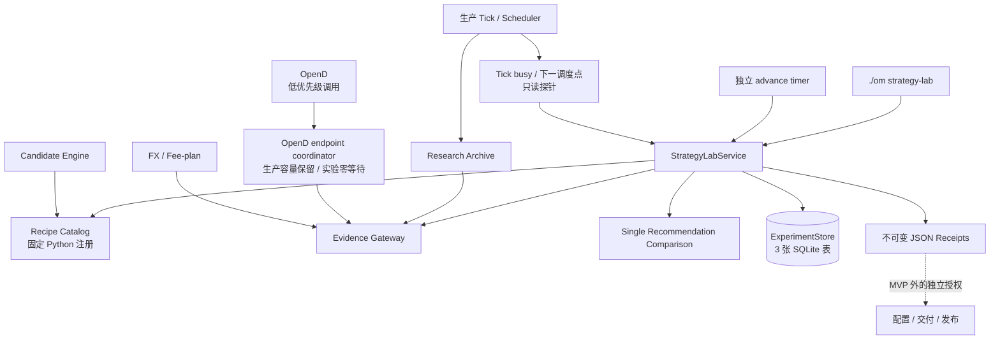

# Strategy Lab 统一策略实验平台系统设计

- **状态**：目标设计；Phase 1 源码已实现，待自然运行取证；Phase 2～4 尚未实现
- **日期**：2026-08-30
- **产品依据**：[Strategy Lab PRD](STRATEGY_LAB_EXPERIMENT_PLATFORM_PRD.md)
- **首个 Recipe**：`sell_put_option_position_concentration`

本文定义首条可行产品链路的技术边界、函数归属和代码处理方式。当前 `top1-loop`、旧
`ExperimentStore` 和 recorder 是待删除的遗留实现，不是本文要求兼容的已发布产品。

## 1. 设计目标

实现一条最短但完整的确定性实验链路：

```text
Recipe preview
  -> 人工确认 20 日研究
  -> 分钟 K 模拟成交与到期结果
  -> Research Receipt / 唯一 leader
  -> 人工确认未来 10 日隐藏验证
  -> 每分钟 Bid 观察与到期结果
  -> Final Receipt
```

设计必须同时满足：

1. 生产 Tick 仍是候选、正式点和运行资源的最高优先级 owner；
2. Strategy Lab 只读复用生产事实，不复制候选过滤、排序或风险门槛；
3. 实验逻辑是固定 Python Recipe，不执行 Agent 生成的代码、SQL 或公式；
4. 实验状态可在进程重启后恢复，重复命令和调度推进幂等；
5. 旧实验库、旧命令和旧兼容路径不迁移；
6. 首次完成前不引入 Strategy Lab 的 schema、Recipe 或合同版本体系；
7. MVP 全局最多一个未终态实验，且不能增加生产 Tick 的 OpenD 调用数。

## 2. 总体架构



关键依赖方向：

```text
interfaces/cli
  -> application/strategy_lab/service.py
       -> recipe.py / evidence.py / comparison.py / receipts.py
       -> domain Candidate Engine / concentration / performance models
       -> infrastructure ExperimentStore / Futu gateway / Research Archive
```

`domain/domain/` 不依赖 `src/`。CLI 不编排实验步骤；provider adapter 不判断实验输赢；Store
不计算 Recipe 或评价结果。Strategy Lab 不取得 Tick market lock；实验进程只能根据只读 busy / schedule
状态和低优先级配额决定“立即执行或让路”。

## 3. 最小代码结构

```text
src/application/strategy_lab/
  contracts.py       # 冻结 spec、标准结果和状态常量
  recipe.py          # Recipe 目录与首个集中度 Recipe
  evidence.py        # Archive 读取、分钟 K、隐藏报价和到期事实
  comparison.py      # 单推荐替换评价合同
  service.py         # preview、确认、推进、状态和恢复
  receipts.py        # Research / Final Receipt 构造与校验

src/infrastructure/strategy_lab/
  experiment_store.py

src/application/performance/
  account_fee_plan.py  # 从旧 capability probe 迁出的通用严格 fee-plan loader

src/interfaces/cli/
  strategy_lab.py
```

当前不建立每个 Recipe 子目录、插件接口、抽象 repository 层或 DSL。第二个 Recipe 真正出现，
且单文件职责已经混乱时，再按行为拆分。

## 4. 应用服务合同

CLI 和将来的 MCP 只能调用以下应用函数：

| 函数 | 输入 | 输出 | 是否写入 |
|---|---|---|---|
| `resolve_strategy_lab_runtime_context(profile, market)` | 受控 profile、market | runtime / artifact / config、limiter、Tick busy binding | 否 |
| `resolve_strategy_lab_context(profile)` | 受控 profile | runtime / artifact / Store、HK/lx config、OpenD、limiter、Tick schedule binding | 否 |
| `list_recipes()` | context | Recipe、参数、readiness | 否 |
| `preview_experiment(request)` | hypothesis、Recipe、参数、market、account | 完整 spec、readiness、`spec_sha256` | 否 |
| `refresh_history_k_readiness(request, confirmed_probe_sha256, actor, occurred_at_utc)` | preview 生成的 option code、OpenD underlier quota identity 与确认 hash | 不可变 readiness receipt | 是 |
| `confirm_research(request, confirmed_preview_sha256, actor, idempotency_key)` | 原 preview 请求和确认 hash | experiment id、状态 | 是 |
| `get_experiment_status(experiment_id)` | experiment id | 状态、进度、阻塞、下一动作 | 否 |
| `preview_validation(experiment_id, requested_start)` | experiment id、起始交易日 | leader、10 日窗口、schedule / config / behavior hashes、preview hash | 否 |
| `confirm_validation(experiment_id, requested_start, confirmed_preview_sha256, actor, idempotency_key)` | 原 preview 请求和确认 hash | 锁定的 10 日窗口 | 是 |
| `advance_experiment(experiment_id, occurred_at_utc)` | experiment id、一次冻结时间 | 推进摘要 | 是 |
| `advance_scheduled(occurred_at_utc)` | 一次冻结时间 | 无活动实验时 no-op；否则推进全局唯一实验 | 是 |
| `read_receipt(experiment_id, kind)` | experiment id、receipt kind | artifact、hash | 否 |

约束：

- `preview_experiment()` 不创建数据库行；
- 两次确认都用原 request 重新生成当前 preview；只有 `available` 且 hash 与用户确认值相同才写入，
  不能接受调用方回传的 spec；
- `create_experiment()` 在 `BEGIN IMMEDIATE` 内拒绝全局第二个未终态实验；
- `advance_experiment()` 每次只处理有限工作，并用传入的同一时间完成全部阶段判断；
- `advance_scheduled()` 从冻结 calendar 和 `occurred_at_utc` 解析墙钟 slot；仍在 tolerance 内时先处理当前
  slot，再把一个交易日内已过期但从未 started 的 slot 本地记 gap，不为历史 slot 请求报价；
- 每次确认和推进都重新计算冻结 owner manifest 的 `evaluator_behavior_sha256`；不匹配返回
  `evaluator_behavior_mismatch`，不迁移旧实验；`source_commit_sha` 只追加到审计事件，不参与准入；
- `list_recipes()`、两种 preview、`get_experiment_status()` 和 `read_receipt()` 的 provider 调用数必须为
  0；只有显式 history-K readiness refresh 和 advance 可以调用 OpenD；
- `get_experiment_status()` 和 `read_receipt()` 不请求 OpenD、不刷新事实、不写状态；
- 所有应用错误返回稳定 reason code，不把异常文本当产品合同。

两个 context resolver 都是普通函数，不新增 context class，也不从 cwd、localhost 或隐式默认值猜运行环境。
共享 runtime resolver 只读取 runtime root、artifact root、指定 market config、limiter root 和 Tick busy
binding，Research owner 可独立使用；产品 resolver 在其上增加 Store、account、OpenD endpoint 和 schedule
约束。共享 resolver 不读取旧 `strategy_lab_top1` profile。

## 5. Recipe 和评价合同

### 5.1 Recipe 注册

`recipe.py` 使用一个普通字典注册 Recipe：

```python
RECIPES = {
    "sell_put_option_position_concentration": build_concentration_arms,
}
```

同文件提供的最小函数：

| 函数 | 职责 |
|---|---|
| `describe_recipe(recipe_id)` | 返回问题、参数、支持范围、Evidence 和安全要求 |
| `check_recipe_readiness(recipe_id, context)` | 只读判断 `available / blocked / unsupported / disabled` |
| `build_concentration_arms(formal_point, parameters)` | 从同一点 accepted 候选构造 baseline / challenger |
| `build_single_recommendation_result(arm, fill, outcome)` | 生成标准结果 |

不建立 class、Protocol 或插件接口。服务按固定键调用函数；第二个 Recipe 出现后再判断是否需要抽象。

`check_recipe_readiness()` 先在冻结 `maturity_cutoff_utc` 上，从后向前选择最近连续 20 个满足以下条件的
正式交易日：formal expectation / point 完整，Recipe 能构造全部 arms，且实际入选 arms 的到期 outcome
均已成熟。它随后枚举这些 arms 的确切期权代码，只读校验未过期的 targeted history-K readiness receipt、
账户 fee-plan 和 Evidence Source Gate。receipt 必须匹配 endpoint、权限身份和样本范围，且当前 exact-code
映射到的唯一 security quota identity 数量不超过 receipt 已证明的 quota 边界；任一项未证明时返回
`blocked`，不调用 provider，也不先创建实验再等待 30～45 日。

当 preview 因 receipt 缺失而 `blocked` 时，仍返回不含 provider 结果的 exact-code probe request 及 hash，
供操作员确认；该 hash 不等于研究确认 hash，也不创建实验。

`refresh_history_k_readiness()` 是 history-K 的唯一实时 PoC owner。它重新生成并核对 preview 给出的 probe request
hash，经 Tick busy / 保护窗口 / `try_low_priority_opend_call()` 准入后，读取 quota / permission 并对冻结
单日样本发起一次完整分页查询。结果写为按 probe hash 和观测日期寻址的不可变 receipt；同日同输入重复
执行复用已有 receipt。receipt 保存 endpoint identity、权限 / quota、sample code / query、security quota
identity、quota ceiling、observed-at、expires-at 和内容 hash。OpenD 对期权历史 K 的 quota
按标的 security identity 记账，不按具体期权合约代码记账。因此 probe 构造时必须证明期权合约解析出的
security identity 与 quota code 完全相同。已有 receipt、保护窗口和 Tick busy 均在创建 OpenD gateway 前
检查，守卫失败时不得触发 readiness / `get_global_state` 或其他 provider 调用。它不是通用 capability 平台。

当前已验证的 provider contract 来自 2026-08-30 本机只读 PoC：查询已过期的
`HK.POP260828P127500` 在 2026-08-27 的 1 分钟 K，单页返回 330 根 bar，耗时 101ms，其中 329 根
`volume=0`，说明该样本的无成交分钟由零量 bar 表达；quota 明细为 18 条请求记录、13 个唯一 security，
`used=13`、`remaining=987`，样本合约记在 `HK.09992` identity 下。实现据此冻结 24 小时 receipt 有效期、
港股工作日 16:10 后准入、每 30 秒最多 4 个低优先级调用和最多 3 页。远端 systemd 与生产 Tick 的自然
并发证据仍未取得，不能据此宣布整个 Phase 1 通过。

### 5.2 首个集中度 Recipe

`build_arms()` 的确定性步骤：

1. 从 formal point 读取实际封存的生产 Top1 作为 baseline；
2. 读取同一点完整 accepted Sell Put 候选，缺任一候选事实则该点不可评价；
3. 对每个候选调用
   `calculate_option_market_concentration_after()`，只使用同一 formal point 绑定的全部未平仓期权、mark 和
   FX；
4. 调用 `rank_candidate_rows(mode="put", sell_put_ranking_profile=
   "option_market_concentration", near_return_threshold=...)`；
5. 排序第一名为 challenger，保留候选、持仓、mark、FX 和排名输入的 ref/hash。

三个固定变体使用 `0.002 / 0.004 / 0.006`。它们是持有期净收益率带，不是年化收益率差。

Recipe 不增加指派后股票集中度、全部 Short Put 名义敞口或其他新安全门槛。baseline 和 challenger
都必须来自生产 accepted 集合。不得从 performance-evidence repository、其他 run 或后来的 quote
回退补推荐时刻集中度输入。

### 5.3 标准结果

`build_single_recommendation_result()` 只接受已经规范化的 arm、fill 和 outcome，不访问 provider。
输出 PRD 定义的 `single_recommendation_result`。Sell Put 资金分母和损益公式只有这一处实现。

`no_fill` 输出零 PnL 和零年化收益率，资金分母与持有天数为空；`pending_outcome` 保持等待；
`not_evaluable` 不参与计算且不能改写为零。

### 5.4 单推荐替换评价

`comparison.py` 只暴露：

```text
compare_single_recommendations(expected_points, baseline_results, challenger_results)
```

它依次完成：

1. 按 `recommendation_point_id` 严格配对；
2. 检查每天 expected formal points 完整；
3. 计算每点年化收益率和 CNY PnL delta；
4. 同日各点算术平均；
5. 冻结窗口内各日等权平均；
6. 应用两条判断：平均年化收益率 delta 大于零，平均 CNY PnL delta 不小于零。

不实现 Student-t、最差 20%、加权总分或自动显著性判断。研究阶段先按年化收益率改善、再按
CNY PnL 改善，从通过变体中选择唯一 leader；隐藏验证只评价锁定 leader。

## 6. Evidence 设计

### 6.1 Evidence 分层

| 时点 | 事实 | owner | 获取方式 |
|---|---|---|---|
| 推荐时刻 | 正式点、accepted/rejected 候选、生产 Top1 | Research Archive | 只读现有 artifact |
| 推荐时刻 | 合约报价、Greeks、OI、DTE、标的价 | Research Archive | 只读 required-data / opening snapshot |
| 推荐时刻 | 全部未平仓期权 identity / 数量、mark、FX | Formal Point artifact | 只读同 point 绑定事实；不跨 repository 回退 |
| 20 日研究 | 入选 arm 的期权 1 分钟 K | OpenD | 闭市后按需请求 |
| 10 日验证 | 锁定 arm 的 Bid / Bid Volume | OpenD | 盘中每分钟一个批次 |
| 到期 | 标的未复权日收盘、FX、费用 | OpenD / performance evidence / fee-plan | 成熟后按需补全 |

Evidence cutover 只走一条路径：

1. `prepare_option_positions_contexts()` 在扫描前只冻结 position identity / 数量和 FX，不再要求或刷新
   Strategy Lab mark；
2. 原生产扫描完成并持久化 required-data / opening artifact；
3. `tick_notification_flow.py` 在这些 artifact 可读后调用 `recommendation_point.py`；后者按同一
   run/account/point time 从允许的 artifact 解析每个持仓合约的 exact mark，复用
   `performance/evidence_collection.py` 的合约行匹配、mark 选择和 `ValuationMarkFact` 规范化，生成
   `option_position_evidence_binding`；
4. `formal_corpus.py` 重新读取 point 所引用的 prepared context 和冻结 required-data batch，用同一确定性
   builder 重建 position / mark / FX binding，并与 point 中的 binding 精确比较后封存；不调用 provider，
   不跨 run/repository 回退；
5. 任一持仓合约未被原批次覆盖、source time 超出冻结 coherence 窗口、identity 或 hash 不一致时，point
   `not_evaluable`，且不得新增 provider 请求。

现有 private helper 在原文件内提升为一个可复用
`build_option_valuation_mark_fact(position, snapshot_rows, source_binding, formal_time_bounds)`，不另建 mark
层：行解析依次使用 requested instrument key、
持仓 market code，最后才用 option type / expiry / strike / multiplier；必须唯一匹配。正 Bid 和 Ask 且
Ask 不低于 Bid 时取 midpoint，否则只允许正 Last 的 `last_fallback`；crossed market、无价、零行或多行
都失败。requested / received time 必须来自 source artifact、顺序合法并位于同 run 已冻结的
formal-point time-coherence 范围；禁止用调用时钟 fallback 或后续批次。现有 performance 调用方继续沿用
当前 live fallback 行为；只有 formal caller 传入 `formal_time_bounds` 时启用上述严格时间门槛。

binding 的最小字段是 run/account/point identity、position source ref/hash、逐合约 instrument key / market
code / 数量、price、mark kind、effective / observed time、source artifact ref/hash、source row identity、
确定性 `ValuationMarkFact.fact_id` / payload hash，以及 FX ref/hash。`source_id` 是 artifact hash 与匹配行
requested instrument key / code 的 canonical hash，fact id 继续由现有 canonical payload 生成。多个 lots
复用同一 instrument fact；
同一 instrument 出现不同 mark 则失败。只有确切持仓合约进入原 snapshot batch 不会增加预计 provider
调用数时才扩展现有 batch。新 binding 的 focused tests 通过后，才在同一 Phase 删除
`mark_evidence_accounts -> refresh_quotes=True`；不双写。Evidence Source Gate 比较切换前后的 OpenD
调用数、snapshot 批次数和 Tick deadline，任一变差就保持 Recipe `blocked`。

### 6.2 20 日研究成交

`collect_research_fill_evidence()`：

1. 调用现有 `FutuGateway.request_history_kline()` 获取具体期权合约 1 分钟 K，并携带返回的
   `page_req_key` 逐页请求直到为空；所有页都通过低优先级零等待 limiter；
2. 规范化后要求 bar 严格有序、时间唯一且位于冻结查询边界内；“完整”表示请求参数绑定完整查询
   范围、所有分页成功且最终 `page_req_key` 为空，不要求零成交的每个墙钟分钟都存在 bar；
3. 首根满足 `high >= sell_limit + price_tick` 且 `volume > 0` 的 bar 为
   `simulated_fill`，成交价记为 `sell_limit`；
4. 完整覆盖但未满足为 `no_fill`；缺口、重复、时区不明或 provider 不支持为
   `not_evaluable`；
5. 保存规范化 bars 的 artifact ref/hash，Store 只保存判定和引用。

不得用日 K 判断成交，也不得把模拟成交描述为真实成交。

preview 枚举确切 option codes，并将其映射为唯一 security quota identities，但只读取 targeted readiness
receipt。receipt 过期、endpoint / 权限漂移、样本范围不足或当前 identity 数量超过已证明 quota ceiling
时返回 `blocked`。真实 quota / permission 与单日 PoC 只能由显式 `refresh_history_k_readiness()` 获取，
并使用和 scheduled advance 相同的 busy、保护
窗口与低优先级零等待边界。PoC 同时记录缺分钟和 `volume=0` bar，以实际返回证明无成交分钟的编码语义；
过期合约可回溯范围、该语义和返回尾延迟没有真实证据前均为 readiness blocker，不从文档推测。

### 6.3 10 日隐藏成交观察

第二次确认冻结 10 个交易日的 calendar session、UTC 分钟网格、wake-up tolerance 和订单有效终点。
每个 formal point artifact 持久化后，服务把 arm active window 固化为“point 持久化后的第一个完整交易
分钟至同日冻结终点”；午休、半日市和临时休市完全由冻结 calendar 决定，point 出现前的 slot 不属于该
arm。任务晚于 `slot + tolerance` 才醒来时只记 gap，不用当前报价回填过去 slot。slot 来源是冻结 calendar
与本次 `occurred_at_utc`，不从上一次任务完成时间递推。

`observe_hidden_fill()`：

1. 先计算仍在 tolerance 内的当前 slot，优先处理其全部 active、尚未确定 fill 的 arms，并按合约去重；
2. 在一个 SQLite 事务写 batch-kind started observation，key 为
   `hidden_batch:<trading_day>:<observation_slot_utc>`，payload 冻结 exact arm ids、option codes 和 query；
3. 随后一次调用现有 `fetch_option_snapshots()`，固定 `max_wait_sec=0`、`no_retry=True`、
   `snapshot_fallback_max_codes=0`、一个明确 batch size 和进程级硬 timeout；去重后不得超过单批上限；
4. 对每个 arm 使用冻结 `sell_limit` 判断 `bid >= sell_limit and raw_bid_vol > 0`；Bid 和 raw Bid Volume
   必须来自同一 snapshot 且为有限正值。raw Bid Volume 只证明最优买价存在非零挂量，不换算为合约张数，
   不估算可成交规模或滑点；
5. provider 返回后先写一份含完整查询条件、scheduled / observed time 的不可变批次 artifact，再在一个
   事务 complete batch 并绑定 manifest 中全部 arm observations；首次满足写 `observed_fill`，价格记为
   `sell_limit`，以后不再要求该 arm 的 slot；
6. started batch 在 deadline 后仍无 artifact 时，按原 manifest 将全部 arms 一次性记 gap；artifact 已存在
   时只补 Store binding。同 slot 后出现的新 arm 不修改旧 manifest；
7. 当前 slot 处理后，把 deadline 已过且连 started row 都不存在的 expected slots 直接物化为 gap，绝不
   调 provider；每次最多处理一个冻结交易日，优先当天、再处理最早未完成日；
8. 当日无 fill 时，只有 active window 中全部 expected slots 已 observation 或 gap 化才可结算；全部
   observation 才是 `no_fill`，任一 gap 都是 `not_evaluable`。10 日窗口存在未显式 slot 时不得结束。

中间观察和阶段效果不向用户展示。status 只返回进度与阻塞原因。

每个 batch 断言 `opend_call_count <= 1`。系统不承诺 provider exactly-once；batch started 后不再对同 key
发起查询。进程在 artifact 持久化前崩溃时，deadline 后由 manifest 生成 gaps；artifact 已持久化但 Store
未绑定时，重启只补绑定。历史 K / outcome 查询没有盘中 slot 语义，artifact 未持久化时允许安全重试。

`preview_validation()` 只从已完成研究和本地冻结事实构造 leader、未来窗口及其 binding，不访问 provider。
第二次确认重新生成 preview，并把 schedule、account config、timer 和 behavior hashes 固化进 validation
binding。实时 snapshot 的 Bid、raw Bid Volume 或 source time 缺失 / 非法时，只影响对应 slot 的
可评价性，不在确认前新增一个无法独立证明 volume 单位的 readiness 子流程。

### 6.4 到期结果

`resolve_expiry_outcome()` 对已成交 arm：

- 使用真实合约到期日和标的未复权日 K 收盘；
- 使用开仓、到期时点已绑定的 `FXRateFact`；
- 开仓费用使用 formal point 已封存结果；终端费用使用严格 account fee-plan fact
  (`commission_free`、`platform_fee`、`fee_plan_ref`) 及其内容 hash，并复用现有期权费用计算；
- 生成规范化 outcome artifact 和 hash；
- 未到期为 `pending_outcome`，可恢复缺失为 `blocked`，冻结窗口不可恢复缺失为
  `not_evaluable`。

MVP 不抓期权逐笔、不模拟提前平仓，也不计算指派后的持股收益。

## 7. ExperimentStore

### 7.1 三张表

新的 `ExperimentStore` 直接创建三张表，不检测或迁移旧表：

| 表 | 最小内容 |
|---|---|
| `experiments` | id、state、canonical spec/hash、source commit、behavior hash/manifest、leader、窗口、receipt ref/hash、revision、时间 |
| `experiment_events` | experiment id、顺序号、event type、actor、confirmation hash、payload、时间 |
| `experiment_observations` | experiment id、稳定 observation key、point / arm / slot、kind、status、payload/ref/hash、时间 |

主键和唯一约束承担幂等：

- `create_experiment()` 在 `BEGIN IMMEDIATE` 内查询并拒绝全局第二个未终态 experiment；
- 每个 experiment 的 confirmation hash 只能消费一次；
- observation 以 `(experiment_id, observation_key)` 唯一；隐藏 batch key 只含 trading day + scheduled slot，
  payload 冻结 exact arm/query manifest；各 arm key 另含 slot + arm identity，research K / outcome key
  包含冻结 query identity；相同 key 的不同内容必须拒绝；
- event 以 `(experiment_id, sequence)` 排序，只追加；
- 状态更新使用 `revision` compare-and-set，并在同一 SQLite 事务提交事件。

### 7.2 Store 函数

| 函数 | 行为 |
|---|---|
| `initialize()` | 仅为空库创建三表；发现其他表 fail closed |
| `create_experiment()` | 写冻结 spec 和首个事件 |
| `get_active_experiment()` | 返回全局唯一未终态实验；没有则返回空 |
| `get_experiment()` | 读取状态与引用 |
| `append_event_and_transition()` | 校验旧状态、revision 后追加事件并推进 |
| `start_observation()` | 在一个事务保存 batch started 与 exact arm/query manifest；已存在不再调用 provider |
| `complete_observation()` | artifact durable 后在一个事务完成 batch 并绑定全部 arm rows；拒绝同 key 不同内容 |
| `expire_started_observation()` | deadline 后按原 manifest 将无 artifact 的 batch 全部 arms 记 gap |
| `materialize_elapsed_observation_gaps()` | 在一个事务把一个冻结交易日内从未 started 的过期 slots 及其 arms 记 gap；不访问 provider |
| `list_observations()` | 按 point / arm / kind 读取 |
| `attach_receipt()` | 仅在不可变 receipt 已 readback 验证后绑定 ref/hash |

复用 `connect_private_sqlite()`、`secure_sqlite_artifacts()` 和 SQLite `BEGIN IMMEDIATE`。不再使用
`strategy_lab_schema`、`schema_state()`、`migrate()`、generation、capability、corpus、feature 或
Top1 专用表。

旧库不在应用启动时自动删除或覆盖。实施部署前由操作员确认一个明确旧路径；停止旧服务后移动到
隔离备份或删除，再让新 Store 在新路径首次创建。该操作不属于普通 schema migration。

## 8. 状态推进与调度

### 8.1 状态 owner

`StrategyLabService.advance_experiment()` 是唯一状态推进 owner；调度入口只调用
`advance_scheduled(occurred_at_utc)` 查找全局唯一活动实验：

```text
research_running
  -> research_complete
  -> completed | awaiting_validation_confirmation
  -> validation_collecting
  -> waiting_outcome
  -> completed
```

`blocked` 是可重试的阶段结果，不伪造成功状态；冻结窗口不可恢复缺失生成
`insufficient_evidence` 回执并结束。所有阶段先读 Store，再检查已有 artifact/observation，最后才发起
缺少的 provider 调用。无活动实验时调度成功 no-op。

每次确认 / advance 都按冻结 manifest 重算 `evaluator_behavior_sha256`。manifest 直接列出本实验调用的
Recipe、comparison/economics、fill/outcome、Candidate Engine ranking profile、集中度、fee/FX 合同的文件
内容 hash；聚合 hash 由 canonical JSON 计算，不扫描全仓，也不引入版本表。行为 hash 不一致返回
`evaluator_behavior_mismatch`；仅 `source_commit_sha` 改变不阻断，但追加审计事件。历史研究允许不同
formal point 绑定各自生产 config / source hashes；未来验证在第二次确认时冻结 schedule、account-config
和 timer binding，后来 formal point 不匹配即 `validation_source_binding_mismatch`，不自动换配置或迁移。

MVP manifest 固定覆盖以下文件，每项只保存路径和文件 SHA-256：

- 待新增：`src/application/strategy_lab/contracts.py`
- 待新增：`src/application/strategy_lab/recipe.py`
- 待新增：`src/application/strategy_lab/comparison.py`
- 待新增：`src/application/strategy_lab/evidence.py`
- 待新增：`src/application/strategy_lab/service.py`
- 待新增：`src/application/strategy_lab/receipts.py`
- 现有：`domain/domain/engine/candidate_engine.py`
- 现有：`domain/domain/short_vol_assessment.py`
- 现有：`domain/domain/fee_calc.py`
- 现有：`domain/domain/performance/models.py`
- 待新增：`src/application/performance/account_fee_plan.py`
- 现有：`src/application/performance/evidence_collection.py`
- 现有：`src/application/opend_market_snapshot_fetching.py`
- 现有：`src/infrastructure/futu_gateway.py`
- 现有：`src/application/opening_candidate_snapshot.py`
- 现有：`src/application/prepared_option_positions_context.py`
- 现有：`src/application/recommendation_point.py`
- 现有：`src/application/research/formal_corpus.py`
- 全量替换：`src/infrastructure/strategy_lab/experiment_store.py`

固定参数和公式输入由 canonical spec 覆盖；timer unit、冻结 schedule 和 account config 由独立 binding
hash 覆盖。新增实际执行 owner 时必须先更新固定清单和设计，不能运行时递归发现依赖、生成 AST 图或
建立版本表。prepared context 同时生成并校验 Recipe 直接使用的 position / FX 事实，因此采用整个文件
hash。`required_data_snapshot.py` 和 coordinator 只决定不可变输入是否可用或调用是否获准；其 artifact
ref/hash、provider response 和 blocker 均作为输入事实保存，不在 evaluator 中重新解释。通知、日志、CLI
adapter 和文档不属于行为 manifest。opening snapshot loader 也采用整个文件 hash，因此物理编码调整会
保守阻断当前实验；MVP 接受该取舍，不增加函数级源码分析。

### 8.2 运行隔离

仅保留一个 Strategy Lab timer，调用：

```text
./om strategy-lab advance --scheduled
```

`service_deploy.py` 为同一 timer 生成三条墙钟 `OnCalendar=`：盘中
`Mon..Fri *-*-* 09..15:*:00 Asia/Hong_Kong`，以及闭市阶段
`Mon..Fri *-*-* 16..23:00/10:00 Asia/Hong_Kong` 和
`Tue..Sat *-*-* 00..08:00/10:00 Asia/Hong_Kong`。冻结 calendar
负责让开盘前、午休、半日市和休市日 no-op；timer 只负责稳定唤醒。配置 `AccuracySec=1s`、
`RandomizedDelaySec=0`、`Persistent=false`。不得使用当前 `OnUnitActiveSec`，避免任务耗时推动下一次观察
时刻；重启后也不补跑带当前报价的过期盘中调用。

调度实现：

1. 不取得 Tick market lock；只读检查 Tick busy 和下一计划时间，busy 或进入保护窗口立即让路；
2. OpenD coordinator 为生产保留容量；实验调用只允许低优先级立即准入，配额不足即返回，不等待；
3. 历史 K 和 outcome 只在闭市后、且不在 Tick 保护窗口内运行，每次最多处理一个 point 或 outcome；
4. 盘中隐藏观察每分钟最多一个 snapshot batch，按合约去重，固定单批、硬超时、零等待、不重试、
   无 fallback；
5. 每次先处理仍可观察的当前 slot；之后在一个本地事务把一个交易日内已过 deadline、但没有 started row
   的 expected slots 物化为 gap，优先当天、再处理最早未完成日，且不调用 provider；闭市条目继续恢复；
6. provider 返回先发布不可变 artifact，再绑定 Store；已发布未绑定的 artifact 只补绑定；未发布的隐藏
   batch 在 deadline 后按 started manifest 记 gap，历史 / outcome query 可安全重试；
7. 让路、限流或 provider 暂不可用只记录稳定 gap/blocker，不忙等；
8. 旧 recorder 的 build/sample/settle timers 和旧 Top1 timer 全部删除。

保护窗口和生产预留容量在实施前由 OpenD PoC 与当前 Tick 调用计划确定为代码常量，不增加用户配置。
并发测试必须覆盖两个方向：Tick 已运行时实验立即让路；实验已开始后 Tick 仍取得自己的锁且不会
`SKIP_LOCKED`，实验在 deadline 内结束或记 gap。若共享 endpoint 的低优先级协议无法证明这一点，
MVP 保持 `blocked`；不在本设计中预建第二个 OpenD endpoint。

## 9. 代码处理清单

### 9.1 原样复用

| 现有 owner | 复用内容 |
|---|---|
| `domain/domain/engine/candidate_engine.py` | `rank_candidate_rows()`、生产 accepted 候选与 sell limit 语义 |
| `domain/domain/short_vol_assessment.py` | `calculate_option_market_concentration_after()` |
| `src/application/research/formal_corpus.py` | expectation、formal point、健康读取与 immutable refs |
| `src/application/opening_candidate_snapshot.py` | 紧凑 snapshot loader、校验和语义 hash |
| `src/application/opend_market_snapshot_fetching.py` | `fetch_option_snapshots()` |
| `src/infrastructure/futu_gateway.py` | `request_history_kline()` 与 snapshot gateway |
| `domain/domain/performance/models.py` | `FXRateFact`、`select_fx_rate()` |
| `domain/domain/fee_calc.py` | 现有 Futu option fee 计算 |
| `src/application/performance/evidence_collection.py` | 现有 option row matching、midpoint / Last fallback 与 `ValuationMarkFact` 规范化 |
| `src/infrastructure/private_storage.py` | 私有文件、SQLite 和 `exclusive_private_file_lock()` |

`Shadow Replay`、required-data、ledger、performance-evidence repository 和普通扫描/通知继续保留；
它们有独立生产或研究用途，不因删除旧 Strategy Lab 壳而删除。

### 9.2 修改

| 文件 | 修改 |
|---|---|
| `src/interfaces/cli/main.py` | 注册根级 `strategy-lab` 命令 |
| `src/interfaces/cli/research.py` | 删除旧 `research strategy-lab` 路由；增加 Research owner 的 `corpus-calendar refresh` 运维入口 |
| `src/application/service_deploy.py` | 删除 recorder/Top1 units；最小扩展现有 `_systemd_timer()` 支持重复 `OnCalendar` 和显式 accuracy/persistent，生成唯一 Strategy Lab advance unit |
| `src/interfaces/cli/service_ops.py` | 用最小 Strategy Lab 开关替换 recorder/Top1 参数 |
| `src/application/tick_cron.py` | 只暴露非持有式 busy / schedule 探针；不改变 Tick 自己的 lock / `SKIP_LOCKED` 行为 |
| `src/application/opend_call_coordinator.py` | 在现有 limiter 上增加最小 `try_low_priority_opend_call()`，零等待且保留生产容量 |
| `src/application/tick_account_execution.py` | 取消 Strategy Lab 专用 `mark_evidence_accounts` 整仓刷新；不增加 Tick provider 调用 |
| `src/application/prepared_option_positions_context.py` | 删除 Strategy Lab 触发的 `refresh_quotes=True` mark 路径和 prepared mark ready 要求；继续封存 position / FX 通用事实 |
| `src/application/performance/evidence_collection.py` | 提升 `build_option_valuation_mark_fact()`，复用现有行匹配、mark 选择和 fact 构造；现有 performance 调用方改用同一实现 |
| `src/application/recommendation_point.py` | 在原扫描 artifact 可读后组装唯一 `option_position_evidence_binding`；不请求 provider |
| `src/application/tick_notification_flow.py` | 固定“扫描 artifact durable -> recommendation point -> formal corpus”的调用顺序 |
| `src/application/research/formal_corpus.py` | 从绑定的 prepared context 与冻结 required-data batch 重建 position / mark / FX binding，精确比较后封存；不调用 provider 或跨源回退 |

如果 Research Archive 当前已有所需字段，不修改 writer。仅当确切持仓合约能进入原 snapshot batch 且
预计调用数不增加时才扩展原 batch；禁止额外刷新或为 Recipe 复制第二份候选 / 持仓事实。

### 9.3 新增或全量替换

| 文件 | 处理 |
|---|---|
| 拟新增：`src/application/strategy_lab/contracts.py` | 最小 spec、结果和状态合同 |
| 拟新增：`src/application/strategy_lab/recipe.py` | 目录与首个集中度 Recipe |
| 拟新增：`src/application/strategy_lab/evidence.py` | 按需证据读取与规范化 |
| 拟新增：`src/application/strategy_lab/comparison.py` | 可复用单推荐替换评价 |
| 拟新增：`src/application/strategy_lab/service.py` | 唯一应用编排 owner |
| 拟新增：`src/application/strategy_lab/receipts.py` | 两个不可变回执 builder |
| 拟新增：`src/application/performance/account_fee_plan.py` | 从旧 capability probe 迁出的严格 account fee-plan fact loader |
| `src/infrastructure/strategy_lab/experiment_store.py` | 全量替换为三表 Store |
| 拟新增：`src/interfaces/cli/strategy_lab.py` | MVP CLI 适配 |

### 9.4 删除

| 删除目标 | 原因 |
|---|---|
| `src/application/strategy_lab/top1/` 整个目录 | 先迁出 corpus calendar 写入口和 account fee-plan loader，再删除错误产品子平台 |
| `src/application/strategy_lab/update.py` | recorder 兼容入口不是 MVP 产品能力；Shadow Replay 已有自己的入口 |
| `src/interfaces/cli/strategy_lab_top1.py` | 删除 `top1-loop`、calendar/capability probe 和 profile 壳 |
| 旧 ExperimentStore 内容 | 13 表、四代迁移、feature/generation/corpus 专用状态无保留价值 |
| recorder build/sample/settle service 与 timer | 三套维护循环不再属于 Strategy Lab |
| Top1 advance service 与 timer | 由唯一 Strategy Lab advance unit 替换 |
| 只覆盖上述旧入口、迁移和状态表的测试/fixture | 不保留未发布兼容合同 |

删除以引用清单为准：先用 `rg` 证明没有生产消费者，再删定义和死测试。不得顺带删除 Research
Archive、Shadow Replay、required-data 或 Candidate Engine。

旧 `strategy_lab_top1.py` 是当前唯一 calendar refresh 写入口；`top1/capability_receipts.py` 持有严格
fee-plan 读取逻辑。两项在新 owner 的 focused tests 通过前不得随目录删除。它们是有效能力，不是兼容
包袱。

## 10. Receipt 与 artifact

`receipts.py` 使用现有 canonical JSON、`exclusive_private_file_lock()` 和私有原子写入函数实现
write-once-or-verify。路径只由 experiment id 和 receipt kind 决定：目标不存在时原子写入、fsync、
readback 并校验 SHA-256；目标已存在且字节相同则复用；不同则返回 `receipt_immutable_conflict`。
Store 只能在 artifact 已 durable 并通过 readback 后绑定 ref/hash。

Research Receipt 包含 spec/hash、source commit、behavior hash/manifest、20 日固定窗口、每个变体完整性与聚合、leader 和
`provisional` 声明。Final Receipt 包含两次确认、10 日固定窗口、逐点结果引用、按日等权聚合和
`challenger_passed / keep_baseline / insufficient_evidence`，并重复绑定同一 behavior hash/manifest。

同一 experiment、同一输入重复构建必须得到相同语义 hash。时间戳只记录事实发生时间，不能在重试时
改写为新值导致第二份结论。

外部证据沿用相同发布顺序：provider response -> immutable artifact durable -> Store attach。artifact
存在而 Store 未绑定时只补绑定；artifact 未落盘时，历史 / outcome 查询可重试，隐藏 batch 必须按
manifest 记 gap。
targeted history-K readiness receipt 复用现有 canonical JSON、私有原子写入和 readback helper，以 probe
hash 与观测日期寻址，不写 ExperimentStore；过期只影响后续 preview，不改写旧 receipt。

## 11. 验证策略

### 11.1 最小确定性测试

1. `comparison.py`：完整配对、同合约 delta 零、缺点、`no_fill` 和两条判断；
2. `recipe.py`：三个收益带、完整 accepted 集合、同 formal point 绑定、成熟 20 日窗口和缺失 fail closed；
3. mark binding：midpoint、Last fallback、无价、crossed、重复匹配、缺 market code、多 lots、越界 source
   time / 后续批次、deterministic fact/hash 和 provider 调用数为 0；
4. `evidence.py`：分钟 K 多页 / 顺序 / 重复 / receipt readiness、Bid crossing、正 / 零 / 非法 raw Bid
   Volume、session slot、batch manifest、从未 started 的过期 slot、当前 slot 优先、全天 gap、单批调用上限；
5. `ExperimentStore`：初始化、全局单活动实验、两次确认幂等、revision 冲突、batch / arm identity、重启恢复、
   同 key 不同内容拒绝；
6. public CLI：重复 list / 两种 preview / status 的 provider 调用数为 0；显式 history-K readiness refresh
   在 busy/guard 时让路，receipt drift/expiry 阻断 research preview；确认时重新 preview/hash 校验；无关
   commit 漂移不阻断，behavior owner 漂移 fail closed；receipt write-once readback；
7. behavior manifest：逐一替换固定清单中每个 owner 的内容都会改变聚合 hash；改变 prepared position /
   FX producer、Store gap、formal mark binding、corpus completeness 或 candidate loader 语义必须 mismatch；
   修改通知、ledger 或文档不会改变聚合 hash；
8. Research 运维：`corpus-calendar refresh` 保留当前 immutable binding 语义，fee-plan loader 严格校验三项
   account facts；
9. service deploy：唯一 timer 含冻结的全部 `OnCalendar`、`AccuracySec=1s`、`Persistent=false`，不含
   `OnUnitActiveSec`，且旧 recorder / Top1 timer 不再生成；
10. Tick / OpenD：Evidence Source Gate 证明 provider 调用数不增加；Tick 持锁时实验立即让路；实验已启动
   时 Tick 不 `SKIP_LOCKED`，实验配额不足或 deadline 到达时记 gap。

### 11.2 集成验收

- 用冻结 fixture 完成一次 20 日研究并得到唯一 leader；
- 第二次确认后用 10 日 fixture 完成隐藏观察、等待到期并生成稳定 Final Receipt；
- 覆盖午休、半日市、timer 晚到 / 停机 / 禁用、日内新增 point、多个 arms 共享合约，以及 batch started
  前后 / artifact 后部分绑定崩溃；当前 slot 不被历史 gap 恢复挤占，artifact 已 durable 时重启只补绑定，
  未 durable 的隐藏 batch 按 manifest 记 gap，从未 started 的过期 slot 不调用 provider 即记 gap；
- 缺失分钟 K、FX、正式点或 outcome 时输出 `insufficient_evidence`，不缩短或换窗口；
- 运行 focused tests 后执行现有 analyze 和全量测试基线。

### 11.3 自然运行验收

代码测试不能替代生产隔离证明。真实运行至少确认：

- Tick OpenD 调用数、时长和成功率未因 Strategy Lab 变差；
- 盘中观察始终是一次 snapshot batch、零等待、无 fallback，并在硬超时内；
- OpenD 生产预留不足、Tick busy 或进入保护窗口时实验让路，Tick 从不因实验持锁而跳过；
- 20 个历史日和未来 10 日均来自冻结窗口；
- 最终回执可用 refs/hash 从原始事实重算。

OpenD 的 HK 期权分钟 K 权限、过期合约覆盖、零成交 bar 行为和尾延迟，以及远端 systemd 并发行为，
必须由 PoC / 自然运行记录证明；在此之前保持 readiness blocker，不写成已知事实。

## 12. 实施顺序

### Phase 1：先保住 owner 和生产优先级

- 迁出 `corpus-calendar refresh`、严格 account fee-plan loader 和共享
  `resolve_strategy_lab_runtime_context(profile, market)`；Research calendar 不依赖旧 Top1 profile，旧
  `resolve_strategy_lab_context(profile)` 仅在尚未删除的定向 PoC 壳内使用；
- 在现有 coordinator 增加低优先级零等待准入，先用 fake provider 覆盖生产容量保留、busy / guard、零等待
  和双向并发；
- 再实现显式 targeted history-K readiness refresh，先通过 fake provider 测试，再完成权限 / quota / 过期
  合约单日真实 PoC，冻结 receipt 有效期、保护窗口和生产预留常量；
- 建立 Evidence Source Gate：复用现有 mark 规范化，先实现 recommendation point 的新 binding 和完整
  fail-closed / 零 provider 测试，再移除 Tick 的 Strategy Lab 专用整仓 quote refresh，并证明 Tick OpenD
  调用数、snapshot 批次数和 deadline 不变差；
- 验收：calendar / fee-plan / context owner 已保留，Tick 不因实验持锁或额外调用受影响。任一门槛不能
  证明时停止，不删除旧 owner，也不进入 Phase 2。

### Phase 2：替换产品壳并完成 20 日研究

- 建立三表 Store、根级 CLI、contracts、service、只读 Recipe 目录和确认重建 preview 合同；
- 实现成熟 20 日选择、集中度 Recipe、完整分页分钟 K、标准结果、比较器和 write-once Research Receipt；
- 旧 calendar / fee-plan / context 引用切换完成后，删除旧 CLI、Top1 目录、recorder 入口、旧服务定义和
  只服务旧合同的测试；
- 验收：旧入口不存在；固定 20 日 fixture 产生唯一 leader 或确定性无 leader；全局第二个活动实验被
  拒绝；不迁移旧数据。

### Phase 3：10 日隐藏验证与到期

- 实现独立 advance timer、每分钟批量观察、outcome 和 Final Receipt；
- 使用同一 snapshot 的正 Bid 和正 raw Bid Volume 判断一张合约的 observed fill；不换算 volume 单位，
  不新增 snapshot readiness 入口；
- 验证 session slot、batch manifest、低优先级 limiter、硬超时、artifact-first 恢复、scoped behavior /
  config drift、gap 与固定窗口；
- 验收：fixture 闭环得到三个终态之一。

### Phase 4：真实数据验收

- 先确认 Research Archive readiness，再人工启动 20 日真实研究；
- 只有可信 leader 才确认未来 10 日；
- 到期后审计 Final Receipt 和生产 Tick 性能。

每个 Phase 是独立确认边界。MCP、Skill、飞书、并行实验、自动采用和版本迁移均不在本设计中。
