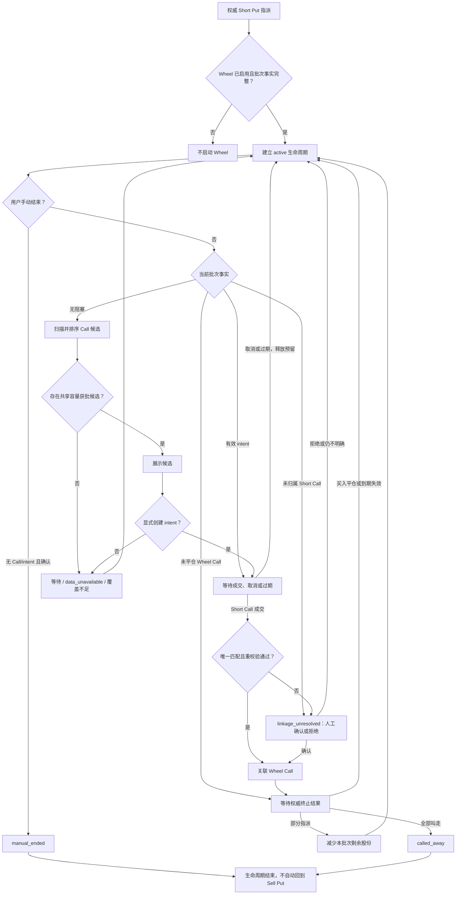

# 轮转策略（Wheel）PRD

- **状态**：V1 已实现；默认关闭，按账户显式启用
- **中文名**：轮转策略
- **英文名**：Wheel
- **内部标识**：`wheel`
- **文档性质**：当前产品、安全与 owner 合同

当前实现位于 `domain/domain/wheel.py`、`src/application/wheel/` 和 `src/interfaces/cli/wheel.py`。
本文不保存已完成的实施步骤；运行行为以当前源码、配置验证器和测试为准。

## 1. 背景

Sell Put 被指派后，用户已经持有交割正股。Wheel 监控这一批正股，在愿意以不低于正股
保本底线的价格卖出时推荐 Covered Call，直到正股被 Call 行权卖出或用户手动结束。

Wheel 是单向生命周期，不是无限循环：



终止后不自动回到 Sell Put。

## 2. 产品目标

1. 从可审计的 Sell Put 指派事实建立批次级 Wheel 监控。
2. 在不降低正股保本卖出底线的前提下，优先推荐被行权后生命周期净收益更高的 Call。
3. 统一管理普通 Covered Call 和 Wheel Covered Call 的股票覆盖额度，防止 Short Call 合计超过持股。
4. 复用现有 Covered Call 的行情、费用、波动率、流动性、容量和候选快照能力。
5. 以独立策略合同接入现有扫描链路，使新增 Wheel 不会在未声明的情况下改变既有策略的候选、交易归属、生命周期或报告结论。

## 3. 非目标

V1 不包括：

- 自动下单、自动平仓、自动行权或自动滚动 Call；
- Wheel 结束后自动重新卖出 Put；
- `max_lifecycle_days` 或其他自动超时结束机制；
- 除息日、股息和财报日过滤；
- 普通正股卖单与 Wheel 批次的新归属、拆分或解析工具；
- 跨 `stock_lot_id` 合并一个 Wheel 生命周期；
- 仅根据同一账户、标的、成交时间或持股数量做模糊评分，自动猜测 Short Call 属于哪个批次；
- 复用普通 Covered Call 的启用状态、watchlist 或 symbol 配置作为 Wheel 的启动条件。
- 将策略拆成微服务、引入动态插件平台，或为接入 Wheel 重写全部现有策略。

## 4. 启动与批次

### 4.1 启动条件

Wheel 仅在以下条件全部成立时启动：

- 目标账户和市场已启用 `wheel`；
- 权威成交与交割事实证明 Short Put 已被指派；
- 指派已生成唯一 `stock_lot_id`，股数、交割价、费用、账户、币种和时间完整。

权威事实可来自 broker 同步或现有的人工确认写入路径。不得根据 ITM、到期日或市场价格
推测指派。

Combo Yield 的 `funding_put` 被权威指派后也可启动 Wheel。原 Combo 的
`participation_call` 继续按 Long Call 的独立仓位和生命周期管理，不占用正股覆盖
额度，其平仓、到期或行权不改变 Wheel 状态。

### 4.2 批次边界

- 一个 `stock_lot_id` 对应一个 Wheel 生命周期。
- 同一账户、同一标的可同时存在多个 Wheel 批次，但不合并成本或收益。
- 每个批次最多推荐 `floor(当前可用批次股数 / multiplier)` 张 Call。
- 不足一张合约的剩余股数保留为 `residual_stock`，不跨批次凑整。

### 4.3 交易监控与策略归属

Wheel 不新增独立交易监听进程。开仓、平仓、到期、指派和股票交割继续通过现有
trade intake、生命周期核对和 SQLite option-position ledger 形成权威事实。Wheel 只消费
已确认事实，不根据持仓消失或合约价格推测交易结果。

现有期权仓位状态保持 `open` / `close`；买入平仓、到期失效和指派继续由现有终止
事件区分。不增加 `wheel_call_open`、`wheel_expired` 或其他 Wheel 专属期权状态。

策略归属必须使用显式身份：

| 交易 | `strategy` | `strategy_group_id` | `leg_role` | Call lot `source_stock_lot_id` |
|---|---|---|---|---|
| Combo Funding Put | `combo_yield` | 必填 | `funding_put` | 无 |
| Combo Long Call | `combo_yield` | 必填 | `participation_call` | 无 |
| 已确认 Wheel Short Call | `wheel` | 禁止 | `wheel_call` | 必填 |
| 普通 Covered Call | `sell_call` | 禁止 | 保持现有值 | 无 |

- Combo Long Call 和 Wheel Short Call 独立开仓、平仓和结算，不互相改变状态。
- Combo 指派正股可保留原 `strategy_group_id` 作为来源血缘；Wheel Short Call 只通过
  Call lot 的 `source_stock_lot_id` 关联正股批次，不复制该 `strategy_group_id`。
- Broker 成交数据不承载 OM 内部 `stock_lot_id`。该值由本地归属确认生成，
  不得伪装成 broker 成交字段。
- 无法唯一证明 `stock_lot_id` 的 Short Call 仍计入账户+标的级覆盖占用，但不计入任一
  Wheel 生命周期；对应批次进入 `linkage_unresolved` 并停止新推荐，不猜测归属。
- Combo 和 Wheel 可各自展示同一来源事件的生命周期上下文，但账户或投资组合汇总必须按
  底层成交事件去重，不得重复计入同一 Funding Put 权利金或正股损益。

### 4.4 Wheel Call 自动确认批次

候选展示不代表用户已采用。只有用户或 Agent 在成交前明确选择 Wheel 候选并创建
`wheel_call_intent`，成交后才可能自动关联批次；该操作只记录本地意图，不向 broker
下单。Intent 固定账户、`stock_lot_id`、合约、数量、multiplier、候选快照和显式
`expires_at_ms`，可取得时同时记录 broker order ID，并在有效期内预留相应覆盖股份。

trade intake 仅在成交唯一精确匹配有效未消费 intent，且重新校验批次、成交归属、
剩余股份和账户+标的级总覆盖均通过时，原子写入 Call 归属并消费 intent。无 intent、
多 intent、多批次、策略冲突、事实变化或覆盖不足时禁止自动归属；实际未平仓 Short Call
仍立即计入共享覆盖，并进入 `linkage_unresolved` 供人工确认或拒绝。

Intent 过期由显式 `expires_at_ms` 和 `as_of_ms` 派生，不新增过期事件或自动延长；迟到
成交按 `occurred_at_ms` 判断成交发生时是否仍有效。取消或失效会释放未消费预留，
成交成功则将预留原子转换为实际 Short Call 锁定。

同一订单的多笔部分成交可在 intent 数量和覆盖容量内逐笔累计，但单笔 fill 不拆分，
也不跨 Wheel 批次分配。当前责任边界见第 11 节。

## 5. Covered Call 候选

### 5.1 独立配置，复用策略能力

Wheel 在 `wheel` 命名空间维护独立配置，不在运行时读取普通 `sell_call` 的 symbol 配置。
实现应复用 canonical Covered Call 的规则、配置解析器和 Candidate Engine，不建立平行扫描器或排序器。

V1 配置包含：

- `enabled`；
- DTE 窗口 `30..45` 个日历日；
- Call Delta 硬底线 `delta >= 0.30`；
- 年化净权利金收益硬底线 `10%`；
- 单张合约净收入折算不低于 `CNY 50`；
- spread 硬上限 `0.40`；
- 独立的 `min_iv_rv_ratio` 和 `min_iv_minus_rv`，语义与 canonical Covered Call 相同。

Intent 有效截止时间是每次创建操作的显式输入，不是 Wheel 配置项。

关键行情、Delta、IV/RV、价差、multiplier 或费用证据缺失时 fail closed，不生成候选。

### 5.2 Strike 底线

Put 权利金和之前收到的 Call 权利金不得降低正股卖出底线。对每个候选，必须同时满足：

```text
strike >= live_spot

strike * covered_shares - estimated_stock_exit_fees
  >= allocated_remaining_stock_cost_basis
```

`allocated_remaining_stock_cost_basis` 来自该 `stock_lot_id` 的真实指派本金和交割费用，并与
`covered_shares` 使用相同的股数范围。无法证明批次成本或预计卖出费用时返回等待，不以权利金或聚合
broker `average_cost` 填补。

### 5.3 收益与排序

本轮 Call 继续复用 Covered Call 的当前市值分母：

```text
covered_market_value = live_spot * covered_shares
period_net_premium_return = candidate_call_net_premium / covered_market_value
annualized_net_premium_return = period_net_premium_return * 365 / DTE
```

候选通过全部硬门槛后，按“本轮 Call 被行权后的预计生命周期净收益”降序排序：

```text
projected_lifecycle_net_pnl_if_called
  = realized_sell_put_net_pnl
  + realized_prior_call_net_pnl
  + realized_prior_stock_sale_net_pnl
  + candidate_call_net_premium
  + projected_remaining_stock_sale_net_pnl_at_strike
```

- `realized_prior_stock_sale_net_pnl` 只包含由关联 Wheel Call 权威交割已卖股份的实际净收入，
  减去这些股份对应的原始指派成本。
- `projected_remaining_stock_sale_net_pnl_at_strike` 只覆盖本轮候选的
  `candidate_covered_shares`，使用同一股数范围的剩余指派成本和预计卖出费用。
- 已卖股份成本只进入已实现正股损益，未卖股份成本只进入预计剩余正股损益；
  Put 和 Call 权利金保持为独立期权收益，不重复转入正股成本。
- 过去事实使用已记录的真实费用；本轮未成交候选使用明确标注的估算费用。
- 普通正股卖出不自动计入任一 Wheel 批次；因此无法完整归属股数、成本、收入或费用时，
  不输出完整生命周期收益。
- 预计生命周期收益率使用同一 `covered_market_value` 作分母，不再年化。
- DTE 不单独优先；只有在预计净收益相同时，才复用 Covered Call 的执行质量和稳定排序规则。

只有当本轮候选覆盖批次全部剩余股份、且被行权后不留下 `residual_stock` 时，
才将该指标标注为“最终全部叫走后预计总收益”。容量分配后本轮只覆盖部分剩余股份时，
标注为“本轮行权后预计累计净收益”，不假设未覆盖股份的未来售价或权利金。

### 5.4 期权数据需求与取数

- 活跃 Wheel 批次的 symbol 必须进入全局 required-data 计划，即使该 symbol 不在普通
  Covered Call watchlist 中或普通 Covered Call 未启用。
- Wheel 按活跃批次提交 Call 侧 DTE、strike 区间和 IV/RV 数据需求；多批次及其他策略
  的同侧需求由全局 planner 合并。
- 同一 Tick 复用全局取数计划和同一份冻结快照，不为 Wheel 建立第二套合约链、
  缓存或行情目录。
- 快照未覆盖 Wheel 的确切需求时返回 `data_unavailable`，不得降级为“无候选”。

## 6. 共享持股覆盖

正股在 broker 层面是可替换的。V1 不判断卖出的是“原有持股”还是“Wheel 持股”，只维护一个账户+
标的级覆盖不变式。容量键为 `(account, canonical_symbol)`：

```text
eligible_shares = min(opend_qty, opend_can_sell_qty)

all_open_short_call_locked_shares
  + active_call_intent_reserved_shares
  + current_tick_recommendation_reserved_shares
  <= eligible_shares
```

其中：

- `all_open_short_call_locked_shares` 包含普通 Covered Call、Wheel Call 和尚未确认策略归属的
  全部未平仓 Short Call；
- `active_call_intent_reserved_shares` 包含所有有效且未消费的显式 Call 交易意图；
- `current_tick_recommendation_reserved_shares` 只包含当前冻结 Tick 最终准备展示的开仓动作，
  不把同一批次的备选合约当成多笔交易重复预留。

每个 Tick 从权威持股、ledger 和有效 intent 重新计算可推荐余额：

```text
recommendation_capacity
  = max(
      0,
      eligible_shares
        - all_open_short_call_locked_shares
        - active_call_intent_reserved_shares
    )
```

候选先在各自策略和批次内完成硬门槛与排序，然后只将每个可执行动作的首选候选交给共享
分配器。分配顺序固定为：

1. Wheel 批次；
2. 普通 Covered Call。

多个 Wheel 批次之间不使用历史生命周期收益竞价，而按 `assignment_at` 升序、
再按 `stock_lot_id` 稳定排序。同一批次内仍选择预计生命周期净收益最高的 Call。

每个动作的获批张数为：

```text
granted_contracts
  = min(requested_contracts, floor(capacity_before / multiplier))

capacity_after
  = capacity_before - granted_contracts * multiplier
```

- `granted_contracts = 0` 时不展示开仓建议，返回覆盖股份不足；
- 获批张数小于请求张数时，将建议张数降为获批值；
- 本 Tick 的推荐预留不持久化，重复组装同一冻结快照必须得到同一分配结果；
- 候选快照必须保留 `requested_shares`、`granted_shares`、`capacity_before`、
  `capacity_after` 和 `allocation_reason`，Daily Brief 只展示最终张数或一个覆盖不足原因。

额外要求：

1. 所有未平仓 Short Call 使用同一 SQLite option-position ledger 计算锁定股数。
2. Wheel Call 和普通 Covered Call 不得各自计算一份可用持股。
3. 已锁定股数和有效 intent 预留超过 `eligible_shares` 时，输出高风险覆盖不足，
   并停止该账户+标的的所有新 Call 推荐。
4. 普通正股卖出只通过新的 OpenD 持仓事实改变覆盖容量；V1 不为此新增 Wheel 卖单归属工作流。
5. 该分配只约束 OM 候选和意图，不能阻止用户绕过 OM 在 broker 手动卖出额外 Call；
   这类成交被同步后必须立即计入锁定股数并报告覆盖不足。

## 7. 生命周期规则

- 当关联 Call 未平仓或成交结果待确认时，不推荐新 Call。
- Call 到期失效或买入平仓后，其净收益进入生命周期累计，下一轮重新扫描。
- Call 部分行权时，按关联 Call 的确定股数减少该批次可监控股数。
- Call 行权后仍有至少一张合约的股数时，继续 Wheel；不足一张时显示 `residual_stock`。
- 关联 Call 将批次正股全部叫走时，生命周期以 `called_away` 结束。
- 普通正股卖出不自动判定 Wheel 完成；用户不再继续时使用手动结束。
- 任何行权、交割或平仓证据不完整时 fail closed，不自动转换生命周期状态。

### 7.1 Wheel 状态模型

Wheel 对外只展示三个批次生命周期状态：

```text
active
called_away
manual_ended
```

以下是由当前交易、持股、数据和关联事实派生的运行阶段，不是新的期权仓位状态：

```text
ready
call_pending
call_open
residual_stock
linkage_unresolved
data_unavailable
```

投影器分别输出 `lifecycle_status`、`phase` 和
`integrity_status`。`lifecycle_status` 只使用上述三个批次生命周期状态；`phase` 只在
活跃生命周期内描述当前运行阶段，其中 `call_pending` 表示已有有效且未消费的 Call
intent、但尚未形成关联未平仓 Call。`integrity_status` 只使用 `trusted` / `conflict`；
终态、交割或关联事实矛盾时输出 `conflict` 并停止推荐，不把事实冲突包装成新的生命周期状态。

投影先判断完整性，再判断终态；可信且仍活跃时按以下优先级选择唯一主阶段：

```text
linkage_unresolved
-> call_open
-> call_pending
-> residual_stock
-> data_unavailable
-> ready
```

`integrity_status=conflict` 时不继续选择运行阶段；`called_away` 或 `manual_ended` 时
`phase=null`。同一批次同时存在的其他事实进入 `reason_codes`，不扩展组合状态枚举。
不存在 `wheel_started` 的指派不产生 Wheel 投影记录。

Call 开仓、买入平仓、到期失效和部分指派仅改变派生运行阶段；只有全部叫走或用户手动
结束才将批次转为终止状态。

生命周期状态必须从可审计的持久事实重建，不得从当前持股是否存在临时推算。
每个生命周期使用 `(account, stock_lot_id)` 作为唯一身份，并保留：

- `wheel_started`：Wheel 已启用时发生的权威 Sell Put 指派，必须引用确切指派事件；
- `wheel_called_away`：关联 Wheel Call 的权威交割累计卖出该批次全部剩余股份，
  必须引用确切 Call 结算事件；
- `wheel_manual_ended`：用户手动结束的确认事实，必须保留 actor、事件时间、请求身份和确认输入。

`called_away` 和 `manual_ended` 互斥且是正常业务流程中的不可逆终态。相同
`stock_lot_id` 不得因服务重启、指派重放、配置重载或持股重新出现而启动新生命周期。

当前持股归零或消失不能单独证明 `called_away`；普通正股卖出也不产生
`wheel_called_away`。部分叫走只减少剩余股份。行权、交割或终态事实冲突时必须
fail closed，停止自动转换和新推荐；普通操作不得覆盖终态，只有受控 ledger repair
可以纠正错误事实。

Wheel 未启用时已发生的历史指派在 V1 不自动回溯创建生命周期；以后启用只处理新的
权威指派。

### 7.2 投影事实来源

投影器按事实责任消费现有权威数据：

- `wheel_events` 只决定 Wheel 启动、终止和 intent 状态；
- `trade_events -> position_lots` 决定 Call 开平仓、指派、合约数量和
  `source_stock_lot_id`；
- assigned-stock 投影决定批次成本、剩余股份和已实现正股卖出损益；
- broker 当前持股只用于账户+标的级覆盖上限和异常检查，不改变批次生命周期、
  成本或剩余股份；
- 当轮冻结行情快照只影响 `data_unavailable` 和候选结果，不改变任何持久状态。

下游扫描、报告和 Agent 必须消费同一 Wheel 投影视图，不得各自重新解释这些事实。

### 7.3 手动结束

Wheel 不设最长生命周期。用户只能在没有关联未平仓 Call、且没有有效未消费
`wheel_call_intent` 时手动结束：

```bash
./om wheel end \
  --account lx \
  --stock-lot-id <id> \
  --expected-batch-generation-hash <hash> \
  --request-id <id> \
  --actor <actor> \
  --dry-run
```

确认后使用同一 payload 执行 `--apply --confirm`。确认写入前必须在同一 SQLite 事务内重新校验
未平仓 Call 和有效未消费 intent；任一存在时拒绝结束。手动结束：

- 只终止 Wheel 监控，不卖出正股、不平 Call、不重新卖 Put；
- 存在有效未消费 intent 时，必须先在 broker 侧撤销对应未结订单，再取消 intent；
  OM 不代替用户撤单；
- 是永久状态，不自动重启；
- 对相同终止请求幂等；
- 不删除持股、指派或历史收益事实；相关已实现和未实现收益继续进入
  position、Performance 和 portfolio 视图，只从 Wheel 扫描与 Daily Brief 候选中排除。

## 8. 读取、Agent 与写入边界

Wheel 不新增独立 `wheel_read` 工具。批次、生命周期、启动或终止来源事件、当前 Call、
候选、未消费 intent 和待确认关联从现有读取面返回：

```bash
./om-agent run --tool option_positions_read \
  --input-json '{"config_key":"us","action":"assigned-stock","account":"lx"}'
```

手动结束通过 Agent 工具 `wheel_end` 提供：

- 默认 dry-run，返回精确 `stock_lot_id`、当前状态和预计变化；
- 非 dry-run 必须启用 Agent 写工具并传入 `apply=true` 和 `confirm=true`；
- 有未平仓 Call、有效未消费 intent、账户不匹配或批次不唯一时拒绝写入；
- Agent 不获得下单、卖股或平仓权限。

Agent 同时获得 Wheel Call 归属工具，用于：

- 将精确候选标记为“采用该 Wheel 推荐”，创建 `wheel_call_intent` 时显式提供
  `expires_at_ms`，或取消已有 intent；
- 对无法自动确认的唯一候选关系执行人工确认或拒绝；
- 所有写入默认 dry-run，确认时要求精确 intent 或候选 ID、输入快照 hash、
  `stock_lot_id`、actor 和 `confirm=true`；
- 应用前重新校验成交、批次、归属和覆盖容量；相同有效请求幂等。

该工具只写入本地意图或归属事实，不向 broker 提交、修改或取消订单。

## 9. Daily Brief

Wheel 接入现有 canonical tick 编排和 Daily Brief，不新增 scheduler 或通知通道。策略展示顺序为：

```text
Sell Put -> Covered Call -> Combo Yield -> Wheel
```

Wheel 区块每个批次最小展示：

- symbol 和剩余股数；
- 推荐张数、到期日和 strike；
- 本轮预计净权利金；
- 覆盖全部剩余股份时展示“最终全部叫走后预计总收益”，否则展示
  “本轮行权后预计累计净收益”；
- 当前状态，或无候选时的一个主要原因。

账户使用报告区块的现有上下文；只在同一账户+标的存在多个 Wheel 批次时展示短化批次 ID。

## 10. 失败与等待语义

- 当前没有通过硬门槛的 Call 是合法等待，不是系统故障。
- 行情、持仓、锁定股数、批次成本或 ledger 不可用时返回 `data_unavailable`，不冒充无候选。
- 已有 Call 或可覆盖股数不足时返回明确等待原因。
- 已锁定 Short Call 超过持股时返回高风险覆盖不足，不以排序或降级候选解决。
- Wheel 自身缺少数据时只将 Wheel 标记为 `data_unavailable`；未预期的执行异常只将
  Wheel 标记为 `failed`，reason 为 `wheel_scan_failed`，不得删除其他策略结果。
- 共享 ledger 或持股事实不可信时，普通 Covered Call 与 Wheel 都停止新增 Call 推荐；
  不受该事实影响的其他策略可继续输出。
- 无论 Wheel 扫描是否成功，现有 Short Call 和有效 intent 都必须进入共享覆盖占用；
  无效 Wheel 快照不参与当轮新增容量分配。


## 11. 当前 Owner 映射

| 责任 | 权威 owner |
|---|---|
| Wheel 规则、事件身份、intent、归属、生命周期投影和候选排序 | `domain/domain/wheel.py` |
| 账户配置 | `src/application/wheel/config.py` 和现有配置构建、验证链路 |
| 一致性生命周期读模型 | `src/application/wheel/read_model.py` |
| 手动结束、intent 和归属事务 | `src/application/wheel/workflows.py` |
| 候选扫描和冻结快照 | `src/application/wheel/scanning.py`、`src/application/wheel/candidate_snapshot.py` |
| Call 共享覆盖分配 | `src/application/wheel/capacity.py` 和现有 risk-capacity 链路 |
| 经济成交事实和追加式 Wheel 事件 | `src/application/ledger/api.py`、`src/application/ledger/repository_core.py`、`src/application/ledger/repository_assigned_stock.py`、`src/application/ledger/wheel_trade_companions.py` |
| Tick 和 required-data 编排 | `src/application/multi_account_tick.py`、`src/application/multi_tick/` |
| Daily Brief | `src/application/daily_decision_brief_service.py`、`src/application/daily_decision_brief_renderer.py` |
| 人工和 Agent 写入口 | `src/interfaces/cli/wheel.py`、`src/application/agent_tools/positions.py` |

Wheel 复用 canonical Candidate Engine、ledger、required-data planner、覆盖事实、
scheduler 和通知通道。不得新增平行排序器、账本、投影表、broker mutation path 或 scheduler。

## 12. 可观察验收不变量

1. 只有启用账户中的新权威 Short Put 指派会为一个 `stock_lot_id` 启动一个生命周期；
   重放和启用前历史不会重复启动。
2. `trade_events -> position_lots` 保持经济事实权威；追加式 `wheel_events` 只记录 Wheel
   启动、终态、intent、归属拒绝和 repair 事实，两条事件流不依赖到达顺序即可重建同一结果。
3. `called_away` 与 `manual_ended` 互斥且不可逆。指派、结算或归属证据缺失、迟到或冲突时
   fail closed，不重启终态批次。
4. Wheel Call 只通过显式 `source_stock_lot_id` 或精确且重新校验的 intent/人工归属关联。
   模糊 Short Call 保持 `linkage_unresolved` 并继续占用覆盖，不猜测批次。
5. Intent 精确绑定最终候选、冻结快照、批次 generation、数量、multiplier 和显式有效期。
   创建、消费、取消和 Call lot 归属必须原子且幂等；事实过期时不写入。
6. 候选计算复用 canonical Candidate Engine 和冻结 required-data 快照。批次成本、退出费用、
   multiplier、报价、Delta、IV/RV、spread 或覆盖证据无法证明时返回 `data_unavailable`，
   不冒充 `no_candidate`。
7. 候选通过全部硬门槛后按预计生命周期净收益排序。已卖与未卖股份成本范围不得重叠，
   部分覆盖不得描述为完整生命周期最终结果。
8. 每个 `(account, canonical_symbol)` 的全部未平仓 Short Call、有效 intent 和当轮 grant
   共用一份持仓权威容量；Wheel 按稳定顺序先于普通 Covered Call 分配，并以真实 multiplier
   只批准整张合约。
9. 关闭 Wheel 只停止新生命周期、候选和 intent；现有 scope 继续投影、占用覆盖和处理终态。
   没有未结束 scope 时，既有策略输出保持不变。
10. 活跃可扫描批次即使在普通 Covered Call 关闭或 watchlist 为空时也进入现有
    required-data plan；Wheel 不新增第二次行情读取、缓存、manifest 或快照。
11. 扫描、CLI、Agent 读取和 Daily Brief 消费同一一致性 Wheel 读模型或已提交快照；
    消费端不得重新推导生命周期、容量或候选身份。
12. `./om wheel` 仅提供 end、intent create/cancel 和 linkage confirm/reject。人工与 Agent
    写入默认 preview，要求当前 hash 和显式 apply/confirm，在同一 SQLite 事务内重校验，
    且绝不向 broker 下单、撤单或改单。
13. Wheel 失败或事实不可用只影响对应 Wheel 或共享 Call scope，不删除其他策略原始结果，
    也不把等待伪装成 action。
14. focused workflow、projection、scan、capacity、tick、Daily Brief、CLI、Agent、config 和
    compatibility 测试覆盖 replay、CAS、rollback、部分/全部指派、事实不可用、账户隔离和
    Wheel-disabled 行为，且不写生产数据、不调用 broker mutation。
