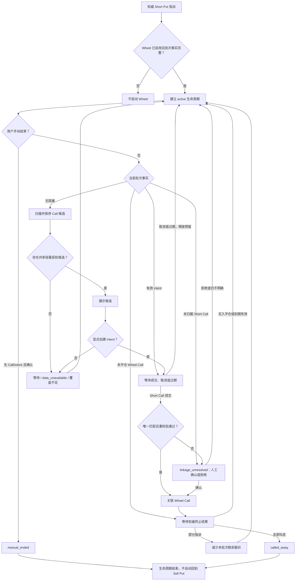

# 轮转策略（Wheel）PRD

- **状态**：已确认，待实施
- **日期**：2026-08-20
- **中文名**：轮转策略
- **英文名**：Wheel
- **内部标识**：`wheel`
- **文档性质**：产品需求与实现合同；方法级边界是实施约束，不要求按小节拆分代码

## 1. 背景

Sell Put 被指派后，用户已经持有交割正股。Wheel 监控这一批正股，在愿意以不低于正股
保本底线的价格卖出时推荐 Covered Call，直到正股被 Call 行权卖出或用户手动结束。

Wheel 是单向生命周期，不是无限循环：



终止后不自动回到 Sell Put。

## 2. 产品目标

1. 从可审计的 Sell Put 指派事实建立批次级 Wheel 监控。
2. 在不降低正股保本卖出底线的前提下，优先推荐被行权后生命周期净收益更高的 Call。
3. 统一管理普通 Covered Call 和 Wheel Covered Call 的股票覆盖额度，防止 Short Call 合计超过持股。
4. 复用现有 Covered Call 的行情、费用、波动率、流动性、容量和候选快照能力。
5. 以独立策略合同接入现有扫描链路，使新增 Wheel 不会在未声明的情况下改变既有策略的候选、交易归属、生命周期或报告结论。

## 3. 非目标

V1 不包括：

- 自动下单、自动平仓、自动行权或自动滚动 Call；
- Wheel 结束后自动重新卖出 Put；
- `max_lifecycle_days` 或其他自动超时结束机制；
- 除息日、股息和财报日过滤；
- 普通正股卖单与 Wheel 批次的新归属、拆分或解析工具；
- 跨 `stock_lot_id` 合并一个 Wheel 生命周期；
- 仅根据同一账户、标的、成交时间或持股数量做模糊评分，自动猜测 Short Call 属于哪个批次；
- 复用普通 Covered Call 的启用状态、watchlist 或 symbol 配置作为 Wheel 的启动条件。
- 将策略拆成微服务、引入动态插件平台，或为接入 Wheel 重写全部现有策略。

## 4. 启动与批次

### 4.1 启动条件

Wheel 仅在以下条件全部成立时启动：

- 目标账户和市场已启用 `wheel`；
- 权威成交与交割事实证明 Short Put 已被指派；
- 指派已生成唯一 `stock_lot_id`，股数、交割价、费用、账户、币种和时间完整。

权威事实可来自 broker 同步或现有的人工确认写入路径。不得根据 ITM、到期日或市场价格
推测指派。

Combo Yield 的 `funding_put` 被权威指派后也可启动 Wheel。原 Combo 的
`participation_call` 继续按 Long Call 的独立仓位和生命周期管理，不占用正股覆盖
额度，其平仓、到期或行权不改变 Wheel 状态。

### 4.2 批次边界

- 一个 `stock_lot_id` 对应一个 Wheel 生命周期。
- 同一账户、同一标的可同时存在多个 Wheel 批次，但不合并成本或收益。
- 每个批次最多推荐 `floor(当前可用批次股数 / multiplier)` 张 Call。
- 不足一张合约的剩余股数保留为 `residual_stock`，不跨批次凑整。

### 4.3 交易监控与策略归属

Wheel 不新增独立交易监听进程。开仓、平仓、到期、指派和股票交割继续通过现有
trade intake、生命周期核对和 SQLite option-position ledger 形成权威事实。Wheel 只消费
已确认事实，不根据持仓消失或合约价格推测交易结果。

现有期权仓位状态保持 `open` / `close`；买入平仓、到期失效和指派继续由现有终止
事件区分。不增加 `wheel_call_open`、`wheel_expired` 或其他 Wheel 专属期权状态。

策略归属必须使用显式身份：

| 交易 | `strategy` | `strategy_group_id` | `leg_role` | Call lot `source_stock_lot_id` |
|---|---|---|---|---|
| Combo Funding Put | `combo_yield` | 必填 | `funding_put` | 无 |
| Combo Long Call | `combo_yield` | 必填 | `participation_call` | 无 |
| 已确认 Wheel Short Call | `wheel` | 禁止 | `wheel_call` | 必填 |
| 普通 Covered Call | `sell_call` | 禁止 | 保持现有值 | 无 |

- Combo Long Call 和 Wheel Short Call 独立开仓、平仓和结算，不互相改变状态。
- Combo 指派正股可保留原 `strategy_group_id` 作为来源血缘；Wheel Short Call 只通过
  Call lot 的 `source_stock_lot_id` 关联正股批次，不复制该 `strategy_group_id`。
- Broker 成交数据不承载 OM 内部 `stock_lot_id`。该值由本地归属确认生成，
  不得伪装成 broker 成交字段。
- 无法唯一证明 `stock_lot_id` 的 Short Call 仍计入账户+标的级覆盖占用，但不计入任一
  Wheel 生命周期；对应批次进入 `linkage_unresolved` 并停止新推荐，不猜测归属。
- Combo 和 Wheel 可各自展示同一来源事件的生命周期上下文，但账户或投资组合汇总必须按
  底层成交事件去重，不得重复计入同一 Funding Put 权利金或正股损益。

### 4.4 Wheel Call 自动确认批次

候选展示不代表用户已采用。只有用户或 Agent 在成交前明确选择 Wheel 候选并创建
`wheel_call_intent`，成交后才可能自动关联批次；该操作只记录本地意图，不向 broker
下单。Intent 固定账户、`stock_lot_id`、合约、数量、multiplier、候选快照和显式
`expires_at_ms`，可取得时同时记录 broker order ID，并在有效期内预留相应覆盖股份。

trade intake 仅在成交唯一精确匹配有效未消费 intent，且重新校验批次、成交归属、
剩余股份和账户+标的级总覆盖均通过时，原子写入 Call 归属并消费 intent。无 intent、
多 intent、多批次、策略冲突、事实变化或覆盖不足时禁止自动归属；实际未平仓 Short Call
仍立即计入共享覆盖，并进入 `linkage_unresolved` 供人工确认或拒绝。

Intent 过期由显式 `expires_at_ms` 和 `as_of_ms` 派生，不新增过期事件或自动延长；迟到
成交按 `occurred_at_ms` 判断成交发生时是否仍有效。取消或失效会释放未消费预留，
成交成功则将预留原子转换为实际 Short Call 锁定。

同一订单的多笔部分成交可在 intent 数量和覆盖容量内逐笔累计，但单笔 fill 不拆分，
也不跨 Wheel 批次分配。完整方法合同见 11.4、11.8 和 11.9。

## 5. Covered Call 候选

### 5.1 独立配置，复用策略能力

Wheel 在 `wheel` 命名空间维护独立配置，不在运行时读取普通 `sell_call` 的 symbol 配置。
实现应复用 canonical Covered Call 的规则、配置解析器和 Candidate Engine，不建立平行扫描器或排序器。

V1 配置包含：

- `enabled`；
- DTE 窗口 `30..45` 个日历日；
- Call Delta 硬底线 `delta >= 0.30`；
- 年化净权利金收益硬底线 `10%`；
- 单张合约净收入折算不低于 `CNY 50`；
- spread 硬上限 `0.40`；
- 独立的 `min_iv_rv_ratio` 和 `min_iv_minus_rv`，语义与 canonical Covered Call 相同。

Intent 有效截止时间是每次创建操作的显式输入，不是 Wheel 配置项。

关键行情、Delta、IV/RV、价差、multiplier 或费用证据缺失时 fail closed，不生成候选。

### 5.2 Strike 底线

Put 权利金和之前收到的 Call 权利金不得降低正股卖出底线。对每个候选，必须同时满足：

```text
strike >= live_spot

strike * covered_shares - estimated_stock_exit_fees
  >= allocated_remaining_stock_cost_basis
```

`allocated_remaining_stock_cost_basis` 来自该 `stock_lot_id` 的真实指派本金和交割费用，并与
`covered_shares` 使用相同的股数范围。无法证明批次成本或预计卖出费用时返回等待，不以权利金或聚合
broker `average_cost` 填补。

### 5.3 收益与排序

本轮 Call 继续复用 Covered Call 的当前市值分母：

```text
covered_market_value = live_spot * covered_shares
period_net_premium_return = candidate_call_net_premium / covered_market_value
annualized_net_premium_return = period_net_premium_return * 365 / DTE
```

候选通过全部硬门槛后，按“本轮 Call 被行权后的预计生命周期净收益”降序排序：

```text
projected_lifecycle_net_pnl_if_called
  = realized_sell_put_net_pnl
  + realized_prior_call_net_pnl
  + realized_prior_stock_sale_net_pnl
  + candidate_call_net_premium
  + projected_remaining_stock_sale_net_pnl_at_strike
```

- `realized_prior_stock_sale_net_pnl` 只包含由关联 Wheel Call 权威交割已卖股份的实际净收入，
  减去这些股份对应的原始指派成本。
- `projected_remaining_stock_sale_net_pnl_at_strike` 只覆盖本轮候选的
  `candidate_covered_shares`，使用同一股数范围的剩余指派成本和预计卖出费用。
- 已卖股份成本只进入已实现正股损益，未卖股份成本只进入预计剩余正股损益；
  Put 和 Call 权利金保持为独立期权收益，不重复转入正股成本。
- 过去事实使用已记录的真实费用；本轮未成交候选使用明确标注的估算费用。
- 普通正股卖出不自动计入任一 Wheel 批次；因此无法完整归属股数、成本、收入或费用时，
  不输出完整生命周期收益。
- 预计生命周期收益率使用同一 `covered_market_value` 作分母，不再年化。
- DTE 不单独优先；只有在预计净收益相同时，才复用 Covered Call 的执行质量和稳定排序规则。

只有当本轮候选覆盖批次全部剩余股份、且被行权后不留下 `residual_stock` 时，
才将该指标标注为“最终全部叫走后预计总收益”。容量分配后本轮只覆盖部分剩余股份时，
标注为“本轮行权后预计累计净收益”，不假设未覆盖股份的未来售价或权利金。

### 5.4 期权数据需求与取数

- 活跃 Wheel 批次的 symbol 必须进入全局 required-data 计划，即使该 symbol 不在普通
  Covered Call watchlist 中或普通 Covered Call 未启用。
- Wheel 按活跃批次提交 Call 侧 DTE、strike 区间和 IV/RV 数据需求；多批次及其他策略
  的同侧需求由全局 planner 合并。
- 同一 Tick 复用全局取数计划和同一份冻结快照，不为 Wheel 建立第二套合约链、
  缓存或行情目录。
- 快照未覆盖 Wheel 的确切需求时返回 `data_unavailable`，不得降级为“无候选”。

## 6. 共享持股覆盖

正股在 broker 层面是可替换的。V1 不判断卖出的是“原有持股”还是“Wheel 持股”，只维护一个账户+
标的级覆盖不变式。容量键为 `(account, canonical_symbol)`：

```text
eligible_shares = min(opend_qty, opend_can_sell_qty)

all_open_short_call_locked_shares
  + active_call_intent_reserved_shares
  + current_tick_recommendation_reserved_shares
  <= eligible_shares
```

其中：

- `all_open_short_call_locked_shares` 包含普通 Covered Call、Wheel Call 和尚未确认策略归属的
  全部未平仓 Short Call；
- `active_call_intent_reserved_shares` 包含所有有效且未消费的显式 Call 交易意图；
- `current_tick_recommendation_reserved_shares` 只包含当前冻结 Tick 最终准备展示的开仓动作，
  不把同一批次的备选合约当成多笔交易重复预留。

每个 Tick 从权威持股、ledger 和有效 intent 重新计算可推荐余额：

```text
recommendation_capacity
  = max(
      0,
      eligible_shares
        - all_open_short_call_locked_shares
        - active_call_intent_reserved_shares
    )
```

候选先在各自策略和批次内完成硬门槛与排序，然后只将每个可执行动作的首选候选交给共享
分配器。分配顺序固定为：

1. Wheel 批次；
2. 普通 Covered Call。

多个 Wheel 批次之间不使用历史生命周期收益竞价，而按 `assignment_at` 升序、
再按 `stock_lot_id` 稳定排序。同一批次内仍选择预计生命周期净收益最高的 Call。

每个动作的获批张数为：

```text
granted_contracts
  = min(requested_contracts, floor(capacity_before / multiplier))

capacity_after
  = capacity_before - granted_contracts * multiplier
```

- `granted_contracts = 0` 时不展示开仓建议，返回覆盖股份不足；
- 获批张数小于请求张数时，将建议张数降为获批值；
- 本 Tick 的推荐预留不持久化，重复组装同一冻结快照必须得到同一分配结果；
- 候选快照必须保留 `requested_shares`、`granted_shares`、`capacity_before`、
  `capacity_after` 和 `allocation_reason`，Daily Brief 只展示最终张数或一个覆盖不足原因。

额外要求：

1. 所有未平仓 Short Call 使用同一 SQLite option-position ledger 计算锁定股数。
2. Wheel Call 和普通 Covered Call 不得各自计算一份可用持股。
3. 已锁定股数和有效 intent 预留超过 `eligible_shares` 时，输出高风险覆盖不足，
   并停止该账户+标的的所有新 Call 推荐。
4. 普通正股卖出只通过新的 OpenD 持仓事实改变覆盖容量；V1 不为此新增 Wheel 卖单归属工作流。
5. 该分配只约束 OM 候选和意图，不能阻止用户绕过 OM 在 broker 手动卖出额外 Call；
   这类成交被同步后必须立即计入锁定股数并报告覆盖不足。

## 7. 生命周期规则

- 当关联 Call 未平仓或成交结果待确认时，不推荐新 Call。
- Call 到期失效或买入平仓后，其净收益进入生命周期累计，下一轮重新扫描。
- Call 部分行权时，按关联 Call 的确定股数减少该批次可监控股数。
- Call 行权后仍有至少一张合约的股数时，继续 Wheel；不足一张时显示 `residual_stock`。
- 关联 Call 将批次正股全部叫走时，生命周期以 `called_away` 结束。
- 普通正股卖出不自动判定 Wheel 完成；用户不再继续时使用手动结束。
- 任何行权、交割或平仓证据不完整时 fail closed，不自动转换生命周期状态。

### 7.1 Wheel 状态模型

Wheel 对外只展示三个批次生命周期状态：

```text
active
called_away
manual_ended
```

以下是由当前交易、持股、数据和关联事实派生的运行阶段，不是新的期权仓位状态：

```text
ready
call_pending
call_open
residual_stock
linkage_unresolved
data_unavailable
```

投影器分别输出 `lifecycle_status`、`phase` 和
`integrity_status`。`lifecycle_status` 只使用上述三个批次生命周期状态；`phase` 只在
活跃生命周期内描述当前运行阶段，其中 `call_pending` 表示已有有效且未消费的 Call
intent、但尚未形成关联未平仓 Call。`integrity_status` 只使用 `trusted` / `conflict`；
终态、交割或关联事实矛盾时输出 `conflict` 并停止推荐，不把事实冲突包装成新的生命周期状态。

投影先判断完整性，再判断终态；可信且仍活跃时按以下优先级选择唯一主阶段：

```text
linkage_unresolved
-> call_open
-> call_pending
-> residual_stock
-> data_unavailable
-> ready
```

`integrity_status=conflict` 时不继续选择运行阶段；`called_away` 或 `manual_ended` 时
`phase=null`。同一批次同时存在的其他事实进入 `reason_codes`，不扩展组合状态枚举。
不存在 `wheel_started` 的指派不产生 Wheel 投影记录。

Call 开仓、买入平仓、到期失效和部分指派仅改变派生运行阶段；只有全部叫走或用户手动
结束才将批次转为终止状态。

生命周期状态必须从可审计的持久事实重建，不得从当前持股是否存在临时推算。
每个生命周期使用 `(account, stock_lot_id)` 作为唯一身份，并保留：

- `wheel_started`：Wheel 已启用时发生的权威 Sell Put 指派，必须引用确切指派事件；
- `wheel_called_away`：关联 Wheel Call 的权威交割累计卖出该批次全部剩余股份，
  必须引用确切 Call 结算事件；
- `wheel_manual_ended`：用户手动结束的确认事实，必须保留 actor、事件时间、请求身份和确认输入。

`called_away` 和 `manual_ended` 互斥且是正常业务流程中的不可逆终态。相同
`stock_lot_id` 不得因服务重启、指派重放、配置重载或持股重新出现而启动新生命周期。

当前持股归零或消失不能单独证明 `called_away`；普通正股卖出也不产生
`wheel_called_away`。部分叫走只减少剩余股份。行权、交割或终态事实冲突时必须
fail closed，停止自动转换和新推荐；普通操作不得覆盖终态，只有受控 ledger repair
可以纠正错误事实。

Wheel 未启用时已发生的历史指派在 V1 不自动回溯创建生命周期；以后启用只处理新的
权威指派。

### 7.2 投影事实来源

投影器按事实责任消费现有权威数据：

- `wheel_events` 只决定 Wheel 启动、终止和 intent 状态；
- `trade_events -> position_lots` 决定 Call 开平仓、指派、合约数量和
  `source_stock_lot_id`；
- assigned-stock 投影决定批次成本、剩余股份和已实现正股卖出损益；
- broker 当前持股只用于账户+标的级覆盖上限和异常检查，不改变批次生命周期、
  成本或剩余股份；
- 当轮冻结行情快照只影响 `data_unavailable` 和候选结果，不改变任何持久状态。

下游扫描、报告和 Agent 必须消费同一 Wheel 投影视图，不得各自重新解释这些事实。

### 7.3 手动结束

Wheel 不设最长生命周期。用户只能在没有关联未平仓 Call、且没有有效未消费
`wheel_call_intent` 时手动结束：

```bash
./om wheel end \
  --account lx \
  --stock-lot-id <id> \
  --expected-batch-generation-hash <hash> \
  --request-id <id> \
  --actor <actor> \
  --dry-run
```

确认后使用同一 payload 执行 `--confirm`。确认写入前必须在同一 SQLite 事务内重新校验
未平仓 Call 和有效未消费 intent；任一存在时拒绝结束。手动结束：

- 只终止 Wheel 监控，不卖出正股、不平 Call、不重新卖 Put；
- 存在有效未消费 intent 时，必须先在 broker 侧撤销对应未结订单，再取消 intent；
  OM 不代替用户撤单；
- 是永久状态，不自动重启；
- 对相同终止请求幂等；
- 不删除持股、指派或历史收益事实；相关已实现和未实现收益继续进入
  position、Performance 和 portfolio 视图，只从 Wheel 扫描与 Daily Brief 候选中排除。

## 8. 读取、Agent 与写入边界

Wheel 不新增独立 `wheel_read` 工具。批次、生命周期、启动或终止来源事件、当前 Call、
候选、未消费 intent 和待确认关联从现有读取面返回：

```bash
./om-agent run --tool option_positions_read \
  --input-json '{"config_key":"us","action":"assigned-stock","account":"lx"}'
```

手动结束通过 Agent 工具 `wheel_end` 提供：

- 默认 dry-run，返回精确 `stock_lot_id`、当前状态和预计变化；
- 非 dry-run 必须启用 Agent 写工具并传入 `confirm=true`；
- 有未平仓 Call、有效未消费 intent、账户不匹配或批次不唯一时拒绝写入；
- Agent 不获得下单、卖股或平仓权限。

Agent 同时获得 Wheel Call 归属工具，用于：

- 将精确候选标记为“采用该 Wheel 推荐”，创建 `wheel_call_intent` 时显式提供
  `expires_at_ms`，或取消已有 intent；
- 对无法自动确认的唯一候选关系执行人工确认或拒绝；
- 所有写入默认 dry-run，确认时要求精确 intent 或候选 ID、输入快照 hash、
  `stock_lot_id`、actor 和 `confirm=true`；
- 应用前重新校验成交、批次、归属和覆盖容量；相同有效请求幂等。

该工具只写入本地意图或归属事实，不向 broker 提交、修改或取消订单。

## 9. Daily Brief

Wheel 接入现有 canonical tick 编排和 Daily Brief，不新增 scheduler 或通知通道。策略展示顺序为：

```text
Sell Put -> Covered Call -> Combo Yield -> Wheel
```

Wheel 区块每个批次最小展示：

- symbol 和剩余股数；
- 推荐张数、到期日和 strike；
- 本轮预计净权利金；
- 覆盖全部剩余股份时展示“最终全部叫走后预计总收益”，否则展示
  “本轮行权后预计累计净收益”；
- 当前状态，或无候选时的一个主要原因。

账户使用报告区块的现有上下文；只在同一账户+标的存在多个 Wheel 批次时展示短化批次 ID。

## 10. 失败与等待语义

- 当前没有通过硬门槛的 Call 是合法等待，不是系统故障。
- 行情、持仓、锁定股数、批次成本或 ledger 不可用时返回 `data_unavailable`，不冒充无候选。
- 已有 Call 或可覆盖股数不足时返回明确等待原因。
- 已锁定 Short Call 超过持股时返回高风险覆盖不足，不以排序或降级候选解决。
- Wheel 自身缺少数据时只将 Wheel 标记为 `data_unavailable`；未预期的执行异常只将
  Wheel 标记为 `failed`，reason 为 `wheel_scan_failed`，不得删除其他策略结果。
- 共享 ledger 或持股事实不可信时，普通 Covered Call 与 Wheel 都停止新增 Call 推荐；
  不受该事实影响的其他策略可继续输出。
- 无论 Wheel 扫描是否成功，现有 Short Call 和有效 intent 都必须进入共享覆盖占用；
  无效 Wheel 快照不参与当轮新增容量分配。

## 11. 实现合同与上线兼容性审查

### 11.1 账本与策略事件边界

SP、普通 CC、Combo 两条腿和 Wheel Call 的经济成交继续共用现有权威链路：

```text
trade_events -> deterministic projection -> position_lots
```

ledger 核心不新增 Wheel 专属期权状态，也不把策略枚举作为成交接受条件。
`assigned_stock_events` 只保留已指派正股的真实 sale 事实，不承载 Wheel intent、
手动结束或其他策略控制状态。Combo 继续使用现有 identity/inference 表，不因
Wheel 修改两腿关系合同。

Wheel 在同一 option-position SQLite 和同一 ledger API 写入边界内新增一张
追加式 `wheel_events`，仅记录：

```text
wheel_started
wheel_manual_ended
wheel_called_away
wheel_call_intent_created
wheel_call_intent_cancelled
wheel_call_intent_consumed
wheel_call_linkage_rejected
wheel_event_voided
```

`wheel_events` 至少固定 event ID、account、`stock_lot_id`、event type、
`occurred_at_ms`、`recorded_at_ms`、
可选 intent ID、可选来源 trade event ID、payload 和 payload hash。当前批次、intent 剩余数量和
终止状态由 `wheel_events + trade_events + position_lots` 确定性投影，不新增可变
Wheel 状态表、独立 SQLite 或通用 `strategy_events` 平台。

每个 Wheel 事件使用稳定、可重建的 `event_id`：系统事件绑定确切来源交易或交割事件，
人工事件绑定稳定 request ID，intent 转换绑定 intent ID。相同 `event_id` 且 payload hash
一致的重放是幂等 no-op；相同 `event_id` 但 payload 不同必须冲突并回滚。同一批次出现
重复启动、竞争终态或矛盾 intent 时，投影器输出 `integrity_status=conflict`，不得按时间、
写入顺序或任意优先级自动择一。

`occurred_at_ms` 表示业务事实发生时间，`recorded_at_ms` 表示事件入账时间。投影器依据
事件类型、来源引用和完整事件集合重建状态，不采用 last-write-wins；`recorded_at_ms`
仅用于审计。intent 有效期和成交归属使用 `occurred_at_ms`。迟到或乱序事件触发相同的
确定性重投影；若与终态、既有归属或因果引用冲突，则进入
`integrity_status=conflict`，不得覆盖先前事实。

`wheel_event_voided` 仅供受控 ledger repair 使用，必须引用确切
`target_wheel_event_id`，并记录 actor、原因、稳定 request ID 和确认输入。对相同目标和
请求的重试必须幂等；投影器排除已被有效 void 的 Wheel 事件，但不修改或伪造底层
broker、`trade_events`、`position_lots` 或 assigned-stock 事实。普通业务工具不得创建
该事件，也不得直接更新或删除已有 `wheel_events`。

指派最终确认时，权威 assignment 与 `wheel_started` 必须在 Wheel 启用且股票批次完整的
同一 SQLite 事务内提交；已存在但没有 `wheel_started` 的历史指派不由扫描器后补。
已确认 Wheel Short Call 在 `position_lots` 使用可选一等字段 `source_stock_lot_id`。
自动确认时，Call open event、lot 归属和 intent 消费必须在同一 SQLite 事务完成；
人工后补通过追加 `adjust` event 投影该字段，不改写原始 open event。Call 被指派时，
正股 sale 必须从来源 Call lot 继承该字段；批次全部叫走后的
`wheel_called_away` 与权威交割事实同事务写入。

V1 复用现有 SQLite 事务包装器，不新增 Unit of Work、事件总线或异步补偿流程。事务
责任按权威写入动作划分：broker 交割确认和人工指派确认分别在各自现有的 assignment
原子写入中追加 `wheel_started`；Wheel Call 成交使用窄用途的确认入口，参考 Combo 的
成交后确认模式，但只写入 Call open、`source_stock_lot_id` 和 intent 消费；Wheel Call
指派继续由现有生命周期交割写入同时产生正股 sale 和 `wheel_called_away`。任一步校验
或持久化失败时整笔事务回滚，扫描器、报告器和异步监听器不得在提交后补写这些事件。

数据库迁移只新增 `wheel_events` 表，并扩展现有 canonical lot 投影 schema。
`source_stock_lot_id` 作为一等 lot 字段保存在 `position_lots.fields_json`，不增加表达同一
事实的重复 SQL 列。升级时从原有 `trade_events` 重建 `position_lots`；既有事件和 lot
不回写、不猜测 Wheel 归属，缺少该字段时保持缺失。迁移不为历史指派创建
`wheel_started`；`wheel.enabled=false` 且账户没有未结束 Wheel scope 时，业务输出必须保持基线不变。

### 11.2 方法级复用与改造边界

Wheel 优先复用现有纯函数和权威写入边界，不复用携带普通 Covered Call
配置、容量或报告语义的完整 application scan。

直接复用的现有方法：

- `run_candidate_scan()`：从冻结数据构建规范化的 Call 候选宇宙；
- `calculate_opening_candidate_metrics()`：复用费用、IV/RV、CNY 折算和 Covered Call
  市值口径；
- `evidence_summary_from_decisions()` 和 `project_evidence_scan_status()`：复用证据与
  `data_unavailable` 语义；
- `build_candidate_rank_key()`：仅作为 Wheel 主排序键相同时的稳定次级键；
- `calc_futu_stock_fee()` 和 `assigned_stock_fee_fact()`：复用正股费用事实；
- `project_assigned_stock_lifecycle()`：作为正股批次成本、剩余股数和生命周期
  收益的唯一经济口径；
- `compute_sell_call_share_capacity()` 和 `compute_short_call_locked_shares()`：复用
  Short Call 覆盖股数计算；
- `prefetch_required_data()` 和 `seal_required_data_snapshot()`：复用全局取数与
  冻结快照；
- `with_sqlite_repo_transaction()`：复用现有 SQLite 事务边界；
- Agent 写工具继续复用现有权限门禁和 `write_gate_error()`。

需要修改的现有方法或 owner：

- `evaluate_opening_candidate_policy()` 允许 Wheel 显式关闭普通 Call 默认的
  `minimum strike * 1.20` 隐式上限，不改变普通 Covered Call 基线；
- `position_fields.py` 的策略字段、开仓投影、调整 patch 和读模型增加可选
  一等字段 `source_stock_lot_id`；
- `persist_trade_event_objects_atomically()` 和 `apply_lifecycle_allocation_atomically()`
  支持在同一事务内插入精确 Wheel companion event；
- `_sync_covered_call_allocations()` 优先使用 lot 最终字段中的
  `source_stock_lot_id`，然后才使用事件 payload 或已有链接事实；
- trade intake 在现有 `persist_trade_event_fn` 注入点接入 Wheel 成交确认，
  不重写 resolver 或新增交易监听进程；
- required-data planner 在全局 prefetch 前合并活跃 Wheel 批次的 Call 需求；
- 共享容量 owner 增加一个通用开仓分配入口，支持 Wheel 优先级、稳定
  批次顺序和部分 grant；
- 现有配置验证、candidate snapshot manifest、`assigned-stock` 读取、Agent
  工具注册、Daily Brief 和 CLI 路由只增加 Wheel 的必要分支。

新增方法限于：

- Domain Wheel：Wheel 事件校验、生命周期纯投影、候选经济规则、排序和
  `wheel_started_event_from_assignment()`；
- Application Wheel：启动/结束、intent 创建/取消/消费、Call 归属确认、
  Wheel 扫描和统一读模型组装；
- Wheel candidate snapshot：封存、读取和输入绑定验证；
- `src/interfaces/cli/wheel.py`：只做薄适配，不放业务规则。

以下现有能力不得不加修改地复用：

- 普通 Covered Call 的完整 `run_sell_call_scan()` 和
  `run_sell_call_scan_and_summarize()`；
- `rank_candidate_rows(mode="call")`，其主排序口径不是 Wheel 的最终叫走总收益；
- 未修改的 `allocate_portfolio_capacity_shadow()`，其不支持 Wheel 优先级或部分
  grant；
- Combo 的 group、pair 或 membership 身份模型；Wheel 只复用其 dry-run、CAS、
  事务内重验证和 fail-closed 模式。

### 11.3 Sell Put 指派启动的原子方法链

现有指派有三个业务入口，但最终只汇入两个原子写入器：

```text
Broker lifecycle V2 -> apply_lifecycle_allocation_atomically()
Broker legacy -------\
                       -> persist_trade_event_objects_atomically()
人工指派 -------------/
```

assigned-stock 批次 ID 继续使用现有确定性规则：

```text
stock_lot_id = "assigned-stock-" + assignment_event_id
```

因此不需要在事务提交后重新查询批次，也不得由扫描器事后补写。

方法责任固定为：

1. 上层根据当前市场和账户配置计算 `wheel_start_enabled`，只向下传递该布尔
   决策；ledger 不读取 Wheel 配置。
2. `wheel_started_event_from_assignment()` 只消费已经权威确认的 assignment
   event，验证 Short Put、正股买入交割、股数、价格、费用、账户、币种和时间，
   生成引用确切 assignment event 和 `stock_lot_id` 的 `wheel_started`。
3. `persist_assignment_events()` 将 legacy 和人工指派的启动决策传入
   `persist_trade_event_objects_atomically()`。
4. V2 reconciliation 在已生成精确 `terminal_events` 后，将启动决策传入
   `apply_lifecycle_allocation_atomically()`。
5. 两个原子写入器都在 assignment trade event 新建成功后、事务提交前，插入
   对应 `wheel_started`；任一校验、投影或 Wheel 事件写入失败时整笔回滚。

重放语义固定为：

- assignment 和对应 `wheel_started` 都已存在且 payload hash 一致：幂等 no-op；
- 本次新建 assignment：必须同事务新建 `wheel_started`；
- assignment 早已存在但没有 `wheel_started`：视为历史指派，禁止后补；
- Wheel event ID 相同但 payload hash 不同：冲突并回滚；
- `wheel_start_enabled=false` 或 assignment 不是 Short Put 买入交割：不生成 Wheel
  事件，现有指派行为保持基线。

### 11.4 Wheel Call Intent 成交确认的原子方法链

Short Call 成交继续进入现有 trade intake，不新增交易监听器、resolver 或独立
状态机。`auto_intake` 只在现有 `persist_trade_event_fn` 注入点传入
Wheel-aware 持久化方法，其他成交仍走现有写入路径。

新增的核心写入方法为：

```text
persist_trade_event_with_wheel_intent(repo, deal, coverage_fact)
```

该方法仅特殊处理 Short Call Open，并在一个 SQLite 事务内：

1. 复用现有成交标准化、broker 外部事件键和 Open event 构造；
2. 按 fill `occurred_at_ms` 匹配唯一、有效且未消费的 `wheel_call_intent`；
3. 重新校验批次活跃状态、剩余股份、intent 剩余数量、策略冲突和账户+标的级
   共享覆盖容量；
4. 成功时在 Call Open event 中写入 `strategy=wheel`、`leg_role=wheel_call` 和
   `source_stock_lot_id`，同事务写入引用 intent 与该 Open event 的
   `wheel_call_intent_consumed`；
5. 完成 position lot 和 Wheel 投影后回读，确认 Call lot 的正式字段已指向预期
   `source_stock_lot_id`，再提交事务。

无意图、多意图、意图失效、数量超限、容量不足、批次终止或策略冲突属于
预期的归属失败：系统仍使用原成交事件记录未归属 Short Call，不消费 intent，
并立即将该 Call 计入共享覆盖占用。只有 ledger 一致性、投影或写入回验失败时，
整个 trade intake 写入回滚并等待幂等重试。

自动确认只在首次持久化 Open event 时执行。已入账的未归属 Call 不通过 broker
成交重放补关联；后续关联必须走显式的人工 dry-run/confirm 流程，以确定性
adjust event 设置 `strategy`、`leg_role` 和 `source_stock_lot_id`，不改写原 Open event。

部分成交按 broker fill 逐笔处理：每笔 fill 可整笔消费 intent 的剩余数量，但不允许
拆分单笔 fill。若该 fill 超过 intent 剩余数量或可覆盖容量，该 fill 整笔保持未归属，
不进行费用分摊、经济事件拆分或跨 Wheel 批次分配。

### 11.5 Wheel Call 终止与叫走的原子方法链

Wheel Call 继续使用现有期权终止事件，不新增 Wheel 专属期权状态：

```text
Wheel Short Call
  -> close        -> 释放 Call 锁定，Wheel 批次继续
  -> expire_close -> 释放 Call 锁定，Wheel 批次继续
  -> assignment   -> 减少关联正股批次的剩余股份
                       -> 仍有剩余：Wheel 批次继续
                       -> 精确归零：wheel_called_away
```

买入平仓和到期失效完全复用现有 close/expire 写入、经济分配和 position lot
投影，不生成 Wheel 事件。Call 解除后，投影器根据其他未平仓 Call 和批次剩余
股份派生 `call_open`、`ready` 或 `residual_stock`，不由终止写入器保存运行阶段。

Call Assignment 继续通过现有两个原子 owner 提交：

- lifecycle V2 使用 `apply_lifecycle_allocation_atomically()`；
- legacy 和人工确认使用 `persist_trade_event_objects_atomically()`。

V2 `_terminal_event()` 和 legacy `_lifecycle_close_event()` 都必须从最终 Call lot 继承
`strategy`、`leg_role` 和 `source_stock_lot_id`。不得从账户、标的、时间或当前持股
反向猜测该字段。

新增纯判断方法：

```text
wheel_called_away_event_from_call_assignment(
    terminal_event,
    source_call_lot,
    stock_lot_before,
    stock_lot_after,
)
```

该方法只在以下条件全部成立时受理 Wheel 转换：

1. 本次新建终止事件是 Short Call `assignment`；
2. 来源 Call lot 为 `strategy=wheel`、`leg_role=wheel_call`，并有唯一
   `source_stock_lot_id`；
3. 正股交割方向为卖出，且交割股数等于 `contracts * multiplier`；
4. 交割前后的 assigned-stock 投影证明同一 `stock_lot_id` 精确减少了该股数。

若交割后 `shares_remaining > 0`，只保留权威 assignment 和正股 sale 事实，不写入
Wheel 事件；运行阶段由剩余 Call 和股份继续派生。只有使该 `stock_lot_id` 的账本
`shares_remaining` 精确变为 0 的 Call Assignment，才在同一 SQLite 事务内追加
确定性 `wheel_called_away`，并将其来源绑定到该 assignment event。

已归属 Wheel 的 Call 如缺失精确批次、交割数量不一致、批次减少不精确或
Wheel 终态冲突，则整个 assignment 原子写入回滚。普通或未归属 Call 继续现有
assignment 行为，不生成 Wheel 终态。

重放时，assignment 与对应 `wheel_called_away` 都存在且 payload hash 一致为幂等
no-op。已存在的 assignment 不通过重放或扫描器后补缺失的终态；若当前事实表明
应有的 `wheel_called_away` 缺失，投影进入 `integrity_status=conflict`，只能通过受控
ledger repair 纠正。

### 11.6 Wheel 即时投影与统一读模型

Wheel 不进入现有持久化 `current_decision_projection` payload，不增加 Wheel 状态表、
`wheel_generation` 列或第二套投影缓存。每次从同一 SQLite 只读快照取得
`wheel_events`、`trade_events`、`position_lots` 和 `assigned_stock_events`，再即时生成
确定性 Wheel 投影。

现有 `read_decision_state_rows_many()` 扩展账户范围的 `wheel_events` 读取，继续保证
同一快照内的事件、lot 和 assigned-stock 事实一致。不新增仅为 Wheel 服务的
仓储适配器。

新增 Domain 纯函数：

```text
project_wheel_lifecycles(
    wheel_events,
    position_lots,
    assigned_stock_projection,
    as_of_ms,
)
```

该函数负责：

1. 应用有效 `wheel_event_voided`，再按 `(account, stock_lot_id)` 分组；
2. 校验唯一启动、终态互斥、intent 消费、Call 归属和批次股份的一致性；
3. 只派生已定义的 `lifecycle_status`、`phase`、`integrity_status` 和
   `reason_codes`；
4. 从有效持久事实生成 `batch_generation_hash`，并结合显式 `as_of_ms` 和
   派生结果生成 `projection_hash`。

`batch_generation_hash` 不包含行情、broker 当前持股或系统墙上时间；intent 是否过期
使用调用方显式传入的 `as_of_ms` 派生，因此同一批权威事实下的不同时点可以
有相同 `batch_generation_hash` 但不同 `projection_hash`。

新增 Application 组装方法：

```text
build_wheel_read_model(
    repo,
    account,
    as_of_ms,
    candidate_snapshot=None,
)
```

该方法只读取一次账户快照，复用 `project_assigned_stock_lifecycle()` 的正股成本、
剩余股份和已实现收益，再调用 `project_wheel_lifecycles()`。Wheel 扫描、Daily Brief、
CLI 和 Agent 都消费该统一结果，不得各自解释状态优先级。

每个批次的最小读模型字段为：

```text
stock_lot_id
lifecycle_status
phase
integrity_status
reason_codes
shares_remaining
batch_generation_hash
projection_hash
start_event_id
terminal_event_id
active_call_lot_ids
active_intent_ids
candidate
```

`candidate` 不是生命周期事实。仅当候选快照的账户、`stock_lot_id` 和输入绑定与
当前 `projection_hash` 一致时，读模型才附加 `final_candidate`；快照缺失或已过时时
`candidate=null`，不修改批次生命周期状态。

`option_positions_read(action="assigned-stock")` 保留现有 action 和正股字段，只在批次行
增加嵌套 `wheel` 字段；不存在 `wheel_started` 时该字段为 `null`。历史已叫走批次
继续从完整 assigned-stock 生命周期投影读取，不因当前活跃 lot 已消失而丢失。

### 11.7 手动结束方法链

手动结束使用现有 CLI/Agent 写门禁、ledger store 写入目标检查和 SQLite
事务包装器，不新增 pending operation、工作流引擎或 broker 适配器：

```text
CLI ./om wheel end / Agent wheel_end
  -> end_wheel_lifecycle()
  -> with_sqlite_repo_transaction()
  -> 事务内读取与投影
  -> plan_wheel_manual_end()
  -> append_wheel_event_once()
  -> 事务内重新投影并校验
```

直接复用：

- `write_control()` 和 Agent `write_gate_error()` 负责 dry-run、确认及写权限；
- `ledger_store_write_guard()` 确认本次写入的 SQLite 目标；
- `with_sqlite_repo_transaction()` 负责 `BEGIN IMMEDIATE`、提交和回滚；
- `read_lifecycle_account_rows(account, conn)` 在同一事务内读取完整事实；
- `project_assigned_stock_lifecycle()` 和 `project_wheel_lifecycles()` 生成当前批次；
- `canonical_payload_hash()` 生成事件 payload hash；
- `attach_write_contract()` 输出 dry-run、写入结果、audit ID 和恢复提示。

新增 Domain 纯函数：

```text
plan_wheel_manual_end(
    wheel_batch,
    request_id,
    actor,
)
```

该函数只验证批次并生成待写事件，不读库也不写库。只有当批次仍为
`active`、`integrity_status=trusted`、没有未平仓 Call 且没有有效未消费 intent
时才返回 `wheel_manual_ended` 事件草案。事件 ID 由 `account + stock_lot_id +
request_id` 确定性生成，payload 保留 actor、request ID 和确认时的批次 generation。

新增 Application 入口：

```text
end_wheel_lifecycle(
    repo,
    account,
    stock_lot_id,
    expected_batch_generation_hash,
    request_id,
    actor,
    apply_changes=False,
)
```

该入口在同一 SQLite 事务内：

1. 读取账户事实并即时投影，只允许唯一精确的 `stock_lot_id`；
2. 使用 `expected_batch_generation_hash` 执行 compare-and-set；
3. 重新校验生命周期、完整性、未平仓 Call 和有效未消费 intent；
4. dry-run 只返回确切事件计划和预计前后状态；
5. 确认时追加事件，再次投影并要求 `lifecycle_status=manual_ended`、
   `phase=null` 且 `terminal_event_id` 等于本次事件；
6. 任一校验或回读失败时整笔回滚。

写入 CAS 使用 `batch_generation_hash`，不使用包含 `as_of_ms` 的
`projection_hash`。确认时刻的变化不应产生伪冲突；任何新 Wheel 事件、Call 仓位、
intent 或 assigned-stock 事实都必须改变 batch generation 并使确认失败。

新增的 repository 方法只有：

```text
append_wheel_event_once(event, conn)
```

该方法要求调用方提供活跃事务，只执行追加和事件身份校验。相同 event ID
且 payload hash 相同时返回幂等 no-op；相同 event ID 但 payload hash 不同时拒绝并
回滚。它不提供 Wheel 事件更新或删除能力。

CLI 将 `wheel end` 作为高风险本地 ledger 写入接入现有写控制；`--dry-run`
为默认行为，`--confirm` 才进入应用写入分支。Agent `wheel_end` 直接调用
`end_wheel_lifecycle()`，不启动 CLI 子进程；默认 `apply=false`，只有写工具已
启用且同时传入 `apply=true` 和 `confirm=true` 时才可写入。两个入口都不得
下单、撤单、卖股或平仓。

输出至少包含 `stock_lot_id`、`event_id`、`request_id`、
`batch_generation_hash`、`lifecycle_status_before`、`lifecycle_status_after`、`dry_run`、
`write_applied` 和 `audit_id`。已有相同有效请求返回幂等结果，不重复追加事件。
普通入口不提供撤销手动结束；事实写错时仍只能通过受控
`wheel_event_voided` repair 纠正。

### 11.8 Wheel Call Intent 方法链

Intent 只有创建、取消和成交消费三种事实转换，继续使用追加式
`wheel_events` 和即时投影，不新增 intent 状态表或通用状态机：

```text
创建 intent -> wheel_call_intent_created
取消 intent -> wheel_call_intent_cancelled
成交消费 -> wheel_call_intent_consumed
```

直接复用：

- Wheel candidate snapshot 的加载、内容 hash、`final_candidate_id` 和批次输入绑定校验；
- `build_wheel_read_model()`、`project_assigned_stock_lifecycle()` 和
  `project_wheel_lifecycles()`；
- `compute_sell_call_share_capacity()` 和 Short Call 锁定股数计算；
- `with_sqlite_repo_transaction()`、`append_wheel_event_once()` 和现有 CLI/Agent
  写门禁。

新增三个 Domain 纯计划方法：

```text
plan_wheel_call_intent_create(
    batch,
    final_candidate,
    coverage_fact,
    expires_at_ms,
    request_id,
    actor,
    broker_order_id=None,
)

plan_wheel_call_intent_cancel(
    batch,
    intent,
    request_id,
    actor,
    broker_order_inactive_confirmed,
    reason,
)

plan_wheel_call_intent_consume(
    batch,
    intent,
    fill,
    coverage_fact,
)
```

这三个方法只校验输入并生成确切的 Wheel 事件计划，不读取或写入
SQLite，不调用 broker。创建、取消和每笔 fill 消费分别使用稳定 request
ID、intent ID 和 Open event ID 生成确定性事件 ID；同一有效请求重试为
幂等 no-op。

创建入口为：

```text
create_wheel_call_intent(
    repo,
    candidate_snapshot,
    account,
    stock_lot_id,
    final_candidate_id,
    expected_snapshot_hash,
    expected_batch_generation_hash,
    expires_at_ms,
    request_id,
    actor,
    coverage_fact,
    broker_order_id=None,
    apply_changes=False,
)
```

创建时必须绑定精确的 `stock_lot_id + final_candidate_id + snapshot hash +
batch generation`。Intent 数量直接使用最终候选的 `granted_contracts`；V1 不接受
用户改写数量，也不在确认时自动降低数量。`expires_at_ms` 必须显式提供且
晚于确认时刻；可选 broker order ID 不得同时绑定到另一个有效 intent。

该入口在事务内重新投影批次，执行 batch generation CAS，校验候选、批次、
未平仓 Call、已有 intent、未解决归属和当前共享覆盖容量。候选、批次或
容量已变化时返回 `stale_snapshot`，不写入事件并要求重新扫描。确认写入后
必须在同一事务回读到 `phase=call_pending`、预期 intent ID 和对应的共享覆盖
预留，否则整笔回滚。

取消入口为：

```text
cancel_wheel_call_intent(
    repo,
    account,
    stock_lot_id,
    intent_id,
    expected_batch_generation_hash,
    request_id,
    actor,
    broker_order_inactive_confirmed,
    reason,
    apply_changes=False,
)
```

取消时必须显式传入 `broker_order_inactive_confirmed=true`，表示用户已确认 broker
侧不存在仍有效的对应订单；该字段是人工确认事实，不冒充 broker 回读证据。
部分成交后的取消只取消剩余未消费数量，已关联的 Call 不受影响。已全部消费、
已取消或已过期时返回 `already_inactive`，不追加无意义事件。写入后必须回读确认
该 intent 的未消费预留已释放。

成交消费不新增第二个入口，继续由 11.4 的方法处理：

```text
persist_trade_event_with_wheel_intent(repo, deal, coverage_fact)
```

只有 trade intake 首次写入 Short Call Open 时才调用消费计划。每笔 fill 不拆分；
消费事件 ID 由 intent ID 和 Open event ID 确定性生成。匹配成功时 Call Open、
`source_stock_lot_id` 和 `wheel_call_intent_consumed` 同事务提交；匹配失败时
仍记录未归属 Short Call，不消费 intent，但立即计入账户+标的共享覆盖占用。

CLI 使用 `./om wheel intent create|cancel`。Agent 只新增一个
`wheel_call_intent` 工具，以 `action=create|cancel` 区分；默认 `apply=false`，写入时
要求 Agent 写工具已启用并同时提供 `apply=true` 和 `confirm=true`。成交消费不暴露
为 CLI 或 Agent action，两个人工入口也不下单或撤单。

### 11.9 Wheel Call 人工归属确认与拒绝

未自动归属的 Open Short Call 使用即时候选关系完成人工确认或拒绝，
不新增 inference 表、持久候选快照或 Combo identity：

```text
未归属 Short Call
  -> 即时投影 Call x Wheel 批次候选
  -> confirm: 追加窄范围 adjust trade event
  -> reject:  追加 wheel_call_linkage_rejected
```

新增 Domain 纯投影方法：

```text
project_wheel_call_linkage_candidates(
    wheel_batches,
    unlinked_short_call_lots,
    rejected_linkages,
)
```

该方法只为缺少确切策略归属的 Open Short Call 生成候选，按账户、标的、
Call lot 和 `stock_lot_id` 精确匹配。显式属于普通 Covered Call、Combo 或其他策略的
Call 不生成 Wheel 候选。一个候选代表整个当前 Call lot 归属一个批次；V1
不按合约数拆分、不跨批次分配。

多个可选批次全部返回，由用户选择，不按指派时间、成本或当前持股自动
猜测。`linkage_candidate_id` 稳定绑定 Call Open event 与 `stock_lot_id`；
`input_snapshot_hash` 绑定 Call 当前投影和批次 generation。Call 数量、存续状态、归属或
批次事实变化后，旧确认输入立即失效。已确认或已被精确拒绝的关系不再生成。

候选关系作为 `build_wheel_read_model()` 的即时附加结果，由
`option_positions_read(action="assigned-stock")` 返回，不写入 candidate snapshot 或 SQLite。

人工确认入口为：

```text
confirm_wheel_call_linkage(
    repo,
    account,
    call_record_id,
    stock_lot_id,
    linkage_candidate_id,
    expected_input_hash,
    expected_batch_generation_hash,
    request_id,
    actor,
    coverage_fact,
    apply_changes=False,
)
```

该入口复用 `with_sqlite_repo_transaction()`、即时 Wheel 投影、现有 trade event
投影运行器和 decision projection fence。同一事务内必须：

1. 重新生成并精确匹配候选，校验 input hash 和 batch generation CAS；
2. 确认 Call 仍为未归属 Open Short Call，Wheel 批次仍为可信活跃状态；
3. 确认批次未被其他已归属 Wheel Call 或 intent 超额占用，且可容纳整个
   Call lot 的未平仓合约；
4. 存在唯一、在 fill 发生时有效且精确匹配的 intent 时，同事务追加对应
   `wheel_call_intent_consumed`；存在多个或冲突 intent 时拒绝确认，要求先取消冲突；
5. 追加只改变 `strategy=wheel`、`leg_role=wheel_call` 和
   `source_stock_lot_id` 的 adjust trade event；
6. 重投影后回读 Call lot 和 Wheel 批次，确认精确归属、intent 预留和覆盖计数
   都没有重复，否则整笔回滚。

确认路径禁止修改 Call 的合约数、strike、到期日、权利金、multiplier 或原始
Open event。它不复用对外的通用 `adjust-lot` 命令，只在 Application Wheel 内构造
上述字段白名单的窄范围 adjust event。

未归属 Call 在确认前已经计入账户+标的总 Short Call 覆盖占用。人工归属
只重新分类该已有占用，不新增账户级占用；已有的总覆盖不足继续输出高风险
诊断，但不因该既有风险单独阻止精确归属。批次自身股份不足、持股事实冲突或
本次归属会造成批次重复覆盖时仍必须 fail closed。

人工拒绝入口为：

```text
reject_wheel_call_linkage(
    repo,
    account,
    call_record_id,
    stock_lot_id,
    linkage_candidate_id,
    expected_input_hash,
    expected_batch_generation_hash,
    request_id,
    actor,
    reason,
    apply_changes=False,
)
```

拒绝只表示“这个 Call 不属于这个 Wheel 批次”。它只追加引用精确 Call Open
event、`stock_lot_id`、candidate ID、actor、reason 和 request ID 的
`wheel_call_linkage_rejected`，不修改 Call lot、不把 Call 标记为普通 Covered Call，也不减少
账户级覆盖占用。

多批次场景只排除被拒绝的精确关系，其他候选仍可确认或拒绝。全部候选已拒绝时，
Call 仍为未归属仓位并继续计入共享覆盖，但不再阻塞已被明确排除的 Wheel 批次。
已确认的关系不能直接拒绝；确认或拒绝事实写错时，必须使用受控 ledger repair
追加纠正，普通业务入口不覆盖历史事实。

CLI 使用 `./om wheel linkage confirm|reject`。Agent 只新增一个
`wheel_call_linkage` 工具，以 `action=confirm|reject` 区分；默认 `apply=false`，写入时
要求 Agent 写工具已启用并同时提供 `apply=true` 和 `confirm=true`。候选读取继续使用
`option_positions_read`，不新增 list 工具。Agent 不获得通用 `adjust-lot`、下单、撤单或平仓能力。

### 11.10 Wheel 候选扫描、排序与快照方法链

Wheel 每轮只从全局 required-data planner 封存的同一份行情快照构建
Call 候选。同一账户、标的只构建一次规范化候选宇宙，再按
`stock_lot_id` 分别应用批次成本、剩余股数和生命周期收益规则；不按批次
重复读取 CSV、调用 OpenD 或重算公共单张合约指标。

新增 Application 入口：

```text
run_wheel_call_scan(
    wheel_read_model,
    wheel_config,
    required_data_snapshot,
    coverage_fact,
    fee_context,
    as_of_ms,
)
```

该方法不取数、不写快照、不分配共享容量。它只对
`lifecycle_status=active` 且 `integrity_status=trusted` 的批次扫描，并跳过已有
未平仓 Wheel Call、有效未消费 intent 或未解决 Call 归属的批次。输出仅为当轮
内存中的 `scope_results`、按 `stock_lot_id` 分组的 `raw_candidates` 和每个批次
首选动作的 `capacity_claims`。

规范化候选构建直接复用：

```text
run_candidate_scan(mode="call")
  -> calculate_opening_candidate_metrics(mode="call", avg_cost=None)
  -> evaluate_opening_candidate_policy(mode="call", ...)
```

Wheel 不将 broker 聚合 `average_cost` 传入单张合约指标计算。
`evaluate_opening_candidate_policy()` 只新增默认为 `true` 的
`apply_default_call_strike_cap` 参数。普通 Covered Call 不传该参数，继续应用
`effective minimum strike * 1.20` 默认上限；Wheel 传 `false`，只关闭该隐式
上限，仍保留显式 `max_strike`、`strike >= live_spot` 和后续批次成本底线。
Wheel V1 同时传 `require_earnings_evidence=false` 和
`reject_known_earnings=false`，不改变其他策略的财报门槛。

新增两个 Domain 纯函数：

```text
evaluate_wheel_call_candidate(
    batch,
    normalized_candidate,
    wheel_policy,
    stock_exit_fee_fact,
    contracts,
)

build_wheel_call_rank_key(
    evaluated_candidate,
)
```

`evaluate_wheel_call_candidate()` 只补充 Wheel 特有规则：规范化 Call Delta 不低于
`0.30`、同一股数范围的指派成本与预计卖股费用底线、剩余股数及
预计生命周期净收益。它不重复 DTE、IV/RV、spread、净权利金和年化收益
公共门槛。批次成本、multiplier、Delta 或卖股费用事实不可用时，该批次
输出 `data_unavailable`，不用零值或账户平均成本填补。

`build_wheel_call_rank_key()` 以 `projected_lifecycle_net_pnl_if_called` 降序为主排序，
只在该值相同时嵌入现有 `build_candidate_rank_key(mode="call")` 作为稳定次级键。
每个批次只将排名第一的候选作为容量请求，不让同一批次的备选合约
重复预留股份。

共享容量分配后，`granted_contracts=0` 时不产生 `final_candidate`；获批数量
大于零时，使用同一个首选合约和 `evaluate_wheel_call_candidate()` 按获批数量
重算覆盖股数与预计收益。容量分配不重新排序、不更换合约、不回写
`raw_candidates`。

Wheel 候选快照方法沿用现有 owner snapshot 模式：

```text
seal_wheel_candidate_snapshot(...)
load_wheel_candidate_snapshot(...)
validate_wheel_candidate_snapshot(...)
```

每个账户、run 只写一份 `wheel_candidate_snapshot`，使用静态
`candidate_owner=wheel` 注册到现有 candidate snapshot manifest。快照按
`stock_lot_id` 保存 `batch_generation_hash`、`projection_hash`、冻结数据引用、
`reason_codes`、`raw_candidates`、容量请求与获批事实以及唯一可选的
`final_candidate`。快照校验要求 final candidate 必须与原始首选合约一致，
且获批张数与共享容量决策一致。

预期内无候选或数据不可用仍封存合法终态快照；快照丢失、损坏、输入绑定
不一致或 manifest 未接纳时 fail closed。不新增 Wheel Candidate Engine、候选数据库、
第二份最终候选快照或 Wheel 专属行情缓存。

### 11.11 共享持股容量分配方法链

共享持股容量只在各策略完成原始候选后计算。统一 Tick 从同一冻结事实
组装 `capacity_facts`，再将 Wheel 和普通 Covered Call 的首选开仓动作投影为
`capacity_claims`：

```text
portfolio_ctx
+ option_positions_ctx
+ wheel_read_model
    -> capacity_facts

Wheel top raw candidate
+ Covered Call top raw candidate
    -> capacity_claims

allocate_opening_share_capacity(
    capacity_facts,
    capacity_claims,
)
    -> allocation_decisions
```

新增的 `allocate_opening_share_capacity()` 是 `domain/domain/risk_capacity.py`
中的纯函数，不读写 SQLite、快照或 broker。它继续复用
`compute_sell_call_share_capacity()` 和已由 `positions/context_builder.py`
调用的 `compute_short_call_locked_shares()`，不改变现有 Covered Call 容量方法的公开语义。

每个容量事实至少包含：

```text
account
capacity_identity_hash
symbol
shares_total
shares_can_sell
open_short_call_locked_shares
active_intent_reserved_shares
status
reason
```

业务容量键仍为 `(account, canonical_symbol)`；实现同时要求该键只绑定一个
可用的 `capacity_identity_hash`，防止不同物理账户、交易环境或市场事实混用。
`build_wheel_read_model()` 为内部容量消费者补充每个批次的
`active_intent_reserved_shares`，只统计指定 `as_of_ms` 下有效、未取消、未过期、
未消费的 intent 剩余数量。已转为真实 Short Call 的数量只进入
`open_short_call_locked_shares`，不重复预留。

每个容量请求至少包含：

```text
claim_id
strategy_id
stock_lot_id
assignment_at
source_order
requested_contracts
multiplier
```

普通 Covered Call 的 `stock_lot_id` 和 `assignment_at` 为空，并保留原有
`source_order`。每个可执行动作只允许一条 claim；`claim_id`、账户、标的、
请求张数或 multiplier 缺失、非正整数或重复时，对应账户+标的容量池
fail closed，不继续给其他开仓动作分配。

纯分配函数在每个账户+标的内按以下顺序确定性处理：

1. Wheel 批次优先，再按 `assignment_at`、`stock_lot_id` 升序；
2. 普通 Covered Call 随后，保持原有 `source_order`。

每条请求的获批数量为：

```text
granted_contracts
  = min(requested_contracts, floor(capacity_before / multiplier))

capacity_after
  = capacity_before - granted_contracts * multiplier
```

`granted_contracts=0` 时该动作为容量不足；小于 `requested_contracts` 时为部分
获批。分配决策必须保留 `claim_id`、requested/granted contracts 与 shares、
`capacity_before`、`capacity_after` 和 `allocation_reason`，不修改输入 claim。

持股、可卖数量、物理账户身份、Short Call 锁定或 intent 预留任一不可信时，
该账户+标的全部新 Call 请求返回 `not_evaluable`。已锁定加有效 intent 预留
超过 `eligible_shares` 时，全部 grant 为零并返回高风险覆盖不足，不通过
排序、部分分配或忽略未归属 Call 绕过。

分配决策只用于组装 Wheel 候选快照和 Daily Brief 最终建议。Wheel 按获批数量
重算同一首选合约；普通 Covered Call 只在消费边界降低或抑制当轮最终建议，
不改其原始候选、排序、opening candidate snapshot 或公开扫描合同。

容量分配不持久化当轮推荐预留，相同冻结输入必须得到相同决策。用户采用
Wheel 候选并创建 intent 时，仍按 11.8 在事务内重新校验当前容量。
研究用 `allocate_portfolio_capacity_shadow()` 保持不变；V1 不做容量优化器、
跨标的借用或按生命周期收益竞价。

### 11.12 Wheel 配置解析与校验方法链

Wheel 是市场+账户范围的策略，由已指派批次驱动，不是 symbol watchlist 策略。
YAML 编辑入口使用 `markets.<market>.features.wheel`，生成后在市场运行配置中
投影为独立顶层 `wheel` 命名空间：

```yaml
markets:
  us:
    features:
      wheel:
        enabled: true
        accounts: [lx]
        min_dte: 30
        max_dte: 45
        min_delta: 0.30
        min_annualized_net_premium_return: 0.10
        min_net_premium_cny: 50
        max_spread_ratio: 0.40
        min_iv_rv_ratio: 1.10
        min_iv_minus_rv: 0.05
```

系统默认在 US 和 HK 市场均使用以下规范值：

```text
enabled = false
accounts = []
min_dte = 30
max_dte = 45
min_delta = 0.30
min_annualized_net_premium_return = 0.10
min_net_premium_cny = 50
max_spread_ratio = 0.40
min_iv_rv_ratio = 1.10
min_iv_minus_rv = 0.05
```

V1 同一市场只使用一套 Wheel 候选阈值，`accounts` 只决定哪些当前市场账户
允许启动新批次和生成新候选。不提供 symbol、template 或单账户阈值覆盖，
也不读取任何 `sell_call` 配置字段。

现有 YAML 转换、layered merge、市场配置生成、hash 和 `config validate/build`
入口继续作为唯一配置链路。只新增：

```text
_validate_wheel_config(raw, path, market_accounts)

resolve_wheel_config(
    config,
    account,
)
```

`config_yaml._normalize_features()` 只增加 `wheel` 分支，将 YAML 作者值规范化后传给
现有 layered config。`_validate_wheel_config()` 严格拒绝未知字段，并要求：

- `enabled` 为布尔值；启用时 `accounts` 必须至少包含一个账户；
- 账户标签经 trim+小写后唯一，且必须属于当前市场的已启用账户；
- DTE 为正整数且 `min_dte <= max_dte`；
- `min_delta` 在 `(0, 1]`，年化收益与 spread 阈值在 `(0, 1]`；
- `min_net_premium_cny` 为正数，IV/RV 两个阈值为非负数。

`max_lifecycle_days`、财报、除息、intent 默认有效期、symbol/watchlist、
`min_strike`、`max_strike` 和 `apply_default_call_strike_cap` 都不是 Wheel V1 公开配置；
出现时按未知或非法字段拒绝，不静默忽略。

`resolve_wheel_config()` 只消费已合并且已校验的市场运行配置，返回规范阈值和
当前 account 的 `enabled_for_new_lifecycle`。指派写入器只接收该布尔决策，ledger
不读取配置。Wheel 扫描、required-data 和新 intent 创建同样使用该决策。

关闭 Wheel 或从 `accounts` 移除账户不产生终止事件，也不修改或隐藏已有事实。
已有批次继续从账本投影并由 `assigned-stock` 读取；活跃批次继续在 Daily Brief
显示状态，但不显示新候选，主要原因为 `wheel_disabled`。关闭前已建立的有效 intent
仍可按成交发生时间被消费或显式取消，已归属 Wheel Call 的平仓、到期和指派仍完成
原子账本转换。这些 Call 和 intent 无论启用状态都继续进入共享覆盖占用。

无论配置是否启用，账户不存在任何未结束 Wheel scope 时，当轮都不产生 Wheel
required-data、candidate snapshot owner、Daily Brief 区块或容量 claim。配置修改
必须进入现有 account config/policy hash，使修改前的候选快照和 intent 创建输入失效，
不使用旧阈值继续确认。

### 11.13 Required Data 需求合并与冻结快照方法链

Wheel 只向现有全局 required-data planner 增加内部 Call 需求，不启用
普通 Covered Call，也不将 Wheel 批次伪装为 symbol/watchlist 策略配置。
最小新增点与复用链为：

```text
build_cross_account_prefetch_config(...)
  + build_wheel_required_data_demand(...)
  -> merge_wheel_demand_into_prefetch_config(...)
  -> build_required_data_fetch_plan(...)
  -> _merge_same_side_plans(...)
  -> prefetch_required_data(...)
  -> seal_required_data_snapshot(...)
  -> resolve_frozen_required_data(...)
```

`build_wheel_required_data_demand()` 消费同一 `wheel_read_model`、已解析 Wheel
配置，并复用 `resolve_position_fetch_binding()` 解析账户 symbol 取数绑定。
只有当前账户允许生成新候选、
`lifecycle_status=active` 且 `integrity_status=trusted` 的批次可提交需求；
已有未平仓 Wheel Call、有效未消费 intent 或未解决 Call 归属的批次不提交。
`data_unavailable` 批次在下一 Tick 仍可重新提交，不因上轮取数失败永久停止。

需求按账户、规范 symbol 和物理 fetch binding 组装，同一绑定下的多个
Wheel 批次只产生一份 symbol 级 Call 需求：

```text
option_type = call
min_dte = wheel.min_dte
max_dte = wheel.max_dte
min_strike = frozen live spot
max_strike = null
requires_realized_volatility = true
```

required-data planner 使用自身已有的当轮 underlier observation 设定
`min_strike`；现价缺失时该 Wheel scope 为 `data_unavailable`，不放开为无下界取数。
批次指派成本与预计卖股费用仍在 `evaluate_wheel_call_candidate()` 中按候选精确校验，
不用它们缩小取数范围。

`max_strike=null` 表示 Wheel 不设上限，不调用普通 Covered Call 的默认
20% strike 上限。现有 OpenD 合约链请求、同侧需求合并、RV 取数、覆盖校验
和冻结快照保持唯一 owner。无上限可能增加报价数量和快照体积，该影响必须进入
11.16 的上线前资源 Review；V1 不为资源控制偷加会改变策略结果的 strike 上限。

`merge_wheel_demand_into_prefetch_config()` 参考现有 Close Advice requirement 合并模式。
需求与已有 symbol 的物理绑定完全一致时才合并；普通 Covered Call
未启用时可以生成只含 Wheel 内部需求的 prefetch item。绑定缺失或冲突只将
对应 Wheel scope 标记为 `required_data_route_conflict` / `data_unavailable`，
不改写其他策略的路由。相同物理 binding 可继续复用现有 cross-account
prefetch union，但账户 scope 和诊断仍分开；不兼容的 OpenD binding 不得合并。

`build_required_data_fetch_plan()` 只扩展为接收已校验的 Wheel Call 内部需求，
将其投影为现有 `OptionSideFetchPlan`，再复用 `_merge_same_side_plans()`。
`prefetch_required_data()`、required-data plan identity、覆盖证明和
`seal_required_data_snapshot()` 不新增 Wheel 专属 schema、manifest、cache 或取数器。
Wheel 候选快照只保存现有 required-data snapshot/plan/receipt 引用，并用自身
`batch_generation_hash` 与 `projection_hash` 绑定批次输入。

Wheel V1 不提交财报数据需求，也不消费其他策略顺带取得的财报事实。
规划、路由、expiration discovery、现价、合约链、报价、RV 或覆盖证明任一不完整时，
对应 Wheel scope 封存合法 `data_unavailable` 终态；只有快照完整且所有候选被策略门槛拒绝时，
才使用 `no_candidate`。

### 11.14 Unified Tick 编排与策略隔离方法链

Wheel 继续使用现有 `multi_account_tick.run_tick()` 入口、账户并行模型、
`run_one_account()` 和 `run_pipeline_script()`，不新增 Wheel 定时任务、账户 runner、
子进程或第二条 pipeline。现有 barrier 调整为先确定需要准备的账户，再从同一账本快照
判断实际扫描 scope：

```text
run_tick_account_execution(...)
  -> 按现有 scheduler 决策确定 preparation_accounts
  -> prepare_option_positions_contexts(...)
  -> build_wheel_read_model(...)
  -> has_scan_scope = has_watchlist_scope or has_wheel_scope
  -> prepare_portfolio_contexts(...)
  -> build_cross_account_prefetch_config(...)
  -> merge_wheel_demand_into_prefetch_config(...)
  -> prefetch_required_data(...)
  -> run_one_account(...)
  -> run_pipeline_script(...)
```

`preparation_accounts` 只受现有 scheduler、市场和账户范围约束，不能先用普通 watchlist
排除账户。`prepare_option_positions_contexts()` 复用同一 SQLite 只读事务和现有 prepared
artifact，同时携带 Wheel 事实与固定 `lifecycle_as_of_ms`；父 barrier 和账户 pipeline
必须从该 artifact 构建相同的 `wheel_read_model`，不得为判断 Wheel scope 再读一次账本。
V1 不新增 Wheel presence index；为发现关闭配置后仍未结束的生命周期，允许对当轮
scheduled account 多做这一次既有 prepared-option 读取。

`has_wheel_scope` 仅指当轮仍需监控的活跃批次、有效 intent、未结束 Wheel Call 或
未解决 Call 归属。只有已终止历史事实的账户不进入 Wheel 扫描。prepared option
事实不可用时，不得按“没有 Wheel scope”跳过；账户以
`prepared_option_context_unavailable` fail closed。最终账户门禁继续复用
`decide_account_scan_gate()`，调用方只把 `has_watchlist_scope || has_wheel_scope`
作为现有布尔 scope 输入，不修改该纯函数的决策语义。

Wheel 不受普通 Covered Call watchlist 约束。操作员显式传入 `--symbols` 时，该参数作为
本次 Tick 的账户级 symbol 范围，同时过滤 Wheel 批次；未传入时不从 watchlist 推导
Wheel symbol。关闭 Wheel 但仍有未结束 scope 时继续进入流水线，输出
`wheel_disabled` 且不提交新候选或新 required-data 需求。

账户 pipeline 中，现有 Sell Put、Covered Call 和 Combo Yield 继续由
`run_watchlist_pipeline()` 内部的 canonical symbol scan 独立执行。拟新增的窄方法
`finalize_account_strategy_results()` 只在全部 symbol 原始扫描完成后、summary、
strategy status index 和 candidate snapshot manifest 生成前调用：

```text
run_watchlist_pipeline(...)
  -> existing SP / CC / Combo raw scans
  -> finalize_account_strategy_results(...)
       -> run_wheel_call_scan(...)
       -> adapt Covered Call and Wheel top actions to capacity_claims
       -> allocate_opening_share_capacity(...)
       -> return adjusted report rows and Wheel capture facts
  -> build_symbols_summary(...)
  -> publish_strategy_scan_status_index_v2(...)
  -> seal existing owner snapshots
  -> seal_wheel_candidate_snapshot(...)
  -> publish_candidate_snapshot_manifest(...)
```

`finalize_account_strategy_results()` 是 Application Wheel 的具体编排函数，不是通用
strategy interface、factory 或 plugin。它消费已捕获的普通 Covered Call 原始候选、
同一 `wheel_read_model`、冻结 Required Data 和 prepared portfolio/option context；容量结果
只调整报告中的普通 Covered Call 最终建议和 Wheel 的 `final_candidate`。现有 opening
候选、排序、scan status 与 opening candidate snapshot 保持原始结果，不被容量分配回写。

现有 `strategy_scan_status_index.v2` 和 candidate manifest schema 保持不变，只在静态
family/owner 注册中增加 `strategy_family=wheel`、`strategy_mode=call`、
`candidate_owner=wheel`。状态仍按账户、市场、symbol 和 strategy family 聚合；同一
symbol 的多个 Wheel 批次不增加 `stock_lot_id` 状态 scope，逐批次状态、原因、候选和
容量事实只进入 `wheel_candidate_snapshot`。聚合规则固定为：全部不可用时为
`unavailable`；全部意外失败时为 `failed/wheel_scan_failed`；至少一个批次完成但其他批次
不可用或失败时为 `completed/partial_data`；配置关闭时为
`not_applicable/wheel_disabled`。`candidate_count` 统计容量分配前通过 Wheel 门槛的
原始候选数，不因 grant 为零改写。

故障隔离遵循以下边界：

- 单批次 Wheel 数据或策略失败只关闭该批次，其他 Wheel 批次和既有策略继续；
- Wheel 整体执行异常封存合法 `wheel_scan_failed` owner 结果，不覆盖 SP、CC 或 Combo
  的原始结果；
- 共享持股、Open Short Call 或 intent 占用事实不可信时，普通 Covered Call 与 Wheel
  的全部新 Short Call grant 为零，Sell Put 和 Combo Long Call 不受影响；
- 已有 Short Call 和有效 intent 无论候选扫描是否成功都进入覆盖占用；
- owner snapshot 或最终 manifest 校验失败时，账户 candidate commit 整体失败，
  Daily Brief 和 Agent 不得消费部分提交；
- 当轮内部不做策略级隐式重试，下一 Tick 使用新的冻结事实重新计算。

账户间继续使用现有并行执行；Wheel 扫描和共享容量分配只在账户内部发生，不新增
跨账户策略协调或持久化推荐预留。

### 11.15 Daily Brief、CLI 与 Agent 接口方法链

#### Daily Brief

Daily Brief 继续只消费当轮已提交的 candidate bundle，不为 Wheel 再读 SQLite 或行情：

```text
assemble_daily_decision_brief(...)
  -> load_candidate_snapshot_bundle(...)
  -> validate_wheel_candidate_snapshot(...)
  -> build Wheel batch/action views
  -> normalize_daily_decision_brief(...)
  -> render_daily_decision_brief(...)
```

`daily_decision_brief.v1` 增加可选 `wheel_batches` 列表，既有字段、策略 action 和
其他候选 family 保持原语义。每项稳定绑定 `position_lot_id=stock_lot_id`，只包含
9 节已经定义的批次展示字段和一个主要原因。固定简报与主动读取展示全部未结束
Wheel 批次；candidate alert 只展示本轮新增或改变的 Wheel `final_candidate` 所属批次。
已终止历史批次不进入日常简报。

有 `final_candidate` 的批次同时投影为现有 `action_type=open_candidate`，并进入
`candidates.wheel` 和 `candidate_index`；等待、`wheel_disabled`、`data_unavailable`
或覆盖不足的批次只保留在 `wheel_batches`，不伪造可执行 action。Wheel action 仍是
建议，不代表已创建 intent 或已向 broker 下单。

`build_daily_brief_candidate_identity()` 增加可选 `position_lot_id` 输入。Sell Put、
Covered Call 和 Combo Yield 的 identity 格式不变；Wheel 必须生成：

```text
candidate:v1:<account>:<market>:<symbol>:wheel:<stock_lot_id>
```

因此同一账户、symbol 的多个 Wheel 批次不会在 diff、增量提醒或 candidate index 中
合并。`_CANDIDATE_STRATEGY_FAMILIES`、候选字段白名单和现有 renderer 的静态顺序只增加
`wheel` 分支；Wheel 使用窄用途 `_wheel_batch_views()` 渲染批次字段，不把普通
Covered Call 的指标文案复制一份。展示顺序固定为：

```text
Sell Put -> Covered Call -> Combo Yield -> Wheel
```

Wheel owner 在 manifest 中应存在却缺失、损坏或与 status index 不一致时，继续使用
现有 candidate bundle fail-closed 语义，不回退读取未提交快照。单个 Wheel 批次的
`wheel_disabled`、`data_unavailable` 或覆盖不足只影响该批次，不阻断同一 Daily Brief
中的其他可信策略。

#### CLI

新增 `src/interfaces/cli/wheel.py` 作为薄适配器，并在现有 `./om` 主路由静态接入：

```text
./om wheel end
./om wheel intent create|cancel
./om wheel linkage confirm|reject
```

CLI 只解析参数、打开当前 runtime config 指向的 ledger、调用 11.7 至 11.9 的
Application Wheel 入口并格式化结果。它直接复用
`resolve_cli_write_control()`、`ledger_store_write_guard()` 和现有 JSON/text 输出模式；
默认 dry-run，`--confirm` 或 `--yes` 才请求高风险本地写入，`--apply` 未同时确认时
必须拒绝。CLI 不实现业务校验，不启动子进程，也不增加 `wheel list`、下单、撤单、
卖股或平仓命令；读取继续使用 `option_positions_read(action="assigned-stock")`。

#### Agent Tool Gateway

Agent 读取继续复用 `OPTION_POSITIONS_READ_TOOL`。其 `assigned-stock` 输出合同保留
`option_positions_read.assigned_stock_output.v2`，只在每个匹配批次行增加可选嵌套
`wheel` 字段并将相应路径列入 fact/missing-data 字段白名单；不存在
`wheel_started` 时为 `null`。该字段直接来自同一 `build_wheel_read_model()`，不得在
tool handler 中重新推导生命周期、归属或候选。

三个写工具继续注册在现有 `src/application/agent_tools/positions.py` 的 `TOOLS` 中，
`agent_tool_registry` 无需增加 Wheel 专属模块：

```text
wheel_end
wheel_call_intent(action=create|cancel)
wheel_call_linkage(action=confirm|reject)
```

每个工具只定义自身窄输入与 `*.output.v1` 输出合同，handler 直接调用对应
Application Wheel 方法，不经 CLI。三个工具的 `write_request_predicate` 只在
`apply=true` 时请求写入；`apply=false` 为预览，写入必须同时满足 Agent 写工具已启用、
`apply=true` 和 `confirm=true`，并继续由统一 `write_gate_error()` 拒绝未授权请求。
应用结果统一保留 `dry_run`、`write_applied`、`audit_id`、幂等或 stale 结果和恢复提示。

`wheel_call_intent` 不向 broker 下单或撤单；cancel 只在用户已提供
`broker_order_inactive_confirmed=true` 时写本地取消事实。`wheel_call_linkage` 不修改
Call 合约经济字段，`wheel_end` 不卖股、不平 Call。三个工具都不获得 broker mutation、
通用 lot adjust、Wheel event void 或删除权限。

### 11.16 上线前兼容性 Review 与测试门禁

兼容性要求通过测试 fixture、现有质量检查和一次人工 Review 执行，不新增
生产 `wheel-review` 服务、Agent 工具或运行时比较模块。拟新增一份不含真实账户、
成交、行情或凭据的确定性 fixture：

```text
tests/fixtures/wheel_compatibility_v1.json
```

fixture 同时保存合成输入、实现前基线 commit、输入 hash 和 Wheel 关闭且无未结束 scope 时的
稳定业务预期。兼容测试只在测试代码中规范化结果，比较以下业务字段：

- Required Data 的账户、物理绑定、symbol、option side、DTE、strike 范围、RV 要求和覆盖结果；
- 各策略的适用 scope、terminal status、候选集、排序、拒绝原因和数据缺口；
- 共享现金/持股事实、claim、grant、已占用数量和分配原因；
- ledger 事件、lot 归属、Wheel 投影、生命周期收益和账户隔离；
- candidate owner snapshot、manifest scope、Daily Brief、CLI 和 Agent 业务输出。

`run_id`、生成时间、绝对路径、临时目录和由这些运行身份派生的 hash 不参与跨运行
业务字段比较；它们不能被忽略校验，每次运行仍必须分别通过现有 schema、内容 hash、
dependency、receipt 和 manifest 完整性验证。V1 不引入可在生产代码中放宽字段的
通用 canonicalizer 或差异 allowlist。

测试矩阵固定覆盖：

1. Sell Put、Covered Call、Combo Yield 和 Wheel 各自单独启用；
2. 四个策略任意两个同时启用；
3. 四个策略全部启用；
4. Wheel 关闭且没有未结束 Wheel scope；
5. Wheel 关闭但存在活跃批次、有效 intent 或未结束 Wheel Call；
6. 同一 symbol 多个 Wheel 批次，以及普通持股与 Wheel 批次混合；
7. 多账户使用相同 symbol，覆盖事实相同或使用不同物理绑定；
8. intent、已有 Call、未归属 Call、部分成交、部分叫走和全部叫走；
9. Required Data、账本、持股、multiplier、费用或归属事实分别不可用和冲突。

Wheel 关闭且无未结束 scope 的场景必须与基线在上述稳定业务字段上零差异，不得增加 Wheel
数据需求、owner、报告区块、容量 claim 或失败状态。Wheel 启用时只允许三类已声明差异：

1. 增加 Wheel Call 的 Required Data 需求及其资源消耗；
2. 增加 Wheel status、owner snapshot、读取字段和 Daily Brief 区块；
3. 按 11.11 的共享容量规则降低或抑制普通 Covered Call 最终建议。

普通 Covered Call 的原始候选、排序、status 和 opening snapshot，以及 Sell Put、
Combo Yield、ledger 经济事实和既有 Agent 输出不得出现其他变化。

最小新增测试文件为：

```text
tests/test_wheel_strategy.py
tests/test_wheel_workflows.py
tests/test_wheel_tick_integration.py
```

`test_wheel_strategy.py` 覆盖事件校验、纯投影、候选经济、排序和共享容量；
`test_wheel_workflows.py` 使用临时 SQLite 覆盖启动、手动结束、intent、成交归属、
人工关联、Call 终止、幂等、CAS、回滚、迁移和重放；`test_wheel_tick_integration.py`
参数化执行上述兼容矩阵，贯穿 prepared context、Required Data、Unified Tick、
candidate commit、Daily Brief、CLI 和 Agent facade。配置、ledger、prepared context、
Required Data、manifest、Daily Brief 和 Agent 公共合同的既有断言继续加在对应现有
test module，不复制到 Wheel 测试中。

确定性测试记录 mock provider 调用次数、request plan 和快照字节数。上线前人工 Review
另在受控非生产 runtime 记录相同配置下的 OpenD 请求数、Tick 耗时和快照体积；
不发送通知、不写生产 ledger、不调用 broker mutation。V1 不新增拍脑袋资源阈值；
超过现有 timeout/prefetch budget、Required Data 覆盖倒退或资源增长未被 Review 解释时
直接阻止上线。

实现完成后至少执行：

```bash
./.venv/bin/python -m pytest \
  tests/test_wheel_strategy.py \
  tests/test_wheel_workflows.py \
  tests/test_wheel_tick_integration.py
./.venv/bin/python -m pytest
./.venv/bin/python -m ruff check .
./.venv/bin/python scripts/generate_dependency_graph.py --check
./.venv/bin/python scripts/guardrails_check.py \
  --check-doc-wording --check-runtime-config-tracking --check-sensitive-artifacts
./om config validate --source yaml --market us --config-yaml configs/examples/config.yaml.example
./om config validate --source yaml --market hk --config-yaml configs/examples/config.yaml.example
./om config build --source yaml --market us --config-yaml configs/examples/config.yaml.example --dry-run
./om config build --source yaml --market hk --config-yaml configs/examples/config.yaml.example --dry-run
```

上线 Review 记录写入 gitignored 的
`docs/reviews/wheel-launch-review-<timestamp>.md`，至少包含基线/实现 commit、fixture hash、
场景矩阵结果、声明差异、实际差异、资源变化和上述检查的真实结果。任一未声明的
既有策略漂移、错误 lot/策略归属、跨账户污染、重复容量消费、非原子写入、不可用事实
被当成零值或 `no_candidate`、公开契约损坏或测试失败都必须给出 No-Go；Review 不得
用文档解释替代修复。所有门禁通过且实际差异与声明一致后，才可进入独立的发布审批。

## 12. 验收标准

1. 只有启用范围内的新权威 Short Put 指派会启动 Wheel，重放不重复建立；Wheel 启用前的历史指派在 V1 不自动回溯启动。
2. 一个生命周期只绑定一个 `stock_lot_id`，剩余股数不跨批次合并。
3. 排序主键为被行权后预计生命周期净收益，不由年化权利金收益主导；部分叫走时纳入此前已实现正股卖出损益，且已卖与未卖股份成本范围不重叠。
4. V1 没有 `max_lifecycle_days`、除息日、财报日、自动滚动或正股卖单归属流程。
5. Combo Funding Put 被指派后可启动 Wheel；Combo Long Call 与 Wheel Short Call 的仓位、状态和结算互不影响，账户和投资组合汇总不重复计入同一底层成交事件的权利金、费用或正股损益。
6. 候选展示本身不代表采用意图；只有显式创建 intent 或人工确认归属才会建立 Wheel 关系。
7. `called_away` 与 `manual_ended` 在正常流程中互斥、不可逆且不会重启；矛盾或迟到事实 fail closed，只允许受控 repair 纠正；`manual_ended` 只排除 Wheel 扫描和候选，不删除持股、历史收益或 Performance/portfolio 展示。
8. 只有关联 Wheel Call 的权威交割可自动进入批次正股已实现损益；普通正股卖出或事实不完整时不输出完整生命周期收益。
9. 只有候选覆盖全部剩余股份且不留 residual stock 时使用“最终全部叫走后预计总收益”；部分覆盖使用“本轮行权后预计累计净收益”。
10. Wheel 的预期数据不可用产生合法空/`data_unavailable` 快照；缺失或损坏权威快照时 fail closed，不冒充 `no_candidate`。
11. SP、CC、Combo 两腿和 Wheel Call 的经济成交继续仅由 `trade_events -> position_lots` 权威链路记录和投影。
12. Wheel 控制事实只写入同一 SQLite 内新增的追加式 `wheel_events`，并只扩展现有 lot 投影 schema；不新增通用 `strategy_events` 平台或重复的 `source_stock_lot_id` SQL 列，不修改 Combo identity/inference 合同，也不由 `assigned_stock_events` 承载 Wheel lifecycle/intent 或回填既有事件、lot 和历史指派。
13. Wheel 批次、intent 和终止状态可由权威事实确定性重建；不使用第二个 SQLite，不写入现有 `current_decision_projection`，也不新增可变投影表或 generation 列，每次从同一 SQLite 只读快照即时生成。
14. 已确认 Wheel Short Call 的 lot 使用 `source_stock_lot_id`、`strategy=wheel`、`leg_role=wheel_call`，普通 CC 和 Combo Long Call 不会被误标记；V2、legacy 和人工确认的 Call Assignment 均从最终 Call lot 继承 `source_stock_lot_id`，缺失或冲突时 fail closed，不猜测批次或在重放时后补终态。
15. Broker 或人工确认的 Assignment 与 `wheel_started`、Call open 与 intent 消费、Call assignment 与 `wheel_called_away` 分别使用现有 SQLite 事务包装器原子提交；任一步失败整笔回滚，人工后补归属只追加 `adjust` event，扫描器、报告器和异步监听器不得事后补写生命周期事件。
16. 投影器独立输出 `lifecycle_status`、`phase` 和 `integrity_status`；有效未消费 intent 进入 `call_pending`，活跃批次只输出一个按固定优先级选择的主 `phase`，其他同时存在的事实进入 `reason_codes`；终态 `phase=null`，没有 `wheel_started` 时不产生投影记录，事实冲突时 fail closed 且不重复推荐 Call。
17. Wheel 状态、Call 仓位、assigned-stock 批次、broker 持股和行情快照各自只承担已定义的事实责任；扫描、Daily Brief、CLI 和 Agent 统一消费 `build_wheel_read_model()`，不在消费端重复推导生命周期、阶段、完整性或原因。
18. `wheel_events` 使用稳定事件身份和 payload hash 保证重放幂等；错误事实只允许通过受控、幂等的 `wheel_event_voided` 追加纠正，普通业务操作不能更新、删除或覆盖历史事件及底层交易事实；同 ID 不同 payload、重复启动、竞争终态或矛盾 intent 必须冲突并阻止自动推荐。
19. Wheel 事件分别保留事实发生时间和入账时间；乱序或迟到写入按完整事件集合确定性重投影，不采用 last-write-wins，冲突时 fail closed。
20. Intent 创建时必须按 broker 订单有效截止时间显式提供 `expires_at_ms`，无默认值或自动延长；
    过期由该值和显式 `as_of_ms` 派生，不新增过期事件；迟到成交按 `occurred_at_ms`
    判断有效性，过期或取消后的成交不自动归属。
21. V1 只新增 Domain Wheel 与 Application Wheel 两类责任 owner，其余能力扩展现有 ledger、Candidate Engine、required-data、容量、Agent 和报告 owner；统一 Tick 独立调用各策略，各策略仅在 required-data 和容量分配处汇合，既有策略与 ledger 不反向依赖 Wheel。
22. 统一 Tick 先投影批次和冻结共享数据，再由策略独立生成原始候选；共享容量只在现有 SP、CC、Combo 与 Wheel 原始扫描完成后、summary 和 candidate commit 前统一分配，随后保存各自快照并组装报告，结果不回写既有 opening 候选、排序、status 或 snapshot。
23. Wheel Call 的买入平仓和到期失效不生成 Wheel 控制事件；现有账本计算收益并释放覆盖锁定后，批次可继续进入下一轮。
24. 部分 Call Assignment 只减少确切 Wheel 批次的剩余股份；仅当关联 Wheel Call 的权威 assignment 使同一 `stock_lot_id` 的账本剩余股份精确归零时，才同事务写入 `wheel_called_away`，当前持股归零、消失或普通正股卖出均不触发该终态。
25. `batch_generation_hash` 只绑定有效持久事实；`projection_hash` 另外绑定显式 `as_of_ms` 和派生结果，同一输入得到同一结果；候选快照仅在精确匹配当前批次投影时作为附加信息，缺失或过时不修改持久生命周期状态。
26. CLI 和 Agent 共用 `end_wheel_lifecycle()`；仅在没有未平仓 Call 和有效未消费 intent 时允许手动结束，并复用现有写门禁、ledger store guard 和 SQLite 事务包装器，不新增 pending operation、broker 操作或状态表；Agent 默认预览，写入必须启用写工具并传入 `apply=true + confirm=true`，且不经 CLI 子进程。
27. 确认写入使用 `batch_generation_hash` 执行 CAS，并在同一事务内重新校验批次、Call 和 intent；事实已变化时不写入。
28. `wheel_manual_ended` 事件按请求身份幂等追加；写入后同事务回读投影必须为 `manual_ended` 且 `phase=null`，否则整笔回滚。
29. Intent 创建精确绑定最终候选、批次、snapshot hash 和 batch generation，数量只使用 `granted_contracts`，有效期必须显式提供。
30. Intent 创建在同一事务内重新校验候选、批次、Call、已有 intent 和共享覆盖容量；事实已变化时返回 `stale_snapshot`，不降低数量或自动改候选。
31. `wheel_call_intent_created` 写入后同事务回读必须为 `call_pending`，且对应股份已进入共享覆盖预留。
32. Intent 取消必须记录 `broker_order_inactive_confirmed=true`；部分成交只取消并释放剩余数量的预留，已无有效剩余时幂等返回且不追加事件。
33. Intent 消费只由 trade intake 首次写入 Short Call Open 触发；同一订单的多笔部分成交逐笔累计且不得超过 intent 数量或覆盖容量，单笔 fill 不拆分；成功时 Open、批次归属、预留转实际 Call 锁定和消费事件原子提交，失败时仍记录未归属 Call 并计入覆盖占用。
34. 未归属 Open Short Call 的 Wheel 关系候选从同一读快照即时确定性生成，不新增 inference 表、持久候选快照或 Combo identity。
35. 候选精确绑定 Call Open event、Call lot 和 `stock_lot_id`；多批次全部返回供用户选择，V1 不拆分一个 Call lot 或跨批次分配。
36. 人工确认在同一事务内重新校验候选、CAS、批次股份和 intent，只允许 adjust event 写入 `strategy=wheel`、`leg_role=wheel_call` 和 `source_stock_lot_id`。
37. 存在唯一精确匹配 intent 时，人工归属与 intent 消费原子提交；多个或冲突 intent 必须先取消，不猜测消费对象。
38. 人工归属不增加已存在 Call 的账户级覆盖占用；已有总覆盖不足继续报警但不单独阻止精确归属，批次股份不足或重复覆盖仍 fail closed。
39. `wheel_call_linkage_rejected` 只排除精确 Call-批次关系，不修改 Call lot、不标记普通 Covered Call、不释放覆盖占用；其他批次候选不受影响。
40. 同一账户、标的和冻结行情快照只构建一次 Call 候选宇宙，再按 `stock_lot_id` 应用 Wheel 批次规则；Wheel 复用 `run_candidate_scan()`、`calculate_opening_candidate_metrics()` 和公共候选门槛，不传 broker 聚合平均成本，也不新增平行 Candidate Engine。
41. `apply_default_call_strike_cap` 默认为真，普通 Covered Call 保持现有隐式 strike 上限；Wheel 只关闭该默认上限，不忽略显式上限或现价与批次成本底线。
42. Wheel V1 不提交、消费或使用财报数据需求与拒绝；其他策略的财报语义不变。
43. Wheel 特有纯函数只负责 Delta、批次成本与卖股费用底线、剩余股数和生命周期收益；关键事实缺失时返回 `data_unavailable`。
44. 每个批次只用首选合约请求一条容量 claim，备选合约不重复预留；部分 grant 只按获批数量重算同一合约，不重新排序、更换合约或回写原始候选。
45. 每个账户、run 只封存一份静态 owner 为 `wheel` 的候选快照，同时保留批次输入绑定、原始候选、容量决策和唯一最终候选，不新增第二快照或持久候选表。
46. 每个账户、标的只使用一份冻结容量事实，并以唯一可用的 `capacity_identity_hash` 防止物理账户或环境混用。
47. 共享覆盖同时扣除全部 Open Short Call、有效未消费 intent 和同轮获批的新 Call claim，合计不得超过当前权威持股；已取消、过期或已消费 intent 不重复预留。
48. 每个可执行动作只提交一条容量 claim；Wheel 先按 `assignment_at`、`stock_lot_id` 稳定分配，普通 Covered Call 随后保持原有顺序。
49. 容量分配按 multiplier 支持整张部分 grant，保留 requested/granted 张数与股数、分配前后余额和原因，不分拆合约。
50. 容量事实、claim 身份、数量或 multiplier 不可信时，对应账户+标的全部新 Call 请求 fail closed；已占用超过持股时全部 grant 为零并输出高风险。
51. 分配只改变 Wheel 最终候选和 Daily Brief 中的普通 Covered Call 最终建议，不修改任一策略的原始候选、排序或现有快照合同。
52. 分配函数无状态且不持久化 Tick 推荐预留，同一冻结快照重复组装得到相同结果；Wheel intent 创建时在事务内重新校验容量。
53. 研究用 `allocate_portfolio_capacity_shadow()` 保持原样；V1 不新增容量服务、优化器、跨标的借用或持久预留表。
54. Wheel YAML 配置只位于 `markets.<market>.features.wheel`，运行时通过现有 YAML 转换、layered merge、config build/validate 和配置 hash 投影为独立顶层 `wheel`；只新增严格校验和账户级规范化解析，不进入 symbol、template 或普通 Covered Call 命名空间。
55. US 和 HK 默认 `enabled=false` 且 `accounts=[]`；启用时必须显式列出至少一个当前市场账户，V1 不提供账户或 symbol 级阈值覆盖。
56. Wheel 配置严格校验未知字段、账户范围、DTE 顺序及 Delta、收益、spread、净权利金和 IV/RV 数值范围，不静默修正非法值。
57. `max_lifecycle_days`、财报、除息、intent 默认有效期、strike 边界及内部策略开关不是 Wheel V1 公开配置。
58. 关闭 Wheel 或移除账户只停止新批次、新候选和新 intent；已有批次、intent 和 Call 继续投影、读取、覆盖计数和终止处理，Daily Brief 保留状态并输出 `wheel_disabled`，不展示新候选；账户无未结束 scope 时完全不注入 Wheel 输出。
59. Wheel 配置修改进入现有 account config/policy hash，修改前的候选快照和新 intent 创建输入不得继续使用。
60. Wheel 由批次驱动且不依赖普通 Covered Call 的启用状态或 watchlist；活跃可扫描批次仍能注入 Call required-data 需求，已有 Call、intent 或未解决归属时不重复取数，显式 `--symbols` 作为当轮操作员范围同时过滤 Wheel。
61. Wheel required-data 使用配置 DTE、冻结现价下界、无 strike 上限和必需 RV，不重新引入普通 Covered Call 的 20% 默认上限；现价缺失时 fail closed，无上限产生的报价量、快照体积和 Tick 耗时进入上线前 Review。
62. 同一物理绑定下的多批次及其他策略 Call 需求复用唯一 required-data plan 的现有同侧合并、OpenD 取数、覆盖证明和冻结快照，不新增 Wheel 专属 schema、manifest、cache 或取数器；路由缺失或冲突只使对应 Wheel scope 不可用。
63. 缺失 required-data 规划、取数、RV 或覆盖证明时为 `data_unavailable`，完整数据下全部被拒才为 `no_candidate`。
64. Wheel 候选快照引用现有 required-data snapshot/plan/receipt，并用自身 batch/projection hash 绑定批次，不把批次事实复制进 required-data manifest。
65. Unified Tick 在普通 watchlist 为空但存在未结束 Wheel scope 时仍运行账户 pipeline；只有已终止历史事实不触发 Wheel 扫描，scope 事实不可用时 fail closed。
66. prepared option context 是 barrier 与账户 pipeline 判断 Wheel scope 的共同权威，同一 Tick 不为 Wheel scope 二次读取账本；Wheel 继续复用现有 scheduler、runner 和账户并行模型。
67. Wheel 静态注册到现有 status index 与 candidate manifest；symbol 级状态聚合多个批次，不新增状态 schema 或第二次 manifest 提交。
68. Wheel 批次或整体失败不覆盖既有策略原始结果。
69. Daily Brief 只从已提交的 Wheel owner snapshot 组装 `wheel_batches`，不重新读取账本或行情；Wheel 区块固定在 Combo Yield 之后，固定简报展示全部未结束批次，candidate alert 只展示发生候选变化的批次，候选只展示最终获批张数或覆盖不足原因，等待、禁用、数据不可用和覆盖不足不伪造 action，也不阻断其他可信策略。
70. Wheel candidate identity 包含 `stock_lot_id`；同一账户、symbol 的多个批次在 diff、增量提醒和 candidate index 中保持独立，其他策略 identity 不变。
71. `./om wheel` 只提供 end、intent create/cancel 和 linkage confirm/reject，并复用现有 ledger guard、dry-run 与高风险确认语义；不增加 broker 操作或读取命令。
72. `option_positions_read(action="assigned-stock")` 在现有 v2 合同中增加可选 `wheel` 字段；不存在 Wheel 启动事实时为 `null`，handler 不重复推导读模型。
73. Agent 只新增 `wheel_end`、`wheel_call_intent` 和 `wheel_call_linkage` 三个窄写工具；默认预览，写入必须启用写工具并提供 `apply=true + confirm=true`，且直接调用 Application Wheel 方法。
74. 兼容性比较只使用无真实账户、成交、行情或凭据的确定性 fixture 和测试代码，不新增生产 Review 服务、工具或宽松 canonicalizer。
75. Wheel 关闭且无未结束 scope 时，既有 Required Data、策略状态、候选、排序、容量、snapshot、Daily Brief 和 Agent 业务字段与实现前基线零差异。
76. Wheel 启用时只允许增加 Wheel 数据需求与产物，以及按共享容量规则降低普通 Covered Call 最终建议；其他策略原始结果和 ledger 经济事实不变。
77. 测试矩阵覆盖各策略单独、两两和全部启用，以及多批次、多账户、混合持股、intent、Call、部分/全部叫走和各权威事实不可用场景。
78. Wheel workflow 测试覆盖临时 SQLite 迁移、重放、幂等、CAS、事务回滚和公开 facade；测试与 Review 不写生产 ledger、不发送通知或调用 broker mutation。
79. 上线前记录 OpenD 请求数、Tick 耗时和快照体积；超过现有 timeout/prefetch budget、覆盖倒退或资源增长未解释时 No-Go，不新增未经证据支持的阈值。
80. focused、full pytest、ruff、dependency graph、guardrails 及 US/HK config validate/build dry-run 全部通过，且 Review 中没有未声明漂移、错误归属、跨账户污染、重复容量消费或不可用语义降级后，才可进入发布审批。
