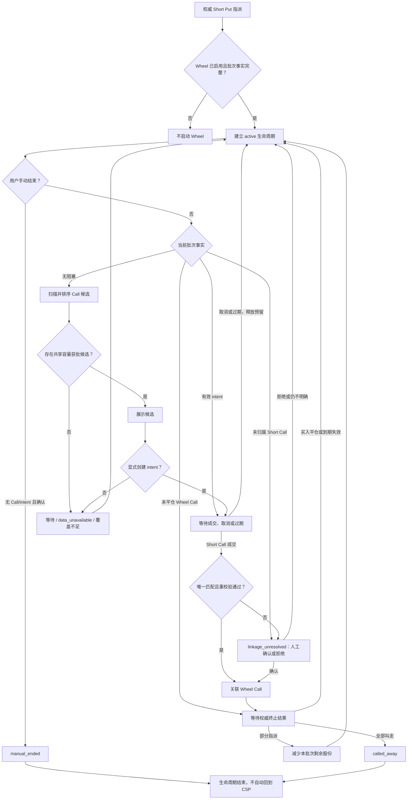

# 轮转策略（Wheel）PRD

- **状态**：双向 Wheel 已在源码实现并通过本地验证；尚未提交、发布或生产启用
- **中文名**：轮转策略
- **英文名**：Wheel
- **内部标识**：`wheel`
- **文档性质**：当前产品、安全与 owner 合同；第 13 节为双向实现合同

当前实现位于 `domain/domain/wheel.py`、`src/application/wheel/`、相关 ledger/tick owner 和
`src/interfaces/cli/wheel.py`。第 1～12 节保留单向 Call 合同和兼容语义，第 13 节补充双向扩展；
运行行为以当前源码、配置验证器和测试为准。源码实现不表示已提交、发布或生产启用。

## 1. 背景

Cash-Secured Put (CSP) 被指派后，用户已经持有交割正股。Wheel 监控这一批正股，在愿意以不低于正股
保本底线的价格卖出时推荐 Covered Call (CC)，直到正股被 Call 行权卖出或用户手动结束。

Wheel 是单向生命周期，不是无限循环：



终止后不自动回到 CSP。

## 2. 产品目标

1. 从可审计的 CSP 指派事实建立批次级 Wheel 监控。
2. 在不降低正股保本卖出底线的前提下，优先推荐被行权后生命周期净收益更高的 Call。
3. 统一管理普通 CC 和 Wheel CC 的股票覆盖额度，防止 Short Call 合计超过持股。
4. 复用现有 CC 的行情、费用、波动率、流动性、容量和候选快照能力。
5. 以独立策略合同接入现有扫描链路，使新增 Wheel 不会在未声明的情况下改变既有策略的候选、交易归属、生命周期或报告结论。

## 3. 非目标

当前实现不包括：

- 自动下单、自动平仓、自动行权或自动滚动 Call；
- Wheel 结束后自动重新卖出 Put；
- `max_lifecycle_days` 或其他自动超时结束机制；
- 除息日、股息和财报日过滤；
- 普通正股卖单与 Wheel 批次的新归属、拆分或解析工具；
- 跨 `stock_lot_id` 合并一个 Wheel 生命周期；
- 仅根据同一账户、标的、成交时间或持股数量做模糊评分，自动猜测 Short Call 属于哪个批次；
- 复用普通 CC 的启用状态、watchlist 或 symbol 配置作为 Wheel 的启动条件。
- 将策略拆成微服务、引入动态插件平台，或为接入 Wheel 重写全部现有策略。

## 4. 启动与批次

### 4.1 启动条件

Wheel 仅在以下条件全部成立时启动：

- 目标账户和市场已启用 `wheel`；
- 权威成交与交割事实证明 Short Put 已被指派；
- 指派已生成唯一 `stock_lot_id`，股数、交割价、费用、账户、币种和时间完整。

权威事实可来自 broker 同步或现有的人工确认写入路径。不得根据 ITM、到期日或市场价格
推测指派。

Combo Yield 的 `funding_put` 被权威指派后也可启动 Wheel。原 Combo 的
`participation_call` 继续按 Long Call 的独立仓位和生命周期管理，不占用正股覆盖
额度，其平仓、到期或行权不改变 Wheel 状态。

### 4.2 批次边界

- 一个 `stock_lot_id` 对应一个 Wheel 生命周期。
- 同一账户、同一标的可同时存在多个 Wheel 批次，但不合并成本或收益。
- 每个批次最多推荐 `floor(当前可用批次股数 / multiplier)` 张 Call。
- 不足一张合约的剩余股数保留为 `residual_stock`，不跨批次凑整。

### 4.3 交易监控与策略归属

Wheel 不新增独立交易监听进程。开仓、平仓、到期、指派和股票交割继续通过现有
trade intake、生命周期核对和 SQLite option-position ledger 形成权威事实。Wheel 只消费
已确认事实，不根据持仓消失或合约价格推测交易结果。

现有期权仓位状态保持 `open` / `close`；买入平仓、到期失效和指派继续由现有终止
事件区分。不增加 `wheel_call_open`、`wheel_expired` 或其他 Wheel 专属期权状态。

策略归属必须使用显式身份：

| 交易 | `strategy` | `strategy_group_id` | `leg_role` | Call lot `source_stock_lot_id` |
|---|---|---|---|---|
| Combo Funding Put | `combo_yield` | 必填 | `funding_put` | 无 |
| Combo Long Call | `combo_yield` | 必填 | `participation_call` | 无 |
| 已确认 Wheel Short Call | `wheel` | 禁止 | `wheel_call` | 必填 |
| 普通 CC | `sell_call` | 禁止 | 保持现有值 | 无 |

- Combo Long Call 和 Wheel Short Call 独立开仓、平仓和结算，不互相改变状态。
- Combo 指派正股可保留原 `strategy_group_id` 作为来源血缘；Wheel Short Call 只通过
  Call lot 的 `source_stock_lot_id` 关联正股批次，不复制该 `strategy_group_id`。
- Broker 成交数据不承载 OM 内部 `stock_lot_id`。该值由本地归属确认生成，
  不得伪装成 broker 成交字段。
- 无法唯一证明 `stock_lot_id` 的 Short Call 仍计入账户+标的级覆盖占用，但不计入任一
  Wheel 生命周期；对应批次进入 `linkage_unresolved` 并停止新推荐，不猜测归属。
- Combo 和 Wheel 可各自展示同一来源事件的生命周期上下文，但账户或投资组合汇总必须按
  底层成交事件去重，不得重复计入同一 Funding Put 权利金或正股损益。

### 4.4 Wheel Call 自动确认批次

候选展示不代表用户已采用。只有用户或 Agent 在成交前明确选择 Wheel 候选并创建
`wheel_call_intent`，成交后才可能自动关联批次；该操作只记录本地意图，不向 broker
下单。Intent 固定账户、`stock_lot_id`、合约、数量、multiplier、候选快照和显式
`expires_at_ms`，可取得时同时记录 broker order ID，并在有效期内预留相应覆盖股份。

trade intake 仅在成交唯一精确匹配有效未消费 intent，且重新校验批次、成交归属、
剩余股份和账户+标的级总覆盖均通过时，原子写入 Call 归属并消费 intent。无 intent、
多 intent、多批次、策略冲突、事实变化或覆盖不足时禁止自动归属；实际未平仓 Short Call
仍立即计入共享覆盖，并进入 `linkage_unresolved` 供人工确认或拒绝。

Intent 过期由显式 `expires_at_ms` 和 `as_of_ms` 派生，不新增过期事件或自动延长；迟到
成交按 `occurred_at_ms` 判断成交发生时是否仍有效。取消或失效会释放未消费预留，
成交成功则将预留原子转换为实际 Short Call 锁定。

同一订单的多笔部分成交可在 intent 数量和覆盖容量内逐笔累计，但单笔 fill 不拆分，
也不跨 Wheel 批次分配。当前责任边界见第 11 节。

## 5. CC 候选

### 5.1 独立配置，复用策略能力

Wheel 在 `wheel` 命名空间维护独立配置，不在运行时读取普通 `sell_call` 的 symbol 配置。
实现应复用 canonical CC 的规则、配置解析器和 Candidate Engine，不建立平行扫描器或排序器。

当前配置包含：

- `enabled`；
- DTE 窗口 `30..45` 个日历日；
- Call Delta 硬底线 `delta >= 0.30`；
- 年化净权利金收益硬底线 `10%`；
- 单张合约净收入折算不低于 `CNY 50`；
- spread 硬上限 `0.40`；
- 独立的 `min_iv_rv_ratio` 和 `min_iv_minus_rv`，语义与 canonical CC 相同。

Intent 有效截止时间是每次创建操作的显式输入，不是 Wheel 配置项。

关键行情、Delta、IV/RV、价差、multiplier 或费用证据缺失时 fail closed，不生成候选。

### 5.2 Strike 底线

Put 权利金和之前收到的 Call 权利金不得降低正股卖出底线。对每个候选，必须同时满足：

```text
strike >= live_spot

strike * covered_shares - estimated_stock_exit_fees
  >= allocated_remaining_stock_cost_basis
```

`allocated_remaining_stock_cost_basis` 来自该 `stock_lot_id` 的真实指派本金和交割费用，并与
`covered_shares` 使用相同的股数范围。无法证明批次成本或预计卖出费用时返回等待，不以权利金或聚合
broker `average_cost` 填补。

### 5.3 收益与排序

本轮 Call 继续复用 CC 的当前市值分母：

```text
covered_market_value = live_spot * covered_shares
period_net_premium_return = candidate_call_net_premium / covered_market_value
annualized_net_premium_return = period_net_premium_return * 365 / DTE
```

候选通过全部硬门槛后，按“本轮 Call 被行权后的预计生命周期净收益”降序排序：

```text
projected_lifecycle_net_pnl_if_called
  = realized_sell_put_net_pnl
  + realized_prior_call_net_pnl
  + realized_prior_stock_sale_net_pnl
  + candidate_call_net_premium
  + projected_remaining_stock_sale_net_pnl_at_strike
```

- `realized_prior_stock_sale_net_pnl` 只包含由关联 Wheel Call 权威交割已卖股份的实际净收入，
  减去这些股份对应的原始指派成本。
- `projected_remaining_stock_sale_net_pnl_at_strike` 只覆盖本轮候选的
  `candidate_covered_shares`，使用同一股数范围的剩余指派成本和预计卖出费用。
- 已卖股份成本只进入已实现正股损益，未卖股份成本只进入预计剩余正股损益；
  Put 和 Call 权利金保持为独立期权收益，不重复转入正股成本。
- 过去事实使用已记录的真实费用；本轮未成交候选使用明确标注的估算费用。
- 普通正股卖出不自动计入任一 Wheel 批次；因此无法完整归属股数、成本、收入或费用时，
  不输出完整生命周期收益。
- 预计生命周期收益率使用同一 `covered_market_value` 作分母，不再年化。
- DTE 不单独优先；只有在预计净收益相同时，才复用 CC 的执行质量和稳定排序规则。

只有当本轮候选覆盖批次全部剩余股份、且被行权后不留下 `residual_stock` 时，
才将该指标标注为“最终全部叫走后预计总收益”。容量分配后本轮只覆盖部分剩余股份时，
标注为“本轮行权后预计累计净收益”，不假设未覆盖股份的未来售价或权利金。

### 5.4 期权数据需求与取数

- 活跃 Wheel 批次的 symbol 必须进入全局 required-data 计划，即使该 symbol 不在普通
  CC watchlist 中或普通 CC 未启用。
- Wheel 按活跃批次提交 Call 侧 DTE、strike 区间和 IV/RV 数据需求；多批次及其他策略
  的同侧需求由全局 planner 合并。
- 同一 Tick 复用全局取数计划和同一份冻结快照，不为 Wheel 建立第二套合约链、
  缓存或行情目录。
- 快照未覆盖 Wheel 的确切需求时返回 `data_unavailable`，不得降级为“无候选”。

## 6. 共享持股覆盖

正股在 broker 层面是可替换的。当前实现不判断卖出的是“原有持股”还是“Wheel 持股”，只维护一个账户+
标的级覆盖不变式。容量键为 `(account, canonical_symbol)`：

```text
eligible_shares = min(opend_qty, opend_can_sell_qty)

all_open_short_call_locked_shares
  + active_call_intent_reserved_shares
  + current_tick_recommendation_reserved_shares
  <= eligible_shares
```

其中：

- `all_open_short_call_locked_shares` 包含普通 CC、Wheel Call 和尚未确认策略归属的
  全部未平仓 Short Call；
- `active_call_intent_reserved_shares` 包含所有有效且未消费的显式 Call 交易意图；
- `current_tick_recommendation_reserved_shares` 只包含当前冻结 Tick 最终准备展示的开仓动作，
  不把同一批次的备选合约当成多笔交易重复预留。

每个 Tick 从权威持股、ledger 和有效 intent 重新计算可推荐余额：

```text
recommendation_capacity
  = max(
      0,
      eligible_shares
        - all_open_short_call_locked_shares
        - active_call_intent_reserved_shares
    )
```

候选先在各自策略和批次内完成硬门槛与排序，然后只将每个可执行动作的首选候选交给共享
分配器。分配顺序固定为：

1. Wheel 批次；
2. 普通 CC。

多个 Wheel 批次之间不使用历史生命周期收益竞价，而按 `assignment_at` 升序、
再按 `stock_lot_id` 稳定排序。同一批次内仍选择预计生命周期净收益最高的 Call。

每个动作的获批张数为：

```text
granted_contracts
  = min(requested_contracts, floor(capacity_before / multiplier))

capacity_after
  = capacity_before - granted_contracts * multiplier
```

- `granted_contracts = 0` 时不展示开仓建议，返回覆盖股份不足；
- 获批张数小于请求张数时，将建议张数降为获批值；
- 本 Tick 的推荐预留不持久化，重复组装同一冻结快照必须得到同一分配结果；
- 候选快照必须保留 `requested_shares`、`granted_shares`、`capacity_before`、
  `capacity_after` 和 `allocation_reason`，Daily Brief 只展示最终张数或一个覆盖不足原因。

额外要求：

1. 所有未平仓 Short Call 使用同一 SQLite option-position ledger 计算锁定股数。
2. Wheel Call 和普通 CC 不得各自计算一份可用持股。
3. 已锁定股数和有效 intent 预留超过 `eligible_shares` 时，输出高风险覆盖不足，
   并停止该账户+标的的所有新 Call 推荐。
4. 普通正股卖出只通过新的 OpenD 持仓事实改变覆盖容量；当前实现不为此新增 Wheel 卖单归属工作流。
5. 该分配只约束 OM 候选和意图，不能阻止用户绕过 OM 在 broker 手动卖出额外 Call；
   这类成交被同步后必须立即计入锁定股数并报告覆盖不足。

## 7. 生命周期规则

- 当关联 Call 未平仓或成交结果待确认时，不推荐新 Call。
- Call 到期失效或买入平仓后，其净收益进入生命周期累计，下一轮重新扫描。
- Call 部分行权时，按关联 Call 的确定股数减少该批次可监控股数。
- Call 行权后仍有至少一张合约的股数时，继续 Wheel；不足一张时显示 `residual_stock`。
- 关联 Call 将批次正股全部叫走时，生命周期以 `called_away` 结束。
- 普通正股卖出不自动判定 Wheel 完成；用户不再继续时使用手动结束。
- 任何行权、交割或平仓证据不完整时 fail closed，不自动转换生命周期状态。

### 7.1 Wheel 状态模型

Wheel 对外只展示三个批次生命周期状态：

```text
active
called_away
manual_ended
```

以下是由当前交易、持股、数据和关联事实派生的运行阶段，不是新的期权仓位状态：

```text
ready
call_pending
call_open
residual_stock
linkage_unresolved
data_unavailable
```

投影器分别输出 `lifecycle_status`、`phase` 和
`integrity_status`。`lifecycle_status` 只使用上述三个批次生命周期状态；`phase` 只在
活跃生命周期内描述当前运行阶段，其中 `call_pending` 表示已有有效且未消费的 Call
intent、但尚未形成关联未平仓 Call。`integrity_status` 只使用 `trusted` / `conflict`；
终态、交割或关联事实矛盾时输出 `conflict` 并停止推荐，不把事实冲突包装成新的生命周期状态。

投影先判断完整性，再判断终态；可信且仍活跃时按以下优先级选择唯一主阶段：

```text
linkage_unresolved
-> call_open
-> call_pending
-> residual_stock
-> data_unavailable
-> ready
```

`integrity_status=conflict` 时不继续选择运行阶段；`called_away` 或 `manual_ended` 时
`phase=null`。同一批次同时存在的其他事实进入 `reason_codes`，不扩展组合状态枚举。
不存在 `wheel_started` 的指派不产生 Wheel 投影记录。

Call 开仓、买入平仓、到期失效和部分指派仅改变派生运行阶段；只有全部叫走或用户手动
结束才将批次转为终止状态。

生命周期状态必须从可审计的持久事实重建，不得从当前持股是否存在临时推算。
每个生命周期使用 `(account, stock_lot_id)` 作为唯一身份，并保留：

- `wheel_started`：Wheel 已启用时发生的权威 CSP 指派，必须引用确切指派事件；
- `wheel_called_away`：关联 Wheel Call 的权威交割累计卖出该批次全部剩余股份，
  必须引用确切 Call 结算事件；
- `wheel_manual_ended`：用户手动结束的确认事实，必须保留 actor、事件时间、请求身份和确认输入。

`called_away` 和 `manual_ended` 互斥且是正常业务流程中的不可逆终态。相同
`stock_lot_id` 不得因服务重启、指派重放、配置重载或持股重新出现而启动新生命周期。

当前持股归零或消失不能单独证明 `called_away`；普通正股卖出也不产生
`wheel_called_away`。部分叫走只减少剩余股份。行权、交割或终态事实冲突时必须
fail closed，停止自动转换和新推荐；普通操作不得覆盖终态，只有受控 ledger repair
可以纠正错误事实。

Wheel 未启用时已发生的历史指派不自动回溯创建生命周期；以后启用只处理新的
权威指派。

### 7.2 投影事实来源

投影器按事实责任消费现有权威数据：

- `wheel_events` 只决定 Wheel 启动、终止和 intent 状态；
- `trade_events -> position_lots` 决定 Call 开平仓、指派、合约数量和
  `source_stock_lot_id`；
- assigned-stock 投影决定批次成本、剩余股份和已实现正股卖出损益；
- broker 当前持股只用于账户+标的级覆盖上限和异常检查，不改变批次生命周期、
  成本或剩余股份；
- 当轮冻结行情快照只影响 `data_unavailable` 和候选结果，不改变任何持久状态。

下游扫描、报告和 Agent 必须消费同一 Wheel 投影视图，不得各自重新解释这些事实。

### 7.3 手动结束

Wheel 不设最长生命周期。用户只能在没有关联未平仓 Call、且没有有效未消费
`wheel_call_intent` 时手动结束：

```bash
./om wheel end \
  --account lx \
  --stock-lot-id <id> \
  --expected-batch-generation-hash <hash> \
  --request-id <id> \
  --actor <actor> \
  --dry-run
```

确认后使用同一 payload 执行 `--apply --confirm`。确认写入前必须在同一 SQLite 事务内重新校验
未平仓 Call 和有效未消费 intent；任一存在时拒绝结束。手动结束：

- 只终止 Wheel 监控，不卖出正股、不平 Call、不重新卖 Put；
- 存在有效未消费 intent 时，必须先在 broker 侧撤销对应未结订单，再取消 intent；
  OM 不代替用户撤单；
- 是永久状态，不自动重启；
- 对相同终止请求幂等；
- 不删除持股、指派或历史收益事实；相关已实现和未实现收益继续进入
  position、Performance 和 portfolio 视图，只从 Wheel 扫描与 Daily Brief 候选中排除。

## 8. 读取、Agent 与写入边界

Wheel 不新增独立 `wheel_read` 工具。批次、生命周期、启动或终止来源事件、当前 Call、
候选、未消费 intent 和待确认关联从现有读取面返回：

```bash
./om-agent run --tool option_positions_read \
  --input-json '{"config_key":"us","action":"assigned-stock","account":"lx"}'
```

手动结束通过 Agent 工具 `wheel_end` 提供：

- 默认 dry-run，返回精确 `stock_lot_id`、当前状态和预计变化；
- 非 dry-run 必须启用 Agent 写工具并传入 `apply=true` 和 `confirm=true`；
- 有未平仓 Call、有效未消费 intent、账户不匹配或批次不唯一时拒绝写入；
- Agent 不获得下单、卖股或平仓权限。

Agent 同时获得 Wheel Call 归属工具，用于：

- 将精确候选标记为“采用该 Wheel 推荐”，创建 `wheel_call_intent` 时显式提供
  `expires_at_ms`，或取消已有 intent；
- 对无法自动确认的唯一候选关系执行人工确认或拒绝；
- 所有写入默认 dry-run，确认时要求精确 intent 或候选 ID、输入快照 hash、
  `stock_lot_id`、actor 和 `confirm=true`；
- 应用前重新校验成交、批次、归属和覆盖容量；相同有效请求幂等。

该工具只写入本地意图或归属事实，不向 broker 提交、修改或取消订单。

## 9. Daily Brief

Wheel 接入现有 canonical tick 编排和 Daily Brief，不新增 scheduler 或通知通道。策略展示顺序为：

```text
CSP -> CC -> Combo Yield -> Wheel
```

Wheel 区块每个批次最小展示：

- symbol 和剩余股数；
- 推荐张数、到期日和 strike；
- 本轮预计净权利金；
- 覆盖全部剩余股份时展示“最终全部叫走后预计总收益”，否则展示
  “本轮行权后预计累计净收益”；
- 当前状态，或无候选时的一个主要原因。

账户使用报告区块的现有上下文；只在同一账户+标的存在多个 Wheel 批次时展示短化批次 ID。

## 10. 失败与等待语义

- 当前没有通过硬门槛的 Call 是合法等待，不是系统故障。
- 行情、持仓、锁定股数、批次成本或 ledger 不可用时返回 `data_unavailable`，不冒充无候选。
- 已有 Call 或可覆盖股数不足时返回明确等待原因。
- 已锁定 Short Call 超过持股时返回高风险覆盖不足，不以排序或降级候选解决。
- Wheel 自身缺少数据时只将 Wheel 标记为 `data_unavailable`；未预期的执行异常只将
  Wheel 标记为 `failed`，reason 为 `wheel_scan_failed`，不得删除其他策略结果。
- 共享 ledger 或持股事实不可信时，普通 CC 与 Wheel 都停止新增 Call 推荐；
  不受该事实影响的其他策略可继续输出。
- 无论 Wheel 扫描是否成功，现有 Short Call 和有效 intent 都必须进入共享覆盖占用；
  无效 Wheel 快照不参与当轮新增容量分配。


## 11. 当前 Owner 映射

| 责任 | 权威 owner |
|---|---|
| Wheel 规则、事件身份、intent、归属、生命周期投影和候选排序 | `domain/domain/wheel.py` |
| 账户配置 | `src/application/wheel/config.py` 和现有配置构建、验证链路 |
| 一致性生命周期读模型 | `src/application/wheel/read_model.py` |
| 手动结束、intent 和归属事务 | `src/application/wheel/workflows.py` |
| 候选扫描和冻结快照 | `src/application/wheel/scanning.py`、`src/application/wheel/candidate_snapshot.py` |
| Call 共享覆盖分配 | `src/application/wheel/capacity.py` 和现有 risk-capacity 链路 |
| 经济成交事实和追加式 Wheel 事件 | `src/application/ledger/api.py`、`src/application/ledger/repository_core.py`、`src/application/ledger/repository_assigned_stock.py`、`src/application/ledger/wheel_trade_companions.py` |
| Tick 和 required-data 编排 | `src/application/multi_account_tick.py`、`src/application/multi_tick/` |
| Daily Brief | `src/application/daily_decision_brief_service.py`、`src/application/daily_decision_brief_renderer.py` |
| 人工和 Agent 写入口 | `src/interfaces/cli/wheel.py`、`src/application/agent_tools/positions.py` |

Wheel 复用 canonical Candidate Engine、ledger、required-data planner、覆盖事实、
scheduler 和通知通道。不得新增平行排序器、账本、投影表、broker mutation path 或 scheduler。

## 12. 可观察验收不变量

1. 只有启用账户中的新权威 Short Put 指派会为一个 `stock_lot_id` 启动一个生命周期；
   重放和启用前历史不会重复启动。
2. `trade_events -> position_lots` 保持经济事实权威；追加式 `wheel_events` 只记录 Wheel
   启动、终态、intent、归属拒绝和 repair 事实，两条事件流不依赖到达顺序即可重建同一结果。
3. `called_away` 与 `manual_ended` 互斥且不可逆。指派、结算或归属证据缺失、迟到或冲突时
   fail closed，不重启终态批次。
4. Wheel Call 只通过显式 `source_stock_lot_id` 或精确且重新校验的 intent/人工归属关联。
   模糊 Short Call 保持 `linkage_unresolved` 并继续占用覆盖，不猜测批次。
5. Intent 精确绑定最终候选、冻结快照、批次 generation、数量、multiplier 和显式有效期。
   创建、消费、取消和 Call lot 归属必须原子且幂等；事实过期时不写入。
6. 候选计算复用 canonical Candidate Engine 和冻结 required-data 快照。批次成本、退出费用、
   multiplier、报价、Delta、IV/RV、spread 或覆盖证据无法证明时返回 `data_unavailable`，
   不冒充 `no_candidate`。
7. 候选通过全部硬门槛后按预计生命周期净收益排序。已卖与未卖股份成本范围不得重叠，
   部分覆盖不得描述为完整生命周期最终结果。
8. 每个 `(account, canonical_symbol)` 的全部未平仓 Short Call、有效 intent 和当轮 grant
   共用一份持仓权威容量；Wheel 按稳定顺序先于普通 CC 分配，并以真实 multiplier
   只批准整张合约。
9. 关闭 Wheel 只停止新生命周期、候选和 intent；现有 scope 继续投影、占用覆盖和处理终态。
   没有未结束 scope 时，既有策略输出保持不变。
10. 活跃可扫描批次即使在普通 CC 关闭或 watchlist 为空时也进入现有
    required-data plan；Wheel 不新增第二次行情读取、缓存、manifest 或快照。
11. 扫描、CLI、Agent 读取和 Daily Brief 消费同一一致性 Wheel 读模型或已提交快照；
    消费端不得重新推导生命周期、容量或候选身份。
12. `./om wheel` 仅提供 end、intent create/cancel 和 linkage confirm/reject。人工与 Agent
    写入默认 preview，要求当前 hash 和显式 apply/confirm，在同一 SQLite 事务内重校验，
    且绝不向 broker 下单、撤单或改单。
13. Wheel 失败或事实不可用只影响对应 Wheel 或共享 Call scope，不删除其他策略原始结果，
    也不把等待伪装成 action。
14. focused workflow、projection、scan、capacity、tick、Daily Brief、CLI、Agent、config 和
    compatibility 测试覆盖 replay、CAS、rollback、部分/全部指派、事实不可用、账户隔离和
    Wheel-disabled 行为，且不写生产数据、不调用 broker mutation。

## 13. 双向 Wheel 实现合同

本节的产品输入和验收唯一真源是 `codex/om-wheel-prd.md`，包括 S1～S5、A01～A16 和第 8 节
批准依据。本节确定当前实现边界、owner、数据流和迁移方式，不修改该产品合同。实现完成不授权
commit、push、merge、发布、部署、运行时配置修改、生产数据写入或 broker 操作。

### 13.1 目标、成功信号与非目标

目标是在保留普通 CSP 指派自动进入 Wheel CC 的同时，补齐普通 CC 指派自动进入 Wheel CSP，
并让 Wheel 内部任一方向的真实指派只对实际转换部分生成待确认分支。用户选择“启动轮转”后仅
开始下一方向监控；用户选择“结束轮转”后该分支永久结束。推荐、意图、归属和结果跟踪继续由
OM 完成，实际下单继续由用户完成。

成功信号：

1. 四种入口和转换严格符合 `codex/om-wheel-prd.md` §3.1；普通策略入口自动启动，Wheel 内部
   指派必须等待用户决定。
2. 部分指派按实际数量拆出独立分支，原分支未转换余量继续原方向，不复制本金、收益或容量。
3. Wheel CC 和 Wheel CSP 均执行 `0.25 <= abs(delta) <= 0.35`，本金底线无交集时等待，不放宽。
4. CSP 的历史卖出净收入只决定价格预算；当前可用现金仍由既有物理账户容量决定。
5. 唯一有效意图才自动归属；无匹配、多匹配、事实缺失或冲突均不猜测，真实仓位仍计入占用。
6. 启用前普通指派不补建；重复事件、重复决定和终态重放不重复启动或复活分支。
7. A01～A16 均有可执行的 facade 或端到端测试，不以内部 helper 测试代替可观察结果。

非目标保持不变：不自动交易、撤单、滚动或行权；不新增独立页面、通知通道、监听进程、scheduler、
行情缓存、平行账本或通用策略评分器；不修改普通 CSP/CC 行为；不跨标的轮转；不回填历史普通 CC；
不支持已结束分支重新启动；不借机重构全部 ledger 或候选系统。

### 13.2 当前事实和约束

本设计的源码基线是本地跟踪 `origin/main@343a5d1f720e15fc05b168cd8d363788cbd137b3`，不是生产
核实。当前事实为：

- `wheel_events` 是 append-only SQLite 事件表，事件身份强制依赖非空 `stock_lot_id`，事件类型
  CHECK 只允许当前单向 Call 生命周期、Call intent、Call linkage 和 void 事件。
- 当前投影按 `(account, stock_lot_id)` 分组，只能同时表达一个 Call 阶段。Wheel Call 部分指派
  只减少剩余股票；全部叫走才追加 `wheel_called_away`，已卖部分不会形成 CSP 分支。
- 当前 `wheel_trade_companions` 已在 trade writer 同一事务中追加 Wheel 事件并校验投影，具有
  event ID 与 payload hash 幂等基础；新设计继续使用该原子边界。
- 当前扫描、候选快照、Daily Brief 和公开写入口只理解 Wheel Call；配置是单层 `wheel` policy，
  Delta 只有 `min_delta=0.30`，没有绝对值上限。
- 已有 Call coverage、普通 CSP 现金容量、assignment stock settlement cash facts、实际费用和
  assigned-stock 成本投影可复用，但当前没有 Wheel Put intent 现金预留或多分支现金 grant。
- 当前只保存运行时 enabled 布尔值，没有可用于迟到事件判断的账户级持久化启用时间。

`config.yaml` 仍是人工配置真源，runtime JSON 仍由构建链生成。实现不得直接修改现有生产配置；
双向 Wheel 的实际启用时间和值由后续独立授权的配置迁移提供。

### 13.3 选定方案：单一分支事件流

继续使用一个 `wheel_events` owner，不新增 `wheel_csp_events`、第二套 projection 或业务监听器。
将 Wheel 的持久身份从“必须拥有股票的批次”演进为“可处于 Call 或 Put 方向的分支”：

- 新增稳定的 `wheel_branch_id`。有真实股票 backing 的 Call 分支继续令
  `wheel_branch_id=stock_lot_id`；Put 分支使用 `(account, source_assignment_event_id,
  target_direction)` 确定性生成的非股票 ID。
- `parent_branch_id` 放在新事件的 hash-bound payload 中记录部分转换和轮转血缘；在出现真实查询需求前
  不新增专用列或索引。一个 assignment event 只能为一个明确来源分支创建一个对应 child，不能跨多个
  分支自动拆分。
- `stock_lot_id` 改为可选资源引用：Call 分支引用真实 assigned-stock lot；Put 分支允许没有股票 lot。
- 事件行新增持久化 `event_schema_version`。旧 `wheel_event.v1` 行使用
  `wheel_branch_id=stock_lot_id`，仍按原字段集合重算旧 hash，新增列不得进入 v1 hash；`wheel_event.v2`
  的 hash 必须覆盖 `wheel_branch_id`、可选 `stock_lot_id` 及包含 `parent_branch_id`、`direction` 的
  normalized payload。读取按版本分派并拒绝 v2 篡改。
- 迁移必须证明新 normalize/hash 分派对每个 v1 事件重算后得到原 hash；仅比较迁移前后存储值不算验证。
  原 event ID、payload、payload hash 和时间保持不变，旧 `called_away` / `manual_ended` 只作历史终态
  解释，不回建 CSP child。
- 新普通 CSP 或普通 CC assignment 创建 active child；新 Wheel 内部 assignment 创建
  `pending_decision` child。用户决定只追加一次含 expected generation hash 的 CAS 事件：`start`
  转为 active，`end` 转为不可逆 `manual_ended`。
- 父分支按实际 assignment 数量减少可继续监控的数量；还有整张容量时继续原阶段，不足一张时
  显示 residual；完全转换后派生为 `converted`，不再生成原方向推荐。

最小新增生命周期事件为 `wheel_branch_created`、`wheel_branch_decided`；保留现有
`wheel_started`、`wheel_called_away`、`wheel_manual_ended`、`wheel_call_intent_created`、
`wheel_call_intent_cancelled`、`wheel_call_intent_consumed`、`wheel_call_linkage_rejected` 和
`wheel_event_voided`。Put 只增加对称的 `wheel_put_intent_created`、`wheel_put_intent_cancelled`、
`wheel_put_intent_consumed`、`wheel_put_linkage_rejected`，共享现有幂等、CAS 和原子校验，不泛化改写
历史 Call 事件。

SQLite 迁移必须在单一事务内重建 `wheel_events` 的列、事件类型 CHECK、索引和 append-only triggers，
迁移前后校验行数、event ID、payload hash、外键和 normalized payload 完全一致。任何不一致回滚整个
迁移；不得原地猜测或修补冲突行。事务回滚只在 schema commit 前成立；一旦写入首个 v2 事件，旧 v1
binary/schema 不再是安全回退目标，因为它无法读取新事件类型且 append-only 事实不可删除。此后只能
回退到 v2-compatible package 或前向修复，并以“写入 v2 -> compatible rollback -> 全量 readback”演练
证明恢复路径。

### 13.4 数量、经济事实和分摊

`trade_events -> position_lots -> assignment settlement -> assigned-stock / cash facts` 继续是成交、
数量、multiplier、价格和实际费用的权威链。Wheel 事件只保存分支身份、来源事实引用、决定、转换数量
和稳定排序字段，不保存可重算金额，不建立第二份经济账。

每个 child 使用 assignment 的实际 contracts、multiplier 和 stock settlement shares。它们必须满足
`shares == contracts * multiplier`；缺失、非整数或与来源 lot 不一致时不自动创建 child。单笔 fill
不跨 Wheel 分支分配；若来源不能唯一确定，进入待人工归属并继续占用物理股票或现金。multiplier 必须
来自 source event、source lot 或明确的 contract evidence；实际 shares/contracts 只可互相佐证，不能
在 multiplier 缺失时默认补成 `100`。

自动 child 必须同时取得 multiplier 数值、`multiplier_source` 和可审计 evidence ID/hash。可信来源仅为：
broker/OpenD payload receipt、带 source receipt/hash 的 multiplier cache 或 bootstrap snapshot、或用户在
confirmed manual trade payload 中显式提供的 contract multiplier；source lot 只有在自己保留上述 provenance
时才能转交。dataclass/legacy fallback、`us_standard_default`、无 receipt 的 runtime seed，或单纯“数值是
100 且 shares 相等”均不构成证据。多个权威来源数值冲突时 fail closed 为 `multiplier_conflict`；缺证据时
为 `multiplier_unproven`。branch event 的 hash-bound payload 同时绑定数值、source 和 evidence hash，两个
writer 与 manual path 必须得到同一判定。

child 当前方向的本金锚只来自本次 assignment 的真实 stock settlement cash 与 actual fees：Call child
使用本次 assigned-stock 实际接货成本，Put child 使用本次实际股票卖出净收入。不得按父分支比例继承
或推导 child 的当前方向本金锚。

只有父分支既有的历史已实现 PnL 和尚未转换展示余额按实际转换数量分摊。Wheel event 仅持久化 source
fact IDs、转换数量、authoritative `occurred_at_ms/event_id` 和 lineage，不持久化可因迟到事实改变的
per-child 金额，也不复制 canonical cash/PnL。

读模型对同一完整 source fact set 按稳定 `(occurred_at_ms, event_id)` 顺序，以 Decimal 精度计算每个
child 的未量化比例金额；仅在公开读面或 sealed snapshot 输出边界按 currency quantum 分配，稳定顺序
中的最后一个 child 吸收量化余数。这样同一事实集合无论正序、逆序或跨事务到达，均得到相同 child
allocation、parent remainder 和 snapshot hash；迟到事实会生成新的 projection/generation hash，旧 CAS
自然失效，但不改写历史 Wheel event。父分支转换数量为零时不得带走金额；全部转换后不得在零数量父
分支保留非零余额。例如 3 张对应 USD 100.00 的历史 PnL，无论三个一张 assignment 以何种 ingestion
顺序到达，均按其 authoritative stable order 让同一个最终 child 取得余数。

Wheel CC 的下一方向 child 使用本次真实股票卖出 gross cash 与实际 stock settlement fee 得到卖出
净收入。普通 CC 不要求先存在 assigned-stock lot 或 raw `strategy` 字段；必须复用
`domain/domain/strategy_membership.py` 的唯一 canonical membership，以 short Call 合同事实且无
Wheel/Combo/relationship conflict 判定普通 CC。实际卖出交割完整时，才可直接以 assignment cash facts
建立 CSP 分支。若普通 CC 的股票交割
与 active Wheel stock lot 重叠或指向它，只更新真实物理容量并暴露 manual-review conflict，不自动再建
CSP child。

Wheel Put 被指派后，新的 Call child 使用 assigned-stock 投影形成的真实接货成本。Put/Call 权利金
保持独立现金事实，只进入阶段已实现收益和排序，不摊低 Call 成本或提高 Put 本金上限。

### 13.5 状态、归属与写入

方向中立读模型输出 `wheel_branch_id`、`parent_branch_id`、`direction=call|put`、来源 assignment、
初始/剩余数量、本金锚、收益分摊、`lifecycle_status`、运行 `phase`、完整性和 generation hash。
新状态只表达必要业务事实：

```text
pending_decision --start--> active --assignment--> converted 或 active(剩余数量)
pending_decision --end----> manual_ended
```

`start` 只启动监控，不创建 intent、不预留成交、不下单。`manual_ended` 和 `converted` 不可逆；
重复决定幂等，冲突决定拒绝。未回应的 pending branch 不进入 required-data 或候选扫描。

output v3 的 direction-neutral `phase` 对 Call/Put 使用同一枚举。terminal lifecycle 先输出
`converted|manual_ended`，pending lifecycle 输出 `pending_decision`；active branch 再按以下优先级派生：

```text
conflict > linkage_unresolved > option_open > intent_pending
         > residual_capacity > data_unavailable > ready
```

`conflict` 由 integrity/source void 等事实触发；terminal branch 不再扫描。active branch 只有 `ready` 才进入
候选生成。有效 intent 使该 branch 进入 `intent_pending`；唯一成交关联原子
消费 intent 并进入 `option_open`，因此不会重复推荐或重复占用。intent cancel/expire 且无成交后释放 intent
claim 并按当前事实重算 phase。Short Call/Put 买入平仓或到期未指派后，canonical lot/cash facts 先记录实际
净收益并释放对应股票/现金 claim，branch 再回到 `ready`、`residual_capacity` 或 `data_unavailable`。
partial assignment 对实际转换量创建 pending child；父分支若仍有 open option 则保持 `option_open`，否则按
剩余容量重算。full assignment 使父分支 `converted`。无法唯一关联的真实仓位进入
`linkage_unresolved`，继续计入物理容量但不生成候选。

顶层 `wheel_branches[].phase` 使用上述中性值；legacy `rows[].wheel` adapter 继续输出既有
`call_open`、`call_pending`、`residual_stock` 等字段，不用 v2 phase 反向改写 v1 历史合同。

期权 lot 使用 `strategy=wheel`、方向对应的 `leg_role=wheel_call|wheel_put` 和中性
`source_wheel_branch_id`。Call 同时保留 `source_stock_lot_id` 以证明股票覆盖来源。唯一匹配的有效
intent 才允许 trade writer 原子写入归属并消费 intent；没有或存在多个匹配时不猜，仓位保持真实、
占用进入共享容量，并在读模型中暴露 linkage unresolved。

已有 open Wheel Call lot 的兼容 adapter 只在 `strategy=wheel`、`leg_role=wheel_call`、没有冲突
`strategy_group_id` 且 `source_stock_lot_id` 在账户内唯一时映射到同 ID branch；新 lot 必须显式保存
`source_wheel_branch_id`，不得用标的、时间或方向模糊匹配。CLI/Agent 的 `--stock-lot-id` 仅作为旧 Call
branch 的兼容别名；它与 `wheel_branch_id` 互斥，解析结果必须唯一且进入 hash-bound input。

继续使用现有 `option_positions_read` 作为 Agent 读取入口，不新增独立 read tool。其 additive
`option_positions_read.output.v3` 在保留 legacy Call 的 `rows[].wheel` 兼容信息之外，新增顶层
`wheel_branches`，使没有 assigned-stock lot 的 Put/pending branch 也可见。Daily Brief、候选和人工
命令一律以 `wheel_branch_id` 作为生命周期身份。pending branch 的 generation hash 覆盖 branch、
source assignment、数量分配、parent facts 和当前决定，并在同一读面暴露；候选 linkage input hash 的
完整来源也必须可读，不能只返回不可解释的 hash。

CLI 在现有 `./om wheel` 下增加 branch start，并扩展 end、intent 和 linkage 接受
`wheel_branch_id`。所有写入默认 preview；broker read 可用于 preview 事实核对，但不得产生外部 mutation。
apply 时要求 confirm、request ID、actor、expected generation/input hash，并在同一 SQLite 事务内重读
与校验；任何 Wheel 操作都不获得 broker mutation 权限。

### 13.6 策略、配置和容量

Wheel policy 演进为市场级独立 `wheel.call` 和 `wheel.put` 子配置。两侧分别保存 DTE、收益、流动性、
IV/RV 和 `min_abs_delta` / `max_abs_delta`；初始 Delta 均为 `0.25` / `0.35`。解析优先级固定为：嵌套 v2
显式值覆盖 Wheel 自有 defaults；legacy 平铺字段只迁移 Call 的公共字段，已废弃的 `min_delta` 不得覆盖
新的绝对 Delta 区间。Put 初始 defaults 在代码中从 canonical CSP defaults 复制一次，此后不得在运行时
联动普通 CSP；现有 Call 从下一次有效扫描起同样强制使用 `0.25 <= abs(delta) <= 0.35`。配置构建、
resolved policy 和真实 scan 必须由同一组测试串联验证。

自动 child 的唯一启停真源是 SQLite 中最小的 market/account-scoped `wheel_activation_windows`，每行
保存 `market`、`account`、单调递增 `generation`、`activated_at_ms`、可空 `deactivated_at_ms` 和 policy
hash；每个 `(market, account)` 至多一个 open window，窗口不可删除、不可重叠，US/HK 同名账户完全隔离。
唯一允许的历史更新是同一事务将 open row 的
`deactivated_at_ms` 从 NULL 设置一次；其他字段和已关闭边界均不可修改。时间使用 UTC epoch
milliseconds，并与 authoritative event `occurred_at_ms` 使用同一规范化时间域；active window 两端采用
`activated_at_ms <= occurred_at_ms < deactivated_at_ms`，open window 只有 inclusive 下界。

`config.yaml` 仍是人工 authoring source，但 boolean/current timestamp 不能替代启停历史。additive schema
保留每个 market runtime config 的现有 `wheel.accounts: [lx, ...]` 列表，并新增
`wheel.activation_by_account.<account> = {generation, activated_at_ms, deactivated_at_ms}`；resolver 将当前
market 与 descriptor 组合成期望 `(market, account)` window。旧配置缺少该 block 时只允许既有 branch
读、投影和终态处理，当前扫描/start/new intent 保持关闭；ordinary assignment 是否建立 branch 仍只按
durable historical window 的 event time 判断，不能由当前 config 补猜。

受控的 `./om wheel activation --market <us|hk> --account <account>` operator workflow 以 preview、confirm、
expected current generation、request ID、事务 readback 和 receipt 开启/关闭 window；它只写本地 Wheel
policy state，不交易、不补建 branch。请求、receipt、policy hash、branch payload 和 writer transaction
均绑定同一 `(market, account)`，writer 还必须从 source symbol/contract 复核 market。

静态 config build/validator 保持纯函数，只验证 descriptor shape、market/account、generation、timestamp
顺序和 policy hash 可重算性，不读取 SQLite。现有 runtime status/healthcheck readiness owner 比较 resolved
descriptor 与 durable current window，并给出 `missing_window`、`descriptor_mismatch`、`closed_window` 等
明确 reason。该 current readiness 只 gate 当前监控动作，不覆盖历史 event-time eligibility；writer 不得
因观察到配置变化而隐式创建、关闭或改写 window。

安全 rollout 的前提是 v2-compatible binary、readiness 和双 writer gate 已部署，旧 v1 writer 已停止并
完成进程/版本核验；否则不得创建 window。首次启用/重启用由 operator 在成功 SQLite transaction 中
分配不可由 caller 指定或回填的 `activated_at_ms`，readback/receipt 再产出 exact descriptor。随后安装该
market config；在 descriptor 缺失或不匹配期间，current scan/start/new intent 始终 fail closed。禁用由
operator 在 transaction 中一次写入 `deactivated_at_ms`，立即关闭 current actions，readback 再产出 closed
descriptor 供安装。任一步崩溃或双进程 config skew 都保持 current actions 关闭，重试靠 request ID/
readback 幂等恢复。re-enable 必须显式创建更大 generation 和更晚
`activated_at_ms`；复用旧 generation/timestamp、删除旧 window 或改写边界一律拒绝。该生产 state/config
迁移属于后续独立授权，不由当前设计或实现测试触发。

两个真实 writer owner `src/application/ledger/writer_trade_events.py`、
`src/application/ledger/writer_lifecycle_allocation.py` 及其共享 companion hook 都接收同一份 immutable
market/account window history，并在各自 SQLite 事务内重读。普通 CSP/CC assignment 只按
`(market, account, occurred_at_ms)` 在全部 immutable historical windows 中唯一命中 generation：命中一行
即使该 row 后来已关闭或当前已是更高 generation，也创建 active bootstrap child；零行表示启用前或
closed-window gap，永久不补建；多行是 schema conflict。来源 timestamp 缺失时 fail closed，禁止用入库、
部署、首次启动或当前时间补猜。branch 的 hash-bound payload 记录实际命中的 generation、window bounds
和 policy hash，因此迟到入库、逆序 writer 和 replay 对同一事实得到同一结果。

既有 Wheel branch 的真实 assignment 不属于普通自动入口：无论 current window 是否 open，都必须在同一
事务记录 parent conversion，并只为实际转换量创建 `pending_decision` child；它不自动开始监控。current
window/descriptor action matrix 固定为：

| 动作 | 是否要求 current open window 与 descriptor 精确匹配 |
|---|---|
| 普通 CSP/CC assignment bootstrap | 否；只按 historical event-time window |
| 既有 Wheel assignment 的 parent conversion + pending child | 否 |
| projection/read、物理容量、open lot close/expire/assignment、source void/reconciliation | 否 |
| linkage confirm/reject、existing intent consume/cancel/expire、branch end | 否 |
| pending branch start、required-data/candidate scan、新 intent create | 是 |

公开读面额外输出 `monitoring_gate=enabled|disabled|config_mismatch`。新候选 required-data planning 只服务
enabled 的 active non-conflict branch，并可把可恢复的 market-data unavailable 更新为完整事实；candidate
generation 仅在 `lifecycle_status=active`、`phase=ready` 且 `monitoring_gate=enabled` 时运行。
disabled/config mismatch 时继续展示 branch、pending 决定、真实仓位和终态，但不拉取该 branch 的新候选
required-data、不推荐、不创建新 intent；pending `end` 仍允许，`start` 明确拒绝。生产配置迁移和实际启用
必须另获授权。

扫描继续使用同一 required-data plan、冻结行情和 Candidate Engine。Call 保留当前本金底线及生命周期
净收益排序，只将 Delta 改为绝对区间。Put 复用 canonical Put 的公共 opening policy、费用和现金事实，
在 Wheel domain 层只增加：

```text
strike * assignment_shares + estimated_assignment_fees
  <= allocated_prior_stock_sale_net_proceeds

strike <= live_spot

replenishment_cash_remainder
  = allocated_prior_stock_sale_net_proceeds
  - projected_assignment_total
  + realized_put_net_pnl_in_current_stage
  + candidate_put_net_premium
```

硬约束通过后按 `replenishment_cash_remainder` 降序，再复用 Put 侧既有稳定次级排序。Delta、现价、
multiplier、费用、币种或本金锚缺失时返回 `data_unavailable`；硬条件完整但无合约通过时返回
`no_candidate`。

`domain/domain/risk_capacity.py` 是唯一生产 Put 现金 allocator。它消费同一冻结事实集：物理账户 cash
authority、`cash_by_currency`、已有 cash-secured positions、active Wheel Put intents、当前 ordinary CSP
最终推荐 claims、当前 Wheel Put claims 和冻结 FX。为保持 A14 和普通 CSP 既有行为，ordinary CSP 最终
推荐及其 output 完全不变，并作为 immutable prior claims 先占用；allocator 只从剩余容量稳定 grant
Wheel Put，不在本任务修复 ordinary CSP recommendation 之间已有的非加和行为。

pool 是 account-wide；跨币种 claim 复用现有 currency conversion contract，FX 缺失 fail closed。
capacity snapshot hash 必须覆盖 account authority、cash、cash-secured positions、ordinary claims、
Wheel intents 和 FX。容量 claim 按既有 CSP 口径 `strike * multiplier * contracts`；estimated assignment
fees 只属于 Wheel price-budget 硬约束，不重复计入 cash-secured reservation。intent create/consume/
cancel 都在事务内重读全部 reservation，并校验 capacity hash、currency 和 amount。历史股票卖出净收入
只决定 Wheel Put 价格预算，绝不加入物理现金。

当前 Tick 对多个 Put 分支使用该单一现金池做稳定 grant，不能让每个候选各自重复显示全部现金。Call
继续使用现有账户+标的股票覆盖池。候选推荐本身只在冻结快照内分配展示额度，不形成持久 broker 或
ledger 预留；只有显式 intent 才持久预留相应股票或现金。

新双向 run 只产一份 sealed `wheel_candidate_snapshot.v2.json`，schema 为
`wheel_candidate_snapshot.v2`。其 `scope_results` 数据 scope 以 `(symbol, direction)` 唯一，branch
batch/claim 以 `(wheel_branch_id, direction)` 唯一，并绑定 projection、policy、required-data、capacity
allocation、authority/cash/FX hash 和 intent input hash。

同一身份贯穿 upstream producer：新 Wheel status 使用 `strategy_scan_status.v2`，文件名
`<symbol>_wheel_<direction>_scan_status.v2.json`；新 index 使用
`strategy_scan_status_index.v4.json`/`strategy_scan_status_index.v4`；新 live manifest 使用
`candidate_snapshot_manifest.v3.json`/`candidate_snapshot_manifest.v3`。四者的 status path、index key、
expected rows、manifest owner/schema projection 和 Daily Brief linkage 均使用
`(symbol, strategy_family=wheel, direction)`。非 Wheel family 不升级其 per-scope identity；现有 experience
`candidate_snapshot_manifest.v2` 保持原合同，不被本次复用或改写。

新 Wheel writer 只产上述新版本；新 manifest v3/index v4 继续接纳非 Wheel family 的既有 status/snapshot
schema，只对 Wheel owner 要求 status v2/snapshot v2。新 reader dual-read：合法 legacy live bundle
`wheel_candidate_snapshot.v1` + `strategy_scan_status.v1` + index v2/v3 + manifest v1 适配为
`direction=call` 和 legacy branch identity；新 bundle 必须符合 manifest v3 声明的 per-owner version
matrix。Wheel v1 artifact 出现在新 manifest，或 Wheel v2 artifact 出现在 legacy manifest，均以明确
`artifact_version_mismatch` fail closed；旧 binary 不要求读取新双向 artifacts。strict manifest、
archive、candidate evidence history、Agent candidate explain 和 Daily Brief loader 同步更新 owner schema/
filename matrix 与 content hash 校验，不能覆盖旧 sealed file。一侧 failure/data unavailable 只污染该
direction scope。Daily Brief 在现有 Wheel 区块区分 Call、Put、pending decision、合法等待和
data unavailable，不新增 scheduler 或通知通道。

### 13.7 Owner 和端到端数据流

| 责任 | 设计 owner |
|---|---|
| 分支事件、状态、经济分摊、Call/Put 策略和排序 | `domain/domain/wheel.py` |
| 普通 CC/CSP canonical membership 与冲突识别 | `domain/domain/strategy_membership.py` |
| 事件表/activation windows 迁移、append、读取和原子 trade companion | `src/application/ledger/repository_core.py`、`src/application/ledger/repository_assigned_stock.py`、`src/application/ledger/wheel_trade_companions.py` |
| 两条 trade writer 的账户启用 policy 与事务重校验 | `src/application/ledger/writer_trade_events.py`、`src/application/ledger/writer_lifecycle_allocation.py`、共享 companion hook |
| 一致性投影与公开读模型 | `src/application/wheel/read_model.py` |
| branch 决定、activation、intent、linkage 和 CAS | `src/application/wheel/workflows.py` |
| 两侧配置构建与验证 | `src/application/wheel/config.py`、`src/application/config_yaml.py`、`src/application/config_validator.py` |
| activation descriptor/window readiness | `src/application/agent_tools/runtime_status_impl.py`、`src/application/healthcheck.py` |
| 两侧扫描、快照和股票/现金 grant | `src/application/wheel/scanning.py`、`src/application/wheel/candidate_snapshot.py`、`src/application/wheel/capacity.py`；唯一 Put 现金 allocator 为 `domain/domain/risk_capacity.py` |
| 现有 tick、direction-aware status、required-data、manifest 和 Daily Brief 集成 | `src/application/pipeline_watchlist.py`、`src/application/strategy_scan_status.py`、`src/application/required_data_prefetch_planning.py`、`src/application/candidate_snapshot_manifest.py`、`src/application/daily_decision_brief_service.py`、`src/application/daily_decision_brief_renderer.py` |
| sealed artifact legacy/new dual-read | `src/application/candidate_evidence_history.py`、`src/application/research/archive.py`、`src/application/agent_tools/candidate.py`、`src/application/agent_tools/candidate_filter_impl.py`、`src/application/agent_tools/candidate_rank_impl.py` |
| 人工与 Agent facade | `src/interfaces/cli/wheel.py`、`src/application/agent_tools/positions.py` |

权威数据流：

```text
broker/manual confirmed trade
-> trade writer transaction
-> trade event + position/assigned-stock/cash facts
-> Wheel companion event
-> one Wheel branch projection
-> existing required-data plan and frozen quotes
-> direction-specific policy + shared physical capacity grant
-> one sealed Wheel snapshot
-> option_positions_read / CLI / Daily Brief
```

意图链：

```text
sealed candidate -> preview/confirmed local intent -> user trades at broker
-> confirmed fill -> unique intent match and revalidation
-> atomic lot attribution + intent consumption -> projection/readback
```

### 13.8 失败和恢复语义

- assignment、交割方向、实际数量、multiplier、费用、币种、来源 lot 或 parent branch 不完整时，
  不自动创建 child；保留 trade 事实并返回人工核对原因。
- 普通 CC 仅在 canonical strategy membership 将来源 short Call 判为 `cc`、没有 Wheel/Combo/
  relationship conflict 且股票卖出 settlement 完整时自动入口；raw `strategy` 缺失不单独阻断，存在冲突
  metadata 则 fail closed。与 active Wheel stock lot 重叠时进入明确 conflict/manual review，不能创建
  重复 Put child。
- 一个 fill 同时可能属于多个 branch 时不分摊、不选择最近时间或同标的候选；实际 Call/Put 仍进入
  股票或现金占用，直到人工确认或明确拒绝。
- pending branch 未决定时不扫描；start/end 输入过期、generation 变化或与既有决定冲突时不写入。
- 历史卖出预算成立但当前现金不足时不得给可执行 Put 推荐；当前现金充足但本金锚不成立时同样等待。
- 关闭 durable activation window 后，停止 current scan/start/new intent，但继续记录既有 Wheel branch 的
  internal assignment、pending child、close/expire、void、reconciliation 和真实物理占用。普通入口只按
  source event 是否命中 historical window 判定：启用前/gap 永不补建，历史 active interval 内的迟到事实
  仍确定性建立 branch，但在 current gate disabled 时不扫描。“关闭后不启动新 lifecycle”按 source
  event time 解释；关闭后才入库的 pre-close fact 是完成已获准区间的事实，不是 post-disable 新入口。
- source assignment 后续被 void 时，branch 进入显式 conflict，相关金额投影停止为 data unavailable 并走
  受控 repair；不得静默删除 child、自动重分摊、篡改 append-only facts 或自动复活父分支。
- schema commit 前，SQLite 迁移、trade event 和 Wheel companion 任一步失败都回滚同一事务；重试使用
  确定性 ID 和 versioned payload hash 得到一个结果。首个 v2 事件写入后的恢复只允许 v2-compatible
  rollback/readback 或前向修复。
- Wheel projection、scan 或 snapshot 失败只影响对应 Wheel scope；共享容量事实不可信时停止受影响的
  新 Call/Put 推荐，不删除其他策略结果。
- legacy projection 明确保留 `wheel_called_away -> called_away`、`wheel_manual_ended -> manual_ended`；
  v2 全量转换使用 `converted`，且 legacy 终态不合成 CSP child。

### 13.9 实现组成

1. **双向持久生命周期与 facade**：包含 versioned event/schema migration 的全部事件类型与 CHECK、
   durable activation windows/operator workflow、market/account historical eligibility 与 current action gate、
   双 writer 事务传播、branch projection、
   普通双入口、Wheel 内部 pending/start/end、部分数量与经济分摊、公开
   `wheel_branches` read v3、CLI/Agent preview-confirm-CAS、两个 writer hooks、legacy open Call adapter 和
   v2-compatible rollback；A03/A04 可从公开 facade 完整验证，不只停在内部事件层。
2. **Wheel Put 推荐与共享容量**：包含 v2 Call/Put scanning config/policy、绝对 Delta 区间、Put 本金/排序、唯一现金
   allocator、现金 intent 预留、当轮 grant、direction-aware strategy status producer/index、strict manifest
   contract 和 sealed snapshot v2；由 A07～A08、A13～A16 验证。
3. **Tick 与 operator 闭环**：接入 required-data、status/manifest runtime、tick 和 Daily Brief，覆盖四种转换、
   歧义归属、rollback 和 Wheel-disabled 端到端回归。

各组成保持普通 CSP/CC 候选与账本行为不变，并通过各自的 facade 级测试。
三个组成共同构成一次产品交付，任何单项都不得独立 release 或生产启用；全部验证且另获 release/
activation 授权前，v2 automatic writer policy 必须保持 disabled。

### 13.10 验证计划

实现时先运行最小拥有者测试：

```bash
./.venv/bin/python -m pytest \
  tests/test_wheel_strategy.py \
  tests/test_wheel_scanning.py \
  tests/test_wheel_workflows.py \
  tests/test_wheel_tick_integration.py \
  tests/test_wheel_candidate_snapshot.py \
  tests/test_wheel_cli.py \
  tests/test_wheel_agent_tools.py \
  tests/test_config_yaml.py \
  tests/test_candidate_engine_contract.py
```

再覆盖相邻真实链路：

```bash
./.venv/bin/python -m pytest \
  tests/test_ledger_projection.py \
  tests/test_ledger_sqlite_workflows.py \
  tests/test_trades_lifecycle_runtime.py \
  tests/test_trades_auto_intake_audit.py \
  tests/test_risk_capacity.py \
  tests/test_strategy_scan_status.py \
  tests/test_candidate_snapshot_manifest.py \
  tests/test_candidate_evidence_history.py \
  tests/test_runtime_status_cli.py \
  tests/test_research_archive.py \
  tests/test_required_data_fetch_planning.py \
  tests/test_daily_decision_brief_domain.py \
  tests/test_daily_decision_brief_renderer.py
```

新增测试必须覆盖 A01～A16，尤其包括：v1 replay 与重算 hash 完全相同、v2 append/tamper rejection、
一次 migration 的全部事件 CHECK、v2 写入后 compatible rollback/readback；durable activation window 首次
启用、inclusive 边界、disable gap、迟到事实、re-enable generation、防旧 timestamp 复用、同账户 US/HK
隔离；config validate/build 无 DB、descriptor/window 每个 rollout 中间态的 readiness reason、崩溃恢复、
重复 request 和双进程 config skew；禁止 caller backdate、transaction-assigned activation timestamp、apply
后 config 安装前发生的 ordinary event、active-window event 在 close/re-enable 后迟到入库、gap event 和
两 writer 逆序/replay 均绑定唯一 historical generation；disabled 前后 internal partial/full assignment 均
保留 pending child，start/scan/new intent 拒绝，end/linkage/consume/cancel/close/expire/void 继续；两个 writer
的 policy parity 与事务 rollback；legacy open Call lot 与 output v3 顶层 Put/pending branch；
pending generation/linkage input hash 来源；0.25/0.35 端点与缺失 Delta；显式非 100 multiplier 与禁止
default 100；`100 + evidence`、`100 无 provenance`、非 100 authoritative、source conflict 和 manual path；
broker-origin short Call 缺 raw strategy、显式普通 CC、Wheel/Combo/conflict membership 与
Wheel stock overlap；同一 assignment fact set 按正序、逆序、分事务和 retry 到达时逐 child allocation、
parent remainder、projection/hash 完全相同；唯一 cash allocator 对 ordinary CSP prior claims、FX 缺失、
Wheel intents 和历史预算非现金的处理；Call/Put 对称 phase 的 intent/open/close/expire/partial/full/
unresolved 转移与容量释放；同一账户/标的 Call+Put 在 status 路径/index、snapshot、manifest、Daily Brief
中无覆盖，一侧 failure/data unavailable 不污染另一侧；legacy sealed bundle dual-read 为 Call、新 bundle
seal/readback、old/new mixed bundle 精确拒绝、content tamper、experience manifest v2 不变、compatible
rollback；迟到启用前事件、source void、终态重放、Wheel-disabled 和普通策略输出不变。完成 focused
checks 后再按实际改动范围运行 repository analyze、完整测试和文档/敏感产物 guardrail。

### 13.11 残余风险和发布前核实

- 当前测试尚未证明所有 broker partial assignment 都会形成可唯一归属、稳定 event ID 的单 branch
  trade event。实现必须从真实 writer contract 证明；若一个事件跨 branch，保持 fail closed。
- 现有运行环境是否已启用 Wheel、真实启用时间和需要迁移的配置值尚未核实。该信息只影响后续配置
  与部署计划，不允许通过当前时间或历史最早事件推断。
- 旧 `wheel_events` 的真实数据量、SQLite 版本和迁移时长需在发布前用只读副本验证；本设计不授权
  读取或修改生产数据库。
- Put 现金 grant 必须证明与现有 CSP 占用使用同一物理 cash authority；若当前 owner 只能返回候选级
  上限而不能做多 branch 分配，应只在 `domain/domain/risk_capacity.py` 补最小共享分配函数，不建立
  第二个现金模型。
- 实际 fees 或 cash conversion 不完整时可能让部分历史事实只能停在 data unavailable；不得用估算值
  覆盖已发生但缺失的真实成交费用。

## 14. 一次操作完成 Wheel 启停

### 14.1 目标与边界

一次市场、账户级启用或停用操作完成 durable window、配置同步和实际 readiness 回读。
操作者不再复制 activation descriptor；只有目标监控状态经回读确认，才报告完成。
本节替代 §13.6 中分开的窗口写入和配置安装步骤，并明确关闭窗口后的 policy drift 诊断；
historical event-time eligibility、current action matrix、策略参数及分支继续／结束决定保持不变。

CLI 与 Agent 均调用 `change_wheel_activation`，依次完成窗口提交、配置发布和实际状态回读。
窗口 receipt 单独表示账本效果；操作只有通过最终 readiness 回读才报告完成。

验收 S1～S4 和批准原文由 workflow artifact 的 Scope Contract 唯一保存：S1 统一操作，S2 真实结果，
S3 同请求恢复，S4 保留隔离和业务规则。不新增表、开关、后台恢复服务、通用事务协调器或依赖。
不回填历史指派，不删除启停历史，不借此发布、部署或修改生产。
仅有旧 `wheel.enabled=true` 的安装不得被静默激活。

### 14.2 真源与公开合同

- SQLite activation windows 唯一拥有启停时间、generation、request identity 和历史区间。
  YAML 拥有策略参数和窗口 descriptor 副本，runtime JSON 由既有配置构建链生成。
  静态 config build 仍不查询数据库、不创建窗口。
- `wheel.enabled` 仅保留解析兼容，不获得新的运行时作用。操作文档使用既有 activation 命令，
  实际状态由目标账户 readiness 表示。
- 沿用 CLI `wheel activation enable|disable|status` 和 Agent `wheel_activation`。
  保留 action、market、account、request ID、actor、expected current generation 及现有 preview/confirm/apply。
  preview 增加 `expected_source_sha256`、解析后的目标路径和待发布字段／文件差异；apply 必须带回
  该 source SHA。这是防止过期预览的输入，不是新开关。已有写调用缺少它时拒绝写入并提示先预览。
- market/account 必须属于当前配置；账户使用既有规范化规则。enable 仅将目标账户纳入该市场
  `wheel.accounts` 并安装其 descriptor；disable 保留账户列表，只关闭窗口并安装 closed descriptor。
  不覆盖其它账户成员、descriptor 或策略值。
- status 直接比较指定账户的最新窗口与 runtime descriptor，即使旧 `wheel.accounts` 未包含它。
  保留 current/latest window，返回 membership、monitoring gate、ready、reason；不能用市场聚合结果
  代替目标账户结果。未加入成员列表的 open window 不得显示可监控；closed window 可独立确认停用。
  数据库存储不可用时 status=unavailable，可读但无窗口时为 no_window，已有窗口才返回 open/closed。
  runtime/数据库不可读、表不存在及无窗口分别报告；不可用不能伪装成空账本。
  YAML 缺失时仍返回已知 runtime/window 事实和 source unavailable，preview/apply 则明确失败。
- enable 完成要求目标成员存在、最新窗口与 descriptor（含 policy hash）精确一致且 enabled/ready。
  disable 完成要求 market/account/generation/activation/deactivation 时间精确匹配最新已关闭窗口，
  monitoring gate=disabled、reason=closed_window；`ready=false` 沿用关闭状态语义。
  closed descriptor 的当前配置 policy hash 与历史窗口不同，单独报告 policy drift，不阻塞停用完成；
  不放宽 open window 的 hash 一致性，也不修改历史 policy hash。
- 成功结果保留原窗口 receipt，增加 config audit、readiness、original request/CAS、失败阶段与重试指引。
  `write_applied` 表示本次产生过持久化修改，不等于整体完成；仅补配置也须反映写入。
  失败复用 `AgentToolError.details` 保存以上已知事实、发布／恢复状态及 source SHA；CLI 和 Agent
  都保留该结构。响应丢失后的重试需区分此前已写入与本次未写入，不能重新编造审计回执。
  当前 request 始终是主操作身份；窗口 receipt 与 config audit 各保留自己的 `write_applied`。
  另返回 `recovered_transactions`：既有 audit ID、恢复方向、实际处理的 targets、source 前后 SHA
  及该次恢复的写入事实。顶层 `write_applied` 汇总本次调用的窗口、配置和恢复写入；旧 journal
  的恢复不是当前窗口已写入。只清理 committed journal 时也明确标注 cleanup，不冒充配置发布。
  恢复中途失败保留已完成的 target effects；无法确认的写入须报告证据未知，不能断言没有发生。
  Agent manifest 如实声明窗口及配置写入；保留现有写入授权和 confirm gate，不新增权限开关。

### 14.3 最小共享流程

`src/application/wheel/workflows.py` 拥有启停编排；既有窗口 transaction 保留为内部步骤。
CLI 与 Agent 只适配参数及既有权限，不能各自实现同步。复用
`src/application/config_authoring_transaction.py` 的 lock、源哈希、备份和 journal/recovery；
`src/application/wheel/runtime_readiness.py` 及 `src/application/wheel/config.py` 拥有只读比较；
`src/application/ledger/api.py` 暴露需要的窗口读取／写入，非 ledger 模块不导入 repository internals。

**目标绑定与只读入口。** 在既有 config/path owner 增加必要的窄解析函数，将 repo root、runtime root、
canonical YAML、目标 runtime、market/account 和 SQLite store 解析一次，供 guard、lock、workflow
及回读共同使用。按现有 deployment metadata/路径布局核对身份；发布目标必须就是被检查的 runtime。
显式 runtime root 与 config 来源冲突或 store 不一致时拒绝；不得从 cwd 猜测生产文件。
无需新通用 context 类。status/preview 在构造 writer repository 之前选择已有只读连接路径
（SQLite `mode=ro`），不初始化 schema、DB、WAL/SHM、锁文件、journal 或 state 目录；
缺少账本、旧 schema 或 pending authoring journal 显式报告，由 apply 的既有受控恢复处理。
允许临时构建目录并清理；不在 preview 修复状态。

apply 沿用部署文档的单一 runtime owner 模式：操作进程与 canonical YAML、runtime 及待恢复
target 使用同一 owner。任何恢复或窗口写入前检查现有 target 的 uid/gid/mode 与本进程在目标
目录创建替换文件的身份是否一致；不一致或无法证明保留访问身份时拒绝，并提示使用原部署用户。
沿用现有 mode 保留，不自动 chown、提升权限或迁移 ACL；混合 owner／定制 ACL 布局交部署 owner
处理。共享配置事务入口对所有待恢复目标执行访问身份检查，普通配置发布也不能绕过；
Wheel 另行核对目标属于同一 deployment。检查只覆盖本次可能发布／恢复的目标，不扫描或改写整个 runtime。

**锁入口。** 在 config transaction owner 内抽出同一 authoring lock 的受控上下文与持锁发布步骤。
普通 config publisher 保留外层入口；Wheel 在该上下文内做窗口和发布，内部发布不再次 flock。
锁持有与恢复由 owner 管理，不提供任意 `skip_lock`，不新增锁文件或通用协调器。
恢复未完成 journal 必须发生在读取 source、构建待发布内容之前；普通 publisher 同样遵守此顺序。
固定 lock 顺序为现有 deployment authoring lock -> 短 SQLite transaction。

**apply 顺序。**

1. 通过既有权限和目标身份验证后获取 authoring lock，恢复 journal，再读取最新 source 和窗口。
   先检索原请求再做首次 CAS，核验 action/request/actor/原 expected generation/policy identity，
   并核验请求未被后续操作替代。无新写入且完整后置条件已满足的重试可直接回读确认。
2. 任何新窗口／配置写入之前，核验 preview 的 source SHA 及目标有效配置差异。
   用当前 canonical YAML 通过既有 resolver 得到 runtime shape；enable 用该 shape 计算 policy hash，
   disable 用 durable open window 的 policy hash 做原窗口 CAS。不能用 raw YAML 或旧 runtime 重算原请求。
   预构建目标配置并确定 §14.4 的最小文件集；除目标成员及 descriptor 差异，待发布有效值必须与
   已安装 runtime 一致。有其它待发布修改时拒绝，不通过 Wheel 启停顺带部署它们。
3. 在短 SQLite transaction 内重新验证请求和 latest window，执行既有窗口写入。
   generation/time 只由数据库分配，commit 是启停生效点；不把 preview 的占位时间写入。
   disable 关闭窗口后立即阻止依赖 current-enabled 的动作；不持 SQLite 写锁构建或安装文件。
4. 用真实提交窗口的 readback descriptor 重新构建目标 YAML/runtime，复用原 source SHA
   的最终检查与既有文件发布事务。只能修改目标账户字段；不得手工拼改 runtime JSON。
   文件失败不回滚数据库历史时间；重试继续同一窗口。
5. 从磁盘重新读目标 runtime 和最新窗口，对指定账户计算 §14.2 后置条件，并复查 supersession。
   未达到后置条件就返回带 durable facts 的未完成错误；不调用 tick、broker、通知或重启来验收。

锁只串行化受控配置操作，不锁扫描／trade writer。数据库与文件没有跨存储原子性；
窗口提交到配置安装之间及同步失败时，current actions fail closed。真实指派仍按事件发生时间
及当时有效窗口判断，不能被配置同步延迟吞掉；这不意味着分支已经开始推荐。

### 14.4 发布范围、恢复与并发

**最小发布范围。** 默认只生成目标市场，调用现有 publisher 的 `markets=[target]`、
`include_assistant=false`。当前市场 freshness 比较 `market_user.effective`，无需因整个 YAML 的 SHA
改变而刷新另一市场。对同 deployment、同源且已存在的另一市场快照，在 preview 和 apply
检查候选 YAML 是否保留其有效配置和 freshness：支持 effective fingerprint 时保持文件字节不变；
仍依赖整源 SHA 的旧快照才加入本次已有 publisher 的 markets，在确认有效值不变后更新生成元数据。
身份不可确认或存在有效值 drift 时拒绝，不新增兼容元数据写器、不创建未安装市场的快照。

Assistant resolver 仅消费 assistant/inbound 及 defaults；`assistant/config_loader.py` 和
`bot/model_config.py` 校验、读取内容，没有对 Wheel 修改触发整源 SHA freshness gate。
因此本操作不生成／刷新 assistant 文件，保留其原生成来源记录，也不要求无关 assistant 配置可构建。
所有准备安装的 runtime 都比较完整运行配置（仅排除既有 `_generated`、`_resolved` 元数据）；
仅目标市场允许目标账户成员／descriptor 的既定差异。构建默认值变化等其它 drift 也须拒绝。

**重试合同。** SQLite request identity 保持原 action/market/account/request ID/actor/
expected generation/policy hash；source SHA 是本次配置写入的预览条件，不加入旧 DB request hash。
preview 先识别匹配的 durable request，再执行首次操作 CAS，返回无需修改、需完成配置或 superseded。
复用请求时从 durable receipt 校验原 identity；新的 source preview 不得重置原 expected generation。
同一 generation 内的 enable 被 disable、以及任一动作后出现新 generation，都属于 superseded；
旧 disable 在 re-enable 后也不能重新安装 closed descriptor。此判断在锁内、窗口 transaction 内及
最终回读核验，不能只比较 request ID 或 generation 而遗漏 action/postcondition。

| 情况 | 必须行为 |
|---|---|
| preview 或 apply 前的身份／权限校验失败 | 不恢复 journal，不写窗口或配置；给出阻塞原因和已知状态 |
| apply 恢复 journal 后，source SHA 或有效差异校验失败 | 不产生当前请求的窗口／descriptor 写入；已发生的 journal 恢复单独返回 recovered audit 及写入事实 |
| journal 恢复本身失败 | 不执行当前请求；保留已处理 target、原 audit 和恢复错误，明确无法确认的磁盘状态 |
| SQLite 提交失败 | 不发布新 descriptor；返回失败及已知 durable 状态 |
| 窗口已提交、配置发布失败 | 明确未完成、窗口事实及本次写入；保留 config audit/恢复错误，指引同请求重试 |
| 文件发布成功、回读失败／响应丢失 | 重试先核验原请求和真实后置条件；已完成只回读确认，不生成窗口或重复发布 |
| 原 SHA 已变，但无写入的重试可证明完整后置条件 | 可以确认既有完成；旧 SHA 不是重新发布的许可 |
| 原 SHA 已变，仍需补配置 | 返回原 request/CAS 和当前状态，重新 preview 获取 source SHA，再以同一 DB identity 补配置；不得绕过 SHA 检查 |
| 同请求内容改变或旧请求被后续操作替代 | 冲突并报告当前状态，不安装历史 descriptor |
| 已安装 policy 改变后停用 | disable 使用 durable 窗口 hash 关闭；closed readiness 单独报告 policy drift，不恢复旧 policy；再次 enable 用当前策略 |
| 同账户并发启停 | authoring lock 串行，SQLite CAS 再核验；落败请求不发布配置 |
| 其它账户／市场或同源受控编辑 | 使用同 deployment lock；过期预览拒绝，新的预览仅合并目标字段 |
| 手工编辑绕过锁 | 写入前再次比较 source SHA；检测到冲突即停止并保留窗口事实，不盲目覆盖 |

SHA 检查不能提供对不遵守锁协议的文件编辑者的原子 CAS；检查后的极窄竞争沿用现有 publisher
限制，不在本任务增加通用文件事务系统。运维写入须使用受控入口。

### 14.5 一个交付增量与验证

一个可发布的行为增量覆盖 S1～S4，内部有两个开发里程碑，全部通过才交付：

1. **公开操作闭环（S1、S2、S4）**：在临时 YAML、runtime、真实 SQLite 上从 CLI 和 Agent
   分别验证 enable、disable、re-enable、目标账户未加入旧 wheel.accounts、旧 enabled 无窗口、
   缺 YAML/DB/schema、冲突路径和目标账户与市场聚合不一致；断言 receipt、最终文件与目标 readiness。
   status/preview 前后比较目录和 DB 文件指纹，证明没有初始化／迁移副作用。
2. **恢复与隔离（S3、S4）**：在 DB commit 后、文件安装中和回读前注入失败，从公开入口
   重试，断言原 generation/time、原 CAS identity、不重复效果和 Agent error.details 的 durable facts。
   覆盖响应丢失后旧 SHA 无写回读、需新 preview 的同请求恢复、双向 supersession、policy drift 停用、
   双进程锁/CAS、source drift、无关有效配置拒绝，以及 effective sibling/legacy sibling/assistant 的文件范围。
   从两个入口覆盖 pending journal roll-forward/roll-back 后 stale preview 被拒绝、恢复中途失败：
   核对真实文件、recovered audit、窗口／配置分项和顶层写入事实，不把恢复计作当前启停成功。
   使用临时 `0600` 文件验证 mode/owner 保持；模拟执行身份不匹配，断言在恢复及窗口提交前拒绝。

扩展既有 `tests/test_wheel_cli.py`、`tests/test_wheel_agent_tools.py`、
`tests/test_wheel_activation.py`、`tests/test_wheel_runtime_readiness.py`；
运行 `tests/test_config_authoring_transaction.py` 覆盖普通 config 发布与 Wheel 共享锁、恢复后读取、
不发生锁重入死锁及部分文件失败的回归。测试 owner 以实现 baseline 实际路径为准。

复用现有 S4 历史事件与动作矩阵测试，补窗口提交后配置失败的耦合场景：有效窗口内真实指派
按 historical event-time 建分支；缺 descriptor 时不开始新 intent/start，但既有 conversion/end
仍按原矩阵处理；晚到事件不能按处理时刻错误纳入窗口。无需重写整套 Wheel 策略测试。

完成 focused Wheel activation/readiness/tick 集成、配置生成验证、Agent contract/smoke，
并检查 import boundaries、dependency graph 及项目 guardrails。全部使用临时数据和模拟外部接口；
不增加测试框架。文档限本节、必要的旧启停说明和公开合同，不改无关策略。

### 14.6 取舍与交付边界

复用窗口与配置事务完成单一操作，保留 descriptor/readiness 安全核验。
拒绝让旧 enabled 绕过窗口、后台自动 reconcile、第三种状态存储和自动恢复旧策略。
两次持久化之间的暂时不可监控状态由明确错误、原请求及现有 journal 恢复处理，不声称原子完成。

既有 publisher 使用 YAML safe_dump，会改变格式并丢失注释；沿用现有备份，必须保留非目标 authored 值。
注释保留工具不在本次范围，归 config authoring owner，用户提出该要求时单独处理。
旧入口 apply 新增 source SHA 前置输入，需要同步 CLI help/Agent schema/操作说明和调用测试。
发布前验证运行版本与冻结实现基线；实现授权不包含发布、部署或生产变更。

### 14.7 操作与回执

先查询目标账户的当前 generation，再预览。首次启用的 generation 为 0；已有历史时使用
`latest_window.generation`。下例的路径、请求 ID 和 actor 由操作者填写：

```bash
./om wheel activation status --market us --account lx --config /runtime/config.us.json --format json
./om wheel activation enable --market us --account lx --config /runtime/config.us.json \
  --expected-current-generation 0 --request-id <request-id> --actor <actor> --format json
```

确认预览的 `paths`、`planned_changes` 和 source SHA 后，在同一命令追加
`--expected-source-sha256 <expected_source_sha256> --apply --confirm`。
停用使用 `activation disable` 和当前 generation；同样先预览，再确认应用。
无需另行编辑 `wheel.enabled`、成员列表或 descriptor。

Agent `wheel_activation` 使用相同的 `expected_source_sha256`、`apply`、`confirm` 参数。
`window_receipt` 与 `config_audit` 分别记录窗口和文件发布；`recovered_transactions` 单独记录旧事务恢复。
错误的这些事实位于 `error.details`。`write_applied=true` 仅表示本次发生了写入，必须同时检查
`status` 与目标 `readiness` 才能判断操作完成。

不完整操作应保留原 request ID、actor 和 expected generation，重新预览后继续应用。
已经完成的同请求重试不会重建窗口或重复发布；被后续启停取代的请求返回冲突。
只读查询遇到无法无副作用读取的 WAL 状态时明确返回 `unreadable`，不初始化或修复数据库。

有效配置比较使用既有 Wheel materializer 展开缺省 call/put 参数后比较；这允许首次显式写入
等价默认值，同时保留其它字段并拒绝任何策略值变化。文件访问身份检查沿用部署用户，
不自动迁移 owner、group 或定制 ACL。
