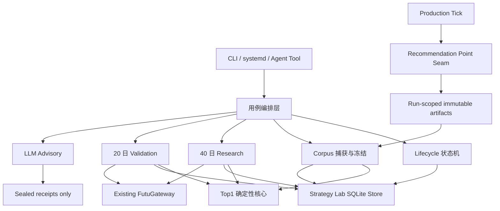

# Sell Put Top1 实验平台模块化技术实现方案

## 0. 文档状态

- 产品合同来源：`docs/plans/sell-put-top1-optimization-loop-mvp-20260814.md`
- 产品合同冻结 SHA-256：`ef30f378ff02215223456180ff03fb9a4e4e87dd048952fafc3ea9024f46326c`
- 源码基线：`main@c1d759ae10352d2a5664739e2053bb396e698919`
- 本文定位：把已确认的产品合同拆成可独立实现、测试和交付的技术模块
- 本文不改变：40 日 research、20 日 hidden validation、Top1 资金效率指标、硬风控、人工授权、实验功能默认关闭和 LLM advisory 边界
- 本文不授权：实现、生产配置修改、服务安装、真实实验、发布或部署

## 1. 技术目标

首发实现不能成为一个同时处理 Candidate Engine、SQLite、OpenD、定时器、LLM 和 CLI 的大模块。每个模块必须有单一职责、稳定输入输出和可独立运行的测试。

核心约束：

1. 生产 tick 只负责发布正式推荐点证据，不读取实验库；
2. Candidate Engine 继续是 Sell Put 排序唯一权威；
3. 纯计算不读文件、SQLite、环境变量、时钟或 OpenD；
4. research 与 validation 共用数学函数，但不共用成交证据路径；
5. SQLite 负责跨表原子性，不承载策略判断；
6. `advance` 只编排，不计算指标、不解析 provider payload、不直接写 SQL；
7. CLI、systemd 和 Agent tools 只是入口，不拥有业务规则；
8. LLM 只消费已封闭回执，不成为实验推进依赖。

## 2. 总体模块图



依赖只能沿箭头方向。任何反向 import、循环 import 或通过 CLI 绕回业务层都视为架构失败。

## 3. 模块划分

### 3.1 M1A：Top1 排序与投影核心

建议文件：

- `src/application/strategy_lab/top1/ranking.py`

职责：

- ranking/projection schema/version 常量、严格白名单验证和 canonical hash；
- 从 opening snapshot 生成 `sell_put_ranking_projection.v1`；
- 在同一 `U_rank` 上调用 Candidate Engine 重排并选 Top1；
- 对投影缺字段、hash 冲突、accepted IDs 不一致和 baseline parity 偏差产生稳定 reason codes。

公开合同：

```text
build_ranking_projection(opening_snapshot) -> projection
rerank_recommendation_point(projection, ranking_profile) -> ranking_result
```

允许依赖：stdlib、`domain/domain/engine/candidate_engine.py`。

禁止依赖：SciPy、SQLite、filesystem、OpenD、CLI、service renderer、Agent tools、LLM、research/validation 状态。

### 3.1B M1B：实验规格、经济与统计核心

建议文件：

- `src/application/strategy_lab/top1/contracts.py`
- `src/application/strategy_lab/top1/economics.py`
- `src/application/strategy_lab/top1/statistics.py`

职责：

- ExperimentSpec 白名单、分阶段 spec hash 和 behavior binding；
- 在费用合同已锁定的前提下计算到期经济 PnL、资金效率、point delta、日均值、t 置信下界和最差尾部；
- 根据已传入的完整事实产生确定性 reason codes。

公开合同：

```text
validate_experiment_spec(payload) -> validated_spec
build_behavior_binding(contract_versions) -> sha256
calculate_expiry_efficiency(economic_facts) -> efficiency_result
summarize_paired_daily_deltas(day_rows, policy) -> metric_result
```

允许依赖：stdlib、SciPy、`domain/domain/engine/candidate_engine.py`。

禁止依赖：SQLite、filesystem、OpenD、CLI、service renderer、Agent tools、LLM、research/validation 状态。

### 3.2 M2：生产推荐点证据 Seam

建议文件：

- `src/application/recommendation_point.py`
- 现有 tick 文件中的最小 observer 接线

职责：

- 在 scheduler watermark 与 terminal opening snapshot 均封闭后构造 `recommendation_point.v1`；
- 只发布 run/account-scoped write-once artifact；
- maintainer availability 关闭、manual/force/smoke/replay 或任一前置证据不成立时不发布；
- observer 失败只形成实验 gap，不改变生产 tick、候选、通知或 watermark 结果。

公开合同：

```text
build_recommendation_point(scheduler_decision, terminal_manifest, opening_snapshot) -> payload
publish_recommendation_point(run_workspace, payload) -> published | idempotent | conflict
```

允许依赖：现有 scheduler/run workspace/opening snapshot 合同、原子文件写入；maintainer availability 的纯解析与 effective gate 组合在 M2 当前用例中实现，不反向塞入排序模块。

禁止依赖：实验 SQLite、corpus、research、validation、OpenD、LLM。

### 3.3 M3：实验账本与生命周期

建议文件：

- `src/infrastructure/strategy_lab/experiment_store.py`
- `src/application/strategy_lab/top1/lifecycle.py`
- `src/application/strategy_lab/top1/terminal_projection.py`

职责：

- feature opt-in、experiment、authorization、generation、event、hidden commitment 和 collection slot；
- phase/progress/terminal CAS；
- completed/aborted 竞争同一个 terminal projection request；
- requested bytes 的发布、崩溃恢复和最终 ref/hash CAS；
- 只读 status/receipt projection。

公开合同按业务命令提供，不暴露通用 CRUD：

```text
prepare_experiment(...)
authorize_research(...)
lock_challenger(...)
authorize_validation(...)
commit_validation_point(...)
seal_generation(...)
terminate_experiment(...)
recover_terminal_projection(...)
read_public_status(...)
```

SQLite 保持一个 store，因为 hidden slot、job 注册和 terminal request 必须在同一事务内提交。不要为了目录整齐拆成多个 repository，再由应用层拼跨库事务。store 只执行 schema、查询、约束和原子命令，不决定 leader、指标或市场结果。

依赖方向固定：`experiment_store.py` 只依赖 stdlib/`sqlite3`，不得反向 import application；`lifecycle.py` 和 `terminal_projection.py` 可以依赖 M1B contracts、store 和现有 canonical artifact writer。

禁止依赖：Candidate Engine、OpenD、CLI、service、Agent tools、LLM。

迁移按模块逐步增加：M3 只建 feature/experiment/event/generation/commitment 基础表；corpus 和 validation 表由后续模块的下一 schema migration 增加，不提前建空表。

### 3.4 M4：Corpus 捕获与研究数据冻结

建议文件：

- `src/application/strategy_lab/top1/corpus.py`
- `src/application/strategy_lab/top1/readiness.py` 中的 corpus 部分

职责：

- 在首个 target 前封存 `corpus_day_expectation.v1`；
- 消费 M2 的 point 与 opening snapshot，调用 M1A 生成最小 ranking projection；
- 把 write-once projection 复制到长期 corpus 并写 SQLite 索引；
- 按 cutoff 冻结最新连续、完整且成熟的固定 40 日 dataset；
- source run 删除后仍可依 projection 重排。

公开合同：

```text
seal_day_expectation(schedule, trading_date) -> expectation
capture_recommendation_point(point_ref) -> capture_result
freeze_research_dataset(account, cutoff, required_days=40) -> dataset_ref | blocker
read_corpus_status(account) -> compact_status
```

允许依赖：M1A、M2 artifacts、M3 store、opening snapshot validator。

禁止依赖：experiment phase transition、research 统计、validation、OpenD、LLM。

### 3.5 M5：40 日 Research

建议文件：

- `src/application/strategy_lab/top1/research.py`
- `src/infrastructure/futu_gateway.py` 的最小 history K-line/quota receipt 扩展

职责：

- 读取一个已冻结 corpus dataset；
- 为 baseline 和全部 levels 调用 M1A 重排，调用 M1B 经济/统计合同；
- 去重获取 exact-expiration historical close/quota receipts；
- 使用 `t0_sell_limit` 反事实假设计算 40 日日级结果；
- 产生唯一 leader、无胜者或证据不足 research receipt；
- 把 research terminal 交给 M3 封存。

公开合同：

```text
evaluate_research(dataset, close_receipts, fee_contract) -> research_evaluation
run_research(experiment_id, authorized_spec_hash) -> sealed_research_receipt
```

`evaluate_research()` 是纯函数；`run_research()` 才负责编排 store/provider。两者放在同文件即可，不预建 evaluator interface 或 provider registry。

禁止依赖：fill observation、validation、advance、service、LLM。

### 3.6 M6：20 日 Validation

建议文件：

- `src/application/strategy_lab/top1/fill_observation.py`
- `src/application/strategy_lab/top1/outcome.py`
- `src/application/strategy_lab/top1/validation.py`

职责：

- `validation.py`：hidden commitment、point ranking、日分区完整性和最终三态结论；
- `fill_observation.py`：`scheduled_point_first_observed_cross.v1` 监视与最小 quote receipt；
- `outcome.py`：terms capture、due queue、exact-expiration close、费用和 outcome receipt；
- 三者只通过 M3 的原子命令提交状态，不互相读取内部表。

公开合同：

```text
consume_validation_point(experiment, point_ref) -> decision_intent
observe_active_contracts(experiment, observation_point) -> observation_intents
settle_due_outcomes(experiment, now) -> outcome_intents
conclude_validation(experiment) -> final_result | blocker
```

允许依赖：M1A、M1B、M3、M4、现有 FutuGateway receipts。

禁止依赖：research evaluator、LLM、service renderer、CLI。

research 与 validation 只共享 M1A/M1B 的排序、经济和统计合同；不得互相 import，也不得把 research 的 `t0_sell_limit` 假设复用于 validation 成交证据。

### 3.7 M7：自动推进与运行交付

建议文件：

- `src/application/strategy_lab/top1/advance.py`
- `src/interfaces/cli/strategy_lab_top1.py`（新，现有 `research.py` 只注册和委派）
- `src/application/service_deploy.py`
- `src/application/service_drift.py`
- `src/interfaces/cli/service_ops.py`

职责：

- `advance --scheduled` 依次执行 gate 检查、corpus capture、active validation、due jobs 和 terminal recovery；
- 一个实验失败不能阻止同账户其他实验的合法推进；
- renderer/profile/drift 交付默认关闭的 Linux/systemd timer；
- installed readiness 只读验证 profile/env/unit/cadence，不创建或启动实验。

`advance.py` 只能调用 M3/M4/M6 的公开函数。以下逻辑不得出现在其中：排序 tuple、PnL 公式、t 统计、SQL、OpenD payload 解析、Prompt 生成。

### 3.8 M8：回执与 LLM Advisory

建议文件：

- `src/application/strategy_lab/top1/receipt.py`
- 现有 `src/application/strategy_lab/llm_context.py` 的 Top1 Prompt 常量与 context builder
- `src/application/agent_tools/strategy_lab.py`

职责：

- 从已封闭 research/final receipt 构造 redacted context；
- 严格校验三种 Prompt mode 的输入输出；
- 保存紧凑 advisory 与未授权下一假设草案；
- unsupported 草案只产生本地 capability gap receipt。

禁止依赖：advance、OpenD、Candidate Engine、隐藏中间结果、service renderer。timer 永不调用 M8。

## 4. 数据所有权

| 数据 | 唯一写入模块 | 其他模块权限 |
|---|---|---|
| `recommendation_point.v1` | M2 | M4 只读并复制最小投影 |
| `opening_candidate_snapshot.v1` | 现有生产 snapshot owner | M1A/M4 只读验证 |
| corpus expectation/projection/index | M4 | M5 只读冻结引用 |
| feature/experiment/authorization/event | M3 | 其他模块只能调用原子命令 |
| research rows/receipt | M5 | M3 封存，M8 只读最终视图 |
| validation decisions/days | M6 validation | M3 事务提交，M8 不可读中间值 |
| fill observations | M6 fill observation | M6 validation/outcome 只读已提交 receipt |
| outcome jobs/facts | M6 outcome | M6 validation 只读终态 |
| terminal artifacts | M3 terminal projection | 其他模块只提供 canonical intent |
| LLM advisory/draft | M8 | 不得反写实验结论或授权 |

模块不得直接写入其他模块拥有的 artifact 或表。需要跨表原子性的操作必须新增一个有业务含义的 store command，不允许调用方连续执行多个通用 CRUD。

## 5. Import 与运行边界

新增 `tests/test_strategy_lab_top1_architecture.py`，使用现有 AST/import 检查模式固定以下规则：

1. M1A/M1B 不 import `src.infrastructure`、`src.interfaces` 或其他 Top1 用例模块；
2. M2 不 import M3–M8 或实验 store；
3. M5 不 import M6/M7/M8；
4. M6 不 import M5/M7/M8；
5. M8 不 import M6/M7、OpenD 或 Candidate Engine；
6. `src/interfaces/cli/strategy_lab_top1.py` 可以 import用例，任何用例不得反向 import CLI；
7. `scripts/generate_dependency_graph.py --check` 不出现新增 production module cycle。

不引入 event bus、dependency injection container、repository interface、capability registry 或通用 workflow engine。当前只有一个 SQLite store 和一个 OpenD provider，直接注入具体对象或函数即可。

## 6. 实施 Work Units

每个 Work Unit 独立提交、独立验收。默认串行；只有依赖图明确无交集时才并行。

| 顺序 | Work Unit | 交付模块 | 前置 | 独立退出门 |
|---|---|---|---|---|
| W0A | Build preflight | 静态合同/源码可实施性 | 无 | 真源、字段、依赖和纯计算 fixture 可实施；不要求真实 provider/corpus |
| W0R | Runtime capability | 只读证据/最小 remediation | W0A | HK fee/outcome、calendar/K-line/quota、observation/terms capacity 全 green 后才允许 provider-dependent research/validation 或真实试点 |
| W1A | Ranking/projection core | M1A | W0A green | 无 I/O fixture 完成三 profile parity、严格 projection 和删源重排 |
| W1B | Spec/economics/statistics | M1B | W1A + fee contract locked | ExperimentSpec/behavior hash、经济计算和 20/40 日统计 |
| W2 | Producer seam | M2 | W1A contracts | 正式 scheduled point write-once；manual/force 排除；observer 失败不影响 tick |
| W3 | Ledger/lifecycle | M3 | W1B contracts | 空库/前版迁移、授权/slot/terminal CAS、崩溃恢复全部用合成数据通过 |
| W4 | Corpus | M4 | W2 + W3 | expectation/capture/freeze、source 删除后重排、gap fail closed |
| W5 | Research | M5 | W0R + W1B + W3 + W4 | 合成 40 日完整闭环；真实 provider receipt 读取可单独 dry-run 验证 |
| W6 | Validation | M6 | W0R + W1B + W3 + W4 | 合成 20 日跨 decision/outcome terminal；隐藏、并发、缺证据三态通过 |
| W7 | Advance/service | M7 | W3 + W4 + W6 | scheduled orchestration、profile round-trip no drift、readiness；不安装 unit |
| W8 | LLM advisory | M8 | W3 + W5 + W6 | Prompt/schema/hash/redaction；模型失败不影响 sealed receipt |
| W9 | Aggregate integration | 只补 seam 测试 | W1A–W8 | 一份合成实验跨模块闭环；无新增业务实现 |

W0A 是源码实施准入；W0R 是 provider-dependent research/validation 和真实试点准入。预期的 HK fee 或 OpenD receipt 仍为 red 时，可继续 W1A–W4 中无真实 provider 读取的源码实现，但不得运行 W5/W6 的 provider 路径或真实试点；该缺口只能由独立最小 remediation 关闭。

## 7. 每个 Work Unit 的固定交付格式

每个模块实现前先冻结一页 handoff：

```text
目标
输入 schema
输出 schema
允许依赖
禁止依赖
写入的数据/路径
幂等键与冲突语义
focused tests
退出门
```

实现完成时只提供：

- 本模块改动文件；
- focused test 结果；
- architecture guard 结果；
- 对下一模块开放的稳定合同；
- 未解决但不属于本模块的问题。

不得在一个 Work Unit 中顺手实现后续模块，也不得为了“以后扩展”预建空表、抽象接口或通用 registry。

## 8. 测试策略

### 8.1 模块测试

- M1A：排序/profile/projection 纯输入输出 golden，无临时目录、SQLite 或 mock provider；
- M1B：ExperimentSpec/behavior hash 与 20/40 日经济统计手算 fixture；
- M2：run workspace fixture，证明生产返回值不受 observer 影响；
- M3：临时 SQLite + 崩溃注入，验证事务/CAS/outbox；
- M4：不可变 artifact fixture，验证完整 40 日与 gap；
- M5：冻结 dataset + provider receipt fixture，不直接 mock内部数学函数；
- M6：fake clock + quote/terms/close receipts，隐藏中间结果；
- M7：renderer/profile/systemd root fixture，不调用真实 systemctl；
- M8：静态 Prompt golden、redaction 和 schema failure。

### 8.2 Seam 合同测试

只保留以下跨模块测试，避免大而脆的全链 mock：

1. M2 point → M4 corpus projection；
2. M4 dataset → M5 research receipt；
3. M5 leader → M3 validation authorization；
4. M4 point → M6 decision/fill/outcome；
5. M6 final → M8 redacted context；
6. M7 profile render → drift no-op/篡改/retire。

### 8.3 Aggregate test

W9 只新增一份合成 40+20 闭环 fixture，复用各模块公开 API。若为了通过 aggregate test 必须从外部读取某模块私有表、调用下划线函数或 monkeypatch 业务计算，说明模块边界失败，应回到对应模块修复。

## 9. 首个实施建议

下一步不是同时创建全部目录和空文件。W0A 已确认静态排序/投影合同可实施后，第一个代码模块是 W1A；W0R 的 red/unknown 同时保持并由独立 remediation 处理，不用合成回执伪造 runtime green。

W1A 完成前不接 CLI、不建 SQLite、不写 timer、不加 Agent tool。这样即使后续实现暂停，仓库里也只留下一个可验证、可复用且不改变生产默认行为的 Top1 排序/投影核心。
